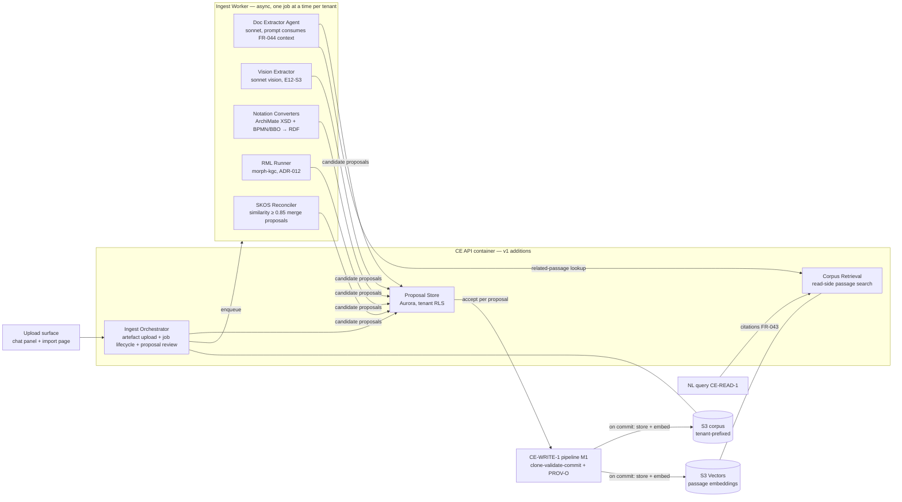

# Constitution Engine — v1.0 Tech-Spec Delta (cold-start ingest)

**Scope rule:** this document contains ONLY what changes from M1 + [m2-delta](m2-delta.md).
`architecture.md`, `data-model.md`, `business-process.md`, and `testing-strategy.md` remain
authoritative for everything not restated here. Contract shapes are canonical in
[`contracts.md`](../../../contracts.md) — cited, never redefined. Decisions:
[ADR-010](../decisions/ADR-010.md) (materialised-copy, closes OQ-17 + OQ-14),
[ADR-011](../decisions/ADR-011.md) (corpus store — Accepted with pins: per-index
`embedding_model_id`+`dimensions` metadata, simple splitters + fixed-window fallback, no ML
layout parsing),
[ADR-012](../decisions/ADR-012.md) (R2RML/RML layer, morph-kgc), and program-level
[ADR-003](../../../decisions/ADR-003-document-corpus.md) (document corpus companion store —
note: distinct from CE's own ADR-003, which is the spike write-back guard).

**Governing invariant (PRD §10 risk):** every ingest path is AI-*assisted*, per-proposal
human-reviewed, SHACL-gated, and commits **only** through CE-WRITE-1
(`POST /api/operations/apply` pipeline, reused via the ADR-006 dispatch pattern). CI asserts no
second mutation path (§9). Corpus retrieval is strictly read-side (ADR-003/011).

## 1. Ingest pipeline architecture (Arch Law 5)

One new component group inside the existing API container plus one async worker. Everything
else in `architecture.md` C4 unchanged.

- **Async job model:** upload returns immediately with a job id; extraction runs in the worker
  (Fargate task, same codebase — no new service). AI provider unavailable ⟹ `503` at job
  creation for AI paths (E12-S1/S3), **no partial extraction committed**; deterministic paths
  (E12-S2/S4) do not depend on the LLM and stay live.
- **One proposal flow for all five stories:** every extractor/converter emits *candidate
  proposals* into the Proposal Store; the human accepts/rejects **per proposal**; each accepted
  proposal replays the M1 propose-mutations pipeline (prospective SHACL on throwaway clone →
  CE-WRITE-1 commit). E12-S1's chat panel and the import page are two views over the same
  proposal rows.
- **Find-existing-node reuse:** candidate entities run the M1 same-label + same-kind
  reconciliation *before* surfacing, so proposals link to existing IRIs rather than duplicating
  (re-mention-reuses-not-duplicates test, §9).

## 2. New endpoints + p95 targets (Arch Law 2)

All CE-internal UI surface — **no inter-engine contract change**; CE-READ-1's NL response gains
only the additive `citations` array (ADR-011 §4; wording delta for contracts.md proposed to the
coordinator, not applied here). Targets at the 100k-triple seeded store, measured like
m2-delta §1.

| Endpoint | Purpose | p95 target |
|---|---|---|
| `POST /api/ingest/artefacts` | multipart upload (≤ 25 MB v1) + FR-044 context fields → `201 { artefact_iri, job_id }`; enqueues extraction | ≤ 2 s (excl. extraction — async) |
| `GET /api/ingest/jobs/{id}` | job status: `queued\|extracting\|awaiting-review\|failed\|done` + committed-vs-skipped summary | ≤ 200 ms |
| `GET /api/ingest/jobs/{id}/proposals` | paginated proposal list (op-list rendering, confidence, matched existing IRIs, per-element/per-row reasons) | ≤ 300 ms |
| `POST /api/ingest/proposals/{id}/accept` | prospective SHACL + CE-WRITE-1 commit of that proposal | ≤ 2.8 s (= 2 s validation budget + 800 ms write budget) |
| `POST /api/ingest/proposals/{id}/reject` | mark rejected (kept for audit; job summary counts it) | ≤ 200 ms |
| `GET /api/corpus/search?q=&k=` | read-side passage retrieval (tenant-filtered top-k, ADR-011 §3) | ≤ 500 ms |
| `GET /api/corpus/artefacts/{iri}` | artefact metadata + presigned S3 GET for the original | ≤ 300 ms |

- Accept/reject and job/proposal reads require the same JWT + tenant context as all CE
  endpoints; `principal_iri` becomes the PROV-O approver on accept.
- SHACL `sh:Violation` on accept ⟹ `422` with violations rendered against the proposal, graph
  unchanged (FR-038 AC). Batch-accept is a client loop over single accepts in v1.
  <!-- ponytail: no server-side batch-accept endpoint; add if review UX shows >50-proposal
  jobs are the norm -->

## 3. Element-type → BPMO kind mapping (roadmap DoR item, E12-S2)

Reference basis: ArchiMEO / archimate2rdf (reference only, not a dependency — epic technical
note). Unmapped types default to **`Concept`, flagged for review, never silently dropped**
(tunable per workspace via PLAT-SETTINGS-1). Both tables are shipped as data (a versioned
mapping file), not code branches.

**BPMN (BBO) → BPMO:**

| BPMN element | BPMO kind / predicate |
|---|---|
| `process`, `subProcess` | `Process` (subProcess also `partOf` parent) |
| `task`, `userTask`, `serviceTask`, `scriptTask`, `manualTask`, `callActivity` | `Activity` (+ parent `hasStep`) |
| `startEvent`, `endEvent`, `intermediate*Event`, `boundaryEvent` | `Event` (start events also `triggeredBy` on the process) |
| `lane`, `pool`/`participant` | `Actor` (lane-contained activities get `performedBy`) |
| `dataObject`, `dataStore`, `dataInput`, `dataOutput` | `DataAsset` (associations → `consumes`/`produces` by direction) |
| `sequenceFlow` | ordering within `hasStep` (no distinct edge kind) |
| `messageFlow` | `dependsOn` between the connected elements' mapped resources |
| `exclusiveGateway`, `parallelGateway`, other gateways | unmapped → `Concept` flagged (control-flow logic has no BPMO kind; branch conditions land in the activity description) |

**ArchiMate 3 (Exchange Format) → BPMO:**

| ArchiMate element | BPMO kind |
|---|---|
| `BusinessProcess` | `Process` |
| `BusinessFunction`, `Capability` | `BusinessCapability` |
| `BusinessActor`, `BusinessRole` | `Actor` |
| `BusinessEvent` | `Event` |
| `BusinessObject`, `DataObject`, `Artifact` | `DataAsset` |
| `ApplicationComponent`, `Node`, `Device`, `SystemSoftware` | `System` |
| `ApplicationService`, `BusinessService`, `TechnologyService` | `Service` |
| `Goal`, `Driver`, `Outcome` | `Goal` |
| `Principle`, `Requirement`, `Constraint` | `Policy` |
| `Grouping`, `Location`, `Meaning`, `Value`, others | unmapped → `Concept` flagged |

| ArchiMate relationship | BPMO predicate |
|---|---|
| `Assignment` (actor→process/function) | `performedBy` (inverse direction) |
| `Serving` — **split by endpoint kinds** (Fable ontology review 2026-07-08; data-model.md:248 gives `runsOn` ArchiMate provenance = Serving): tech-node/System serving a Service ⟹ hosting, emit **`service runsOn system`**; all other pairs ⟹ consumer `dependsOn` provider | `runsOn` / `dependsOn` |
| `Realization` — process→capability ⟹ `realizes` (data-model.md:244); component→service ⟹ hosting, emit **`service runsOn system`** (hosted thing is the subject — never system-as-subject) | `realizes` / `runsOn` |
| `Access` | `accesses` (service/system→DataAsset; read/write mode in description) |
| `Composition`, `Aggregation` | `partOf` |
| `Triggering` (event→process) | `triggeredBy` |
| `Influence`, `Association`, others | unmapped → `describes` with flag |

## 4. Per-notation well-formedness SHACL (E12-S2)

Two shape files in the framework shapes graph (`urn:weave:g:framework`, release-gated — these
gate *import*, not tenant data): `weave:ArchimateImportShape`, `weave:BpmnImportShape`. Checked
against the converter's intermediate RDF **before** any CE-WRITE-1 dispatch:

- every element has an id, a type, and a resolvable kind mapping (or an explicit
  unmapped→Concept flag);
- every relationship references two elements present in the file;
- notation-required structure holds (BPMN: flow nodes belong to a process; ArchiMate: elements
  belong to a model + layer).

Failing file ⟹ whole-file reject with per-element reasons, nothing committed. Partially-valid
file (well-formed file, some rows/elements failing *tenant* SHACL at commit) ⟹ valid elements
commit, skipped ones reported with reasons — the FR-039/FR-041 skip-and-report semantics.

## 5. Corpus companion store (E12-S6/S7 — per ADR-011, Accepted)

Pinned by program ADR-003; implementation per ADR-011 (chunking, Titan v2 embeddings,
filtered top-k, citations array; pins 1a/2a — index metadata, fixed-window fallback). Delta
facts not restated there:

- **S3 layout:** `s3://weave-corpus-{env}/{tenant_id}/{artefact_hash}/original.{ext}` +
  `passages.jsonl`; S3 Vectors index keyed by the same tenant prefix, filter injected from
  request context (fail-closed, ADR-001 pattern — never caller-supplied).
- **Graph footprint:** the artefact is a `prov:Entity` in the tenant provenance graph
  (`urn:weave:g:tenant:{id}:prov`) — **no new named graph**, and no `DataAsset` individual is
  auto-created in the draft graph (uploads must not pollute the model; the extractor may
  *propose* a DataAsset if the document warrants one, through normal review).
- **FR-044 pre-ingestion context:** source system, owner, date-of-truth, sensitivity, free-text
  context stored as annotation properties on the ingest `prov:Activity`; the extractor prompt
  template interpolates them (testable: prompt-assembly unit test). Skipping the step still
  permits ingest with system-captured provenance only.
- **Lifecycle:** embed on ingest commit; re-embed on re-ingest of the same artefact; delete
  corpus prefix + vectors on tenant deletion (rides the ADR-001 tenant-deletion path).

## 6. Tunables (OQ-18 — stays OPEN)

All served through PLAT-SETTINGS-1's cascade; spec defaults below. OQ-18 (calibration against
real client documents) remains open post-v1 — the PO owns closing it; nothing in the pipeline
hard-codes these values.

| Setting | Default | Used by |
|---|---|---|
| `ingest.confidence_flag_threshold` | 0.6 | E12-S1/S3 (below ⟹ flagged, never pre-selected) |
| `ingest.merge_similarity_threshold` | 0.85 | E12-S5 (below ⟹ never auto-proposed) |
| `ingest.unmapped_kind_default` | `Concept` | E12-S2/S4 |
| `ingest.datatype_inference_sample_rows` | 20 | E12-S4 |
| `corpus.retrieval_top_k` | 8 | corpus search / NL citations |

## 7. Page + Lighthouse targets (Arch Law 3)

One new page: **Import & Ingest** (upload, job list, proposal review; the chat panel reuses the
M1 chat surface for E12-S1 review). Inherits the M1 gate: performance ≥ 90, accessibility ≥ 95
(WCAG 2.1 AA, zero axe violations, full keyboard nav across the proposal review flow), best
practices ≥ 90, initial JS ≤ 200 KB gzipped. Proposal lists paginate; no unbounded DOM from
large jobs.

## 8. Testing-strategy delta

Extends `testing-strategy.md` (pyramid proportions, frameworks, mutation ≥ 60% unchanged):

- **Release-gating (ADR-001 rank):** cross-tenant vector-isolation test — tenant-A passage must
  never surface in tenant-B `GET /api/corpus/search` (seeded two-tenant fixture).
- **CI structural asserts (extend the no-second-mutation-path check):** every module under
  `ingest/` reaches the graph only via the CE-WRITE-1 dispatch; `corpus/` modules import no
  mutation pipeline symbol (read-side-only, ADR-003).
- **Named epic ACs → named tests:** `re-mention-reuses-not-duplicates` (E12-S1),
  `503-commits-nothing` (E12-S1/S3), `malformed-file-commits-nothing` (E12-S2/S4),
  `BPMN-task-maps-to-Activity` (+ one per mapping-table row group), `failing-rows-skip-and-report`
  (E12-S4), `below-threshold-merge-never-auto` (E12-S5), `low-confidence-flagged-not-preselected`
  (E12-S1/S3), `prompt-receives-pre-ingestion-context` (E12-S7), `citation-pairs-iri-and-passage`
  (E12-S6).
- **E2E (Playwright, Page Object Model):** upload document → review proposals in chat → accept
  one, reject one → assert graph state changed via CE-READ-1 and PROV-O activity names LLM
  extractor + human approver + `prov:used` artefact (Law B: asserts backend state).
- **No real cloud (Law F):** S3 + S3 Vectors via LocalStack/moto-style local emulation;
  Bedrock/LLM + vision + embeddings mocked with recorded fixtures; morph-kgc runs on fixture
  SQLite/CSV.

## 9. Invariants delta (feeds `invariants.md`, Arch Law 10)

- All five ingest paths commit only via the CE-WRITE-1 dispatch — verify-by:
  `packages/backend/src/weave_backend/ingest/` + grep: no import of store-level write/commit
  symbols outside the operations dispatch module.
- Corpus is read-side only — verify-by: `packages/backend/src/weave_backend/corpus/` + grep: no
  import of the operations/apply pipeline; no POST route under `/api/corpus/*` in the router
  table.
- Vector retrieval tenant filter is request-context-injected, never caller-supplied — verify-by:
  corpus search handler + grep: tenant filter sourced from auth context, no `tenant` query param.
- Every ingest commit's PROV-O activity carries extractor (LLM/vision/converter), human
  approver, and `prov:used` source artefact — verify-by: ingest accept path + grep
  `prov:used` / approver attribution in the activity builder.
- Confidence/similarity/unmapped-kind values read from settings, never literal in ingest logic —
  verify-by: grep `0.6`/`0.85` under `ingest/` (must only appear in the settings-defaults
  module).
- Artefact upload creates no draft-graph individual — verify-by: upload handler + grep: no
  operations dispatch call in the artefact-creation path.
- R2RML sources are uploaded dumps only, no live connection strings — verify-by: RML runner
  config schema + grep: no DSN/connection-string field (ADR-012).
- Tenant vector index records `embedding_model_id` + `dimensions` metadata; embed calls assert
  the index's model — never mixed models in one index (ADR-011 pin 2a) — verify-by: corpus
  index-creation + embed path, grep `embedding_model_id` metadata write and pre-embed assert.
- Every upload chunks: unrecognised formats hit the fixed-window-with-overlap fallback, never a
  format error (ADR-011 pin 1a) — verify-by: splitter dispatch, grep fallback branch + test
  `unknown-format-still-chunks`.
