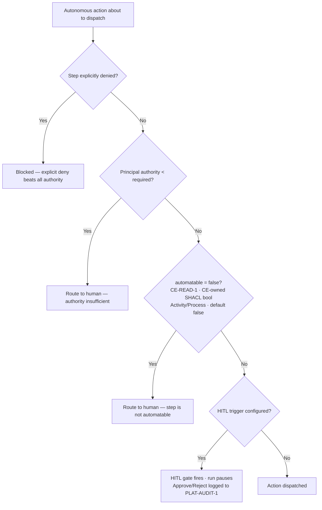
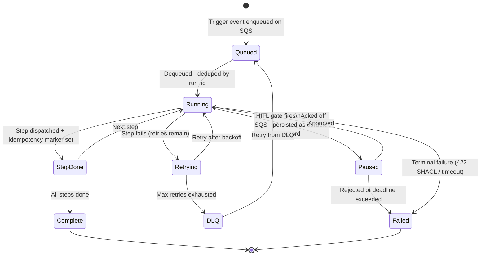
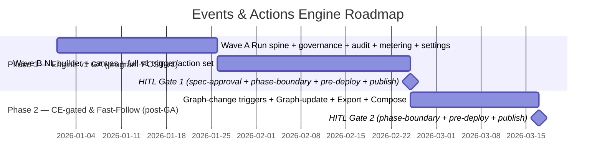

# Events & Actions Engine

> The automation layer that makes the company reactive — events in the company's integrated systems
> (a delivery arriving at a store, a Jira ticket changing state, a webhook firing, a scheduled time)
> automatically trigger governed actions (notifications, API calls, agent runs, or graph updates),
> grounded in the company's documented processes and rules, with changes inside the graph itself
> available as an additional trigger source. This replaces brittle, hand-wired point-to-point
> integrations with automation the business can see, reason about, and trust. The whole engine is
> POST-MVP (program build order #5); its positioning is **Foundry-style ontology-grounded, governed
> actions combined with n8n-style multi-step flexibility — for the mid-market**.

## 1. Brief

### Mission statement

We are building the Weave Events & Actions Engine — the automation layer that makes the company
reactive — so that events in the company's integrated systems (a delivery arriving at a store, a Jira
ticket changing state, a webhook firing, a scheduled time) automatically trigger governed actions —
notifications, API calls, agent runs, or graph updates — grounded in the company's documented
processes and rules, with changes inside the graph itself available as an additional trigger source.
This replaces brittle, hand-wired point-to-point integrations with automation the business can see,
reason about, and trust.

### Problem

Companies automate today with tools that are either too shallow, too ungrounded, or too expensive —
and none of them understand the business they are automating.

- **Consumer automation is too shallow.** Tools like IFTTT offer single-step "if-this-then-that"
  applets with no multi-step logic, no governance, and no model of the organisation — unusable for
  real business processes.
- **Developer iPaaS is powerful but ungrounded.** Tools like n8n, Zapier, and Make support
  multi-step workflows, branching, and hundreds of integrations, but every workflow is hand-wired
  against raw APIs with no shared model of the business. The automation has no semantic understanding
  of *what* it is acting on, no link to documented processes, and no built-in compliance — so it
  drifts into brittle, undocumented spaghetti that no one can reason about or govern.
- **Ontology-grounded automation exists only at the top end.** Palantir Foundry does it right —
  automations trigger on typed ontology conditions and run governed, typed Actions defined on the
  model — but it is an enterprise-only, heavyweight, high-cost platform out of reach for the
  mid-market.

The result is that the events flowing through a company's integrated systems (a delivery arriving, a
ticket changing state, a constraint being breached) are either ignored or wired into automations that
no one trusts, because nothing connects those automations to the company's actual processes, rules,
and regulatory obligations.

The people who feel this are **operations and process owners** (who know the process but get brittle,
opaque automations) and **the compliance and risk functions** (who cannot prove that automated
actions follow policy). If this is not solved, Weave's graph describes how the company should react —
but the reactions themselves stay manual or ungoverned, and the "automate" third of
model → generate → automate never materialises.

### Vision (within 12 months)

- **Integrated-system events drive real automations.** An event in a connected system — a delivery
  arriving, a ticket changing state, a webhook, a schedule — triggers a governed action (a Slack
  notification, an API call, an agent run, a graph update) that runs a genuine business process end
  to end.
- **Automations are grounded, so they are predictable and high-quality.** Each automation is defined
  against the company's ontology, documented processes, and rules, so it acts on typed, understood
  entities and stays within policy — not hand-wired against raw APIs.
- **Natural-language authoring is the biggest advantage.** A user describes an automation in plain
  language that references the model directly — for example, "send a Slack notification to channel X
  whenever a delivery arrives, to automate this step of the goods-inwards process (the referenced
  BPMO `Process`/`Activity`) in the ontology" — and an AI agent builds it, grounded in the exact
  process step it points at. A visual, n8n-style flow canvas complements this for inspection and
  manual alteration, and the two representations stay in sync.
- **A two-tier automation model.** Simple flows are declarative JSON (runtime-interpreted); complex
  flows are Anthropic Agent SDK agentic actions/triggers (reasoning, multi-step) (`EA-AUTOMATION-1`).
  Execution is interpreter-first; portable Agent-SDK artefact export is a Phase 2 fast-follow.
  **Agentic capability (complex tier) is conditional on OQ-09 resolution** — the execution runtime
  binding (AgentCore vs ECS Fargate) and artefact-resolution contract must be decided before building.
- **Compliance is provable.** Because automations are grounded in the Constitution's rules and
  obligations, the compliance and risk functions can see and prove that automated actions follow
  policy, with a full audit trail.
- **Graph changes are an optional trigger too.** Where useful, a change inside the graph (a node
  added, a constraint violated) can also trigger an automation — a secondary convenience layered on
  top of the primary integrated-system event model.

### Scope — in scope

**Triggers (event sources)**

- **Primary — integrated-system events:** webhooks, Atlassian (Jira + Confluence), ServiceNow,
  Slack, cron/schedule, and similar events from the platform-managed connectors. The v1 managed
  connector set is the 7 platform connectors; Slack is a **platform-managed connector**
  (`PLAT-CONNECTOR-1`), not engine-owned. (Specific connector priority is deferred to the roadmap.)
  <!-- SHARED-HOISTED: full 7-connector list replaced with PLAT-CONNECTOR-1 ref — see ../contracts.md PLAT-CONNECTOR-1 -->
- **Secondary — graph-change triggers:** a node added, a relationship changed, or a constraint
  violated inside the graph may also trigger an automation — a convenience layered on top of the
  primary model, not the focus.

**Authoring (natural-language-first)**

- A conversational AI automation builder where the user describes an automation in plain language
  that references the model directly — specific BPMO entities: a `Process`, an `Activity` (a step
  within a process), an `Event`, or a governing `Policy` in the ontology — and an agent creates or
  edits it, grounded in what was referenced.
- A visual, n8n-style flow canvas that visualises the automation and allows manual inspection and
  alteration, kept in sync with the conversational representation.

**Automation model (two-tier — `EA-AUTOMATION-1`)**

- Simple tier: declarative JSON (event → action), runtime-interpreted. Complex tier: Anthropic Agent
  SDK agentic actions/triggers (reasoning, multi-step) — **conditional on OQ-09** (AgentCore vs ECS
  Fargate runtime binding + artefact-resolution contract; resolve-before-build).
- Execution is interpreter-first; a portable, downloadable Agent-SDK artefact export (skills,
  commands, agents — versioned, reusable, `pip`-installable) is a Phase 2 fast-follow.
- Every automation is grounded in the company's ontology, documented processes, and rules, so it
  acts on typed, understood entities and stays within policy.

**Actions (effects)**

- Notifications (e.g. Slack), API calls and webhooks to external systems, agent runs, and graph
  updates, with HITL approval gates available for sensitive actions.

**Governance & observability**

- An audit trail of every automation run (trigger, decision, action, outcome) and compliance
  grounding so the risk function can prove automated actions follow the Constitution's rules and
  obligations.

### Scope — out of scope

- **Authoring the ontology** — the BPMO `Process`/`Activity`/`Event` model, `Policy` rules, or any
  other kinds — that is the Constitution Engine; the Events Engine consumes and references them via
  `CE-READ-1`.
- **Self-healing of built products and the dark factory, and engine self-improvement** — those live
  in the Build Engine. This engine automates the *business*, not Weave's own delivery.
- **Generating apps, agents, or pipelines as shipped products** — the Build Engine. (Automations
  here use the Agent SDK as operational automation, not as delivered software products.)
- **The org-wide graph visualisation and collaborative canvas** — Graph Explorer (`GE-CANVAS-1`).
  The flow canvas here is automation-specific, not the company network view.
- **Building net-new managed connector infrastructure** — connectors are a platform-level managed
  capability this engine consumes; system-wide compliance checking of apps and integrations beyond
  automation runs is a related cross-cutting concern, not owned here.

### Target users

| User type | Description | Primary need |
|---|---|---|
| Operations / process owner | Owns a business process and wants its reactions automated | To automate a process step in plain language, grounded in the documented process, without code |
| Automation author / business analyst | Builds and maintains automations across processes | Natural-language authoring plus a visual canvas to refine, test, and manage automations |
| Compliance / risk officer | Accountable for automated actions following policy | Proof that every automation follows the Constitution's rules, with a full audit trail |
| Integration / platform engineer | Manages connectors and complex multi-step automations | Reliable event sources and action targets and control over branching, error handling, and retries |
| Process participant / domain staff | Recipient or actor of automated actions (e.g. a store manager) | Timely, reliable, correctly-targeted actions (e.g. the right Slack notification) |

### Success criteria

- [ ] **An automation runs end to end from a real event.** An event in an integrated system triggers
  a governed action (e.g. a Slack notification, API call, or agent run) that completes a genuine
  business process step. Measured by automation run logs; source: the engine's run history. Target:
  within 6 months of the engine's first release.
- [ ] **Natural-language authoring works and is grounded.** A user creates a working automation by
  describing it in plain language that references a specific BPMO `Process` or `Activity` (or a
  governing `Policy`), with no manual coding, and the resulting automation is linked to the element
  it referenced. Measured by authoring telemetry and the automation-to-ontology link; source:
  application analytics. Target: 30 days after GA.
- [ ] **The two representations stay in sync.** An automation authored conversationally is viewable
  and editable on the visual canvas and vice versa, with changes consistent across both. Measured by
  functional test and user sessions; source: QA + analytics. Target: at GA.
- [ ] **The two-tier model works; portable export is a fast-follow.** v1 runs simple declarative
  automations (interpreted) and complex Agent-SDK agentic actions; the downloadable, versioned
  Agent-SDK artefact export (skill, command, or agent) lands as a Phase-2 fast-follow. Measured by
  run logs (v1 tiers) and the artefact store (Phase-2 export); source: the run history + automation
  registry. Target: tiers at GA; export Phase 2.
- [ ] **Compliance is provable.** For at least one regulated process, the risk function can produce
  an audit report showing automated actions followed the Constitution's rules, with 100% of
  automation runs logged. Measured by an audit report and log completeness; source: the audit trail.
  Target: within 6 months of first release.

### Constraints

**Technical**

- Two-tier automation model (`EA-AUTOMATION-1`): simple declarative JSON (interpreted) + complex
  Anthropic Agent SDK agentic actions/triggers, consistent with the Build Engine's agent SDK
  decision. Interpreter-first in v1; portable artefact export is a fast-follow.
- Every automation must be grounded in the ontology — it references a BPMO `Process`, `Activity`, or
  governing `Policy` (the rule that `governedBy` links to that process); orphan automations with no
  link to the model are not allowed.
- Each automation targets a specific published ontology version (pinned), so that ontology evolution
  does not silently break a live automation; upgrading the pin is a deliberate action.
- Actions that affect external systems are governed; sensitive actions require an HITL approval gate
  before they fire.
- Event handling must be reliable: at-least-once delivery with idempotent actions, plus retry and
  error handling, so triggers are neither lost nor double-applied harmfully.
- The audit trail is the platform-owned immutable service (`PLAT-AUDIT-1`); this engine EMITS typed
  run/step events to it and its run-log is a VIEW — it keeps no independent signed store.
- Connectors are a platform-managed capability the engine consumes (`PLAT-CONNECTOR-1`, incl. Slack);
  secrets and credentials are held in AWS Secrets Manager, never in automation definitions.

**Business**

- Usage-based revenue is metered via `PLAT-BILLING-1` on BOTH dimensions: automation execution
  **per-run** and AI generation/agent usage **per-token**; runs must be metered (per-run) and agent
  token usage forwarded (per-token).
- Weave remains the source of truth even when an automation federates with external tools (e.g. Jira,
  ServiceNow).

**Timeline / sequencing**

- The engine depends on the Constitution Engine (it needs the ontology, documented processes, and
  rules to ground automations) and ships after it.
- Integrated-system events are the primary trigger model; graph-change triggers are a secondary
  convenience and must not be the primary load.
- Specific connector priority is deferred to the roadmap.

### Brief — key decisions (engine-specific)

> For the platform-wide master list see `CLAUDE.md § Architecture decisions (confirmed)` and the
> `weave-platform` brief. <!-- SHARED-HOISTED: project Laws / platform-wide decisions — see ../weave-spec.md §Program -->

| Decision | Rationale | Date |
|---|---|---|
| Integrated-system events are the primary trigger; graph-change triggers are a secondary convenience | The value is reacting to what happens in the real connected systems; internal graph triggers are a useful add-on, not the focus | 2026-06-26 |
| Natural-language-first authoring, with the NL able to reference BPMO `Process`/`Activity` entities (and governing `Policy`) directly | This is the engine's biggest advantage — describe an automation grounded in a specific documented process, no code | 2026-06-26 |
| A visual, n8n-style flow canvas complements NL authoring, kept in sync | Gives inspection and manual control alongside conversational authoring | 2026-06-26 |
| Two-tier automation model (`EA-AUTOMATION-1`): simple declarative (interpreted) + complex Agent SDK agentic; interpreter-first, portable export a Phase 2 fast-follow | Complex tier conditional on OQ-09 (AgentCore vs ECS Fargate binding + artefact-resolution contract — resolve-before-build); downloadable-artefact promise relaxed to "export follows" Phase 2 | 2026-06-30 |
| No orphan automations — every automation is grounded in the ontology | Grounding in documented processes and rules is what makes automations regulated, predictable, and high-quality (vs ungrounded iPaaS) | 2026-06-26 |
| Compliance is provable via an append-only audit trail | The risk function must be able to prove automated actions follow policy | 2026-06-26 |
| Boundary with the Build Engine | This engine automates the business; the Build Engine self-heals its own products and factory | 2026-06-26 |
| Positioning: Foundry-style ontology-grounded, governed actions plus n8n-style multi-step power, for the mid-market | Combines the rigour of Palantir Automate with practical workflow flexibility, at a tier Foundry does not serve | 2026-06-26 |
| Automations pin to a specific published ontology version | Prevents ontology evolution from silently breaking live automations; versioning lifecycle owned by Constitution Engine | 2026-06-26 |
| Connector priority deferred to the roadmap | Ordering is a sequencing decision better made with roadmap context | 2026-06-26 |

### Navigation

First-draft **secondary navigation** (left sidebar) for the **Automate** primary area. The primary
top-header nav is defined in the `weave-platform` brief.

- **Automations** — list of automations with status (active/draft/paused) and recent runs.
- **Builder** — create or edit an automation, natural-language-first with the visual n8n-style flow
  canvas alongside (the two stay in sync).
- **Runs / history** — run log: trigger, decision, action, outcome per execution.
- **Triggers & connectors** — configured event sources and action targets (webhooks, Atlassian,
  ServiceNow, Slack, cron) and their `PLAT-CONNECTOR-1` health.
- **Templates / library** — reusable automation patterns.
- **Audit & compliance** — the append-only audit trail and compliance reporting for regulated
  processes.
- **Automate settings** — defaults, rate limits, pinned ontology version, and approval policies.

## 2. Product Requirements (PRD)

**Phase:** Engine v1 GA (program position: post-v1 — builds after the lighthouse) · Phase 2
(graph-change triggers, portable artefact export, advanced composition). **Status:** Draft (not yet
human-confirmed — `confirmed_by: none`).

### 2.0 Product context

Companies automate today with tools that are either too shallow (IFTTT), too ungrounded (n8n /
Zapier / Make — powerful but hand-wired against raw APIs with no model of the business), or too
expensive (Palantir Foundry — ontology-grounded, but enterprise-only). The result: the events
flowing through a company's integrated systems either go ignored or get wired into automations that
no one trusts, because nothing connects those automations to the company's documented processes,
obligations, and rules. The Events & Actions Engine closes this gap. Its positioning:
**Foundry-style ontology-grounded, governed actions combined with n8n-style multi-step flexibility —
for the mid-market**.

Two ideas make it different from every iPaaS on the market:

1. **Grounding** — every automation is linked to a specific entity in the Constitution Engine graph —
   a BPMO `Process`, an `Activity` (a step within a process), or a governing `Policy` (the rule a
   process is `governedBy`) per `CE-READ-1` — and pinned to a published version via `CE-VERSION-1`.
   Automations act on typed, understood entities and stay within the company's documented policies.
   No orphan automations.
2. **Natural-language-first authoring** — a user describes an automation in plain language that
   references the model directly ("send a Slack notification to channel X whenever a delivery
   arrives, following the goods-inward receipt process") and an AI agent builds it, grounded in the
   exact process step it pointed at. A visual n8n-style flow canvas complements this for inspection
   and manual control, and both representations are projections of one canonical automation
   definition.

Automations are realised through the two-tier model in `EA-AUTOMATION-1`: a **simple tier**
(declarative JSON, runtime-interpreted) and a **complex tier** (Anthropic Agent SDK agentic
actions/triggers for reasoning and multi-step work). Execution is **interpreter-first**; a portable,
downloadable Agent-SDK artefact export is a **Phase 2 fast-follow**. The complex tier targets Phase 1
but is **conditional on OQ-09 resolution** (AgentCore Runtime vs ECS Fargate binding +
artefact-resolution contract — resolve-before-build; claiming "agentic v1" is premature until decided).

**Goals:**

1. Let an operations owner automate a business process in plain language, grounded in the documented
   process (via `CE-READ-1`), with no code required.
2. Ensure every automation is traceable to a BPMO `Process`/`Activity` or governing `Policy` — no
   orphan automations.
3. Provide a visual flow canvas for inspection and fine-grained control that is a projection of the
   same canonical definition as the chat (single source of truth, no divergent edit model).
4. Give the compliance function proof that automated actions followed the Constitution's rules,
   served as a filtered VIEW over the platform audit trail (`PLAT-AUDIT-1`) — 100% of runs logged.
5. Run automations reliably — at-least-once delivery, per-step idempotency, retry, and DLQ.
6. Meter every automation run via `PLAT-BILLING-1` (per-run dimension) so usage-based billing is
   accurate.

**Non-goals:**

| Non-goal | Owner instead |
|---|---|
| Authoring the ontology — the BPMO `Process`/`Activity`/`Event` model, `Policy` rules, or any other kinds | Constitution Engine (CE) |
| Building or operating managed connector infrastructure / credentials / ingestion | Platform (`PLAT-CONNECTOR-1`) |
| Self-healing of built products or the dark factory (`BE-SELFIMPROVE-1`) | Build Engine (E11) / Platform self-improvement |
| Generating shipped apps, agents, or pipelines as delivered software products | Build Engine (`BE-ARTEFACT-1`). Automations here use the Agent SDK for *operational* automation only |
| The org-wide graph visualisation / collaborative canvas | Graph Explorer (`GE-CANVAS-1`). The flow canvas here is automation-specific |
| Owning the immutable audit/provenance store | Platform (`PLAT-AUDIT-1`). This engine EMITS run/step events; its run-log is a view |
| Owning the notification delivery service | Platform (`PLAT-NOTIFY-1`). This engine publishes notification events |
| Owning agent service-principal identity | Platform (`PLAT-IDENTITY-1`). This engine requests per-automation principals |

**Personas & roles:**

| Persona | Description | Primary need | Permission level |
|---|---|---|---|
| Operations / process owner | Owns a business process, wants its reactions automated | Automate a process step in plain language, grounded in the documented process, no code | author |
| Automation author / business analyst | Builds and maintains automations across processes | NL authoring + visual canvas to refine, test, version, and manage automations | author / publish |
| Compliance / risk officer | Accountable for automated actions following policy | Proof, via audit reports, that every run followed CE rules | read (audit) |
| Integration / platform engineer | Manages connector references, complex multi-step automations | Reliable event sources/targets and control over branching, retries, error handling | author / admin |
| Process participant / domain staff | Recipient/actor of automated actions (e.g. store manager) | Timely, reliable, correctly-targeted actions (e.g. the right Slack notification) | read |
| Workspace admin | Governs automation defaults/limits in a workspace | Set defaults, rate limits, retention, HITL thresholds within the platform settings cascade | admin |

> Role slugs align with the platform RBAC model resolved through `PLAT-SETTINGS-1`. Agent (non-human)
> actors are service principals minted by `PLAT-IDENTITY-1`, never human roles.

> The detailed user stories (E1-S1 … E11-S1) with their full acceptance criteria are folded into
> **§3 Epics** under their owning epic, so each epic is self-contained.

### 2.1 Functional requirements

| ID | Requirement | Story | Priority | Engine-phase / depends-on |
|---|---|---|---|---|
| FR-001 | Automation registry: list with status, trigger type, linked CE entity (`CE-READ-1`), pinned version (`CE-VERSION-1`), last run, 7d run count; filters + search. Failure: CE unavailable → cached label + badge, list still renders | E1-S1 | P0 | MVP (CE-READ-1, CE-VERSION-1) |
| FR-002 | Health indicators: failed-run dot, stale-pin chip (`CE-VERSION-1` lag default ≥ 2, tunable), connector-degraded chip (`PLAT-CONNECTOR-1`), "health unknown" on health-API error | E1-S2 | P0 | MVP (PLAT-CONNECTOR-1) |
| FR-003 | Builder split-pane (NL chat + flow canvas) as projections of one canonical definition | E2-S1 | P0 | MVP |
| FR-004 | NL authoring: AI resolves referenced CE entity via `CE-READ-1` SPARQL (SELECT-only, paginated); drafts trigger+condition+action+grounding pinned via `CE-VERSION-1` | E2-S1 | P0 | MVP (CE-READ-1) |
| FR-005 | Multi-process disambiguation: 1 inline clarifying question; default 3 rounds (tunable) then fall back to "Link to ontology" searcher; never fabricate an IRI | E2-S1 | P0 | MVP |
| FR-006 | Follow-up chat edits commit transactionally to the canonical definition; "Undo last AI change"; failed AI edit leaves definition unchanged | E2-S2 | P0 | MVP |
| FR-007 | Save as Draft (no run) / Test (dry-run, no external calls, no `CE-WRITE-1`, no metering) / Activate (validation + publish) | E2-S3 | P0 | MVP |
| FR-008 | Secret-scan on every activation; detected credential blocks; scanner unavailable → **fail-closed**. Reuses the platform scrubber pattern set (does not reinvent) | E2-S3 | P0 | MVP |
| FR-008b | Run-time egress secret-scrub on interpolated outbound payloads (not just activation-time); redaction logged to `PLAT-AUDIT-1` | E5-S2 | P0 | MVP (PLAT-AUDIT-1) |
| FR-009 | Canvas node types: Trigger, Condition, Action, HITL Gate, Error Handler, End; node inspector; capability-level interactions (zoom/pan/minimap/fit/keyboard) | E3-S1 | P0 | MVP |
| FR-010 | Canvas validation: reject cyclic/disconnected graphs at activation | E3-S1 | P0 | MVP |
| FR-011 | Canonical-definition single source of truth; canvas + chat are projections; AI edit re-projects (default 500 ms, ASSUMPTION-tunable); concurrent-edit = optimistic LWW, loser shown diff | E3-S2 | P0 | MVP |
| FR-012 | Webhook trigger: opaque tenant+automation token resolved server-side BEFORE tenant scope; HMAC-SHA256 REQUIRED for write/external automations; per-endpoint rate limit (default 100/min) + body cap (default 256 KB); bad sig/unknown token/oversize/schema-mismatch → DLQ with typed reason | E4-S1 | P0 | MVP |
| FR-013 | Atlassian (Jira) trigger via `PLAT-CONNECTOR-1`: created/updated/status-changed/comment-added; filter project + issue type; blocked if connector degraded | E4-S2 | P0 | MVP (PLAT-CONNECTOR-1) |
| FR-014 | ServiceNow trigger via `PLAT-CONNECTOR-1`: incident created/state-changed, change-request state-changed; filter category; blocked if degraded | E4-S2 | P0 | MVP (PLAT-CONNECTOR-1) |
| FR-015 | Cron trigger: cron expr + human preview; interval; calendar-based | E4-S3 | P0 | MVP |
| FR-016 | Slack trigger via platform-managed Slack connector (`PLAT-CONNECTOR-1`, token in Secrets Manager): message-in-channel (keyword filter), slash command; degraded → buffer or flag, never silent loss | E4-S3 | P0 | MVP (PLAT-CONNECTOR-1) |
| FR-017 | Graph-change trigger: consumes `CE-EVENT-1`; **degrades to polling `CE-READ-1` since-version** if transport not ready (no push-only claim); per-workspace cap default 10 (tunable) | E4-S4 | P1 | Phase 2 / Should Have (CE-EVENT-1; degrade to CE-READ-1) |
| FR-018 | Slack notification action via `PLAT-CONNECTOR-1` / `PLAT-NOTIFY-1`: channel or `Person.slack_id`; `{{entity.property}}` interpolation; preview; token in Secrets Manager; delivery failure → retry/DLQ; per-step idempotency prevents re-send | E5-S1 | P0 | MVP (PLAT-CONNECTOR-1, PLAT-NOTIFY-1) |
| FR-019 | API call action: method/URL/headers (Secrets Manager refs)/body with interpolation; optional response→`CE-WRITE-1` graph update; egress scrub; 5xx retry, 4xx terminal; test run | E5-S2 | P0 | MVP |
| FR-020 | Agent run action (complex tier, `EA-AUTOMATION-1`): artefact ref + input + timeout (default 60s); runs under `PLAT-IDENTITY-1` principal; timeout = terminal failure; per-step idempotency prevents duplicate on redelivery. **Resolve-before-build: OQ-09** (AgentCore Runtime vs ECS Fargate binding + artefact-resolution contract must close before implementing this FR) | E5-S3 | P0 | Phase 1 (OQ-09 resolve-before-build) |
| FR-021 | Graph update action via `CE-WRITE-1` (`POST /api/operations/apply`, actor = principal IRI); 201 commit or 422 SHACL (terminal, not retried); 5xx retried; PROV-O via `prov:SoftwareAgent` actor | E5-S4 | P1 | Phase 2 / Should Have (CE-WRITE-1) |
| FR-022 | Governance gate before any autonomous action: deterministic 4-step deny→authority→`automatable`→HITL against the grounded process step; non-automatable step → human regardless of value. (`automatable` = CE-owned SHACL-shaped boolean on `Activity`/`Process`, default `false`, resolved via `CE-READ-1`) | E5-S5 | P0 | Phase 1 |
| FR-023 | HITL gate config completeness (SHACL-mirrored): `escalatesTo` (Role) + `escalationDeadline` (xsd:duration) + bound `triggeredByStep` mandatory; **no-self-approval** invariant; decision emitted to `PLAT-AUDIT-1`; deadline → escalate, never auto-approve | E5-S5 | P0 | MVP (PLAT-AUDIT-1, PLAT-NOTIFY-1) |
| FR-024 | Grounding required for activation; "Link to ontology" searcher over BPMO `Process`/`Activity` + governing `Policy` (`CE-READ-1`); NL auto-resolves; grounding may only resolve to a PUBLISHED-version entity (`CE-VERSION-1`) | E6-S1 | P0 | MVP (CE-READ-1, CE-VERSION-1) |
| FR-025 | Version pin on activation (`CE-VERSION-1` newest published); immutable except "Upgrade pin" (shows `CE-DIFF-1` diff incl. edges, requires confirm); withdrawn pin / missing grounded IRI → auto-pause + `PLAT-NOTIFY-1` | E6-S2 | P0 | MVP (CE-VERSION-1, CE-DIFF-1) |
| FR-026 | Two-tier model (`EA-AUTOMATION-1`): simple declarative interpreted + complex Agent-SDK agentic; auto-tiered, overridable; **interpreter-first** v1; no downloadable-artefact promise at v1 | E7-S1 | P0 | MVP |
| FR-027 | Portable Agent-SDK artefact export (skill/command/agent), semver, `pip`-installable, referenceable as sub-automation | E7-S1 | P1 | Phase 2 (fast-follow export) |
| FR-028 | Sub-automation node: registry select + input/output mapping; sync or async; cycle detection blocks activation | E7-S2 | P1 | Phase 2 |
| FR-029 | At-least-once via SQS (ordering NOT guaranteed); `run_id` from trigger event ID dedupes duplicate delivery; **per-step idempotency markers** replay from last incomplete step | E8-S1 | P0 | MVP |
| FR-029b | HITL-gated/paused runs acked/removed from SQS and persisted as durable paused-run records (state machine, OQ-09), resumed on approval — never held as in-flight SQS messages | E8-S1 | P0 | MVP |
| FR-030 | Retry: max retries (default 3, max 10, tunable), backoff (default exp 2s/4s/8s, tunable), on-failure incl. self-healing issue via `BE-SELFIMPROVE-1`; DLQ (default 14d retention, tunable); "Retry from DLQ"; depth>0 → `PLAT-NOTIFY-1` + CloudWatch | E8-S2 | P0 | MVP |
| FR-031 | Run metering to `PLAT-BILLING-1` **per-run** dimension; agent token usage on **per-token** dimension; separate queue, never dropped; metering-queue unavailable → durably buffered | E8-S3 | P0 | MVP (PLAT-BILLING-1) |
| FR-032 | EMIT run/step events to `PLAT-AUDIT-1` (engine keeps no independent signed store; run-log is a view); Events-specific fields as typed payload; append-only + signature + seq enforced by platform; emit failure → buffer/retry | E9-S1 | P0 | MVP (PLAT-AUDIT-1) |
| FR-033 | Compliance report (VIEW over `PLAT-AUDIT-1`): filter by grounded process (`CE-READ-1`) + date range + actor class; run count, success %, HITL decisions, 422 SHACL violations; export PDF/JSON with `PLAT-AUDIT-1` seq+signatures | E9-S2 | P0 | MVP (PLAT-AUDIT-1, CE-READ-1) |
| FR-034 | Templates: 6 ship at v1 GA (4 immediately activatable; 2 — graph-change ones — flagged-unavailable until `CE-EVENT-1` lands); "Use template" → pre-populated; grounding to published entity required before activate | E10-S1 | P1 | Phase 1 (2 activations Phase-2-gated on `CE-EVENT-1`) |
| FR-035 | Automation settings resolved through `PLAT-SETTINGS-1` cascade (each shows source level; loosening a parent minimum rejected); defaults all "default X, tunable"; HITL high-value threshold per-tenant currency-configurable default (~£10k-equiv) enforced at engine level | E11-S1 | P0 | MVP (PLAT-SETTINGS-1) |
| FR-036 | Saved object-bound action type: named parameterized change template bound to a CE object type (`CE-READ-1`, pinned `CE-VERSION-1`) with declared typed inputs (defaults declarable) + SHACL-validated effects via `CE-WRITE-1`; invokable ad-hoc by a permitted user against a single instance (action button), not only in a flow; runs the E5-S5 governance gate; PROV-O + `PLAT-AUDIT-1` attribute the **invoking human** (`user` actor class, distinct from `prov:SoftwareAgent`); metered per-run (`PLAT-BILLING-1`); 422 terminal/no partial write, 5xx retried; insufficient authority → routed to human | E5-S6 | P1 | Phase 2 (CE-WRITE-1) |

> Every FR ties to a delivery phase and the engine(s)/contract(s) it cannot ship before.

### 2.2 Non-functional requirements

**Performance**

> All thresholds below are ASSUMPTION-defaults to be confirmed in the tech spec and expressed as
> tunable values.

- Trigger receipt → first action dispatched: **latency target TBD** — re-derived after transport
  choice (OQ-07); SQS-standard non-deterministic dwell makes a hard 2 s p95 unsafe; no target
  committed until OQ-07/OQ-09 resolve.
- Cron accuracy: default within ± 30 s of scheduled time (ASSUMPTION, tunable).
- HITL gate notification delivery: default ≤ 30 s after the gate fires (ASSUMPTION).
- Run-history query (last 30 days): default ≤ 1 s p95 (ASSUMPTION).
- Canvas initial render (≤ 20 nodes): default ≤ 500 ms (ASSUMPTION).

**Security**

- All connector credentials and webhook/HMAC secrets in **AWS Secrets Manager** only; never in
  automation definitions, run logs, or audit records.
- Secret-scan on every activation (fail-closed on scanner error) + run-time egress scrub on
  interpolated outbound payloads (FR-008 / FR-008b), reusing the platform scrubber pattern set.
- Input validation at boundaries: webhook payloads validated/size-capped; tenant resolved from an
  opaque server-side token, never from the request body (security.md: validate/sanitise at
  boundaries).
- Service principals: each automation runs under a per-automation least-privilege principal minted by
  `PLAT-IDENTITY-1` (NOT a parallel identity model); its scope is derived from the grounded process
  step's role/authority; the principal IRI is in every `PLAT-AUDIT-1` entry and PROV-O attribution.
  Per-automation-principal scaling is an OQ (OQ-10).
- No-self-approval: an automation's principal cannot approve a HITL gate it is the subject of.
- HITL high-value threshold (per-tenant currency-configurable default ~£10k-equiv) enforced at the
  engine level, not just UI.

**Reliability**

- At-least-once delivery (SQS standard; ordering NOT guaranteed); `run_id` dedupe + per-step
  idempotency markers (replay from last incomplete step). Best-effort steps documented per action
  type.
- HITL/paused runs acked off the queue and persisted as durable paused-run records (state machine —
  OQ-09); never in-flight SQS messages; SQS visibility timeout pinned in tech spec relative to max
  in-flight (non-paused) action duration.
- DLQ default retention 14 days (tunable); not auto-reprocessed.
- 422 SHACL from `CE-WRITE-1` is terminal (not retried); 5xx is retried then DLQ.
- Metering + audit events durably buffered if their queues/services are unavailable (never dropped).

**Observability**

- Each run emits an OpenTelemetry span tree: root run span; trigger span; condition/action spans
  (attributes: `automation_id`, `run_id`, `tenant_id`, `step_type`, `external_call_latency_ms`,
  `outcome`). Logs correlate by `run_id`.
- DLQ depth per workspace exposed as a CloudWatch metric with a pre-configured alarm at depth > 0.

**Accessibility**

- Registry, Builder chat, templates: WCAG 2.1 AA; the CI accessibility gate is zero violations (axe)
  on these surfaces.
- Canvas keyboard-navigable (Tab cycles nodes, Enter opens inspector, Escape closes); minimap and
  controls carry aria-labels.

**Isolation & data safety**

- Multi-tenant cloud SaaS. Tenant isolation mechanism (named): every inbound webhook resolves a
  tenant via an **opaque server-side token** before any tenant-scoped resource is read/written; every
  persisted automation/run/audit record is tenant-scoped; tenant-scoped data access uses
  **named-graph + query-rewriting that REJECTS unscoped queries** (final mechanism — store-per-tenant
  vs named-graph + rewriting — is a tech-spec OQ, OQ-11, but the expectation + test are stated here).
- **Cross-tenant-read test:** given a tenant-A principal, when any registry/run/audit/SPARQL query is
  issued without a tenant scope or with tenant-B scope, then zero tenant-B records are returned and
  the attempt is logged.

**Browser / device support**

- Latest 2 versions of Chrome, Edge, Firefox, Safari (desktop). The flow canvas is a desktop-first
  authoring surface.

### 2.3 Inter-engine interfaces

> Single source of truth: [`../contracts.md`](../contracts.md)
> — see ../contracts.md for the full contract DEFINITIONS. This engine PROVIDES `EA-AUTOMATION-1`
> and CONSUMES the contracts below (cited by ID, definitions not restated).

**Consumed (this engine calls / reads):**

| Provider engine | Contract | Version pin | Used for |
|---|---|---|---|
| Constitution Engine | `CE-READ-1` (`GET /api/sparql` SELECT-only paginated; `/api/ontology/types\|resource`) | `?version=<pinned iri>` (latest at activation) | Resolve grounding entity, NL lookup, registry labels, compliance-report process filter |
| Constitution Engine | `CE-VERSION-1` (`/api/ontology/versions`, canonical lag) | n/a (provider canonical) | Pin to newest published, compute staleness (default lag ≥ 2) |
| Constitution Engine | `CE-DIFF-1` (`/api/ontology/diff`) | between pinned + target | "Upgrade pin" diff (nodes + edges) |
| Constitution Engine | `CE-WRITE-1` (`POST /api/operations/apply`) | target pinned `version_iri` | Graph update action (201/422), PROV-O attribution |
| Constitution Engine | `CE-EVENT-1` (graph-change stream) | tracks pinned version | Graph-change triggers (Should Have; degrade to `CE-READ-1` polling if transport not ready) |
| Platform | `PLAT-CONNECTOR-1` (7 v1 connectors incl. **Slack**, Atlassian, ServiceNow; health-status read API; delivery interface) | n/a | Slack/Jira/ServiceNow triggers + Slack action delivery; health gating |
| Platform | `PLAT-AUDIT-1` (immutable append-only signed log) | n/a | Emit run/step/HITL audit events; run-log + compliance report are VIEWS |
| Platform | `PLAT-NOTIFY-1` (open-taxonomy notification service) | n/a | HITL-gate-fired, run-failure, connector-degraded, pin-withdrawn notifications |
| Platform | `PLAT-IDENTITY-1` (agent service-principal registry) | n/a | Per-automation least-privilege principal IRI (PROV-O + audit actor) |
| Platform | `PLAT-BILLING-1` (per-run + per-token metering) | n/a | Run metering (per-run); agent token usage (per-token) |
| Platform | `PLAT-SETTINGS-1` (4-level cascade) | n/a | Resolve defaults/limits/thresholds; enforce tighter-wins |
| Build Engine | `BE-SELFIMPROVE-1` (signal→issue→dispatch) | n/a | "create self-healing issue" on-failure action (HITL-gated, no autonomous merge) |
| Constitution Engine | `CE-FUNCTION-1` (ontology-bound function registry) | n/a | Reference functions by `fn_iri` as `EA-AUTOMATION-1` actions (Phase 2); CE owns definition/versioning — Events does NOT define its own primitive |

**Provided (this engine exposes to others):**

| Contract | Consumers | Shape (link) | Stability |
|---|---|---|---|
| `EA-AUTOMATION-1` — two-tier automation model (simple declarative interpreted + complex Agent-SDK agentic); grounded in `CE-READ-1`, pinned `CE-VERSION-1`, writes via `CE-WRITE-1`, graph-change via `CE-EVENT-1`, metered `PLAT-BILLING-1`, audited `PLAT-AUDIT-1` | Onboarding (Hammerbarn example automations), Platform dashboard (automation/run health) | [contracts §5](../contracts.md) | beta |

### 2.3b Recorded candidates (not committed)

- **Scan reality for violations** *(post-v1 candidate — personas.md §4.8)*: compliance/risk officers
  want agents that traverse connector-reachable systems (`PLAT-CONNECTOR-1`) and reconcile findings
  against graph rules — surfacing violations in *live systems*, beyond graph-write-time SHACL.
  Depends on connectors (v1.0) + Events GA; route through /po when picked up.

### 2.4 Open questions (for tech spec)

| # | Question | Owner |
|---|---|---|
| OQ-01 | Canvas framework: React Flow vs custom SVG renderer (dictates available interactions; UI bindings deferred until decided). | Architect / Design |
| OQ-02 | Automation-definition storage: JSON document (DynamoDB) vs structured SQL (PostgreSQL) given compliance-query needs. | Architect |
| OQ-03 | `CE-EVENT-1` transport (SNS / WebSocket / change-feed) — deferred to CE tech spec; until ready, graph-change triggers degrade to `CE-READ-1` polling. | Architect + CE team |
| OQ-04 | Portable Agent-SDK artefact **export** mechanism (Phase 2): codegen from canonical definition → packaged skill/command/agent. v1 runtime is the interpreter, so this does not gate v1. | Architect |
| OQ-05 | (Resolved) Notifications reuse `PLAT-NOTIFY-1`; open-taxonomy types cover HITL-gate/automation-failure/connector-degraded/pin-withdrawn. | — (resolved) |
| OQ-06 | Compliance-report PDF generation: Lambda + headless Chromium vs a Python PDF library. | Architect |
| OQ-07 | Webhook ingestion: API Gateway + Lambda vs a dedicated high-throughput ingestion service; chosen transport feeds the latency re-derivation. | Architect |
| OQ-08 | Exact canvas input bindings / node-rendering detail — deferred to the design spec once OQ-01 is settled. | Architect / Design |
| OQ-09 | Run-engine runtime model (interpreter execution substrate, paused-run state machine — Step Functions vs runs table) and Agent Run execution runtime binding (AgentCore Runtime vs ECS Fargate per CLAUDE.md) + artefact-resolution contract. | Architect + Build team |
| OQ-10 | Service-principal granularity at scale: per-automation principal (Cognito user-pool scaling) vs pooled-with-scoped-claims, derived from the grounded step's role/authority via `PLAT-IDENTITY-1`. | Architect + Platform |
| OQ-11 | Final multi-tenant isolation mechanism: store-per-tenant vs named-graph + query-rewriting (expectation + cross-tenant-read test already stated in §2.2). | Architect |
| OQ-12 | ODRL policy enforcement is NOT in the v1 stack; v1 uses SHACL + data-classification properties. Revisit ODRL in a later stack decision. | Architect |
| OQ-13 | **RESOLVED (2026-06-30).** CE owns the ontology-bound function registry (`CE-FUNCTION-1`). Events references functions by `fn_iri` as `EA-AUTOMATION-1` actions (Phase 2); it does NOT define its own primitive. Build generates typed SDK bindings (`BE-SDK-1`). E5-S6 is an Events-authored saved action, not the registry seed. Coordinates with Build OQ-12 (now resolved same direction). | — |

### 2.5 Key design decisions captured

| Decision | Rationale |
|---|---|
| Two-tier model `EA-AUTOMATION-1`: simple declarative (interpreted) + complex Agent-SDK agentic; **interpreter-first**, portable export a Phase 2 fast-follow | Complex tier conditional on OQ-09 (resolve-before-build: AgentCore vs ECS Fargate binding + artefact-resolution contract); downloadable-artefact promise defers to Phase 2 |
| Slack is a **platform-managed connector** (`PLAT-CONNECTOR-1`, token in Secrets Manager), one of 7 v1 connectors | Resolves the "Slack connector no engine owns" contradiction; engine consumes, never operates connectors (C2/C3) |
| Graph update goes through `CE-WRITE-1`; grounding/version via `CE-READ-1`/`CE-VERSION-1`; graph-change via `CE-EVENT-1` | CE owns the only mutation entry point + read/version/event contracts; this engine cites them, never invents CE push/write APIs |
| Run-log + compliance report are VIEWS over `PLAT-AUDIT-1`; engine emits typed events, keeps no signed store | One platform-owned immutable audit/provenance system of record (A2); removes the duplicate Events audit store |
| Billing via `PLAT-BILLING-1`: per-run (automation execution) + per-token (agent usage), co-existing | Resolves the runs-vs-tokens conflict; both dimensions are billable (C1) |
| Deterministic governance gate deny→authority→`automatable`→HITL, + no-self-approval, + HITL config completeness | `automatable` is CE-owned SHACL-shaped boolean on `Activity`/`Process`, **default `false`** (absent ⇒ route-to-human), resolved via `CE-READ-1` (contracts §1); safety gate never rests on an undefined attribute |
| Canonical automation definition = single source of truth; canvas + chat are projections; concurrent edit = optimistic LWW | Removes the ambiguous "two views stay in sync" without a canonical model |
| Webhook tenant resolved from opaque server-side token; HMAC required for write/external automations | Closes the unauthenticated-public-endpoint tenant-isolation/abuse hole |
| HITL/paused runs persisted as durable paused-run records, acked off SQS | A paused run can sit for business-days, exceeding any SQS visibility timeout |
| Per-step idempotency markers (replay from last incomplete step) | run_id dedupe alone does not prevent re-firing side effects on mid-run redelivery |
| Settings resolved through `PLAT-SETTINGS-1` cascade; loosening a parent minimum gated | Events settings are not flat workspace settings; cascade is a platform invariant |
| Automation principal = `prov:SoftwareAgent`, distinct from human/llm actor classes | Compliance reports can distinguish automation-driven from human/interactive-LLM changes |

### 2.6 Acceptance criteria (PRD-level)

The Events & Actions Engine PRD is satisfied when:

- [ ] A user types "when a delivery arrives at any store, notify the #goods-inward Slack channel,
  following the goods-inward receipt process"; the AI resolves the process via `CE-READ-1`, drafts a
  Webhook → Slack automation, and sets a grounding link pinned via `CE-VERSION-1` (target ≤ default
  10 s, ASSUMPTION-tunable). If CE is unreachable, no IRI is fabricated and the draft remains
  ungrounded.
- [ ] Canvas and chat are projections of one canonical definition; a canvas edit produces a diff
  summary in chat; a concurrent AI edit resolves by optimistic LWW with the loser shown the diff.
- [ ] An automation cannot be activated without a grounding link to a PUBLISHED-version entity; the
  secret-scan is fail-closed if its service is down.
- [ ] An autonomous action against a non-`automatable` step is routed to a human regardless of any
  value threshold; an automation's principal cannot approve its own HITL gate; HITL config missing
  `escalatesTo`/`escalationDeadline`/`triggeredByStep` fails validation.
- [ ] A HITL-gated run pauses, is acked off SQS as a durable paused-run record, notifies the approver
  via `PLAT-NOTIFY-1`, resumes on approval, and the decision is emitted to `PLAT-AUDIT-1`.
- [ ] A run fails, retries per policy (default 3, exponential), then the event appears in the DLQ;
  "Retry from DLQ" re-queues it; a mid-run redelivery does NOT re-fire an already-completed step
  (per-step idempotency).
- [ ] A graph update goes through `CE-WRITE-1`; a 422 SHACL violation is terminal (not retried) and
  shown; a 5xx is retried; the change is attributed to a `prov:SoftwareAgent` principal.
- [ ] Every run emits a per-run metering event to `PLAT-BILLING-1` (and per-token for agent usage),
  never dropped; the run-log and compliance report are VIEWS over `PLAT-AUDIT-1`.
- [ ] A compliance report for a process + date range shows runs, success %, HITL decisions, and 422
  SHACL violations, filterable by actor class, exportable as PDF with `PLAT-AUDIT-1` seq + signatures.
- [ ] An audit event cannot be deleted (enforced by `PLAT-AUDIT-1` at the DB-constraint level); the
  attempt is logged.
- [ ] Cross-tenant-read test passes: a tenant-A principal issuing an unscoped/tenant-B query returns
  zero tenant-B records and the attempt is logged.

### 2.7 Risks & mitigations

| Risk | Impact | Likelihood | Mitigation |
|---|---|---|---|
| `CE-EVENT-1` transport not ready at GA | Med | Med | Graph-change triggers are Should Have and degrade to `CE-READ-1` polling; no push-only dependency |
| `CE-WRITE-1` not landed when graph-update action needed | Med | Med | FR-021 is Phase-2/Should Have, gated on `CE-WRITE-1`; templates needing it flag unavailability |
| SQS-standard dwell invalidates a hard latency target | Med | Med | No p95 committed until OQ-07/OQ-09 transport choice — latency is re-derived, not assumed (SS-EA-2 resolved) |
| Per-automation Cognito principals don't scale | Med | Low | OQ-10 evaluates pooled-with-scoped-claims via `PLAT-IDENTITY-1` |
| Unauthenticated webhook endpoint abused | High | Med | Opaque server-side token + required HMAC for write/external + rate limit + size cap + DLQ |
| Audit/metering loss under platform-service outage | High | Low | Durable buffering + retry; run marked degraded if buffering also fails; never silently dropped |
| Secret leakage via run-time interpolation | High | Low | Run-time egress scrub (FR-008b) in addition to activation-time scan; redaction logged |
| Non-automatable step automated by mistake | High | Low | Deterministic governance gate routes non-automatable steps to humans regardless of value |

## 3. Epics

> Each epic below merges the epic file (overview, description, epic-level acceptance criteria,
> dependencies, technical notes) with its detailed PRD user stories (E#-S#) and their full acceptance
> criteria, so each epic is self-contained.

### EPIC-001 — Automation Registry

**Phase:** Phase 1 — v1 GA. **Priority:** Must Have. **Status:** Backlog.**Depends on:** EPIC-008, `CE-READ-1`, `CE-VERSION-1`, `PLAT-CONNECTOR-1`. **Consumes:** `CE-READ-1`,
`CE-VERSION-1`, `PLAT-CONNECTOR-1`. **PRD ref:** prd.md#epic-1-automation-registry.

**Description:** A workspace-scoped registry that lists every automation with its status, trigger
type, linked CE entity, pinned ontology version, and recent run data, so an author can manage their
automation library at a glance. Health indicators surface failed runs, stale version pins, and
degraded connectors on the card itself — fail-visible, never silently green — so problems are spotted
without opening each automation.

**User stories (tasks):**

- TASK-001 — Browse all automations (E1-S1) — Must Have
- TASK-002 — Automation health indicators (E1-S2) — Must Have

**E1-S1: Browse all automations**
As an **automation author**, I want to see all automations in a list with status and recent run data
so that I can manage my automation library at a glance.

- **AC:** Given a workspace with automations, when I open Automate → Automations, then each row shows
  name, status chip (Active/Draft/Paused), trigger-type icon, linked CE entity (label + IRI, resolved
  via `CE-READ-1`), pinned ontology version (`CE-VERSION-1`), last run (relative ts), 7-day run count,
  and Edit/Pause/Delete buttons. Filters: All/Active/Draft/Paused/Mine; sort by last run, run count,
  name; search by name or linked entity.
- **AC:** Given the CE read interface (`CE-READ-1`) is unavailable, when the list renders, then rows
  still display from the engine's own store and the CE-derived label shows a "CE unavailable — showing
  cached label" badge rather than failing the whole list.
- **Priority:** Must Have

**E1-S2: Automation health indicators**
As an **automation author**, I want health indicators on each automation card so that I can spot
failures and stale version pins without opening each automation.

- **AC:** Given an automation whose last run exhausted retries, when the card renders, then a red dot
  + "Last run failed (N retries exhausted)" tooltip appears.
- **AC:** Given an automation whose pin lags the latest published version by ≥ the canonical staleness
  threshold (`CE-VERSION-1`; default lag ≥ 2, tunable per workspace), when the card renders, then an
  amber "Pin stale — N versions behind" chip appears.
- **AC:** Given a connector the automation depends on reports `degraded`/disconnected via
  `PLAT-CONNECTOR-1` health-status, when the card renders, then a warning chip appears.
- **AC:** Given the `PLAT-CONNECTOR-1` health API itself errors, when the card renders, then the chip
  shows "connector health unknown" (fail-visible, not silently green).
- **Priority:** Must Have

**Epic-level acceptance criteria:**

- [ ] Every list row and every health indicator degrades fail-visible when an upstream read fails:
  `CE-READ-1` down → cached CE label + "CE unavailable" badge (list still renders); `PLAT-CONNECTOR-1`
  health API errors → "connector health unknown" chip — no row ever silently shows green or omits a
  degraded state.
- [ ] The CE-derived label/IRI, the pinned version (`CE-VERSION-1`), and the staleness lag shown on
  the registry row are consistent with the same values shown in the Builder header (E6-S1/E6-S2) and
  the health chip for the same automation — the registry never contradicts the editor.
- [ ] Filters (All/Active/Draft/Paused/Mine), sorts (last run, run count, name), and search (name or
  linked entity) only ever return automations the requesting principal's tenant owns — a tenant-A
  query returns zero tenant-B rows.

**Dependencies:** Blocked by `CE-READ-1` (linked-entity labels, search by linked entity),
`CE-VERSION-1` (pinned version + staleness lag), `PLAT-CONNECTOR-1` (connector health-status read
API). Blocks: surfaces all other epics' automations; provides the registry that E7-S2 sub-automation
selection and EPIC-010 "Use template" land into. Feeds the Platform dashboard automation/run health
widgets (`EA-AUTOMATION-1` consumers).

### EPIC-002 — Natural-Language Automation Builder

**Phase:** Phase 1 — v1 GA. **Priority:** Must Have. **Status:** Backlog.**Depends on:** EPIC-003, EPIC-006, EPIC-007, `CE-READ-1`, `CE-VERSION-1`. **Blocks:** EPIC-010.
**Consumes:** `CE-READ-1`, `CE-VERSION-1`. **PRD ref:** prd.md#epic-2-natural-language-automation-builder.

**Description:** A split-pane Builder (NL chat left, flow canvas right) where an operations owner
describes an automation in plain language that references a real BPMO `Process` or `Activity` (or a
governing `Policy`), and an AI agent drafts it grounded in that exact entity — never hand-wired
against raw APIs. The author refines via follow-up chat, dry-run tests against a sample payload, and
activates only after grounding, field-completeness, secret-scan, and HITL governance validation pass.

**User stories (tasks):**

- TASK-001 — Describe an automation in plain language, grounded in the ontology (E2-S1) — Must Have
- TASK-002 — Refine an automation through the chat (E2-S2) — Must Have
- TASK-003 — Save as Draft, Test, and Activate (E2-S3) — Must Have

**E2-S1: Describe an automation in plain language, grounded in the ontology**
As an **operations owner**, I want to describe an automation in natural language that references a
specific BPMO `Process` or `Activity` (or a governing `Policy`) in my company's ontology so that the
AI builds it grounded in my actual documented process — not hand-wired against raw APIs.

- **AC:** Given the Builder is open in split-pane (chat left, canvas right), when I type a description
  (e.g. "When a delivery arrives at any Hammerbarn store, send a Slack notification to the
  #goods-inward channel for that store, following the goods-inward receipt process"), then the AI
  (claude-fable-5) resolves the referenced CE process via `CE-READ-1` (`GET /api/sparql`,
  SELECT-only, paginated), resolves related entities, and drafts a simple-tier automation
  (Webhook → Slack notification) with grounding `weave:Process/goods-inward-receipt-process` pinned
  via `CE-VERSION-1`.
- **AC:** Given the description is ambiguous and matches multiple processes, when the AI cannot
  resolve a single entity, then it asks ONE clarifying question inline (not a modal); after a default
  of 3 unresolved clarification rounds (tunable per workspace) it falls back to the explicit "Link to
  ontology" searcher (E6-S1) rather than looping.
- **AC (failure mode):** Given the `CE-READ-1` SPARQL lookup times out or returns 5xx, or the
  referenced entity exists only in a draft (unpublished) version, when the AI attempts to ground, then
  it does NOT fabricate an IRI — it surfaces "couldn't reach / resolve the ontology; the process may
  need publishing in the Constitution Engine first" and leaves the draft ungrounded (and therefore
  non-activatable per E6-S1).
- **Priority:** Must Have

**E2-S2: Refine an automation through the chat**
As an **automation author**, I want to refine a draft automation by typing follow-up instructions so
that I can iterate without switching to the canvas.

- **AC:** Given a draft automation, when I type a follow-up (e.g. "add a HITL approval gate before the
  Slack notification for deliveries over the high-value threshold"), then the canonical definition is
  updated transactionally and the canvas re-projects with a diff summary in chat.
- **AC:** Given any AI draft action, when I click "Undo last AI change", then the canonical definition
  reverts to the prior committed state and both views re-project.
- **AC (failure mode):** Given the AI edit fails validation against the definition schema, when the
  apply is attempted, then the canonical definition is left unchanged and the chat shows the specific
  validation error — no partial/torn write to the definition.
- **Priority:** Must Have

**E2-S3: Save as Draft, Test, and Activate**
As an **automation author**, I want to save a draft, dry-run it, and activate it when ready so that I
can test and review before it goes live.

- **AC:** Given a draft, when I click "Save as Draft", then the canonical definition is persisted and
  the automation does not run.
- **AC:** Given a draft, when I click "Test" with a sample event payload, then it runs in dry-run mode
  (no real external calls, no `CE-WRITE-1` commit, no metering) and shows the expected result.
- **AC:** Given I click "Activate", then activation validation runs: (a) a grounding link resolves to
  an entity present in a PUBLISHED version via `CE-READ-1`/`CE-VERSION-1`; (b) all required
  trigger/action fields are populated; (c) the secret-scan (E2 / FR-008) passes; (d) any high-value
  action carries a HITL gate (Security NFR). On pass, the automation is published and begins running.
- **AC (failure mode):** Given the secret-scan service is unavailable at activation, when Activate is
  clicked, then activation is **fail-closed** (blocked) with "secret-scan unavailable — cannot
  activate" — never fail-open.
- **AC (failure mode):** Given the grounding IRI does not resolve in the pinned published version,
  when Activate is clicked, then activation is blocked with "grounding entity not found in the
  selected published version".
- **Priority:** Must Have

**Epic-level acceptance criteria:**

- [ ] The AI never fabricates a grounding IRI: across describe (E2-S1) and activate (E2-S3), an
  unreachable/ambiguous/draft-only entity yields an ungrounded, non-activatable draft with a specific
  message — it never invents an IRI to "succeed".
- [ ] Every AI edit (initial draft and follow-up refine) commits transactionally to the one canonical
  definition: a failed validation leaves the definition byte-for-byte unchanged (no torn write), and
  "Undo last AI change" returns it to the prior committed state — verified across multi-turn sessions,
  not just a single edit.
- [ ] Activation is fail-closed on every gate: a down secret-scan blocks (never fail-open), an
  unresolvable grounding IRI in the pinned published version blocks, and Test (dry-run) makes no real
  external call, no `CE-WRITE-1` commit, and emits no metering event.

**Dependencies:** Blocked by `CE-READ-1` (NL entity resolution, SELECT-only paginated SPARQL),
`CE-VERSION-1` (pin to published version), EPIC-003 (canvas projection target), EPIC-006 (grounding
validation), the platform secret-scan pattern set (FR-008). Blocks: all authoring flows depend on the
Builder; EPIC-010 "Use template" opens templates pre-populated in this Builder.

### EPIC-003 — Visual Flow Canvas

**Phase:** Phase 1 — v1 GA. **Priority:** Must Have. **Status:** Backlog.**Depends on:** EPIC-007. **Blocks:** EPIC-002, EPIC-010. **Consumes:** (none).
**PRD ref:** prd.md#epic-3-visual-flow-canvas.

**Description:** A visual flow canvas that draws the automation as a directed acyclic graph across the
full node set (Trigger, Condition, Action, HITL Gate, Error Handler, End), so an author can inspect
and edit without reading JSON. The canvas and the chat are both projections over one canonical
definition, so neither representation can go stale and a cyclic or disconnected graph blocks
activation.

**User stories (tasks):**

- TASK-001 — Visual flow canvas with the full node set (E3-S1) — Must Have
- TASK-002 — Canvas and chat are projections of one canonical definition (E3-S2) — Must Have

**E3-S1: Visual flow canvas with the full node set**
As an **automation author**, I want a visual flow canvas showing trigger, condition, action, gate,
and control nodes so that I can inspect and edit the automation without reading JSON.

- **AC:** Given an automation definition, when the canvas renders, then it draws a directed acyclic
  graph with node types: Trigger (webhook / Jira / ServiceNow / Slack / cron / graph-change),
  Condition (if/else on an entity property or ontology attribute), Action (Slack notification / API
  call / agent run / graph update / sub-automation), HITL Gate (approvers + deadline), Error Handler
  (retry + on-failure), End.
- **AC:** Given the canvas, when I interact with it, then it is zoomable, pannable, keyboard-navigable
  (Tab cycles nodes, Enter opens inspector, Escape closes), shows a minimap when content overflows the
  viewport, has a fit-to-view control, and exports the current view as PNG. Exact input bindings are
  deferred to the design spec (OQ-08).
- **AC (failure mode):** Given a definition with a cycle or a disconnected node, when the canvas
  validates, then the offending nodes are highlighted and Activate is blocked with "automation graph
  must be acyclic and fully connected".
- **Priority:** Must Have

**E3-S2: Canvas and chat are projections of one canonical definition**
As an **automation author**, I want canvas edits and chat edits to never diverge so that neither
representation is stale.

- **AC:** Given the canonical automation definition (one JSON document) is the single source of truth
  and both chat and canvas are projections over it, when I make a canvas edit (node property, node
  add/remove, edge change), then it is applied as a transaction against the definition and the chat
  shows "Canvas updated — [diff]".
- **AC:** Given an AI edit from chat, when applied, then the canvas re-projects within a default of
  500 ms (ASSUMPTION — tunable; confirm in tech spec) with a "Syncing…" indicator while in flight.
- **AC (failure mode / conflict):** Given a canvas edit and an AI edit target the definition
  concurrently, when both attempt to commit, then the definition uses last-writer-wins with an
  optimistic version token; the losing edit is rejected and its author shown the diff to re-apply. No
  silent merge.
- **Priority:** Must Have

**Epic-level acceptance criteria:**

- [ ] The canonical definition is the single source of truth: a canvas edit and a chat/AI edit
  targeting it concurrently resolve by optimistic last-writer-wins with a version token — the losing
  edit is rejected and its author shown the diff to re-apply, with NO silent merge and no divergent
  edit model.
- [ ] A definition that is cyclic or has a disconnected node is rejected by canvas validation with the
  offending nodes highlighted and Activate blocked ("automation graph must be acyclic and fully
  connected") — this check fires regardless of which editor (canvas or chat) produced the cycle.
- [ ] After any committed edit from either side, the opposite projection reflects it (canvas
  re-projects within the tunable default ~500 ms with a "Syncing…" indicator; chat shows the diff
  summary) — the two views never display divergent automation shapes.

**Dependencies:** Blocked by EPIC-002 (the chat side of the split-pane and the AI edit source); shares
the canonical definition schema with EPIC-002. Blocks: node configuration in EPIC-004 (triggers),
EPIC-005 (actions incl. HITL Gate + Error Handler), and EPIC-007 (sub-automation node) is performed
through canvas node inspectors.

### EPIC-004 — Trigger Sources

**Phase:** Phase 1 — v1 GA (S1–S3); Phase 2 — CE-gated (S4 graph-change). **Priority:** Must
Have (S1–S3) · Should Have (S4, depends on `CE-EVENT-1`). **Status:** Backlog.**Depends on:** EPIC-008, `PLAT-CONNECTOR-1`, `CE-EVENT-1`, `CE-READ-1`. **Blocks:** EPIC-010.
**Consumes:** `PLAT-CONNECTOR-1`, `CE-EVENT-1`, `CE-READ-1`. **PRD ref:** prd.md#epic-4-trigger-sources.

**Description:** The set of event sources that start an automation: configurable webhooks (opaque
server-side tenant resolution, HMAC-required for write/external automations), Atlassian
(Jira/Confluence) and ServiceNow ticketing triggers via managed connectors, Slack and cron triggers,
and a secondary graph-change trigger over the Constitution Engine change stream. Connector-backed
triggers gate on `PLAT-CONNECTOR-1` health and the engine never holds connector credentials itself.

**User stories (tasks):**

- TASK-001 — Configure webhook triggers (E4-S1) — Must Have
- TASK-002 — Jira/Confluence (Atlassian) and ServiceNow triggers (E4-S2) — Must Have
- TASK-003 — Slack and cron triggers (E4-S3) — Must Have
- TASK-004 — Graph-change triggers (secondary) (E4-S4) — Should Have

**E4-S1: Configure webhook triggers**
As an **integration engineer**, I want to configure a webhook trigger so that any external system
that can POST HTTP can trigger an automation.

- **AC:** Given a webhook trigger node, when configured, then the engine issues an endpoint URL whose
  path embeds an **opaque tenant+automation token** resolved server-side; the inbound request is
  mapped to its tenant via that token BEFORE any tenant-scoped resource is touched (tenant is NEVER
  inferred from the request body). The node inspector shows a copyable URL and a "Send test event"
  pane; the event schema is auto-inferred on first test or specified manually.
- **AC (security):** Given any automation whose webhook drives a write or external action, when it is
  activated, then HMAC-SHA256 verification is **REQUIRED** (secret in AWS Secrets Manager, never in
  the definition) — it is optional only for read-only/no-side-effect automations.
- **AC (failure mode):** Given an inbound payload with a bad/absent HMAC (where required), an
  unresolvable token, an oversized body (> default 256 KB, tunable per tenant), or a payload that does
  not match the inferred schema, when it is received, then it is rejected and routed to DLQ with a
  typed reason ("signature invalid" / "unknown endpoint" / "payload too large" / "schema mismatch");
  per-endpoint rate limiting applies (default 100 req/min, tunable per tenant).
- **Priority:** Must Have

**E4-S2: Jira/Confluence (Atlassian) and ServiceNow triggers**
As an **integration engineer**, I want to trigger automations from Atlassian and ServiceNow events so
that Weave automations can respond to external ticketing systems.

- **AC:** Given a configured Atlassian connector (`PLAT-CONNECTOR-1`, one OAuth family covering Jira +
  Confluence), when I add a Jira trigger, then event types issue created/updated/
  status-changed-to-[value]/comment-added are selectable with filters (project key, issue type).
- **AC:** Given a configured ServiceNow connector (`PLAT-CONNECTOR-1`), when I add a ServiceNow
  trigger, then incident created/state-changed and change-request state-changed are selectable with
  filters (category, assignment group).
- **AC (failure mode):** Given the connector is unconfigured or reports `degraded` via the
  `PLAT-CONNECTOR-1` health-status read API, when I try to activate, then activation is blocked and
  the trigger node shows the connector status; the engine does NOT operate its own connector or hold
  credentials.
- **Priority:** Must Have

**E4-S3: Slack and cron triggers**
As an **integration engineer**, I want to trigger automations on a schedule or from a Slack event so
that time-based and Slack-native workflows are supported.

- **AC:** Given a cron trigger, when configured, then it accepts cron syntax with a human-readable
  preview, interval (every N min/hours), and calendar-based (first/next business day) modes.
- **AC:** Given the **platform-managed Slack connector** (`PLAT-CONNECTOR-1`; Slack is one of the 7 v1
  managed connectors, token in AWS Secrets Manager), when I add a Slack trigger, then "message in
  channel (optional keyword filter)" and "slash command" event types are selectable.
- **AC (failure mode):** Given the Slack connector reports `degraded`, when a Slack-triggered
  automation is active, then inbound Slack events are buffered to the run queue if the connector
  delivery interface still delivers, else the automation is auto-flagged "connector degraded" via a
  `PLAT-NOTIFY-1` event and runs are not silently lost.
- **Priority:** Must Have

**E4-S4: Graph-change triggers (secondary)**
As an **automation author**, I want to trigger automations from changes inside the company graph so
that internal model changes can drive reactions.

- **AC:** Given a graph-change trigger, when configured, then entity-type + event (added / property
  updated / deleted / constraint-violated) + filter (property or SHACL shape) are selectable, and the
  trigger consumes the Constitution Engine change stream `CE-EVENT-1`
  (`{change_type, entity_iri, version_iri, actor, ts}`). The UI labels this trigger "Secondary".
- **AC (degradation):** Given `CE-EVENT-1` transport is not yet available (transport deferred to CE
  tech-spec), when a graph-change trigger is active, then the engine **degrades to polling**
  `CE-READ-1` with a since-version diff and accepts the higher latency — there is NO claim of a
  push-only path. Graph-change triggers are therefore **Should Have** and depend on CE.
- **AC:** Given high-frequency entity types, when graph-change automations are created, then a
  per-workspace cap (default 10 graph-change automations, tunable; the real constraint is event
  volume) prevents runaway load.
- **Priority:** Should Have (depends on `CE-EVENT-1`)

**Epic-level acceptance criteria:**

- [ ] No connector-backed trigger (Jira, ServiceNow, Slack) can be activated while its
  `PLAT-CONNECTOR-1` connector is unconfigured or reports `degraded` — activation is blocked and the
  trigger node shows the connector status; the engine operates no connector and holds no credentials
  for any of these sources.
- [ ] Every inbound webhook resolves its tenant from the opaque server-side token BEFORE any
  tenant-scoped resource is touched — the tenant is never inferred from the request body — and a
  bad/absent HMAC (where required), unresolvable token, oversized body, or schema-mismatch routes to
  DLQ with a typed reason, with per-endpoint rate limiting applied.
- [ ] No trigger silently drops events under degradation: a degraded Slack connector buffers or
  auto-flags via `PLAT-NOTIFY-1` (never silent loss), and a graph-change trigger with `CE-EVENT-1`
  transport unavailable degrades to `CE-READ-1` since-version polling (no push-only claim) within the
  per-workspace cap.

**Dependencies:** Blocked by `PLAT-CONNECTOR-1` (Atlassian, ServiceNow, Slack connectors + health +
delivery), `PLAT-NOTIFY-1` (degraded-connector flag), EPIC-003 (trigger node inspector), AWS Secrets
Manager (HMAC + connector tokens). S4 blocked by `CE-EVENT-1` (graph-change stream) with `CE-READ-1`
polling degrade. Blocks: EPIC-005 actions consume the triggering entity/event; EPIC-008 run engine
enqueues from these triggers. S4 (graph-change) blocks EPIC-010 graph-change templates' activation.

### EPIC-005 — Action Types

**Phase:** Phase 1 — v1 GA (S1–S3, S5); Phase 2 — CE-gated (S4 graph update). **Priority:** Must
Have (S1–S3, S5) · Should Have (S4, depends on `CE-WRITE-1`). **Status:** Backlog.**Depends on:** EPIC-006, EPIC-008, `PLAT-CONNECTOR-1`, `PLAT-NOTIFY-1`, `PLAT-IDENTITY-1`,
`PLAT-AUDIT-1`, `CE-WRITE-1`. **Blocks:** EPIC-010. **Consumes:** `PLAT-CONNECTOR-1`, `PLAT-NOTIFY-1`,
`PLAT-IDENTITY-1`, `PLAT-AUDIT-1`, `CE-WRITE-1`. **PRD ref:** prd.md#epic-5-action-types.

**Description:** The set of actions an automation can perform: send a Slack notification, make an
outbound API call, run an Anthropic Agent SDK agent (the complex tier), write a property/relationship
back to the company graph, and a deterministic HITL approval gate that governs every autonomous
action. Every side-effecting action follows the Error Handler retry/DLQ policy and is protected by
per-step idempotency so no side effect fires twice on redelivery.

**User stories (tasks):**

- TASK-001 — Slack notification action (E5-S1) — Must Have
- TASK-002 — API call / outbound webhook action (E5-S2) — Must Have
- TASK-003 — Agent run action (complex tier) (E5-S3) — Must Have
- TASK-004 — Graph update action (E5-S4) — Should Have
- TASK-005 — HITL approval gate + autonomous-action governance (E5-S5) — Must Have

> The saved object-bound action type (E5-S6 / FR-036) is also part of this action family and is
> documented as its own story below; it is Phase 2 (depends on `CE-WRITE-1`).

**E5-S1: Slack notification action**
As an **automation author**, I want to send a Slack notification so that process-relevant events
notify the right people on the right channel.

- **AC:** Given a Slack Notification action, when configured, then the target (channel or a person
  from the graph's `Person.slack_id`) and a rich-text body with `{{entity.property}}` interpolation
  against the triggering entity are set, with an inline preview; delivery is via the platform-managed
  Slack connector (`PLAT-CONNECTOR-1`) and/or `PLAT-NOTIFY-1` (Slack channel), with the bot token held
  in AWS Secrets Manager and never shown in the definition.
- **AC (failure mode):** Given Slack delivery fails (rate-limited / channel gone / connector
  degraded), when the action runs, then it follows the Error Handler retry policy then DLQ; the
  per-step idempotency marker (E8-S1) prevents a re-send of an already-delivered message on retry.
- **Priority:** Must Have

**E5-S2: API call / outbound webhook action**
As an **integration engineer**, I want to make an outbound HTTP call so that automations can update
external systems beyond managed connectors.

- **AC:** Given an API Call action, when configured, then method, URL (with interpolation), headers
  (with Secrets Manager references for auth — never inline secrets), and JSON body are set; optionally
  the response is mapped (JSONPath → target entity property IRI) for a follow-on graph update via
  `CE-WRITE-1`. A "Run test call" performs a dry run with no graph commit.
- **AC (security):** Given an interpolated value resolves to a secret at run time, when the outbound
  payload is assembled, then the run-time egress secret-scrub (FR-008b) redacts it before the call,
  and a `PLAT-AUDIT-1` event records the redaction.
- **AC (failure mode):** Given the call returns 5xx/timeout, when the action runs, then it retries per
  the Error Handler then DLQs; 4xx is treated as terminal (no retry) unless explicitly configured
  retriable.
- **Priority:** Must Have

**E5-S3: Agent run action (complex tier)**
As an **automation author**, I want to trigger an Anthropic Agent SDK agent as an action so that
complex, reasoning-heavy responses can be automated.

- **AC:** Given an Agent Run action (the complex tier of `EA-AUTOMATION-1`), when configured, then an
  agent artefact reference, input payload (triggering entity IRI + optional context), and a timeout
  (default 60 s, tunable per automation) are set. **Resolve-before-build: OQ-09** — the AgentCore
  Runtime vs ECS Fargate binding and artefact-resolution contract must close before this story can be
  implemented; this story is blocked until the tech spec resolves OQ-09.
- **AC (governance):** Given an Agent Run action, when it is about to dispatch, then it passes the
  governance gate sequence (E5-S5) and runs under a per-automation least-privilege service principal
  minted by `PLAT-IDENTITY-1`; its principal IRI is recorded in every `PLAT-AUDIT-1` event and any
  PROV-O attribution.
- **AC (failure mode):** Given the agent run times out or the runtime is unreachable, when the run is
  in flight, then the run is recorded as a terminal failure in the run log; per-step idempotency
  (E8-S1) prevents a duplicate agent run on SQS redelivery (the in-flight agent step's completion
  marker gates re-execution).
- **Priority:** Must Have (engine-internal phase-1 priority — blocked on OQ-09 resolve-before-build;
  cannot build until AgentCore vs ECS Fargate and artefact-resolution contract are decided)

**E5-S4: Graph update action**
As an **automation author**, I want to write a property change or new relationship back to the company
graph so that external events keep the ontology current.

- **AC:** Given a Graph Update action, when configured, then target entity IRI (resolved from the
  triggering event), operation (update property / add relationship), property IRI, and value are set.
- **AC:** Given the action runs, then the write goes through `CE-WRITE-1`
  (`POST /api/operations/apply`) with `actor` = the automation's `PLAT-IDENTITY-1` service-principal
  IRI; CE validates on a throwaway clone and commits only on no `sh:Violation`, returning
  `201 {activity_iri, applied_count, version_iri}` (a PROV-O activity attributed to the principal) or
  `422 {violations:[…]}`.
- **AC (failure mode):** Given `CE-WRITE-1` returns 422, when the action runs, then the run records a
  terminal "SHACL validation failed" step with the violation list — NOT retried (terminal). Given it
  returns 5xx/timeout, then it is retried per the Error Handler then DLQs (distinct from 422).
- **AC (provenance):** Given the PROV-O attribution, then the automation principal is represented as a
  `prov:SoftwareAgent` IRI distinct from human (`user`) and interactive-LLM (`llm`) actor classes so
  compliance reports (E9-S2) can filter by actor class.
- **Priority:** Should Have (depends on `CE-WRITE-1`)

**E5-S5: HITL approval gate + autonomous-action governance**
As an **operations owner**, I want a deterministic governance gate before any autonomous action so
that sensitive actions cannot proceed without the right human approving them.

- **AC (gate sequence):** Given any autonomous action (Agent Run, Graph Update, or high-value API
  call), when it is about to dispatch, then the engine runs the deterministic 4-step gate against the
  grounded process step, in order: (1) **explicit deny** on the step → blocked regardless of
  authority; (2) the principal's **authority level < required** → routed to human; (3) the step's
  `automatable` flag (`CE-READ-1` — **CE-owned SHACL boolean on `Activity`/`Process`**, default
  `false`; absent ⇒ route-to-human) is false → routed to human regardless of any value threshold;
  (4) otherwise the **HITL trigger fires** if configured. Explicit deny beats every authority level.
- **AC (HITL config completeness):** Given a HITL Gate node, when saved, then it MUST carry
  `escalatesTo` (a Role from the org model), `escalationDeadline` (an ISO-8601 `xsd:duration`), and
  the bound `triggeredByStep`; a definition missing any of these fails validation and cannot activate
  (mirrors the grounded `HITLTriggerShape` minCount 1 constraints).
- **AC (no self-approval):** Given the automation's service principal is the subject of a HITL gate,
  when an approval is attempted, then that same principal CANNOT approve it (no-self-approval
  invariant); only a human approver in `escalatesTo` may decide.
- **AC (run behaviour):** Given a HITL gate fires, when the run pauses, then approver(s) receive an
  in-app + optional Slack notification (published via `PLAT-NOTIFY-1`) showing the trigger, the
  pending action, and Approve/Reject; on approval the run continues, on rejection it terminates with a
  required reason; the decision (approve/reject, approver identity, ts, reason) is emitted to
  `PLAT-AUDIT-1`.
- **AC (failure mode):** Given the escalation deadline passes with no decision, when the deadline
  fires, then the run escalates to `escalatesTo` (notify + optional Slack alert) and remains paused;
  it is never auto-approved.
- **Priority:** Must Have

**Governance gate sequence (FR-022):**



**E5-S6: Saved object-bound action type (ad-hoc action button)**
As an **operations owner**, I want a named, parameterized change template bound to a specific CE object
type — invokable ad-hoc against a single instance (an action button), not only from inside an
automation flow — so that a permitted user can apply a governed, validated change to one entity on
demand (e.g. "ApproveClaim" on a `Claim`).

- **AC:** Given the Builder, when I define a **saved object-bound action**, then I bind it to a CE
  object type (resolved via `CE-READ-1`, e.g. class `Claim`), declare its **typed inputs** (name +
  datatype + required/optional, defaults declarable per input), and define its **effects** as a
  `CE-WRITE-1` operation set against the bound instance; the action is grounded to the CE type and
  pinned via `CE-VERSION-1` like any automation.
- **AC:** Given a permitted user invokes the action ad-hoc against a single instance (the action
  button on that entity), then the engine resolves the target instance IRI, applies the declared
  effects via `CE-WRITE-1` (`POST /api/operations/apply`) — SHACL-validated on a throwaway clone,
  committed only on no `sh:Violation` — and the existing **deterministic governance gate** (E5-S5:
  deny→authority→`automatable`→HITL) runs before any effect; a high-value or non-automatable action
  routes to the HITL gate exactly as in a flow.
- **AC (provenance):** Given the action is **user-invoked**, then PROV-O attribution and the
  `PLAT-AUDIT-1` event record the invoking **human user** (`user` actor class) as the actor — distinct
  from the `prov:SoftwareAgent` automation principal used for flow-driven writes — so compliance
  reports (E9-S2) can still filter by actor class; the run is metered via `PLAT-BILLING-1` (per-run).
- **AC (failure mode):** Given `CE-WRITE-1` returns `422 {violations}`, then the action records a
  terminal "SHACL validation failed" step with the violation list and applies **no** partial change
  (the write is atomic per `CE-WRITE-1`); a 5xx/timeout is retried per the Error Handler then DLQ'd,
  distinct from the terminal 422.
- **AC (failure mode):** Given the invoking user lacks the authority the bound step requires, then the
  invocation is routed to a human per the governance gate (or rejected) — it is never applied on the
  invoker's behalf without clearing the gate.
- **Priority:** Should Have (depends on `CE-WRITE-1`; saved actions may be publishable to
  `CE-FUNCTION-1` in Phase 2 — CE owns that registry; E5-S6 does NOT define the function primitive,
  it authors a reusable action that REFERENCES the CE type)

**Epic-level acceptance criteria:**

- [ ] No autonomous action (Agent Run, Graph Update, high-value API call) dispatches without passing
  the deterministic 4-step governance gate (deny → authority → `automatable` → HITL) against the
  grounded process step, in order — explicit deny beats the highest authority, and a non-`automatable`
  step routes to a human regardless of any value threshold.
- [ ] Per-step idempotency prevents duplicate external side effects across all action types on SQS
  redelivery: a re-delivered run skips already-completed Slack sends, API calls, agent runs, and graph
  writes via their completion markers — never re-sending an already-delivered effect.
- [ ] Secrets never leak through an action: bot/connector tokens and auth headers live only in AWS
  Secrets Manager (never in the definition), and an interpolated value that resolves to a secret is
  redacted by the run-time egress scrub before any outbound call, with the redaction logged to
  `PLAT-AUDIT-1`.
- [ ] An automation's own service principal can never approve a HITL gate it is the subject of
  (no-self-approval), and a gate missing `escalatesTo`, `escalationDeadline`, or `triggeredByStep`
  fails validation and cannot activate.

**Dependencies:** Blocked by `PLAT-CONNECTOR-1` + `PLAT-NOTIFY-1` (Slack delivery), `PLAT-IDENTITY-1`
(per-automation least-privilege principal for Agent Run/Graph Update), `PLAT-AUDIT-1` (HITL decisions
+ egress-redaction events), EPIC-006 (grounded process step the gate reads), EPIC-008 (Error Handler
retry/DLQ + idempotency markers). S4 blocked by `CE-WRITE-1`. Blocks: EPIC-010 templates compose these
actions; EPIC-007 sub-automation composes them.

**Technical notes:** Agent Run (E5-S3) is the complex tier of `EA-AUTOMATION-1`; it is a
**resolve-before-build** dependency on OQ-09 (AgentCore Runtime vs ECS Fargate binding +
artefact-resolution contract — not buildable until the tech spec closes this). Graph Update (E5-S4,
Should Have) writes via `CE-WRITE-1` (`POST /api/operations/apply`): 201 commit / 422 SHACL terminal
(not retried) / 5xx retried; `prov:SoftwareAgent` actor class distinct from `user`/`llm` so
compliance reports (E9-S2) filter by actor. Run-time egress secret-scrub is FR-008b.

### EPIC-006 — Ontology Grounding

**Phase:** Phase 1 — v1 GA. **Priority:** Must Have. **Status:** Backlog.**Depends on:** `CE-READ-1`, `CE-VERSION-1`, `CE-DIFF-1`, `PLAT-NOTIFY-1`. **Blocks:** EPIC-002,
EPIC-005. **Consumes:** `CE-READ-1`, `CE-VERSION-1`, `CE-DIFF-1`, `PLAT-NOTIFY-1`.
**PRD ref:** prd.md#epic-6-ontology-grounding.

**Description:** The invariant that makes Weave automations different from every iPaaS: every
automation must be linked to a specific published BPMO `Process` or `Activity` (or a governing
`Policy`) before it can run, and pinned to a specific published ontology version so ontology evolution
cannot silently break live automations. Pins are immutable except via an explicit, diff-confirmed
"Upgrade pin", and a withdrawn or missing pinned entity auto-pauses affected automations.

**User stories (tasks):**

- TASK-001 — Every automation must be linked to a published ontology entity (E6-S1) — Must Have
- TASK-002 — Ontology version pinning (E6-S2) — Must Have

**E6-S1: Every automation must be linked to a published ontology entity**
As a **compliance officer**, I want every automation grounded in a specific BPMO `Process`,
`Activity`, or governing `Policy` so that no automation runs without a documented justification.

- **AC:** Given an automation with no grounding link, when I open Activate, then it is disabled with
  "Link this automation to a BPMO `Process`, `Activity`, or `Policy` first".
- **AC:** Given the Builder, when I click "Link to ontology", then a searcher over CE BPMO
  `Process`/`Activity` entities and the `Policy` kinds they are `governedBy` (via `CE-READ-1`) opens;
  selecting one sets the grounding link; the grounding (label + IRI + kind) shows on the registry card
  and Builder header.
- **AC (failure mode):** Given a referenced process exists only in a draft (unpublished) version, when
  grounding is attempted, then it is rejected with "publish this process in the Constitution Engine
  first" — grounding may only resolve to an entity present in a PUBLISHED version (`CE-VERSION-1`).
- **Priority:** Must Have

**E6-S2: Ontology version pinning**
As an **integration engineer**, I want each automation pinned to a specific published ontology version
so that ontology evolution does not silently break live automations.

- **AC:** Given activation, when the automation publishes, then it records the pinned `version_iri`
  (the newest published version at that moment via `CE-VERSION-1`); the pin is immutable except via an
  explicit "Upgrade pin".
- **AC:** Given "Upgrade pin", when invoked, then it shows a `CE-DIFF-1` diff of the grounded entities
  (added/removed/modified nodes AND edges) between the pinned and target versions and requires
  confirmation.
- **AC:** Given an active automation whose pin lags latest (default lag ≥ 2, `CE-VERSION-1`, tunable),
  when it runs, then it continues against the pinned version's schema — no silent breakage.
- **AC (failure mode — forced obsolescence):** Given a pinned version is withdrawn (regulatory /
  security) or the grounded entity IRI is absent in the pinned snapshot, when this is detected
  (activation-time check + on the next `CE-EVENT-1`/poll), then affected automations are auto-paused
  and flagged "pinned version withdrawn — review required" with a `PLAT-NOTIFY-1` event.
- **Priority:** Must Have

**Epic-level acceptance criteria:**

- [ ] No automation can activate or run unless its grounding link resolves to an entity present in a
  PUBLISHED ontology version — a draft-only/unpublished entity is rejected at both link time and
  activation time ("publish this process in the Constitution Engine first"); there are no orphan
  automations.
- [ ] An active automation always runs against its immutable pinned `version_iri` schema even as the
  latest published version advances (no silent breakage); the pin changes only via an explicit
  "Upgrade pin" that shows a `CE-DIFF-1` node+edge diff and requires confirmation.
- [ ] A withdrawn pinned version or a grounded IRI absent from the pinned snapshot is detected
  (activation-time check plus on the next `CE-EVENT-1`/poll) and auto-pauses every affected automation
  with a "pinned version withdrawn — review required" `PLAT-NOTIFY-1` event — it never keeps running
  against a withdrawn pin.

**Dependencies:** Blocked by `CE-READ-1` ("Link to ontology" searcher + grounded-entity resolution),
`CE-VERSION-1` (newest-published pin + staleness lag), `CE-DIFF-1` ("Upgrade pin" diff),
`PLAT-NOTIFY-1` (withdrawn-pin notification). Detection on change uses `CE-EVENT-1` or polling. Blocks:
EPIC-002 activation validation, EPIC-005 governance gate (reads the grounded step), EPIC-009
compliance reporting (filters by grounded process IRI), EPIC-010 ("Use template" requires a grounding
link before activation).


### EPIC-007 — Two-Tier Automation Model & Composition

**Phase:** Phase 1 — v1 GA (S1 interpreter); Phase 2 — Fast-Follow (S1 export, S2 composition).
**Priority:** Must Have (S1 v1 interpreter) · Should Have (S1 export, S2 composition — Phase 2).
**Status:** Backlog.. **Depends on:** (none). **Blocks:** EPIC-002, EPIC-003.
**Provides:** `EA-AUTOMATION-1`. **PRD ref:** prd.md#epic-7-two-tier-automation-model--composition.

**Description:** The execution model behind every automation: a simple tier (declarative JSON,
runtime-interpreted) for trigger→action flows and a complex tier (Anthropic Agent SDK agentic
action/trigger) for reasoning and multi-step work. v1 is interpreter-first over the canonical
definition; a portable, `pip`-installable Agent-SDK artefact export and sub-automation composition are
Phase-2 fast-follows that do not block v1 GA.

**User stories (tasks):**

- TASK-001 — Two-tier model — interpreter-first, with portable export as a fast-follow (E7-S1) — Must Have
- TASK-002 — Sub-automation composition (E7-S2) — Should Have

**E7-S1: Two-tier model — interpreter-first, with portable export as a fast-follow**
As a **platform engineer**, I want automations realised through the two-tier model so that simple
flows run cheaply and complex flows can reason, with portability on the roadmap.

- **AC:** Given an automation, when it is classified, then the engine assigns a tier per
  `EA-AUTOMATION-1`: **simple** (declarative JSON, runtime-interpreted) for trigger→action(s) without
  reasoning; **complex** (Anthropic Agent SDK agentic action/trigger) when an Agent Run or multi-step
  reasoning is present. The tier is auto-selected and overridable in Builder → Settings.
- **AC (v1 runtime):** Given v1, when an automation is activated, then it is executed by the **runtime
  interpreter** over the canonical definition (interpreter-first); a downloadable, portable Agent-SDK
  artefact is NOT promised at v1.
- **AC (Phase 2 export):** Given the fast-follow export capability (Phase 2), when an automation is
  exported, then a portable Agent-SDK artefact (skill / command / agent) is produced, versioned by
  semver, and downloadable as a `pip`-installable package; this does not block v1 GA.
- **AC (failure mode):** Given tier classification is ambiguous, when auto-selection runs, then it
  defaults to the simple tier unless an Agent Run node is present, and surfaces the choice to the
  author for override — never silently picks the costlier tier.
- **Priority:** Must Have (v1 interpreter) · Phase 2 (artefact export)

**E7-S2: Sub-automation composition**
As an **automation author**, I want to reference one automation from another so that I can compose
workflows from reusable blocks.

- **AC:** Given a Sub-automation node, when configured, then I select an automation from the registry
  and map input/output properties; calls are synchronous (within the parent's timeout) or async
  (fire-and-forget).
- **AC (failure mode):** Given a sub-automation call introduces a cycle (A→B→A), when validated, then
  activation is blocked with "sub-automation cycle detected".
- **Priority:** Should Have

**Epic-level acceptance criteria:**

- [ ] Tier classification never silently picks the costlier tier: it defaults to the simple tier
  unless an Agent Run node is present, auto-selects per `EA-AUTOMATION-1`, and surfaces the choice to
  the author for override in Builder → Settings.
- [ ] v1 executes every automation via the runtime interpreter over the canonical definition
  (interpreter-first) and makes NO downloadable-artefact promise at v1; the portable Agent-SDK
  artefact export (semver, `pip`-installable) is delivered only in Phase 2 and does not block GA.
- [ ] A sub-automation reference that introduces a cycle (A→B→A) is detected at validation and blocks
  activation ("sub-automation cycle detected") — composition can never create a runaway loop.

**Dependencies:** Blocked by EPIC-005 (Agent Run node drives complex-tier classification), EPIC-001
(registry select for the sub-automation node), EPIC-003 (sub-automation node on the canvas). Export
codegen is OQ-04; runtime substrate is OQ-09. Blocks: S1 export (Phase 2) produces artefacts
referenceable as sub-automations in S2; EPIC-010 templates may compose sub-automations.

**Technical notes:** Tier model is `EA-AUTOMATION-1`: simple = declarative JSON runtime-interpreted;
complex = Agent SDK agentic — **conditional on OQ-09** (resolve-before-build). Phase-2 export produces
a portable Agent-SDK artefact (skill/command/agent), semver-versioned, `pip`-installable, and
referenceable as a sub-automation (FR-027). Sub-automation calls (E7-S2) are synchronous or async
(fire-and-forget); cycle detection mirrors the EPIC-003 acyclic constraint.

### EPIC-008 — Run Engine & Reliability

**Phase:** Phase 1 — v1 GA. **Priority:** Must Have. **Status:** Backlog.**Depends on:** `PLAT-BILLING-1`, `PLAT-NOTIFY-1`, `BE-SELFIMPROVE-1`. **Blocks:** EPIC-001, EPIC-004,
EPIC-005, EPIC-009. **Consumes:** `PLAT-BILLING-1`, `PLAT-NOTIFY-1`, `BE-SELFIMPROVE-1`.
**PRD ref:** prd.md#epic-8-run-engine--reliability.

**Description:** The reliable execution spine for every automation: at-least-once delivery over SQS
with per-step idempotency so no event is dropped and no side effect fires twice, configurable retry
with a dead-letter queue for inspectable failures, and a per-run metering event so usage-based billing
is accurate. HITL-gated/paused runs are acked off the queue and persisted as durable records rather
than held as in-flight messages.

**Run lifecycle:**



**User stories (tasks):**

- TASK-001 — At-least-once delivery with per-step idempotency (E8-S1) — Must Have
- TASK-002 — Retry policy and dead-letter handling (E8-S2) — Must Have
- TASK-003 — Run metering for usage-based billing (E8-S3) — Must Have

**E8-S1: At-least-once delivery with per-step idempotency**
As an **integration engineer**, I want at-least-once delivery and per-step idempotent execution so
that no event is dropped and no side effect fires twice.

- **AC:** Given a trigger event, when it is enqueued, then it is consumed from an SQS queue; ordering
  is NOT guaranteed (SQS standard). Each run is assigned a `run_id` derived from the trigger event ID;
  a duplicate delivery detects the existing `run_id` and is discarded.
- **AC (per-step idempotency):** Given a run that fails mid-flight after a side effect (e.g. Slack
  sent, then crash before ack), when the message is redelivered, then each completed step's
  idempotency completion marker is checked first and completed steps are SKIPPED — the run replays
  from the last incomplete step, not from the top. Best-effort steps (where dedupe is impossible) are
  documented per action type.
- **AC (paused runs):** Given a HITL-gated run (which may pause for hours or business days far
  exceeding any SQS visibility timeout), when it pauses, then it is **acked/removed from the queue**
  and persisted as a durable paused-run record (state machine — runtime model in OQ-09), resumed on
  approval — it is NEVER held as an in-flight SQS message.
- **Priority:** Must Have

**E8-S2: Retry policy and dead-letter handling**
As an **integration engineer**, I want configurable retries and a DLQ so that failures are handled and
inspectable.

- **AC:** Given an Error Handler node, when configured, then max retries (default 3, max 10 — tunable
  per automation), backoff (default exponential 2s/4s/8s, tunable), and on-failure action (notify /
  log / create self-healing issue via `BE-SELFIMPROVE-1` / stop) are set.
- **AC:** Given retries are exhausted, when the run fails terminally, then the event moves to a
  per-workspace SQS DLQ (default retention 14 days, tunable; not auto-reprocessed); run history shows
  the last error and a "Retry from DLQ" button.
- **AC (failure mode):** Given DLQ depth > 0, when monitored, then a `PLAT-NOTIFY-1` event fires and
  the depth is exposed as a CloudWatch metric.
- **Priority:** Must Have

**E8-S3: Run metering for usage-based billing**
As the **Weave platform**, I want every run to emit a metering event so that per-run billing is
accurate.

- **AC:** Given a run completes (success/failure/rejected), when it terminates, then it emits a
  metering event to `PLAT-BILLING-1` on the **per-run** dimension:
  `{automation_id, tenant_id, run_id, trigger_type, action_types[], duration_ms, outcome, ts}`; token
  usage for Agent Run actions is metered by `PLAT-BILLING-1` on the **per-token** dimension (the two
  dimensions co-exist per the platform billing decision).
- **AC (reliability):** Given metering, when emitted, then it uses a separate queue from run outcome
  so metering events are never dropped even if the run fails (per `PLAT-BILLING-1`).
- **AC (failure mode):** Given the metering queue is unavailable, when a run completes, then the
  metering event is durably buffered and retried — a billing event is never silently lost.
- **Priority:** Must Have

**Epic-level acceptance criteria:**

- [ ] A duplicate SQS delivery never re-runs a completed step: the `run_id` (derived from the trigger
  event ID) dedupes whole-run duplicates, and a mid-run redelivery checks each step's idempotency
  completion marker, skips completed steps, and replays from the last incomplete step — never from the
  top, and never re-firing a side effect.
- [ ] A HITL-gated/paused run (which may pause far beyond any SQS visibility timeout) is acked/removed
  from the queue and persisted as a durable paused-run record, then resumed on approval — it is never
  held as an in-flight SQS message and never lost on visibility-timeout expiry.
- [ ] A billing/metering event is never silently lost: it rides a separate queue from the run outcome
  (so it survives a failed run) and is durably buffered and retried if that queue is unavailable;
  exhausted retries move the event to the per-workspace DLQ with a `PLAT-NOTIFY-1` event and a
  CloudWatch depth metric.

**Dependencies:** Blocked by `PLAT-BILLING-1` (per-run + per-token metering dimensions), `PLAT-NOTIFY-1`
(DLQ depth + run-failure notifications), `BE-SELFIMPROVE-1` (on-failure "create self-healing issue"
action, HITL-gated). Runtime/state-machine model and SQS visibility-timeout sizing are OQ-09. Blocks:
every triggered run (EPIC-004) and every action (EPIC-005) executes through this spine; EPIC-009 audit
emission rides the run/step lifecycle; EPIC-005 idempotency markers are defined here.

### EPIC-009 — Audit & Compliance Reporting

**Phase:** Phase 1 — v1 GA. **Priority:** Must Have. **Status:** Backlog.**Depends on:** EPIC-008, `PLAT-AUDIT-1`, `CE-READ-1`. **Consumes:** `PLAT-AUDIT-1`, `CE-READ-1`.
**PRD ref:** prd.md#epic-9-audit--compliance-reporting-views-over-plat-audit-1. (Views over
`PLAT-AUDIT-1`.)

**Description:** The compliance function's proof that automated actions followed the Constitution's
rules: every run and step EMITS a typed event to the platform audit trail (`PLAT-AUDIT-1`) — the
engine keeps no independent signed store, and its run-log and reports are filtered VIEWS over that
trail. A compliance officer can produce a per-process report showing run outcomes, HITL decisions, and
SHACL violations, exportable with audit sequence numbers and signatures.

**User stories (tasks):**

- TASK-001 — Emit run/step audit events to the platform audit trail (E9-S1) — Must Have
- TASK-002 — Compliance reporting for regulated processes (E9-S2) — Must Have

**E9-S1: Emit run/step audit events to the platform audit trail**
As a **compliance officer**, I want every run recorded immutably so that I can prove automated actions
followed CE rules.

- **AC:** Given any run or step, when it executes, then the engine EMITS a typed `PLAT-AUDIT-1` event
  (`{seq, ts, actor_principal_iri, engine:"events", event_type, target_iri, diff_summary, signature}`)
  — the engine keeps NO independent signed store; the run-log is a filtered VIEW over `PLAT-AUDIT-1`.
  Events-specific fields (`grounded_entity_iri`, `ontology_version_pinned`, `trigger_payload_hash`,
  per-step `step_type`/`step_config_hash`/`outcome`/`external_call_url`, `hitl_decision`) ride as a
  typed payload.
- **AC:** Given `PLAT-AUDIT-1`, then append-only + signature + sequence are enforced by the platform
  service at the DB-constraint level; a delete attempt is rejected and itself logged. The engine does
  not re-implement signing.
- **AC:** Given HITL decisions, when made, then approve/reject + approver Cognito identity + ts +
  reason are emitted as distinct `PLAT-AUDIT-1` events.
- **AC (failure mode):** Given `PLAT-AUDIT-1` is unavailable at run time, when an audit-bearing step
  completes, then the event is durably buffered and retried (audit completeness is never sacrificed
  for run throughput); if buffering also fails the run is marked degraded and flagged.
- **Priority:** Must Have

**E9-S2: Compliance reporting for regulated processes**
As a **compliance officer**, I want a compliance report for a specific ontology process so that I can
prove automated actions followed obligations.

- **AC:** Given the Audit & Compliance screen, when I filter by grounded process IRI (typeahead via
  `CE-READ-1`) + date range, then a report (a VIEW over `PLAT-AUDIT-1`) shows run count, success %,
  failure breakdown, HITL approvals vs rejections, and any step that hit a `CE-WRITE-1` 422 SHACL
  violation; it can filter by actor class (human / interactive-LLM / `prov:SoftwareAgent` automation
  principal).
- **AC:** Given a report, when exported (PDF or JSON), then it includes `PLAT-AUDIT-1` sequence numbers
  + signatures and a signature-verification section.
- **AC (failure mode):** Given a "Red run" (any 422 SHACL violation or HITL rejection), when the report
  renders, then it is flagged distinctly.
- **Priority:** Must Have

**Epic-level acceptance criteria:**

- [ ] The engine keeps NO independent signed audit store: every run/step/HITL event is EMITTED to
  `PLAT-AUDIT-1` (append-only + signature + sequence enforced by the platform at the DB-constraint
  level, a delete attempt rejected and itself logged), and the run-log + compliance report are
  filtered VIEWS over it — the engine never re-implements signing.
- [ ] Audit completeness is never sacrificed for run throughput: when `PLAT-AUDIT-1` is unavailable an
  audit-bearing step's event is durably buffered and retried, and if buffering also fails the run is
  marked degraded and flagged rather than proceeding un-audited.
- [ ] A compliance report (VIEW over `PLAT-AUDIT-1`) filtered by grounded process IRI + date range
  surfaces run count, success %, HITL approvals vs rejections, and every `CE-WRITE-1` 422 SHACL
  violation, is filterable by actor class (human / interactive-LLM / `prov:SoftwareAgent`), distinctly
  flags "Red runs", and exports to PDF/JSON with sequence numbers + signatures + a verification
  section.

**Dependencies:** Blocked by `PLAT-AUDIT-1` (the immutable signed trail this engine emits to and views
over), `CE-READ-1` (grounded-process typeahead in the report filter), EPIC-005 (HITL decisions +
`CE-WRITE-1` 422 violations + `prov:SoftwareAgent` actor class), EPIC-006 (grounded process IRI),
EPIC-008 (run/step lifecycle that emits the events). Blocks: the compliance/risk officer's proof
obligation; feeds the Platform dashboard health widgets indirectly via the audit trail.

### EPIC-010 — Templates & Library

**Phase:** Phase 1 — v1 GA (all 6 templates ship; **4 immediately activatable, 2
flagged-unavailable** pending `CE-EVENT-1`); Phase 2 — CE-EVENT-1-gated template *activation*.
**Priority:** Should Have. **Status:** Backlog. **Depends on:** EPIC-002, EPIC-003,
EPIC-004, EPIC-005. **PRD ref:** prd.md#epic-10-templates--library.

**Description:** A library of pre-built automation templates so an author starts from a working
pattern rather than a blank canvas. Six templates ship at v1 GA; "Use template" opens one
pre-populated in the Builder, and the author must set a grounding link to a published entity before
activating. **Of the six, two ("New employee onboarding" and "Stock reorder trigger") depend on
`CE-EVENT-1` and ship with flagged-unavailable nodes until that contract lands**; four are
immediately activatable.

**User stories (tasks):**

- TASK-001 — Reusable automation templates (E10-S1) — Should Have

**E10-S1: Reusable automation templates**
As an **automation author**, I want pre-built templates so that I start from a working pattern.

- **AC:** Given Automate → Templates, when it loads, then all six templates ship at v1 GA — **4
  activatable, 2 flagged-unavailable** (graph-change nodes require `CE-EVENT-1`):
  - *Activatable at GA:* "Notify on delivery arrival" (webhook → Slack) · "Escalate unresolved
    incident" (ServiceNow → HITL gate → agent run) · "Update graph on Jira close" (Jira →
    `CE-WRITE-1` graph update) · "Daily compliance summary" (cron → agent run → Slack).
  - *Flagged-unavailable until `CE-EVENT-1` lands:* "New employee onboarding" (graph-change →
    multi-step agent run) · "Stock reorder trigger" (graph-change: SHACL violation → API call → Slack).
- **AC:** Given a template, when I click "Use template", then it opens pre-populated in the Builder and
  I MUST set a grounding link to a published entity before activating.
- **AC (failure mode):** Given a template references a connector/trigger type not available in the
  tenant (e.g. graph-change before `CE-EVENT-1`), when opened, then the unavailable nodes are flagged
  and the template cannot activate until resolved.
- **Priority:** Should Have

**Epic-level acceptance criteria:**

- [ ] All six named templates ship at v1 GA and open pre-populated via "Use template"; **4 are
  immediately activatable** and **2 — "New employee onboarding" and "Stock reorder trigger" — ship
  with flagged-unavailable graph-change nodes** and cannot activate until `CE-EVENT-1` lands.
- [ ] No template can activate without a grounding link to a PUBLISHED entity — the grounding
  requirement (EPIC-006) is enforced for template-originated automations exactly as for hand-built
  ones.
- [ ] A template referencing a connector/trigger type unavailable in the tenant (e.g. a graph-change
  node before `CE-EVENT-1`, or a graph-update node before `CE-WRITE-1`) opens with the unavailable
  nodes flagged and cannot activate until those contracts land — the template *ships* at GA but its
  CE-gated *activation* closes out in Phase 2.

**Dependencies:** Blocked by EPIC-002 (Builder open-pre-populated), EPIC-004 + EPIC-005 (the
trigger/action nodes templates compose), EPIC-006 (grounding-before-activate). Graph-change/
graph-update templates' *activation* is gated on `CE-EVENT-1` (EPIC-004 S4) and `CE-WRITE-1` (EPIC-005
S4), both Phase 2. Blocks: Onboarding (#6) Hammerbarn example automations build on these templates
(`EA-AUTOMATION-1` consumer).

### EPIC-011 — Automation Settings

**Phase:** Phase 1 — v1 GA. **Priority:** Must Have. **Status:** Backlog.
**Depends on:** `PLAT-SETTINGS-1`. **Consumes:** `PLAT-SETTINGS-1`.
**PRD ref:** prd.md#epic-11-automation-settings-within-the-platform-cascade. (Within the platform
cascade.)

**Description:** Workspace and automation defaults and limits governed through the platform settings
cascade (`PLAT-SETTINGS-1`), so a workspace admin can tune defaults while company/domain minimums
cannot be loosened locally. Each setting shows its resolved source level
(Company/Domain/Workspace/Project) and the cascade is enforced tighter-wins — loosening a parent
minimum is rejected, tightening locally is allowed.

**User stories (tasks):**

- TASK-001 — Workspace and automation settings, resolved through PLAT-SETTINGS-1 (E11-S1) — Must Have

**E11-S1: Workspace and automation settings, resolved through PLAT-SETTINGS-1**
As a **workspace admin**, I want defaults and limits governed through the platform settings cascade so
that company/domain minimums cannot be loosened locally.

- **AC:** Given Automate Settings, when I view a setting (default HITL timeout, default retry policy,
  default pin behaviour, max concurrent runs [default 20, tunable], max runs/automation/min [default
  60, tunable], notification prefs, audit retention [default 12 months; min 30 days; tunable], HITL
  high-value threshold), then each shows its **source level** (Company / Domain / Workspace / Project)
  resolved via `PLAT-SETTINGS-1` (tighter-wins).
- **AC (cascade enforcement):** Given a company/domain has set a minimum (e.g. audit retention or the
  HITL high-value threshold), when a workspace tries to LOOSEN it, then the change is rejected
  ("loosening requires parent approval"); tightening locally is allowed.
- **AC (high-value threshold):** Given the HITL high-value threshold, then it is a **per-tenant,
  currency-configurable default** (~£10,000-equivalent; unit-/currency-aware, not a fixed GBP literal)
  above which any external-effect action requires a HITL gate — enforced at the engine level, not just
  the UI.
- **Priority:** Must Have

**Epic-level acceptance criteria:**

- [ ] Every Automate setting (default HITL timeout, retry policy, pin behaviour, max concurrent runs,
  max runs/automation/min, notification prefs, audit retention, HITL high-value threshold) resolves
  through `PLAT-SETTINGS-1` and displays its source level — no setting is read from a local-only store
  that bypasses the cascade.
- [ ] Tighter-wins is enforced server-side: an attempt to LOOSEN a company/domain minimum (e.g. audit
  retention below the parent floor, or the HITL high-value threshold above the parent cap) is rejected
  ("loosening requires parent approval"), while local tightening is allowed.
- [ ] The HITL high-value threshold is a per-tenant, currency-configurable default (~£10k-equivalent,
  unit-/currency-aware — not a fixed GBP literal) above which any external-effect action requires a
  HITL gate, enforced at the engine level (not just the UI) so it cannot be bypassed by direct API use.

**Dependencies:** Blocked by `PLAT-SETTINGS-1` (the 4-level cascade and tighter-wins resolution).
Blocks: the defaults consumed across the engine — EPIC-005 HITL high-value threshold, EPIC-008
retry/concurrency/audit-retention defaults, EPIC-001 staleness behaviour, EPIC-004 rate-limit defaults
— all resolve through this cascade.

## 4. Roadmap

**Status:** Draft (not yet human-confirmed — `confirmed_by: none`).

### Position in the build order

Weave build order: **Platform shell (#1) → Constitution Engine (#2) → Graph Explorer (#3) → Build
Engine (#4) → Events & Actions (#5) → Onboarding (#6)**. This engine is **#5, and the whole engine is
POST-MVP** — the program MVP is the thin model→generate loop (Platform shell + CE + Explorer + a narrow
Build slice). Events & Actions ships after that loop is proven; nothing in this roadmap is on the
program-MVP critical path. Phase 1 below is the *engine's own* v1 GA.

**Depends on (consumed contracts, cited from `../contracts.md`):**

| Upstream | Contracts | Needed by phase |
|---|---|---|
| Platform shell (#1) | `PLAT-AUDIT-1`, `PLAT-NOTIFY-1`, `PLAT-IDENTITY-1`, `PLAT-CONNECTOR-1`, `PLAT-BILLING-1`, `PLAT-SETTINGS-1` | Phase 1 (run spine, governance, connectors, metering, settings) |
| Constitution Engine (#2) | `CE-READ-1`, `CE-VERSION-1`, `CE-DIFF-1` | Phase 1 (grounding, NL resolve, version pin, upgrade diff) |
| Constitution Engine (#2) | `CE-EVENT-1` (graph-change stream), `CE-WRITE-1` (graph update) | Phase 2 (degrade to `CE-READ-1` polling if `CE-EVENT-1` transport not ready) |
| Build Engine (#4) | `BE-SELFIMPROVE-1` (signal→issue→dispatch) | Phase 1 (on-failure "create self-healing issue" action; HITL-gated) |

**Provides (this engine exposes):** `EA-AUTOMATION-1` — the two-tier automation model. **Unblocks:**
**Onboarding (#6)** (Hammerbarn example automations) and the **Platform dashboard** (automation/run
health widgets). Work that is contract-unblocked may run in parallel — see the program roadmap.

> Cross-engine dependency note: Phase 2 epics are gated on CE contracts (`CE-EVENT-1`, `CE-WRITE-1`)
> landing. If those slip, Phase 2 graph-change triggers degrade to `CE-READ-1` since-version polling
> (no push-only claim) and the graph-update action stays Should-Have — neither blocks v1 GA.

### Phases (gantt)



> Durations are indicative sequencing placeholders (default, tunable), not committed estimates. The
> Wave A / Wave B split inside Phase 1 is a *sequencing* device, not a gate boundary (both waves are
> phase-1-tagged and gate together at Gate 1) — see the Phase 1 sequencing note.

### Phase 1: Engine v1 GA (program position: post-v1)

**Goal:** Ship the Constitution-Engine-grounded core: a user describes an automation in plain language
grounded in a published ontology process, refines it on the visual canvas, tests it, activates it, and
it runs reliably (at-least-once, per-step idempotency), governed by the deterministic HITL gate,
metered to `PLAT-BILLING-1`, and audited as a VIEW over `PLAT-AUDIT-1`. This phase reaches **v1 GA**.
Demonstrable outcome: the goods-inward NL prompt → grounded Webhook → Slack automation, authored
end-to-end via the Builder, activated, and run.

**Epics:**

| Epic | Description | Stories | Priority | Phase-1? |
|---|---|---|---|---|
| EPIC-001 | Automation Registry — list, status, health indicators, CE-derived labels | 2 | Must Have | v1-GA |
| EPIC-002 | Natural-Language Automation Builder — NL describe/refine/test/activate, grounded via `CE-READ-1` | 3 | Must Have | v1-GA |
| EPIC-003 | Visual Flow Canvas — full node set; canvas + chat as projections of one canonical definition | 2 | Must Have | v1-GA |
| EPIC-004 (S1–S3) | Trigger Sources — webhook, Atlassian (Jira), ServiceNow, cron, Slack (S4 graph-change → Phase 2) | 3 | Must Have | v1-GA |
| EPIC-005 (S1–S3, S5) | Action Types — Slack notification, API call, agent run (OQ-09 gated), HITL gate (S4 graph update → Phase 2) | 4 | Must Have | v1-GA |
| EPIC-006 | Ontology Grounding — grounding required for activation; published-version pin (`CE-READ-1`/`CE-VERSION-1`/`CE-DIFF-1`) | 2 | Must Have | v1-GA |
| EPIC-007 (S1 interpreter) | Two-Tier Model — auto-tier simple/complex, interpreter-first (export + S2 composition → Phase 2) | 1 | Must Have | v1-GA |
| EPIC-008 | Run Engine & Reliability — at-least-once, per-step idempotency, durable paused runs, retry/DLQ, metering | 3 | Must Have | v1-GA |
| EPIC-009 | Audit & Compliance Reporting — emit run/step events to `PLAT-AUDIT-1`; compliance report VIEW | 2 | Must Have | v1-GA |
| EPIC-010 | Templates & Library — 6 templates ship (4 activatable, 2 CE-EVENT-1-gated); CE-gated *activation* defers to Phase 2 | 1 | Should Have | v1-GA |
| EPIC-011 | Automation Settings — resolved through the `PLAT-SETTINGS-1` cascade (tighter-wins) | 1 | Must Have | v1-GA |

> **Phase 1 sequencing note (tradeoff surfaced per Law 1):** Phase 1 is large. It may be delivered as
> two internal waves — **Wave A** the run spine, governance gate, audit/metering, settings, grounding
> (EPIC-001, 006, 008, 009, 011 + the governance/secret-scan invariants of
> E5-S5/FR-022/FR-023/FR-008), then **Wave B** the NL builder, canvas, and full trigger/action set
> (EPIC-002, 003, 004 S1–S3, 005 S1–S3+S5, 007 interpreter, 010). This is a sequencing convenience
> only: every epic in both waves is phase-1-tagged, so they share one Definition-of-Ready, one set of exit
> criteria, and **gate together at Gate 1**. No phase boundary is manufactured between the waves.

**Entry criteria (Definition of Ready):**

- [ ] PRD section approved; Phase-1 tech spec approved (run-engine runtime model OQ-09, storage OQ-02,
      isolation OQ-11, webhook ingestion OQ-07, canvas framework OQ-01/bindings OQ-08, agent-run
      runtime OQ-09, principal granularity OQ-10 resolved enough to build)
- [ ] Tasks decomposed; each task brief passes the DoR gate
- [ ] Upstream contracts available in the shared dev account: `PLAT-AUDIT-1`, `PLAT-NOTIFY-1`,
      `PLAT-IDENTITY-1`, `PLAT-CONNECTOR-1` (Atlassian/ServiceNow/Slack), `PLAT-BILLING-1`,
      `PLAT-SETTINGS-1`, and `CE-READ-1`/`CE-VERSION-1`/`CE-DIFF-1`
- [ ] Local stack per `../dev-environment.md` (LocalStack SQS/SNS run engine, mock connectors, Oxigraph,
      Postgres, Redis; Bedrock for agentic actions) <!-- SHARED-HOISTED: local dev environment — see ../dev-environment.md -->

**Exit criteria (EARS, measurable, human-signed):**

- [ ] WHEN a user describes an automation in NL referencing a CE process THE SYSTEM SHALL resolve the
      entity via `CE-READ-1`, draft a grounded simple-tier automation pinned via `CE-VERSION-1`, and
      NOT fabricate an IRI if CE is unreachable — verified by the NL-grounding test (FR-004, FR-005).
- [ ] WHEN a canvas edit and an AI edit target the canonical definition concurrently THE SYSTEM SHALL
      resolve by optimistic last-writer-wins and show the loser the diff (no silent merge); and a
      cyclic/disconnected graph SHALL block activation — verified by the projection + canvas-validation
      tests (FR-010, FR-011).
- [ ] WHEN a trigger event is enqueued THE SYSTEM SHALL consume it from SQS, dedupe by `run_id`, and
      on mid-run redelivery skip completed steps via idempotency markers and replay from the last
      incomplete step — verified by the at-least-once + per-step idempotency tests (FR-029).
- [ ] WHEN a HITL gate fires THE SYSTEM SHALL ack the run off SQS, persist it as a durable paused-run
      record, notify the approver via `PLAT-NOTIFY-1`, resume on approval, and emit the decision to
      `PLAT-AUDIT-1` — verified by the paused-run lifecycle E2E (FR-029b, FR-023).
- [ ] WHEN any autonomous action targets a non-`automatable` step THE SYSTEM SHALL route it to a human
      regardless of value threshold, and an automation's own principal SHALL NOT approve its gate —
      verified by the deterministic governance-gate test (FR-022, FR-023, no-self-approval).
- [ ] WHEN a webhook is received THE SYSTEM SHALL resolve the tenant from an opaque server-side token
      before touching any tenant resource, require HMAC-SHA256 for write/external automations, and
      route bad-sig/unknown-token/oversize/schema-mismatch to DLQ with a typed reason — verified by the
      webhook-security test (FR-012).
- [ ] WHEN a Slack-notification, API-call, or agent-run action runs THE SYSTEM SHALL apply
      interpolation with run-time egress secret-scrub, follow the Error-Handler retry/DLQ policy, run
      the agent under a `PLAT-IDENTITY-1` least-privilege principal, and prevent duplicate side effects
      on redelivery — verified by the action-execution tests (FR-018, FR-019, FR-020, FR-008b).
- [ ] WHEN a retry policy is exhausted THE SYSTEM SHALL move the event to the per-workspace DLQ, emit a
      `PLAT-NOTIFY-1` event, expose DLQ depth as a CloudWatch metric, and offer "Retry from DLQ" —
      verified by the retry/DLQ test (FR-030).
- [ ] WHEN a run terminates THE SYSTEM SHALL emit a per-run metering event to `PLAT-BILLING-1` on a
      separate queue (durably buffered if unavailable, never dropped), and emit typed append-only
      `PLAT-AUDIT-1` run/step events keeping no independent signed store; a delete attempt SHALL be
      rejected and logged — verified by the metering + audit-emit tests (FR-031, FR-032).
- [ ] WHEN an automation has no grounding link to a PUBLISHED-version entity THE SYSTEM SHALL block
      activation; and WHEN the secret-scan service is down THE SYSTEM SHALL fail closed — verified by
      the activation-validation test (FR-024, FR-008).
- [ ] WHEN a compliance officer filters by grounded process + date range THE SYSTEM SHALL render a
      report VIEW over `PLAT-AUDIT-1` (run count, success %, HITL decisions, 422 SHACL violations),
      filterable by actor class and exportable as PDF/JSON with seq + signatures — verified by the
      compliance-report test (FR-033).
- [ ] WHEN a tenant-A principal issues an unscoped or tenant-B registry/run/audit/SPARQL query THE
      SYSTEM SHALL return zero tenant-B records and log the attempt — verified by the cross-tenant-read
      test (§2.2 Isolation).
- [ ] Coverage ≥ 80% (default, tunable) · mutation ≥ 70% (default, tunable) · 0 blocking bugs.
- [ ] Measurable delivered artefact: the goods-inward NL→Slack automation authored end-to-end via the
      Builder, grounded, version-pinned, activated, run, metered, and audited — the v1 GA demo.
- [ ] **Human sign-off recorded** (always the final exit criterion).

**HITL gates (Phase 1 — all four active at the GA boundary):**

| Gate | Active? | Approver | Blocks |
|---|---|---|---|
| Spec-approval (PO/stakeholder sign-off) | **mandatory** | Product Owner + Eng Lead | phase start |
| Phase-boundary ceremony (security-review + mutation + doc-gen) | yes | Eng Lead + Security | phase-2 / GA |
| Pre-AWS-deploy (full local pyramid + gates green → approve → dev-AWS smoke) | yes | Eng Lead + Release Mgr | GA deploy |
| Publish/generate (ontology publish / artefact release) | yes | Product Owner | activate automations to clients at GA |

> Phase 1 is the GA boundary, so all four gates activate. The **security-review** sub-ceremony is
> essential here: webhook ingress, opaque-token tenant resolution, secret-scan, the governance gate,
> and per-automation service principals are all security-critical surfaces landing in this phase. The
> **pre-AWS-deploy** gate enforces the local→AWS boundary (`../dev-environment.md` §4 — full local
> pyramid green → HITL approve → dev-AWS smoke → promote); **publish/generate** covers activating
> client-facing automations at GA.

**Phase-gate metadata** (evaluated by the phase-gate Stop hook / `/goal` condition):

```text
phase: 1
gate_id: events-actions-gate-1
condition: all_exit_criteria_met
approver: eng-lead+security+release-mgr+product-owner
blocks: phase-2
gates_active: [spec-approval, phase-boundary, pre-aws-deploy, publish-generate]
```

### Phase 2: CE-gated Triggers/Actions & Fast-Follow · Phase 2 (post-GA)

**Goal:** Deliver the PRD-tagged Phase-2 capabilities that depend on CE contracts landing or are
fast-follows: graph-change triggers (consuming `CE-EVENT-1`, degrading to `CE-READ-1` polling if the
transport is not ready), the graph-update action (`CE-WRITE-1`, 201/422 SHACL handling, PROV-O
`prov:SoftwareAgent` attribution), the portable Agent-SDK artefact export, sub-automation composition,
and the activation of CE-contract-dependent templates. None of these block v1 GA.

**Dependencies:** Phase 1 gate passed (v1 GA shipped); `CE-EVENT-1` transport and `CE-WRITE-1`
available from the Constitution Engine — if not, graph-change degrades to polling and graph-update
stays Should-Have.

**Epics:**

| Epic | Description | Stories | Priority | MVP? |
|---|---|---|---|---|
| EPIC-004 (S4) | Graph-change trigger — consumes `CE-EVENT-1`; degrades to `CE-READ-1` since-version polling; per-workspace cap | 1 | Should Have | no |
| EPIC-005 (S4) | Graph-update action — via `CE-WRITE-1` (201 commit / 422 terminal SHACL / 5xx retried); PROV-O attribution | 1 | Should Have | no |
| EPIC-007 (S1 export, S2) | Portable Agent-SDK artefact export (semver, `pip`-installable) + sub-automation composition with cycle detection | 2 | Should Have | no |
| EPIC-010 (CE-gated activation) | Activate the graph-change / graph-update-dependent templates flagged unavailable at GA (FR-034) | — | Should Have | no |

> EPIC-010's ≥ 6 templates *ship* at GA (Phase 1, FR-034); only the templates whose nodes require
> `CE-EVENT-1` or `CE-WRITE-1` are flagged unavailable until those contracts land — their *activation*
> is what closes out in Phase 2.

**Entry criteria (Definition of Ready):**

- [ ] Phase 1 gate passed; v1 GA shipped and stable
- [ ] Phase-2 tech spec approved (export codegen OQ-04, `CE-EVENT-1` transport OQ-03)
- [ ] Tasks decomposed; each task brief passes the DoR gate
- [ ] `CE-EVENT-1` transport and `CE-WRITE-1` available — OR the degraded-mode (polling / Should-Have)
      path explicitly accepted by the PO

**Exit criteria (EARS, measurable, human-signed):**

- [ ] WHEN a graph-change trigger is active and `CE-EVENT-1` transport is unavailable THE SYSTEM SHALL
      degrade to `CE-READ-1` since-version polling (no push-only claim) within the per-workspace cap
      (default 10, tunable) — verified by the graph-change degrade test (FR-017).
- [ ] WHEN a graph-update action runs THE SYSTEM SHALL write via `CE-WRITE-1` with the principal IRI as
      actor, treat 422 SHACL as terminal (not retried), retry 5xx, and attribute the change to a
      `prov:SoftwareAgent` — verified by the graph-update test (FR-021).
- [ ] WHEN an automation is exported THE SYSTEM SHALL produce a portable Agent-SDK artefact
      (skill/command/agent), semver-versioned and `pip`-installable, referenceable as a sub-automation;
      and a sub-automation cycle (A→B→A) SHALL block activation — verified by the export + composition
      tests (FR-027, FR-028).
- [ ] WHEN a template referencing a now-available CE contract is opened THE SYSTEM SHALL clear the
      "unavailable node" flag and permit activation — verified by the template-activation test
      (FR-034).
- [ ] Coverage ≥ 80% (default, tunable) · mutation ≥ 70% (default, tunable) · 0 blocking bugs.
- [ ] Measurable delivered artefact: a graph-change-triggered automation (or its polling-degraded
      equivalent) that writes back via `CE-WRITE-1`, plus one exported `pip`-installable artefact.
- [ ] **Human sign-off recorded** (always the final exit criterion).

**HITL gates (Phase 2):**

| Gate | Active? | Approver | Blocks |
|---|---|---|---|
| Spec-approval (PO/stakeholder sign-off) | **mandatory** | Product Owner + Eng Lead | phase start |
| Phase-boundary ceremony (security-review + mutation + doc-gen) | yes | Eng Lead + Security | release |
| Pre-AWS-deploy (full local pyramid + gates green → approve → dev-AWS smoke) | yes | Eng Lead + Release Mgr | deploy |
| Publish/generate (ontology publish / artefact release) | yes | Product Owner | export-artefact + CE-write release |

> The **publish/generate** gate is active because Phase 2 introduces both `CE-WRITE-1` graph writes
> (ontology mutation, PROV-O attributed) and the downloadable artefact release — both are publish
> events requiring human sign-off.

**Phase-gate metadata** (evaluated by the phase-gate Stop hook / `/goal` condition):

```text
phase: 2
gate_id: events-actions-gate-2
condition: all_exit_criteria_met
approver: eng-lead+security+release-mgr+product-owner
blocks: none
gates_active: [spec-approval, phase-boundary, pre-aws-deploy, publish-generate]
```

### HITL gate summary

| Gate | After phase | Approval criteria | Approver |
|---|---|---|---|
| Gate 1 | Phase 1 (MVP / v1 GA) | All Phase-1 EARS exit criteria met (authoring, run spine, governance, audit, metering, isolation) + security-review of webhook/token/secret-scan/gate surfaces + full local pyramid green → dev-AWS smoke + publish of client-facing automations + human sign-off | Eng Lead + Security + Release Mgr + Product Owner |
| Gate 2 | Phase 2 (CE-gated & Fast-Follow) | All Phase-2 EARS exit criteria met (or degraded-mode accepted) + `CE-WRITE-1`/export release sign-off + human sign-off | Eng Lead + Security + Release Mgr + Product Owner |

> Only **spec-approval** is globally mandatory at every phase start. Phase-boundary, pre-AWS-deploy,
> and publish/generate are activated per-phase as declared above (all four active at the GA boundary,
> Phase 1). All numeric thresholds are "default X, tunable" and resolve through the `PLAT-SETTINGS-1`
> cascade where workspace-scoped.

