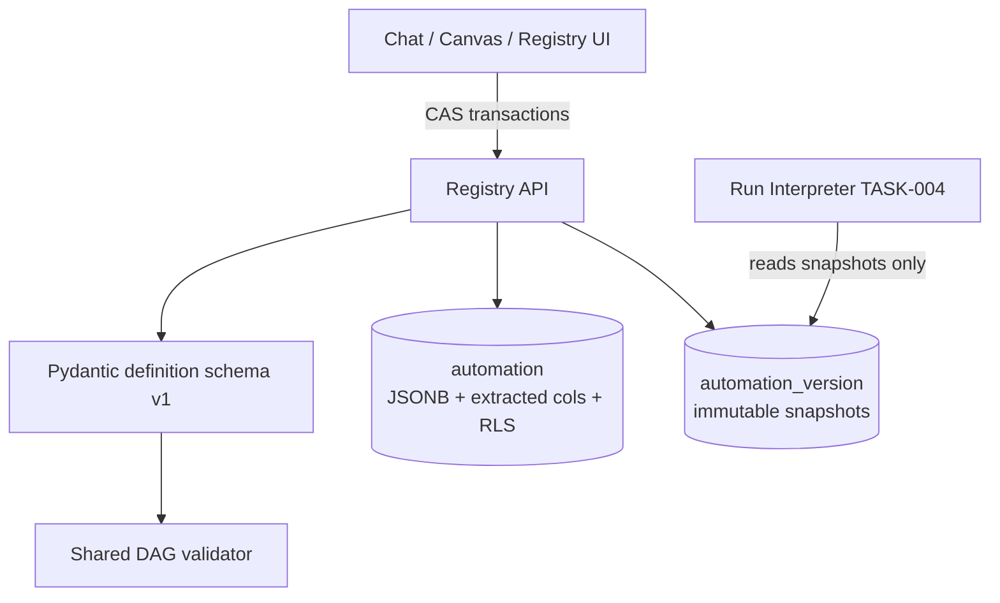

Engine spec: [events-actions-engine.md](../../../events-actions-engine.md)
Contracts: [contracts.md](../../../../contracts.md) · Data model:
[data-model.md](../../tech-spec/data-model.md)

## Story

As an automation author, I need automations persisted as one canonical, schema-validated
definition with a queryable registry, so that every later surface (chat, canvas, interpreter,
compliance) projects from a single source of truth that cannot silently diverge.

## Scope Note

Backend only. Creates the `automation` + `automation_version` tables (RLS per ADR-003), the
Pydantic v2 definition schema (data-model.md §Canonical Automation Definition), the ONE shared
DAG validator, and the registry API (list/filter/search/CRUD + CAS definition transactions). No
run engine, no CE calls (grounding fields are nullable pass-through here — TASK-003 populates
them), no UI. Phase-2 node enum values (`graph_change`, `graph_update`, `sub_automation`,
`fn_ref`) parse but are marked unavailable by the schema (activation blocking is TASK-015).

## Acceptance Criteria

| ID | Criterion (EARS) |
|---|---|
| AC-001-01 | WHEN a definition is written THE SYSTEM SHALL validate it against the versioned schema (`definition_schema: 1`): node types `trigger/condition/action/hitl_gate/error_handler/end`, Phase-1 trigger/action enums, HITL-gate field completeness (`escalates_to_role_iri`, `escalation_deadline` as ISO-8601 duration, `triggered_by_step`) — a failing document is rejected 422 with field paths and the stored row is byte-identical (no torn write). |
| AC-001-02 | WHEN a definition's `nodes`/`edges` contain a cycle or a disconnected node THE SYSTEM SHALL report the offending node IDs from the single shared DAG validator (importable by API, interpreter, and SPA build). |
| AC-001-03 | WHEN a definition write carries `expected_rev` that no longer matches `definition_rev` THE SYSTEM SHALL reject 409 and return the winning revision's diff summary (optimistic LWW, FR-011). |
| AC-001-04 | WHEN `GET /api/automations` is called THE SYSTEM SHALL return the tenant's rows with filters (All/Active/Draft/Paused/Mine), sorts (last run, run count, name), and search (name or linked entity), paginated. |
| AC-001-05 | WHEN any registry query executes without RLS session context THE SYSTEM SHALL return zero rows (fail-closed), and a tenant-A principal SHALL never receive a tenant-B row. |
| AC-001-06 | WHEN an automation is activated (by TASK-015) THE SYSTEM SHALL snapshot an immutable `automation_version` row; a later write to a snapshot row SHALL be rejected. |
| AC-001-07 | WHEN a definition sets `tier` THE SYSTEM SHALL accept only `simple|complex`; classification logic itself is TASK-011. |

## API Contracts

Engine-internal REST (OpenAPI 3.1): `GET/POST /api/automations`, `GET/PUT/DELETE
/api/automations/{id}`, `POST /api/automations/{id}/definition` (CAS transaction). Provides the
storage substrate for `EA-AUTOMATION-1`. No inter-engine calls in this task.

## Diagram

## Design Decisions

| Decision | Rationale | Source |
|---|---|---|
| JSONB canonical document + extracted relational columns, same transaction | Registry/compliance filters never parse JSON; document stays atomic for projections | ADR-003 |
| One DAG validator shared across API/interpreter/SPA | FR-010 must fire identically regardless of which editor produced the cycle | E3 epic AC |
| CAS on `definition_rev` at the store | LWW-with-diff enforced in one place, not per editor | FR-011, ADR-003 §2 |
| Runs reference immutable `automation_version` snapshots | A mid-run edit must not change live-run semantics | architecture.md D8 |
| Phase-2 enum values parse but flag unavailable | Templates shipping at GA contain them; blocking happens at activation, not parse | architecture.md D9 |

## Test Requirements

| Layer | Scenario | AC |
|---|---|---|
| Unit | Schema rejects each malformed shape with field paths; HITL completeness | AC-001-01 |
| Unit | DAG validator: cycle, disconnected, valid; returns offending IDs | AC-001-02 |
| Unit | CAS mismatch → 409 + diff | AC-001-03 |
| Integration | List/filter/search/pagination over seeded registry | AC-001-04 |
| Integration | RLS: no session context ⇒ zero rows; two-tenant isolation | AC-001-05 |
| Integration | Snapshot immutability | AC-001-06 |

## Dependencies

- **blocked_by**: none (foundation row)
- **unlocks**: TASK-002 (settings rows), TASK-003 (grounding fields), TASK-004 (interpreter reads
  snapshots), TASK-012 (registry UI), TASK-013 (chat transactions)

## Cost Estimate

**M** — schema + tables + CRUD are mechanical; the care points are the CAS semantics, RLS
migrations, and making the DAG validator genuinely single-sourced.

## DoR Checklist

- [ ] ADR-003 approved (storage + isolation)
- [ ] Definition schema fields reviewed against data-model.md §Canonical Automation Definition
- [ ] RLS pattern confirmed identical to CE's Aurora layer (fail-closed `current_setting`)
- [ ] Migration tooling (Alembic) baseline exists in the package skeleton

## DoD Checklist

- [ ] All ACs pass (unit + integration)
- [ ] RLS policies applied in migrations and exercised by the two-tenant test
- [ ] DAG validator published as an importable module with no API-layer imports
- [ ] OpenAPI schema generated and committed for the registry surface
- [ ] No definition content logged at INFO or above (definitions may embed business data)
- [ ] Coverage ≥ 80%, mutation ≥ 70% on schema/validator/CAS modules

## Implementation Hints

Extract registry columns (`status`, `grounding_iri`, `tier`, `trigger_types[]`) in the same
`UPDATE` as the JSONB write — a trigger-based sync would hide failures. Use `jsonb` (not `json`)
for indexability. The 409 diff summary can be a minimal JSON-patch-style list; the chat renders
it, so keep node labels in it. Cycle detection: iterative Kahn's algorithm (topological sort) —
report the residual node set as the offending nodes.
