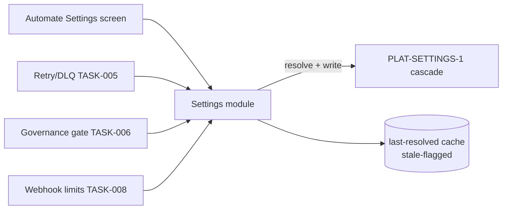

Engine spec: [events-actions-engine.md](../../../events-actions-engine.md)
Contracts: [contracts.md](../../../../contracts.md)

## Story

As a workspace admin, I want Automate defaults and limits governed through the platform settings
cascade so that company/domain minimums cannot be loosened locally, and every consumer of a
default (retry policy, thresholds, retention) reads one resolved value.

## Scope Note

Implements the Events settings module (E11-S1): a typed settings catalogue resolved via
`PLAT-SETTINGS-1` (Company → Domain → Workspace → Project, tighter-wins), a thin read API the
engine's other modules consume, and the settings screen data (UI rendering rides the shared
platform settings components). No setting may live in a local-only store that bypasses the
cascade. Defines the canonical key set consumed by TASK-005 (retry/DLQ/retention), TASK-006
(HITL threshold/timeout), TASK-008 (rate limits/body caps), TASK-012 (staleness behaviour).

## Acceptance Criteria

| ID | Criterion (EARS) |
|---|---|
| AC-002-01 | WHEN any Automate setting is viewed (default HITL timeout, retry policy, pin behaviour, max concurrent runs [default 20], max runs/automation/min [default 60], notification prefs, audit retention [default 12 months, min 30 days], HITL high-value threshold) THE SYSTEM SHALL show its resolved value AND its source level (Company/Domain/Workspace/Project) from `PLAT-SETTINGS-1`. |
| AC-002-02 | WHEN a workspace attempts to LOOSEN a company/domain minimum THE SYSTEM SHALL reject the change server-side with "loosening requires parent approval"; tightening locally SHALL be accepted. |
| AC-002-03 | WHEN the HITL high-value threshold is read THE SYSTEM SHALL return a per-tenant, currency-configurable value (~£10k-equivalent default, unit-/currency-aware — never a fixed GBP literal), consumable by the engine-level gate (TASK-006), not just the UI. |
| AC-002-04 | WHEN `PLAT-SETTINGS-1` is unavailable THE SYSTEM SHALL serve the last-resolved cached values flagged stale, and SHALL refuse writes (fail-visible, no local override path). |
| AC-002-05 | WHEN any engine module reads a default THE SYSTEM SHALL route it through this module's resolver — a grep for direct constant usage of a catalogued default SHALL find none. |

## API Contracts

Consumes **PLAT-SETTINGS-1** (resolution read API — effective value + source level; cascade
writes). Exposes engine-internal `GET /api/automate/settings` (resolved catalogue) and
`PUT /api/automate/settings/{key}` (delegates to the cascade). See
[contracts.md](../../../../contracts.md) — do not restate shapes.

## Diagram

## Design Decisions

| Decision | Rationale | Source |
|---|---|---|
| One resolver module; no scattered `PLAT-SETTINGS-1` calls | Tighter-wins and stale-cache behaviour implemented once | E11 epic AC |
| Server-side cascade enforcement (not UI-only) | Direct API use must not bypass minimums | E11-S1 |
| Currency-aware threshold type `{amount, currency}` | "~£10k-equivalent" must survive non-GBP tenants | E11-S1 AC |
| Fail-visible stale cache on outage, writes refused | A silently-editable local copy would fork the cascade | PRD §2.5 |

## Test Requirements

| Layer | Scenario | AC |
|---|---|---|
| Unit | Tighter-wins comparison per setting type (min/max/duration/money) | AC-002-02 |
| Unit | Currency-aware threshold comparison | AC-002-03 |
| Integration | Resolution + source level via PLAT-SETTINGS-1 stub | AC-002-01 |
| Integration | Loosen rejected / tighten accepted server-side | AC-002-02 |
| Integration | Outage ⇒ stale-flagged reads, writes refused | AC-002-04 |
| Static | Grep gate: no catalogued default read outside the resolver | AC-002-05 |

## Dependencies

- **blocked_by**: TASK-001 (package skeleton + tenancy context)
- **unlocks**: TASK-005 (retry/retention defaults), TASK-006 (HITL threshold/timeout),
  TASK-015 (activation reads limits)

## Cost Estimate

**S** — a resolver + catalogue over an existing platform contract; the care point is the typed
tighter-wins comparators.

## DoR Checklist

- [ ] `PLAT-SETTINGS-1` resolution API shape pinned from contracts.md
- [ ] Settings catalogue key list reviewed against E11-S1 (no missing consumer)
- [ ] Money/currency representation agreed with Platform (unit-aware comparison)

## DoD Checklist

- [ ] All ACs pass (unit + integration)
- [ ] Grep gate for direct-default usage wired into CI
- [ ] Stale-cache behaviour covered by an outage test
- [ ] No settings values logged (thresholds are business-sensitive)
- [ ] Coverage ≥ 80%, mutation ≥ 70% on comparators/resolver

## Implementation Hints

Model each setting as `{key, type, default, floor|ceiling, scope}` in one catalogue constant —
the comparators derive from `type`, so adding a setting is one row. Cache resolved values with a
short TTL keyed by `(tenant, workspace)`; staleness is a flag on the response, never silent.
