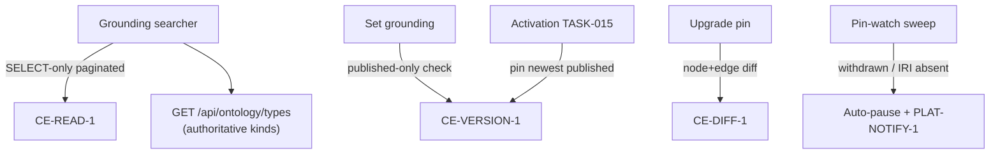

Engine spec: [events-actions-engine.md](../../../events-actions-engine.md)
Contracts: [contracts.md](../../../../contracts.md) · Flows:
[business-process.md](../../tech-spec/business-process.md)

## Story

As a compliance officer, I want every automation grounded in a specific published BPMO `Process`,
`Activity`, or governing `Policy` and pinned to a published ontology version, so that no
automation runs without documented justification and ontology evolution never silently breaks a
live automation.

## Scope Note

Backend grounding module (E6-S1/S2): the "Link to ontology" search backend, grounding validation
(published-version-only), pin resolution at activation, staleness computation consumption,
"Upgrade pin" diff retrieval, and the withdrawn-pin detection sweep with auto-pause. Consumes CE
contracts only — no SPARQL store access, no hard-coded kind list (`GET /api/ontology/types` is
authoritative per ontology-standards). UI surfaces ride TASK-012/013/015.

## Acceptance Criteria

| ID | Criterion (EARS) |
|---|---|
| AC-003-01 | WHEN the grounding searcher queries THE SYSTEM SHALL search BPMO `Process`/`Activity` entities and the `Policy` kinds they are `governedBy` via `CE-READ-1` (`GET /api/sparql`, SELECT-only, paginated), with kinds taken from `GET /api/ontology/types` — never a hand-copied list. |
| AC-003-02 | WHEN a grounding link is set THE SYSTEM SHALL verify the IRI resolves in a PUBLISHED version (`CE-READ-1` + `CE-VERSION-1`); a draft-only entity SHALL be rejected with "publish this process in the Constitution Engine first". |
| AC-003-03 | WHEN an automation activates THE SYSTEM SHALL record `pinned_version_iri` = the newest published version at that moment (`CE-VERSION-1`); the pin SHALL be immutable except via "Upgrade pin". |
| AC-003-04 | WHEN "Upgrade pin" is invoked THE SYSTEM SHALL fetch the `CE-DIFF-1` diff of the grounded entities between pinned and target versions (nodes AND edges — flat triple set, edge `Modification` shape) and require confirmation before re-pinning (new `automation_version` snapshot). |
| AC-003-05 | WHEN staleness is displayed THE SYSTEM SHALL consume the canonical version-lag from `CE-VERSION-1` (default threshold lag ≥ 2, tunable) — the engine SHALL NOT re-implement the lag computation. |
| AC-003-06 | WHEN the pin-watch sweep detects a withdrawn pinned version or a grounded IRI absent from the pinned snapshot (activation-time check + periodic `CE-VERSION-1`/`CE-READ-1` poll in Phase 1) THE SYSTEM SHALL auto-pause every affected automation and emit a "pinned version withdrawn — review required" `PLAT-NOTIFY-1` event. |
| AC-003-07 | IF `CE-READ-1` times out or returns 5xx during resolution THEN THE SYSTEM SHALL surface the failure and leave the draft ungrounded — an IRI SHALL never be fabricated (feeds E2-S1). |

## API Contracts

Consumes **CE-READ-1** (search, resolution, types), **CE-VERSION-1** (pin + canonical lag),
**CE-DIFF-1** (upgrade diff), **PLAT-NOTIFY-1** (withdrawn-pin event). See
[contracts.md](../../../../contracts.md) — do not restate shapes. Exposes engine-internal
`GET /api/grounding/search`, `POST /api/automations/{id}/grounding`,
`POST /api/automations/{id}/upgrade-pin`.

## Diagram

## Design Decisions

| Decision | Rationale | Source |
|---|---|---|
| Kinds from `GET /api/ontology/types`, never hard-coded | BPMO is a grammar; clients extend it — a copied list rots | ontology-standards rule |
| Staleness consumed from CE, never recomputed | CE-VERSION-1 defines canonical lag for all engines | contracts.md CE-VERSION-1 |
| Phase-1 pin watch = poll; Phase 2 upgrades to CE-EVENT-1 | Transport OQ-03 open; no push-only claim | E6-S2, architecture.md D9 |
| Cached grounding label on the automation row | Registry must render when CE is down (fail-visible badge) | E1-S1 failure AC |
| Re-pin produces a new immutable snapshot | Runs must reference the exact pin they executed under | architecture.md D8 |

## Test Requirements

| Layer | Scenario | AC |
|---|---|---|
| Unit | Published-only rule: draft-only entity rejected | AC-003-02 |
| Unit | Staleness threshold consumption (no local lag math) | AC-003-05 |
| Integration | Search via ce_stub incl. governedBy Policy expansion + types call | AC-003-01 |
| Integration | Pin-at-activation; immutability; upgrade-pin diff + confirm | AC-003-03/04 |
| Integration | Sweep auto-pauses affected automations + notify event recorded | AC-003-06 |
| Integration | CE timeout/5xx ⇒ ungrounded draft, no fabricated IRI | AC-003-07 |

## Dependencies

- **blocked_by**: TASK-001 (automation rows carry grounding fields)
- **unlocks**: TASK-006 (gate reads grounded step), TASK-012 (labels/staleness chips),
  TASK-013 (NL grounding), TASK-015 (activation checks)

## Cost Estimate

**M** — contract consumption is straightforward; the care points are the published-only
enforcement at both link and activation time, and the sweep's blast-radius query (all automations
sharing a withdrawn pin).

## DoR Checklist

- [ ] CE-READ-1 / CE-VERSION-1 / CE-DIFF-1 shapes pinned from contracts.md (stub clients typed)
- [ ] TASK-001 merged (grounding columns exist)
- [ ] Poll cadence default for the pin-watch sweep agreed (settings catalogue key)
- [ ] PLAT-NOTIFY-1 event type for withdrawn-pin registered (open taxonomy)

## DoD Checklist

- [ ] All ACs pass (unit + integration)
- [ ] No hard-coded BPMO kind or relationship list anywhere in the module (grep gate)
- [ ] Fabricated-IRI impossibility test: resolution failure paths all yield `grounding=None`
- [ ] Sweep is idempotent (re-running pauses nothing twice, re-notifies nothing)
- [ ] Coverage ≥ 80%, mutation ≥ 70%

## Implementation Hints

The searcher SPARQL should be a small set of named, parameterised SELECT templates (label-contains
over `Process`/`Activity` + a `governedBy` expansion) — no dynamic query assembly from user text.
Remember `CE-DIFF-1`'s amended shape: flat triples + `Modification {subject, predicate, before,
after}`; group node/edge client-side for display. For the sweep, index `(tenant_id,
pinned_version_iri)` queries via the extracted registry columns from TASK-001.
