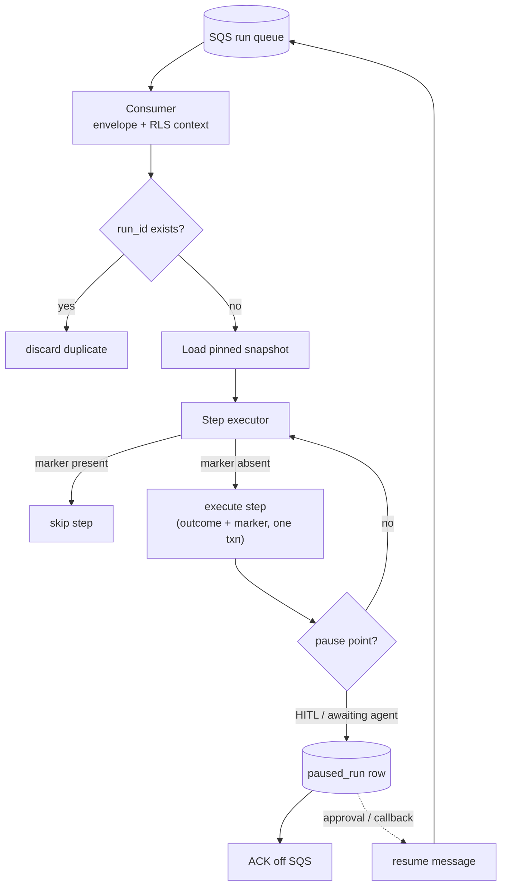

Engine spec: [events-actions-engine.md](../../../events-actions-engine.md)
Contracts: [contracts.md](../../../../contracts.md) · Run lifecycle:
[business-process.md §Run Lifecycle](../../tech-spec/business-process.md)

## Story

As an integration engineer, I want at-least-once delivery with per-step idempotent execution and
durable pauses, so that no event is dropped, no side effect fires twice, and a run can pause for
business-days without being lost.

## Scope Note

Implements E8-S1 + the E7-S1 interpreter runtime (ADR-001): the SQS consumer Lambda, envelope
validation + RLS context, `run_id` dedupe, the step-walk interpreter over `automation_version`
snapshots, `run`/`run_step` state rows, transactional idempotency markers, pause/resume mechanics
(`paused_run` rows + resume re-enqueue), and OTel span emission. Action dispatchers are stubs here
(a no-op `end`-to-`end` path + a test action) — real actions land in TASK-010/011; retry/DLQ policy
in TASK-005; the governance gate in TASK-006 (the stepper exposes the pre-dispatch hook it plugs
into). Condition-node evaluation ({{event.*}} comparisons) IS in scope.

## Acceptance Criteria

| ID | Criterion (EARS) |
|---|---|
| AC-004-01 | WHEN a trigger event is enqueued THE SYSTEM SHALL consume it from the SQS standard queue with no ordering assumption; `run_id` derives deterministically from the trigger event ID; a duplicate delivery SHALL be discarded via the unique `(tenant_id, run_id)` insert. |
| AC-004-02 | WHEN a step completes THE SYSTEM SHALL write its idempotency completion marker (`run_step.completed_at` + `step_config_hash`) in the same transaction as the step outcome. |
| AC-004-03 | WHEN a message is redelivered mid-run THE SYSTEM SHALL check each step's marker first, SKIP completed steps, and replay from the first incomplete step — never from the top. |
| AC-004-04 | WHEN a run reaches a pause point (HITL hook or `awaiting_agent`) THE SYSTEM SHALL persist a durable `paused_run`/state row, ACK/delete the SQS message, and resume later via a re-enqueued resume message — a paused run SHALL survive any visibility-timeout expiry. |
| AC-004-05 | WHEN a run executes THE SYSTEM SHALL load the pinned `automation_version` snapshot (never the mutable draft) and evaluate condition nodes against the trigger payload with `{{event.*}}` interpolation. |
| AC-004-06 | WHEN any run/step transitions THE SYSTEM SHALL emit OTel spans (root run span; trigger/condition/action spans with `automation_id, run_id, tenant_id, step_type, external_call_latency_ms, outcome`) and logs correlated by `run_id`. |
| AC-004-07 | WHEN the interpreter processes a message THE SYSTEM SHALL set the RLS session context from the envelope before any table access; an envelope without tenant context SHALL be rejected to the poison DLQ. |
| AC-004-08 | WHERE the SQS visibility timeout is configured THE SYSTEM SHALL derive it from the ADR-001 formula (≥ max synchronous step timeout × (1 + in-process retries) + overhead; default 300 s), tunable via `PLAT-SETTINGS-1`. |

## API Contracts

No inter-engine calls in this task (platform emitters land in TASK-005/007). Internal envelope:
`{tenant_id, workspace_id, automation_id, automation_version_id, run_id, trigger_type, payload,
resume_of?}`.

## Diagram

## Design Decisions

| Decision | Rationale | Source |
|---|---|---|
| Lambda interpreter + Postgres state; no Step Functions | One execution model; portable for Phase-2 export | ADR-001 |
| Marker transactional with outcome | Crash between side-effect and marker is the only (documented) double-fire window | ADR-001 §3, arch D2 |
| Pause = ack + durable row, resume = re-enqueue | Business-day pauses exceed any visibility timeout | FR-029b |
| Dedupe via unique-insert race, not SELECT-then-INSERT | Two concurrent deliveries must resolve at the DB, not in app logic | FR-029 |
| Gate hook exposed pre-dispatch | TASK-006 plugs in without touching the stepper walk | arch L3 notes |

## Test Requirements

| Layer | Scenario | AC |
|---|---|---|
| Unit | run_id derivation determinism; envelope validation | AC-004-01/07 |
| Unit | Condition evaluation + interpolation edge cases (missing path, type mismatch) | AC-004-05 |
| Unit | step_config_hash mismatch forces re-validation | AC-004-02 |
| Integration | Duplicate delivery discarded (concurrent insert race) | AC-004-01 |
| Integration | Kill-between-side-effect-and-ack simulation → replay from incomplete step | AC-004-03 |
| Integration | Pause survives visibility expiry; resume completes the run | AC-004-04 |
| Integration | Span tree asserted via in-memory OTel exporter | AC-004-06 |

## Dependencies

- **blocked_by**: TASK-001 (snapshots + tables)
- **unlocks**: TASK-005 (retry/DLQ/metering ride the spine), TASK-006 (gate hook + pause
  mechanics), TASK-007 (audit emission points), TASK-008/009 (triggers enqueue), TASK-010/011
  (action dispatchers)

## Cost Estimate

**L** — the highest-risk module in the engine: concurrency, crash-window semantics, and pause
durability all concentrate here. Budget for the failure-injection integration suite.

## DoR Checklist

- [ ] ADR-001 approved (execution model, visibility formula, DLQ posture)
- [ ] TASK-001 merged (snapshot + run tables)
- [ ] LocalStack SQS fixture pattern available in the integration harness
- [ ] Envelope schema reviewed by TASK-008/009 owners (triggers produce it)

## DoD Checklist

- [ ] All ACs pass (unit + integration incl. failure-injection cases)
- [ ] The stepper's only dispatch path passes through the gate hook (grep/CI assertion)
- [ ] Best-effort double-fire window documented per stub action type
- [ ] No payload contents logged at INFO+ (`trigger_payload_hash` only)
- [ ] Coverage ≥ 80%, mutation ≥ 70% on dedupe/marker/pause modules

## Implementation Hints

Process one run per SQS message (batch size 1 initially — simpler crash semantics; raise later if
throughput demands). Use `SELECT … FOR UPDATE` on the run row while stepping to serialise a
redelivery racing an in-flight execution. The resume message carries `resume_of: run_id`, and the
consumer path for it skips dedupe (same run, deliberate re-entry) but still walks markers.
Interpolation: resolve `{{event.x.y}}` via a small JSON-pointer helper — no template engine, no
eval (security.md).
