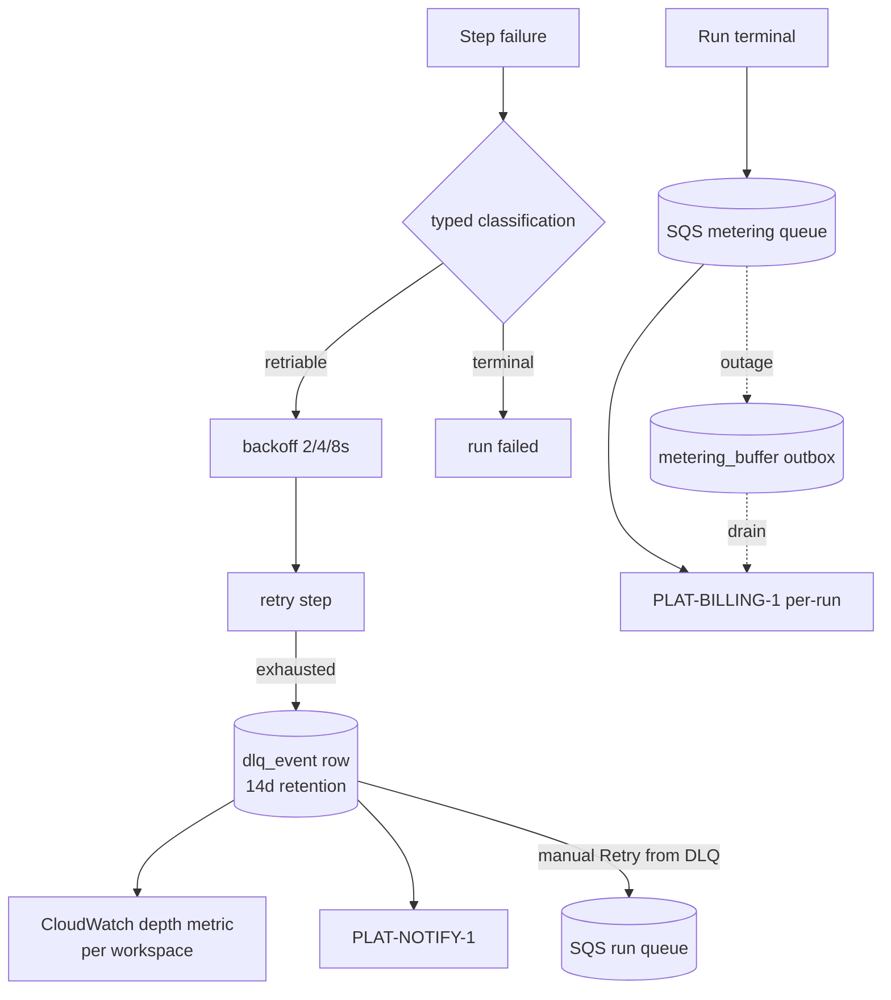

Engine spec: [events-actions-engine.md](../../../events-actions-engine.md)
Contracts: [contracts.md](../../../../contracts.md)

## Story

As an integration engineer, I want configurable retries with an inspectable DLQ, and as the Weave
platform, I want every run metered without loss, so that failures are handled visibly and
usage-based billing is accurate even under outage.

## Scope Note

Implements E8-S2 + E8-S3 on the TASK-004 spine: the Error Handler node semantics (per-automation
retry config within cascade limits from TASK-002), the retriable-vs-terminal taxonomy, `dlq_event`
persistence + per-workspace CloudWatch depth metric + "Retry from DLQ" endpoint, and the metering
emitter (per-run events on the separate SQS metering queue; per-token forwarding hook for
TASK-011) with the durable `metering_buffer` outbox. The `BE-SELFIMPROVE-1` on-failure option is
rendered unavailable (contract-gated — Build post-v1); notify/log/stop are functional.

## Acceptance Criteria

| ID | Criterion (EARS) |
|---|---|
| AC-005-01 | WHEN an Error Handler node is configured THE SYSTEM SHALL accept max retries (default 3, max 10), backoff (default exponential 2s/4s/8s), and on-failure action (notify / log / stop) — all defaults resolved via TASK-002; the "create self-healing issue" option SHALL render unavailable while `BE-SELFIMPROVE-1` is not live. |
| AC-005-02 | WHEN a step fails THE SYSTEM SHALL classify: 5xx/timeout/connection ⇒ retriable (backoff then retry); 4xx ⇒ terminal unless explicitly configured retriable — the classification is a typed function, not inline conditionals. |
| AC-005-03 | WHEN retries are exhausted THE SYSTEM SHALL persist a `dlq_event` row (workspace-scoped, default retention 14 days, never auto-reprocessed), record the last error on the run, fire a `PLAT-NOTIFY-1` event, and update the per-workspace CloudWatch depth metric (alarm at depth > 0). |
| AC-005-04 | WHEN "Retry from DLQ" is invoked THE SYSTEM SHALL re-enqueue the original envelope (markers ensure completed steps are skipped) and mark the row reprocessed; expired rows SHALL be purged by a retention sweep. |
| AC-005-05 | WHEN a run terminates (success/failure/rejected) THE SYSTEM SHALL emit a per-run metering event to `PLAT-BILLING-1` — `{automation_id, tenant_id, run_id, trigger_type, action_types[], duration_ms, outcome, ts}` — on the **separate metering queue**, so metering survives run failure. |
| AC-005-06 | IF the metering queue or `PLAT-BILLING-1` is unavailable THEN THE SYSTEM SHALL write the event to the durable `metering_buffer` outbox (same transaction as the run outcome) and drain it with retry — a billing event SHALL never be silently lost; double-failure marks the run `degraded`. |

## API Contracts

Consumes **PLAT-BILLING-1** (per-run dimension; per-token hook for TASK-011), **PLAT-NOTIFY-1**
(DLQ/run-failure events). References **BE-SELFIMPROVE-1** (unavailable until live). See
[contracts.md](../../../../contracts.md).

## Diagram

## Design Decisions

| Decision | Rationale | Source |
|---|---|---|
| DLQ as Postgres rows + physical poison DLQ backstop | Typed reasons, per-workspace depth, retention, and manual retry are relational needs | ADR-001 §5 |
| Metering on a separate queue from run outcome | A failed run must still bill | FR-031 |
| Outbox written transactionally with the outcome it describes | No emit-then-crash loss window | E8-S3 / E9 pattern |
| Typed failure-classification function | Mutation testing can hold the taxonomy; inline conditionals rot | FR-030 |
| Self-healing option contract-gated, not hidden | Fail-visible degrade; users see why it is unavailable | E8-S2 degradable AC |

## Test Requirements

| Layer | Scenario | AC |
|---|---|---|
| Unit | Classification taxonomy: 5xx/timeout/4xx/configured-retriable | AC-005-02 |
| Unit | Backoff schedule + cascade-limit clamping (max 10) | AC-005-01 |
| Integration | Exhausted retries → dlq_event + notify + depth metric | AC-005-03 |
| Integration | Retry from DLQ skips completed steps (markers) | AC-005-04 |
| Integration | Metering rides separate queue; failed run still meters | AC-005-05 |
| Integration | Queue outage → buffered, drained on recovery; double failure → degraded flag | AC-005-06 |

## Dependencies

- **blocked_by**: TASK-004 (spine), TASK-002 (defaults/limits)
- **unlocks**: TASK-010/011 (actions use Error Handler policy), TASK-012 (failed-run health data)

## Cost Estimate

**M** — mostly disciplined plumbing; the care points are the outbox transactionality and the
retry-from-DLQ marker interaction.

## DoR Checklist

- [ ] TASK-004 merged (step outcomes + envelope re-enqueue)
- [ ] PLAT-BILLING-1 event shape pinned (per-run dimension)
- [ ] PLAT-NOTIFY-1 event types registered (dlq-depth, run-failure)
- [ ] CloudWatch custom-metric namespace agreed with Platform

## DoD Checklist

- [ ] All ACs pass (unit + integration incl. outage injection)
- [ ] Retention sweep idempotent and tested at boundary (expires_at exactly now)
- [ ] Metering payload contains no trigger content (IDs + hashes only)
- [ ] Depth metric emits zero correctly (alarm resets)
- [ ] Coverage ≥ 80%, mutation ≥ 70% on classification/backoff/outbox

## Implementation Hints

Keep in-process retries (short backoffs) inside the step executor; only exhausted retries touch
SQS/DLQ machinery — redelivery-based retry would multiply visibility-timeout interactions. The
outbox drain is a scheduled Lambda sharing the emitter code path with the happy path (one emit
function, two callers). `action_types[]` for the metering event comes from the pinned snapshot,
not the run steps (rejected runs may have executed none).
