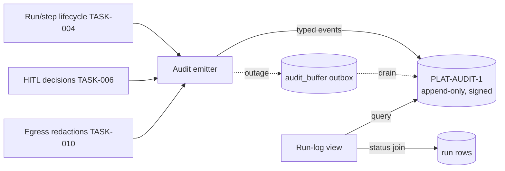

Engine spec: [events-actions-engine.md](../../../events-actions-engine.md)
Contracts: [contracts.md](../../../../contracts.md)

## Story

As a compliance officer, I want every run recorded immutably so that I can prove automated
actions followed CE rules — with the platform audit trail as the single system of record.

## Scope Note

Implements E9-S1: the audit emitter on the TASK-004 run/step lifecycle (typed `PLAT-AUDIT-1`
events with the Events payload extension), the durable `audit_buffer` outbox + drain, the
degraded-run flag on double failure, and the run-log read path (a filtered VIEW over
`PLAT-AUDIT-1` joined with local run rows for navigation). The compliance report UI is TASK-016.
The engine performs NO signing and keeps NO independent signed store.

## Acceptance Criteria

| ID | Criterion (EARS) |
|---|---|
| AC-007-01 | WHEN any run or step executes THE SYSTEM SHALL emit a typed `PLAT-AUDIT-1` event `{seq, ts, actor_principal_iri, engine:"events", event_type, target_iri, diff_summary, signature}` with the Events payload (`grounded_entity_iri`, `ontology_version_pinned`, `trigger_payload_hash`, per-step `step_type`/`step_config_hash`/`outcome`/`external_call_url`, `hitl_decision`) — signing and sequencing are the platform's; the engine SHALL NOT re-implement them. |
| AC-007-02 | WHEN HITL decisions occur THE SYSTEM SHALL emit approve/reject + approver identity + ts + reason as distinct events (wired from TASK-006). |
| AC-007-03 | IF `PLAT-AUDIT-1` is unavailable when an audit-bearing step completes THEN THE SYSTEM SHALL write the event to the durable `audit_buffer` outbox (same transaction as the outcome) and retry; if buffering also fails the run SHALL be marked `degraded` and flagged — audit completeness is never traded for throughput. |
| AC-007-04 | WHEN the run-log renders THE SYSTEM SHALL serve it as a filtered VIEW over `PLAT-AUDIT-1` (per-run trigger, decision, action, outcome), joined to local `run` rows only for navigation/status — local rows are never presented as the audit record. |
| AC-007-05 | WHEN a delete of an audit event is attempted THE SYSTEM SHALL surface the platform's rejection (append-only at DB-constraint level) and the attempt itself is logged — verified against the PLAT-AUDIT-1 stub contract. |
| AC-007-06 | WHEN audit events are emitted THE SYSTEM SHALL include no secrets and no raw trigger payloads (`trigger_payload_hash` only); egress-scrub redaction events (TASK-010) ride this same emitter. |

## API Contracts

Consumes **PLAT-AUDIT-1** (emit + query/export for the view). See
[contracts.md](../../../../contracts.md) — do not restate shapes. Exposes engine-internal
`GET /api/runs/{id}/log` and `GET /api/runs?filters…`.

## Diagram

## Design Decisions

| Decision | Rationale | Source |
|---|---|---|
| Engine emits, platform signs; run-log is a VIEW | One system of record program-wide | contracts.md PLAT-AUDIT-1, PRD decision |
| Outbox transactional with the outcome | No emit-then-crash loss window | E9-S1 failure AC |
| Degraded flag instead of blocking runs on audit outage | Buffering preserves completeness; blocking would trade availability for nothing | E9 epic AC |
| Payload hashes, never payloads | Audit must not become a PII/secret store | security.md, FR-008b |

## Test Requirements

| Layer | Scenario | AC |
|---|---|---|
| Unit | Event payload construction per lifecycle point (run start/step/terminal/HITL) | AC-007-01/02 |
| Unit | Payload contains hash, never body; secret-free assertion | AC-007-06 |
| Integration | Outage → buffered (same txn) → drained on recovery; double failure → degraded flag | AC-007-03 |
| Integration | Run-log view = stub-audit rows filtered by run; local rows only for status | AC-007-04 |
| Integration | Delete attempt rejected by stub + attempt logged | AC-007-05 |

## Dependencies

- **blocked_by**: TASK-004 (lifecycle emission points)
- **unlocks**: TASK-016 (compliance report queries the same view layer)

## Cost Estimate

**M** — the emitter + outbox pattern is shared with TASK-005 metering (extract one outbox
helper); the view query layer is straightforward.

## DoR Checklist

- [ ] PLAT-AUDIT-1 event shape + query/export API pinned from contracts.md
- [ ] Events-payload extension field list agreed (matches E9-S1 AC verbatim)
- [ ] Outbox helper extracted/shared with TASK-005 (one implementation)

## DoD Checklist

- [ ] All ACs pass (unit + integration incl. outage injection)
- [ ] 100%-of-runs-logged asserted: integration test runs N mixed-outcome runs, view shows N
- [ ] No local table is queryable as an audit source by any API (review + grep)
- [ ] Coverage ≥ 80%, mutation ≥ 70% on emitter/outbox

## Implementation Hints

Emit at exactly the transition points of the TASK-004 state machine — derive the emission list
from the state-machine enum so a new state without an audit mapping fails a test. The run-log view
should paginate on the platform's `seq`, not local timestamps (the trail is the ordering
authority).
