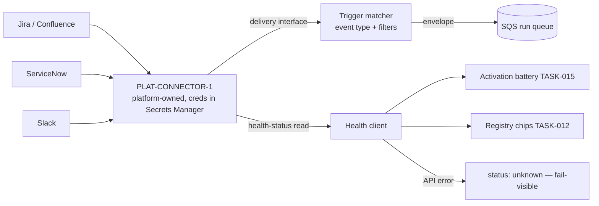

Engine spec: [events-actions-engine.md](../../../events-actions-engine.md)
Contracts: [contracts.md](../../../../contracts.md)

## Story

As an integration engineer, I want to trigger automations from Jira, ServiceNow, and Slack events
so that Weave automations respond to the systems the business already runs on — without this
engine operating connectors or holding credentials.

## Scope Note

Implements E4-S2 + the Slack half of E4-S3: trigger-type configuration (event types + filters per
source), the `PLAT-CONNECTOR-1` delivery-interface consumer translating connector events into the
TASK-004 envelope, health-status gating, and degradation handling. The engine holds NO connector
credentials (platform-owned, Secrets Manager). Connector *actions* (Slack notification delivery)
are TASK-010; health chips in the registry are TASK-012.

## Acceptance Criteria

| ID | Criterion (EARS) |
|---|---|
| AC-009-01 | WHERE a configured Atlassian connector exists (`PLAT-CONNECTOR-1`, one OAuth family for Jira + Confluence) THE SYSTEM SHALL offer Jira event types issue created / updated / status-changed-to-[value] / comment-added with filters (project key, issue type). |
| AC-009-02 | WHERE a configured ServiceNow connector exists THE SYSTEM SHALL offer incident created/state-changed and change-request state-changed with filters (category, assignment group). |
| AC-009-03 | WHERE the platform-managed Slack connector exists THE SYSTEM SHALL offer "message in channel (optional keyword filter)" and "slash command" event types. |
| AC-009-04 | WHEN a connector event is delivered via the `PLAT-CONNECTOR-1` delivery interface THE SYSTEM SHALL match it against active trigger configurations (filters applied) and enqueue the standard envelope with `run_id` derived from the connector event ID. |
| AC-009-05 | IF a required connector is unconfigured or reports `degraded` via the health-status read API THEN activation of dependent automations SHALL be blocked with the connector status shown on the trigger node (enforced in TASK-015's battery; the health-check client lands here). |
| AC-009-06 | IF the Slack connector degrades while a Slack-triggered automation is active THEN THE SYSTEM SHALL buffer inbound events to the run queue if the delivery interface still delivers, ELSE auto-flag the automation "connector degraded" via `PLAT-NOTIFY-1` — events are never silently lost. |
| AC-009-07 | IF the health API itself errors THEN THE SYSTEM SHALL report status "unknown" (fail-visible, never silently green) to every consumer (activation battery, registry chips). |

## API Contracts

Consumes **PLAT-CONNECTOR-1** (connector reference/handle model, health-status read API
`{status, last_sync, last_error, error_count}`, delivery interface), **PLAT-NOTIFY-1**
(degraded-connector flag). See [contracts.md](../../../../contracts.md) — do not restate shapes.

## Diagram

## Design Decisions

| Decision | Rationale | Source |
|---|---|---|
| Engine consumes the delivery interface; operates nothing | Connector infra, OAuth, creds are platform-owned | brief out-of-scope, PLAT-CONNECTOR-1 |
| One trigger matcher for all connector sources | Filters are data (`{source, event_type, filters}`), not per-source code paths | Law E |
| Health client returns tri-state healthy/degraded/unknown | "Unknown" must be distinct — silently green is the named failure | E1-S2 / E4 epic AC |
| run_id from connector event ID | Same dedupe guarantee as webhooks — redelivery safe | FR-029 |

## Test Requirements

| Layer | Scenario | AC |
|---|---|---|
| Unit | Filter matching per source (project/type, category/group, keyword) | AC-009-01/02/03 |
| Unit | Health tri-state mapping incl. API-error ⇒ unknown | AC-009-07 |
| Integration | Delivery-interface stub event → matched → envelope on queue | AC-009-04 |
| Integration | Degraded Slack: delivery-still-works ⇒ buffered; delivery-dead ⇒ notify flag | AC-009-06 |
| Integration | Duplicate connector delivery deduped by run_id | AC-009-04 |

## Dependencies

- **blocked_by**: TASK-004 (envelope + queue)
- **unlocks**: TASK-012 (health chips), TASK-015 (health gating at activation)

## Cost Estimate

**M** — the matcher and health client are modest; the care point is degradation behaviour
(buffer-vs-flag) and keeping all source-specific knowledge in configuration.

## DoR Checklist

- [ ] PLAT-CONNECTOR-1 delivery-interface + health-API shapes pinned from contracts.md
- [ ] Connector event-ID fields confirmed per source (run_id derivation)
- [ ] PLAT-NOTIFY-1 connector-degraded event type registered

## DoD Checklist

- [ ] All ACs pass (unit + integration)
- [ ] Grep gate: no connector credential, token, or OAuth code anywhere in the engine
- [ ] Degradation matrix (configured × health × delivery) covered by tests
- [ ] Coverage ≥ 80%, mutation ≥ 70% on matcher/health client

## Implementation Hints

Treat the three sources as rows in a `TRIGGER_SOURCES` table-of-config (event types, filter
fields, id-path), so adding the remaining `PLAT-CONNECTOR-1` sources later is data. Health checks
at activation are synchronous; registry chips use a short-TTL cached health read to avoid
hammering the platform API per row.
