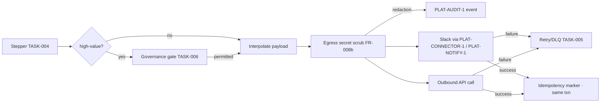

Engine spec: [events-actions-engine.md](../../../events-actions-engine.md)
Contracts: [contracts.md](../../../../contracts.md)

## Story

As an automation author, I want automations to send Slack notifications and call external APIs so
that process-relevant events reach the right people and systems — with secrets never leaking
through an interpolated payload.

## Scope Note

Implements E5-S1 + E5-S2 as dispatchers on the TASK-004 stepper: target/body configuration with
`{{entity.property}}`/`{{event.*}}` interpolation, the run-time egress secret scrub (FR-008b,
reusing the platform scrubber pattern set), Secrets Manager header references, response mapping
declaration (JSONPath → property IRI — stored but inert until the Phase-2 `CE-WRITE-1` action),
"Run test call" dry-run, and per-type idempotency notes. High-value API calls route through the
TASK-006 gate. Agent Run is TASK-011.

## Acceptance Criteria

| ID | Criterion (EARS) |
|---|---|
| AC-010-01 | WHEN a Slack Notification action is configured THE SYSTEM SHALL set target (channel or a person from the graph's `Person.slack_id` via the grounded-entity context) and a rich-text body with interpolation + inline preview; delivery is via the platform-managed Slack connector (`PLAT-CONNECTOR-1`) and/or `PLAT-NOTIFY-1` (Slack channel), bot token in Secrets Manager and never in the definition. |
| AC-010-02 | WHEN an API Call action is configured THE SYSTEM SHALL set method, URL (interpolatable), headers (Secrets Manager references only — inline secrets rejected by the definition schema), and JSON body; an optional response mapping (JSONPath → target property IRI) is stored for the Phase-2 graph-update follow-on and marked inert at Phase 1. |
| AC-010-03 | WHERE an interpolated value resolves to a secret at run time THE SYSTEM SHALL redact it via the egress scrub BEFORE the call and record the redaction as a `PLAT-AUDIT-1` event (via the TASK-007 emitter). |
| AC-010-04 | IF Slack delivery fails (rate-limited / channel gone / connector degraded) or the API call returns 5xx/timeout THEN THE SYSTEM SHALL follow the TASK-005 retry policy then DLQ; 4xx SHALL be terminal unless configured retriable. |
| AC-010-05 | WHEN a redelivered run reaches an already-completed Slack/API step THE SYSTEM SHALL skip it via its idempotency marker; the marker for the API call records status + response hash; the Slack send additionally passes a client idempotency key where the delivery interface supports one — residual double-fire windows are documented per type. |
| AC-010-06 | WHEN "Run test call" or a dry-run Test executes THE SYSTEM SHALL make no real external call and emit no metering event (stubbed transport, marked simulated in the result). |
| AC-010-07 | WHEN a high-value API call (threshold from TASK-002) is about to dispatch THE SYSTEM SHALL pass through the TASK-006 governance gate first. |

## API Contracts

Consumes **PLAT-CONNECTOR-1** (Slack delivery), **PLAT-NOTIFY-1** (Slack-channel delivery path),
**PLAT-AUDIT-1** (redaction events, via TASK-007). See [contracts.md](../../../../contracts.md).

## Diagram

## Design Decisions

| Decision | Rationale | Source |
|---|---|---|
| One scrub in front of ALL egress | A per-action scrub would drift; the dispatcher API takes scrubbed payloads only | FR-008b, arch L3 |
| Secrets by Secrets Manager reference, schema-rejected inline | Activation-time scan (TASK-015) is the second layer, not the only one | FR-008, E5-S2 |
| Response mapping stored but inert at Phase 1 | Authors can declare intent now; no CE-WRITE-1 call exists until Phase 2 | arch D9 |
| Per-type idempotency documentation | Slack lacks universal dedupe; honesty beats a false guarantee | FR-029 best-effort note |

## Test Requirements

| Layer | Scenario | AC |
|---|---|---|
| Unit | Interpolation + scrub: secret-resolving values redacted; clean values pass | AC-010-03 |
| Unit | Schema rejects inline secrets in headers/body | AC-010-02 |
| Unit | 4xx terminal vs 5xx retriable per configured overrides | AC-010-04 |
| Integration | Slack + API dispatch happy path with markers (stub transports) | AC-010-01/02/05 |
| Integration | Redelivery skips completed send; response-hash marker verified | AC-010-05 |
| Integration | Redaction recorded as audit event | AC-010-03 |
| Integration | Dry-run: zero external calls, zero metering (recording stubs assert) | AC-010-06 |
| Integration | High-value call blocked without gate decision | AC-010-07 |

## Dependencies

- **blocked_by**: TASK-004 (stepper), TASK-005 (retry policy), TASK-006 (gate)
- **unlocks**: TASK-015 (activatable action set), TASK-017 (templates compose these actions)

## Cost Estimate

**M** — two dispatchers over established rails; the scrub correctness and idempotency-marker
semantics carry the risk.

## DoR Checklist

- [ ] Platform scrubber pattern set identified and importable (do not reinvent — FR-008)
- [ ] PLAT-CONNECTOR-1 Slack delivery + PLAT-NOTIFY-1 channel shapes pinned
- [ ] TASK-005/006 merged (retry + gate hooks)
- [ ] High-value threshold key live in the TASK-002 catalogue

## DoD Checklist

- [ ] All ACs pass (unit + integration)
- [ ] Grep/CI assertion: no dispatcher entry point accepts an unscrubbed payload type
- [ ] Best-effort double-fire windows documented per action type in the module docstring
- [ ] Outbound URLs recorded in audit as `external_call_url` (no query-string secrets)
- [ ] Coverage ≥ 80%, mutation ≥ 70% on scrub/classification paths

## Implementation Hints

Type-separate `RawPayload` and `ScrubbedPayload` (newtype pattern) so the compiler/mypy enforces
the scrub ordering. Resolve Secrets Manager references at the last moment, inside the dispatcher,
and never place resolved values into any structure that outlives the call. JSONPath for response
mapping: `jsonpath-ng` — evaluate only against the response, never user-controlled paths against
engine state.
