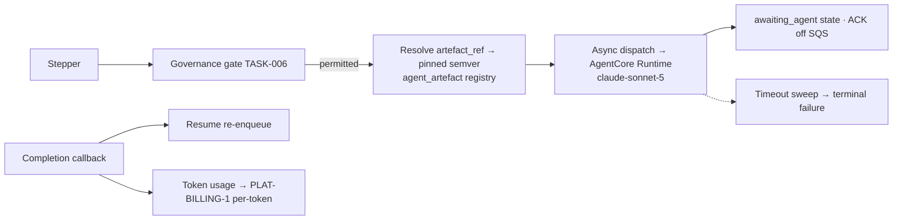

Engine spec: [events-actions-engine.md](../../../events-actions-engine.md)
Contracts: [contracts.md](../../../../contracts.md)

## Story

As an automation author, I want to trigger an Anthropic Agent SDK agent as an action so that
complex, reasoning-heavy responses can be automated — under the same governance, reliability, and
metering guarantees as every other action.

## Scope Note

Implements E5-S3 + the classification half of E7-S1, buildable because ADR-002 closes the OQ-09
resolve-before-build condition. Delivers: the `agent_artefact` registry (CRUD + semver
resolution), the Agent Run dispatcher (async AgentCore invocation, `awaiting_agent` state,
completion callback → resume, timeout sweep), per-token metering forwarding, and the tier
classifier (`agent_run` present ⇒ complex; ambiguity ⇒ simple + surfaced choice, author-overridable
in Builder settings). Phase-2 artefact *export* (OQ-04) is out of scope; the registry is its
future resolution contract.

## Acceptance Criteria

| ID | Criterion (EARS) |
|---|---|
| AC-011-01 | WHEN an Agent Run action is configured THE SYSTEM SHALL set an `artefact_ref` (resolved to the newest compatible `agent_artefact` semver at activation and pinned in the snapshot), an input payload (triggering entity IRI + optional context), and a timeout (default 60 s, tunable per automation). |
| AC-011-02 | WHEN an Agent Run is about to dispatch THE SYSTEM SHALL pass the TASK-006 governance gate and execute under the automation's `PLAT-IDENTITY-1` per-automation principal; the principal IRI SHALL ride every related audit event. |
| AC-011-03 | WHEN the dispatcher invokes the agent THE SYSTEM SHALL do so asynchronously against AgentCore Runtime (ADR-002): record `awaiting_agent`, ack the SQS message, and resume via the completion callback — SQS visibility is never held across model latency. |
| AC-011-04 | IF the agent run exceeds its timeout or the runtime is unreachable THEN THE SYSTEM SHALL record a terminal failure (the timeout sweep closes orphaned `awaiting_agent` states); the step's completion marker SHALL prevent a duplicate agent run on redelivery. |
| AC-011-05 | WHEN an agent run completes THE SYSTEM SHALL forward its token usage to `PLAT-BILLING-1` on the per-token dimension (via the TASK-005 metering rail, same never-dropped guarantees), alongside the run's per-run event. |
| AC-011-06 | WHEN a definition is saved THE SYSTEM SHALL auto-classify tier per `EA-AUTOMATION-1`: `agent_run` node present ⇒ complex; otherwise simple; ambiguity SHALL default to simple and surface the choice for author override — the costlier tier is never silently selected. |
| AC-011-07 | WHERE agent model IDs are configured THE SYSTEM SHALL accept only the confirmed two-tier set (`claude-sonnet-5` for run-time agent actions); an unknown model ID SHALL fail validation rather than silently invoking. |

## API Contracts

Provides the complex tier of **EA-AUTOMATION-1**. Consumes **PLAT-IDENTITY-1** (principal),
**PLAT-BILLING-1** (per-token), **PLAT-AUDIT-1** (via TASK-007). AgentCore invocation is an AWS
SDK boundary, not an inter-engine contract. See [contracts.md](../../../../contracts.md).

## Diagram

## Design Decisions

| Decision | Rationale | Source |
|---|---|---|
| AgentCore Runtime binding; Fargate as recorded fallback | Stack-confirmed substrate; no engine-owned container fleet | ADR-002 |
| Registry-resolved artefacts, pinned at activation | Version lineage + the Phase-2 export resolution contract | ADR-002 §2 |
| Async + callback, never held invocation | Decouples queue visibility from model latency | ADR-001 §4, ADR-002 §3 |
| Ambiguity ⇒ simple tier, surfaced | Never silently pick the costlier tier | E7-S1 failure AC |
| Model allow-list = two-tier policy | Routing miss halts, never silently invokes | stack §models |

## Test Requirements

| Layer | Scenario | AC |
|---|---|---|
| Unit | Semver resolution (newest compatible; pin immutable in snapshot) | AC-011-01 |
| Unit | Tier classification matrix incl. ambiguity ⇒ simple + surfaced | AC-011-06 |
| Unit | Model allow-list rejection | AC-011-07 |
| Integration | Dispatch → awaiting_agent → callback → resume (stub Agent SDK transport) | AC-011-03 |
| Integration | Timeout sweep closes orphaned state as terminal; redelivery does not re-run (marker) | AC-011-04 |
| Integration | Token usage forwarded per-token; buffered on outage | AC-011-05 |
| Integration | Dispatch without gate decision impossible (typed entry point) | AC-011-02 |

## Dependencies

- **blocked_by**: TASK-005 (metering rail), TASK-006 (gate + principal)
- **unlocks**: TASK-015 (complex-tier automations activatable), TASK-017 (agent-run templates)

## Cost Estimate

**L** — the async lifecycle (callback, timeout sweep, orphan handling) plus a new registry; agent
behaviour itself is stubbed in tests (Law F), so the risk is lifecycle correctness, not model
quality.

## DoR Checklist

- [ ] ADR-002 approved (runtime binding + artefact-resolution contract)
- [ ] TASK-005/006 merged
- [ ] AgentCore invocation + callback mechanism validated by a spike against the dev account
      (dev-environment.md §1 — Bedrock is in the thin shared account)
- [ ] Stubbed Agent SDK transport fixture available (testing-strategy.md §3)

## DoD Checklist

- [ ] All ACs pass (unit + integration; no real model calls in the pyramid)
- [ ] Orphan-state sweep idempotent; no `awaiting_agent` row can outlive timeout + sweep interval
- [ ] Agent input payload passes the egress scrub (it leaves the engine boundary)
- [ ] Coverage ≥ 80%, mutation ≥ 70% on resolution/classifier/lifecycle
- [ ] Quality-sensitive agent behaviour validated against Bedrock before phase sign-off
      (dev-environment.md §3 fidelity caveat)

## Implementation Hints

The completion callback should land on an authenticated engine endpoint (or SQS callback queue)
carrying `{run_id, node_id, status, usage}` — verify the pair against the `awaiting_agent` row
before resuming (a stale/duplicate callback must be a no-op). Store `usage` on the run_step row so
per-token metering is replayable from state if the emit is buffered. The tier classifier is a pure
function over the definition — put it beside the DAG validator in the shared module.
