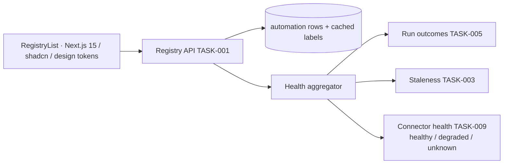

Engine spec: [events-actions-engine.md](../../../events-actions-engine.md)
Contracts: [contracts.md](../../../../contracts.md)

## Story

As an automation author, I want all automations in a list with status, recent-run data, and
health indicators so that I can manage my library and spot failures or stale pins without opening
each automation.

## Scope Note

Implements E1-S1 + E1-S2 in the shared SPA (Automate primary area, design tokens from
`docs/standards/design/`): the registry list over the TASK-001 API, health chips composed from
TASK-005 run outcomes, TASK-003 staleness, and TASK-009 connector health, plus Edit/Pause/Delete
row actions. Every degraded upstream renders fail-visible — the epic's core rule is "never
silently green".

## Acceptance Criteria

| ID | Criterion (EARS) |
|---|---|
| AC-012-01 | WHEN Automate → Automations opens THE SYSTEM SHALL show each row with name, status chip (Active/Draft/Paused), trigger-type icon, linked CE entity (label + IRI via `CE-READ-1`), pinned ontology version (`CE-VERSION-1`), last run (relative ts), 7-day run count, and Edit/Pause/Delete; filters All/Active/Draft/Paused/Mine; sorts last run / run count / name; search by name or linked entity. |
| AC-012-02 | IF `CE-READ-1` is unavailable THEN THE SYSTEM SHALL still render rows from the engine store showing the cached grounding label with a "CE unavailable — showing cached label" badge — the list never fails wholesale. |
| AC-012-03 | WHERE the last run exhausted retries THE SYSTEM SHALL show a red dot + "Last run failed (N retries exhausted)" tooltip. |
| AC-012-04 | WHERE the pin lags latest by ≥ the canonical staleness threshold (`CE-VERSION-1` lag, default ≥ 2, tunable) THE SYSTEM SHALL show an amber "Pin stale — N versions behind" chip. |
| AC-012-05 | WHERE a depended-on connector reports degraded/disconnected THE SYSTEM SHALL show a warning chip; IF the `PLAT-CONNECTOR-1` health API itself errors THEN the chip SHALL read "connector health unknown" — never silently green. |
| AC-012-06 | WHEN any registry query runs THE SYSTEM SHALL return only the requesting principal's tenant rows (server-enforced; the UI adds no tenant filtering of its own). |
| AC-012-07 | WHEN the registry renders THE SYSTEM SHALL pass axe-core with zero violations (WCAG 2.1 AA — chips carry text equivalents, not colour-only signals). |

## API Contracts

Reads engine-internal registry API (TASK-001) which aggregates `CE-READ-1` labels (cached),
`CE-VERSION-1` staleness (TASK-003), and `PLAT-CONNECTOR-1` health (TASK-009). No direct
inter-engine calls from the browser.

## Diagram

## Design Decisions

| Decision | Rationale | Source |
|---|---|---|
| Health aggregated server-side into one row payload | One request per page; chips consistent with Builder header (registry never contradicts the editor) | E1 epic AC |
| Cached-label degrade with explicit badge | Fail-visible beats blank or stale-silent | E1-S1 failure AC |
| Chips carry text + tooltip, not colour-only | WCAG; "unknown" must be textually distinct from healthy | NFR a11y |
| UI performs no tenant logic | Isolation is server truth; the UI cannot compensate or leak | arch D3 |

## Test Requirements

| Layer | Scenario | AC |
|---|---|---|
| Unit (Vitest) | Row rendering incl. all chip states; unknown ≠ green | AC-012-03/04/05 |
| Unit (Vitest) | CE-down badge state; filters/sort/search wiring | AC-012-01/02 |
| Integration | Health aggregator composes the three sources; staleness consumed not computed | AC-012-04/05 |
| E2E | Registry happy path + tenant isolation (tenant-A sees zero tenant-B rows) | AC-012-01/06 |
| E2E | axe-core zero violations on the registry | AC-012-07 |

## Dependencies

- **blocked_by**: TASK-001 (API), TASK-003 (labels/staleness), TASK-005 (failed-run data),
  TASK-009 (connector health)
- **unlocks**: TASK-017 (templates land into the registry)

## Cost Estimate

**M** — a data-table screen, but the health-state matrix and fail-visible degradations need
disciplined component states.

## DoR Checklist

- [ ] Design tokens + table/chip components available in `docs/standards/design/`
- [ ] Registry API response shape (incl. aggregated health) frozen with TASK-001 owner
- [ ] Chip-state matrix reviewed (healthy/degraded/unknown × failed/stale × CE-down)

## DoD Checklist

- [ ] All ACs pass (unit + integration + E2E)
- [ ] `ui_verify` gate passes; no ad-hoc hex/px/duration values (design tokens only)
- [ ] Lighthouse: Perf ≥ 90, A11y ≥ 95 on the registry route
- [ ] Empty/loading/error states designed and tested (not just happy path)
- [ ] Coverage ≥ 80%, Stryker ≥ 70% on chip-state logic

## Implementation Hints

Drive all chips from a single typed `health` object in the row payload —
`{last_run: failed|ok, pin: stale|current, connectors: healthy|degraded|unknown, ce: live|cached}`
— so the chip matrix is a pure render mapping (easy Vitest coverage, easy Stryker survival).
Relative timestamps via a shared util with a fixed-clock test seam.
