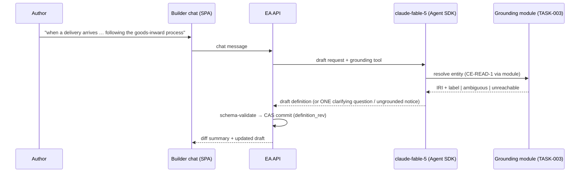

Engine spec: [events-actions-engine.md](../../../events-actions-engine.md)
Contracts: [contracts.md](../../../../contracts.md) · Flow:
[business-process.md §NL Authoring](../../tech-spec/business-process.md)

## Story

As an operations owner, I want to describe an automation in natural language that references a
specific BPMO `Process`, `Activity`, or governing `Policy` so that the AI builds it grounded in my
actual documented process — not hand-wired against raw APIs.

## Scope Note

Implements E2-S1 + E2-S2: the Builder chat pane (left half of the split-pane), the drafting agent
(`claude-fable-5` via the Agent SDK), grounding via the TASK-003 module (which owns all CE
access), the disambiguation loop (one inline question; default 3 rounds tunable; then the "Link to
ontology" searcher), transactional definition edits (CAS via TASK-001), diff summaries, and
"Undo last AI change". Canvas projection is TASK-014; activation is TASK-015.

## Acceptance Criteria

| ID | Criterion (EARS) |
|---|---|
| AC-013-01 | WHEN I describe an automation referencing a CE entity THE SYSTEM SHALL resolve it via `CE-READ-1` (SELECT-only, paginated — through TASK-003) and draft a simple-tier definition with grounding + pin candidate, within the default 10 s target (ASSUMPTION-tunable). |
| AC-013-02 | WHERE the description matches multiple processes THE SYSTEM SHALL ask ONE clarifying question inline (not a modal); after 3 unresolved rounds (tunable) it SHALL fall back to the "Link to ontology" searcher rather than looping. |
| AC-013-03 | IF the CE lookup times out/5xx, or the entity exists only in a draft version, THEN THE SYSTEM SHALL NOT fabricate an IRI — it SHALL surface "couldn't reach / resolve the ontology; the process may need publishing in the Constitution Engine first" and leave the draft ungrounded (non-activatable). |
| AC-013-04 | WHEN I type a follow-up instruction THE SYSTEM SHALL apply the AI edit transactionally to the canonical definition (CAS on `definition_rev`) and show a diff summary in chat; a failed schema validation SHALL leave the definition byte-identical with the specific error shown. |
| AC-013-05 | WHEN I click "Undo last AI change" THE SYSTEM SHALL revert to the prior committed definition state and re-project both views. |
| AC-013-06 | WHEN the drafting agent produces a definition THE SYSTEM SHALL validate it against the TASK-001 schema before commit — model output is never trusted into the store unvalidated. |
| AC-013-07 | WHEN the chat surface renders THE SYSTEM SHALL pass axe-core with zero violations (WCAG 2.1 AA). |

## API Contracts

Consumes **CE-READ-1**/**CE-VERSION-1** exclusively via the TASK-003 grounding module. Model
boundary: Anthropic Agent SDK → Bedrock, `claude-fable-5` (authoring tier). Engine-internal:
`POST /api/automations/{id}/chat` (message → draft/edit transaction + diff).

## Diagram

## Design Decisions

| Decision | Rationale | Source |
|---|---|---|
| Grounding is a tool call into TASK-003, not model knowledge | The module enforces published-only + no-fabrication; the model cannot mint IRIs | E2-S1, arch D1 |
| Schema-validate before every commit | Model output is untrusted input at a boundary | security.md, AC E2-S2 |
| Undo = revert to prior committed rev, not prompt-based | Deterministic; survives model unavailability | E2-S2 |
| `claude-fable-5` for authoring only | Judgement-heavy low-volume per the two-tier policy | stack §models |

## Test Requirements

| Layer | Scenario | AC |
|---|---|---|
| Unit | Disambiguation round counter + searcher fallback | AC-013-02 |
| Unit | Draft validation rejects malformed model output; definition unchanged | AC-013-04/06 |
| Unit (Vitest) | Chat states: clarifying question inline, ungrounded notice, diff rendering, undo | AC-013-02/03/05 |
| Integration | Stubbed model transport: describe → grounded draft committed via CAS | AC-013-01 |
| Integration | CE timeout/draft-only ⇒ ungrounded draft, no IRI anywhere in the definition | AC-013-03 |
| Integration | Multi-turn: edit → undo → edit; definition history consistent | AC-013-04/05 |
| E2E | NL describe → grounded draft; CE-down branch shows the message (Plugin Law B: backend row asserted) | AC-013-01/03 |

## Dependencies

- **blocked_by**: TASK-001 (CAS transactions), TASK-003 (grounding module)
- **unlocks**: TASK-014 (canvas projects the same definition; chat hosts its diff summaries),
  TASK-015 (drafts feed activation)

## Cost Estimate

**L** — an agent-in-the-loop authoring surface with strict no-fabrication and transactional
semantics; prompt/tool design plus the multi-turn state machine carry the risk. Model-quality
evals run in the `testing-agents.md` lane, not the pyramid.

## DoR Checklist

- [ ] TASK-001/003 merged
- [ ] Drafting-agent tool schema reviewed (grounding tool, definition-emit tool)
- [ ] Clarification-rounds + draft-latency defaults in the TASK-002 catalogue
- [ ] Design tokens for chat components available

## DoD Checklist

- [ ] All ACs pass (unit + integration + E2E; stubbed transport in the pyramid)
- [ ] Fabrication-impossibility test: model emitting an unresolved IRI is rejected at validation
- [ ] Authoring calls metered per-token to `PLAT-BILLING-1`
- [ ] `ui_verify` gate + Lighthouse (Perf ≥ 90, A11y ≥ 95) on the Builder route
- [ ] Coverage ≥ 80%, mutation ≥ 70% on the transaction/disambiguation logic

## Implementation Hints

Give the agent two tools only: `resolve_grounding(text) → {iri,label,kind} | ambiguous |
unreachable` and `emit_definition(json)` — everything else is conversation. Keep an
`ai_change_log` (rev before/after per AI edit) to make Undo O(1) and auditable. Stream the draft
into the chat but commit only on complete valid output; partial streams never touch the store.
