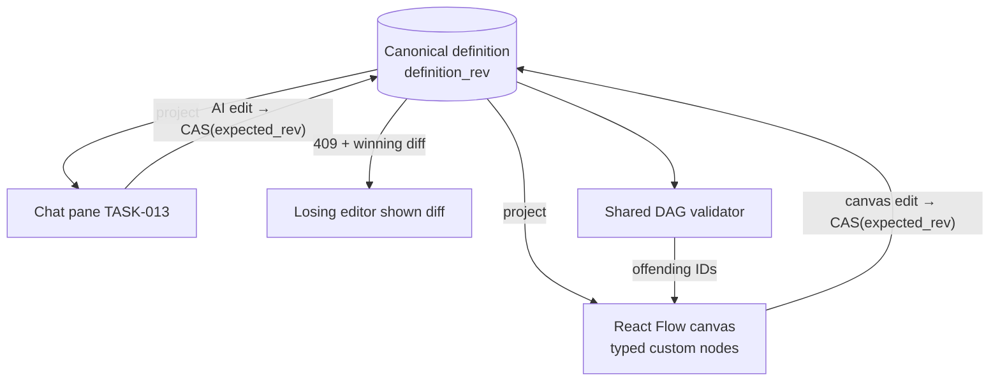

Engine spec: [events-actions-engine.md](../../../events-actions-engine.md)
Contracts: [contracts.md](../../../../contracts.md)

## Story

As an automation author, I want a visual flow canvas that never diverges from the chat so that I
can inspect and edit the automation without reading JSON, trusting that both views show the same
truth.

## Scope Note

Implements E3-S1 + E3-S2 (ADR-004): the right half of the Builder split-pane — React Flow with
typed custom nodes (Trigger, Condition, Action, HITL Gate, Error Handler, End), node inspectors
(config forms per node type, incl. trigger/action configs from TASK-008/009/010/011),
zoom/pan/minimap/fit/PNG-export, keyboard navigation, cycle/disconnection highlighting (shared DAG
validator), and the projection layer: canvas edits as CAS transactions with chat diff summaries,
AI edits re-projected ≤ 500 ms (tunable) with a "Syncing…" indicator, 409 losers shown the diff.
Exact input bindings deferred to the design spec (OQ-08).

## Acceptance Criteria

| ID | Criterion (EARS) |
|---|---|
| AC-014-01 | WHEN a definition renders THE SYSTEM SHALL draw the DAG with all six node types (trigger variants: webhook/Jira/ServiceNow/Slack/cron; Phase-2 types render flagged-unavailable) and open a typed inspector per node. |
| AC-014-02 | WHEN I interact THE SYSTEM SHALL support zoom, pan, minimap on overflow, fit-to-view, PNG export of the current view, and keyboard navigation (Tab cycles nodes, Enter opens inspector, Escape closes); minimap and controls carry aria-labels. |
| AC-014-03 | IF the definition has a cycle or disconnected node THEN THE SYSTEM SHALL highlight the offending nodes (IDs from the shared DAG validator) and mark the definition non-activatable — regardless of which editor produced it. |
| AC-014-04 | WHEN I make a canvas edit (node property, add/remove, edge change) THE SYSTEM SHALL apply it as a CAS transaction against the canonical definition and show "Canvas updated — [diff]" in the chat. |
| AC-014-05 | WHEN an AI edit commits THE SYSTEM SHALL re-project the canvas within the default 500 ms (tunable) with a "Syncing…" indicator in flight. |
| AC-014-06 | IF a canvas edit and an AI edit commit concurrently THEN THE SYSTEM SHALL resolve by optimistic LWW on `definition_rev`: the losing edit is rejected and its author shown the diff to re-apply — no silent merge, ever. |
| AC-014-07 | WHEN the canvas mounts with ≤ 20 nodes THE SYSTEM SHALL reach first meaningful render ≤ 500 ms (canvas chunk lazy-loaded to protect the 200 KB initial bundle). |

## API Contracts

Engine-internal only: the same `POST /api/automations/{id}/definition` CAS endpoint as chat
(TASK-001) — one write path for both projections. Re-projection push via the SPA's existing data
layer (poll/SSE per platform convention).

## Diagram

## Design Decisions

| Decision | Rationale | Source |
|---|---|---|
| React Flow with definition-derived state, never canvas-owned state | The canvas is a projection; authoritative state lives in one row | ADR-004, FR-011 |
| Same CAS endpoint as chat | One write path ⇒ one conflict semantic ⇒ one test surface | ADR-003 §2 |
| Offending-node IDs from the shared validator | FR-010 must be identical across API/SPA/interpreter | TASK-001 |
| Phase-2 node types render flagged-unavailable | Templates contain them at GA; visibility without activatability | arch D9 |
| Canvas chunk lazy-loaded | Registry/chat users don't pay the canvas bundle | perf budget |

## Test Requirements

| Layer | Scenario | AC |
|---|---|---|
| Unit (Vitest) | Six node types render; inspectors open with typed forms; unavailable flags | AC-014-01 |
| Unit (Vitest) | Keyboard nav Tab/Enter/Escape; aria-labels present | AC-014-02 |
| Unit (Vitest) | Projection reducer: definition → nodes/edges is pure and total | AC-014-05 |
| Unit (Vitest) | Cycle highlight from validator output | AC-014-03 |
| Integration | Concurrent CAS: canvas vs AI edit → one 409 with diff | AC-014-06 |
| E2E | Canvas edit → chat diff appears; AI edit → canvas re-projects with indicator | AC-014-04/05 |
| E2E | Cycle produced via canvas blocks activation with highlight | AC-014-03 |

## Dependencies

- **blocked_by**: TASK-013 (split-pane host + chat diff surface; same CAS path)
- **unlocks**: TASK-015 (activation validates canvas-visible state), TASK-017 (templates open
  pre-populated on this canvas)

## Cost Estimate

**L** — the projection/conflict layer is the product's hardest UX promise; React Flow removes the
rendering risk but not the sync-semantics risk.

## DoR Checklist

- [ ] ADR-004 approved; `@xyflow/react` added via the standard dependency process
- [ ] TASK-013 merged (split-pane + chat diff rendering)
- [ ] Node inspector form schemas agreed with TASK-008/009/010/011 owners
- [ ] Design tokens for node/inspector components available (no ad-hoc styling)

## DoD Checklist

- [ ] All ACs pass (unit + integration + E2E)
- [ ] `ui_verify` gate passes; Lighthouse Perf ≥ 90 / A11y ≥ 95 on the Builder route
- [ ] Initial JS bundle ≤ 200 KB gzipped with the canvas chunk lazy-loaded (measured)
- [ ] Re-projection timing test at the 500 ms budget (tunable value read from settings)
- [ ] Coverage ≥ 80%, Stryker ≥ 70% on projection reducers and conflict handling

## Implementation Hints

Key React Flow state by `definition_rev` and rebuild nodes/edges through a memoised pure reducer —
never patch canvas state imperatively after an external commit. Debounce node-drag position
persistence (positions are cosmetic metadata in the definition's layout block, not semantic
edges). PNG export via `html-to-image` on the flow viewport element. For the 409 path, reuse the
diff-summary component chat already renders (TASK-013) — one diff renderer.
