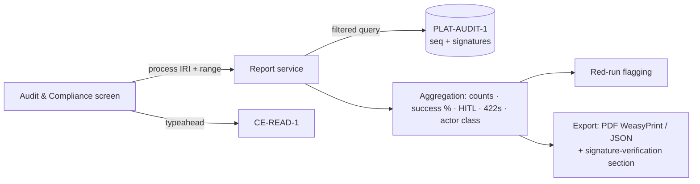

Engine spec: [events-actions-engine.md](../../../events-actions-engine.md)
Contracts: [contracts.md](../../../../contracts.md)

## Story

As a compliance officer, I want a compliance report for a specific ontology process so that I can
prove automated actions followed the company's documented obligations — with the platform audit
trail as the verifiable source.

## Scope Note

Implements E9-S2 over the TASK-007 view layer: the Audit & Compliance screen (grounded-process
typeahead via `CE-READ-1`, date range), the report VIEW (run count, success %, failure breakdown,
HITL approvals vs rejections, `CE-WRITE-1` 422 SHACL violations — populated in Phase 2, the column
exists and reads zero at Phase 1), actor-class filtering (human / interactive-LLM /
`prov:SoftwareAgent`), Red-run flagging, and PDF/JSON export carrying `PLAT-AUDIT-1` sequence
numbers + signatures + a verification section. PDF generation: WeasyPrint on Lambda (OQ-06 —
lighter than headless Chromium; recorded as a design decision, not an ADR).

## Acceptance Criteria

| ID | Criterion (EARS) |
|---|---|
| AC-016-01 | WHEN I filter by grounded process IRI (typeahead via `CE-READ-1`) + date range THE SYSTEM SHALL render a report computed as a VIEW over `PLAT-AUDIT-1`: run count, success %, failure breakdown, HITL approvals vs rejections, and any step with a `CE-WRITE-1` 422 SHACL violation (zero rows at Phase 1; the surface exists). |
| AC-016-02 | WHEN the actor-class filter is applied THE SYSTEM SHALL distinguish human (`user`), interactive-LLM (`llm`), and automation principal (`prov:SoftwareAgent`) actor classes from the audit events' principal IRIs. |
| AC-016-03 | IF a run contains any 422 SHACL violation or HITL rejection THEN THE SYSTEM SHALL flag it distinctly as a "Red run". |
| AC-016-04 | WHEN a report is exported (PDF or JSON) THE SYSTEM SHALL include `PLAT-AUDIT-1` sequence numbers + signatures and a signature-verification section — the export is verifiable against the platform trail without this engine's cooperation. |
| AC-016-05 | WHEN the report screen renders THE SYSTEM SHALL meet the run-history latency budget (≤ 1 s p95 at 30 days; ≤ 3 s p95 report render at 1k runs) and pass axe-core with zero violations. |
| AC-016-06 | WHEN any report query executes THE SYSTEM SHALL return only the requesting tenant's events (audit-query tenancy + RLS on local joins). |

## API Contracts

Consumes **PLAT-AUDIT-1** (query + export with signature metadata — via the TASK-007 view layer),
**CE-READ-1** (process typeahead). See [contracts.md](../../../../contracts.md). Engine-internal:
`GET /api/compliance/report`, `POST /api/compliance/report/export`.

## Diagram

## Design Decisions

| Decision | Rationale | Source |
|---|---|---|
| Report computed from PLAT-AUDIT-1, local rows for navigation only | The proof must come from the signed trail, not engine state | E9 epic AC |
| WeasyPrint on Lambda for PDF (OQ-06 closed) | Pure-Python, small cold start; report layouts are document-like, not JS-rendered | OQ-06 |
| Actor class derived from principal IRI class, not a stored label | One source of truth (PLAT-IDENTITY-1 classes); labels can't drift | PRD §2.5 |
| 422-SHACL column present at Phase 1, zero-filled | Report schema stable across the Phase-2 graph-update landing | arch D9 |

## Test Requirements

| Layer | Scenario | AC |
|---|---|---|
| Unit | Aggregation math (success %, breakdowns) over fixture event sets | AC-016-01 |
| Unit | Actor-class derivation; Red-run predicate | AC-016-02/03 |
| Integration | Report over stub audit trail; tenancy filter; Phase-1 zero-filled 422 column | AC-016-01/06 |
| Integration | Export contains seq + signatures + verification section (JSON asserted; PDF smoke) | AC-016-04 |
| E2E | Filter → report → export journey; Red-run visible; axe zero violations | AC-016-03/05 |

## Dependencies

- **blocked_by**: TASK-007 (audit view layer)
- **unlocks**: — (terminal consumer; satisfies the PRD compliance success criterion)

## Cost Estimate

**M** — aggregation + export over an existing view layer; PDF templating is bounded.

## DoR Checklist

- [ ] TASK-007 merged (view layer + query shapes)
- [ ] PLAT-AUDIT-1 export/signature-metadata API pinned from contracts.md
- [ ] Report layout approved against design tokens (PDF mirrors the screen)

## DoD Checklist

- [ ] All ACs pass (unit + integration + E2E)
- [ ] Export verification section validated against the stub's signature scheme
- [ ] Report latency budget test at 1k-run seed
- [ ] No audit payload fields beyond the typed schema leak into exports
- [ ] Coverage ≥ 80%, mutation ≥ 70% on aggregation/flagging logic

## Implementation Hints

Aggregate in SQL over the audit-view projection where possible (the trail query API + a local
materialised staging of the filtered window), not in Python loops — the 1k-run budget is a query
problem. Keep the PDF template as HTML/CSS shared with the screen's print stylesheet so screen
and export cannot diverge. The verification section is data (seq range, signature scheme id,
verification endpoint), not prose.
