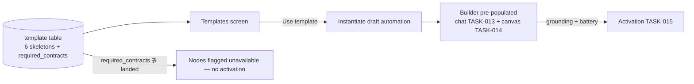

Engine spec: [events-actions-engine.md](../../../events-actions-engine.md)
Contracts: [contracts.md](../../../../contracts.md)

## Story

As an automation author, I want pre-built templates so that I start from a working pattern rather
than a blank canvas — with the same grounding and activation rules as hand-built automations.

## Scope Note

Implements E10-S1: the global template library (`template` table — non-tenant, read-only), the
Templates screen, "Use template" (instantiates a draft `automation` pre-populated in the Builder),
and the `required_contracts` flagged-unavailable mechanism. All six named templates ship at GA;
the two graph-change templates ("New employee onboarding", "Stock reorder trigger") carry
`{CE-EVENT-1}` and cannot activate until it lands; "Update graph on Jira close" carries
`{CE-WRITE-1}` for its graph-update node (ships, activation of that node Phase 2). Template
*content* is definition JSON — no new engine mechanics.

## Acceptance Criteria

| ID | Criterion (EARS) |
|---|---|
| AC-017-01 | WHEN Automate → Templates loads THE SYSTEM SHALL show all six GA templates: "Notify on delivery arrival" (webhook → Slack), "Escalate unresolved incident" (ServiceNow → HITL gate → agent run), "Update graph on Jira close" (Jira → graph update; graph-update node flagged), "Daily compliance summary" (cron → agent run → Slack), "New employee onboarding" (graph-change → multi-step agent run; flagged), "Stock reorder trigger" (graph-change: SHACL violation → API call → Slack; flagged). |
| AC-017-02 | WHEN "Use template" is clicked THE SYSTEM SHALL create a draft automation from the skeleton, open it pre-populated in the Builder (chat + canvas), and require a grounding link to a PUBLISHED entity before activation — exactly the TASK-015 battery, no template bypass. |
| AC-017-03 | IF a template references a trigger/action/contract unavailable in the tenant (graph-change before `CE-EVENT-1`; graph-update before the Phase-2 action; a connector not configured) THEN THE SYSTEM SHALL flag the unavailable nodes on open and the automation SHALL NOT activate until resolved. |
| AC-017-04 | WHEN the two `CE-EVENT-1`-gated templates render in the library THE SYSTEM SHALL show them present-but-flagged (ship at GA; *activation* closes out in Phase 2) — never hidden. |
| AC-017-05 | WHEN the Templates screen renders THE SYSTEM SHALL pass axe-core with zero violations (WCAG 2.1 AA surface per NFR). |

## API Contracts

No inter-engine calls of its own — instantiated drafts flow through existing TASK-001/013/015
paths (grounding via `CE-READ-1` happens there). Engine-internal: `GET /api/templates`,
`POST /api/templates/{slug}/use`.

## Diagram

## Design Decisions

| Decision | Rationale | Source |
|---|---|---|
| Templates are data (definition skeletons), not code | Adding a template is a row; validation reuses the one schema | Law E |
| `required_contracts` drives flagging | One mechanism covers CE-EVENT-1, CE-WRITE-1, and unconfigured connectors | arch D9 |
| Gated templates visible-but-flagged, never hidden | The PRD ships all six at GA; honesty about availability | E10 epic AC |
| No template-specific activation path | Template-originated automations are ordinary drafts | E10-S1 |

## Test Requirements

| Layer | Scenario | AC |
|---|---|---|
| Unit | All six skeletons validate against the definition schema (incl. Phase-2 node values parsing) | AC-017-01 |
| Unit | required_contracts × landed-contracts flagging matrix | AC-017-03/04 |
| Integration | Use template → draft created → Builder payload pre-populated | AC-017-02 |
| Integration | Gated template blocks at the TASK-015 battery with flagged nodes | AC-017-03 |
| E2E | Library → use → ground → activate (activatable template); flagged template shows unavailable nodes | AC-017-02/03/04 |
| E2E | axe zero violations on Templates | AC-017-05 |

## Dependencies

- **blocked_by**: TASK-012 (registry landing), TASK-013/014 (Builder pre-population), TASK-015
  (activation battery incl. phase-gated node check)
- **unlocks**: — (Onboarding's Hammerbarn example automations build on these post-engine)

## Cost Estimate

**S** — data + one screen + an instantiation endpoint; every hard mechanism already exists
upstream.

## DoR Checklist

- [ ] TASK-012/013/014/015 merged
- [ ] Six template skeletons drafted and schema-validated
- [ ] Landed-contract detection source agreed (settings/feature flags vs contract registry)

## DoD Checklist

- [ ] All ACs pass (unit + integration + E2E)
- [ ] Skeleton CI check: every template validates against the current definition schema version
- [ ] `ui_verify` + Lighthouse gates on the Templates route
- [ ] Coverage ≥ 80%, Stryker ≥ 70% on the flagging matrix

## Implementation Hints

Seed skeletons via migration so environments stay identical. Grounding placeholders in skeletons
are explicit `"grounding": null` — the Builder's existing "link before activate" flow does the
rest. The flagging matrix belongs beside the activation battery's phase-gated check (one landed-
contracts source consulted by both).
