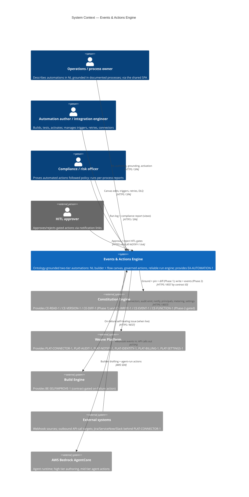
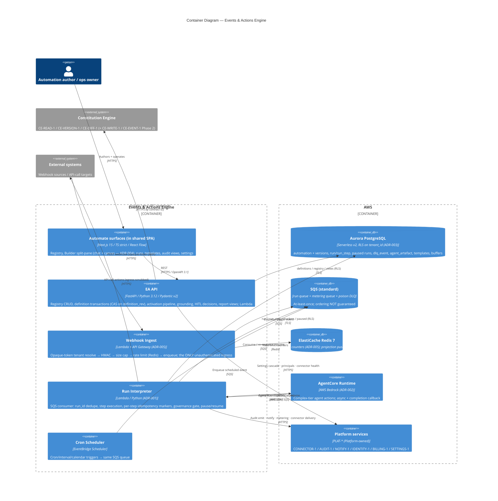
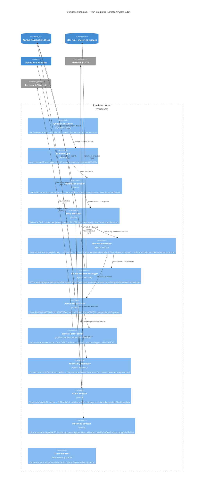

# Architecture: Events & Actions Engine

## Overview

The Events & Actions Engine is the automation layer: events in integrated systems (webhooks,
Jira/ServiceNow/Slack via `PLAT-CONNECTOR-1`, cron) trigger governed actions (Slack notification,
API call, agent run, graph update) grounded in the company's ontology. It is a **pure contract
consumer plus one provider**: it provides `EA-AUTOMATION-1` (the two-tier automation model) and
consumes the CE spine (`CE-READ-1`, `CE-VERSION-1`, `CE-DIFF-1`; `CE-WRITE-1` and `CE-EVENT-1` are
Phase-2-gated) and six `PLAT-*` services. It owns **no RDF store and no audit store**: graph access
goes only through CE contracts (CE's rewriter enforces isolation, CE ADR-001), and the run-log +
compliance report are filtered VIEWS over `PLAT-AUDIT-1`.

Phase 1 (the engine's v1 GA; **program position post-v1** — nothing here is on the program-MVP
critical path) ships: the automation registry, the NL-first Builder (chat + React Flow canvas as
projections of one canonical JSONB definition — ADR-003/ADR-004), webhook/connector/cron triggers
(ADR-005), Slack/API-call/agent-run actions with the deterministic 4-step governance gate, the
SQS + Lambda interpreter run spine with per-step idempotency and durable paused runs (ADR-001),
agent execution on Bedrock AgentCore (ADR-002), per-run + per-token metering (`PLAT-BILLING-1`),
and compliance reporting. **Phase-2-gated and NOT specced as available:** graph-change triggers
(`CE-EVENT-1` — degrade to `CE-READ-1` since-version polling), the graph-update action
(`CE-WRITE-1` writes from this engine), portable artefact export, sub-automation composition, and
`CE-FUNCTION-1` action references. `BE-SELFIMPROVE-1` is contract-gated degradable (the
"create self-healing issue" on-failure option is simply unavailable until it lands).

The AI boundary is Anthropic Agent SDK → AWS Bedrock: high tier powers Builder authoring
(judgement-heavy, low-volume); mid tier powers complex-tier agent-run actions (volume).
The two-tier model policy admits no other tiers.

## C4 Model

### Level 1: System Context

Context notes: every inward arrow from another engine is a contract citation, never an invented
endpoint. The external-systems boundary is the engine's only unauthenticated ingress (webhooks —
ADR-005) and its only governed egress (API-call actions with run-time secret scrub, FR-008b).

### Level 2: Container

Container notes:

- **Automate surfaces** are the Events slice of the single Weave SPA (Automate primary area); the
  engine owns its secondary navigation, not the chrome.
- **EA API** and the **Run Interpreter** are separate deployables sharing the Pydantic definition
  schema package: the API owns authoring-time state transitions, the interpreter owns run-time
  ones. Both enforce RLS session context on every connection.
- **Webhook Ingest** is deliberately thin — the whole webhook trust boundary concentrates in one
  Lambda (ADR-005), mirroring CE's single-choke-point philosophy.
- The **Agent SDK → AgentCore boundary** is visible here per stack law: only the interpreter
  dispatches agent runs (run-time, mid tier); only the EA API calls Bedrock for Builder
  drafting (authoring-time, high tier).
- There is **no RDF store in this engine's boundary** — grounding resolution, typeahead, pin
  checks, and (Phase 2) writes all cross the CE contract surface.

### Level 3: Component — Run Interpreter (execution + governance path)

The interpreter is the L3 target: it concentrates the architectural risk — at-least-once
semantics, per-step idempotency, the deterministic governance gate, durable pause/resume, and the
never-dropped audit/metering emission all live here. The EA API and SPA are structurally
conventional CRUD + projection surfaces.

Component notes: 12 components — at the ≤ 12 cap. Every autonomous action runs
`stepper → gate → (pauser | actions → scrub)`; there is no dispatch path that bypasses the gate or
the scrub (grep-enforced: `actions` is the only module that opens outbound connections, and its
only exported entry point takes a `GateDecision`). The idempotency marker write is transactional
with the step-outcome write (ADR-001 §3), so a crash between side-effect and marker is the
documented best-effort window per action type — never a silent double-fire beyond it.

## Consumed-Contract Phase Map

The engine's availability posture per contract — this table is binding on task DoR:

| Contract | Landed by Events Phase 1? | Phase-1 behaviour | Phase-2 behaviour |
|---|---|---|---|
| `CE-READ-1` / `CE-VERSION-1` / `CE-DIFF-1` | Yes (CE M1) | Grounding, pinning, upgrade-diff, typeahead | unchanged |
| `PLAT-AUDIT-1` / `PLAT-NOTIFY-1` / `PLAT-IDENTITY-1` / `PLAT-SETTINGS-1` / `PLAT-BILLING-1` | Yes (Platform M1) | Full use | unchanged |
| `PLAT-CONNECTOR-1` | Yes (Platform v1.0 < Events post-v1) | Jira/ServiceNow/Slack triggers + Slack delivery; health gating | unchanged |
| `CE-WRITE-1` | Contract live (CE M1) but Events' graph-update action is **PRD-gated to Phase 2** | NO Events-originated graph writes; templates needing it flag unavailable | Graph-update action; 422 terminal / 5xx retried; `prov:SoftwareAgent` |
| `CE-EVENT-1` | No (CE M2 beta; transport OQ-03 open) | NO graph-change triggers; 2 of 6 templates flagged unavailable | Graph-change triggers; degrade to `CE-READ-1` since-version polling if transport still not ready |
| `BE-SELFIMPROVE-1` | Contract-gated (Build post-v1) | On-failure option shown unavailable; notify/log/stop functional | "create self-healing issue" (HITL-gated) when live |
| `CE-FUNCTION-1` | No (CE M2/v1.0 registry; Events ref is Phase 2) | Not referenced | Actions reference functions by `fn_iri`; CE owns definition/versioning |

## Design Decisions

Adversarial critic pass run before writing this table; the five mandatory challenges appear as
D1–D5, engine-specific challenges as D6–D9. Engine ADRs live in [`../decisions/`](../decisions/).

| # | Decision | Rationale | Alternatives Rejected | Critic Challenge | Response |
|---|----------|-----------|----------------------|-----------------|---------|
| D1 | All graph access crosses CE contracts; the engine owns no RDF store (ADR-003) | CE's single rewriter is the program's isolation choke point; a second graph path would be a second breach surface | Local graph cache / direct store reads for grounding speed | "Where is the RDF boundary — can Events leak tenant graph data?" | Events holds only IRIs + cached labels (marked stale when CE unreachable); every SPARQL is a `CE-READ-1` call carrying the caller's tenant context |
| D2 | Idempotency marker written transactionally with step outcome; replay from last incomplete step (ADR-001) | A crash between side-effect and ack must not re-fire the effect on redelivery | run_id dedupe only (whole-run) — re-fires completed steps mid-run | "What if the Lambda dies mid-step?" | No marker ⇒ step re-executes; marker ⇒ skipped. The unmarked-crash window is documented per action type as best-effort (e.g. Slack send uses connector-side idempotency key where available) |
| D3 | Tenant isolation = Postgres RLS (fail-closed) + opaque webhook token resolved before any tenant-scoped read (ADR-003/ADR-005) | Two independent layers; the unauthenticated webhook surface never sees a tenant identifier from the body | Application-layer scoping only; tenant in payload | "Where is multi-tenancy enforced and what is the blast radius of a miss?" | RLS predicate NULLs to zero rows without session context; unknown token is 404 with no existence oracle; cross-tenant-read test is a release gate |
| D4 | Agent blast radius capped: per-automation least-privilege principal, gate before dispatch, node timeout, pinned artefact semver, per-token metering (ADR-002) | An agent action must not exceed the authority of the process step it automates | Shared engine-wide principal; unbounded agent wall-clock | "What is the token/authority blast radius of the agent path?" | Principal scope derives from the grounded step; explicit deny beats all authority; timeout default 60 s; tokens metered per-run to PLAT-BILLING-1 |
| D5 | Platform-service outage ⇒ durable buffering, never dropped, never fail-open (audit/metering buffer tables; secret-scan fail-closed; connector-degraded blocks activation) | Audit completeness and billing accuracy outrank run throughput; safety gates outrank availability | Drop events under outage; fail-open scan | "What happens when PLAT-AUDIT-1 / the scanner / a connector is down?" | Buffered + retried; run marked degraded if buffering fails; activation blocks on scanner outage (FR-008); connector-degraded blocks activation and flags via PLAT-NOTIFY-1 |
| D6 | Governance gate is deterministic code, not model judgement (FR-022) | Compliance must be provable; an LLM cannot be the arbiter of whether an LLM may act | Prompt-level "check policy" instructions | "Can the agent talk its way past the gate?" | The 4-step sequence (deny → authority → automatable → HITL) executes in the interpreter before dispatch; `automatable` absent ⇒ false ⇒ human (CE-owned SHACL default); no-self-approval enforced on the decision endpoint |
| D7 | One canonical JSONB definition; chat + canvas are projections; CAS on `definition_rev` (ADR-003/ADR-004) | Two edit models would inevitably diverge; LWW-with-diff needs a single version token | Bidirectional sync between two stores | "What prevents silent divergence between chat and canvas?" | Both editors submit transactions against the same row; the loser gets 409 + diff; cycle/disconnection validation runs on the definition, shared by both sides |
| D8 | Runs execute the pinned `automation_version` snapshot + pinned ontology `version_iri`, never mutable drafts | Ontology evolution or a mid-run edit must not change a live run's semantics | Run against draft definition / `version=latest` | "What breaks when the ontology or definition changes under a run?" | Snapshot rows are immutable; pin upgrades are explicit CE-DIFF-1-confirmed actions; withdrawn pin auto-pauses affected automations (E6-S2) |
| D9 | Phase gating is architectural: CE-WRITE-1/CE-EVENT-1/BE-SELFIMPROVE-1 surfaces ship flagged-unavailable, with the polling degrade pre-designed | The PRD's roadmap gates these; speccing them as available would fabricate dependencies | Build against unlanded contracts; hide the affected templates | "Does anything in Phase 1 silently require a Phase-2 contract?" | The Consumed-Contract Phase Map is binding on task DoR; 2 of 6 templates + graph-update + self-healing options render as flagged-unavailable, tested as such |

## Invariants

All invariants are EARS-notated; each maps to at least one release-gate test
(testing-strategy.md §release gates).

- **Tenancy:** WHEN any registry/run/audit/report query executes THE SYSTEM SHALL return zero
  rows belonging to another tenant, and an unscoped or tenant-B-scoped request from a tenant-A
  principal SHALL be logged — enforced by fail-closed RLS plus application scoping (ADR-003).
- **Webhook trust boundary:** WHEN an inbound webhook arrives THE SYSTEM SHALL resolve the tenant
  from the opaque server-side token BEFORE touching any tenant-scoped resource; tenant SHALL never
  be inferred from the body; bad/absent HMAC (where required), unknown token, oversize, schema
  mismatch, or rate-limit breach SHALL route to DLQ with a typed reason (ADR-005, E4-S1).
- **Grounding:** WHEN activation is attempted without a grounding link resolving to an entity in a
  PUBLISHED ontology version THE SYSTEM SHALL block it; no orphan automation ever runs (E6-S1).
- **Pinning:** WHEN an active automation runs THE SYSTEM SHALL execute against its pinned
  `version_iri` and pinned definition snapshot; WHEN a pinned version is withdrawn or the grounded
  IRI is absent from the pinned snapshot THE SYSTEM SHALL auto-pause affected automations and
  notify via `PLAT-NOTIFY-1` (E6-S2).
- **Governance:** WHEN any autonomous action is about to dispatch THE SYSTEM SHALL run the
  deterministic gate (explicit deny → authority → `automatable` [absent ⇒ false ⇒ human] → HITL) in
  order; an automation's own principal SHALL NOT approve a gate it is the subject of; a gate
  missing `escalatesTo`/`escalationDeadline`/`triggeredByStep` SHALL fail validation (E5-S5).
- **Fail-closed activation:** WHEN the secret-scan service is unavailable at activation THE SYSTEM
  SHALL block activation — never fail open (FR-008); WHEN a required connector reports degraded
  via `PLAT-CONNECTOR-1` health THE SYSTEM SHALL block activation of dependent automations (E4-S2).
- **Reliability:** WHEN a message is redelivered THE SYSTEM SHALL discard duplicate `run_id`s and
  SHALL skip steps carrying completion markers, replaying from the last incomplete step (FR-029);
  WHEN a HITL gate fires THE SYSTEM SHALL ack the run off SQS and persist a durable paused-run
  record — never an in-flight message (FR-029b).
- **Egress:** WHEN any outbound payload is assembled THE SYSTEM SHALL pass it through the run-time
  egress secret-scrub and log any redaction to `PLAT-AUDIT-1` (FR-008b); secrets SHALL exist only
  in AWS Secrets Manager, never in definitions, run logs, or audit records.
- **Audit/metering completeness:** WHEN a run or step completes THE SYSTEM SHALL emit typed
  `PLAT-AUDIT-1` events and a per-run `PLAT-BILLING-1` event on a separate queue; on service
  unavailability both SHALL be durably buffered and retried, never dropped; if buffering fails the
  run SHALL be marked degraded (E8-S3, E9-S1). The engine SHALL keep no independent signed store.
- **Dev/prod parity:** WHEN running in the test environment THE SYSTEM SHALL use LocalStack
  (SQS/SNS/Secrets), pytest-postgresql, fakeredis, mock connectors, and a stubbed Agent SDK
  transport — no real cloud calls in tests (Plugin Law F).

## Quality Attributes

Latency targets below re-derive the PRD's deliberately-unset NFRs on the ADR-001/ADR-005
transport decisions. All are defaults, tunable via `PLAT-SETTINGS-1`, and perf-tested (measured
budgets — SQS-standard dwell is non-deterministic, so trigger→dispatch is not a delivery SLA).

| Attribute | Target | Scope / source | Measurement | Risk if missed |
|-----------|--------|----------------|-------------|----------------|
| Webhook ingest ack | p95 ≤ 150 ms | ADR-005 | Locust on ingest path | Sources time out and retry, amplifying load |
| Trigger receipt → first action dispatched | p95 ≤ 5 s (excl. paused/agent latency) | ADR-001 §6 (re-derivation) | E2E timing over LocalStack + seeded queue | Automation feels non-reactive; re-evaluate transport |
| Cron accuracy | within ± 30 s of schedule | PRD §2.2 (ASSUMPTION, tunable) | Scheduler drift test | Time-based flows misfire |
| HITL gate → approver notification | ≤ 30 s | PRD §2.2 | Integration timing via PLAT-NOTIFY-1 stub | Paused runs stall on unnotified approvers |
| Run-history query (30 days) | p95 ≤ 1 s | PRD §2.2 | Seeded run-log query test | Operators cannot triage failures |
| Canvas initial render (≤ 20 nodes) | ≤ 500 ms | PRD §2.2 / ADR-004 | Lighthouse + component perf test | Builder feels sluggish |
| AI edit → canvas re-projection | ≤ 500 ms (tunable) | FR-011 | Frontend timing test | Projections feel divergent |
| Accessibility (registry, chat, templates) | WCAG 2.1 AA, zero axe violations | PRD §2.2 | axe-core in E2E lane | CI accessibility gate fails |
| Lighthouse (Automate surfaces) | Perf ≥ 90 · A11y ≥ 95 · BP ≥ 90 | house standard (CE parity) | Lighthouse CI on PR | UX regression ships |
| Cross-tenant isolation | zero foreign rows; unscoped logged | PRD §2.2 (release gate) | Seeded two-tenant test | Contract-ending breach |
| Audit/metering completeness | 100% of runs logged + metered | Success criteria / FR-031 | Outage-injection integration test | Compliance proof + billing both break |
| Mutation coverage | ≥ 70% | Plugin Law C / testing-strategy | mutmut / Stryker in CI | Silent regressions in gate/idempotency logic |
| Line/branch coverage | ≥ 80% | testing-strategy | pytest-cov / v8 in CI | Untested failure branches |

---

*Generated by Weave arch-diagrams skill. Review and approve before task decomposition.*
