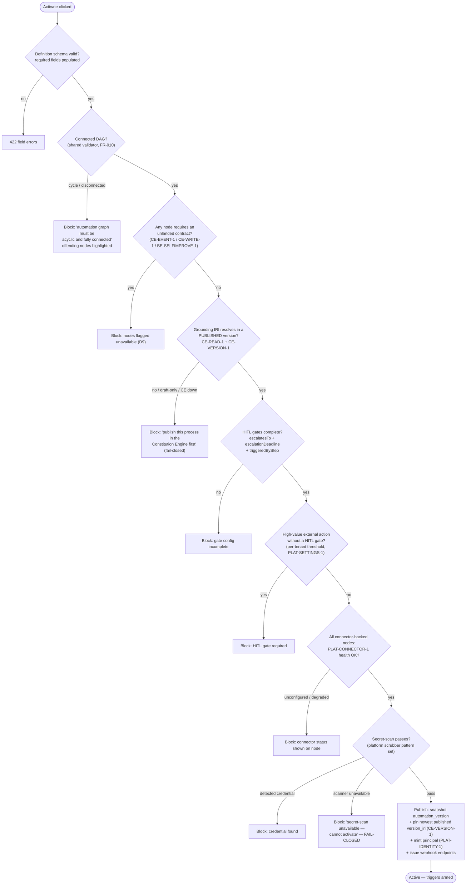
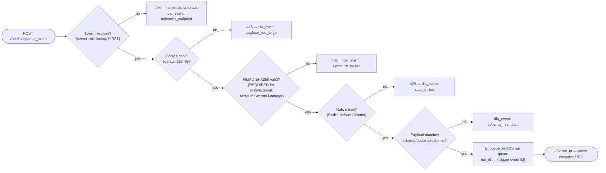
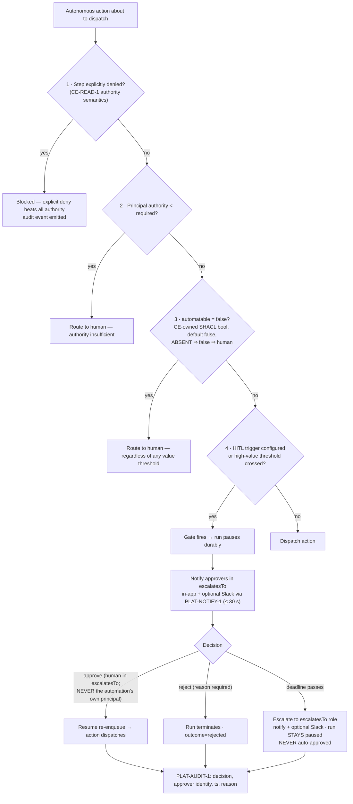

# Events & Actions Engine — Business Process (Phase 1)

**Graph edges:**

- Engine spec: [events-actions-engine.md](../../events-actions-engine.md)
- Data model (sibling): [data-model.md](./data-model.md) · Architecture: [architecture.md](./architecture.md)
- Contracts (canonical): [contracts.md](../../../contracts.md)
- ADRs: [ADR-001](../decisions/ADR-001.md) run engine · [ADR-002](../decisions/ADR-002.md) agent
  runtime · [ADR-005](../decisions/ADR-005.md) webhook ingestion

---

## Overview

Flows covered (implementation detail lives in task briefs):

1. NL authoring + grounding — describe → resolve via `CE-READ-1` → grounded draft (never a
   fabricated IRI).
2. Activation validation — the fail-closed gate battery before an automation goes live.
3. Webhook ingestion — the unauthenticated trust boundary (ADR-005).
4. Run lifecycle — at-least-once, per-step idempotency, durable pauses (ADR-001).
5. Governance gate + HITL — the deterministic 4-step sequence and approve/reject/escalate.
6. Degrade contingencies — CE unreachable, connector degraded, platform-service outage,
   `CE-EVENT-1` absent.

Error envelope, pagination, and status-code conventions follow the platform api-conventions; this
document does not restate schemas.

---

## NL Authoring + Grounding Flow

Covers E2-S1/E2-S2 and E6-S1. Builder drafting runs on the high tier model; every entity reference is
resolved through `CE-READ-1` — the model proposes, the contract resolves.

```mermaid
sequenceDiagram
    participant U as Author (SPA)
    participant API as EA API
    participant AI as Builder AI (high tier)
    participant CE as Constitution Engine

    U->>API: POST chat message ("when a delivery arrives … following the goods-inward process")
    API->>AI: draft request + ontology grounding instructions
    AI->>CE: CE-READ-1 GET /api/sparql (SELECT-only, paginated) — resolve referenced Process/Activity/Policy
    alt exactly one published match
        CE-->>AI: entity IRI + label (published version)
        AI-->>API: draft definition + grounding {entity_iri, kind}
        API->>CE: CE-VERSION-1 GET /api/ontology/versions — newest published (pin candidate)
        API->>API: validate against definition schema; CAS write (definition_rev)
        API-->>U: draft + diff summary; canvas re-projects ≤ 500 ms
    else ambiguous (multiple matches)
        AI-->>U: ONE inline clarifying question (max 3 rounds, tunable)
        Note over U,AI: after 3 unresolved rounds → fall back to "Link to ontology" searcher (E6-S1)
    else CE unreachable / draft-only entity
        AI-->>U: "couldn't reach / resolve the ontology — publish the process in CE first"
        Note over API: draft saved UNGROUNDED — no IRI fabricated; non-activatable
    end
```

**Invariants (each testable):**

- The AI never fabricates an IRI: a grounding link exists only if `CE-READ-1` resolved it in a
  PUBLISHED version (E2-S1 failure mode, epic-level AC).
- Every AI edit commits transactionally against `definition_rev`; a failed schema validation
  leaves the definition byte-identical, and "Undo last AI change" restores the prior committed
  state (E2-S2).
- A concurrent canvas edit and AI edit resolve by optimistic LWW: the CAS loser receives 409 + the
  winning diff — no silent merge (E3-S2, ADR-003 §2).

---

## Activation Validation Flow

Covers E2-S3, E6-S1/S2, FR-008, FR-010. Every check is fail-closed; order is cheapest-first.



**Post-activation pin watch:** an activation-time check plus a periodic sweep (Phase 2: on
`CE-EVENT-1`; Phase 1: `CE-VERSION-1` poll) detects a withdrawn pinned version or a grounded IRI
absent from the pinned snapshot ⇒ auto-pause affected automations + "pinned version withdrawn —
review required" via `PLAT-NOTIFY-1` (E6-S2).

---

## Webhook Ingestion Flow

Covers E4-S1 / FR-012 (ADR-005). The ONLY unauthenticated ingress.



Tenant context derives ONLY from the token row; nothing tenant-scoped is touched before the token
resolves (epic-level AC, E4). Cron events (EventBridge Scheduler) and connector events
(`PLAT-CONNECTOR-1` delivery interface) enter the same queue with the same envelope — one
downstream spine.

---

## Run Lifecycle

Covers E8-S1/S2/S3 and E7-S1 (interpreter). The state machine is the PRD's, made durable per
ADR-001: state lives in `run`/`run_step`/`paused_run` rows; SQS holds only active work.

```mermaid
stateDiagram-v2
    [*] --> Queued : trigger enqueued (SQS standard)
    Queued --> Running : dequeued · run_id dedupe (ON CONFLICT discard)
    Running --> StepDone : step OK + idempotency marker (same txn)
    StepDone --> Running : next step (skip any marked step)
    Running --> Paused : HITL gate fires · ACK off SQS · durable paused_run
    Running --> AwaitingAgent : agent dispatched (ADR-002) · ACK off SQS
    AwaitingAgent --> Running : completion callback → resume re-enqueue
    AwaitingAgent --> Failed : agent timeout / runtime unreachable (terminal)
    Paused --> Running : approved → resume re-enqueue
    Paused --> Failed : rejected (reason required) or deadline final
    Running --> Retrying : step fails, retries remain (default 3, exp 2/4/8s)
    Retrying --> Running : backoff elapsed
    Retrying --> DLQd : retries exhausted → dlq_event row + PLAT-NOTIFY-1 + CloudWatch depth
    DLQd --> Queued : "Retry from DLQ" (manual; never auto)
    StepDone --> Complete : all steps done
    Running --> Failed : terminal (4xx / CE-WRITE-1 422 [Phase 2] / agent timeout)
    Complete --> [*] : meter (per-run, separate queue) + audit emitted
    Failed --> [*] : meter + audit emitted (outcome=failed)
```



**Invariants (each testable):**

- Duplicate delivery: same `run_id` ⇒ discarded whole-run; mid-run redelivery ⇒ marked steps
  skipped, replay from first unmarked step (FR-029). Best-effort windows documented per action
  type (data-model.md D2 note).
- Paused/awaiting runs are NEVER in-flight SQS messages (FR-029b); the visibility timeout covers
  only synchronous step work (ADR-001 §4 formula, default 300 s).
- Terminal-vs-retriable is typed: 4xx terminal (unless configured retriable), 5xx/timeout retried;
  Phase 2 `CE-WRITE-1` 422 SHACL is terminal and shows violations, 5xx retried.
- Metering rides a separate queue from run outcome; audit and metering events are durably buffered
  on outage and never dropped; buffering failure marks the run `degraded` (E8-S3, E9-S1).
- Every run emits the OTel span tree (root run span; trigger/condition/action spans with
  `automation_id, run_id, tenant_id, step_type, external_call_latency_ms, outcome`).

---

## Governance Gate + HITL Flow

Covers E5-S5 / FR-022 / FR-023. The gate is deterministic interpreter code (architecture.md D6),
evaluated against the **grounded process step** before EVERY autonomous action (Agent Run,
high-value API call; Phase 2 adds Graph Update and saved actions).



**Invariants:** unstated permission ⇒ deny/route-to-human (an empty authority result never means
permitted — `CE-READ-1` agent-grounding semantics); no-self-approval enforced where the decision is
recorded; the high-value threshold is per-tenant, currency-configurable (~£10k-equivalent),
enforced at the engine level via `PLAT-SETTINGS-1` (not just UI, E11-S1).

---

## Degrade Contingencies

Every upstream dependency has a pre-designed, fail-visible degrade. Widening tenant scope or
failing open is never a degrade option.

| Dependency lost | Surface behaviour | Never |
|---|---|---|
| `CE-READ-1` unreachable | Registry renders from local store with cached labels + "CE unavailable" badge (E1-S1); NL grounding refuses (no fabricated IRI); activation blocks | Fabricate IRIs; activate ungrounded |
| `CE-VERSION-1` / pinned version withdrawn | Affected automations auto-pause + `PLAT-NOTIFY-1` "review required" (E6-S2) | Run against a withdrawn pin |
| `PLAT-CONNECTOR-1` connector degraded | Activation of dependent automations blocked; active Slack triggers buffer if delivery still flows, else auto-flag via `PLAT-NOTIFY-1` (E4-S3) | Silent event loss; engine-held credentials |
| Secret-scan service down | Activation blocked ("secret-scan unavailable — cannot activate") | Fail open (FR-008) |
| `PLAT-AUDIT-1` down | Audit events durably buffered + retried; buffering failure ⇒ run marked degraded + flagged (E9-S1) | Proceed un-audited silently; local signed store |
| `PLAT-BILLING-1` / metering queue down | Metering events durably buffered + retried (E8-S3) | Drop a billing event |
| `CE-EVENT-1` transport absent (Phase 2) | Graph-change triggers degrade to `CE-READ-1` since-version polling within the per-workspace cap (default 10) | Claim a push-only path |
| `BE-SELFIMPROVE-1` not live | "create self-healing issue" on-failure option rendered unavailable; notify/log/stop functional (E8-S2) | Block the Error Handler on an optional contract |

---

## Deferred (Phase 2)

| Flow | Phase-1 anchor | Phase-2 addition |
|---|---|---|
| Graph-change trigger | Enum value fails activation; templates flagged | Consume `CE-EVENT-1` `{change_type, entity_iri, version_iri, actor, ts}`; polling degrade; per-workspace cap |
| Graph-update action | Enum value fails activation | `CE-WRITE-1` op batch; 201 commit / 422 terminal with violations / 5xx retried; `prov:SoftwareAgent` attribution |
| Saved object-bound action (E5-S6) | Governance gate + `CE-WRITE-1` semantics defined | Ad-hoc action button on a single instance; invoking human is the actor (`prov:Person`); metered per-run |
| Sub-automation composition | DAG validator + registry exist | Cross-automation cycle detection; sync/async calls with I/O mapping |
| Portable artefact export | `agent_artefact` registry (ADR-002) is the resolution contract | Codegen → semver'd `pip`-installable skill/command/agent (OQ-04) |
| `CE-FUNCTION-1` action refs | — | `fn_iri` nodes; CE owns registry + versioning |
