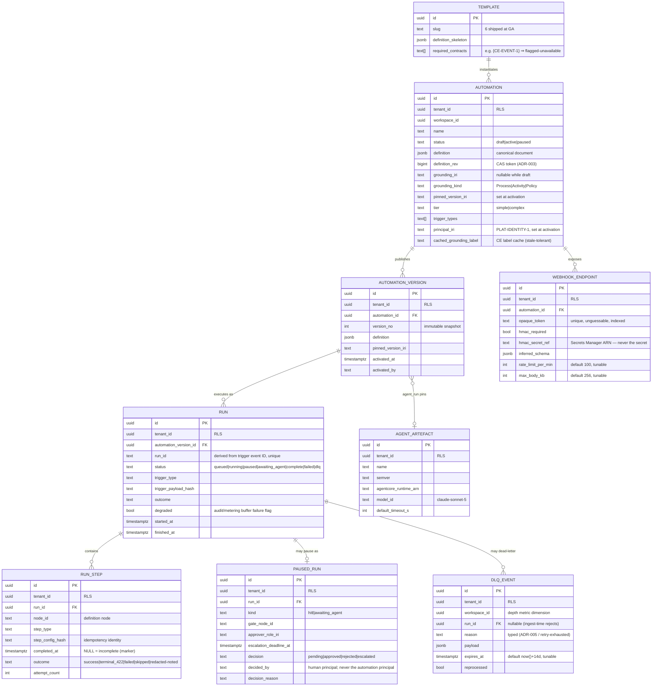

# Events & Actions Engine — Data Model (Phase 1)

**Graph edges:**

- Engine spec: [events-actions-engine.md](../../events-actions-engine.md)
- Contracts (canonical): [contracts.md](../../../contracts.md)
- ADR-001 (run engine): [ADR-001.md](../decisions/ADR-001.md) ·
  ADR-002 (agent runtime): [ADR-002.md](../decisions/ADR-002.md) ·
  ADR-003 (storage + isolation): [ADR-003.md](../decisions/ADR-003.md)
- Sibling: [architecture.md](./architecture.md) · [business-process.md](./business-process.md)

---

## Overview

Unlike the Constitution Engine, this engine's primary datastore is **relational** (Aurora
PostgreSQL, ADR-003). It owns no RDF store: its semantic footprint is a set of **IRI references**
(grounding entity, pinned ontology version, principal IRIs) resolved through CE contracts, plus
the PROV-O actor-class convention it must respect when (Phase 2) it writes via `CE-WRITE-1`. Its
audit data lives in `PLAT-AUDIT-1`; the tables here that look audit-like are buffers and views,
never a second system of record.

This document specifies:

1. The canonical automation definition (the JSONB document both chat and canvas project).
2. The relational schema: registry, versions, runs, steps, paused runs, DLQ, buffers, artefacts,
   webhook endpoints, templates.
3. Tenant isolation (RLS) and index strategy.
4. RDF/semantic touchpoints (grounding, PROV-O actor classes, `automatable`).
5. Deferred (Phase 2) entities.

---

## Canonical Automation Definition (JSONB)

The single source of truth for one automation's behaviour. Chat and canvas are projections of this
document (FR-011); the interpreter executes an immutable snapshot of it (D8). Validated by a
Pydantic v2 schema shared by the EA API, the interpreter, and (via generated types) the SPA.

```json
{
  "definition_schema": 1,
  "name": "Notify on delivery arrival",
  "tier": "simple",
  "grounding": {
    "entity_iri": "https://weave.io/ontology/hammerbarn/goods-inward-receipt-process",
    "kind": "Process",
    "pinned_version_iri": "urn:weave:g:tenant:{id}:v1.4.0"
  },
  "nodes": [
    { "id": "t1", "type": "trigger", "trigger_type": "webhook",
      "config": { "schema_mode": "inferred", "hmac_required": true } },
    { "id": "c1", "type": "condition",
      "config": { "left": "{{event.store_region}}", "op": "eq", "right": "AU" } },
    { "id": "g1", "type": "hitl_gate",
      "config": { "escalates_to_role_iri": "…/Role/goods-inward-manager",
                   "escalation_deadline": "P1D", "triggered_by_step": "…/Activity/receive-goods" } },
    { "id": "a1", "type": "action", "action_type": "slack_notification",
      "config": { "target": "#goods-inward", "body": "Delivery arrived: {{event.delivery_id}}" } },
    { "id": "e1", "type": "error_handler",
      "config": { "max_retries": 3, "backoff": "exponential", "on_failure": "notify" } },
    { "id": "end", "type": "end", "config": {} }
  ],
  "edges": [
    { "from": "t1", "to": "c1" }, { "from": "c1", "to": "g1", "when": "true" },
    { "from": "g1", "to": "a1", "when": "approved" }, { "from": "a1", "to": "end" }
  ]
}
```

**Schema rules (each is a validation test):**

- `nodes[].type` ∈ `trigger | condition | action | hitl_gate | error_handler | end` (E3-S1);
  `trigger_type` ∈ `webhook | jira | servicenow | slack | cron` at Phase 1 (`graph_change` is a
  Phase-2 enum value that fails activation until `CE-EVENT-1` lands — flagged-unavailable, D9).
- `action_type` ∈ `slack_notification | api_call | agent_run` at Phase 1 (`graph_update`,
  `sub_automation`, `fn_ref` are Phase-2 values, same flagged-unavailable treatment).
- The `nodes`/`edges` graph MUST be a connected DAG; cycles or disconnected nodes fail activation
  (FR-010). The DAG validator is one shared function imported by the API and the SPA build.
- A `hitl_gate` node MUST carry `escalates_to_role_iri`, `escalation_deadline`
  (ISO-8601 `xsd:duration`), and `triggered_by_step` — missing any fails validation (E5-S5,
  mirrors the grounded `HITLTriggerShape` minCount 1).
- Interpolation (`{{event.*}}`, `{{entity.*}}`) resolves at run time against the triggering event
  and grounded entity (via `CE-READ-1`); any value resolving to a secret is scrubbed at egress
  (FR-008b). Secrets never appear in the definition — only Secrets Manager references.
- `tier` is auto-classified (`agent_run` present ⇒ `complex`, else `simple`), author-overridable;
  ambiguity defaults to `simple` and surfaces the choice (E7-S1).

---

## Relational Schema

### ER diagram



Buffer tables (not drawn): `audit_buffer` and `metering_buffer` — durable outbox rows
(`{id, tenant_id, event_type, payload, attempts, next_retry_at}`) written transactionally with the
outcome they describe and drained by a retry sweep; a row is deleted only on confirmed emit
(E9-S1 / E8-S3 never-dropped invariants).

### Table notes

- **`automation.definition_rev`** is the optimistic-concurrency token: every edit (AI or canvas)
  is `UPDATE … WHERE definition_rev = :expected`; zero rows ⇒ 409 + winning diff (FR-011).
- **`automation_version`** rows are immutable — activation snapshots the definition + ontology pin;
  runs foreign-key the snapshot, never the mutable draft (D8). "Upgrade pin" produces a new
  version row after a confirmed `CE-DIFF-1` diff.
- **`run.run_id`** is unique per tenant: the dedupe insert is `ON CONFLICT DO NOTHING`; a duplicate
  SQS delivery that loses the insert race discards itself (FR-029).
- **`run_step.completed_at`** IS the per-step idempotency marker; it commits in the same
  transaction as the step outcome (ADR-001 §3). `step_config_hash` guards against a marker
  matching a since-edited step (can only occur across resume boundaries; hash mismatch ⇒ step
  re-validated against the pinned snapshot).
- **`paused_run.decided_by`** is checked against the automation's `principal_iri` — equality is
  rejected (no-self-approval invariant, enforced at the decision endpoint AND as a DB CHECK-style
  application guard).
- **`webhook_endpoint.opaque_token`** is a ≥ 128-bit random URL-safe token; lookup is the FIRST
  ingest operation (ADR-005); unknown token ⇒ 404 without existence disclosure.
- **`template.required_contracts`** drives flagged-unavailable rendering (D9): "New employee
  onboarding" and "Stock reorder trigger" carry `{CE-EVENT-1}`; "Update graph on Jira close"
  carries `{CE-WRITE-1}` (activatable only when the Phase-2 action lands — the PRD ships it in
  the GA library with its graph-update node flagged).

### Row-level security

Every tenant-scoped table enforces `tenant_id = current_setting('weave.tenant_id')` at the
database level in addition to application scoping (same pattern as CE's Aurora layer). A missing
setting evaluates the predicate to NULL ⇒ zero rows (fail-closed). `template` is the only
non-tenant table (global read-only library). RLS session context is set per-connection by both
deployables (EA API, interpreter) immediately after checkout from the pool.

### Index strategy

| Index | Table | Serves |
|---|---|---|
| `(tenant_id, workspace_id, status)` | automation | Registry list + filters (E1-S1) |
| `(tenant_id, grounding_iri)` | automation | Search by linked entity; compliance filter |
| `(opaque_token)` unique | webhook_endpoint | Ingest hot path (ADR-005, p95 ≤ 150 ms) |
| `(tenant_id, run_id)` unique | run | Dedupe insert (FR-029) |
| `(tenant_id, automation_version_id, started_at DESC)` | run | Run history ≤ 1 s p95 |
| `(run_id, node_id)` unique | run_step | Marker lookup before each step |
| `(tenant_id, decision, escalation_deadline_at)` | paused_run | Escalation sweep (E5-S5 deadline) |
| `(workspace_id) WHERE NOT reprocessed AND expires_at > now()` | dlq_event | Per-workspace depth metric |
| `(next_retry_at)` | audit_buffer / metering_buffer | Drain sweeps |

---

## RDF / Semantic Touchpoints

The engine's semantic-web surface is consumed, not owned. Binding conventions:

| Concept | Representation | Source of truth |
|---|---|---|
| Grounding entity | IRI of a BPMO `Process` / `Activity` / `Policy` | `CE-READ-1` (resolution + labels); kinds come from `GET /api/ontology/types` — never a hard-coded list |
| Ontology version pin | `version_iri` from `GET /api/ontology/versions` | `CE-VERSION-1` (incl. canonical staleness lag, default ≥ 2) |
| Pin-upgrade diff | node + edge diff between pinned and target | `CE-DIFF-1` |
| `automatable` safety hinge | SHACL-shaped boolean on `Activity`/`Process`, default `false`, absent ⇒ route-to-human | CE-owned shape (contracts.md `CE-READ-1` note) — Events reads, never redefines |
| Automation principal | `prov:SoftwareAgent` IRI, distinct from human (`prov:Person`) and interactive-LLM actor classes | `PLAT-IDENTITY-1` mints; PROV-O attribution applied by CE on Phase-2 `CE-WRITE-1` writes; the same IRI rides every `PLAT-AUDIT-1` event |
| Authority / explicit deny for the gate | `authority()`/`coverage_gap()` semantics: unstated ⇒ deny/route-to-human; explicit deny overrides | `CE-READ-1` agent-grounding contract — the gate never infers permission from absence |
| Audit events | `{seq, ts, actor_principal_iri, engine:"events", event_type, target_iri, diff_summary, signature}` + typed Events payload (`grounded_entity_iri`, `ontology_version_pinned`, `trigger_payload_hash`, per-step fields, `hitl_decision`) | `PLAT-AUDIT-1` (the engine never signs) |

No Turtle is authored by this engine in Phase 1. The Phase-2 graph-update action submits
`CE-WRITE-1` operation batches (`add_node | update_node | add_edge | delete_node | delete_edge`)
with `actor` = the automation principal IRI; SHACL validation, PROV-O stamping, and 201/422
semantics are CE-owned per the contract — this engine treats 422 as terminal and 5xx as retriable.

---

## Deferred (Phase 2)

Structural binding points exist above; nothing else is implemented until Phase 2.

| Entity / capability | Phase-1 placeholder | Phase-2 specification |
|---|---|---|
| Graph-change trigger cursor | `trigger_type` enum value exists, fails activation | `ce_event_cursor {tenant_id, last_version_iri, last_poll_at}` for `CE-EVENT-1` (or since-version polling degrade); per-workspace cap (default 10) |
| Graph-update action | `action_type` enum value exists, fails activation | `CE-WRITE-1` op-batch mapping; 422 terminal / 5xx retried; `prov:SoftwareAgent` attribution |
| Saved object-bound action (E5-S6) | — | Typed-input action bound to a CE object kind; user-invoked (`prov:Person` actor); may publish to `CE-FUNCTION-1` (CE owns the registry) |
| Sub-automation composition | `action_type` enum value exists, fails activation | Registry select + I/O mapping; cross-automation cycle detection at activation |
| Portable artefact export | `agent_artefact` registry is the resolution contract (ADR-002) | Codegen from canonical definition → semver'd `pip`-installable skill/command/agent (OQ-04) |
| `CE-FUNCTION-1` action references | — | `fn_iri` action nodes; CE owns definition + versioning |
