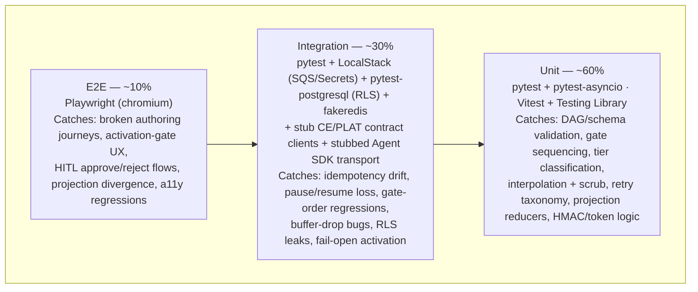

# Testing Strategy: Events & Actions Engine

## 1. Testing Pyramid Overview



| Layer | Tools | Coverage target | Mutation gate | Run in CI |
|-------|-------|-----------------|---------------|-----------|
| Unit | pytest + pytest-asyncio · Vitest + @testing-library/react | ≥ 80% (shared line target) | ≥ 70% (mutmut / Stryker) | Every push |
| Integration | pytest + LocalStack + pytest-postgresql + fakeredis + contract stubs | contributes to shared ≥ 80% | N/A (fake-infra non-determinism) | Every push |
| E2E | Playwright (chromium) | Authoring + run-operations critical paths + release-gate journeys | N/A | PR merge gate |

The Events **cross-cutting release gates** (cross-tenant zero rows; webhook trust-boundary
rejections; fail-closed activation battery; per-step idempotency on redelivery; durable
pause/resume; deterministic governance gate incl. no-self-approval; audit/metering never dropped —
architecture.md §Invariants) each exist at BOTH the integration layer (fast, per-push) and the E2E
layer (assembled-app proof, merge gate). Python covers the run engine and API; Vitest covers the
Events-owned SPA components (registry, Builder chat, canvas, runs, report).

## 2. Unit Test Strategy

### Python (EA API + Run Interpreter)

```text
packages/ea-api/tests/unit/
├── test_definition_schema.py      # node/edge enums, HITL-config completeness, Phase-2 enums fail activation
├── test_dag_validation.py         # cycle / disconnected detection (the ONE shared validator)
├── test_governance_gate.py        # 4-step order; deny beats authority; automatable absent ⇒ human; no-self-approval
├── test_idempotency.py            # marker skip; replay-from-incomplete; step_config_hash mismatch
├── test_retry_taxonomy.py         # 4xx terminal vs 5xx retried; backoff schedule; DLQ row emission
├── test_webhook_security.py       # token resolve order, HMAC constant-time, size cap, rate limit, typed reasons
├── test_interpolation_scrub.py    # {{event.*}} resolution; secret-resolving values redacted + logged
├── test_tier_classification.py    # agent_run ⇒ complex; ambiguity ⇒ simple + surfaced choice
├── test_activation_pipeline.py    # gate battery order; every gate fail-closed; phase-gated node blocking
├── test_grounding_pinning.py      # published-only grounding; pin-at-activation; staleness lag consumed not recomputed
└── conftest.py                    # factories (make_definition, make_run, make_event), fixed clock
```

- Framework: `pytest` + `pytest-asyncio`; coverage `pytest-cov --cov-fail-under=80`;
  mutation `mutmut run` — CI fails below 70%.
- Naming: `test_<function>_<scenario>_<expected_outcome>`.
- Mocks: `pytest-mock` at I/O boundaries only (CE/PLAT contract clients, SQS client, Secrets
  Manager, AgentCore client) — never mock the governance gate, the DAG validator, the idempotency
  check, or the scrub; those are the point of the tests.

```python
@pytest.mark.asyncio
async def test_gate_routes_to_human_when_automatable_absent(gate, grounded_step_no_flag):
    decision = await gate.evaluate(action=AGENT_RUN, step=grounded_step_no_flag,
                                   principal="urn:weave:principal:auto-1")
    assert decision.outcome == "route_to_human"   # absent ⇒ false ⇒ human, before any value check
```

### TypeScript (Events surfaces in the shared SPA)

```text
packages/frontend/src/automate/
└── <feature>/
    └── __tests__/
        ├── RegistryList.test.tsx      # health chips incl. "connector health unknown"; CE-down cached-label badge
        ├── BuilderChat.test.tsx       # clarifying-question rounds; ungrounded-draft state; undo-last-AI-change
        ├── FlowCanvas.test.tsx        # 6 node types render; cycle highlight; keyboard nav (Tab/Enter/Escape)
        ├── ProjectionSync.test.tsx    # 409 loser shown diff; re-projection ≤ 500 ms indicator states
        ├── ActivationDialog.test.tsx  # fail-closed states (scan down, grounding missing, connector degraded)
        └── ComplianceReport.test.tsx  # actor-class filter; Red-run flagging; export includes seq + signatures
```

- Framework: `Vitest` (`jsdom`) + `@testing-library/react`; coverage v8 `lines=80`; Stryker ≥ 70%.
- Naming: `should <expected behaviour> when <condition>`; `msw` for HTTP; never mock pure reducers.

```typescript
it('should show "connector health unknown" when the PLAT-CONNECTOR-1 health API errors (E1-S2)', async () => {
  server.use(http.get('/api/connectors/health', () => HttpResponse.error()));
  render(<RegistryList automations={[SLACK_AUTOMATION]} />);
  expect(await screen.findByText(/connector health unknown/i)).toBeInTheDocument(); // fail-visible, never green
});
```

### AC-to-test mapping (cross-cutting release gates)

| AC ID | EARS scenario | Test file | Test name |
|-------|---------------|-----------|-----------|
| §2.2 iso | WHEN a tenant-A principal issues an unscoped/tenant-B query THEN zero tenant-B records return and the attempt is logged | `test_cross_tenant_isolation.py` | `test_unscoped_query_returns_zero_foreign_rows_and_logs` |
| FR-012 | WHEN a webhook has bad HMAC / unknown token / oversize / schema mismatch THEN it routes to DLQ with a typed reason | `test_webhook_security.py` | `test_each_rejection_class_routes_typed_dlq` |
| FR-008 | WHEN the secret-scan service is down at activation THEN activation is blocked (fail-closed) | `test_activation_pipeline.py` | `test_scanner_outage_blocks_activation` |
| FR-029 | WHEN a mid-run redelivery occurs THEN completed steps are skipped via markers and replay starts at the last incomplete step | `test_idempotency.py` | `test_redelivery_skips_marked_steps_replays_incomplete` |
| FR-029b | WHEN a HITL gate fires THEN the run is acked off SQS and persisted as a durable paused-run record | `test_pause_resume.py` (integration) | `test_paused_run_acked_and_durable` |
| FR-022/023 | WHEN an action targets a non-automatable step THEN it routes to a human regardless of value; the automation's principal cannot approve its own gate | `test_governance_gate.py` | `test_gate_order_and_no_self_approval` |
| FR-031 | WHEN the metering queue is unavailable THEN the per-run event is durably buffered, never dropped | `test_buffers.py` (integration) | `test_metering_buffered_on_outage_never_dropped` |
| E6 epic | WHEN grounding resolves only in a draft version THEN link and activation are both rejected | `test_grounding_pinning.py` | `test_draft_only_entity_rejected_at_link_and_activate` |

Remaining task-level ACs are mapped in each task brief's Test Requirements table (the briefs are
the per-task source of truth; this table carries the cross-cutting gates).

## 3. Integration Test Strategy

Integration tests verify contracts between components against faked infrastructure — never real
cloud accounts, never real model calls, never real connectors (Law F).

### Infrastructure fakes

| Service | Dev/test fake | How |
|---------|---------------|-----|
| SQS run/metering queues + poison DLQ | LocalStack via Docker Compose | `docker compose -f tests/integration/docker-compose.test.yml up localstack` |
| Aurora PostgreSQL (all engine tables) | `pytest-postgresql` with RLS policies applied in migration fixtures | auto-provisioned per session |
| ElastiCache Redis (rate limits) | `fakeredis` | `fakeredis.FakeAsyncRedis()` fixture |
| Secrets Manager (HMAC secrets, connector refs) | LocalStack Secrets Manager | same compose stack |
| CE contracts (`CE-READ-1`/`CE-VERSION-1`/`CE-DIFF-1`) | **stub contract client** returning contract-shaped fixtures (typed to contracts.md shapes); failure modes switchable (timeout / 5xx / draft-only) | `ce_stub` fixture |
| PLAT contracts (`AUDIT/NOTIFY/IDENTITY/BILLING/SETTINGS/CONNECTOR`) | stub clients with recording sinks + switchable outage modes | `plat_stubs` fixture |
| Bedrock / AgentCore (agent-run) | stubbed Agent SDK transport — fixture completions/timeouts, no real model calls; agent-quality evals live in the `testing-agents.md` lane | `agent_transport` fixture |
| EventBridge Scheduler (cron) | direct enqueue of the scheduler envelope | `enqueue_cron` helper |

The stub CE/PLAT clients are generated against the contract shapes in
[contracts.md](../../../contracts.md) so a contract drift breaks compilation of the stubs, not
just runtime tests. When CE lands contract-test doubles of its own, this engine swaps to them —
the fixture boundary is the contract ID, so no test rewrites.

### Directory layout

```text
packages/ea-api/tests/integration/
├── conftest.py                      # localstack, postgres+RLS, fakeredis, ce_stub, plat_stubs, agent stub
├── docker-compose.test.yml
├── test_run_spine.py                # enqueue→dedupe→interpret→complete; OTel spans; run/step rows
├── test_idempotency_redelivery.py   # crash-mid-step simulation; marker skip; best-effort windows per action
├── test_pause_resume.py             # HITL + awaiting_agent: ack-off-queue, durable row, resume re-enqueue, deadline escalation sweep
├── test_retry_dlq.py                # exhausted retries → dlq_event; depth metric; manual retry-from-DLQ; 14-day expiry
├── test_webhook_ingest.py           # full trust boundary vs LocalStack + Redis; 202 ack; typed DLQ rows
├── test_governance_gate_paths.py    # all 4 gate outcomes against grounded-step fixtures; no-self-approval on decision endpoint
├── test_activation_gates.py         # gate battery incl. scanner-outage fail-closed + connector-degraded block + phase-gated nodes
├── test_grounding_version_pin.py    # publish-only grounding via ce_stub; pin snapshot; withdrawn-pin auto-pause sweep
├── test_buffers.py                  # audit + metering outage buffering; drain sweep; degraded-run flag on double failure
├── test_cross_tenant_isolation.py   # two seeded tenants; registry/run/DLQ/report queries; RLS fail-closed (no session ⇒ zero rows)
└── test_agent_run_dispatch.py       # async dispatch, completion callback resume, timeout terminal, per-token metering forward
```

### Must cover

- The full run spine: enqueue → dedupe → step execution → markers → complete, including
  crash-mid-step redelivery (kill the consumer between side-effect stub and marker) and replay.
- Pause/resume durability: paused run survives a simulated visibility-timeout expiry (message
  already acked); resume works after arbitrary delay; deadline sweep escalates and never
  auto-approves.
- The whole activation gate battery, each gate independently forced to fail, plus the fail-closed
  scanner-outage branch and phase-gated node blocking (D9).
- Webhook trust boundary end-to-end with every typed rejection class and the rate limiter under
  burst.
- Governance gate against grounded-step fixtures: explicit deny, insufficient authority,
  `automatable` false/absent, HITL fire; decision endpoint rejects the automation's own principal.
- Buffer outboxes: audit + metering events survive stub outages, drain on recovery, and the
  degraded-run flag sets when buffering is also failed.
- Cross-tenant isolation across every queryable surface (registry, runs, DLQ, paused, report),
  including the RLS-fail-closed case (no session context ⇒ zero rows).

### Must NOT

- Call real AWS endpoints, real Bedrock models, or any real connector/Slack/Jira/ServiceNow API.
- Share state between tests (per-test Postgres schema + fresh queues).
- Test UI rendering (unit or E2E territory).

## 4. E2E Test Strategy

Framework: Playwright (TypeScript), against the locally started assembled app (`TEST_BASE_URL`,
default `http://localhost:3000`), LocalStack-backed run engine, stub CE/PLAT services seeded via
test-only endpoints (disabled outside test env).

```text
tests/e2e/automate/
├── fixtures/
│   ├── auth.fixture.ts             # roles: author, ops owner, compliance (read-audit), approver, workspace admin
│   └── seed.fixture.ts             # two tenants; grounded-process fixtures; template library
├── nl-authoring.spec.ts            # NL describe → grounded draft (stub CE) → clarify round → ungrounded on CE-down (no fabricated IRI)
├── canvas-projection.spec.ts       # canvas edit → chat diff; concurrent edit → 409 loser diff; cycle blocks activate
├── activation.spec.ts              # draft/test/activate; dry-run makes no external call + no metering; fail-closed scanner branch
├── run-operations.spec.ts          # trigger test event → run history row; retry-from-DLQ button; degraded badges
├── hitl-approval.spec.ts           # gate fires → approver notified → approve resumes / reject terminates with reason; self-approval refused
├── compliance-report.spec.ts       # filter by process + range; actor-class filter; Red-run flag; export with seq + signatures
└── isolation.spec.ts               # tenant-A UI never renders tenant-B automations/runs/reports (release gate)
```

| AC ID | EARS scenario | Spec file | Status |
|-------|---------------|-----------|--------|
| E2-S1 | WHEN CE is unreachable during NL grounding THEN the draft stays ungrounded with a specific message (no fabricated IRI) | `nl-authoring.spec.ts` | Planned |
| E3-S2 | WHEN a canvas edit and an AI edit collide THEN LWW resolves and the loser sees the diff | `canvas-projection.spec.ts` | Planned |
| E2-S3 | WHEN Test runs THEN no external call, no CE-WRITE-1, no metering event is produced | `activation.spec.ts` | Planned |
| E5-S5 | WHEN a HITL gate fires THEN the approver decides and the run resumes/terminates; the automation's principal cannot approve | `hitl-approval.spec.ts` | Planned |
| E9-S2 | WHEN a compliance report is exported THEN it carries PLAT-AUDIT-1 seq numbers + signatures | `compliance-report.spec.ts` | Planned |
| §2.2 iso | WHEN a tenant-A user browses any Automate screen THEN zero tenant-B artefacts render | `isolation.spec.ts` | Planned |

Minimum scenarios (always required): happy path (NL describe → ground → activate → test event →
run visible in history → audit view row), auth guard (unauthenticated → login redirect), error
state (CE down → registry still renders with cached-label badges). Every E2E happy path asserts
**backend state changed** (run rows / audit sink), not just UI (Plugin Law B). Accessibility:
axe-core assertions run inside the E2E suite on the WCAG-gated surfaces (registry, Builder chat,
templates) — zero violations is a release gate; canvas keyboard navigation is asserted
functionally (Tab/Enter/Escape).

CI gate: E2E runs on the PR merge gate; unit + integration run every push. `ui_verify.sh --full`
runs at epic close per the implement loop and consumes the same Playwright install.

## 5. Test Data Management

| Layer | Strategy | Rationale |
|-------|----------|-----------|
| Unit | Inline factories (`make_definition`, `make_run`, `make_event`, `make_gate_step`) | Fast, deterministic, no I/O |
| Integration | Per-test Postgres schema + golden two-tenant seed + contract-shaped CE/PLAT fixtures | Isolation is itself under test — seeds must be per-test |
| E2E | Playwright `seed.fixture.ts` calling test-only seed endpoints (disabled outside test env) | Reproducible starting state |

The **grounded-process fixture set** mirrors real CE shapes: a published `Process` with
`hasStep` Activities carrying every `automatable` state (true / false / absent) and an explicit
deny, so governance-gate tests exercise real contract shapes, not hand-invented ones. The
**golden two-tenant seed** gives tenants A and B overlapping automation names, run histories, and
DLQ entries so isolation tests have a foreign row to (fail to) find.

```python
def make_definition(trigger="webhook", actions=("slack_notification",), hitl=False, **overrides):
    nodes, edges = build_dag(trigger, actions, hitl)
    return Definition(definition_schema=1, tier="simple", nodes=nodes, edges=edges, **overrides)
```

Prohibited: shared mutable databases/queues; hardcoded IRIs/UUIDs/tokens; production data or real
webhook payloads (synthetic only — Law F); secrets or PII in fixtures (fake values via `faker`;
HMAC secrets minted per test); asserting on wall-clock time (inject `FIXED_CLOCK` — escalation
deadlines, cron accuracy, and retention expiry all depend on deterministic time).

## 6. Performance and Load Testing

The engine exposes a public unauthenticated ingest path and latency-budgeted internal flows —
this section applies. Targets are the re-derived budgets from ADR-001/ADR-005 (architecture.md
§Quality Attributes); all default-tunable via `PLAT-SETTINGS-1`.

| Endpoint / flow | Method | P50 target | P95 target | P99 target |
|-----------------|--------|-----------|-----------|-----------|
| `/hooks/{token}` ingest ack | POST | < 60 ms | < 150 ms (ADR-005) | < 400 ms |
| Trigger receipt → first action dispatched | flow | < 2 s | < 5 s (ADR-001 §6; excl. paused/agent) | measured |
| Registry list (100 automations) | GET | < 200 ms | < 500 ms | < 800 ms |
| Run-history query (30 days) | GET | < 400 ms | < 1 s (PRD §2.2) | < 2 s |
| HITL decision → resume enqueued | POST | < 200 ms | < 500 ms | < 1 s |
| Compliance report render (1k runs) | GET | < 1 s | < 3 s | < 5 s |

Load tool: `locust`, in the `performance` CI workflow — the hot paths are the **ingest Lambda**
(every webhook crosses it) and the **interpreter step loop** (every run crosses it). The load
profile drives a burst of 200 rps webhook ingress with 10% invalid signatures (the rejection path
must not be cheaper to attack than the accept path is to serve) and a seeded 100k-run history for
query targets. The trigger→dispatch budget is measured over LocalStack SQS with the documented
caveat that SQS-standard dwell in AWS is non-deterministic — the dev-AWS smoke suite re-measures
it before promote (dev-environment.md §4).

| Lighthouse metric (Automate surfaces) | Target |
|--------|--------|
| Performance score | ≥ 90 |
| Accessibility score | ≥ 95 |
| Best practices score | ≥ 90 |
| Initial JS bundle (gzipped) | ≤ 200KB (canvas chunk lazy-loaded) |

Lighthouse runs on every PR modifying an Automate page component or layout; the registry/chat/
templates WCAG 2.1 AA gate is asserted via axe-core in the E2E lane, with locust guarding the
ingest and query latency budgets.

---

*Generated by Weave arch-quality skill. Review and approve before task decomposition.*
