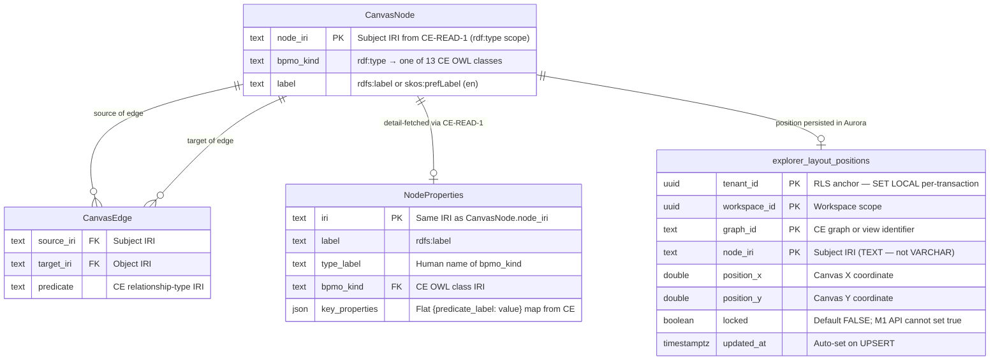

# Graph Explorer — Data Model (M1)

**Engine spec:** [graph-explorer.md](../../../graph-explorer.md)
**Inter-engine contracts:** [contracts.md](../../../../contracts.md)
**Tenant isolation:** [ADR-001 — named-graph + query-rewriting](../../../../decisions/ADR-001-tenant-isolation.md)
**Renderer strategy:** [ADR-001 (GE-local) — Cytoscape.js + fcose](../decisions/ADR-001-render-engine.md)

> **Ownership boundary.** Graph Explorer does NOT own the tenant RDF graph. All graph reads flow
> through the Constitution Engine (CE) via the named-graph query-rewriter (ADR-001). GE's ONLY
> owned persistent store is the Aurora `explorer_layout_positions` table.

---

## Renderer Adapter Invariant

Per [GE ADR-001](../decisions/ADR-001-render-engine.md), every task in the M1 Explorer must treat
the canvas renderer as an **adapter** behind a stable internal interface:

```
load(elements)  ·  onNodeClick(cb)  ·  getViewport()  ·  setLayout(name, opts)  ·  pin(node)
```

This boundary limits a renderer swap (Cytoscape → WebGL) to a **~25–35 % rework delta** on
TASK-002..005. It is a hard architectural invariant — calling renderer APIs directly is rejected
at review.

---

## Named-Graph Isolation

GE reads graph data exclusively through CE's rewriter. No SPARQL query leaves GE without a
tenant-scoped named graph injected by the rewriter; an unscoped query is **rejected (fail-closed)**.

The canonical named-graph scheme (from [ADR-001](../../../../decisions/ADR-001-tenant-isolation.md)):

| Graph IRI | Contents | Writable by GE? |
|---|---|---|
| `urn:weave:g:framework` | Shared BPMO upper framework — read-only SSOT | No |
| `urn:weave:g:tenant:{tenant_id}` | Tenant instance data | No (CE owns) |
| `urn:weave:g:tenant:{tenant_id}:prov` | Tenant provenance triples (PROV-O) | No (CE owns) |

GE's Aurora layout rows carry `tenant_id` + Row-Level Security (see [#layout-schema](#layout-schema))
as the local isolation complement.

---

## Entity Relationship Diagram

The diagram shows both the **CE read-model entities** (consumed by GE — not GE-owned) and the
**Aurora layout entity** (owned by GE). CE-side entities are shaped by the CE-READ-1 SPARQL
SELECT response; GE renders them — it does not store them.



> `CanvasNode`, `CanvasEdge`, and `NodeProperties` are **GE read-model projections** from
> CE-READ-1 — they have no Aurora backing in M1. `explorer_layout_positions` is the sole
> GE-owned Aurora entity.

---

## RDF/OWL Mapping

GE is a **consumer** of the BPMO ontology, not its owner. The mapping below traces each
read-model field to its CE-originated RDF term. Do not redefine these terms in GE code;
reference [contracts.md §CE-READ-1](../../../../contracts.md#ce-read-1--versioned-read-interface).

### CE Read-Model → RDF/OWL

| Read-model field | RDF/OWL mapping | Named graph |
|---|---|---|
| `node_iri` | RDF subject IRI | `urn:weave:g:tenant:{id}` |
| `bpmo_kind` | `rdf:type` → one of 13 `weave:` OWL classes | `urn:weave:g:framework` (class decl) |
| `label` | `rdfs:label` (en) or `skos:prefLabel` | `urn:weave:g:tenant:{id}` |
| `source_iri` | RDF subject of the relationship triple | `urn:weave:g:tenant:{id}` |
| `target_iri` | RDF object of the relationship triple | `urn:weave:g:tenant:{id}` |
| `predicate` | CE relationship type IRI (e.g. `weave:performedBy`) | `urn:weave:g:tenant:{id}` |
| `key_properties` | Set of `{predicate → literal}` triples | `urn:weave:g:tenant:{id}` |
| `position_x / y` | Explorer-specific — NOT in RDF | Aurora (GE-owned) |
| `locked` | Explorer-specific — NOT in RDF | Aurora (GE-owned) |

### Provenance

Provenance triples (who created/modified a node, when) live in
`urn:weave:g:tenant:{id}:prov` under the PROV-O vocabulary
([docs/standards/semantic-web.md](../../../../../../standards/semantic-web.md)).
GE reads provenance in the side panel where CE-READ-1 supplies it; GE does not write PROV-O.

---

## BPMO Node Kinds

GE renders nodes typed by the 13 BPMO kinds defined and owned by CE. The canonical list,
their OWL class IRIs, and their RDF relationships are specified in
[contracts.md §CE-READ-1](../../../../contracts.md#ce-read-1--versioned-read-interface).
GE must not maintain a parallel copy of this list.

Visual representation (colour, shape, icon) for each kind is defined in
[docs/standards/design/data-viz.md](../../../../../../standards/design/data-viz.md).
GE reads `GET /api/node-kinds` at canvas boot to get `[{id, label, colour}]` from CE; it falls
back to `#9CA3AF` grey for any `bpmo_kind` not in the palette response.

### BPMO kind quick-reference (informational — CE is authoritative)

The following 13 kinds are the M1 vocabulary. Each maps to one `weave:` OWL class in
`urn:weave:g:framework`. Add no GE-local subclasses or aliases.

| BPMO kind | OWL class (CE-owned) | Notes |
|---|---|---|
| Process | `weave:Process` | Top-level business process |
| Activity | `weave:Activity` | Step within a Process |
| Event | `weave:Event` | Trigger or milestone |
| DataAsset | `weave:DataAsset` | Dataset, table, or file |
| Field | `weave:Field` | Column / attribute of a DataAsset |
| System | `weave:System` | Software or IT system |
| Service | `weave:Service` | External or internal service |
| BusinessCapability | `weave:BusinessCapability` | What the org can do |
| BusinessDomain | `weave:BusinessDomain` | Organisational area |
| Policy | `weave:Policy` | Rule or regulation |
| Goal | `weave:Goal` | Objective or KPI |
| Actor | `weave:Actor` | Person, team, or system principal |
| Concept | `weave:Concept` | Domain concept / glossary term |

> Class declarations live in `urn:weave:g:framework`. Tenant instances live in
> `urn:weave:g:tenant:{id}`. GE renders both layers transparently.

---

## BPMO Relationship Types

The vocabulary of edge predicates GE renders is defined in CE and returned by CE-READ-1. The
canonical list is in [contracts.md §CE-READ-1](../../../../contracts.md#ce-read-1--versioned-read-interface).

Known predicate IRIs (informational — CE is authoritative):

`weave:performedBy` · `weave:consumes` · `weave:produces` · `weave:triggeredBy` ·
`weave:hasStep` · `weave:dependsOn` · `weave:runsOn` · `weave:accesses` · `weave:realizes` ·
`weave:servesGoal` · `weave:inDomain` · `weave:hasCapability` · `weave:governedBy` ·
`weave:describes` · `weave:partOf` · `skos:broader` · `skos:narrower` · `skos:related`

> **OQ-09 gate — impact-traversal closure is unresolved.** The *subset of predicates that form
> the closure for impact traversal* (TASK-005 AC-6 / AC-7) is **not hard-coded** in GE. The
> predicate set will be confirmed by the CE team at OQ-09 resolution and consumed via
> `config.oq09_predicate_closure`. TASK-005 AC-6 and AC-7 are **blocked** until OQ-09 is closed.
> The list above is the candidate vocabulary; the traversal-closure subset is a strict sub-set TBD.

---

## Node Properties

When a user clicks a node, GE fetches full properties from
`GET /api/ontology/resource/{iri}` (CE-READ-1). The response shape:

| Property field | Type | Display | Source predicate |
|---|---|---|---|
| `label` | string | Always shown | `rdfs:label` / `skos:prefLabel` |
| `type_label` | string | Always shown | Derived from `rdf:type` + BPMO kind label |
| `bpmo_kind` | string (IRI) | Always shown | `rdf:type` |
| `key_properties` | `{string: any}[]` | Shown as key-value list | CE-selected predicates |
| `iri` | string | Hidden by default | Subject IRI |

**Raw IRI disclosure rule:** the subject IRI (`node_iri`) is hidden from the default panel view.
It appears only under an "Advanced" disclosure toggle, and only for users with `ontologist`
RBAC role ([docs/standards/rbac-multi-tenancy.md](../../../../../../standards/rbac-multi-tenancy.md)).

**Cross-tenant isolation:** if a requested IRI belongs to a different tenant, CE returns `404`
(not `403`) to avoid leaking tenant existence. GE renders a generic "not found" empty-state.

---

## Layout Schema

GE owns one Aurora PostgreSQL table for persisting canvas layout positions. It is the only
relational storage GE writes in M1.

### Explorer Layout Positions

All canvas position data is stored in `explorer_layout_positions`. This is the **only** GE-owned
Aurora table in M1; saved views and comments are M2 (see [Deferred (M2+)](#deferred-m2)).

The DDL below is normative (TASK-001 AC-4 mandates this exact schema):

```sql
CREATE TABLE explorer_layout_positions (
    tenant_id     UUID              NOT NULL,
    workspace_id  UUID              NOT NULL,
    graph_id      TEXT              NOT NULL,
    node_iri      TEXT              NOT NULL,
    position_x    DOUBLE PRECISION  NOT NULL,
    position_y    DOUBLE PRECISION  NOT NULL,
    locked        BOOLEAN           NOT NULL DEFAULT FALSE,
    updated_at    TIMESTAMPTZ       NOT NULL DEFAULT now(),
    PRIMARY KEY (tenant_id, workspace_id, graph_id, node_iri)
);

ALTER TABLE explorer_layout_positions ENABLE ROW LEVEL SECURITY;

CREATE POLICY tenant_isolation ON explorer_layout_positions
    USING (tenant_id = current_setting('app.current_tenant_id')::uuid);
```

**Column notes:**

| Column | Rationale |
|---|---|
| `tenant_id` | RLS anchor; set via `SET LOCAL app.current_tenant_id` per-transaction |
| `workspace_id` | Layout is per-user workspace, not global per tenant |
| `graph_id` | TEXT (not FK) — references the CE graph or view by opaque ID |
| `node_iri` | TEXT, not VARCHAR — IRIs have no defined upper bound |
| `locked` | DB default FALSE; the M1 API does not expose a write path for this field (M2 Saved Views only) |
| `updated_at` | Set by the UPSERT `DEFAULT now()` — no application-layer timestamp |

**Isolation requirements (both must hold):**

1. `SET LOCAL app.current_tenant_id = :tenant_id` must be issued inside
   `async with session.begin()` on every SQLAlchemy async session before any DML. Connection
   pooling means the GUC is not safe outside a transaction boundary.

2. The RLS policy above is **fail-closed**: if `app.current_tenant_id` is unset, the cast fails
   and the query is rejected by Postgres rather than returning cross-tenant rows.

### Indexes

```sql
-- Batch-load all nodes for a given graph in a single query (GET /api/layout/positions)
CREATE INDEX idx_layout_graph ON explorer_layout_positions (tenant_id, workspace_id, graph_id);
```

No full-table scan is expected in M1; the composite PK handles single-node lookups.

### Migration

Migrations are managed via Alembic (project standard). The DDL above maps to a single `upgrade`
step under `alembic/versions/`. No data migration is needed at creation. `locked` column is
present from day one (even though M1 cannot set it) to avoid an additive migration later.

---

## Deferred (M2+)

The following entities are **out of scope for M1** and must not be modelled in the M1 Aurora
schema or ER diagram:

| Entity | Milestone | Reason deferred |
|---|---|---|
| `explorer_saved_views` | M2 | Requires `locked` positions + named-layout management (FR-009) |
| `explorer_comments` | M2 | Async sharing (FR-010) |
| Canvas edit model (node/edge CRUD) | M2 | CE-WRITE-1 not in M1 |
| GE-CANVAS-1 embeddable component | M2 | Depends on stable M1 canvas (FR-011) |
| C4 structured canvas | post-v1 | Separate layout mode |
| Yjs CRDT real-time collab | post-v1 | CE-EVENT-1 + operational transform complexity |
