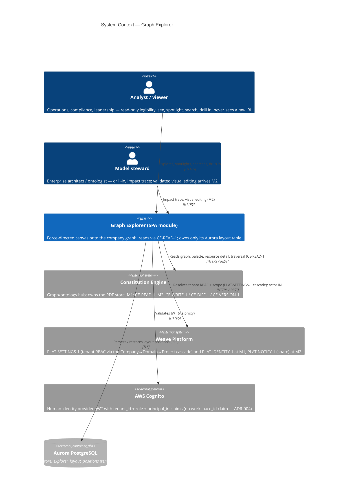
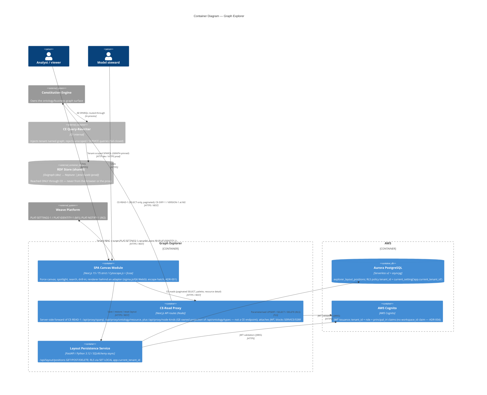
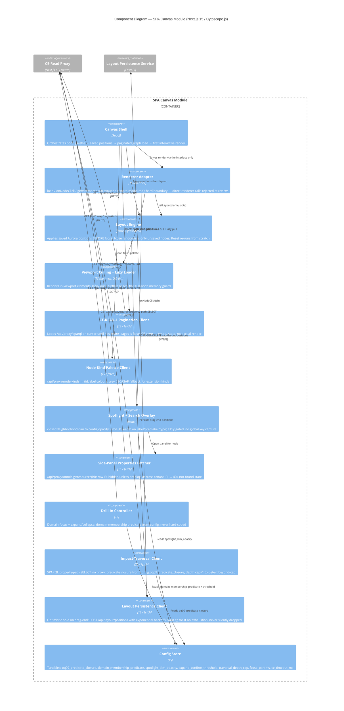

# Architecture: Graph Explorer

## Overview

The Graph Explorer is a **module inside the single Weave React SPA** (Next.js 15, TypeScript
strict) — not a separate application (graph-explorer.md §Constraints). It renders the company graph
as a force-directed canvas so any role can see and navigate the operating model without reading RDF
or writing SPARQL. This document covers C4 Levels 1-3; Level 4 (code) is deferred to `arch-diagrams`
and the implementation itself.

In M1 the Explorer is **read-only legibility**: force canvas, spotlight, search, drill-in, and
server-side layout persistence. It reads the graph **only** through the Constitution Engine's
`CE-READ-1` contract — there is no direct SPARQL from the browser and none from the proxy tier; the
RDF store is CE-side and reached exclusively through CE's tenant query-rewriter (which injects the
tenant named graph and rejects any unscoped or `SERVICE`-federated query, fail-closed). The
Explorer owns exactly one persistent store of its own: the Aurora `explorer_layout_positions`
table (data-model.md §Layout Schema). Per weave-spec §1.2 the Explorer M1 is delivery **wave W2**,
unblocked by the CE M1 spine; at M1 it consumes only `CE-READ-1`, `PLAT-SETTINGS-1`, and
`PLAT-IDENTITY-1`. M2 adds `CE-WRITE-1`, `CE-DIFF-1`, `CE-VERSION-1`, and `PLAT-NOTIFY-1`; those
appear tagged in the diagrams but carry no M1 surface.

The renderer is treated as an **adapter** behind a stable internal interface
(`load` · `onNodeClick` · `getViewport` · `setLayout` · `pin`) so the default Cytoscape.js + fcose
engine can be swapped for a WebGL engine (sigma.js/G6) with a bounded rework delta if the OQ-01
benchmark spike (TASK-001) fails its 10k-node go/no-go (ADR-001-render-engine). No 10k performance
number is asserted as settled until that spike signs off.

## C4 Model

### Level 1: System Context

The Explorer is a pure **consumer**: it owns *how the graph is seen and worked on*, while the
Constitution Engine owns *what the graph is and whether it is valid*. The only data it writes is
canvas layout, into its own tenant-scoped Aurora table. The RDF store is not drawn at context
level because the Explorer never touches it directly — that boundary is CE's contract surface and
appears at L2.

### Level 2: Container

Container notes:

- **SPA Canvas Module** mounts inside the single Weave SPA chrome (owned by the Platform shell) —
  the Explorer owns its secondary navigation and the canvas, not the app frame.
- **CE-Read Proxy** is a thin server-side tier: the browser never calls CE directly. It attaches
  the Cognito JWT, forwards CE-READ-1 SELECT-only paginated queries, and blocks `SERVICE`/SSRF —
  but it composes no SPARQL of its own; the graph boundary stays entirely CE-side.
- **Layout Persistence Service** is the only component that writes anything, and only to the
  GE-owned Aurora table. It sets the RLS GUC inside every transaction before any DML (TASK-004).
- **RDF store progression** (Oxigraph dev → Neptune | Jena Fuseki prod) is drawn CE-side and
  reachable only through the CE query-rewriter — the Explorer is store-agnostic by construction.
- M2 additions (`CE-WRITE-1`, `CE-DIFF-1`, `CE-VERSION-1`, `PLAT-NOTIFY-1`) route through the same
  proxy tier; they are tagged, not built, at M1.

### Level 3: Component — SPA Canvas Module

The Canvas Module is the L3 target: it concentrates the Explorer's architectural risk (the renderer
adapter boundary, viewport culling at 10k nodes, the CE pagination loop, and the config-loaded
predicate closure all live here). The proxy and layout services are structurally conventional REST
tiers; drawing them at L3 would add pages, not insight.

Component notes: 12 components — at the ≤ 12 cap. Two rules discipline the module. Every renderer
touch goes through the **Renderer Adapter** — no feature component calls Cytoscape (or a future
WebGL engine) directly, which is what bounds the ADR-001 swap to a ~25-35% delta. And every
predicate is read from the **Config Store** — `oq09_predicate_closure` and
`domain_membership_predicate` are populated externally at OQ-09 resolution; a literal predicate
string anywhere in this module is a defect (SS-GE-4). All CE egress is through the proxy tier; the
module holds no CE URL and issues no SPARQL the rewriter has not scoped.

## 10k-Node Performance Budget

Performance at scale is the Explorer's defining risk, so it is a first-class architectural concern,
not a footnote. **No 10k number below is a settled capability** until the OQ-01 benchmark spike
(TASK-001) signs off — it is the explicit go/no-go gate on the whole renderer choice.

| Budget | Target (p95, default, tunable) | Gate |
|--------|-------------------------------|------|
| Canvas initial load @ 1k nodes | ≤ 3 s to first interactive render | TASK-001 spike |
| Canvas initial load @ 10k nodes | ≤ 8 s to first interactive render | TASK-001 spike (go/no-go) |
| Node drag @ ≤ 1,000 visible nodes | ≥ 60 fps (≤ 16 ms/frame) | TASK-001 spike |
| Filter / overlay apply @ up to 10k nodes | ≤ 300 ms | M2 |

Reference hardware for the harness: desktop Chrome latest, 16 GB RAM, **no GPU acceleration**
(TASK-001 AC-1) — the conservative floor, so a pass generalises upward.

**Go/no-go (ADR-001-render-engine).** The default is Cytoscape.js + fcose (prototype-proven at
smaller scale). TASK-001 STEP 4 flips the ADR to `Accepted` on a go (render ≤ 8 s @ 10k, drag
≥ 60 fps @ ≤ 1k), or `Superseded` by a renderer-swap ADR naming sigma.js/G6 on a no-go. Because
every feature sits behind the renderer adapter, a no-go swap re-implements the adapter body
(concentrated in the force canvas), not the features — a bounded ~25-35% rework, not a rewrite.

**Culling strategy.** The **Viewport Culling + Lazy Loader** (net-new, OQ-04 — no prototype) is the
memory guard: only in-viewport elements are rendered live, and the CE-READ-1 pagination client
pulls further pages lazily rather than materialising all 10k nodes at once. Culling design and its
benchmark are tied to the OQ-01 harness; the go/no-go verdict covers both together.

## Design Decisions

An adversarial critic pass was run before writing this table; the five mandatory challenges appear
as D1-D5, Explorer-specific decisions as D6-D9. Program-level ADRs live in
[`../../../decisions/`](../../../decisions/) (ADR-001 tenant isolation); the renderer decision is
[`../decisions/ADR-001-render-engine.md`](../decisions/ADR-001-render-engine.md).

| # | Decision | Rationale | Alternatives rejected | Critic challenge | Response |
|---|----------|-----------|-----------------------|------------------|----------|
| D1 | Graph access is CE-side only (CE-READ-1); no direct SPARQL from browser or proxy | CE owns the store, the ontology, and validity; splitting query authorship would fork the model boundary | Let the proxy compose scoped SPARQL against the store directly | "Why not let the proxy query the store — one hop fewer?" | The proxy has no store credentials and no rewriter; it forwards CE-READ-1 only. The tenant-scoping and SERVICE/SSRF rejection live in CE's rewriter — duplicating them in the proxy would duplicate the security boundary |
| D2 | Layout writes use optimistic hold + exponential backoff (2/4/8 s), toast on exhaustion | Drag must feel instant; a transient proxy/DB blip must not lose a position | Block the drag on the server round-trip; fire-and-forget | "Proxy dies mid layout-write — what happens?" | Position is held in memory optimistically and retried; on exhaustion a non-blocking toast fires and the position is never silently dropped (TASK-004 AC-2) |
| D3 | Tenancy enforced twice: Aurora RLS (SET LOCAL) + CE rewriter (named-graph injection) | Defence in depth across both stores GE touches | App-layer tenant filter only | "Where is tenancy actually enforced — can the app forget?" | Layout: RLS policy `tenant_id = current_setting('app.current_tenant_id')` is fail-closed if the GUC is unset. Graph: CE's rewriter injects the tenant named graph and rejects unscoped queries. Neither depends on app-layer checks |
| D4 | 10k memory bounded by viewport culling + lazy pagination; WebGL escape hatch behind the adapter | The whole-company canvas cannot hold 10k live DOM/canvas elements without a guard | Render all nodes eagerly and rely on the browser | "Canvas memory blast radius at 10k nodes?" | Only in-viewport elements are live (OQ-04 culling); pages load lazily; if Cytoscape still misses the budget the adapter swaps to a WebGL engine (ADR-001-render-engine) |
| D5 | On CE error the canvas shows a defined empty-state with retry — never a partial render | A half-loaded graph misleads the user about what exists | Render whatever pages arrived before the error | "CE unavailable mid-load — partial graph?" | The pagination client discards partial results and renders the empty-state + CE error + retry; no partial render (FR-001, TASK-002) |
| D6 | Default renderer Cytoscape.js + fcose, spike-gated, behind a stable adapter | Prototype-proven; the adapter makes the WebGL contingency bounded | Commit to WebGL up front; call the renderer directly | "Cytoscape vs WebGL — betting the build on an unmeasured renderer?" | Cytoscape is the default pending TASK-001; the adapter (`load/onNodeClick/getViewport/setLayout/pin`) makes a no-go a ~25-35% swap, not a rewrite (ADR-001-render-engine) |
| D7 | Explorer is a module inside the single SPA, not a separate app | The whole product is one React SPA; engine surfaces mount in the shared chrome | Ship the canvas as a standalone micro-frontend | "Why not isolate the canvas as its own app?" | graph-explorer.md §Constraints mandates a module in the single SPA; a separate app would fork auth, chrome, and navigation for no M1 benefit |
| D8 | Impact-traversal predicate closure is config-loaded (OQ-09), never hard-coded | The closure subset depends on shipped BPMO relationship types, unresolved until OQ-09 | Hard-code the candidate predicate list now | "Just pick the predicates and move on?" | Predicates come from `config.oq09_predicate_closure`; TASK-005 AC-6/AC-7 stay blocked until CE resolves OQ-09. A literal predicate string is a defect (SS-GE-4) |
| D9 | Raw IRI hidden from the default side panel; revealed only to ontologist under Advanced | Upholds the model-hiding contract that is the product's reason to exist | Show the IRI to everyone | "Hiding the IRI is just cosmetic — real value?" | Business legibility is the point; the IRI is disclosed only under Advanced for `ontologist`-role JWTs, and cross-tenant IRIs return 404 (no tenant-existence leak) |

## Invariants

All invariants are EARS-notated and each maps to at least one release-gate test.

- **Tenant-scoped layout reads/writes:** WHEN any `/api/layout/positions` read or write is processed
  THE SYSTEM SHALL set `app.current_tenant_id` inside the transaction and rely on the fail-closed
  RLS policy, so a request in tenant A's context SHALL return or write zero rows for tenant B
  (TASK-004 AC-7 release-gate isolation test).
- **No direct store query:** WHEN the Explorer needs graph data THE SYSTEM SHALL obtain it only
  through CE-READ-1 via the proxy tier — the browser and the proxy SHALL issue no SPARQL that CE's
  rewriter has not tenant-scoped, and `SERVICE`/unscoped queries SHALL be rejected fail-closed.
- **No partial render on CE error:** WHEN a CE-READ-1 call errors or times out (default 10 s,
  tunable) during graph load THE SYSTEM SHALL render the empty-state with the CE error and a retry
  control AND SHALL NOT display any partially loaded graph (FR-001, TASK-002).
- **Predicate closure config-loaded:** WHEN impact traversal or domain focus composes a query THE
  SYSTEM SHALL read the predicate set from config (`oq09_predicate_closure` /
  `domain_membership_predicate`) — no predicate IRI SHALL be a literal in the codebase (SS-GE-4).
- **Renderer contract stability:** WHEN the render engine is swapped (Cytoscape → WebGL) THE SYSTEM
  SHALL keep the adapter interface (`load/onNodeClick/getViewport/setLayout/pin`) unchanged, so no
  feature component calls a renderer API directly (ADR-001-render-engine; rejected at review).
- **Layout durability:** WHEN a layout save fails THE SYSTEM SHALL hold the position optimistically
  and retry with exponential backoff, surfacing a non-blocking toast on exhaustion — a position
  SHALL NEVER be silently dropped (TASK-004 AC-2).
- **IRI non-disclosure:** WHEN a side panel renders for a non-ontologist principal THE SYSTEM SHALL
  NOT show the raw IRI; WHEN a requested IRI belongs to another tenant CE SHALL return 404 and the
  panel SHALL show a generic not-found state (data-model.md §Node Properties).
- **Accessibility:** WHEN any non-canvas Explorer UI (side panel, search overlay, filter sidebar,
  comments) is rendered THE SYSTEM SHALL pass axe-core with zero violations, and the force canvas
  SHALL NOT trap keyboard focus (graph-explorer.md §Accessibility).
- **Dev/prod parity:** WHEN running in the test environment THE SYSTEM SHALL exercise CE through a
  contract stub and Aurora through a local Postgres fixture — no real cloud calls in tests (Law F).

## Quality Attributes

Targets are the graph-explorer.md §2.2 configurable defaults (provisional, not contractual SLAs);
every 10k figure is gated on the OQ-01 spike.

| Attribute | Target | Measurement | Risk if missed |
|-----------|--------|-------------|----------------|
| Canvas initial load @ 1k | ≤ 3 s p95 (default, tunable) | OQ-01 harness + Playwright timing | Whole-company view feels unusable at realistic scale |
| Canvas initial load @ 10k | ≤ 8 s p95 — **unverified, OQ-01 spike gate** | OQ-01 benchmark report (TASK-001) | Renderer bet fails; triggers WebGL escape hatch (OQ-05) |
| Node drag @ ≤ 1k visible | ≥ 60 fps (≤ 16 ms) | OQ-01 harness fps sampling | Direct manipulation feels broken; layout work abandoned |
| Filter / overlay apply @ 10k | ≤ 300 ms (M2) | Browser trace in CI | Overlays too slow to explore interactively |
| Layout save | ≤ 300 ms p95 to UPSERT ack | Playwright + locust against the layout service | Drag persistence feels laggy; retries mask a real regression |
| Cross-tenant isolation | zero tenant-B rows/triples across layout reads and CE reads | Seeded two-tenant RLS + CE-stub test (release gate) | Worst-case breach; contract-ending |
| RDF store parity | dev = Oxigraph, prod = Neptune \| Jena Fuseki (CE-owned); Explorer store-agnostic | CE-stub tests run identically regardless of store | Hidden store coupling leaks into the Explorer |
| Availability | 99.9% monthly | CloudWatch alarms | Pilot-client SLA breach |
| Coverage | ≥ 80% (shared line target) | pytest-cov / Vitest v8 in CI | Silent regressions in isolation and pagination logic |
| Mutation coverage | ≥ 60% | mutmut / Stryker in CI | Weak tests around adapter, culling, and RLS paths |
| Lighthouse (Explorer routes) | Performance ≥ 90, Accessibility ≥ 95, Best-practices ≥ 90 | Lighthouse CI on PRs touching the routes | Shell-level slowness or a11y regressions ship unnoticed |

---

*Generated by Weave arch-diagrams skill. Review and approve before task decomposition.*
