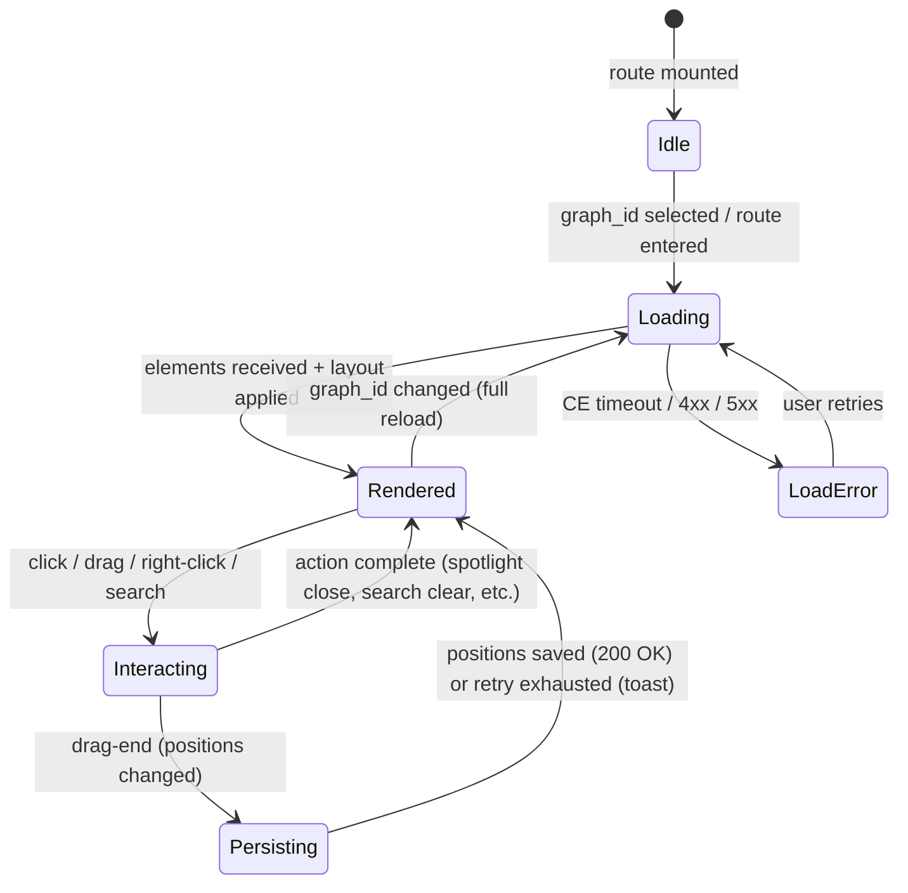
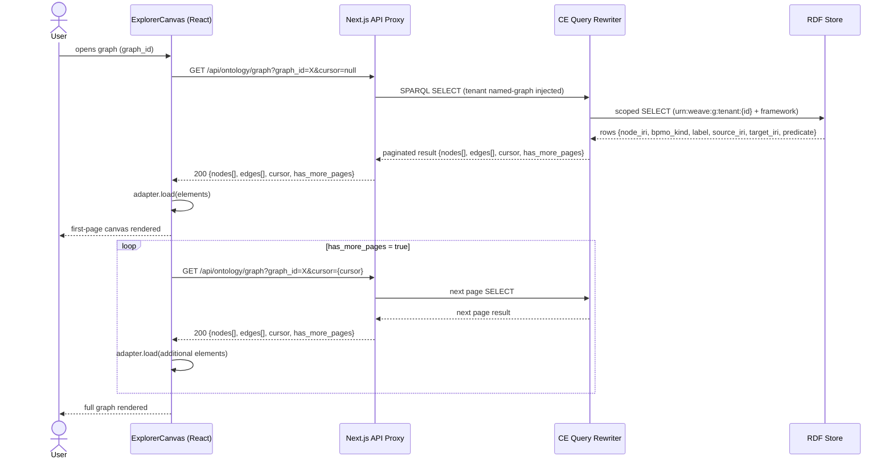
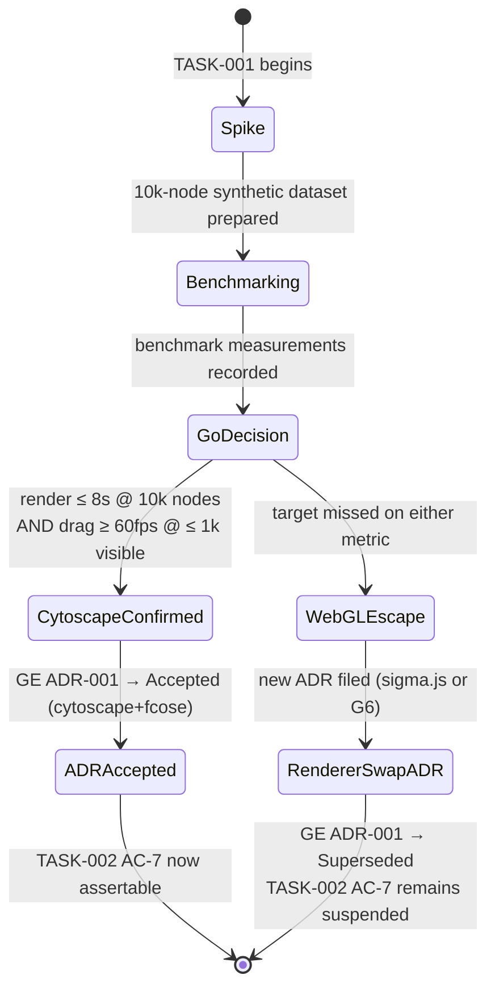
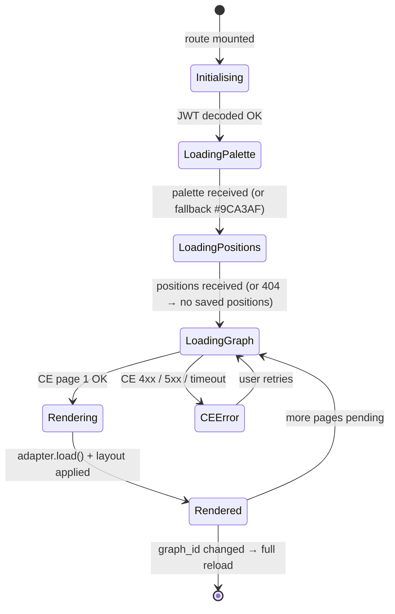
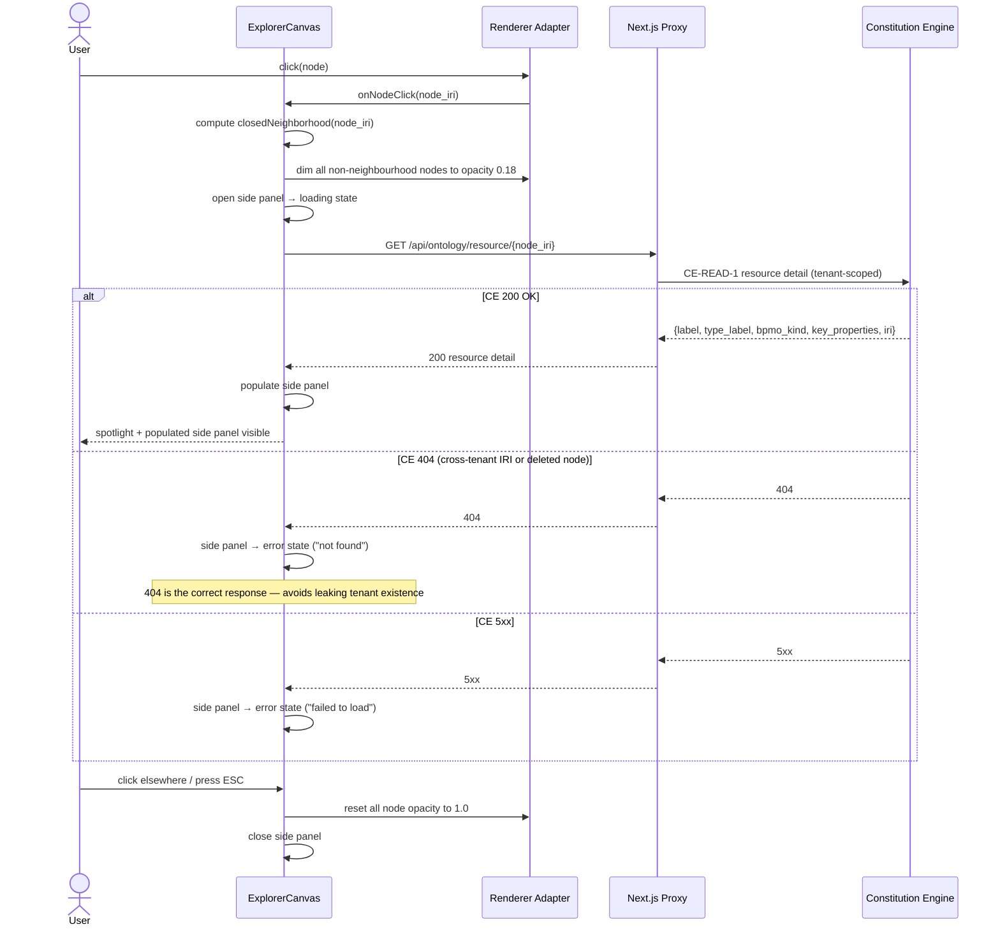
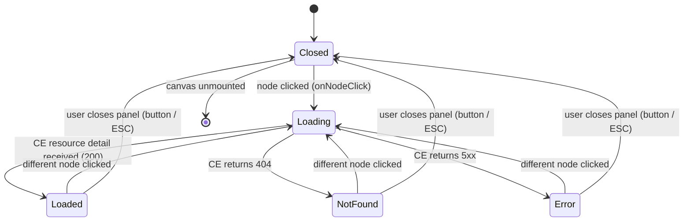
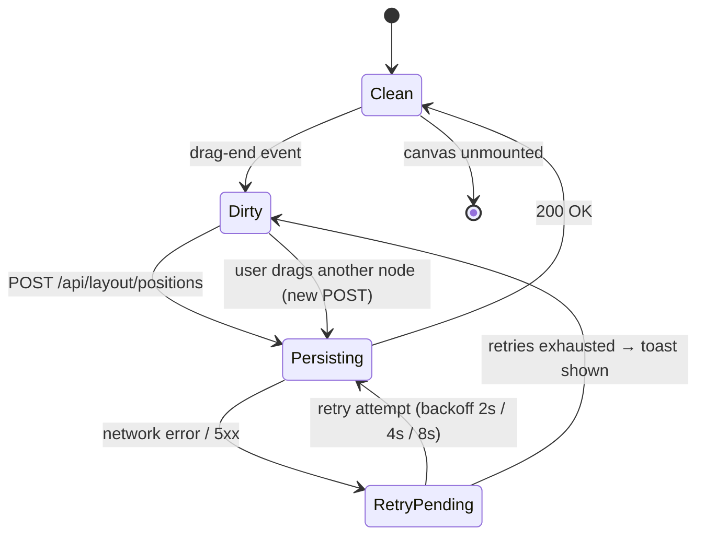
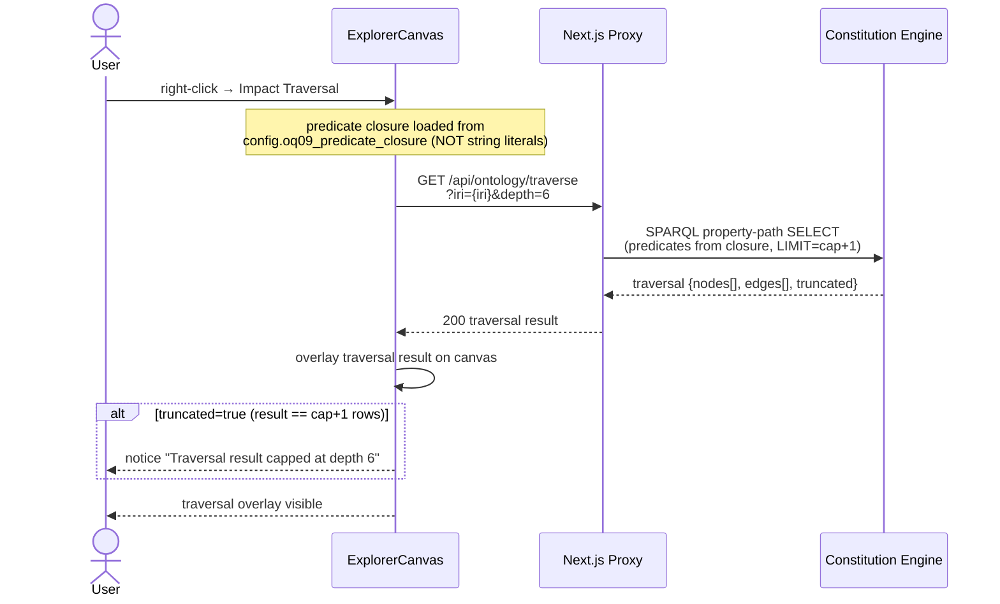
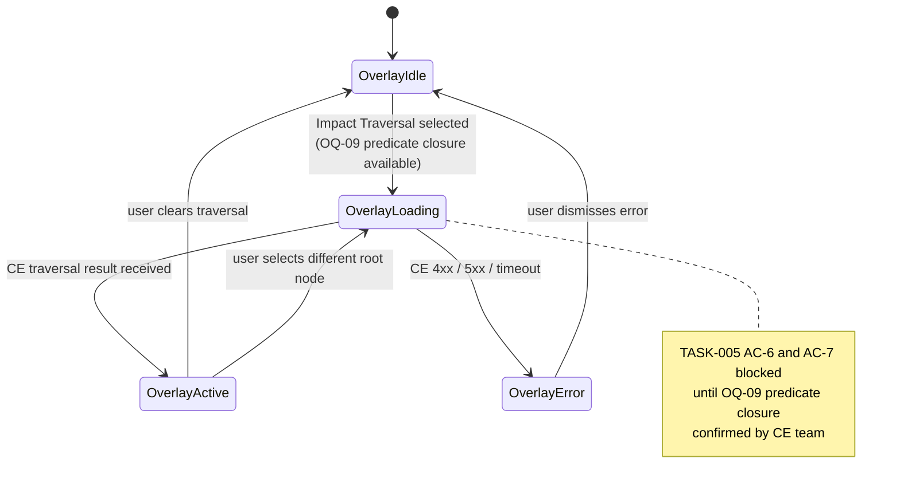

# Graph Explorer — Business Process (M1)

**Engine spec:** [graph-explorer.md](../../graph-explorer.md)
**Inter-engine contracts:** [contracts.md](../../../contracts.md)
**Tenant isolation:** [ADR-001 — named-graph + query-rewriting](../../../decisions/ADR-001-tenant-isolation.md)
**Renderer strategy:** [ADR-001 (GE-local) — Cytoscape.js + fcose](../decisions/ADR-001-render-engine.md)

**Standards referenced (link, not restated):**

- RBAC levels: [rbac-multi-tenancy.md](../../../../../standards/rbac-multi-tenancy.md)
- API conventions (error envelope, pagination, status codes):
  [api-conventions.md](../../../../../standards/api-conventions.md)
- Audit / immutability: [audit-immutability.md](../../../../../standards/audit-immutability.md)
- Observability (traces, metrics): [observability.md](../../../../../standards/observability.md)
- Node kind visual palette: [data-viz.md](../../../../../standards/design/data-viz.md)

> **Renderer adapter invariant.** All diagrams below assume the renderer is accessed via the
> stable adapter interface (`load(elements)`, `onNodeClick(cb)`, `getViewport()`, `setLayout(name, opts)`,
> `pin(node)`). No task may call renderer APIs directly — this bound limits a Cytoscape → WebGL
> swap to ~25–35 % rework. See [GE ADR-001](../decisions/ADR-001-render-engine.md).

---

## Canvas Session State Machine

This is the top-level lifecycle of an Explorer canvas session, spanning all M1 flows:



> All detailed sub-flows are diagrammed in the sections below.

---

## Graph Load

End-to-end sequence from route entry through to the renderer receiving the first page of elements.
CE-READ-1 is the exclusive data source; all SPARQL queries pass through the CE query-rewriter
(tenant named-graph injected automatically — unscoped queries are fail-closed rejected).



> CE-READ-1 SELECT is paginated (`cursor` + `has_more_pages`). `SERVICE` federation is blocked
> by the rewriter. Error handling for this sequence: see [#canvas-initial-load](#canvas-initial-load).

---

## Benchmark Decision

TASK-001 runs a benchmark spike on a 10k-node dataset to determine whether Cytoscape.js + fcose
meets the M1 performance targets. This state diagram shows the go/no-go gate and its consequences.



> **TASK-002 AC-7 is suspended until TASK-001 is signed off** (per GE ADR-001 Consequences).
> The engineer must not assert AC-7 until the benchmark completes. If WebGLEscape fires, the
> renderer adapter interface absorbs ~40–60 % rework in TASK-002 and ~25–35 % blended.

---

## Canvas Initial Load

Full load flow for the Explorer page, from route entry to idle-ready state. This includes
pre-loading the node-kind palette and saved layout positions before fetching graph data.

```mermaid
flowchart TD
    A([Route /explorer?graph_id=X]) --> B{JWT valid?}
    B -->|No| C[/Redirect to login/]
    B -->|Yes| D[Decode JWT — extract tenant_id + workspace_id]

    D --> E[GET /api/proxy/node-kinds — GE projection of<br/>CE-READ-1 /api/ontology/types — fetch BPMO kind palette]
    E --> F[GET /api/layout/positions?graph_id=X<br/>fetch saved Aurora positions]
    F --> G[GET /api/ontology/graph?graph_id=X<br/>page 1 via CE-READ-1]

    G --> H{CE response?}
    H -->|4xx / 5xx / timeout| I[Show CE error state<br/>Retry button visible]
    I -->|User retries| G

    H -->|200 — empty graph| J[Show empty-graph state<br/>"No nodes in this graph"]

    H -->|200 — nodes present| K[adapter.load elements]
    K --> L{Saved positions<br/>for this graph_id?}
    L -->|Yes — from Aurora| M[Apply saved positions<br/>pin each locked node]
    L -->|No — first load| N[Run fcose auto-layout]
    M --> O[Canvas rendered]
    N --> O

    O --> P{has_more_pages?}
    P -->|Yes| Q[Fetch next page<br/>append elements → adapter.load]
    Q --> P
    P -->|No| R([Canvas idle — awaiting interaction])
```

---

## Canvas Load State

State machine for the canvas loading and error lifecycle, corresponding to
[#canvas-initial-load](#canvas-initial-load):



---

## Spotlight Flow

When a user clicks a node, the canvas enters spotlight mode (closedNeighborhood at full opacity,
all other nodes dimmed) and the side panel fetches full properties from CE.



> Raw IRI (`node_iri`) is shown only under the "Advanced" disclosure in the side panel and only
> for users with `ontologist` RBAC role ([rbac-multi-tenancy.md](../../../../../standards/rbac-multi-tenancy.md)).
> Opacity 0.18 for dimmed nodes is tunable via `config.spotlight_dim_opacity`.

---

## Side Panel States

State machine for the detail side panel, corresponding to [#spotlight-flow](#spotlight-flow):



---

## Layout Persist Flow

Server-side layout persistence: after a drag-end event, GE posts updated positions to Aurora.
The backend issues `SET LOCAL app.current_tenant_id` before the UPSERT to satisfy the RLS policy.
The client uses an optimistic hold with exponential-backoff retry.

```mermaid
sequenceDiagram
    actor User
    participant Canvas as ExplorerCanvas
    participant Adapter as Renderer Adapter
    participant Proxy as FastAPI Backend
    participant DB as Aurora PostgreSQL (RLS)

    User->>Adapter: drag-end (node released)
    Adapter->>Canvas: position change event {node_iri, x, y}

    Canvas->>Canvas: mark positions as pending (optimistic hold)

    Canvas->>Proxy: POST /api/layout/positions<br/>{graph_id, positions:[{node_iri, x, y}]}
    Proxy->>DB: BEGIN;<br/>SET LOCAL app.current_tenant_id = :tenant_id;
    Proxy->>DB: UPSERT explorer_layout_positions<br/>  (ON CONFLICT pk → DO UPDATE position_x, position_y, updated_at)
    DB-->>Proxy: 200 OK
    Proxy-->>Canvas: 200 OK
    Canvas->>Canvas: clear pending mark

    alt Network error / 5xx (retry loop)
        Proxy-->>Canvas: error
        Canvas->>Canvas: wait 2 s → retry
        Canvas->>Proxy: POST /api/layout/positions (retry 1)
        Proxy-->>Canvas: error
        Canvas->>Canvas: wait 4 s → retry
        Canvas->>Proxy: POST /api/layout/positions (retry 2)
        Proxy-->>Canvas: error
        Canvas->>Canvas: wait 8 s → retry
        Canvas->>Proxy: POST /api/layout/positions (retry 3)
        Proxy-->>Canvas: error
        Canvas->>Canvas: show toast "Layout not saved — drag again to retry"
        Canvas->>Canvas: clear pending mark
    end
```

> `GET /api/layout/positions?graph_id=X` is called during [#canvas-initial-load](#canvas-initial-load)
> to pre-load saved positions. `DELETE /api/layout/positions?graph_id=X` resets the layout for a
> graph (triggers fcose auto-layout on next load). The `locked` column is FALSE by default; the
> M1 API exposes no write path for it (M2 Saved Views only).

---

## Layout Load State

State machine for layout persistence lifecycle, corresponding to [#layout-persist-flow](#layout-persist-flow):



---

## Drill-In Flow

Three sub-flows share the right-click context menu on a node: **Domain Focus**, **Neighbour
Expand/Collapse**, and **Impact Traversal**. Impact Traversal is OQ-09 gated.

```mermaid
flowchart TD
    A([Right-click node]) --> B{Context menu action}

    B -->|Focus: domain| DF1[SPARQL SELECT domain members<br/>via CE-READ-1 rewriter]
    DF1 --> DF2[Dim non-domain nodes to 0.18 opacity]
    DF2 --> DF3([Domain focus active])
    DF3 -->|Clear focus| DF4([Reset all node opacity to 1.0])

    B -->|Expand neighbours| EN1{Estimated new<br/>nodes ≤ 500?}
    EN1 -->|Yes| EN2[Fetch /api/ontology/resource/{iri}<br/>neighbours via CE-READ-1]
    EN1 -->|No| EN3[/Confirm dialog: Add ~N nodes?/]
    EN3 -->|Cancel| A
    EN3 -->|Confirm| EN2
    EN2 --> EN4[adapter.load new elements + sub-layout]
    EN4 --> EN5([Canvas updated])

    B -->|Collapse neighbours| CO1[Remove expanded neighbour elements]
    CO1 --> CO2([Canvas restored])

    B -->|Impact traversal| IT1{OQ-09 resolved?}
    IT1 -->|No — blocked| IT2[/TASK-005 AC-6 + AC-7 suspended/]
    IT1 -->|Yes| IT3[Load config.oq09_predicate_closure]
    IT3 --> IT4[SPARQL property-path SELECT<br/>depth cap=6, LIMIT=cap+1]
    IT4 --> IT5([Traversal overlay rendered])
    IT5 -->|Clear traversal| IT6([Overlay removed])
```

Impact traversal sequence (post-OQ-09 only):



> Depth cap (default 6) and node-expansion confirmation threshold (default 500) are tunable via
> config. The predicate closure (`config.oq09_predicate_closure`) MUST NOT be assembled from
> hard-coded string literals — it is populated at OQ-09 resolution by the CE team.

---

## Traversal Overlay State

State machine for the impact traversal overlay, corresponding to [#drill-in-flow](#drill-in-flow).
This flow is gated on OQ-09 resolution (TASK-005 AC-6 and AC-7 suspended until then):



---

## Deferred (M2+)

The following flows are **out of scope for M1** and must not appear in the M1 implementation:

| Flow | Milestone | Reason deferred |
|---|---|---|
| Graph-node editing (create / update / delete) | M2 | Requires CE-WRITE-1 |
| Saved views (named layout snapshots) | M2 | Requires `locked` positions + saved-view table (FR-028) |
| Async canvas share link | M2 | FR-023 |
| Overlay editor (decorators, comments) | M2 | FR-024 |
| GE-CANVAS-1 embeddable component (force mode) | M2 | Depends on stable M1 canvas (FR-034) |
| CE-DIFF-1 / VERSION-1 version spine | M2 | Not in M1 CE-READ-1 scope |
| C4 structured canvas mode | post-v1 | Separate layout engine |
| Real-time multi-user collab (Yjs CRDT) | post-v1 | CE-EVENT-1 + CRDT complexity |
| CE-EVENT-1 live graph push | post-v1 | Requires event bus integration |
