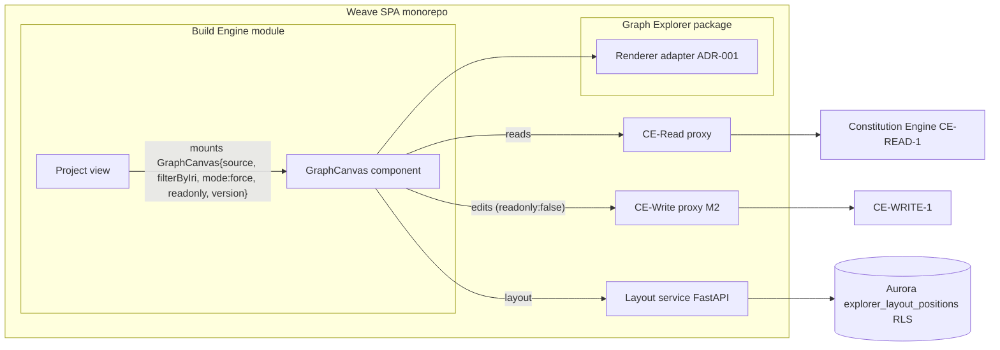

# GE-CANVAS-1 — Embeddable Canvas Component (force-mode pin)

**Contract:** [contracts.md §GE-CANVAS-1](../../../contracts.md) (canonical ID — this file is
the tech-spec-level pin of the force-mode surface; the contract entry stays authoritative for
identity and consumers). **Consumer:** Build Engine (M2 release gate — Build M2 is unblocked by
this pin). **Provider stories:** E9-S1 (graph-explorer.md).

> **Stability rule.** Once Build M2 decomposition starts, any change to the prop surface or the
> behavioural semantics below is a contract amendment: propose to the program coordinator
> (contracts.md owner), never patch unilaterally. Additive optional props are amendments too —
> Build codegen consumes this shape.

## Packaging

One React component exported from the Explorer module's **package public API** inside the
single Weave SPA monorepo — Build imports it as a workspace package export; no npm publishing,
no iframe, no micro-frontend. It renders the same force canvas built in E1 (renderer adapter
and all — ADR-001-render-engine invariants apply unchanged inside the embedded instance).

## Prop surface (M2, force mode)

```ts
export type GraphCanvasProps = {
  /** CE graph/view identifier. Also the layout scope: layout rows persist under
   *  (tenant, workspace, graph_id = source) in explorer_layout_positions.
   *  PENDING AMENDMENT (Build v1.0, FR-032): when Build embeds force mode, layout scope
   *  becomes (source, filterByIri) so a project-scoped embed does not share layout rows
   *  with the main Explorer canvas. No M2 behaviour change (Explorer is the sole consumer);
   *  do not hard-code "layout is keyed on graph_id alone" as immutable. */
  source: string;

  /** Optional scoping IRI (Build passes the project IRI). The canvas renders only the
   *  slice reachable per the scoping query; no match ⇒ empty-state, never an error. */
  filterByIri?: string;

  /** M2 accepts ONLY "force". Passing "c4" (or any other value) throws a descriptive
   *  unsupported-mode error at mount — fail loud, no silent fallback. c4 is post-v1 (D4). */
  mode: "force";

  /** true ⇒ every edit affordance disabled (quick-add, edgehandles, side-panel edit,
   *  delete). UX-level only — the authoritative authz boundary stays CE-WRITE-1 server-side. */
  readonly: boolean;

  /** CE-VERSION-1 version_iri. Absent ⇒ draft graph. Set ⇒ the read is version-pinned AND
   *  the canvas is FORCED readonly regardless of the readonly prop (published versions are
   *  immutable — PRD constraint). */
  version?: string;
};
```

No other props in M2. Selection/event callbacks are a known additive extension path — added
only when Build asks, via contract amendment.

## Behavioural semantics (each maps to a named conformance test)

| # | Rule | Conformance test |
|---|---|---|
| 1 | Mount with `mode:"force"` renders the (optionally `filterByIri`-scoped) slice via CE-READ-1 through the host app's proxy tier | `should render project slice when mounted with filterByIri` |
| 2 | `filterByIri` matching zero entities ⇒ empty-state component, no error, no throw | `should show empty state when filterByIri matches nothing` |
| 3 | Any `mode` other than `"force"` ⇒ descriptive mount error (M2) | `should throw unsupported-mode error when mode is c4` |
| 4 | `version` set ⇒ read pinned to that version AND edit affordances disabled even with `readonly:false` | `should force readonly when version is pinned` |
| 5 | `readonly:false` edits commit ONLY through CE-WRITE-1 with ADR-006 principal-IRI attribution; SHACL `422` and timeout-rollback behaviour identical to the full Explorer (FR-019–022) | `should write back through CE-WRITE-1 when edited` |
| 6 | Mounted under tenant-A context ⇒ zero tenant-B entities regardless of `filterByIri` (isolation inherited from CE rewriter + proxy; the component adds no bypass) | `should return zero tenant-B entities under tenant-A JWT` |
| 7 | Layout drags in an embedded canvas persist server-side under `graph_id = source` — same layout service, same RLS (no Build-local layout store) | `should persist embedded layout under source graph id` |

The suite is the **GE-CANVAS-1 contract conformance suite** (Playwright + CE/Platform stubs,
Law F — no real cloud). Its report is an M2 exit-gate measurable artefact
(graph-explorer.md §Roadmap M2) and the Build-M2 unblock evidence for the
"GE-CANVAS-1 force-mode release gate" HITL row.

## Component context



## Non-goals (M2)

- `mode:"c4"` — post-v1 (D4, SS-GE-2); budgeted separately when Build requests it.
- Standalone distribution (npm), theming props, event/callback API — not asked for; additive
  later without breaking this pin.
