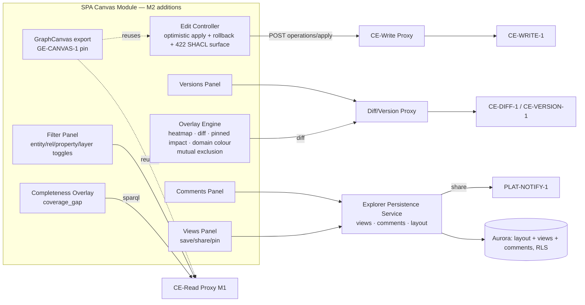

# Graph Explorer — M2 Tech-Spec Delta

**Scope rule:** this document contains ONLY changes from M1. `architecture.md`,
`data-model.md`, `business-process.md`, `testing-strategy.md` remain authoritative for
everything not restated here. Contract shapes stay canonical in
[`contracts.md`](../../../contracts.md) — this delta cites, never redefines.
Decisions: [ADR-005](../decisions/ADR-005-impact-traversal-predicate-closure.md) (predicate
closure), [ADR-006](../decisions/ADR-006-edit-attribution-principal-iri.md) (edit attribution),
[ADR-008](../decisions/ADR-008-m2-concurrency-client-drift-guard.md) (M2 concurrency = client
drift guard), [GE-CANVAS-1 pin](ge-canvas-1.md) (Build M2 gate surface).

## 1. Open questions closed at M2

| OQ | Resolution |
|---|---|
| OQ-09 | 13-entry directed closure, shared config, drift guard — ADR-005. Unblocks M1 TASK-005 AC-6/AC-7 and M2 E4-S3. |
| OQ-11 | `actor` = JWT `principal_iri` claim (PLAT-IDENTITY-1, minted at first login by PLAT-TASK-004 AC-1) — ADR-006. E5-S3's "Cognito identity" wording superseded in letter, satisfied in substance. |
| OQ-06 | Diff/version export = **JSON only in M2** (E8-S2); PDF/CSV deferred post-v1 — revisit only on compliance demand. No CE report endpoint requested. |
| OQ-08 | Still deferred (PO + Design own) — M2 stays colour-only; E10 gap indicator uses a badge, not a shape change. |
| OQ-10 | Still deferred — no data-classification overlay in M2. |

## 2. Aurora delta (extends data-model.md — same RLS pattern as `explorer_layout_positions`)

Two new GE-owned tables. Both: `ENABLE ROW LEVEL SECURITY` + the identical fail-closed policy
(`tenant_id = current_setting('app.current_tenant_id')::uuid`), `SET LOCAL` inside every
transaction, Alembic migrations, parameterised queries only.

> **Tenancy note (workspace level removed, 2026-07-08).** Workspace ≡ company/tenant per the
> PLAT-SETTINGS-1 three-level cascade (`Company → Domain → Project`); the former
> "workspace-shared" library is **tenant-shared**. New M2 tables therefore carry `tenant_id`
> only. The M1 `explorer_layout_positions` table still carries a residual `workspace_id`
> column — M2 briefs test against this spec, not that column; the rename lands with the tracked
> workspace-drop refactor (contracts.md §PLAT-SETTINGS-1 "M1 transition").

```sql
CREATE TABLE explorer_saved_views (
    tenant_id     UUID        NOT NULL,
    view_id       UUID        NOT NULL DEFAULT gen_random_uuid(),
    name          TEXT        NOT NULL,
    created_by    TEXT        NOT NULL,  -- principal IRI (ADR-006)
    definition    JSONB       NOT NULL,  -- filters, overlays, domain focus, viewport
    pinned        BOOLEAN     NOT NULL DEFAULT FALSE,  -- featured views (FR-030)
    created_at    TIMESTAMPTZ NOT NULL DEFAULT now(),
    updated_at    TIMESTAMPTZ NOT NULL DEFAULT now(),
    PRIMARY KEY (tenant_id, view_id),
    UNIQUE (tenant_id, name)   -- FR-028 collision → overwrite/rename prompt
);

CREATE TABLE explorer_comments (
    tenant_id     UUID        NOT NULL,
    comment_id    UUID        NOT NULL DEFAULT gen_random_uuid(),
    target_kind   TEXT        NOT NULL CHECK (target_kind IN ('node','view')),
    target_ref    TEXT        NOT NULL,  -- node IRI or view_id
    author        TEXT        NOT NULL,  -- principal IRI (ADR-006)
    body          TEXT        NOT NULL,
    created_at    TIMESTAMPTZ NOT NULL DEFAULT now(),
    PRIMARY KEY (tenant_id, comment_id)
);

CREATE INDEX idx_comments_tgt ON explorer_comments (tenant_id, target_kind, target_ref);
```

**Saved-view layout = layout-table reuse, not a new store.** Saving a view snapshots the
current node positions into `explorer_layout_positions` under
`graph_id = 'view:' || view_id` (the `locked` column, present since M1, is now writable on
these rows). Loading a shared view applies that snapshot — same service, same RLS, no second
positions store. Deleting a view deletes its `view:*` layout rows in the same transaction.

**Deletion rules (FR-029):** creator deletes own view; a tenant admin-tier role (JWT `roles`
claim per PLAT-IDENTITY-1, precedence resolved through the PLAT-SETTINGS-1 cascade) deletes
any. Enforced in the persistence service, asserted by test — RLS handles tenancy, not
intra-tenant authorisation.

## 3. Service & proxy delta

The M1 **Layout Persistence Service** (FastAPI) grows into the **Explorer Persistence
Service** — same container, new routers. The M1 CE-Read Proxy gains write/diff/version
forwards. No new runtime component.

| New surface | Forwards / owns | Notes |
|---|---|---|
| `POST /api/proxy/operations/apply` | CE-WRITE-1 | Injects `actor` from JWT `principal_iri` claim (ADR-006); missing claim ⇒ reject loud. All E5 + GE-CANVAS-1 write-back traffic. |
| `GET /api/proxy/ontology/diff` | CE-DIFF-1 | E4-S2 / E8-S2 diff overlay; consumers derive node/edge grouping client-side (CE ADR-002 flat-triple shape). |
| `GET /api/proxy/ontology/versions` | CE-VERSION-1 | E8-S1 versions panel; version-lag per CE-VERSION-1 canonical rule. |
| `coverage_gap` queries | CE-READ-1 (existing sparql proxy) | E10 — no new proxy route. |
| `GET /api/proxy/events` | CE-EVENT-1 beta seq feed (`GET /api/events?since_seq={n}&limit={m}`) | Poll live-refresh (FR-025): default 30 s, tunable; draft commits = `version_iri: null` rows; `410 Gone` cursor → re-baseline via CE-READ-1. The seq feed IS the polled transport — there is no "since-version" filter on CE-READ-1. Push fan-out upgrade is post-v1. |
| `GET/POST/DELETE /api/views`, `POST /api/views/{id}/share` | Persistence service + PLAT-NOTIFY-1 | Share publishes a notification event; recipients without graph access excluded (E6-S1). |
| `GET/POST/DELETE /api/comments` | Persistence service | E6-S2. |

## 4. Endpoint p95 targets (Arch Law 2 — measured like M1, seeded two-tenant fixture)

| Endpoint | p95 target |
|---|---|
| `POST /api/proxy/operations/apply` | ≤ 100 ms proxy overhead on top of CE's ≤ 800 ms write budget |
| `GET /api/proxy/events` | ≤ 100 ms overhead on CE seq-feed response |
| `GET /api/proxy/ontology/diff` | ≤ 100 ms overhead on CE diff response |
| `GET /api/proxy/ontology/versions` | ≤ 200 ms end-to-end |
| `GET /api/views` (list) · `GET /api/comments` | ≤ 300 ms |
| `POST /api/views` (incl. layout snapshot @ 10k nodes) | ≤ 800 ms |
| `POST /api/views/{id}/share` (notify publish) | ≤ 300 ms |
| `POST /api/comments` | ≤ 300 ms |

Client-side budgets unchanged from M1 quality table; one addition: filter/overlay apply
≤ 300 ms @ 10k nodes is now CI-traced (was "M2" in the M1 table).

## 5. Page targets (Arch Law 3)

M2 panels (Filters & layers, Versions & diff, Saved views, Share & comments, Completeness) are
overlays inside the existing Explorer shell — they inherit the M1 Lighthouse gate: performance
≥ 90, accessibility ≥ 95, best practices ≥ 90; zero axe-core violations on non-canvas UI in CI.

## 6. Component delta (Arch Law 5) — new components inside the existing SPA Canvas Module



Renderer-adapter invariant (ADR-001) applies unchanged: every new component drives the canvas
through the adapter interface; overlays are adapter operations, not direct renderer calls.

## 7. Testing delta (extends testing-strategy.md)

- **Concurrency (ADR-008):** E5-S3 GE-side drift guard — two-writer test asserting the second
  writer's save is blocked with the conflict notice + current server values when the draft head
  moved (`test_drift_guard_blocks_save_and_shows_current`), and that no-drift concurrent edits
  are LWW with both commits succeeding as successive CE versions
  (`test_lww_when_no_drift_detected`). CE-WRITE-1 M2 has no conditional write — no test demands
  a concurrency `409` from a CE stub.
- **Rollback:** CE-WRITE-1 timeout (10 s default) and `422` paths for add-node, add-edge,
  delete — no orphan / no phantom-removal assertions (FR-019/020/022).
- **GE-CANVAS-1 conformance suite:** the 9 named tests in [ge-canvas-1.md](ge-canvas-1.md);
  report is an M2 exit-gate artefact.
- **Cross-tenant isolation (release gate) extended:** seeded two-tenant fixture now also covers
  `explorer_saved_views`, `explorer_comments`, and `view:*` layout rows — zero tenant-B rows on
  every read; addressing a tenant-B view id rejects.
- **Closure drift guard:** boot test with a stub `/api/ontology/types` missing one closure
  predicate ⇒ loud config error, traversal disabled (ADR-005).
- All CE/Platform surfaces stubbed (Law F); coverage ≥ 80 % / mutation ≥ 60 % unchanged.

## 8. Delivery (Arch Law 9 — explicit no-new-infra decision)

M2 adds **no new infrastructure**: two Aurora tables land as Alembic migrations in the existing
database; no new services, queues, or buckets. Env-schema and workflow stubs are therefore
**unchanged from M1 / the monorepo pipeline** — no `env-schema.yaml` or workflow-stub delta is
emitted, and that absence is deliberate, not an omission. PLAT-NOTIFY-1 is consumed as an API
(stubbed in tests), not provisioned by GE.

## 9. Invariants delta

Folded into [`invariants.md`](invariants.md) (M1 + M2, flat verify-by checklist — Arch Law 10).
