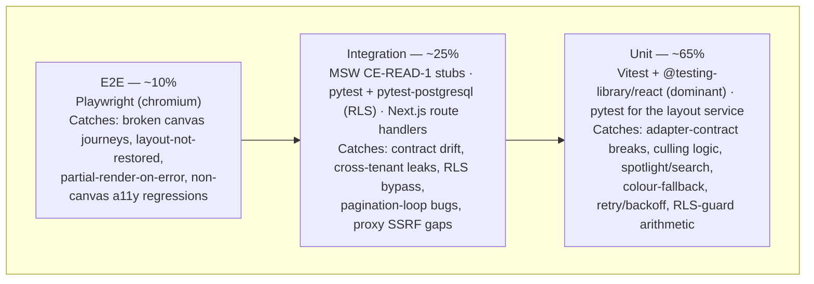

# Testing Strategy: Graph Explorer

## 1. Testing Pyramid Overview



| Layer | Tools | Coverage target | Mutation gate | Run in CI |
|-------|-------|-----------------|---------------|-----------|
| Unit | Vitest + @testing-library/react (jsdom) · pytest + pytest-asyncio (layout svc) | ≥ 80% (shared line target) | ≥ 60% (Stryker / mutmut) | Every push |
| Integration | MSW CE-READ-1 stubs · pytest-postgresql (RLS) · Next.js route handler tests | contributes to shared ≥ 80% | N/A (fake-infra non-determinism) | Every push |
| E2E | Playwright (chromium) | Critical canvas journeys + isolation + perf timing | N/A | PR merge gate |

The Explorer is **frontend-heavy**: the canvas, adapter, culling, spotlight, search, and drill-in
all live in TypeScript, so Vitest + Testing Library is the dominant layer. Python appears only where
TASK-004 defines it — the FastAPI layout-persistence service and its Aurora RLS. Every 10k
performance number is **gated on the OQ-01 spike (TASK-001)** and is not asserted as settled until
that spike signs off (architecture.md §10k-Node Performance Budget).

## 2. Unit Test Strategy

### TypeScript (SPA Canvas Module)

```text
packages/frontend/src/explorer/
├── adapter/__tests__/
│   ├── adapter.contract.test.ts     # ONE suite every adapter must pass (Cytoscape + WebGL)
│   ├── cytoscape.adapter.test.ts    # binds the contract suite to the default impl
│   └── sigma.adapter.test.ts        # binds the SAME suite to the escape-hatch impl (ADR-001)
├── canvas/__tests__/
│   ├── culling.test.ts              # viewport cull + lazy-page pull (net-new, OQ-04)
│   ├── stylesheet.test.ts           # kind→colour palette + #9CA3AF grey fallback
│   ├── pagination.test.ts           # cursor loop until has_more_pages false; error → no partial
│   └── keyBindings.test.ts          # no global capture; fires only on canvas focus
├── spotlight/__tests__/
│   ├── spotlight.test.ts            # closedNeighborhood dim to config opacity
│   ├── search.test.ts               # label / prefLabel / type substring; no CE call
│   └── sidePanel.test.ts            # IRI non-disclosure by role; graceful CE-error fallback
├── drillin/__tests__/
│   ├── domainFocus.test.ts          # member filter; empty-state; restore-on-error
│   ├── expandCollapse.test.ts       # >500 confirm gate; collapse keeps focus node
│   └── traversalQuery.test.ts       # predicate closure from config — NO literal predicate IRI
└── config/__tests__/
    └── configStore.test.ts          # tunables resolve; literal predicate string is a defect
```

- Framework: `Vitest` (`jsdom`) + `@testing-library/react`; Cytoscape runs `headless: true` in unit
- Coverage: `@vitest/coverage-v8` — `--coverage.thresholds.lines=80`
- Mutation: Stryker with `@stryker-mutator/vitest-runner` — threshold ≥ 60%
- Naming: `should <expected behaviour> when <condition>`
- Mocks: `msw` for the proxy HTTP boundary; `vi.mock()` at module edges only — never mock the
  adapter interface, culling, or search logic (those are the point of the tests)

**Renderer-adapter contract suite (the crown-jewel test).** The ADR-001 swap is only bounded to
~25–35% because every renderer sits behind the same `load / onNodeClick / getViewport / setLayout /
pin` interface. One shared suite asserts that contract; each adapter binds it. A no-go swap to
sigma.js/G6 is proven survivable when the WebGL adapter turns this same suite green — no feature
test changes.

```typescript
// adapter.contract.test.ts — imported and run against EVERY adapter implementation
export function runAdapterContract(makeAdapter: () => RendererAdapter) {
  it('should place every loaded element and report it via getViewport', () => {
    const a = makeAdapter();
    a.load([{ data: { id: 'n1', node_iri: 'urn:x:1', bpmo_kind: 'Process' } }]);
    expect(a.getViewport().elementIds).toContain('n1');
  });

  it('should invoke the onNodeClick callback with the node_iri, never a raw renderer object', () => {
    const a = makeAdapter();
    const seen: string[] = [];
    a.onNodeClick((iri) => seen.push(iri));
    a.__emitClick('n1'); // harness hook shared by all adapters
    expect(seen).toEqual(['urn:x:1']);
  });

  it('should keep pinned positions stable across setLayout(name, opts)', () => {
    const a = makeAdapter();
    a.load([{ data: { id: 'n1', node_iri: 'urn:x:1' }, position: { x: 10, y: 20 } }]);
    a.pin('n1');
    a.setLayout('fcose', {});
    expect(a.getViewport().positionOf('n1')).toEqual({ x: 10, y: 20 });
  });
}

// cytoscape.adapter.test.ts
describe('CytoscapeAdapter', () => runAdapterContract(() => new CytoscapeAdapter()));
// sigma.adapter.test.ts (escape hatch)
describe('SigmaAdapter', () => runAdapterContract(() => new SigmaAdapter()));
```

```typescript
it('should render only in-viewport elements and lazily pull the next page when panned (OQ-04)', () => {
  const canvas = mountCulledCanvas({ total: 10_000, viewport: firstScreenBox });
  expect(canvas.liveElementCount()).toBeLessThan(10_000); // memory guard: not all 10k live
  canvas.pan(farRightBox);
  expect(canvas.lastPagePulled).toBeGreaterThan(0);      // lazy pull fired on pan
});
```

### Python (Layout Persistence Service — TASK-004)

```text
packages/backend/tests/unit/
├── test_layout_routes.py     # 401 no-JWT, 403 tenant mismatch, 422 bad IRI/position, 204 DELETE
├── test_rls_guard.py         # SET LOCAL app.current_tenant_id issued inside every begin() block
└── conftest.py               # fake JWT claims, fake async session, factories
```

- Framework: `pytest` + `pytest-asyncio`; `pytest-cov` with `--cov-fail-under=80`
- Mutation: `mutmut run` — CI fails below 60%
- Mocks: `pytest-mock` at the session boundary only; the UPSERT/DELETE SQL is asserted parameterised
  (named params via `text()`), never string-concatenated (security.md)

```python
@pytest.mark.asyncio
async def test_save_rejects_mismatched_tenant_id(client: AsyncClient, jwt_tenant_a: str):
    # body tenant_id disagrees with the JWT claim → 403, nothing written (TASK-004 AC-6)
    response = await client.post("/api/layout/positions", headers=bearer(jwt_tenant_a),
                                 json={"graph_id": "g1", "node_iri": "urn:weave:x:1",
                                       "tenant_id": TENANT_B, "position_x": 1.0, "position_y": 2.0})
    assert response.status_code == 403
    assert response.json() == {"error": "forbidden"}
```

### AC-to-test mapping (cross-cutting release gates)

These six gates are cross-cutting invariants (architecture.md §Invariants); each maps to a named
test. Remaining task-level ACs are mapped in each task brief's AC-to-Test table (the briefs are the
per-task source of truth).

| Gate | EARS scenario | Layer | Test name |
|------|---------------|-------|-----------|
| 10k perf budget (TASK-002 AC-8, OQ-01) | WHEN the OQ-01 spike passes THEN first interactive render SHALL be ≤ 3 s @ 1k / ≤ 8 s @ 10k (p95) | Perf | `test_canvas_load_performance_p95_1k` / `_10k` |
| Cross-tenant layout RLS (TASK-004 AC-7) | WHEN a layout GET runs under a tenant-A JWT THEN zero tenant-B rows SHALL return, enforced by RLS at the DB layer | Integration | `test_cross_tenant_layout_isolation_rls` |
| Cross-tenant graph read (TASK-002 AC-9) | WHEN a graph load runs under a tenant-A JWT THEN zero tenant-B nodes or edges SHALL return | Integration | `test_cross_tenant_graph_load_isolation` |
| No partial render on CE error (TASK-002 AC-2) | WHEN CE-READ-1 errors or times out THEN the empty-state with retry SHALL show AND no node SHALL render | Integration | `test_canvas_shows_empty_state_on_ce_error` |
| Predicate closure config-loaded (TASK-005 AC-6) | WHEN impact traversal composes a query THEN the predicate path SHALL come from config, with no literal predicate IRI in code | Unit | `should NOT contain any hard-coded predicate IRI string literal` |
| IRI non-disclosure (TASK-003 AC-2) | WHEN a side panel renders for a non-ontologist THEN the raw IRI SHALL NOT be passed to the panel | Unit | `should NOT include raw IRI in side panel props when JWT role is "viewer"` |

## 3. Integration Test Strategy

Integration tests verify contracts between components against faked infrastructure — never real
cloud accounts (Law F). Two boundaries dominate: the **CE-READ-1 proxy boundary** (frontend →
Next.js route → CE) and the **Aurora RLS boundary** (layout service → Postgres).

### Infrastructure fakes

| Service | Dev/test fake | How to start |
|---------|---------------|--------------|
| Constitution Engine (CE-READ-1: `/api/ontology/types`, `/resource/{iri}`, `/sparql` — the palette route `/api/proxy/node-kinds` is a GE-owned projection of `/api/ontology/types`, not a CE endpoint) | `msw` handlers returning contract-shaped fixtures pinned to `contracts.md` §CE-READ-1 | fixture per endpoint |
| Aurora PostgreSQL (RLS layout table) | `pytest-postgresql` fixture (RLS policy applied in migration); Testcontainers Postgres for full-parity runs | auto-provisioned per session |
| Cognito | fake JWKS + signed test JWTs carrying `tenant_id`, `workspace_id`, `role` claims | fixture |
| Next.js CE-Read proxy | route handler invoked in-process; asserts JWT forwarded, no `graph=` override, `SERVICE` blocked | fixture |

The RDF store is **never** faked directly — the Explorer never touches it (architecture.md D1). All
graph access is stubbed at the CE-READ-1 proxy boundary. Contract-shape drift is caught by
validating every MSW fixture payload against the shapes in `contracts.md` §CE-READ-1 (kinds,
relationship types, paginated `{rows, columns, has_more_pages, page}`).

```typescript
// CE-READ-1 stub pinned to contracts.md — one place drift is caught
export const ceReadHandlers = [
  http.get('*/api/proxy/node-kinds', () =>
    HttpResponse.json({ kinds: NODE_KINDS_FIXTURE })),        // [{id,label,colour}]
  http.get('*/api/proxy/sparql', ({ request }) => {
    expect(request.headers.get('authorization')).toMatch(/^Bearer /); // JWT forwarded
    expect(new URL(request.url).searchParams.get('graph')).toBeNull(); // no scope override
    return HttpResponse.json(SPARQL_PAGE_FIXTURE);            // {rows, has_more_pages, page}
  }),
];
```

```python
@pytest.fixture
def rls_session(postgresql):
    # migration applies the tenant_isolation policy; SET LOCAL drives the guard
    engine = create_async_engine(dsn(postgresql))
    apply_migration(engine, "explorer_layout_positions")
    return async_sessionmaker(engine)
```

### Directory layout

```text
packages/frontend/src/explorer/__integration__/
├── graphLoad.integration.test.ts     # paginated CE-READ-1 load builds correct element set
├── ceError.integration.test.ts       # 503 → empty-state + retry; zero elements (no partial render)
├── crossTenantRead.integration.test.ts  # tenant-B-only rows → zero Cytoscape elements
└── proxySsrf.integration.test.ts     # SERVICE / graph= override rejected at the proxy route

packages/backend/tests/integration/
├── conftest.py                       # pytest-postgresql (RLS), fake JWKS fixtures
├── test_layout_roundtrip.py          # POST then GET returns same (x,y) within ±0.5 units
├── test_layout_isolation_rls.py      # tenant-A session sees zero tenant-B rows (release gate)
└── test_layout_reset.py              # DELETE clears (tenant, workspace, graph) rows only
```

### Must cover

- Paginated CE-READ-1 graph load: cursor loop until `has_more_pages` false, element dedup
- CE error path: 503/timeout → empty-state, zero elements rendered (no partial render, FR-001)
- Proxy tier: JWT forwarded verbatim, no `graph=` override, `SERVICE`/SSRF rejected
- Aurora RLS + request-body tenant check together (defence-in-depth, both asserted — architecture D3)
- Layout round-trip: UPSERT then SELECT returns the persisted position within ±0.5 canvas units
- Cross-tenant: tenant-A session returns zero tenant-B rows via `SET LOCAL app.current_tenant_id`

### Must NOT

- Call real AWS, real Cognito, or a real CE (no live credentials or endpoints anywhere)
- Share state between tests (ephemeral Postgres + reset MSW handlers per test)
- Test canvas pixels or renderer internals (unit adapter suite or E2E territory)

## 4. E2E Test Strategy

Framework: Playwright (TypeScript), against the locally assembled app (`TEST_BASE_URL`, default
`http://localhost:3000`), CE stubbed at the proxy boundary and a test Postgres behind the layout
service.

```text
tests/e2e/
├── playwright.config.ts              # baseURL from env; workers: CI ? 1 : 4; artifacts on failure
├── fixtures/
│   ├── auth.fixture.ts               # authenticated page per role (viewer, ontologist)
│   ├── graph.fixture.ts              # deterministic 1k-node synthetic graph via CE stub
│   └── seed.fixture.ts               # two-tenant layout seed for isolation journeys
├── canvas-load.spec.ts               # 1k graph renders, coloured by kind, first-interactive timing
├── spotlight.spec.ts                 # click node → neighbourhood dim + side panel, no raw IRI
├── search.spec.ts                    # Cmd+K → highlight matches → click result centres + spotlights
├── drill-in.spec.ts                  # domain focus; expand > threshold confirm; collapse keeps focus
├── layout-persist.spec.ts            # drag node, reload, position restored (release gate)
├── ce-error.spec.ts                  # CE 503 → empty-state + retry, no partial render
└── isolation.spec.ts                 # tenant-A never renders tenant-B nodes/layout (release gate)
```

| AC ID | EARS scenario | Spec file | Status |
|-------|---------------|-----------|--------|
| TASK-004 AC-3 | WHEN a viewer drags a node and reloads THEN THE SYSTEM SHALL restore it at the dragged position | `layout-persist.spec.ts` | Planned |
| TASK-003 AC-2 | WHEN a viewer spotlights a node THEN THE SYSTEM SHALL show label + type with no raw IRI visible | `spotlight.spec.ts` | Planned |
| TASK-002 AC-2 | WHEN CE-READ-1 errors during load THEN THE SYSTEM SHALL render the empty-state with retry, no nodes | `ce-error.spec.ts` | Planned |
| TASK-005 AC-1 | WHEN a viewer focuses a domain THEN only that domain's members SHALL stay at full opacity | `drill-in.spec.ts` | Planned |
| TASK-002 AC-9 | WHEN a tenant-A user loads the graph THEN zero tenant-B nodes SHALL render | `isolation.spec.ts` | Planned |

Minimum scenarios (always required): happy path (sign in → canvas loads → spotlight → search →
drill-in), layout durability (drag → reload → restored), error state (CE 500 → empty-state, no blank
or partial canvas). Performance: `canvas-load.spec.ts` asserts first-interactive timing against the
OQ-01-confirmed budget (≤ 3 s @ 1k) as a Playwright timing check — **suspended until TASK-001 signs
off** (TASK-002 AC-8). Accessibility: axe-core runs inside the E2E suite on the **non-canvas** UI
(side panel, search overlay, filter sidebar, comments) — **zero violations is a release gate**
(graph-explorer.md §Accessibility). The force canvas is exempt from full SR-navigation in v1 but is
asserted **not to trap keyboard focus**.

CI gate: E2E runs on the PR merge gate only; unit + integration run every push. `ui_verify.sh
--full` (cross-screen reachability + a11y) runs at epic close per the implement loop and consumes
this same Playwright install.

## 5. Test Data Management

| Layer | Strategy | Rationale |
|-------|----------|-----------|
| Unit | Inline factories (`makeNode`, `makeEdge`, `makePalette`) | Fast, deterministic, no I/O |
| Integration | MSW fixtures pinned to CE-READ-1 shapes; pytest-postgresql per-session; two-tenant seed | Isolation is under test — seeds must be per-test |
| E2E | Deterministic synthetic graph generator via CE stub; test-only layout seed endpoint | Reproducible starting canvas at a fixed node count |

**Deterministic synthetic graph generators.** The OQ-01 harness and the E2E/perf specs share one
seeded generator producing graphs at 1k / 5k / 10k nodes with a fixed RNG seed and ~3 edges/node
(TASK-001 STEP 1). Each row matches the CE-READ-1 SPARQL SELECT shape, so the same fixtures drive
unit pagination tests, integration stubs, and the benchmark harness — one source, no divergence.

```typescript
export const makeGraph = (nodes: number, seed = 42): CeReadPage => {
  const rng = mulberry32(seed);                 // fixed seed → identical graph every run
  const rows = range(nodes).flatMap((i) => [
    { subject: `urn:weave:x:${i}`, bpmo_kind: KINDS[i % KINDS.length], label: `Entity ${i}` },
    ...range(3).map(() => ({ subject: `urn:weave:x:${i}`, predicate: 'weave:dependsOn',
                             object: `urn:weave:x:${Math.floor(rng() * nodes)}` })),
  ]);
  return { rows, columns: ['subject', 'predicate', 'object', 'bpmo_kind', 'label'],
           has_more_pages: false, page: 0 };
};
```

Prohibited: shared mutable test databases; hardcoded UUIDs/IDs; production graph snapshots
(synthetic only — Law F); secrets or PII in fixtures; asserting on wall-clock time (the layout
`updated_at` is DB-set — assert ordering, not absolute time).

## 6. Performance and Load Testing

Performance at scale is the Explorer's defining risk, so this section is first-class. **No 10k
number below is a settled capability** until the OQ-01 benchmark spike (TASK-001) signs off — it is
the explicit go/no-go on the whole renderer choice (architecture.md §10k-Node Performance Budget).

### Canvas render budget (OQ-01 harness — gates the renderer)

| Budget | Target (p95, default, tunable) | Gate |
|--------|-------------------------------|------|
| Canvas initial load @ 1k nodes | ≤ 3 s to first interactive render | TASK-001 spike |
| Canvas initial load @ 10k nodes | ≤ 8 s to first interactive render | TASK-001 spike (go/no-go) |
| Node drag @ ≤ 1,000 visible nodes | ≥ 60 fps (≤ 16 ms/frame) | TASK-001 spike |
| Filter / overlay apply @ up to 10k | ≤ 300 ms | M2 |

Reference hardware: desktop Chrome latest, 16 GB RAM, **no GPU acceleration** (TASK-001 AC-1) — the
conservative floor, so a pass generalises upward. The harness records p95 load time, p95 drag fps,
and peak heap at 1k/5k/10k using the shared synthetic generator (§5); `performance.memory` is
Chrome-only and stays in the harness page, never in production code.

### API-side load (Layout Persistence Service)

The layout service is the only public API surface the Explorer owns — this is its budget.

| Endpoint pattern | Method | P50 target | P95 target | P99 target |
|-----------------|--------|-----------|-----------|-----------|
| `/api/layout/positions` (save) | POST | < 100ms | < 300ms | < 500ms |
| `/api/layout/positions?graph_id` (restore) | GET | < 100ms | < 300ms | < 500ms |
| `/api/layout/positions?graph_id` (reset) | DELETE | < 100ms | < 300ms | < 500ms |

Load tool: `locust`, in the `performance` CI workflow (weekly + any PR touching the layout service —
save is the hot path: every drag-end posts one row).

```python
class ExplorerUser(HttpUser):
    wait_time = between(1, 3)

    @task(3)
    def save_position(self):
        self.client.post("/api/layout/positions", json=LAYOUT_SAVE_FIXTURE, headers=bearer())

    @task(1)
    def restore_layout(self):
        self.client.get("/api/layout/positions?graph_id=g1", headers=bearer())
```

### Lighthouse (Explorer routes)

| Lighthouse metric | Target |
|--------|--------|
| Performance score | ≥ 90 |
| Accessibility score | ≥ 95 |
| Best practices score | ≥ 90 |
| Initial JS bundle (gzipped, excl. lazy renderer chunk) | ≤ 200KB |

Lighthouse runs on every PR modifying an Explorer route or the canvas shell. The Cytoscape (or WebGL
escape-hatch) renderer is loaded via `next/dynamic` with `ssr: false`, so it is excluded from the
initial bundle budget; the ≤ 3 s @ 1k first-interactive figure is asserted as a Playwright timing
check in the E2E lane, with locust guarding the layout-service latency budget.

---

*Generated by Weave arch-quality skill. Review and approve before task decomposition.*
