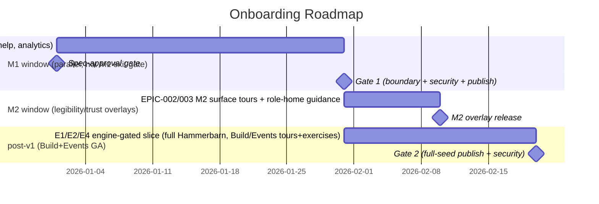

# Onboarding

> Weave Onboarding is the in-product training and guided-onboarding layer, so that a brand-new
> user can learn Weave by exploring a fully-modelled example company (Hammerbarn) and being guided
> through the product with contextual tooltips, modals, training videos, and hands-on exercises,
> reaching their first real outcome in their own workspace quickly rather than bouncing off a
> powerful but unfamiliar platform. Onboarding is what turns Weave's breadth from an obstacle into
> a guided path. It is the **terminal consumer** — it owns no graph data, exposes no inter-engine
> contract, and integrates the Hammerbarn seed across CE/Explorer/Build/Events while providing four
> activation paths (Business/Technical/Compliance via CE; Admin via platform member-management).

## 1. Brief

### Mission statement

We are building Weave Onboarding — the in-product training and guided-onboarding layer — so that a
brand-new user can learn Weave by exploring a fully-modelled example company (Hammerbarn) and being
guided through the product with contextual tooltips, modals, training videos, and hands-on
exercises, reaching their first real outcome in their own workspace quickly rather than bouncing
off a powerful but unfamiliar platform. Onboarding is what turns Weave's breadth from an obstacle
into a guided path.

### Problem

Weave is broad and conceptually novel — four engines, a semantic knowledge graph, and ideas like
ontologies, SHACL validation, and governed automation that most new users have never met. That
power is also a barrier.

- **Blank-slate paralysis.** A new user lands in an empty workspace with no data and no model,
  facing the hardest possible starting point — a blank graph — with no sense of what a "good" Weave
  model even looks like.
- **Unfamiliar concepts, especially for business users.** The ops and business roles Weave needs to
  adopt first are precisely the people least likely to know what an ontology or a SPARQL query is,
  so the platform feels like expert software.
- **Breadth is overwhelming.** With Constitution, Explorer, Build, and Automate all available, a new
  user has no obvious first path and can easily bounce off before reaching any value.
- **No worked example to learn from.** Without a complete, realistic model to explore, users cannot
  see how the pieces fit together or what to aim for in their own workspace.

The people who feel this are **every new user** — business and operations staff, architects and
engineers, trial evaluators, and workshop attendees — all of whom must climb the same curve. If
this is not solved, Weave's ops-first adoption strategy fails at the first step: the people who are
supposed to populate and trust the graph give up before they understand it, and the most powerful
platform in the category loses to whatever is easier to start.

### Vision

Within 12 months, success for Onboarding looks like:

- **Every new user starts in a fully-modelled example.** A new user lands in the Hammerbarn demo
  workspace and can explore a complete, realistic company — full ontology, glossary, brand,
  processes, and a generated example app — so they see what "good" looks like before touching their
  own.
- **The product guides itself.** Contextual tooltips, modals, and beacons walk users through the
  navigation, screens, and features, role-personalised, brief, and always skippable, so no one is
  left guessing what a screen is for.
- **Users learn by doing.** Hands-on exercises and tasks in the demo workspace (add an entity, run a
  query, build a simple automation) turn passive reading into practice, with progress tracked.
- **Help and training are always one click away.** A persistent help and guided-tour launcher gives
  access to tours, contextual help, and a training library (videos and walkthroughs) at any time,
  not just on first run.
- **New users reach a first real outcome quickly.** Guided by an onboarding checklist, a user
  completes a meaningful first action in their own workspace — a clear activation milestone — rather
  than stalling on the blank slate.
- **Onboarding is tailored to role and access.** Different roles and identities — with different
  access rights — get a context-specific onboarding experience: a business analyst, an architect, a
  compliance officer, and a workspace admin each see guidance, exercises, and a first-outcome path
  suited to what they can and need to do, rather than one generic tour.
- **Onboarding is measurable and improvable.** Completion of tours, exercises, and the activation
  milestone is tracked (by role), so onboarding effectiveness can be measured and improved over
  time.

### Scope — in scope

**The Hammerbarn demo workspace**

- A fully-modelled example company (Hammerbarn) shipped as a separate, explorable workspace:
  ontology populated across the **BPMO framework's process-centric kinds** (CE-READ-1) — its named
  business processes (Goods inward, Stock mgmt, Customer order, …) modelled as **Process** with
  **Activity** steps and **Event** triggers, performed by **Actor**s, running on **System**s and
  **Service**s, consuming/producing **DataAsset**s, realising **BusinessCapability**s within
  **BusinessDomain**s, serving **Goal**s, and governed by **Policy**s — so Hammerbarn is a proper
  "business brain" agents can reason inside (Hammerbarn's "Products / Stores / Suppliers" are
  **Class** definitions in the company's own vocabulary, not new kinds — decision B1), glossary,
  brand and voice, governance content, business processes, and org chart — plus an example generated
  app (the kitchen designer), example automations, and an example Build project. The seed is **built
  as a live pipeline** through the Constitution, Build, and Events engines (not a static migration
  snapshot), so it stays in step with the real product.
- **Per-user WRITABLE sandbox copy with manual reset:** each user gets their own isolated, writable
  copy of Hammerbarn; edits persist across sessions and are reset only by an explicit "Reset demo"
  button (never on a timer). The canonical Hammerbarn graph is read-only to all but the content
  admin; sandbox writes never affect canonical data or any real tenant. Per-user copy/isolation
  depends on the platform tenant model.

**Guided onboarding overlays**

- Contextual **tooltips, modals, and beacons/hotspots** that guide users through the navigation,
  screens, features, windows, and dashboards.
- **Guided tours** (linear) for core paths plus **contextual tooltips** for complex areas;
  skippable, resumable, with progress indicators.
- **Role-tailored** tours and guidance keyed to the user's role and access rights via **4 primary
  paths** (Business, Technical, Compliance, Admin); the 10 canonical platform roles map onto these
  (others map to the nearest). Role resolution is IdP-agnostic (Cognito or Auth0) via the platform
  RBAC model — see `weave-platform` Roles & Access.

**Training content**

- A **training library** with **placeholders for training videos** (real video production is a later
  content task) and written walkthroughs.
- **Hands-on tasks/exercises** in the demo workspace (e.g. add an entity, run a query, build a
  simple automation) with progress tracking.
- An **onboarding checklist** that drives the user to a first activation milestone in their own
  workspace.

**Help system**

- A persistent **help & guided-tour launcher** in the top header, re-accessible at any time, with
  contextual help per screen.

**Measurement**

- Tracking of tour, exercise, checklist, and activation completion, segmented by role, to measure
  and improve onboarding.

### Scope — out of scope

- **Producing the final training videos** — v1 ships placeholders and the framework to host them;
  real video content is a separate production effort.
- **The modelling capability that builds the demo** — the Constitution Engine; onboarding curates
  and ships the Hammerbarn dataset, it does not build new modelling tools.
- **The roles/identity/RBAC system itself** — owned by the platform; onboarding consumes roles to
  tailor the experience, it does not define access control.
- **Formal certification / LMS** — a structured certification programme is a later addition (related
  to the workshop methodology), not part of this in-product onboarding v1.
- **External/marketing-site education** — onboarding here is in-product.

### Target users

| User Type | Description | Primary Need |
|-----------|-------------|--------------|
| New business user / SME | First-time non-technical user who must populate and trust the graph | A concept-light, guided path with hands-on exercises that build confidence without jargon |
| New technical user (architect / engineer) | First-time technical user extending the model or building | A faster, deeper path that can skip basics and reach modelling/build capability quickly |
| Trial evaluator / buyer | Assessing whether Weave delivers value | A quick route to a convincing "aha" via the demo company, with minimal setup |
| Workshop attendee | Learning Weave within a facilitated session | Guidance that complements a live facilitator and a shared example to follow |
| Onboarding / content admin | Curates tours, exercises, and the demo dataset | Tools to configure, sequence, and update the onboarding experience and training content |

### Success criteria (brief-level)

- [ ] **The demo company ships complete.** The Hammerbarn workspace is available to every new user
  with a fully populated ontology, glossary, brand, processes, org chart, and at least one example
  generated app and automation, all explorable. Measured by a content completeness check; source:
  the demo workspace. Target: at onboarding GA.
- [ ] **Guided coverage of the product.** Every primary navigation area and its key screens has a
  guided tour or contextual tooltips. Measured by a coverage audit against the navigation map;
  source: onboarding configuration. Target: at GA.
- [ ] **Role-tailored paths are live.** The **4 primary** onboarding paths (Business, Technical,
  Compliance, Admin) exist with an explicit 9-canonical-role → 4-path mapping, each with its own
  first-outcome milestone. Measured by configuration review; source: onboarding configuration.
  Target: at GA.
- [ ] **Activation is measured and reported.** Activation rate (checklist + first milestone within
  the first week) and median time-to-first-outcome are **measure-and-report baselines for cohort 1,
  not GA gates.** The ~60% activation / ~30-minute time-to-outcome figures are provisional
  instruments; the pass/fail threshold is set **after** the cohort-1 baseline, not before. Measured
  by activation analytics segmented by role; source: application analytics.
- [ ] **Tours are skippable, resumable, and measured.** Every tour can be skipped and resumed, and
  completion of tours, exercises, and the checklist is tracked by role. Measured by functional test
  and analytics instrumentation; source: QA + analytics. Target: at GA.

### Constraints

**Technical**

- Onboarding is in-product, delivered as an overlay layer within the single React SPA — a tour
  framework keyed to navigation/screen anchors, not tightly coupled to each engine's internals.
- The Hammerbarn demo is a separate workspace with a **per-user writable copy**, isolated and
  **manually** resettable (explicit button, no auto-reset); sandbox interactions never affect the
  canonical Hammerbarn graph or any real tenant data. Onboarding state (tour resume point, dismissed
  beacons, checklist, activation, chosen path) is persisted **server-side per (tenant, user)**, not
  localStorage, so it survives device switches.
- Training videos are placeholders in v1; the framework hosts them (e.g. S3/CloudFront) when
  produced.
- Role-tailoring consumes the platform Roles & Access model; onboarding does not define access
  control.
- Tours and tooltips must be accessible and keyboard-navigable, and always skippable.
- Whether to build the tour framework or adopt a library is decided at the tech spec.

**Business**

- The demo company is clearly fictional (Hammerbarn, inspired by Bunnings/Kingfisher/B&Q) to avoid
  trademark issues while staying realistic.
- Onboarding supports the trial-conversion and workshop GTM motions.

**Timeline / sequencing**

- Onboarding tours the engines, so it follows or parallels their delivery; a basic onboarding (tours
  of Constitution and Explorer) can ship with the MVP.
- A complete demo requires the Constitution Engine (to model Hammerbarn) and at least one generated
  artefact from the Build Engine (the example app), so the full demo follows Build.

### Key decisions (brief, dated)

<!-- SHARED-HOISTED: platform-wide master decision list referenced, not restated. See
../weave-spec.md §Program and CLAUDE.md § Architecture decisions (confirmed) / weave-platform brief.
Decisions below are Onboarding-specific. -->

For the platform-wide master list see `CLAUDE.md § Architecture decisions (confirmed)` and the
`weave-platform` brief. Decisions specific to Onboarding:

| Decision | Rationale | Date |
|----------|-----------|------|
| In-product guided onboarding via an overlay framework (tooltips, modals, beacons, tours) | Guides users through a broad, novel platform in context, where the work happens | 2026-06-26 |
| A fully-modelled Hammerbarn demo workspace is the learning sandbox | Users learn from a complete, realistic example and see what "good" looks like before touching their own | 2026-06-26 |
| Combine a fully-populated demo with focused guided tours | Research shows a sandbox plus targeted tours beats either a feature-by-feature tour or an empty start | 2026-06-26 |
| Onboarding is tailored to role and access via 4 primary paths | Different roles need different paths; the 10 canonical platform roles map onto 4 paths (others map to nearest), resolved IdP-agnostically off the platform RBAC model | 2026-06-26 |
| Per-user writable Hammerbarn copy with manual reset | Hands-on practice needs a writable copy that persists; resetting only on explicit action (not a timer) avoids losing in-progress work; canonical graph stays protected | 2026-06-30 |
| Hammerbarn seed is built as a live pipeline (CE/Build/Events), not a static snapshot | Keeps the demo in step with the real product; full demo GA gated on engine GA, CE+Explorer portion at MVP | 2026-06-30 |
| Activation/time-to-outcome targets are measure-and-report baselines, not GA gates | 60%/30-min are provisional; the gate threshold is set after the cohort-1 baseline | 2026-06-30 |
| Training videos are placeholders in v1 | Ship the framework and host real video content later as a separate production effort | 2026-06-26 |
| Onboarding effectiveness is measured (activation and completion by role) | Onboarding must be improvable, not assumed effective | 2026-06-26 |
| Sequencing: CE+Explorer onboarding in M1 window (parallel, not M1 exit gate); legibility/trust onboarding = M2; full Hammerbarn demo (Build+Events) = post-v1 | The full demo needs a generated artefact + live automations (post-v1); CE+Explorer onboarding ships in parallel in the M1 window; legibility/trust features (model-completeness, role-home) follow in M2 | 2026-06-30 |

### Navigation (brief)

Onboarding is an overlay layer, not a primary navigation area, so it has no left sidebar of its own.
It surfaces across the app's information architecture (see the `weave-platform` Navigation section):

- **Help & guided-tour launcher** — in the top header global chrome, re-accessible at any time.
- **Hammerbarn demo** — appears in the workspace switcher as a separate demo workspace.
- **Onboarding checklist** — a persistent widget (e.g. on the Dashboard) tracking progress to the
  first activation milestone.
- **Training library** — opened from the help launcher (videos and walkthroughs).
- **Contextual tooltips, modals, and beacons** — overlaid on each engine's screens, keyed to
  navigation/screen anchors and the user's role.

## 2. Product Requirements (PRD)

**Brief:** [§1 Brief](#1-brief) · **Status:** Draft · **Phase:** M1 window (CE+Explorer, parallel,
not M1 exit gate) · M2 (legibility/trust onboarding) · post-v1 (full Hammerbarn demo, Build+Events GA)
· **Owner:** gazzwi86 · **Last Updated:** 2026-06-30

### 2.0 Product context

#### Background

Weave is conceptually novel — four engines, a semantic knowledge graph, and ideas like ontologies,
SHACL validation, and governed automation that most new users have never encountered. Without a
working example to learn from and guided paths through the product, new users face a blank slate and
an unfamiliar paradigm.

Onboarding solves this with three interlocking mechanisms:

1. **Hammerbarn demo workspace** — a fully-modelled, explorable example company (a fictional
   home-improvement retailer) that shows users what a complete Weave implementation looks like
   before they touch their own workspace. The seed is **built as a live pipeline** through the
   Constitution, Build, and Events engines (not a static migration snapshot), so it stays in step
   with the real product (decision E2).
2. **Guided overlay layer** — contextual tours, tooltips, beacons, and modals overlaid on the live
   product, role-tailored, always skippable, always re-accessible.
3. **Activation path** — a hands-on exercise set and an onboarding checklist that drives a new user
   to a first real outcome in their own workspace within their first session.

Onboarding is not a separate app or an external doc site. It is an overlay layer within the single
React SPA, keyed to navigation and screen anchors, consuming the platform RBAC model for
role-tailoring. Onboarding **owns no graph data of its own** — it reads the company model through
Constitution Engine contracts and renders it through the Graph Explorer canvas, so it inherits the
universal-ontology framing (Weave ships the grammar; the company writes the sentences — decision
A1).

#### Goals

1. Every new user lands in a fully-modelled example (Hammerbarn) and can immediately see what "good"
   looks like — before touching their own workspace.
2. Contextual guidance covers every primary navigation area that has shipped, and is available at
   any time from the persistent help launcher.
3. New users reach a first real outcome in their own workspace quickly (time-to-outcome is a
   measure-and-report baseline for cohort 1, not a GA gate — decision E4).
4. Onboarding paths are role-tailored along **4 primary paths**, with an explicit mapping from the 9
   canonical platform roles (decision: role-paths = 4 primary; others map to nearest).
5. Onboarding effectiveness is measurable by role (completion, activation, time-to-first-outcome).

#### Non-goals

1. **Producing final training videos** — v1 ships placeholders and the hosting framework; video
   production is a separate content effort.
2. **The Constitution Engine modelling tools** — onboarding curates and integrates the Hammerbarn
   seed; the modelling/authoring capability is owned by the Constitution Engine and consumed via
   CE-WRITE-1.
3. **The RBAC/identity system itself** — platform-owned (PLAT-IDENTITY-1, PLAT-SETTINGS-1);
   onboarding consumes resolved roles to tailor the experience.
4. **The tenant/sandbox isolation mechanism** — the per-user-copy storage topology is owned by the
   platform tenant model (PLAT-SETTINGS-1); onboarding states the isolation expectation and defers
   the mechanism to the tech spec (OQ-02).
5. **Rendering and removability of Dashboard starter widgets** — owned by the Platform Generative
   Dashboard (Platform PRD E1-S6 / FR-012); onboarding only contributes the role→widget-set mapping.
6. **Producing the Hammerbarn seed artefacts** — CE owns the ontology/glossary/brand/governance
   seed, Build owns the Kitchen Designer project + app, Events owns the example automations;
   onboarding is the **integrator** (cross-spec seam).
7. **Notification centre** — owned by the platform notification service (PLAT-NOTIFY-1); onboarding
   publishes `onboarding-activation` events to it, it does not build a centre.
8. **Formal certification / LMS** and **external marketing-site education** — out of v1.
9. **The governed-contribution / proposed-node ("under review") lifecycle** — owned by the
   Constitution Engine; out of scope for onboarding v1. Onboarding exercises write directly to the
   user's sandbox draft; they do not teach or surface the proposed/quarantine lifecycle in v1. If a
   future content task adds an exercise that demonstrates it, the lifecycle behaviour remains
   CE-owned.

### 2.1 Personas & roles

The onboarding paths map the **10 canonical platform human roles** (Platform brief, Roles & Access)
onto **4 primary paths** (decision: 4 primary, others map to nearest). The mapping is authoritative
for FR-013/FR-014. Per-persona feed/consume detail lives in [`personas.md`](../personas.md).

| Persona (path) | Canonical roles mapped to it | Primary need | Permission level |
|---|---|---|---|
| **Business** | Business analyst / SME; Brand / content owner; Viewer / stakeholder (read-only variant) | Concept-light, jargon-free path; NL not SPARQL; hands-on exercises | read / author-instance |
| **Technical** | Enterprise architect; Engineer / developer; Automation author; Data steward / data engineer | Faster path; skips concept intros; modelling + Build + automation depth | author-structure / publish / build |
| **Compliance** | Compliance / risk officer | Governance, SHACL rules, PROV-O audit trail, compliance views | author-governance / audit-read |
| **Admin** | Workspace admin / owner; Ops / SRE | Workspace setup: RBAC, connectors, billing, retention, runs | admin |

> Mapping rules (FR-014): Viewer / stakeholder resolves to the **Business path in read-only
> variant** (exercises that require writes are shown locked). A user holding **multiple roles**
> (roles combine on one identity per the platform model) is prompted to choose a starting path; the
> union of their roles' capabilities still governs what each exercise/tour can do. A user with
> **zero roles** defaults to the Business read-only variant. Role slugs are the canonical platform
> RBAC slugs resolved via PLAT-IDENTITY-1 — IdP-agnostic (Cognito or Auth0); onboarding never reads
> a Cognito group directly.

**Onboarding-internal roles**

| Role | Description | Permission level |
|---|---|---|
| **Onboarding / content admin** | Weave-internal: curates tours, exercises, training content, and the Hammerbarn seed pipeline | admin (Weave-internal) |
| **Platform analytics system** | Non-human principal that records onboarding/activation analytics events | service principal (PLAT-IDENTITY-1) |

### 2.2 User stories (full ACs)

**Hammerbarn → BPMO-kind mapping (contractual shape only).** The seed is authored content, not
spec. Contractual shape: every Hammerbarn entity class maps to exactly one BPMO kind from the
process-centric **BPMO framework** (CE-READ-1 — see [../contracts.md](../contracts.md)). **Process
is the spine**, edging out to Activity, Event, Actor, System, Service, DataAsset,
BusinessCapability, BusinessDomain, Goal, and Policy. Instance categories like "Product" or "Store"
are **Class** definitions punned with Concept (decision B1) — not new kinds. Counts are content
targets owned by the content admin, not contractual constants. The full entity-class→BPMO-kind
mapping table is content, not PRD — it lives in the **Hammerbarn Content Brief**
(`docs/specs/weave/hammerbarn-content-brief.md` — content artifact tracked in
EPIC-001). The seed is produced as a **live
pipeline**: CE via CE-WRITE-1 (ontology/glossary/brand/governance); Build via BE-ARTEFACT-1
(post-v1); Events via EA-AUTOMATION-1 (post-v1).

#### Epic 1: Hammerbarn Demo Workspace

**E1-S1: Explore a fully-modelled example company on first sign-in.** As a **new user**, I want to
enter a complete, explorable example workspace (Hammerbarn) on first sign-in so that I can see what
a finished Weave model looks like before facing my own blank workspace.

- **AC:** WHERE a tenant is newly provisioned, WHEN the user opens the workspace switcher THE SYSTEM
  SHALL present a "Hammerbarn Demo" workspace with no setup or invitation, labelled "Demo —
  fictional data".
- **AC:** WHEN the user opens Constitution and Explorer in the Hammerbarn workspace THE SYSTEM SHALL
  render the ontology (entities across the BPMO kinds — Process and its surrounding actors, systems,
  services, data, capabilities, goals, policies), glossary, brand, and governance content, sourced
  via CE-READ-1 (`?version=latest`) and the Explorer canvas (GE-CANVAS-1).
- **AC (failure mode):** IF a seed artefact's producing engine has not shipped (Build / Events at
  MVP) and the user opens that area THEN THE SYSTEM SHALL show the area **feature-flagged off** with a
  "Coming soon" note — the workspace must not render a broken/empty Build or Automate tab.
- **Priority:** Must Have (CE+Explorer content) · Could Have→Must at Build/Events GA (Build project,
  app, automations)

**E1-S2: Reset the writable demo sandbox to its original state.** As a **new user**, I want to reset
my demo sandbox copy to its original state so that I can redo exercises or undo accidental changes.

- **AC:** WHEN the copy is provisioned on a user's first open of Hammerbarn THE SYSTEM SHALL make it
  a **per-user WRITABLE copy** keyed by `(tenant_id, user_id)` (decision E1), with edits that
  **persist across sessions** and devices and are server-side, never localStorage.
- **AC:** WHEN the user clicks the explicit "Reset demo" button and confirms THE SYSTEM SHALL restore
  the sandbox to the canonical Hammerbarn state; reset is **not** automatic and never fires on a
  timer (decision E1).
- **AC:** WHEN a reset operation runs THE SYSTEM SHALL complete it within a **default 30 s, tunable**
  target (decision E4); the duration is the reset-op target, not a session timeout.
- **AC (failure mode):** IF a reset is confirmed while an exercise is in progress THEN THE SYSTEM
  SHALL abandon the in-progress exercise with a warning, clear that exercise's completion flags, and
  leave the sandbox in the known canonical state.
- **AC (failure mode):** IF a reset fails or exceeds the target THEN THE SYSTEM SHALL show a retry +
  error toast and leave the sandbox in a known state (either fully reset or unchanged), never
  partial.
- **Priority:** Must Have · **depends-on:** PLAT-SETTINGS-1 (per-user copy/isolation), CE-WRITE-1
  (seed re-apply)

**E1-S3: Hands-on edits land in the writable sandbox only.** As a **new user**, I want hands-on
exercises in the demo workspace that make changes to my own writable copy so that I can practice
without affecting anyone else.

- **AC:** WHEN an exercise's write executes THE SYSTEM SHALL target the user's sandbox copy only (via
  CE-WRITE-1 with `target=draft` on the sandbox graph), isolated from the canonical Hammerbarn
  dataset and from every other user's sandbox.
- **AC:** WHERE the user is in their sandbox copy, WHEN any demo screen renders THE SYSTEM SHALL
  display a "Practice mode" banner at the top.
- **AC (failure mode):** IF a non-content-admin identity issues a write attempt against the
  **canonical** Hammerbarn graph THEN THE SYSTEM SHALL reject it with HTTP 403 and record the attempt
  via PLAT-AUDIT-1 (mirrors the prototype's protected-demo behaviour; resolves).
- **Priority:** Must Have · **depends-on:** CE-WRITE-1, PLAT-SETTINGS-1

#### Epic 2: Guided Tours & Contextual Overlays

> **Phasing:** Constitution and Explorer tours/exercises are **M1 window P0**. Build, Events
> (Automate), and Platform-Dashboard tours that target screens owned by not-yet-GA engines are
> **post-v1 (Build/Events GA)** and feature-flagged off until their target engine ships.

**E2-S1: Linear guided tour for each shipped engine area.** As a **new user**, I want a step-by-step
guided tour for each shipped engine area so that I am walked through the navigation, screens, and key
features in context.

- **AC:** WHERE a shipped area (M1 window: Constitution, Explorer; post-v1: Platform Dashboard,
  Build, Events), WHEN the user starts its tour THE SYSTEM SHALL highlight each step's target element
  (dimmed overlay + spotlight), show a tooltip (**default ≤ 40 words, tunable** — see NFR copy-budget
  note), and show Back/Next + a step indicator (e.g. "3 of 9"). Step count is a **default 5–12,
  tunable** authoring guideline.
- **AC:** WHEN the user clicks "Skip tour" or presses Escape THE SYSTEM SHALL exit the tour without
  deleting progress; "Resume tour" picks up from the last completed step (resume point persisted
  server-side per `(tenant, user)`).
- **AC:** WHEN the user navigates a tour THE SYSTEM SHALL be keyboard navigable
  (Tab/Arrow/Enter/Escape), not time-limited, and never require interacting with the highlighted
  element to advance.
- **AC (failure mode):** IF a tour step's anchor element is absent (UI changed, or the area's engine
  has not shipped) when the step would render THEN THE SYSTEM SHALL **skip the step with a logged
  warning** and never block the tour; a tour for a not-yet-shipped engine is feature-flagged off,
  not broken.
- **Priority:** Must Have (Constitution, Explorer) · post-v1 (Build, Events, Dashboard) ·
  **depends-on:** the target engine's UI shipping

**E2-S2: Contextual tooltips and beacons on complex UI areas.** As a **new user**, I want persistent
contextual beacons on complex UI elements so that I understand a feature without starting a guided
tour.

- **AC:** WHERE a complex element exists in the current build (e.g. SPARQL editor, flow canvas, SHACL
  validation panel, PROV-O provenance chain, agent tool-use console, generative dashboard prompt
  bar), WHEN its screen renders THE SYSTEM SHALL display a pulsing beacon on it.
- **AC:** WHEN a beacon is clicked THE SYSTEM SHALL open a tooltip (**default ≤ 60 words, tunable** —
  see copy-budget note) explaining the element with a "Learn more" link to the relevant training
  walkthrough.
- **AC:** WHEN a beacon is dismissed THE SYSTEM SHALL persist the dismissal **per user, server-side**;
  a "Show all hints" toggle in the Help launcher restores all dismissed beacons.
- **AC (failure mode):** IF a beacon's target element is absent or unmounts while its tooltip is open
  THEN THE SYSTEM SHALL hide the beacon/tooltip and log a warning — no orphaned tooltip.
- **Priority:** Must Have (elements on shipped screens) · post-v1 (elements on post-v1 screens)

**E2-S3: Welcome modals for first visit to each shipped area.** As a **new user**, I want a welcome
modal on my first visit to each shipped area so that I get a 2–3 sentence orientation before
exploring.

- **AC:** WHERE an area is shipped, WHEN the user visits it for the first time THE SYSTEM SHALL show a
  welcome modal with the area name, a 2–3 sentence description, and CTAs. **If a tour exists** for
  that area the CTAs are "Take a tour" and "Explore freely"; **if no tour exists** (e.g. Compliance,
  Settings) the modal shows only "Explore freely" / "Read the guide" — no dead "Take a tour" CTA.
- **AC:** WHERE a welcome modal for an area has been dismissed, WHEN the user revisits that area THE
  SYSTEM SHALL never fire it again (dismissal persisted server-side per user).
- **AC (failure mode):** IF an area has not shipped (feature-flagged off) THEN THE SYSTEM SHALL have
  no welcome modal for it.
- **Priority:** Must Have (shipped areas)

> Area list reconciliation: welcome modals fire for the areas that have shipped and appear in
> platform navigation. Tours exist for Constitution, Explorer (M1 window) and Build, Events, Dashboard
> (post-v1). Compliance and Settings get welcome modals with the no-tour CTA set. Compliance is the
> contested 7th nav item (platform brief) — if platform drops it, onboarding drops its modal with it.

#### Epic 3: Role-Tailored Onboarding Paths

**E3-S1: Role-tailored tour content and first-outcome milestone.** As a **new user**, I want the
tours, exercises, and first-outcome milestone to reflect my role in Weave so that I am guided toward
the actions most valuable for my job — not a generic sequence.

- **AC:** WHEN a signed-in user's onboarding path is resolved THE SYSTEM SHALL resolve it to one of
  the **4 primary paths** (Business, Technical, Compliance, Admin) determined from the canonical
  role(s) via the platform RBAC model / PLAT-IDENTITY-1 — **IdP-agnostic** (Cognito or Auth0), per
  the Personas mapping table.
- **AC:** WHEN a user with multiple roles first signs in THE SYSTEM SHALL prompt them to choose a
  starting path; WHEN a user with zero roles is resolved THE SYSTEM SHALL default them to the
  Business read-only variant.
- **AC:** WHEN any user opens Help launcher → "Change my onboarding path" THE SYSTEM SHALL let them
  switch paths at any time.
- **AC:** Each path's first milestone (measure-and-report, not a GA gate): Business → browse the
  Hammerbarn ontology and use the chat panel to find **Process**es with no assigned owner (no
  `performedBy` Actor; NL, not SPARQL); Technical → create your first entity type in your own
  workspace; Compliance → view the compliance dashboard and inspect one policy's enforcement status;
  Admin → invite a team member and configure a data connector.
- **AC (failure mode):** IF a path's first-milestone screen belongs to a not-yet-GA engine when the
  path is resolved THEN THE SYSTEM SHALL show the milestone **locked** with a prerequisite note rather
  than a broken deep-link.
- **Priority:** Must Have · **depends-on:** PLAT-IDENTITY-1, PLAT-SETTINGS-1

**E3-S2: Role→starter-widget-set mapping (consumed by Platform).** As a **new user**, I want the
dashboard to show role-appropriate starter widgets on first load so that the dashboard makes sense
from the moment I land.

- **AC:** WHERE a role path, WHEN the Platform Dashboard loads starter widgets (rendering and
  removability **owned by Platform PRD E1-S6 / FR-012**) THE SYSTEM SHALL supply the
  role→widget-set mapping consumed by that feature. Onboarding does **not** render or remove widgets
  and does not re-specify widget lists here (single source of truth = Platform).
- **AC:** The mapping is: Business → ontology health + graph completeness; Technical → token spend +
  active projects + agent activity; Compliance → compliance status + audit feed + self-improvement
  findings; Admin → RBAC coverage + connector health + onboarding progress.
- **AC (failure mode):** IF a mapped widget's source engine has not shipped, WHEN the Dashboard
  resolves widgets THEN THE SYSTEM SHALL have Platform omit it (handled by Platform E1-S6);
  onboarding's mapping carries an engine-availability tag so MVP = CE-sourced widgets only
  (resolve-by-default #5). The Business ontology-health + graph-completeness tile is backed by
  CE-METRICS-1, which is GA at **CE M2** (not the M1 window): WHERE CE-METRICS-1 is live THE SYSTEM
  SHALL activate that tile, and IF CE-METRICS-1 is not yet live THEN THE SYSTEM SHALL gracefully omit
  it via the engine-availability tag.
- **Priority:** Should Have · **depends-on:** Platform E1-S6 / FR-012, CE-METRICS-1

#### Epic 4: Hands-On Exercises

**E4-S1: A set of hands-on exercises in the writable demo workspace.** As a **new user**, I want
structured hands-on exercises in the Hammerbarn sandbox so that I practice each engine capability by
doing.

- **AC:** WHERE v1 GA, WHEN the exercise set is listed THE SYSTEM SHALL include at least the
  following, each with a title, goal, 3–5 step instructions, a completion check, and a completion
  indicator (checkmark + micro-animation). Each exercise is **role-gated** and **phase-tagged**:

  | ID | Exercise | Path(s) | Completion check (mechanism) | Phase |
  |---|---|---|---|---|
  | CE-01 | Explore the Hammerbarn ontology; find Store entities missing a required property | all | UI nav signal: entity-list + missing-property view visited (analytics event) | MVP |
  | CE-02 | Add a product category (e.g. "Outdoor Furniture") via the chat panel (NL) | Business, Technical | `SPARQL ASK { ?s a weave:Class; rdfs:label "Outdoor Furniture" }` over the **user sandbox graph** (CE-READ-1) returns true after the CE-WRITE-1 commit | MVP |
  | CE-03 | Run a SPARQL query for **Process** nodes with no `performedBy` Actor (unowned processes) | **Technical only** (gated; Business uses CE-03b) | query executes and returns rows (CE-READ-1 `/api/sparql`) | MVP |
  | CE-03b | NL-query equivalent: ask the chat panel for processes with no assigned owner (no `performedBy` Actor) | **Business** | NL query resolves and renders results (Query NL mode) | MVP |
  | GE-01 | Spotlight the "Goods Inward" process neighbourhood in Explorer | all | spotlight activated on target node (GE-CANVAS-1 state) | MVP |
  | GE-02 | Apply the maturity-score heatmap overlay | all | overlay activated (Explorer overlay state) | MVP |
  | BE-01 | Open the Kitchen Designer project; find the tech spec + ADRs | Technical, Admin | Decisions tab opened (analytics event) | **post-v1 (Build GA)** |
  | AE-01 | Draft an automation: new Delivery → notify #goods-inward Slack channel | Technical | automation saved as Draft, grounded in the Goods Inward **process** (triggered by a Delivery **Event**; EA-AUTOMATION-1; Slack via PLAT-CONNECTOR-1) | **post-v1 (Events GA)** |

  (Resolves: CE-03 raw SPARQL gated to Technical; CE-03b NL path for Business; completion checks
  name a concrete CE-READ-1/CE-WRITE-1/GE-CANVAS-1 signal.)
- **AC:** WHERE a user has reset their sandbox, WHEN an exercise that was complete is redone THE
  SYSTEM SHALL let exercise progress be re-earned (completion flags cleared on reset — E1-S2).
- **AC (failure mode):** IF an exercise is gated behind a feature the user's role cannot access or an
  engine that has not shipped, WHEN the exercise list renders THEN THE SYSTEM SHALL hide that exercise
  or show it disabled with an explanation — never a broken step.
- **Priority:** Must Have (CE/GE exercises) · post-v1 (BE-01, AE-01) · **depends-on:** CE-READ-1,
  CE-WRITE-1, GE-CANVAS-1; BE-ARTEFACT-1 (BE-01); EA-AUTOMATION-1 (AE-01)

**E4-S2: Exercise progress visible in the onboarding checklist.** As a **new user**, I want my
exercise progress reflected in the onboarding checklist so that I know how far I have come.

- **AC:** WHERE an exercise is completed, WHEN the checklist renders THE SYSTEM SHALL show the
  matching item complete with a timestamp.
- **AC (failure mode):** IF an analytics/state-write failure occurs on completion THEN THE SYSTEM
  SHALL retry the completion and reflect the last persisted state in the checklist (no silent loss).
- **Priority:** Should Have · **depends-on:** E5-S1

#### Epic 5: Onboarding Checklist & Activation

**E5-S1: Onboarding checklist widget on the Dashboard.** As a **new user**, I want an onboarding
checklist on my Dashboard that tracks progress from demo exploration to first real outcome so that I
always have a clear next step.

- **AC:** WHEN the Dashboard renders THE SYSTEM SHALL show a checklist widget with
  **role-configurable** items: explore the Hammerbarn demo (auto-complete on first demo visit);
  complete the guided tour for your primary area; complete ≥ 1 hands-on exercise; **reach your
  activation milestone** (per-path, E5-S2); plus admin-only "invite a team member" and "configure a
  data connector".
- **AC:** WHEN an item is rendered THE SYSTEM SHALL show a checkbox, label, "Why this matters"
  description, and a "Do it now" deep-link.
- **AC:** WHEN all items are complete and 100% is reached THE SYSTEM SHALL play a celebration moment
  and relabel the widget "Onboarding complete"; the widget **auto-dismisses after a default 7 days,
  tunable per workspace** (decision E4 — config-driven, not hard-coded).
- **AC:** WHEN the user opens Help launcher → "Show onboarding checklist" on a dismissed checklist
  THE SYSTEM SHALL restore it.
- **AC (failure mode):** IF a checklist item's engine has not shipped, WHEN it is rendered THEN THE
  SYSTEM SHALL show it **locked** with a prerequisite note.
- **Priority:** Must Have · **depends-on:** Platform Dashboard, PLAT-SETTINGS-1 (per-user state)

**E5-S2: Activation milestone detection (idempotent).** As a **platform analytics system**, I want to
automatically detect when a user reaches their activation milestone so that completion is tracked
without manual marking.

- **AC:** WHERE a per-path activation milestone, WHEN its triggering action occurs **in the user's
  own workspace** THE SYSTEM SHALL detect it from a concrete signal: Business/Technical → CE-EVENT-1
  change event `{change_type:"added", actor:<user principal>}` for the first committed entity (or
  SPARQL run via CE-READ-1 for Technical); Compliance → first governance/compliance entity or SHACL
  validation result viewed via **CE-READ-1** (a CE-grounded, contracted signal). If CE-EVENT-1
  transport is not ready, degrade to polling CE-READ-1 with a since-version (CE-EVENT-1 note;
  resolve-by-default #4).
- **AC (Admin — Should Have):** Admin activation requires a contracted platform member-management
  signal (OQ-08, not yet contracted). Until Platform commits to that contract: the Admin checklist
  item "Invite first team member" is shown with a "pending platform signal" badge and requires
  **manual self-mark** (the admin ticks the checklist item). Do not over-claim PLAT-IDENTITY-1 (the
  agent-principal registry — not human-invite detection). Re-promote Admin activation to Must Have
  when Platform contracts the signal.
- **AC:** WHEN milestone detection fires THE SYSTEM SHALL auto-complete the checklist item, publish
  an `onboarding-activation` event to PLAT-NOTIFY-1, record an analytics event (see E8 schema), and
  fire a celebratory toast.
- **AC (idempotency / failure mode):** IF the same milestone re-triggers and is detected again THEN
  THE SYSTEM SHALL fire the toast and analytics event **exactly once per `(tenant, user, milestone)`**
  using a persisted `activated` flag — no double-fire. IF the activation engine is unavailable THEN
  THE SYSTEM SHALL keep the milestone locked rather than mis-firing.
- **Priority:** Must Have (Business/Technical/Compliance) · **Should Have** (Admin — OQ-08
  uncontracted; manual self-mark fallback) · **depends-on:** CE-EVENT-1 (Should Have; degrade to
  CE-READ-1 poll), PLAT-NOTIFY-1, PLAT-IDENTITY-1

#### Epic 6: Training Library

**E6-S1: Training library accessible from the help launcher.** As a **new user**, I want a training
library so that I can learn at my own pace beyond tours.

- **AC:** WHEN Help launcher → "Training" is opened THE SYSTEM SHALL show video walkthrough cards
  (thumbnail placeholder labelled "Video — coming soon", title, duration, description — real video
  streams from S3/CloudFront when produced) and written walkthroughs (Markdown + screenshots).
- **AC:** WHEN the library is rendered THE SYSTEM SHALL cover content categories Introduction,
  Ontologies, Graph Explorer, Build (post-v1), Automation (post-v1), Compliance & Governance,
  Administration. post-v1 categories are shown but flagged "available when the engine ships".
- **AC:** WHEN a keyword is entered in the search field THE SYSTEM SHALL filter content; results
  return within a **default ≤ 300 ms, tunable** target.
- **AC (failure mode):** IF a video asset fails to load when playback is attempted THEN THE SYSTEM
  SHALL show the card's placeholder/error state, never a broken player.
- **Priority:** Must Have (placeholders + written) · **depends-on:** S3/CloudFront hosting (OQ-04)

**E6-S2: What's New changelog.** As any user, I want a "What's new" feed in the help launcher so that
I know what changed.

- **AC:** WHEN Help launcher → "What's new" is opened THE SYSTEM SHALL show the **last N release items
  (default 5, tunable**): version, date, headline, 1–2 sentence description; a blue dot on the help
  icon flags unread items.
- **AC (failure mode):** IF the release feed is unavailable when opened THEN THE SYSTEM SHALL show the
  panel's empty-state message, not an error blocking the launcher.
- **Priority:** Should Have

#### Epic 7: Help Launcher

**E7-S1: Persistent help launcher in the top header.** As any user, I want a persistent help launcher
(? icon) in the top header so that help is never more than one click away.

- **AC:** WHEN the user opens the ? launcher on any screen, THE SYSTEM SHALL offer in the panel: search across
  help + training content; "Take a tour" (current area's tour, or a list if none); "Show hints";
  "Training library"; "Keyboard shortcuts"; "What's new"; "Contact support" (new tab).
- **AC:** WHEN the user presses Shift+? (or ? outside a text field), THE SYSTEM SHALL open the launcher,
  and WHEN the user presses Escape THE SYSTEM SHALL close it; the launcher SHALL be keyboard-accessible
  throughout.
- **AC (failure mode):** WHERE the current area has no tour, WHEN "Take a tour" is chosen THE SYSTEM
  SHALL show the list of available tours — no dead action.
- **Priority:** Must Have

**E7-S2: Contextual help panel per screen.** As any user, I want screen-relevant help so that I get
targeted help without searching.

- **AC:** WHERE the launcher is open on a screen, WHEN "Help for this page" renders THE SYSTEM SHALL
  show 2–4 links relevant to the active engine/screen.
- **AC (failure mode):** IF no contextual links exist for a screen, WHEN the panel is rendered THEN
  THE SYSTEM SHALL hide the section (not show an empty box).
- **Priority:** Should Have

#### Epic 8: Onboarding Analytics

**E8-S1: Track tour, exercise, checklist, and activation completion by role.** As an **onboarding
admin** (Weave-internal), I want completion rates by role so that I can measure and improve
onboarding.

- **AC:** WHEN Settings → Onboarding analytics is opened, THE SYSTEM SHALL show: tour completion % per
  tour per role; exercise completion % per exercise per role; checklist completion within a **default
  7-day window, tunable**; activation rate within that window by role; time-to-activation (median +
  p90); per-tour drop-off step.
- **AC (event schema, resolves):** Each analytics event carries `{ event_name, role_path, milestone?,
  tenant_id, user_principal_iri, anonymised_cohort_key, ts_first_signin, ts_event }`.
  `user_principal_iri` is retained **per-tenant only** (raw); cross-workspace aggregation (E8-S2) uses
  only `anonymised_cohort_key` (a non-reversible hash; no tenant-identifiable fields).
- **AC:** WHEN the analytics view is accessed, THE SYSTEM SHALL restrict it to workspace admins (RBAC
  via PLAT-SETTINGS-1) and SHALL audit access attempts via PLAT-AUDIT-1.
- **AC:** WHEN an event is emitted, THE SYSTEM SHALL reflect it in the dashboard within a **default 5
  min, tunable** freshness target.
- **AC (failure mode):** IF an analytics event delivery failure is detected, THEN THE SYSTEM SHALL
  retry the event via a durable queue; metering/activation correctness does not depend on dashboard
  freshness.
- **Priority:** Should Have · **depends-on:** PLAT-IDENTITY-1, PLAT-SETTINGS-1, PLAT-AUDIT-1

**E8-S2: Anonymised cohort analytics.** As a **Weave product team** (internal), I want anonymised
cross-workspace cohort data so that we can improve onboarding globally.

- **AC:** WHEN cohort analytics are aggregated, THE SYSTEM SHALL use only the non-reversible
  `anonymised_cohort_key` — **no PII, no tenant-identifiable field** — reconciling E8-S1's per-tenant
  raw retention with this no-PII global view.
- **AC (failure mode):** IF a cohort is below a minimum size (**default k=20, tunable**), WHEN
  aggregated THEN THE SYSTEM SHALL suppress it to prevent re-identification.
- **Priority:** Should Have

### 2.3 Functional requirements

| ID | Requirement (observable + failure mode summarised; full AC in stories) | Story | Priority | Phase / depends-on |
|---|---|---|---|---|
| FR-001 | Hammerbarn demo workspace present in switcher for every new user, no setup; labelled "Demo — fictional data". Failure: not-shipped areas feature-flagged off | E1-S1 | P0 | MVP · PLAT-SETTINGS-1 |
| FR-002 | Hammerbarn ontology/glossary/brand/governance seed mapped onto the process-centric **BPMO framework** kinds/relationships (CE-READ-1; Process spine + Activity/Event/Actor/System/Service/DataAsset/Capability/Domain/Goal/Policy); produced as a live pipeline via CE-WRITE-1. Failure: missing seed area → "coming soon" | E1-S1 | P0 | MVP · CE-WRITE-1, CE-READ-1 |
| FR-003 | Hammerbarn Build project + Kitchen Designer app (BE-ARTEFACT-1) and example automations (EA-AUTOMATION-1). Failure: area off until engine GA | E1-S1 | P0→ | post-v1 (Build/Events GA) · BE-ARTEFACT-1, EA-AUTOMATION-1 |
| FR-004 | "Demo — fictional data" label throughout Hammerbarn | E1-S1 | P0 | MVP |
| FR-005 | Per-user WRITABLE copy keyed `(tenant_id,user_id)`, server-side persistent; "Reset demo" manual button restores canonical within default 30 s tunable; reset never auto-fires. Failure: mid-exercise reset clears flags; reset failure → retry, known state | E1-S2 | P0 | MVP · PLAT-SETTINGS-1, CE-WRITE-1 |
| FR-006 | "Practice mode" banner visible whenever in sandbox copy | E1-S3 | P0 | MVP |
| FR-007 | Writes go to sandbox only via CE-WRITE-1 `target=draft`; canonical-graph writes by non-content-admin → 403 + PLAT-AUDIT-1 entry | E1-S3 | P0 | MVP · CE-WRITE-1, PLAT-AUDIT-1 |
| FR-008 | Guided tours for shipped areas; default 5–12 steps tunable; spotlight + ≤40-word tooltip + Back/Next + indicator + Skip. Failure: absent anchor → skip step + log; not-shipped engine → flagged off | E2-S1 | P0 (CE,GE) / P2 (Build,Events,Dashboard) | M1 window / post-v1 · target engine UI |
| FR-009 | Tours keyboard-navigable; skippable; resumable from last step (resume point server-side per (tenant,user)) | E2-S1 | P0 | MVP |
| FR-010 | Beacons on complex elements when present in the build; per-element server-side dismissal; "Show all hints" restores. Failure: target unmounts → hide beacon/tooltip + log | E2-S2 | P0 (shipped) / P2 | M1 window / post-v1 |
| FR-011 | Beacon tooltip default ≤60 words tunable + "Learn more" link | E2-S2 | P0 | MVP |
| FR-012 | Welcome modal on first visit to each shipped area; CTAs adapt: tour areas → "Take a tour"+"Explore freely"; no-tour areas (Compliance, Settings) → "Explore freely"/"Read the guide" only (no dead CTA). Dismissal persisted server-side | E2-S3 | P0 | MVP (shipped areas) |
| FR-013 | 4 primary role paths (Business/Technical/Compliance/Admin) with explicit 10→4 mapping; resolved from canonical RBAC role(s) via PLAT-IDENTITY-1, IdP-agnostic; per-path first milestone. Failure: not-GA milestone screen → locked | E3-S1 | P0 | MVP · PLAT-IDENTITY-1, PLAT-SETTINGS-1 |
| FR-014 | Multi-role → choose-path modal; zero-role → Business read-only default; Viewer → Business read-only; "Change path" in Help launcher | E3-S1 | P0 | MVP · PLAT-IDENTITY-1 |
| FR-015 | Onboarding supplies role→starter-widget-set mapping (engine-availability tagged); rendering/removability owned by Platform E1-S6. No widget rendering in onboarding | E3-S2 | P1 | MVP · Platform E1-S6/FR-012, CE-METRICS-1 |
| FR-016 | Role-gated, phase-tagged exercise set (CE-01/02/03, CE-03b NL, GE-01/02 M1 window; BE-01, AE-01 post-v1); each: goal, 3–5 steps, completion check, indicator. CE-03 raw SPARQL = Technical only; CE-03b NL = Business | E4-S1 | P0 (CE,GE) / P2 (BE,AE) | M1 window / post-v1 · CE-READ-1, CE-WRITE-1, GE-CANVAS-1 |
| FR-017 | Exercise completion checked against a named signal (SPARQL ASK over sandbox graph via CE-READ-1, CE-WRITE-1 commit, GE-CANVAS-1 state, or analytics nav event). Failure: gated/unavailable exercise hidden/disabled + explanation | E4-S1 | P0 | MVP · CE-READ-1, CE-WRITE-1, GE-CANVAS-1 |
| FR-018 | Exercise progress reflected in checklist with timestamp; write failure → retry, last-persisted state | E4-S2 | P1 | MVP |
| FR-019 | Onboarding checklist widget on Dashboard: role-configurable items, progress bar, "Do it now" deep-links. Failure: not-GA item → locked + prereq note | E5-S1 | P0 | MVP · Platform Dashboard, PLAT-SETTINGS-1 |
| FR-020 | Checklist 100% → celebration + relabel; auto-dismiss after default 7 days tunable per workspace (config-driven) | E5-S1 | P0 | MVP |
| FR-021 | Checklist dismissible; restorable from Help launcher | E5-S1 | P0 | MVP |
| FR-022 | Activation auto-detected: Business/Technical via CE-EVENT-1 (degrade to CE-READ-1 poll, Must Have); Compliance via CE-READ-1 governance/SHACL view (Must Have); Admin **Should Have** — manual self-mark ("pending platform signal" badge) until Platform contracts a member-management signal (OQ-08 uncontracted); do not over-claim PLAT-IDENTITY-1. Idempotent exactly-once per (tenant,user,milestone); publishes onboarding-activation to PLAT-NOTIFY-1. Failure: engine unavailable → milestone locked, no mis-fire | E5-S2 | P0 (Business/Tech/Compliance) · P1 (Admin, OQ-08) | M1 window (Business/Tech/Compliance via CE); Admin when OQ-08 contracted · CE-EVENT-1, CE-READ-1, PLAT-NOTIFY-1 |
| FR-023 | Training library: placeholder video cards + written walkthroughs; searchable (default ≤300 ms tunable). Failure: video load fail → placeholder/error state | E6-S1 | P0 | MVP · S3/CloudFront (OQ-04) |
| FR-024 | Training categories incl. post-v1 categories flagged "available when engine ships" | E6-S1 | P0 | M1 window |
| FR-025 | "What's new": last N release items (default 5 tunable); unread blue dot. Failure: feed unavailable → empty state | E6-S2 | P1 | MVP |
| FR-026 | Help launcher: search, tour launch (list if none), show hints, training, keyboard shortcuts, What's new, contact support | E7-S1 | P0 | MVP |
| FR-027 | Help launcher keyboard shortcut (Shift+?); Escape closes | E7-S1 | P0 | MVP |
| FR-028 | Contextual help: 2–4 screen-specific links; hidden if none | E7-S2 | P1 | MVP |
| FR-029 | Onboarding analytics by role; defined event schema with per-tenant raw user IRI + non-reversible cohort key; default 7-day window + 5-min freshness tunable; delivery failure → durable retry | E8-S1 | P1 | MVP · PLAT-IDENTITY-1, PLAT-AUDIT-1 |
| FR-030 | Analytics restricted to workspace admins (PLAT-SETTINGS-1 RBAC); access audited via PLAT-AUDIT-1; cohort aggregation no-PII with k-anonymity (default k=20 tunable) | E8-S1/E8-S2 | P1 | MVP · PLAT-SETTINGS-1, PLAT-AUDIT-1 |

> Every FR is phased and tagged with the engine(s) it cannot ship before. "P0→" / "P2" mark
> post-v1 (Build/Events GA) items. Activation targets are measure-and-report baselines, not GA gates
> (decision E4).

### 2.4 Non-functional requirements

#### Performance

- Hammerbarn workspace initial render (graph canvas, full seed): **default ≤ 3 s p95, tunable**.
- Sandbox reset op: **default ≤ 30 s, tunable** (reset-op duration target — decision E1).
- Tour step transition: **default ≤ 200 ms, tunable** (unverified PO default; confirm at tech spec).
- Training search: **default ≤ 300 ms, tunable**.
- Analytics dashboard freshness: **default ≤ 5 min, tunable**.

> **Copy-budget note:** tour tooltip ≤ 40 words and beacon tooltip ≤ 60 words are unverified PO
> defaults; the difference reflects beacons being self-contained vs tour steps being sequenced. Both
> are tunable authoring guidelines, to confirm against a UX guideline at tech spec.

#### Security

- All onboarding APIs are authz-checked against the caller's identity resolved via PLAT-IDENTITY-1
  (IdP-agnostic). Onboarding stores no credentials; the AE-01 Slack token lives in AWS Secrets
  Manager and is reached only through the platform-managed connector (PLAT-CONNECTOR-1) — never read
  by onboarding.
- Input at boundaries (exercise NL/SPARQL submissions) is validated and forwarded to CE; SPARQL goes
  through CE-READ-1 which is SELECT-only with the `SERVICE` keyword blocked (SSRF) — no query
  construction in onboarding.
- No PII in cross-workspace cohort analytics (E8-S2); per-tenant user IRI never leaves the tenant
  boundary.

#### Reliability

- Activation detection is **idempotent** (exactly-once per `(tenant,user,milestone)` via a persisted
  flag). Analytics events use a durable queue with retry; dashboard freshness is best-effort and
  never gates correctness.
- CE-EVENT-1 is Should Have for activation; the system degrades to polling CE-READ-1 with a
  since-version when the stream is unavailable.

#### Observability

- OTel spans for: tour-start/step/complete, exercise-start/complete, reset-op, activation-detect,
  with attributes `{role_path, area, exercise_id, milestone, tenant_id}` (no PII attribute).
- Reset-op and activation-detect emit metrics for the analytics dashboard; failures log correlated
  with the request id.

#### Accessibility

- All overlays/modals/tooltips: **WCAG 2.1 AA**, zero-violations gate in CI (axe).
- Tours fully keyboard-navigable (Tab/Arrow/Enter/Escape); beacons carry `aria-label`s; tooltip text
  screen-reader readable; no element-interaction required to advance a tour.

#### Isolation & data safety

- **Three isolation boundaries, each enforced:**
  1. **Per-user sandbox:** sandbox graphs keyed by `(tenant_id, user_id)`; every sandbox API call
     authz-checked against the caller's PLAT-IDENTITY-1 identity; no cross-user read/write.
  2. **Sandbox vs canonical:** writes to the canonical Hammerbarn graph by any non-content-admin
     identity rejected (403) and logged via PLAT-AUDIT-1 (mirrors the prototype's protected-demo
     ValueError→400 behaviour).
  3. **Sandbox vs real tenant:** sandbox writes can never reach a real tenant workspace.
- **Mechanism (named, per resolve-by-default #6):** named-graph-per-`(tenant,user)` with
  query-rewriting that **rejects any unscoped query**, OR store-per-tenant — final topology deferred
  to OQ-02 (Architect), but the expectation and the test are pinned here.
- **Cross-tenant-read test:** WHEN a sandbox query is issued without an explicit scope under a
  tenant-A / user-A JWT, THE SYSTEM SHALL return zero tenant-B and zero other-user triples.

#### Internationalisation

- Onboarding copy is authored in English for v1, but all user-facing strings (tour steps, tooltips,
  modal text, checklist labels, training metadata) are externalised as i18n strings so translations
  can be added without code changes. No hardcoded user-facing strings.

#### Browser / device support

- Latest 2 versions of Chrome, Edge, Firefox, Safari; desktop-first. Onboarding state is server-side
  per `(tenant, user)` so it survives device switches (localStorage is cache only — resolves).

### 2.5 Inter-engine interfaces

> All contracts referenced by ID from `../contracts.md`. Onboarding is a pure
> consumer — it provides no contract of its own (it owns no graph data; analytics is internal). Full
> contract definitions live in ../contracts.md; cited here by ID + intent only.

**Consumed (this engine calls / reads)**

| Provider engine | Contract | Version pin | Used for |
|---|---|---|---|
| Constitution Engine | CE-READ-1 | `?version=latest` (Hammerbarn seed pinned at the published seed version) | Render Hammerbarn ontology/glossary; SPARQL ASK exercise-completion checks (CE-02, CE-03) |
| Constitution Engine | CE-WRITE-1 | latest | Live-pipeline seed authoring; sandbox writes (`target=draft`); CE-02 commit |
| Constitution Engine | CE-EVENT-1 | latest | Activation detection (`change_type:"added"` on the user's own store); Should Have — degrade to CE-READ-1 poll |
| Constitution Engine | CE-VERSION-1 | latest | Resolve the published seed version; poll-fallback since-version for activation |
| Constitution Engine | CE-METRICS-1 | latest | Business-path starter widgets (ontology health / completeness) |
| Graph Explorer | GE-CANVAS-1 | latest | Render Hammerbarn graph (`mode:"force"\|"c4"`); GE-01/GE-02 spotlight + overlay exercise checks |
| Build Engine | BE-ARTEFACT-1 | latest | Kitchen Designer project/app seed + BE-01 exercise (post-v1, Build GA) |
| Events & Actions | EA-AUTOMATION-1 | latest | Example automations seed + AE-01 draft-automation exercise (post-v1, Events GA) |
| Platform | PLAT-SETTINGS-1 | latest | Per-user sandbox copy/isolation; RBAC for analytics; tunable thresholds resolve through the cascade |
| Platform | PLAT-IDENTITY-1 | latest | Resolve canonical role(s) → path (IdP-agnostic); user principal IRI for analytics; invite milestone |
| Platform | PLAT-NOTIFY-1 | latest | Publish `onboarding-activation` notification events (open type taxonomy) |
| Platform | PLAT-AUDIT-1 | latest | Audit canonical-write rejections and analytics-view access |
| Platform | PLAT-CONNECTOR-1 | latest | AE-01 Slack channel target; Admin connector-config milestone (post-v1) |

<!-- SHARED-HOISTED: full 7-connector list not restated; PLAT-CONNECTOR-1 cited. See
../contracts.md PLAT-CONNECTOR-1. The 4-level tenancy/settings cascade is cited via PLAT-SETTINGS-1,
not restated — see ../contracts.md PLAT-SETTINGS-1. -->

**Provided (this engine exposes to others)**

| Contract | Consumers | Shape (link) | Stability |
|---|---|---|---|
| _none_ | — | Onboarding owns no inter-engine contract; the role→widget-set mapping is consumed by Platform E1-S6 as configuration, not a published contract | n/a |

### 2.6 Open questions (for tech spec)

| # | Question | Owner |
|---|---|---|
| OQ-01 | Tour framework: build in-house React overlay vs adopt a library (Shepherd.js / Intro.js / Driver.js)? | Architect |
| OQ-02 | Sandbox isolation **topology**: named-graph-per-(tenant,user) + query-rewriting vs store-per-tenant vs delta-from-canonical. Expectation + cross-tenant-read test pinned in §2.4; topology choice deferred. **Gated on PLAT-SETTINGS-1 tenant model.** | Architect |
| OQ-03 | Live-pipeline seed orchestration: how CE/Build/Events seed jobs are sequenced and re-run on product change (resolved as live-pipeline per E2; remaining is the orchestration mechanism) | Architect |
| OQ-04 | Training video hosting: S3 + CloudFront (in-stack) vs third-party player (Wistia/Vimeo)? | Architect |
| OQ-05 | Analytics instrumentation: OTel + CloudWatch vs product-analytics tool (PostHog self-hosted). Event schema + cohort-key hashing pinned in E8; tool choice deferred | Architect |
| OQ-06 | Tour anchor strategy: CSS selectors vs first-class `data-tour-id` attributes across the SPA (needs coordination with each feature team) | Architect |
| OQ-07 | ODRL policy enforcement is **not** in the v1 stack; PII/sensitive handling in the demo uses SHACL + data-classification properties. Confirm whether any demo content needs policy enforcement | Architect |
| OQ-08 | Admin activation (first team-member invite): requires a Platform member-management signal not yet contracted. **Current disposition: demoted to Should Have + manual-self-mark fallback** (admin ticks the checklist item; shown with "pending platform signal" badge). Re-promote to Must Have only when Platform contracts the signal. Do not over-claim PLAT-IDENTITY-1 (agent-principal registry, not human-invite detection). | Architect / Platform |

### 2.7 Key design decisions captured

| Decision | Rationale |
|---|---|
| Per-user **writable** Hammerbarn copy; edits persist; **manual** reset only (no auto-30s) | Decision E1. Reset-op target = 30 s; not a session timeout. Reconciles with the prototype's protected canonical demo by adding a user-owned writable copy rather than mutating canonical |
| Hammerbarn entities map onto the process-centric **BPMO framework** (CE-READ-1), with **Process** as the spine; seed is authored content, not a constant | Decision A1/B1. The six named business processes are **Process** (with Activity steps, Event triggers, performedBy Actors), not BusinessCapability; "Product/Store/Supplier" are Class definitions, not new kinds; instances are Concepts/DataAssets. Counts are content targets, not promises |
| Seed built as a **live pipeline** (CE/Build/Events), not a static snapshot | Decision E2. Keeps the demo in step with the real product; full demo GA gated on engine GA; CE+Explorer portion at MVP |
| **4 primary role paths** with explicit 10→4 mapping; IdP-agnostic role resolution | Decisions (role-paths=4). Roles combine on one identity; resolution via PLAT-IDENTITY-1, never a raw Cognito group |
| Activation/time-to-outcome = **measure-and-report baselines**, not GA gates | Decision E4. 60% / 30 min are cohort-1 instruments; thresholds set after the baseline |
| Every threshold = **"default X, tunable"** or cited | Decision E4. No bare confabulated numbers |
| Onboarding owns **no inter-engine contract**; role→widget mapping is config consumed by Platform | Single source of truth for widget rendering = Platform E1-S6 |
| Onboarding state is **server-side per (tenant,user)** | localStorage cannot satisfy cross-device/resumable state |
| Phase-gate all demo content + tours by engine availability; M1 window = CE-sourced only | Resolve-by-default #5 |

### 2.8 PRD-level acceptance criteria

The Onboarding PRD is satisfied when:

- [ ] A brand-new user signs in; the Hammerbarn Demo workspace is in the switcher and its shipped
  areas (MVP: Constitution, Explorer) render real seed content; not-yet-shipped areas are
  feature-flagged off, not broken.
- [ ] A user's role path is resolved via PLAT-IDENTITY-1 to exactly one of the 4 primary paths per
  the 10→4 mapping, IdP-agnostic; a multi-role user is asked to choose; a zero-role user gets Business
  read-only.
- [ ] A user edits their **writable** sandbox; edits persist across a sign-out/sign-in; only an
  explicit "Reset demo" click restores canonical state (within the default-30 s target).
- [ ] A canonical-graph write by a non-content-admin identity is rejected (403) and logged via
  PLAT-AUDIT-1; the cross-tenant-read test returns zero foreign triples.
- [ ] Business path completes CE-03b (NL query) — never required to write raw SPARQL; Technical path
  completes CE-03 (SPARQL); each completion verified against a named CE-READ-1/CE-WRITE-1/GE-CANVAS-1
  signal.
- [ ] Activation fires **exactly once** per `(tenant,user,milestone)` from a CE-EVENT-1 signal (or
  CE-READ-1 poll fallback) and publishes an `onboarding-activation` event to PLAT-NOTIFY-1;
  re-triggering does not double-fire.
- [ ] Every numeric threshold in the PRD is either "default X, tunable" or cited; no bare number
  remains.
- [ ] Cohort analytics expose no PII and suppress sub-k cohorts; per-tenant user IRI never crosses
  the tenant boundary.

### 2.9 Risks & mitigations

| Risk | Impact | Likelihood | Mitigation |
|---|---|---|---|
| Sandbox isolation topology undecided (OQ-02) blocks the writable-copy P0 | High | Med | Pin expectation + cross-tenant test now; gate the writable-copy build on PLAT-SETTINGS-1; demote nothing — MVP exercises that write run only once the tenant model exists |
| Hammerbarn seed depends on 3 engines reaching GA | High | High | Phase-gate: ship CE+Explorer demo in M1 window; Build/Events content + their tours/exercises feature-flagged off until post-v1 GA (E2 phasing) |
| Tour anchors break when feature teams change UI | Med | High | OQ-06 `data-tour-id` strategy; absent-anchor steps skip + log, never block |
| Activation double-fire / mis-fire pollutes metrics | Med | Med | Idempotent exactly-once flag; engine-unavailable → milestone locked |
| Activation targets (60%/30min) treated as GA gates | Med | Med | Explicitly measure-and-report baselines for cohort 1; threshold set after baseline (decision E4) |
| Two PRDs owning starter widgets drift | Med | Med | Onboarding contributes mapping only; Platform E1-S6 owns rendering |

## 3. Epics

> Each epic below carries its epic-level acceptance criteria (cross-story seams), dependencies, and
> technical notes from the epic files. The detailed per-story ACs are in §2.2; they are not
> duplicated here.

### EPIC-001 — Hammerbarn Demo Workspace

**Phase:** M1 window (parallel, not M1 exit gate) — CE/Explorer seed areas only, writable sandbox ·
Build/Events seed areas → post-v1 (Build + Events GA, Kitchen Designer + automations) · **Status:**
Backlog · **Priority:** Must Have

**Frontmatter:** `phase: 1` · `priority: must` · `mvp: false` ·
`depends_on: [CE-READ-1, CE-WRITE-1, CE-VERSION-1, GE-CANVAS-1, PLAT-SETTINGS-1, PLAT-IDENTITY-1,
PLAT-AUDIT-1, BE-ARTEFACT-1, EA-AUTOMATION-1]` · `blocks: [EPIC-002, EPIC-003, EPIC-004, EPIC-005]` ·
`provides: []` · `consumes: [CE-READ-1, CE-WRITE-1, CE-VERSION-1, GE-CANVAS-1, PLAT-SETTINGS-1,
PLAT-IDENTITY-1, PLAT-AUDIT-1, BE-ARTEFACT-1, EA-AUTOMATION-1]`

**Description.** Delivers the fully-modelled Hammerbarn example company as a demo workspace present
in every new user's switcher with no setup. Each user gets a per-user writable sandbox copy keyed by
`(tenant_id, user_id)` that persists server-side across sessions, can be manually reset to the
canonical state, and isolates every hands-on edit from the canonical dataset and from every other
user. This is the "see what good looks like" surface the rest of onboarding builds on.

**User stories:** E1-S1 (Explore a fully-modelled example company on first sign-in), E1-S2 (Reset the
writable demo sandbox to its original state), E1-S3 (Hands-on edits land in the writable sandbox
only) — all Backlog / Must Have.

**Acceptance criteria (epic level):**

- [ ] All three isolation boundaries hold **simultaneously**: a per-user sandbox keyed by
  `(tenant_id, user_id)` (S2), sandbox-vs-canonical 403 rejection (S3), and sandbox-vs-real-tenant
  separation — no single story passing guarantees the set, so the cross-story seam is verified as a
  whole.
- [ ] The cross-tenant-read test passes: given a tenant-A / user-A JWT, an unscoped sandbox query
  returns **zero** tenant-B and zero other-user triples (PRD §2.4).
- [ ] Across S1 (render), S2 (reset), and S3 (write), the "Demo — fictional data" label and the
  "Practice mode" banner remain present on every demo screen — a render path added by one story does
  not silently omit them.
- [ ] Areas owned by a not-yet-GA engine (Build/Events at MVP) are feature-flagged off with a "Coming
  soon" note; the workspace never renders a broken or empty Build/Automate tab.

**Dependencies.** *Blocked by:* PLAT-SETTINGS-1 (per-user copy / isolation topology, OQ-02 — gates
the writable sandbox P0); CE-WRITE-1 (live-pipeline seed authoring, sandbox `target=draft` writes,
seed re-apply on reset); CE-READ-1 (`?version=latest` render of ontology/glossary/brand/governance);
GE-CANVAS-1 (Explorer canvas render); PLAT-AUDIT-1 (canonical-write-rejection audit). post-v1:
BE-ARTEFACT-1 (Kitchen Designer project/app) and EA-AUTOMATION-1 (example automations). *Blocks:*
none directly (onboarding is a terminal consumer). Within onboarding, the writable sandbox underpins
EPIC-004 (Hands-On Exercises) and EPIC-005 (Activation).

**Technical notes.** The Hammerbarn seed is **authored content built as a live pipeline** (decision
E2) — not a static migration snapshot. Entity-class→BPMO-kind mapping contractual shape is in §2.2;
the full table is content owned by the content admin (see Hammerbarn Content Brief). Isolation
topology (named-graph-per-`(tenant,user)` + query-rewriting vs store-per-tenant) is deferred to OQ-02
at tech spec; isolation expectation and cross-tenant-read test are pinned in PRD §2.4. Sandbox reset
op targets a default ≤ 30 s (tunable, decision E1); must leave the sandbox in a known state — never
partial — on failure.

**Seed-lifecycle contract (OQ-03 partial resolution).**

| Dimension | Specification |
|---|---|
| Trigger | Ontology semver major bump (CE-VERSION-1 event) → canonical re-seed required; minor/patch → advisory review only. Manual dispatch by the content admin always available. |
| Owner | CE owns the ontology/glossary/brand/governance seed run (CE-WRITE-1). Build owns the Kitchen Designer seed (BE-ARTEFACT-1, post-v1). Events owns the automation seed (EA-AUTOMATION-1, post-v1). Onboarding integrates, does not run. |
| Per-user provisioning | Canonical Hammerbarn graph forked to a per-user copy at first workspace access (lazy — not at registration). Target latency ≤ 10 s p95 (tunable; confirm at tech spec; distinct from the ≤ 3 s render NFR, which applies to subsequent opens). |
| Failure blast-radius | A failed canonical re-seed leaves the canonical at the previous version; per-user copies are unaffected until they manually reset. Canonical update is atomic — no user sees a partial/inconsistent state. |
| Version pinning | Per-user copies pin to the canonical version they forked from. A user's sandbox does **not** auto-update when the canonical is re-seeded; only an explicit "Reset demo" updates the copy to the latest canonical. |

### EPIC-002 — Guided Tours & Contextual Overlays

**Phase:** M1 window (parallel, not M1 exit gate) — CE/Explorer tours only, beacons on shipped
screens, welcome modals · post-v1 (Build/Events GA): Build, Events (Automate), Platform-Dashboard
tours + post-v1 beacons/modals · **Status:** Backlog · **Priority:** Must Have

**Frontmatter:** `phase: 1` · `priority: must` · `mvp: false` ·
`depends_on: [EPIC-001, EPIC-003, GE-CANVAS-1]` · `blocks: []` · `provides: []` ·
`consumes: [GE-CANVAS-1]`

**Description.** Delivers the guided overlay layer rendered on top of the live SPA: linear
step-by-step tours per shipped engine area, persistent contextual beacons on complex UI elements, and
first-visit welcome modals. All overlays are role-tailored, always skippable and re-accessible,
keyboard-navigable, and resilient to absent anchor elements so a UI change or a not-yet-shipped engine
never breaks a tour.

**User stories:** E2-S1 (Linear guided tour for each shipped engine area), E2-S2 (Contextual tooltips
and beacons on complex UI areas), E2-S3 (Welcome modals for first visit to each shipped area) — all
Backlog / Must Have.

**Acceptance criteria (epic level):**

- [ ] Area-list reconciliation holds across S1 and S3: every area that shows a welcome modal (S3) with
  a "Take a tour" CTA actually has a tour (S1), and no-tour areas (Compliance, Settings) show only
  "Explore freely" / "Read the guide" — **no dead "Take a tour" CTA** anywhere, a defect that only
  surfaces when the two stories disagree.
- [ ] Every overlay type (tour, beacon, welcome modal) passes the **WCAG 2.1 AA zero-violations** axe
  gate in CI and is fully keyboard-navigable (Tab/Arrow/Enter/Escape); no overlay requires interacting
  with the highlighted element to advance.
- [ ] For any area whose engine has not shipped, **all three** overlay types are uniformly
  feature-flagged off — no tour, beacon, or modal exists for it — so the user never meets a
  half-enabled area.
- [ ] Absent-anchor resilience is consistent: a tour step (S1) or a beacon (S2) whose target element
  is missing or unmounts is skipped/hidden with a logged warning and never blocks the tour or orphans
  a tooltip.

**Dependencies.** *Blocked by:* the target engine's UI shipping (M1 window: Constitution, Explorer;
post-v1: Platform Dashboard, Build, Events); PLAT-SETTINGS-1 (server-side per-`(tenant,user)` resume point and
beacon-dismissal state). Tour-anchor strategy (`data-tour-id` vs CSS selectors, OQ-06) and tour
framework choice (OQ-01) are resolved at tech spec. *Blocks:* none (terminal consumer). EPIC-007 (Help
Launcher) surfaces "Take a tour" and "Show all hints" entry points into this epic's overlays.

**Technical notes.** Tour framework (OQ-01) and anchor strategy (OQ-06) are deferred to the
Architect. Copy budgets (tooltip ≤ 40 words, beacon ≤ 60 words) and step defaults (5–12 steps, ≤ 200 ms
transition) are tunable authoring guidelines, not contractual constants — confirm at tech spec.
Resume points and beacon dismissals are persisted server-side per `(tenant, user)` (never localStorage);
all overlay strings are externalised as i18n keys.

### EPIC-003 — Role-Tailored Onboarding Paths

**Phase:** M1 window (parallel, not M1 exit gate) — M1-complete · role-path resolution + starter-widget
mapping (CE-METRICS-1) · note: "What can Weave do for you" role-home guidance surface = M2 (depends on
M2 Platform/CE features) · **Status:** Backlog · **Priority:** Must Have

**Frontmatter:** `phase: 1` · `priority: must` · `mvp: false` ·
`depends_on: [EPIC-001, PLAT-IDENTITY-1, PLAT-SETTINGS-1, CE-METRICS-1]` ·
`blocks: [EPIC-002, EPIC-004, EPIC-005]` · `provides: []` ·
`consumes: [PLAT-IDENTITY-1, PLAT-SETTINGS-1, CE-METRICS-1]`

**Description.** Resolves every signed-in user to exactly one of the **4 primary onboarding paths**
(Business, Technical, Compliance, Admin) from their canonical platform role(s) via PLAT-IDENTITY-1,
IdP-agnostic, per the documented 10→4 mapping. The resolved path drives role-tailored tour/exercise
content, the per-path first-outcome milestone, and the role→starter-widget-set mapping that Platform
consumes for the Dashboard.

**User stories:** E3-S1 (Role-tailored tour content and first-outcome milestone, Must Have), E3-S2
(Role→starter-widget-set mapping consumed by Platform, Should Have) — both Backlog.

**Acceptance criteria (epic level):**

- [ ] The **single** path resolved in S1 is the same path that selects the widget set in S2 — a user
  resolved to Technical gets Technical milestones *and* the Technical widget set; the two stories
  cannot disagree on a user's path.
- [ ] The 10→4 mapping is exhaustive and total: each of the 10 canonical platform roles maps to exactly
  one path, multi-role users are prompted to choose, and zero-role / Viewer users default to the
  Business read-only variant — verified by a role-resolution test matrix with no unmapped role.
- [ ] Role resolution reads only canonical RBAC slugs via PLAT-IDENTITY-1 (Cognito or Auth0); no code
  path reads a raw Cognito group directly.
- [ ] Where a path's first-milestone screen or a mapped widget belongs to a not-yet-GA engine, it
  degrades gracefully (milestone shown **locked** with a prerequisite note; widget omitted by Platform
  via its engine-availability tag) rather than producing a broken deep-link.

**Dependencies.** *Blocked by:* PLAT-IDENTITY-1 (canonical role resolution, user principal IRI);
PLAT-SETTINGS-1 (per-user path state, tunable cascade); CE-METRICS-1 (Business-path starter widgets —
GA at CE M2; the E3-S2 tile graceful-omits via its engine-availability tag until then);
Platform E1-S6 / FR-012 (owns starter-widget rendering and removability — onboarding supplies mapping
only). *Blocks:* none (terminal consumer). The resolved path is consumed across onboarding — EPIC-002
tours, EPIC-004 exercise gating, and EPIC-005 activation milestones all key off it.

**Technical notes.** Roles combine on one identity; the union of capabilities governs what each
tour/exercise can do even after path selection. The role→starter-widget-set mapping is **configuration
consumed by Platform E1-S6 / FR-012**, not a published contract — single source of truth for widget
rendering is Platform; onboarding never renders a widget. Mapping carries an engine-availability tag;
M1 window exposes CE-sourced widgets only.

### EPIC-004 — Hands-On Exercises

**Phase:** M1 window (parallel, not M1 exit gate) — CE-01/02/03/03b + GE-01/02 (CE+Explorer exercises
only) in the writable sandbox, progress in checklist · post-v1 (Build/Events GA): BE-01 and AE-01 ·
**Status:** Backlog · **Priority:** Must Have

**Frontmatter:** `phase: 1` · `priority: must` · `mvp: false` ·
`depends_on: [EPIC-001, EPIC-003, EPIC-005, CE-READ-1, CE-WRITE-1, GE-CANVAS-1, BE-ARTEFACT-1,
EA-AUTOMATION-1, PLAT-CONNECTOR-1]` · `blocks: []` · `provides: []` ·
`consumes: [CE-READ-1, CE-WRITE-1, GE-CANVAS-1, BE-ARTEFACT-1, EA-AUTOMATION-1, PLAT-CONNECTOR-1]`

**Description.** Delivers the structured, role-gated, phase-tagged exercise set that lets a new user
practise each engine capability by doing — every write landing in their own writable Hammerbarn
sandbox. Each exercise has a goal, 3–5 step instructions, a completion check against a named contract
signal, and a completion indicator, and its completion is reflected in the onboarding checklist.

**User stories:** E4-S1 (A set of hands-on exercises in the writable demo workspace, Must Have), E4-S2
(Exercise progress visible in the onboarding checklist, Should Have) — both Backlog.

**Acceptance criteria (epic level):**

- [ ] Exercise completion (S1) and checklist reflection (S2) stay consistent through a sandbox reset:
  completing an exercise marks it in the checklist with a timestamp, and a reset clears the completion
  flags so the same exercise can be re-earned — the cross-story invariant that breaks if either side
  caches stale state.
- [ ] Every MVP completion check resolves against a concrete contract signal — CE-02 via a `SPARQL
  ASK` over the user sandbox graph (CE-READ-1) after the CE-WRITE-1 commit, CE-03 via a CE-READ-1
  SPARQL run, GE-01/GE-02 via GE-CANVAS-1 state, CE-01 via an analytics nav event — never an
  unverifiable "looks done" heuristic.
- [ ] Role gating is enforced end-to-end: raw-SPARQL CE-03 is Technical-only and Business is routed to
  the NL-equivalent CE-03b; an exercise gated behind a feature the user's role cannot access, or an
  engine that has not shipped, is hidden or shown disabled with an explanation — never a broken step.
- [ ] A completion-state write failure is retried and the checklist reflects the last persisted state
  with no silent loss.

**Dependencies.** *Blocked by:* CE-READ-1 (`SPARQL ASK` completion checks, SPARQL run), CE-WRITE-1
(sandbox `target=draft` commit for CE-02), GE-CANVAS-1 (spotlight/overlay checks for GE-01/GE-02);
EPIC-001 (the writable sandbox these exercises target); EPIC-005 / E5-S1 (the checklist that E4-S2
writes into). post-v1: BE-ARTEFACT-1 (BE-01) and EA-AUTOMATION-1 + PLAT-CONNECTOR-1 (AE-01
Slack-notify draft automation). *Blocks:* none (terminal consumer). Exercise completion feeds the
EPIC-005 checklist and EPIC-008 analytics.

**Technical notes.** The M1 window exercise set is CE-01/02/03/03b + GE-01/02; BE-01 and AE-01 are
post-v1 (Build/Events GA). Exercise NL/SPARQL submissions are validated at the boundary and forwarded to CE —
there is no query construction in onboarding; CE-READ-1 is SELECT-only with the `SERVICE` keyword
blocked (SSRF). All writes go to the sandbox graph only via CE-WRITE-1 `target=draft`; a
canonical-graph write by a non-content-admin is rejected (403, EPIC-001). Exercises emit OTel spans
(exercise-start/complete with `{role_path, area, exercise_id}`, no PII). AE-01's Slack token lives in
AWS Secrets Manager and is reached only through PLAT-CONNECTOR-1 — never read by onboarding.

### EPIC-005 — Onboarding Checklist & Activation

**Phase:** M1 window (parallel, not M1 exit gate) — M1-complete; Business/Technical/Compliance
activation via CE (Must Have); Admin invite milestone **Should Have** (OQ-08 uncontracted —
manual self-mark fallback; see §2.2 E5-S2, FR-022, OQ-08) · **Status:** Backlog · **Priority:**
Must Have (Business/Technical/Compliance) · Should Have (Admin)

**Frontmatter:** `phase: 1` · `priority: must` · `mvp: false` ·
`depends_on: [EPIC-001, EPIC-003, CE-EVENT-1, CE-READ-1, PLAT-NOTIFY-1, PLAT-IDENTITY-1,
PLAT-SETTINGS-1]` · `blocks: [EPIC-004]` · `provides: []` ·
`consumes: [CE-EVENT-1, CE-READ-1, PLAT-NOTIFY-1, PLAT-IDENTITY-1, PLAT-SETTINGS-1]`

**Description.** Delivers the Dashboard onboarding-checklist widget that tracks a user from demo
exploration to a first real outcome, and the idempotent activation-milestone detection that
auto-completes the checklist, publishes an `onboarding-activation` event, and fires the celebration —
exactly once per `(tenant, user, milestone)`. This is the activation backbone that turns guidance into
a measurable first outcome.

**User stories:** E5-S1 (Onboarding checklist widget on the Dashboard), E5-S2 (Activation milestone
detection, idempotent) — both Backlog / Must Have.

**Acceptance criteria (epic level):**

- [ ] Activation detection (S2) and the checklist widget (S1) agree exactly: when a milestone fires,
  its checklist item auto-completes; the item never shows complete without a real detected signal, and
  never stays incomplete after a confirmed activation — the cross-story seam that fails if detection
  and the widget read different state.
- [ ] Activation fires **exactly once** per `(tenant, user, milestone)` via a persisted `activated`
  flag — re-triggering the same milestone does not double-fire the toast, analytics event, or
  `onboarding-activation` publish to PLAT-NOTIFY-1.
- [ ] If the activation engine / CE-EVENT-1 transport is unavailable, the system degrades to polling
  CE-READ-1 with a since-version, and a milestone whose engine is unavailable stays **locked** rather
  than mis-firing.
- [ ] Checklist items whose engine has not shipped are shown locked with a prerequisite note; the
  checklist auto-dismisses after a default 7 days (tunable per workspace) and is restorable from the
  Help launcher.

**Dependencies.** *Blocked by:* Platform Dashboard (hosts the checklist widget); PLAT-SETTINGS-1
(per-user checklist + `activated` state, RBAC); CE-EVENT-1 (activation signal, Should Have — degrade
to CE-READ-1 poll); CE-READ-1 (Compliance governance/SHACL-view signal; poll fallback); PLAT-NOTIFY-1
(`onboarding-activation` publish); PLAT-IDENTITY-1 (actor principal). Admin invite-milestone detection is **Should Have** (OQ-08 uncontracted — demoted from Must Have;
manual self-mark fallback in place). *Blocks:* none
(terminal consumer). Within onboarding, E4-S2 depends on this epic's checklist (E5-S1).

**Technical notes.** Activation is detected from concrete signals: Business/Technical via CE-EVENT-1
(or CE-READ-1 SPARQL run for Technical); Compliance via CE-READ-1 governance/SHACL view. Admin
activation is **Should Have** (OQ-08 uncontracted — demoted from Must Have): the "Invite first team
member" checklist item shows a "pending platform signal" badge and requires **manual self-mark** until
Platform contracts a member-management signal. Do not over-claim PLAT-IDENTITY-1 (agent-principal
registry, not human-invite detection). Re-promote when contracted. Idempotency is the reliability
invariant: exactly-once per `(tenant, user, milestone)` via a persisted flag, durable analytics queue
with retry, and dashboard freshness that is best-effort and never gates correctness. Activation rate
and time-to-first-outcome are measure-and-report baselines for cohort 1, not GA gates (decision E4).

### EPIC-006 — Training Library

**Phase:** M1 window (parallel, not M1 exit gate) — M1-complete; placeholders + written walkthroughs ·
**Status:** Backlog · **Priority:** Must Have

**Frontmatter:** `phase: 1` · `priority: must` · `mvp: false` · `depends_on: []` · `blocks: []` ·
`provides: []` · `consumes: []`

**Description.** Delivers a self-paced training library reachable from the Help launcher — searchable
video-walkthrough cards (placeholder thumbnails until real video is produced) and written walkthroughs
(Markdown + screenshots) organised by category — plus a "What's new" changelog feed. v1 ships the
hosting framework and placeholders; video production is a separate content effort (non-goal).

**User stories:** E6-S1 (Training library accessible from the help launcher, Must Have), E6-S2 (What's
New changelog, Should Have) — both Backlog.

**Acceptance criteria (epic level):**

- [ ] Training content (S1) and the What's-new feed (S2) are reachable from the **same** Help launcher
  with consistent unavailable-source handling: a failed video asset shows the placeholder/error state
  and an unavailable release feed shows an empty-state message — neither a broken player nor an error
  that blocks the launcher.
- [ ] Content categories cover Introduction, Ontologies, Graph Explorer, Build (post-v1), Automation
  (post-v1), Compliance & Governance, Administration; post-v1 categories are shown but flagged
  "available when the engine ships" — no category silently missing.
- [ ] Training search returns within a default ≤ 300 ms (tunable) target and filters across video and
  written content.
- [ ] All library and changelog user-facing strings (titles, descriptions, metadata) are externalised
  as i18n strings — no hardcoded copy.

**Dependencies.** *Blocked by:* S3 / CloudFront video hosting (OQ-04 — decision deferred to tech spec;
v1 streams real video from S3/CloudFront when produced). The release feed source for E6-S2 is resolved
at tech spec. *Blocks:* none (terminal consumer). EPIC-007 (Help Launcher) surfaces "Training" and
"What's new" as launcher entries; EPIC-002 beacon "Learn more" links deep-link into walkthroughs.

**Technical notes.** Video hosting is OQ-04 (S3 + CloudFront in-stack vs third-party player such as
Wistia/Vimeo) — deferred to the Architect. v1 ships placeholder cards labelled "Video — coming soon"
plus the written-walkthrough rendering; producing final training videos is an explicit non-goal. The
"What's new" feed shows the last N release items (default 5, tunable) with a blue unread dot on the
help icon. post-v1 categories (Build, Automation) are visible but flagged until their engine ships, consistent
with the phase-gate-by-engine-availability decision applied across onboarding.

### EPIC-007 — Help Launcher

**Phase:** M1 window (parallel, not M1 exit gate) — M1-complete · **Status:** Backlog · **Priority:**
Must Have

**Frontmatter:** `phase: 1` · `priority: must` · `mvp: false` ·
`depends_on: [EPIC-002, EPIC-005, EPIC-006]` · `blocks: []` · `provides: []` · `consumes: []`

**Description.** Delivers the persistent help launcher (? icon) in the top header that keeps help one
click away from any screen — offering search, tour launch, "Show hints", training library, keyboard
shortcuts, What's new, and contact support — plus a contextual "Help for this page" panel that
surfaces 2–4 screen-relevant links. The launcher is the always-available entry point into every other
onboarding surface.

**User stories:** E7-S1 (Persistent help launcher in the top header, Must Have), E7-S2 (Contextual
help panel per screen, Should Have) — both Backlog.

**Acceptance criteria (epic level):**

- [ ] The global launcher (S1) and the per-screen contextual panel (S2) coexist with no dead action:
  when the current area has no tour, "Take a tour" lists available tours rather than failing, and when
  a screen has no contextual links the "Help for this page" section is hidden (not an empty box) — the
  cross-story guarantee that the launcher never shows a broken or empty affordance.
- [ ] The launcher is fully keyboard-accessible throughout and opens on Shift+? (or ? outside a text
  field), closes on Escape, and passes the WCAG 2.1 AA zero-violations axe gate.
- [ ] Every launcher entry resolves to a live onboarding surface — "Show hints" restores dismissed
  beacons (EPIC-002), "Training" / "What's new" open the library (EPIC-006), "Change my onboarding
  path" switches paths (EPIC-003), "Show onboarding checklist" restores the checklist (EPIC-005) — no
  entry points to a missing surface.
- [ ] "Contact support" opens in a new tab and all launcher strings are externalised as i18n strings.

**Dependencies.** *Blocked by:* the platform header / chrome that hosts the ? launcher
(Platform-owned). The launcher aggregates surfaces from EPIC-002 (tours, hints), EPIC-003 (change
path), EPIC-005 (checklist restore), and EPIC-006 (training, What's new) — those must exist for their
entries to resolve. *Blocks:* none (terminal consumer).

**Technical notes.** The launcher is chrome within the React SPA (platform-owned shell; onboarding
populates content). Keyboard: Shift+? globally / ? outside a text field; Escape closes. Contextual
links are screen-specific (2–4 per screen, hidden when none) and keyed to the active engine/screen
anchor.

### EPIC-008 — Onboarding Analytics

**Phase:** M1 window (parallel, not M1 exit gate) — M1-complete · **Status:** Backlog · **Priority:**
Should Have

**Frontmatter:** `phase: 1` · `priority: should` · `mvp: false` ·
`depends_on: [EPIC-005, PLAT-IDENTITY-1, PLAT-SETTINGS-1, PLAT-AUDIT-1]` · `blocks: []` ·
`provides: []` · `consumes: [PLAT-IDENTITY-1, PLAT-SETTINGS-1, PLAT-AUDIT-1]`

**Description.** Delivers role-segmented onboarding analytics — tour, exercise, checklist, and
activation completion rates by role, plus time-to-activation and per-tour drop-off — exposed to
workspace admins, and an anonymised cross-workspace cohort view for the Weave product team. The
defined event schema retains the per-tenant raw user IRI inside the tenant boundary while cohort
aggregation uses only a non-reversible cohort key, so the two views never leak into each other.

**User stories:** E8-S1 (Track tour, exercise, checklist, and activation completion by role), E8-S2
(Anonymised cohort analytics) — both Backlog / Should Have.

**Acceptance criteria (epic level):**

- [ ] The per-tenant raw `user_principal_iri` retained for the admin view (S1) **never** crosses into
  the cross-workspace cohort view (S2): cohort aggregation uses only the non-reversible
  `anonymised_cohort_key` with no tenant-identifiable field — the cross-story privacy seam that fails
  if S2 ever reads an S1 raw field.
- [ ] Sub-k cohorts are suppressed (default k = 20, tunable) to prevent re-identification, and the
  per-tenant user IRI never leaves the tenant boundary — verified by a no-PII / k-anonymity check over
  the cohort export.
- [ ] The admin analytics view is restricted to workspace admins (RBAC via PLAT-SETTINGS-1) and every
  access attempt is audited via PLAT-AUDIT-1.
- [ ] Analytics delivery is resilient: an event delivery failure is retried via a durable queue, the
  dashboard reflects events within a default ≤ 5 min (tunable) freshness target, and
  metering/activation correctness never depends on dashboard freshness.

**Dependencies.** *Blocked by:* PLAT-IDENTITY-1 (user principal IRI, RBAC identity); PLAT-SETTINGS-1
(admin RBAC, tunable thresholds); PLAT-AUDIT-1 (analytics-view access audit). Analytics
instrumentation tooling (OTel + CloudWatch vs PostHog self-hosted) is OQ-05, deferred to tech spec.
*Blocks:* none (terminal consumer). Consumes completion signals emitted by EPIC-002 (tours), EPIC-004
(exercises), and EPIC-005 (checklist, activation).

**Technical notes.** Event schema pinned in PRD: `{ event_name, role_path, milestone?, tenant_id,
user_principal_iri, anonymised_cohort_key, ts_first_signin, ts_event }` — raw `user_principal_iri`
retained per-tenant only; cross-workspace aggregation uses only the non-reversible
`anonymised_cohort_key`. Instrumentation tooling (OTel + CloudWatch vs PostHog) is OQ-05, deferred to
the Architect; schema and hashing are fixed regardless. OTel spans carry `{role_path, area,
exercise_id, milestone, tenant_id}` — no PII attribute.

## 4. Roadmap

**Program roadmap:** [../weave-spec.md §Program](../weave-spec.md#1-program-plan) · **Status:** Draft

### Position in the build order

Weave build order: **Platform shell → Constitution → Graph Explorer → Build → Events → Onboarding**.
This engine is **#6** — the last engine built.

The milestone split below is **not** driven by onboarding's #6 build-order position. It is driven by
three milestone windows:

- **M1 window (parallel, not M1 exit gate):** the basic CE+Explorer onboarding slice ships in
  parallel during the M1 thin-proof window — depends only on what is GA at M1 (Platform shell + CE +
  Explorer). This is the slice that models the company and shows the graph; Build/Events are not required.
- **M2 window:** onboarding overlays for the M2 legibility/trust surfaces (model-completeness map,
  "What can Weave do for you" role-home, trust-mechanics UI) — gated on M2 CE/Explorer/Platform
  features shipping.
- **post-v1 (Build+Events GA):** the full Hammerbarn demo — Build project + Kitchen Designer app
  (BE-ARTEFACT-1) + Events automations (EA-AUTOMATION-1) + their tours/exercises.

**Depends on:**

- **Constitution Engine** — CE-READ-1, CE-WRITE-1, CE-EVENT-1, CE-VERSION-1, CE-METRICS-1 (Hammerbarn
  seed authoring/read, sandbox writes, activation detection, version pinning, Business-path starter
  widgets).
- **Graph Explorer** — GE-CANVAS-1 (render the Hammerbarn graph; GE-01/GE-02 exercise checks).
- **Platform** — PLAT-SETTINGS-1 (per-user sandbox copy/isolation, RBAC, tunable cascade),
  PLAT-IDENTITY-1 (IdP-agnostic role→path resolution, user principal IRI), PLAT-NOTIFY-1 (publish
  `onboarding-activation`), PLAT-AUDIT-1 (canonical-write rejections, analytics-view access),
  PLAT-CONNECTOR-1 (post-v1: AE-01 Slack target, Admin connector milestone).
- **post-v1 adds** — **Build Engine** BE-ARTEFACT-1 (Kitchen Designer project/app + BE-01) and
  **Events & Actions** EA-AUTOMATION-1 (example automations + AE-01).

**Unblocks:** **none.** Onboarding is a terminal consumer — it owns no graph data and exposes no
inter-engine contract (PRD §2.5 "Provided: none"). The role→starter-widget-set mapping is consumed by
Platform E1-S6 as configuration, not a published contract. Work that is contract-unblocked may run in
parallel — see the program roadmap.

> **Sub-dependency flags (surfaced, not buried):**
>
> - **OQ-08 (Admin activation — demoted):** Admin-path activation (first team-member invite) requires
>   a platform member-management signal not yet contracted. **Disposition: demoted to Should Have;
>   manual self-mark fallback in place.** Business/Technical/Compliance activation via CE is unblocked.
>   Re-promote Admin when Platform contracts the signal (see §2.2 E5-S2, FR-022, OQ-08).
> - **OQ-02 (sandbox isolation topology):** the per-user writable-sandbox isolation topology is
>   deferred to the tech spec; the writable-copy P0 is **gated on the PLAT-SETTINGS-1 tenant model**.
>   The isolation expectation and the cross-tenant-read test are pinned in PRD §2.4; the topology
>   choice is the Architect's.

### Phase diagram



### M1 window: Hammerbarn CE+Explorer demo, role paths, guidance, activation (parallel — not M1 exit gate)

> This phase runs in the **M1 window**, in parallel, off the thin-loop critical path — **not** an M1
> exit criterion. Depends only on what is GA at M1 (Platform shell + CE + Explorer). The **full
> Hammerbarn demo** (Build project + Kitchen Designer app + Events automations) is **post-v1** (locked
> decision). Tags "M1 window (parallel)?" in the table below mean *deliverable in the M1 window in
> parallel*, not a program-M1 exit gate.

**Goal:** A brand-new user signs in, lands in the **Hammerbarn demo workspace** (CE + Explorer content
rendering from a live-pipeline seed), is resolved to one of the **4 primary role paths**, is guided by
tours / beacons / welcome modals on shipped screens, practises in a **per-user writable sandbox**,
tracks progress in the onboarding checklist, and reaches a CE-grounded **activation milestone** in
their own workspace — all without depending on Build or Events. Help launcher, training library
(placeholders + written walkthroughs), and role-segmented analytics ship in this phase. Areas owned by
not-yet-GA engines are **feature-flagged off**, not broken.

**Epics:**

| Epic | Description | Stories (this phase) | Priority | M1 window (parallel)? |
|------|-------------|----------------------|----------|:---------------------:|
| EPIC-001 | Hammerbarn Demo Workspace — CE/Explorer seed areas, per-user writable sandbox, manual reset, sandbox-only writes | 3 (E1-S1 CE/Explorer, E1-S2, E1-S3) | Must Have | yes (CE+Explorer only) |
| EPIC-002 | Guided Tours & Contextual Overlays — CE/Explorer tours, beacons on shipped screens, welcome modals | 3 (E2-S1 CE/GE, E2-S2 shipped, E2-S3) | Must Have | yes (CE+Explorer only) |
| EPIC-003 | Role-Tailored Onboarding Paths — 4-path 10→4 resolution, role→starter-widget mapping (CE-sourced) | 2 (E3-S1, E3-S2) | Must / Should | yes (role-home guidance = M2) |
| EPIC-004 | Hands-On Exercises — CE-01/02/03/03b + GE-01/02 in the writable sandbox, progress in checklist | 2 (E4-S1 CE/GE, E4-S2) | Must / Should | yes (CE+Explorer only) |
| EPIC-005 | Onboarding Checklist & Activation — Dashboard checklist widget, idempotent CE-grounded activation | 2 (E5-S1, E5-S2 Business/Tech/Compliance Must Have; Admin Should Have) | Must Have / Should Have | yes |
| EPIC-006 | Training Library — placeholder video cards + written walkthroughs, search, What's New | 2 (E6-S1, E6-S2) | Must / Should | yes |
| EPIC-007 | Help Launcher — persistent ? launcher, keyboard shortcut, contextual help per screen | 2 (E7-S1, E7-S2) | Must / Should | yes |
| EPIC-008 | Onboarding Analytics — role-segmented completion/activation, anonymised cohort analytics | 2 (E8-S1, E8-S2) | Should Have | yes |

> "M1 window (parallel)?" = deliverable in the M1 window, in parallel, off the critical path — **not**
> an M1 exit gate. "CE+Explorer only" marks straddle epics (1, 2, 4): only their CE/Explorer portions
> ship here; Build/Events portions are post-v1. Epics 3, 5, 6, 7, 8 are M1-complete.

**Entry criteria (Definition of Ready):**

- [ ] PRD section approved; Phase-1 tech spec approved (OQ-01 tour framework, OQ-02 sandbox topology,
      OQ-04 video hosting, OQ-05 analytics tool, OQ-06 tour-anchor strategy resolved).
- [ ] Tasks decomposed; each task brief passes the DoR gate.
- [ ] **Upstream contracts GA at M1 window:** CE-READ-1, CE-WRITE-1, CE-VERSION-1 (CE-EVENT-1
      **Should Have** — degrade to CE-READ-1 since-version poll if not ready); GE-CANVAS-1;
      PLAT-IDENTITY-1, PLAT-NOTIFY-1, PLAT-AUDIT-1.
- [ ] **CE-METRICS-1 GA at CE M2 (not the M1 window):** gates the E3-S2 Business-path ontology-health /
      graph-completeness starter tile — WHERE CE-METRICS-1 is live THE SYSTEM SHALL activate the tile,
      IF not yet live THEN THE SYSTEM SHALL gracefully omit it via the engine-availability tag until M2.
- [ ] **PLAT-SETTINGS-1 tenant model available** — gates the writable-sandbox P0 (per-user copy +
      isolation topology, OQ-02). Writable exercises build only once the tenant model exists.
- [ ] **OQ-08 resolved (Should Have + fallback):** Admin-path activation demoted to Should Have with
      manual self-mark fallback; Business/Tech/Compliance activation via CE is unblocked (see FR-022,
      OQ-08). Re-promote Admin when Platform contracts the signal.

**Exit criteria (EARS, measurable, human-signed):**

- [ ] WHEN a brand-new user opens the workspace switcher THE SYSTEM SHALL present a "Hammerbarn Demo"
      workspace labelled "Demo — fictional data" with no setup, whose CE + Explorer areas render real
      seed content and whose not-yet-GA (Build/Events) areas are feature-flagged off — verified by an
      E2E first-sign-in test.
- [ ] WHEN a non-content-admin identity issues a write against the **canonical** Hammerbarn graph THE
      SYSTEM SHALL reject it with HTTP 403 and record the attempt via PLAT-AUDIT-1 — verified by an
      integration test.
- [ ] WHEN a tenant-A / user-A sandbox query is issued without an explicit scope THE SYSTEM SHALL
      return **zero** tenant-B and zero other-user triples — verified by the cross-tenant-read test
      (PRD §2.4).
- [ ] WHEN a user edits their sandbox, signs out, and signs back in THE SYSTEM SHALL preserve the
      edits, and only an explicit "Reset demo" click SHALL restore canonical state within a **default
      30 s, tunable** target — verified by a persistence + reset E2E test.
- [ ] WHEN a signed-in user's onboarding path is resolved THE SYSTEM SHALL map their canonical role(s)
      (PLAT-IDENTITY-1, IdP-agnostic) to exactly one of the 4 primary paths per the 10→4 mapping
      (multi-role → choose-path prompt; zero-role/Viewer → Business read-only) — verified by a
      role-resolution test matrix.
- [ ] WHEN a user reaches a CE-grounded activation milestone in their own workspace THE SYSTEM SHALL
      fire the celebration and analytics event **exactly once** per `(tenant, user, milestone)` and
      publish an `onboarding-activation` event to PLAT-NOTIFY-1 — verified by an idempotency
      (re-trigger) test.
- [ ] WHEN any onboarding overlay (tour / beacon / modal / checklist) renders THE SYSTEM SHALL pass
      the **WCAG 2.1 AA zero-violations** axe gate in CI — verified by the CI accessibility job.
- [ ] Coverage ≥ 80% (default, tunable) · mutation ≥ 60% (default, tunable) · 0 blocking bugs.
- [ ] **Measurable delivered artefacts:** the Hammerbarn CE+Explorer demo workspace; the 4 resolved
      role paths; the CE/GE exercise set (CE-01/02/03/03b, GE-01/02); the onboarding checklist widget;
      the role-segmented analytics dashboard.
- [ ] **Human sign-off recorded** (always the final exit criterion).

**HITL gates (configurable for this phase — declare which are active):**

| Gate | Active? | Approver | Blocks |
|------|---------|----------|--------|
| Spec-approval (PO/stakeholder sign-off) | **mandatory** | Product Owner | phase start |
| Phase-boundary ceremony (security-review + mutation + doc-gen) | yes | Tech Lead + Security reviewer | phase-2 |
| Pre-AWS-deploy (full local pyramid + gates green → approve) | yes | Tech Lead | deploy |
| Publish/generate (Hammerbarn seed publish via CE-WRITE-1) | yes | Onboarding/content admin + Tech Lead | seed release |

> Only spec-approval is globally mandatory. **Security review** is load-bearing — three isolation
> boundaries (per-user sandbox, sandbox vs canonical 403, cross-tenant-read) plus no-PII cohort
> analytics. **Pre-AWS-deploy** covers the deployed SPA overlay + sandbox storage + durable analytics
> queue. **Publish/generate** is active because this engine drives the canonical Hammerbarn seed going
> live to every new user (CE-WRITE-1 blast radius); downgrade if CE's own publish gate subsumes it.

**Phase-gate metadata** (evaluated by the phase-gate Stop hook / `/goal` condition):

```text
phase: 1
gate_id: onboarding-gate-1
condition: all_exit_criteria_met
approver: Product Owner + Tech Lead + Security reviewer
blocks: phase-2
```

### M2 window: Onboarding for legibility/trust features

Onboarding overlays gated to M2 surfaces — these begin once the M2 CE/Explorer/Platform features they
point at are in implementation. No separate HITL gate: M2 onboarding overlay work merges into the
post-v1 gate or ships as a v1-interim feature release, depending on ship order.

| Onboarding feature | Surface it points at | Epic |
|---|---|---|
| Model-completeness map tour + beacons | CE M2: model-completeness map (authors see gaps) | EPIC-002 |
| "What can Weave do for you" role-home guidance | M2 Platform: role-tailored home surface | EPIC-003 |
| Provenance + confidence-signal UI tours | M2 CE/Explorer: trust-mechanics surfaces | EPIC-002 |

**Dependency:** gated on M2 CE/Explorer/Platform M2 feature set being in implementation. See
`../weave-spec.md §M2` and [../contracts.md](../contracts.md) for M2 contract scope.

### post-v1: Full Hammerbarn demo — Build & Events seed, tours, and exercises (Build+Events GA)

**Goal:** Complete the full Hammerbarn demo once **Build and Events reach GA**. The Build project +
Kitchen Designer app (BE-ARTEFACT-1) and the example automations (EA-AUTOMATION-1) become live seed
areas; the previously feature-flagged-off Build, Events (Automate), and Platform-Dashboard tours /
beacons / welcome modals turn on; and the engine-gated exercises (BE-01, AE-01) join the exercise set.
**Dependencies:** M1 window gate passed; Build Engine GA (BE-ARTEFACT-1); Events & Actions GA
(EA-AUTOMATION-1); PLAT-CONNECTOR-1 (Slack target for AE-01).

**Epics:**

| Epic | Description | Stories (this phase) | Priority | MVP? |
|------|-------------|----------------------|----------|------|
| EPIC-001 | Hammerbarn Demo Workspace — Build project + Kitchen Designer app + example automations as live seed areas (FR-003) | 1 (E1-S1 Build/Events areas) | Must Have (at GA) | no |
| EPIC-002 | Guided Tours & Contextual Overlays — Build, Events (Automate), Platform-Dashboard tours + post-v1 beacons/modals turned on | 2 (E2-S1 Build/Events/Dashboard, E2-S2 post-v1 screens) | Must Have (at GA) | no |
| EPIC-004 | Hands-On Exercises — BE-01 (open Kitchen Designer project) and AE-01 (draft a Slack-notify automation) | 1 (E4-S1 BE-01, AE-01) | Must Have (at GA) | no |

> Only the three straddle epics (1, 2, 4) continue into post-v1 — their engine-gated story subsets.
> Epics 3, 5, 6, 7, 8 completed in M1 window.

**Entry criteria (Definition of Ready):**

- [ ] M1 window gate passed; post-v1 tech spec delta approved (live-pipeline seed orchestration,
      OQ-03 — see EPIC-001 seed-lifecycle contract; tour anchors for Build/Events/Dashboard, OQ-06).
- [ ] Tasks decomposed; each task brief passes the DoR gate.
- [ ] **Build Engine GA** — BE-ARTEFACT-1 available (Kitchen Designer project/app seed + BE-01).
- [ ] **Events & Actions GA** — EA-AUTOMATION-1 available (example automations seed + AE-01).
- [ ] **PLAT-CONNECTOR-1** available — Slack channel target for AE-01; Admin connector-config
      milestone deep-link resolvable.

**Exit criteria (EARS, measurable, human-signed):**

- [ ] WHEN a user opens the Build and Automate areas of Hammerbarn THE SYSTEM SHALL render the Kitchen
      Designer project + app (BE-ARTEFACT-1) and the example automations (EA-AUTOMATION-1) as live seed
      content — verified by a full-demo content-completeness check (no remaining "Coming soon"
      placeholder for a GA engine).
- [ ] WHEN a user starts a Build, Events, or Platform-Dashboard tour THE SYSTEM SHALL run it with
      spotlight + tooltip + Back/Next + step indicator, skippable and resumable from the last step —
      verified by a tour E2E test per area; a step whose anchor is absent SHALL skip with a logged
      warning, never block.
- [ ] WHEN a Technical user completes AE-01 THE SYSTEM SHALL save an automation as **Draft** grounded
      in the Goods Inward **process** (triggered by a Delivery **Event**; EA-AUTOMATION-1, Slack via
      PLAT-CONNECTOR-1), and WHEN a Technical/Admin user completes BE-01 THE SYSTEM SHALL record the
      Decisions-tab-opened signal — verified against the named completion checks.
- [ ] WHEN any post-v1 overlay renders THE SYSTEM SHALL pass the WCAG 2.1 AA zero-violations axe gate
      in CI — verified by the CI accessibility job.
- [ ] Coverage ≥ 80% (default, tunable) · mutation ≥ 60% (default, tunable) · 0 blocking bugs.
- [ ] **Measurable delivered artefacts:** the full Hammerbarn demo (CE + Explorer + Build + Events seed
      areas all live); the Build/Events/Dashboard tour set; the BE-01 and AE-01 exercises.
- [ ] **Human sign-off recorded** (always the final exit criterion).

**HITL gates (configurable for this phase — declare which are active):**

| Gate | Active? | Approver | Blocks |
|------|---------|----------|--------|
| Spec-approval (PO/stakeholder sign-off) | **mandatory** | Product Owner | phase start |
| Phase-boundary ceremony (security-review + mutation + doc-gen) | yes | Tech Lead + Security reviewer | release |
| Pre-AWS-deploy (full local pyramid + gates green → approve) | yes | Tech Lead | deploy |
| Publish/generate (full Hammerbarn seed publish: CE-WRITE-1 + BE-ARTEFACT-1 + EA-AUTOMATION-1) | yes | Onboarding/content admin + Tech Lead | full-demo release |

> The publish/generate gate is active because post-v1 promotes the **full canonical Hammerbarn seed**
> (Build project, app, and live automations) to every new user — highest blast-radius release in this
> engine. Security review re-runs because the AE-01 path reaches an external Slack connector (token
> in AWS Secrets Manager via PLAT-CONNECTOR-1, never read by onboarding).

**Phase-gate metadata** (evaluated by the phase-gate Stop hook / `/goal` condition):

```text
phase: 2
gate_id: onboarding-gate-2
condition: all_exit_criteria_met
approver: Product Owner + Tech Lead + Security reviewer
blocks: release
```

### HITL gate summary

| Gate | After phase | Approval criteria | Approver |
|------|-------------|-------------------|----------|
| Spec-approval | before each phase | PRD + phase tech spec approved; tasks DoR-passing | Product Owner |
| Gate 1 (phase-boundary + pre-deploy + seed publish) | M1 window | All M1 EARS exit criteria met (incl. 403-on-canonical-write, cross-tenant-read zero-triple test, exactly-once activation, WCAG AA axe gate) + floors green + human sign-off | Product Owner + Tech Lead + Security reviewer |
| Gate 2 (phase-boundary + pre-deploy + full-seed publish) | post-v1 | All post-v1 EARS exit criteria met (full demo content-complete, Build/Events/Dashboard tours, BE-01/AE-01, WCAG AA) + floors green + human sign-off | Product Owner + Tech Lead + Security reviewer |

> All numeric thresholds are **"default X, tunable"** (coverage ≥ 80%, mutation ≥ 60%, reset-op ≤ 30 s,
> training search ≤ 300 ms, analytics freshness ≤ 5 min, cohort k ≥ 20, checklist auto-dismiss 7 days,
> etc.). Activation rate and time-to-first-outcome are **measure-and-report baselines for cohort 1, not
> GA gates** (decision E4).

