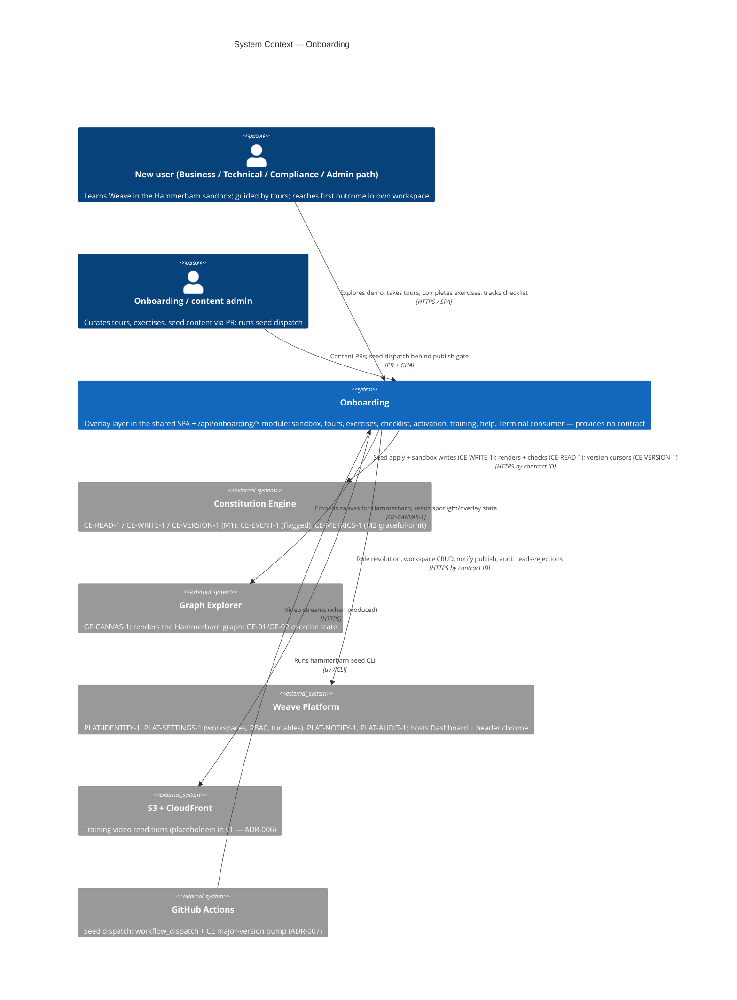
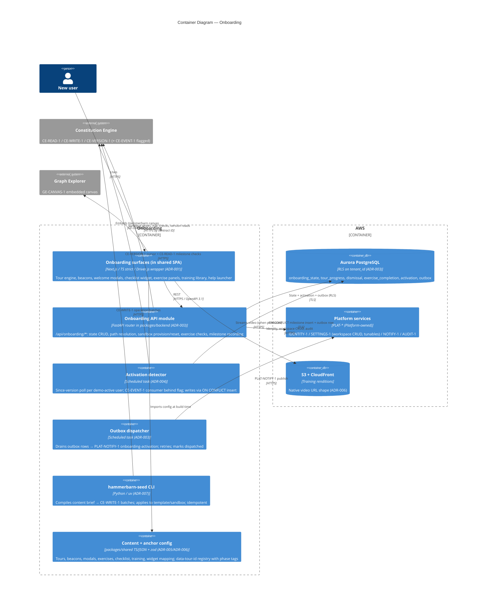
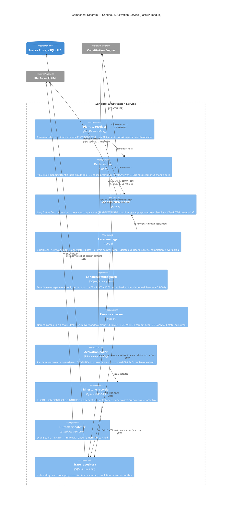

# Architecture: Onboarding

## Overview

Onboarding is the in-product guided-training layer: a brand-new user lands in a fully-modelled
example company (Hammerbarn), practises in a **per-user writable sandbox**, is guided by
role-tailored tours/beacons/modals overlaid on the live SPA, and is driven by a checklist to a
CE-grounded **activation milestone** in their own workspace. It is a **pure terminal consumer**:
it owns no graph data and exposes no inter-engine contract. Every graph interaction crosses CE
contracts (`CE-READ-1`, `CE-WRITE-1`, `CE-VERSION-1`; `CE-EVENT-1` behind a flag — ADR-004),
rendering crosses `GE-CANVAS-1`, and identity/state/notify/audit cross `PLAT-IDENTITY-1`,
`PLAT-SETTINGS-1`, `PLAT-NOTIFY-1`, `PLAT-AUDIT-1`.

Phase 1 (the **M1 window** — parallel work, not an M1 exit criterion) ships: the Hammerbarn
CE+Explorer demo (canonical template + per-user sandbox-as-workspace, ADR-002; seeded by the
live-pipeline CLI, ADR-007), 4-path role resolution (10→4 mapping via PLAT-IDENTITY-1), the tour
engine (Driver.js wrapper, ADR-001) with beacons and welcome modals anchored via the
`data-tour-id` registry (ADR-005), the CE/GE exercise set (CE-01/02/03/03b, GE-01/02) with
contract-signal completion checks, the Dashboard checklist with poll-first idempotent activation
(ADR-003/ADR-004), the training library (placeholders + written walkthroughs, S3+CloudFront URL
shape — ADR-006), and the persistent help launcher.

**Descoped from this slice (human decision, 2026-07-06): EPIC-008 Onboarding Analytics** — no
instrumentation pipeline, no analytics tables, no admin analytics dashboard are specced or
decomposed here. The M1 delivered-artefacts list is adjusted accordingly (the "role-segmented
analytics dashboard" exit artefact moves out with it). Also out-of-slice, noted not decomposed:
**post-v1** Build/Events demo areas, their tours and exercises (BE-01, AE-01) — feature-flagged
off, never broken/empty; **M2** legibility/trust overlays (model-completeness map tour, role-home
guidance, trust-mechanics tours) and the CE-METRICS-1-backed starter tile (graceful-omit until
CE M2).

The AI boundary is minimal: onboarding calls no model directly. NL exercises (CE-02, CE-03b)
forward the user's text to CE's `POST /api/query/nl` / chat surfaces — CE owns the model call and
the single SPARQL validator. Two-tier model policy is untouched (no haiku).

## C4 Model

### Level 1: System Context

Context notes: every arrow to another engine is a contract citation, never an invented endpoint.
Onboarding's only write path to graph data is CE-WRITE-1 under either the demo service principal
(fork/reset/seed) or the user's own principal (exercise writes) — there is no raw store access
anywhere in this engine.

### Level 2: Container

Container notes:

- **Onboarding surfaces** are overlay chrome inside the single Weave SPA — onboarding owns no
  primary navigation area; the help launcher lives in the platform-owned header, populated by
  this engine.
- **The API module is not a new service**: it is a router set inside the existing
  `packages/backend` FastAPI app, sharing its auth middleware, RLS session plumbing, and Alembic
  migration stream (ADR-003). The detector and outbox dispatcher are scheduled tasks of the same
  deployable — no new queue infrastructure exists in this slice (analytics descope removed the
  only queue candidate).
- **No RDF store in this engine's boundary** — the sandbox and canonical template are platform
  Workspace rows whose graphs live behind CE's rewriter (ADR-002); onboarding holds only
  workspace ids, batch semvers, and progress state.
- **Content + anchor config** is build-time input to the SPA and CI, not a runtime service.

### Level 3: Component — Sandbox & Activation Service (isolation + exactly-once path)

The API module's sandbox/activation core is the L3 target: it concentrates the architectural
risk — the three isolation boundaries, the blue/green reset known-state guarantee, poll-based
detection, and exactly-once activation all live here. The overlay surfaces are structurally
conventional config-driven React components.

Component notes: 10 components — inside the ≤ 12 cap. The `guard` component is deliberately shown
as *exercised, not implemented* here: the 403 + audit behaviour is CE/platform machinery
(workspace write permission), and onboarding's job is to ship the release-gate test that proves
it holds for the template workspace (ADR-002 boundary table). `recorder` is the only code path
that can create an activation row; the poller and any future CE-EVENT-1 consumer both route
through it, so exactly-once is a property of one insert statement, not of transport behaviour.

## Consumed-Contract Phase Map

The engine's availability posture per contract — binding on task DoR:

| Contract | Landed by M1 window? | M1-slice behaviour | Later behaviour |
|---|---|---|---|
| `CE-READ-1` / `CE-WRITE-1` / `CE-VERSION-1` | Yes (CE M1) | Seed apply, sandbox fork/reset, renders, ASK checks, poll cursors | unchanged |
| `GE-CANVAS-1` | Yes (Explorer M1) | Hammerbarn canvas render; GE-01/GE-02 state checks | unchanged |
| `PLAT-IDENTITY-1` / `PLAT-SETTINGS-1` / `PLAT-NOTIFY-1` / `PLAT-AUDIT-1` | Yes (Platform M1) | Role resolution, workspace CRUD + tunables, activation publish, 403 audit assertion | unchanged |
| `CE-EVENT-1` | No (transport unpinned) | NOT consumed; poll-first is the primary detector (ADR-004) | Event consumer behind flag when CE pins transport; poller stays as degrade |
| `CE-METRICS-1` | No (CE M2) | Business starter tile graceful-omitted via engine-availability tag | Tile activates at CE M2 |
| `BE-ARTEFACT-1` / `EA-AUTOMATION-1` / `PLAT-CONNECTOR-1` | No (post-v1) | Build/Automate demo areas, BE-01/AE-01 exercises, their tours: feature-flagged off, never broken/empty | Turn on at Build/Events GA (post-v1 slice) |
| Platform member-management signal (OQ-08) | Not contracted | Admin activation = manual self-mark + "pending platform signal" badge (Should Have) | Re-promote when Platform contracts the signal |

## Design Decisions

Adversarial critic pass run before writing this table; engine ADRs live in
[`../decisions/`](../decisions/).

| # | Decision | Rationale | Alternatives Rejected | Critic Challenge | Response |
|---|----------|-----------|----------------------|-----------------|---------|
| D1 | Spotlight mechanics from Driver.js; everything stateful in an owned wrapper (ADR-001) | The defect surface (masking, scroll, reposition) comes from a maintained MIT zero-dep library; tour state stays single-sourced | Intro.js (AGPL), Reactour (React-19 unproven), full in-house | "Can a library update or React churn break every tour?" | Driver.js is vanilla DOM (React-proof); the wrapper is the only coupling point and carries the a11y/token tests |
| D2 | Sandbox-as-workspace; seed batch is the unit of distribution; tenant-local canonical template (ADR-002) | Reuses the shipped Workspace + rewriter + CE-WRITE-1 machinery; no graph ever crosses a tenant boundary | Sandbox graph-suffix (needs CE changes), delta overlay, store-level COPY | "How does a global demo exist without a cross-tenant read?" | The batch artefact crosses tenants as content; each tenant materialises its own template; forks are same-tenant batch applications |
| D3 | State in onboarding-owned Aurora tables, fail-closed RLS, no new service (ADR-003) | One store for path/progress/dismissals/checklist/activation; same RLS pattern as CE/Events; localStorage banned by PRD | PLAT-SETTINGS-1 misuse; RDF (charter violation); new microservice | "Where is multi-tenancy enforced for onboarding's own data?" | RLS predicate NULLs to zero rows without session context; two-tenant test is a release gate |
| D4 | Activation exactly-once = DB unique constraint + transactional outbox (ADR-003) | Correctness rests on a constraint, not transport semantics; poll/event race is safe by construction | SQS FIFO dedup (5-min window); check-then-insert (racy) | "What stops a double toast/notify when poll and event both fire?" | Both route through one `ON CONFLICT DO NOTHING` insert; only the winning insert writes the outbox row; re-trigger test is a release gate |
| D5 | Poll-first detection on CE-VERSION-1/CE-READ-1; CE-EVENT-1 behind a flag (ADR-004) | CE-EVENT-1 transport is unpinned; the PRD's degrade path becomes the built, tested path | Build event consumer now (speculative); client-side detection (spoofable) | "Does anything in M1 silently require CE-EVENT-1?" | No — the Consumed-Contract Phase Map marks it not-consumed; the flag flips later without detection rework |
| D6 | `data-tour-id` registry with phase tags; CI audit; runtime skip+log (ADR-005) | Kills the top PRD risk (anchor drift) at PR time; phase tags make half-enabled areas impossible | CSS selectors; selector-fallback hybrid | "What happens when a feature team renames a screen?" | CI fails their PR (registry↔codebase diff); if drift ships anyway, the step skips with a warn log — never blocks |
| D7 | Content = code-shipped zod-validated config; video via S3+CloudFront URL shape (ADR-006) | Dead-CTA reconciliation and copy budgets become deterministic CI checks; no CMS built; no new vendor | DB-backed CMS; Wistia/Vimeo; defer video shape | "How does the content admin work without a CMS?" | Via PR — reviewed, versioned, gated; a CMS is a post-v1 decision if live editing is ever required |
| D8 | Seed = idempotent CLI emitting CE-WRITE-1 batches; HITL publish gate (ADR-007) | Live-pipeline by construction (decision E2); SHACL + PROV apply to every seed triple; re-runs converge | Static Turtle bulk-load (bypasses validation); standing seed service | "What if a re-seed fails halfway?" | Canonical update is atomic per the seed-lifecycle contract: failure leaves the previous version; sandboxes are unaffected until manual reset |
| D9 | EPIC-008 analytics deferred out of the M1 slice (human decision 2026-07-06) | Should-Have; descoping removes the only queue/pipeline infrastructure from the slice | Ship SQS→Lambda pipeline + tables now | "Does activation correctness depend on the dropped analytics?" | No — the PRD already required correctness independent of analytics freshness; the outbox carries PLAT-NOTIFY-1 only; OTel spans (ops telemetry) remain |
| D10 | Phase gating is architectural: Build/Events/Dashboard tours, BE-01/AE-01, CE-METRICS-1 tile ship flagged-off | The PRD's roadmap gates these; speccing them as available would fabricate dependencies | Build against unlanded contracts; hide areas silently | "Does the M1 demo render a broken Build tab?" | No — registry phase tags flag off all three overlay types + areas uniformly; "Coming soon" note is the only render |

## Invariants

All invariants are EARS-notated; each maps to at least one release-gate test
(testing-strategy.md §Release gates).

- **Per-user sandbox:** WHEN any sandbox read or write executes THE SYSTEM SHALL touch only the
  caller's own sandbox workspace graph; a user-A principal SHALL receive zero triples from and
  make zero writes to user-B's sandbox (ADR-002 boundary 1).
- **Canonical protection:** WHEN a non-content-admin identity issues a write against the
  canonical Hammerbarn template THE SYSTEM SHALL reject it 403 and record the attempt via
  PLAT-AUDIT-1 (ADR-002 boundary 2).
- **Cross-tenant zero-leak:** WHEN a sandbox query is issued without an explicit scope under a
  tenant-A / user-A JWT THE SYSTEM SHALL return zero tenant-B and zero other-user triples
  (PRD §2.4 pinned test; CE rewriter exercised end-to-end).
- **Known-state reset:** WHEN a reset runs THE SYSTEM SHALL leave the sandbox either fully reset
  to the latest canonical batch or unchanged — never partial; exercise completion flags SHALL be
  cleared on success; failure SHALL surface retry + error toast (E1-S2).
- **Exactly-once activation:** WHEN a milestone signal is recorded THE SYSTEM SHALL fire the
  toast, checklist auto-complete, and PLAT-NOTIFY-1 publish exactly once per
  `(tenant, user, milestone)`; re-triggering SHALL not double-fire; an unavailable engine SHALL
  leave the milestone locked, never mis-fired (FR-022).
- **Overlay resilience:** WHEN a tour step's or beacon's anchor element is absent or unmounts
  THE SYSTEM SHALL skip/hide it with a logged warning and SHALL never block the tour or orphan a
  tooltip; WHEN an area's engine has not shipped THE SYSTEM SHALL flag off all three overlay
  types and the demo area uniformly ("Coming soon" — never broken/empty) (FR-008, E1-S1).
- **Role-path totality:** WHEN a signed-in user's path resolves THE SYSTEM SHALL map canonical
  RBAC role(s) via PLAT-IDENTITY-1 (IdP-agnostic, never a raw Cognito group) to exactly one of 4
  paths per the 10→4 mapping; multi-role → choose prompt; zero-role/Viewer → Business read-only
  (FR-013/FR-014).
- **Server-side state:** WHEN onboarding state (path, resume point, dismissal, checklist,
  activation) is written THE SYSTEM SHALL persist it server-side per `(tenant, user)` with
  fail-closed RLS; localStorage SHALL only ever be a cache (PRD §2.4).
- **Accessibility:** WHEN any overlay (tour/beacon/modal/checklist/launcher) renders THE SYSTEM
  SHALL pass the WCAG 2.1 AA zero-violations axe gate and be fully keyboard-navigable; no overlay
  SHALL require interacting with the highlighted element to advance (NFR).
- **Copy + content integrity:** WHEN content config changes THE SYSTEM SHALL fail CI on a dead
  "Take a tour" CTA, an unregistered anchor reference, a missing phase/role tag, or a copy-budget
  breach (ADR-005/ADR-006); all user-facing strings SHALL be i18n keys.
- **Dev/prod parity:** WHEN running in the test environment THE SYSTEM SHALL use the in-process
  FastAPI app with in-memory Oxigraph, pytest-postgresql, and stubbed PLAT-* clients — no real
  cloud calls in tests (Plugin Law F).

## Quality Attributes

All numeric targets are defaults, tunable via PLAT-SETTINGS-1 (PRD decision E4 — no bare numbers).

| Attribute | Target | Scope / source | Measurement | Risk if missed |
|-----------|--------|----------------|-------------|----------------|
| Hammerbarn initial render (canvas + seed) | p95 ≤ 3 s | PRD §2.4 | E2E timing over seeded sandbox | First impression of the demo fails |
| Sandbox lazy fork (first access) | p95 ≤ 10 s | EPIC-001 seed-lifecycle | Integration timing, batch apply | User bounces at the demo door |
| Sandbox reset | ≤ 30 s | PRD decision E1 | Integration timing, blue/green swap | Reset feels broken; retry storms |
| Tour step transition | ≤ 200 ms | PRD §2.4 (unverified PO default) | Frontend perf test on wrapper | Tours feel sluggish |
| Training search | ≤ 300 ms | PRD §2.4 | Component perf test over config index | Library feels unresponsive |
| Activation detection latency | ≤ poll interval (default 60 s) | ADR-004 | Integration timing with seeded cursor | Celebration feels detached from the action |
| Accessibility (all overlays) | WCAG 2.1 AA, zero axe violations | PRD NFR (CI gate) | axe-core in E2E lane | CI accessibility gate fails |
| Lighthouse (demo + overlay surfaces) | Perf ≥ 90 · A11y ≥ 95 · BP ≥ 90 | house standard (CE/Events parity) | Lighthouse CI on PR | UX regression ships |
| Cross-tenant isolation | zero foreign triples/rows | PRD §2.4 (release gate) | Seeded two-tenant + two-user test | Contract-ending breach |
| Activation exactly-once | zero double-fires under re-trigger | FR-022 (release gate) | Re-trigger + race integration test | Metric pollution; duplicate notifies |
| Line/branch coverage | ≥ 80% (default, tunable) | roadmap exit criteria | pytest-cov / v8 in CI | Untested failure branches |
| Mutation coverage | ≥ 60% (default, tunable) | roadmap exit criteria | mutmut / Stryker on state/recorder/config-check modules | Silent regressions in idempotency logic |

---

*Generated by Weave arch-diagrams skill. Review and approve before task decomposition.*
