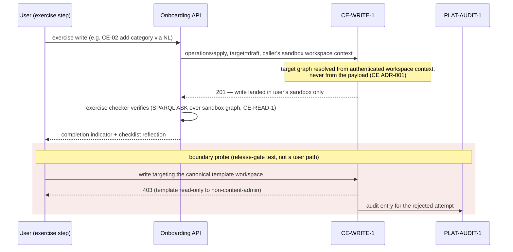
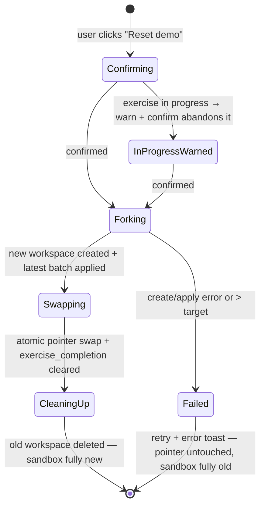
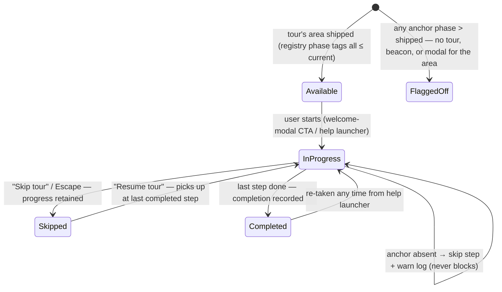
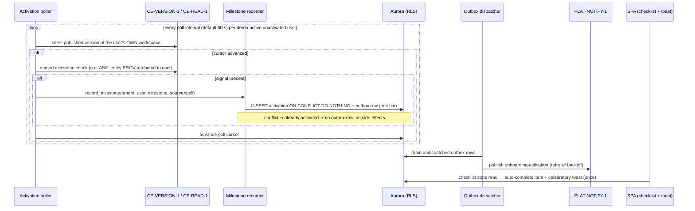

# Onboarding — Business Process (Phase 1)

## Overview

Six flows carry the M1 slice's behaviour. Three are security-load-bearing (sandbox fork, the
write boundary, reset) and map one-to-one onto the release-gate tests; two carry the product
loop (tour lifecycle, activation); one is operational (seed publish). Flows for the descoped
EPIC-008 analytics, the M2 legibility/trust overlays, and the post-v1 Build/Events content are
listed under Deferred — noted, not designed.

## First Sign-In → Path Resolution → Lazy Sandbox Fork

```mermaid
sequenceDiagram
    participant U as New user (SPA)
    participant API as Onboarding API
    participant ID as PLAT-IDENTITY-1
    participant WS as Platform workspace CRUD
    participant CE as CE-WRITE-1 / CE-READ-1

    U->>API: first sign-in (JWT)
    API->>ID: resolve canonical role(s)
    ID-->>API: role slugs (IdP-agnostic)
    alt multiple roles
        API-->>U: choose-path prompt (4 paths)
        U->>API: chosen path
    else zero roles / Viewer
        API->>API: default Business read-only variant
    end
    API->>API: upsert onboarding_state (role_path)
    U->>API: open "Hammerbarn Demo" (switcher entry)
    alt no sandbox yet (lazy fork)
        API->>WS: create sandbox workspace (demo service principal)
        API->>CE: apply pinned seed batch (target=draft) — ADR-007 path
        CE-->>API: 201 activity_iri (SHACL-validated, PROV-attributed)
        API->>API: set sandbox_workspace_id + batch semver (state row)
    end
    API-->>U: sandbox workspace ready ("Demo — fictional data" label, Practice-mode banner)
    U->>CE: render ontology/glossary/brand via CE-READ-1; canvas via GE-CANVAS-1
```

Notes: fork target ≤ 10 s p95 (first access only; subsequent opens hit the ≤ 3 s render NFR).
A fork failure leaves `sandbox_workspace_id` NULL and surfaces retry — the user never lands in a
half-seeded sandbox (the workspace is created and seeded before the pointer is set). Not-shipped
areas (Build/Automate) render feature-flagged off with "Coming soon" (registry phase tags,
ADR-005).

## Sandbox Write + Canonical 403 Boundary



The three isolation boundaries and their enforcement/tests are tabulated in ADR-002; the
cross-tenant zero-leak probe (tenant-A/user-A JWT, unscoped query ⇒ zero foreign triples) runs
in the same release-gate suite.

## Reset Demo (blue/green, known-state)



Invariant: the user's sandbox is **fully old or fully new, never partial** (E1-S2 failure mode).
The swap transaction clears `exercise_completion` (re-earnable) and updates
`sandbox_batch_semver`; `activation` rows are never touched (lifetime milestones, ADR-003).
Reset never auto-fires — explicit button + confirm only. Target ≤ 30 s (default, tunable).
Old-workspace deletion failure after a successful swap degrades to a logged orphan cleanup —
user-visible state is already correct. <!-- ponytail: orphan sweep is a log-and-retry job -->

## Tour Lifecycle (with absent-anchor resilience)



Keyboard: Tab/Arrow/Enter/Escape throughout; never time-limited; never requires interacting with
the highlighted element (E2-S1). Beacons follow a reduced version of the same machine
(visible → tooltip open → dismissed → restorable via "Show all hints"); a beacon whose target
unmounts while its tooltip is open hides both + logs (E2-S2).

## Activation Detection → Exactly-Once Fire



The future CE-EVENT-1 consumer (feature-flagged, ADR-004) calls the same
`record_milestone(…, source=event)` entry point — racing the poller is safe because exactly-once
is the insert's property. Admin milestone: no detector — manual self-mark writes
`source=manual` via the checklist UI ("pending platform signal" badge, OQ-08). Milestones whose
engine/signal is unavailable are locked and never evaluated (FR-022).

## Seed Publish Pipeline (canonical, HITL-gated)

```mermaid
sequenceDiagram
    participant CA as Content admin
    participant GHA as GitHub Actions
    participant CLI as hammerbarn-seed CLI
    participant CE as CE-READ-1 / CE-WRITE-1 / CE-VERSION-1
    participant HITL as Publish gate (content admin + Tech Lead)

    CA->>GHA: workflow_dispatch (or auto-trigger: CE ontology MAJOR bump)
    GHA->>CLI: compile (content brief → versioned op-batch artefact)
    CLI->>CE: validate kinds/relationships against GET /api/ontology/types
    CLI-->>GHA: hammerbarn-seed vX.Y.Z (reviewable artefact)
    GHA->>HITL: publish gate — approve promotion
    HITL-->>GHA: approved
    GHA->>CLI: apply to canonical template workspace (content-admin principal, target=draft)
    CLI->>CE: operations/apply batches (idempotent; dedup + idempotency keys)
    CE-->>CLI: 201 per batch (SHACL-validated) — else 422 halts, previous canonical intact
    CLI->>CE: publish version (CE-VERSION-1 semver)
```

Blast-radius rules from the EPIC-001 seed-lifecycle contract hold: failed re-seed leaves the
previous canonical version; per-user sandboxes are unaffected until they manually reset; minor/
patch ontology bumps trigger advisory review only.

## Degrade Contingencies

| Condition | Behaviour |
|---|---|
| CE-EVENT-1 transport never lands in window | Nothing changes — poll IS the primary detector (ADR-004) |
| CE unreachable during render | Demo areas show error/retry states; overlays that need no CE data still function |
| CE unreachable during poll | Poller skips the cycle; cursor unmoved; no mis-fire (locked milestones stay locked) |
| PLAT-NOTIFY-1 outage | Outbox rows accumulate + retry; toast/checklist unaffected (they read the activation row) |
| Video asset missing/failed | Placeholder/error card — never a broken player (ADR-006) |
| Anchor drift ships despite CI audit | Runtime skip + warn log; tour continues (ADR-005) |
| CE-METRICS-1 not yet live (until CE M2) | Business starter tile graceful-omitted via engine-availability tag (E3-S2) |

## Deferred (out of this slice)

- **EPIC-008 analytics flows** — event emission, durable analytics queue, admin dashboard,
  cohort aggregation (descoped 2026-07-06; PRD schema remains pinned for the future slice).
- **Post-v1 flows** — Build/Events/Dashboard tours turning on, BE-01/AE-01 exercises, full-seed
  publish including BE-ARTEFACT-1 + EA-AUTOMATION-1 portions, AE-01 Slack via PLAT-CONNECTOR-1.
- **M2 flows** — model-completeness map tour, "What can Weave do for you" role-home guidance,
  trust-mechanics overlays.
