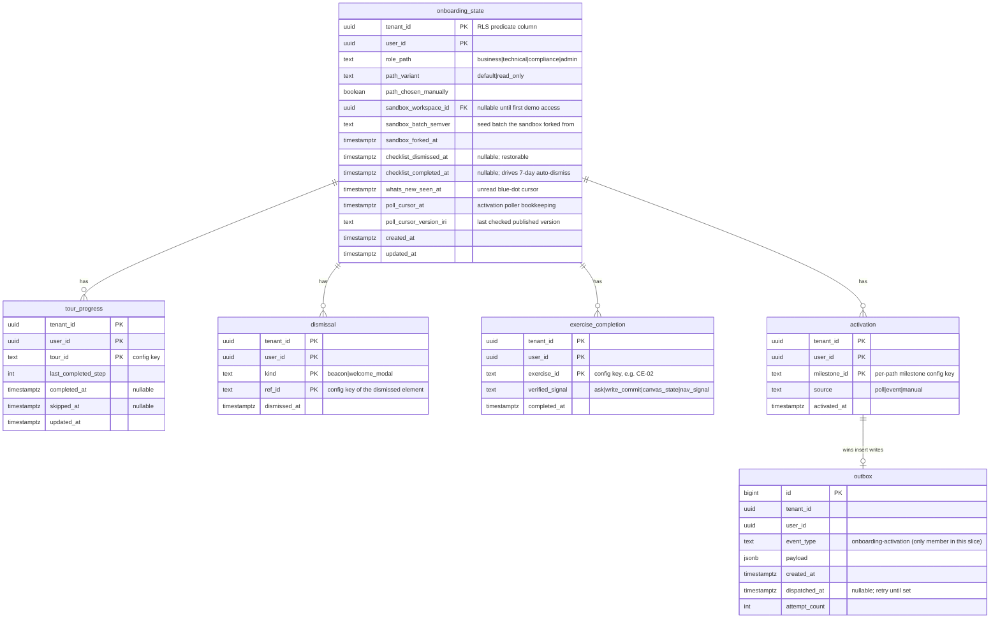

# Onboarding — Data Model (Phase 1)

## Overview

Onboarding owns two kinds of data and pointedly does **not** own a third:

1. **Per-user progress state** — relational rows in the existing Aurora PostgreSQL cluster,
   every table tenant-scoped with fail-closed RLS (ADR-003). This is the server-side
   `(tenant, user)` state the PRD mandates (path, resume points, dismissals, checklist,
   exercise completion, activation, outbox).
2. **Code-shipped content config** — zod-validated TS/JSON in `packages/shared` (ADR-006):
   tours, beacons, welcome modals, exercises, checklist definitions, training entries, What's-new
   items, the role→starter-widget mapping, and the anchor registry (ADR-005). Config is build-time
   data; it has schemas here because CI checks and the SPA both consume them typed.
3. **Graph data — none.** The Hammerbarn canonical template and every per-user sandbox are
   platform Workspace rows whose graphs live behind CE's rewriter (ADR-002). Onboarding stores
   workspace ids and seed-batch semvers, never triples.

**Not in this slice:** analytics event tables, cohort keys, or any instrumentation store —
EPIC-008 is deferred (human decision 2026-07-06). The PRD's analytics event schema remains pinned
in `onboarding.md` §E8 for the future slice; nothing here forecloses it.

## Relational Schema

### ER diagram



### Table notes

- **`onboarding_state`** is the one-row-per-`(tenant, user)` spine; every other table hangs off
  the same composite key. `sandbox_workspace_id` references the platform `workspace` table
  (loose FK — platform owns that table; onboarding treats it as an opaque id plus existence
  check). The blue/green reset swaps this pointer atomically (ADR-002 §4).
- **`tour_progress`** persists the server-side resume point (FR-009). "Skip" records
  `skipped_at` but keeps `last_completed_step`, so "Resume tour" picks up where the user left.
- **`dismissal`** covers beacons and welcome modals in one shape (same semantics: fire once,
  restorable). "Show all hints" deletes the user's `beacon` rows; welcome modals are never
  re-fired once dismissed (E2-S3).
- **`exercise_completion`** rows are deleted by reset (re-earnable, EPIC-004 epic AC).
  `verified_signal` records which named contract signal verified completion (FR-017) — this is
  audit-ish colour, not authorisation.
- **`activation`** is the exactly-once ledger (ADR-003): primary key
  `(tenant_id, user_id, milestone_id)`, written only via `INSERT … ON CONFLICT DO NOTHING` by
  the milestone recorder. Never deleted by reset — activation is a lifetime milestone.
  `source = manual` covers the Admin self-mark fallback (OQ-08).
- **`outbox`** rows are written in the same transaction as a winning activation insert and
  drained to PLAT-NOTIFY-1 by the dispatcher (retry with backoff; `dispatched_at` set on
  success). The in-app toast renders from the `activation` row, not the outbox, so notify
  outages never affect the celebration.

### Row-level security

Every table carries `tenant_id` and the same fail-closed policy pattern CE and Events use:

```sql
CREATE POLICY tenant_isolation ON onboarding_state
    USING (tenant_id = current_setting('app.tenant_id', true)::uuid);
-- No session context ⇒ current_setting returns NULL ⇒ predicate is NULL ⇒ zero rows.
```

User-level scoping (`user_id = caller`) is enforced in the application layer on every route —
RLS guards the tenant boundary; the router guards the user boundary. The two-tenant/two-user
zero-leak test is a release gate (testing-strategy.md).

### Index strategy

| Index | Table | Serves |
|---|---|---|
| PK `(tenant_id, user_id)` | onboarding_state | Every state read (one row per user) |
| PK `(tenant_id, user_id, tour_id)` | tour_progress | Resume-point lookup per tour |
| PK `(tenant_id, user_id, kind, ref_id)` | dismissal | Overlay render filter (bulk-loaded per screen) |
| PK `(tenant_id, user_id, exercise_id)` | exercise_completion | Checklist reflection + reset delete |
| PK `(tenant_id, user_id, milestone_id)` | activation | The exactly-once constraint itself |
| `(dispatched_at) WHERE dispatched_at IS NULL` | outbox | Dispatcher drain scan (partial index) |
| `(tenant_id) WHERE sandbox_workspace_id IS NOT NULL` | onboarding_state | Poller's demo-active-user scan |

Poller scan note: the activation poller selects demo-active users lacking a given milestone via
an anti-join on `activation` — at M1 cohort sizes this is a trivial partial-index scan; if
cohorts grow, add a `fully_activated_at` denormalised column to `onboarding_state`.
<!-- ponytail: anti-join scan; denormalise only when cohort size makes the poller measurable -->

## Content Config Schemas (packages/shared, zod)

Config is code (ADR-006); shapes are stated here because CI checks and the SPA consume them
typed. All copy fields are **i18n keys**. Illustrative TypeScript:

```typescript
// onboarding/anchors.ts (ADR-005)
export const ANCHORS = {
  "ce.entity-list": { engine: "constitution", area: "constitution", phase: "m1" },
  "ge.canvas.spotlight-control": { engine: "graph-explorer", area: "explorer", phase: "m1" },
  "build.project-list": { engine: "build", area: "build", phase: "post-v1" },
  // …
} as const satisfies Record<string, Anchor>;

type Anchor = { engine: EngineId; area: AreaId; phase: "m1" | "m2" | "post-v1" };

// onboarding/content/schema.ts (ADR-006) — zod, excerpted
const TourStep = z.object({
  anchorId: z.enum(anchorIds),          // registry keys only — unknown anchor is a compile+CI error
  titleKey: z.string(), bodyKey: z.string(),
});
const Tour = z.object({
  tourId: z.string(), area: z.enum(areaIds),
  paths: z.array(RolePath).nonempty(),  // role-tailoring tag
  steps: z.array(TourStep).min(1),      // authoring guideline 5–12, tunable — CI warns, not fails
});
const Exercise = z.object({
  exerciseId: z.string(),               // CE-01, CE-02, CE-03, CE-03b, GE-01, GE-02 in this slice
  paths: z.array(RolePath).nonempty(),  // CE-03 = technical only; CE-03b = business (FR-016)
  phase: Phase,
  goalKey: z.string(), stepKeys: z.array(z.string()).min(3).max(5),
  completion: z.discriminatedUnion("kind", [
    z.object({ kind: z.literal("sparql_ask"), ask: z.string() }),      // over sandbox graph, CE-READ-1
    z.object({ kind: z.literal("write_commit") }),                     // CE-WRITE-1 201 echo
    z.object({ kind: z.literal("canvas_state"), state: z.string() }),  // GE-CANVAS-1
    z.object({ kind: z.literal("nav_signal"), signal: z.string() }),   // UI nav completion (CE-01)
  ]),
});
const ChecklistItem = z.object({
  itemId: z.string(), paths: z.array(RolePath).nonempty(),
  labelKey: z.string(), whyKey: z.string(), deepLink: z.string(),
  autoCompleteOn: z.enum(["demo_visit", "tour_complete", "exercise_complete",
                          "activation_milestone", "manual"]),
  lockedUntilPhase: Phase.optional(),   // not-shipped engine ⇒ locked + prerequisite note
});
```

CI config tests (run on every content PR — ADR-006): dead-CTA reconciliation, copy budgets
(tour ≤ 40 words, beacon ≤ 60 — defaults, tunable constants beside the schema), anchor validity,
phase/role tag presence, and the both-ways `data-tour-id` codebase↔registry audit (ADR-005).

## Sandbox / Workspace Reference Model

Onboarding stores references; the platform and CE own the substance (ADR-002):

| Concept | Owner | Onboarding's handle |
|---|---|---|
| Canonical Hammerbarn template workspace (per tenant) | Platform workspace row; CE graphs `urn:weave:tenant:{tid}:ws:{template_id}` (+ `:v{semver}`) | Workspace id + published seed semver (config/settings) |
| Per-user sandbox workspace | Platform workspace row; CE draft graph under the same IRI scheme | `onboarding_state.sandbox_workspace_id` + `sandbox_batch_semver` |
| Seed batch artefact | `hammerbarn-seed` CLI output, repo-versioned (ADR-007) | Semver string; applied via CE-WRITE-1 |
| Write attribution | CE PROV-O (`prov:Person` for users; demo service principal for fork/reset/seed) | None — read back via CE-READ-1 for milestone checks |

## RDF / Semantic Touchpoints

- Onboarding never constructs SPARQL from user input: exercise NL text goes to CE's
  `POST /api/query/nl`; the raw-SPARQL exercise (CE-03, Technical-only) submits the user's query
  through CE-READ-1's single SELECT-only, `SERVICE`-blocked validator. The completion ASKs in
  config are static strings reviewed at PR time.
- Milestone checks lean on CE PROV attribution (e.g. "first committed entity whose PROV activity
  is attributed to this user's principal in their own workspace") — queried via CE-READ-1, never
  by reading the store.
- Hammerbarn content maps onto the 13 BPMO kinds served by `GET /api/ontology/types`; the seed
  compiler validates against that endpoint at compile time (ADR-007) — no hand-coded kind list
  exists in this engine (ontology-standards rule).

## Deferred (out of this slice)

- **EPIC-008 analytics store** — event tables, `anonymised_cohort_key` hashing, k-anonymity
  suppression, admin dashboard queries (schema stays pinned in the PRD for the future slice).
- **Post-v1:** BE-01/AE-01 exercise config entries (schema already admits them via `phase`),
  Build/Events tour content, PLAT-CONNECTOR-1 references.
- **M2:** CE-METRICS-1-backed starter-tile activation; model-completeness and role-home overlay
  content.
