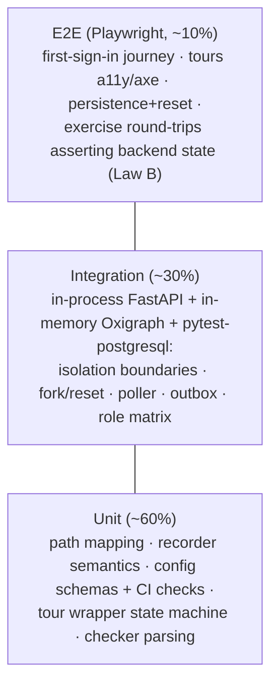

# Testing Strategy: Onboarding

## 1. Testing Pyramid Overview

Two structural advantages shape this pyramid. First, onboarding's backend lives **inside**
`packages/backend`, so integration tests run the onboarding router, CE-READ-1/CE-WRITE-1, and
the platform workspace machinery in one process against in-memory Oxigraph — the isolation
boundaries are tested against the *real* rewriter and permission checks, not mocks. Second,
content is code (ADR-006), so a whole class of cross-story defects (dead CTAs, half-enabled
areas, over-budget copy) are unit-level config tests, not E2E hunts.

Floors (roadmap exit criteria; defaults, tunable): line/branch coverage ≥ 80%; mutation ≥ 60%
(mutmut on Python, Stryker on TS), concentrated on the recorder, reset, path-mapping, and
config-check modules where a silent regression is costliest. No real cloud calls anywhere
(Plugin Law F).

## 2. Unit Test Strategy

### Python (onboarding API module, detector, seed CLI)

| Module | Must cover |
|---|---|
| Path resolver | 10→4 matrix totality (every canonical role slug maps; no unmapped role); multi-role → prompt; zero-role/Viewer → Business read-only; change-path; never reads a raw Cognito group (import-level assertion) |
| Milestone recorder | `ON CONFLICT DO NOTHING` semantics (winner writes outbox, loser writes nothing); source tagging poll/event/manual; locked milestone never evaluated |
| Reset manager | swap-transaction ordering (new ready → pointer swap → clear flags → delete old); failure at each step leaves pointer consistent |
| Activation poller | cursor advance detection; skip-on-CE-error without cursor move; stop condition (all milestones fired) |
| Exercise checker | each completion kind (`sparql_ask`/`write_commit`/`canvas_state`/`nav_signal`) parsed + dispatched; unknown kind rejected |
| Seed compiler (ADR-007) | content brief → op-batch determinism; kind validation against a stubbed `GET /api/ontology/types`; local `ref` resolution; idempotency-key assignment |

### TypeScript (overlay surfaces + config in packages/shared)

| Module | Must cover |
|---|---|
| Tour wrapper (`TourEngine`, ADR-001) | state machine (start/next/back/skip/resume/complete); absent-anchor skip + warn; keyboard bindings; resume-point round-trip against a stubbed state API; no advance-requires-interaction |
| Config CI checks (ADR-005/006) | dead-CTA reconciliation; copy budgets (40/60 words); anchor-registry validity both ways; phase/role tag presence — each check has a failing-fixture test |
| Beacon/modal components | dismissal persistence calls; "Show all hints" restore; unmount-while-open hides tooltip |
| Checklist widget | item states (todo/complete/locked+prereq note); 100% → celebration + relabel; deep-link rendering |
| Training library | search filter ≤ 300 ms over config index; placeholder/error card states; unread What's-new dot cursor |

## 3. Integration Test Strategy

### Infrastructure fakes

| Dependency | Fake | Fixture |
|---|---|---|
| RDF store | in-memory `pyoxigraph` Store behind the real CE routes (in-process app) | `app` fixture shared with CE tests |
| Postgres (RLS) | pytest-postgresql with real policies applied by Alembic | `db` fixture |
| PLAT-IDENTITY-1 / PLAT-NOTIFY-1 / PLAT-AUDIT-1 | stub clients recording calls (respx where HTTP) | `plat_stubs` |
| Scheduled tasks | invoked directly (poller/dispatcher functions), no scheduler in tests | — |
| S3/CloudFront | none needed — placeholders only in this slice | — |

### Release gates (the suite that blocks Gate 1)

| Gate test | Asserts | Source |
|---|---|---|
| `test_sandbox_per_user_isolation` | user-A token: zero triples from + 403 writes to user-B's sandbox | ADR-002 boundary 1 |
| `test_canonical_write_403_audited` | non-content-admin write to template ⇒ 403 AND a PLAT-AUDIT-1 entry recorded | ADR-002 boundary 2 / roadmap exit |
| `test_cross_tenant_zero_leak` | tenant-A/user-A JWT, unscoped sandbox query ⇒ zero tenant-B and zero other-user triples | PRD §2.4 pinned test |
| `test_activation_exactly_once` | concurrent + repeated `record_milestone` (poll/event/manual mix) ⇒ one activation row, one outbox row, one notify | FR-022 / ADR-003 |
| `test_reset_known_state` | induced failure at each reset step ⇒ sandbox fully old or fully new; success clears exercise flags, preserves activation | E1-S2 / ADR-002 §4 |
| `test_rls_fail_closed` | no session context ⇒ zero rows on every onboarding table | ADR-003 |
| `test_area_phase_flagging` | post-v1 area: no tour, beacon, or modal AND demo tab renders "Coming soon" — uniformly | EPIC-002 epic AC |

### Must also cover

- Lazy fork: first demo access creates workspace + applies batch + sets pointer; second access
  reuses; fork failure leaves pointer NULL + retryable.
- Seed CLI idempotency: apply twice ⇒ converged graph (dedup), no duplicate nodes.
- Poller: seeded version bump + PROV-attributed entity ⇒ milestone fires; CE outage cycle ⇒ no
  cursor move, no fire.
- Outbox: notify failure ⇒ retry with backoff; success sets `dispatched_at` exactly once.
- Role matrix: parameterised over all 10 canonical roles + multi-role + zero-role (roadmap exit
  criterion "role-resolution test matrix").

### Must NOT

- No real AWS calls, no real Cognito, no network egress (Law F).
- No store-level graph access from any onboarding test helper — helpers go through CE routes,
  same as production code.
- No sleeping to "wait" for the poller — invoke it.

## 4. E2E Test Strategy (Playwright)

Runs against the dev stack (in-process backend + dockerised Oxigraph), Page Object Model,
`@axe-core/playwright` in every overlay spec.

| Spec | Journey | Backend-state assertion (Law B) |
|---|---|---|
| `first-sign-in.spec` | new user → path prompt/default → switcher shows "Hammerbarn Demo" → sandbox renders seed, Practice-mode banner, "Demo — fictional data" label; Build/Automate flagged off | `onboarding_state` row: path + sandbox pointer set |
| `tour.spec` | start CE tour → keyboard through steps → skip → resume from launcher → complete; axe zero-violations per step | `tour_progress` resume point + completion row |
| `persistence-reset.spec` | edit sandbox (CE-02 via NL) → sign out/in → edit persists → Reset demo → canonical restored ≤ target, exercise re-earnable | sandbox graph state via CE-READ-1 ASK; `exercise_completion` cleared; `activation` retained |
| `exercise.spec` | Business path: CE-03b NL query completes (never raw SPARQL); Technical: CE-03 SPARQL completes; GE-01 spotlight check | completion rows with correct `verified_signal` |
| `activation.spec` | first entity committed in OWN workspace → checklist item auto-completes + toast fires once; re-trigger ⇒ no second toast | single `activation` row; single outbox dispatch |
| `help-launcher.spec` | Shift+? opens; every entry resolves (tours list, hints restore, training, What's new, checklist restore, change path); Escape closes; axe pass | dismissal/state rows round-trip |

Lighthouse CI on the demo + overlay surfaces: Perf ≥ 90 · A11y ≥ 95 · BP ≥ 90 (house standard).

## 5. Test Data Management

- **One canonical fixture:** the compiled `hammerbarn-seed` batch artefact itself (ADR-007) is
  the test seed — tests exercise the exact content users get; no parallel fixture drifts.
- Two-tenant/two-user seeds for the isolation suite are minimal synthetic batches (a handful of
  nodes), not full Hammerbarn — fast, and foreign-triple assertions stay unambiguous.
- Config fixtures: known-bad content files (dead CTA, over-budget copy, unknown anchor) live
  beside the CI checks as failing fixtures.
- All principals are stub identities minted per test via the PLAT-IDENTITY-1 stub; no shared
  mutable state between tests (fixtures per test function).

## 6. Performance Checks

| Check | Budget (default, tunable) | Where |
|---|---|---|
| Sandbox fork (batch apply, seed-scale) | ≤ 10 s p95 | integration timing over in-memory store + CI trend |
| Reset (blue/green) | ≤ 30 s | integration timing |
| Hammerbarn initial render | ≤ 3 s p95 | E2E timing (seeded sandbox) |
| Tour step transition | ≤ 200 ms | frontend perf test on wrapper |
| Training search | ≤ 300 ms | component perf test |

In-memory timings under-approximate prod store latency; the pre-AWS-deploy gate re-runs fork/
reset/render timings against the dev-AWS smoke environment (dev-environment.md §4) before any
deploy sign-off.

## Deferred (out of this slice)

EPIC-008 analytics tests (event delivery, durable-queue retry, k-anonymity suppression, no-PII
cohort export) travel with the deferred epic. Post-v1: BE-01/AE-01 completion checks,
Build/Events tour specs, AE-01 Slack egress security re-review. M2: CE-METRICS-1 tile
activation test flips from graceful-omit to present.
