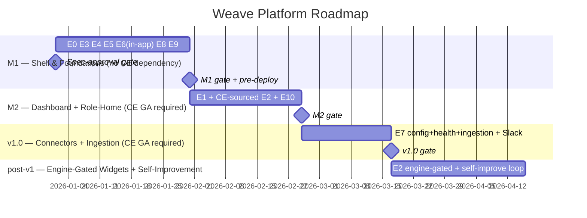

# Weave Platform Shell

> The Weave Platform is the application **shell** (not an engine): the multi-tenant SPA, navigation,
> workspace/tenancy, auth (Cognito/Auth0), Bedrock model routing, and the cross-cutting services every
> engine depends on. It owns the **six PLAT-\* contracts** (`PLAT-AUDIT-1`, `PLAT-NOTIFY-1`,
> `PLAT-IDENTITY-1`, `PLAT-CONNECTOR-1`, `PLAT-SETTINGS-1`, `PLAT-BILLING-1`). **M1** ships the shell,
> foundations, and immutable audit (no upstream engine dependency). **M2** adds the Generative Dashboard
> (once CE is GA) and the role-tailored "What can Weave do for you?" home. **Post-v1:** Weave-product
> self-improvement loop (signal → issue → dispatch). It is **#1 in the build order** — the shell the
> whole model → generate → automate loop runs in. See `../weave-spec.md` and `../contracts.md`.

<!-- SHARED-HOISTED: positioning/Laws/MVP success criterion are program-level — see ../weave-spec.md §Program -->

## 1. Brief

### Mission Statement

We are building Weave — the operating system for the AI-native company — so that an enterprise or
mid-market organisation can describe its entire operating model (people, processes, systems, data,
rules, relationships) as a single live, collaborative knowledge graph, and have Weave generate and run
the applications, AI agents, data pipelines, and automations that operate the business — closing the
model → generate → automate loop.

Weave is a living **digital twin of the organization (DTO)** — the analyst-sanctioned convergence label
(Gartner) for a graph that mirrors how a company actually operates. This is deliberately distinct from a
*physical/industrial* digital twin (Azure Digital Twins, Microsoft Fabric Digital Twin Builder), which
models assets, IoT, and sensor telemetry; Weave models the operating model — people, processes, systems,
data, rules, relationships.

The defensible position is **the conjunction**: closing the loop on **open W3C standards** (versus
Palantir Foundry, which closes it behind a proprietary object model at enterprise prices), at
**mid-market reach**, with **whole-business NL + forms authoring** over a shipped ontology. The
open-standards substrate is necessary but commoditising — Ardoq's 2026 GraphLake acquisition brought
RDF/OWL/SHACL to an EA incumbent — so the durable moat is the generation/automation closure and the
"business brain" that grounds agents, not the triple store.

### Problem

A company's operating model — how its people, processes, systems, data, and rules actually fit together —
lives scattered across stale architecture diagrams, Confluence pages, spreadsheets, CMDBs, and individual
employees' heads. None of it is machine-readable, none of it is executable, and all of it drifts out of
date the moment it is written down.

This leaves three categories of mainstream tooling that each solve only one third of the problem:

- **Enterprise-architecture / EA tools** (LeanIX, ServiceNow CMDB, Visio) *describe* the business but
  generate nothing — the model is documentation, not an execution engine.
- **Low-code / app builders** *generate* software but have no authoritative model of the business, so
  every app is built from scratch against tribal knowledge.
- **BI / analytics tools** *report* on the business but cannot act on it.

One vendor — Palantir Foundry — does close model → generate → automate, but behind a proprietary object
model, at enterprise-only pricing, with no path for business users to author the model on open standards.
Weave's opening is the same closure made open (W3C RDF/OWL/SHACL/PROV-O), whole-business, and authorable
by non-technical staff at mid-market reach.

The people who feel this most acutely are **operations and transformation teams** (who own how the
company runs but have no single source of truth) and **CTOs, architects, and engineers** (who are asked
to "make the company AI-native" but have no machine-readable model for agents, pipelines, or apps to
build on).

If this is not solved, AI transformation stalls at the proof-of-concept stage: every automation is
bespoke and brittle, the operating model rots faster than it can be maintained, and the gap between how a
company is *described* and how it actually *runs* never closes — so the promised value of AI agents
(running real business processes) is never realised at scale.

### Vision

Within 12 months of launch, success looks like:

- **One graph of record.** A real client has modelled a meaningful slice of their company in Weave —
  typed entities (people, processes, systems, data, rules, capabilities) and their relationships — as a
  single live graph that business and technical users edit together, and which they trust enough to
  retire at least one legacy source of truth (a CMDB export, an architecture wiki, or a spreadsheet
  register).
- **The loop closes at least once, for real.** From that graph, Weave generates and runs at least one
  working artefact — an application, an AI agent, or a data pipeline — that operates a genuine business
  process, not a demo.
- **Business users edit without code.** Operations and transformation staff add and change graph content
  through natural language and guided forms, with no RDF or SPARQL knowledge required, while the
  underlying model stays standards-compliant and validated.
- **The model stays alive.** Changes to the graph and relevant external events (a new Jira ticket, a CMDB
  sync, a webhook) propagate through Weave automatically, so the model reflects reality instead of
  drifting from it.
- **A repeatable engagement motion.** The workshop methodology has taken at least one client from blank
  slate to populated graph, proving Weave is sellable as a guided engagement, not just a tool licence.

### Scope

Weave is delivered as four engines on a shared multi-tenant platform. Each engine has its own brief; this
platform brief owns only the cross-cutting whole and the boundaries between engines.

#### In Scope

- **Constitution Engine** *(ships first / MVP)* — the ontology and knowledge-graph layer
  (RDF/OWL/SHACL/SPARQL/PROV); the live model of the business. Ships a process-centric ArchiMate-3-aligned
  **upper ontology — the BPMO framework** (Process at the centre, linked to the activities, events,
  actors, systems, services, data assets, capabilities, domains, goals, and governing policies that make
  the graph a "business brain" agents reason inside), plus W3C SHACL/PROV/SKOS scaffolding — a *framework,
  not a populated taxonomy*: "Weave provides the grammar; the company writes the sentences." Clients build
  their own domain vocabulary and instances on top. The canonical BPMO kind and relationship set is
  defined in the `constitution-engine` brief and `CE-READ-1`.
- **Build Engine** — generates applications (UI + API), AI agents, data pipelines, and forms/dashboards
  from the graph model.
- **Events & Actions Engine** — automations triggered by internal graph changes and external events
  (webhooks, Jira, cron, ServiceNow).
- **Graph Explorer** — visualises the company as a force-directed network with drill-in focus views. M1
  ships single-user editing plus async sharing (server-side saved views + comments); Figma-style
  real-time multi-user collaboration (Yjs co-edit, presence, cursors, follow-me) is **post-v1**.
- **Shared platform foundation** — multi-tenant cloud SaaS (tenant isolation enforced at the storage layer
  — named-graph-per-tenant with query-rewriting that rejects unscoped queries, or store-per-tenant; final
  mechanism set in the Constitution Engine tech spec), authentication/authorisation, a single
  agent-identity registry, the AI-native layer used across engines (NL editing, generation, suggestions),
  and **7 managed connectors** (deferred to v1.0 — post-MVP): Snowflake, Databricks, AWS, Azure Data
  Lake, Atlassian (Jira + Confluence — one OAuth family), ServiceNow, and Slack. The MVP delivers its
  value without external integrations; connectors are the extended value and land at v1.0. <!-- SHARED-HOISTED: connector list canonical at ../contracts.md PLAT-CONNECTOR-1 -->
- **Engagement layer** — the workshop methodology packaged as a repeatable product and GTM motion.

#### Out of Scope

- **No open-source / self-hosted community edition** — Weave is fully commercial, closed source; no OSS
  core.
- **No single-tenant or on-premise deployment in v1** — multi-tenant cloud SaaS only.
- **Not a replacement for system-of-record tools** — Weave augments ServiceNow, Jira, Confluence, LeanIX,
  and data warehouses via connectors; it does not replace them.
- **No micro-frontend architecture** — a single modular React SPA, not independently deployed MFEs.
- **No non-business / non-enterprise domains** — Weave models how companies operate; it is not a
  general-purpose knowledge-graph or personal-knowledge tool.
- **No multi-cloud in v1** — AWS only (see Constraints).

### Target Users

The adoption arc runs ops-first, then technical: operations teams populate and trust the graph,
leadership governs and funds, then architects and engineers build on top.

| User Type | Description | Primary Need |
|-----------|-------------|--------------|
| Operations / transformation lead | Owns how the company runs; first adopter and day-to-day driver of the graph | A single trusted, editable source of truth for the operating model, maintainable without code |
| CTO / board sponsor | Funds and governs the initiative; accountable for AI-native transformation | Confidence that the model is authoritative and that it produces real, governed automation |
| Enterprise architect | Extends the universal ontology to the client's domain; designs the model | Standards-compliant (OWL/SHACL) modelling power with reasoning and validation |
| Engineer / developer | Builds applications, agents, and pipelines from the graph via the Build Engine | Reliable, portable code generation grounded in an authoritative model, not tribal knowledge |
| Business analyst / ops manager | Edits and queries graph content day to day | Natural-language and guided-form editing with no RDF/SPARQL knowledge required |

### Success Criteria

- [ ] **The loop closes for one real client** — one paying client models a meaningful slice of their
  company in Weave AND Weave generates one working artefact (app, agent, or pipeline) that runs a genuine
  business process. Measured by a signed client plus a demonstrable artefact in production-like use;
  source: client engagement record. Target: within 6 months of MVP (Constitution Engine) launch.
- [ ] **Non-technical editing is real** — at least one business-role user (no RDF/SPARQL knowledge)
  creates and edits graph entities via natural language and guided forms, with every change validated
  against SHACL. Measured via editor session telemetry; source: application analytics. Target: 30 days
  after the graph editor reaches GA.
- [ ] **A legacy source of truth is retired** — the pilot client decommissions or formally supersedes at
  least one prior source of truth (CMDB export, architecture wiki, or register) with the Weave graph.
  Measured by client sign-off; source: engagement record. Target: within 12 months of MVP launch.
- [ ] **The engagement motion is repeatable** — the workshop methodology takes at least one client from
  blank slate to populated graph end to end. Measured by a completed engagement; source: engagement
  record. Target: within 12 months of MVP launch.
- [ ] **First commercial validation** — at least one paid annual contract is signed for the Weave platform
  (pricing model per Key Decisions). Measured by signed contract; source: CRM. Target: within 12 months
  of MVP launch.

### Constraints

**Technical**

- AWS only in v1 — no multi-cloud (Cognito/Auth0 auth, Bedrock AgentCore + Anthropic models, Aurora
  PostgreSQL, S3 Vectors, Lambda/Fargate compute).
- Full W3C semantic web stack is mandatory, not optional: RDF/OWL 2 DL, SHACL validation, SPARQL 1.1,
  PROV-O provenance, Turtle serialisation. <!-- SHARED-HOISTED: full stack list — see ../weave-spec.md §Shared foundations (Stack) -->
- Single modular React SPA (Next.js 15, TypeScript strict) — no micro-frontends.
- The M1 launch ships single-user editing + async sharing. Real-time conflict-free multi-user
  collaboration (Yjs CRDT co-editing) is a Graph-Explorer **post-v1** capability, delivered at Graph
  Explorer realtime launch — NOT at the M1 launch.
- RDF store is Oxigraph for dev/test; the production store (Neptune vs Jena Fuseki) is deferred to the
  Constitution Engine tech spec.

**Business**

- Fully commercial, closed source — no open-source core, no community edition.
- Multi-tenant cloud SaaS with logical isolation per tenant; no on-prem/single-tenant in v1.
- Two revenue lines: platform SaaS subscription plus a paid consulting/workshop engagement arm.
- Target market is enterprise (500+ staff) and mid-market (50–500); the product must serve both tiers.

**Timeline / sequencing**

- The Constitution Engine ships first; the Build, Events & Actions, and Graph Explorer engines depend on
  it and cannot precede it.
- All success criteria are anchored to the MVP (Constitution Engine) launch; a fixed calendar launch date
  is not yet set.

### Key Decisions

For the full master list of confirmed architecture decisions, see `CLAUDE.md § Architecture decisions
(confirmed)`. Decisions most material to the platform brief:

| Decision | Rationale | Date |
|----------|-----------|------|
| Constitution Engine ships first as the MVP | The graph is the foundation every other engine reads from; nothing generates or automates without it | 2026-06-24 |
| Full W3C semantic web stack (RDF/OWL/SHACL/SPARQL/PROV) | Maximum reasoning, validation, interoperability, and linked-data portability; the graph must be authoritative, not decorative | 2026-06-24 |
| Single modular React SPA, not micro-frontends | Simpler to start; can extract MFEs later if scale demands | 2026-06-24 |
| Multi-tenant cloud SaaS, AWS-only in v1 | Shared infrastructure with logical isolation; focus over multi-cloud breadth | 2026-06-24 |
| Real-time multi-user collaboration is Phase 2 (Graph Explorer) | MVP ships single-user editing + async sharing (saved views + comments); Yjs co-editing is the costliest, hosting/identity-dependent capability and is sequenced after the Constitution MVP (D1) | 2026-06-30 |
| Weave ships a process-centric upper ontology (framework, not taxonomy); clients build their own vocabulary on top | The ArchiMate-3-aligned **BPMO framework** — Process at the centre, linked to activities, events, actors, systems, services, data assets, capabilities, domains, goals, and policies, plus SHACL/PROV/SKOS scaffolding; "Weave provides the grammar; the company writes the sentences" (A1). Canonical kind/relationship set: `constitution-engine` brief + `CE-READ-1` | 2026-06-30 |
| Fully commercial, closed source | No OSS core; protect the platform IP and the engagement business | 2026-06-24 |
| Pricing: hybrid — workspace-tier subscription + usage on generation/automation | Avoids per-seat friction so the graph spreads org-wide (ops-first), while capturing value where it is created (Build Engine generations, agent/automation runs) | 2026-06-26 |
| Differentiate on loop-closure + authoring + the "business brain", NOT on the semantic substrate | RDF/OWL/SHACL/SPARQL are commodity (mature triple stores plus open source); storage and standards conformance are not a moat. The defensible value is generation/automation closure, whole-business NL+forms authoring over a shipped ontology, and the business brain that grounds agents within the model's bounds | 2026-06-30 |

#### Competitive landscape & closing window

The market is converging on Weave's thesis from several directions, so the open-standards wedge is real
but time-limited. Three signals frame the moat:

- **Ardoq GraphLake (2026)** — an EA incumbent acquired an RDF/OWL/SHACL graph stack, bringing the full
  W3C substrate to enterprise architecture. The semantic substrate is commoditising; it cannot be the
  differentiator.
- **Microsoft Fabric Digital Twin Builder** — reaches data-bound modelling plus dashboards, Q&A agents,
  and automation, but is *industrial/asset*-scoped and non-W3C. The risk is Microsoft generalising it from
  industrial to whole-organization with its distribution reach.
- **Catio** — demonstrates AI auto-discovery of the (tech-stack) model beating manual EA authoring,
  raising the bar on cold-start population.

**Moat thesis:** differentiate on (1) generation/automation *closure* on open standards — the column no
mainstream EA, BI, or governance tool fills; (2) whole-business **NL + forms authoring** over a shipped
ontology; and (3) the **business brain** that grounds agents so they reason within the bounds the model
states. Do not position on the triple store, and do not claim incumbents lack process mining — Palantir
Foundry (Machinery) and Celonis (OCDM) both do process mining, so that claim is falsifiable.

### Navigation

First-draft information architecture for the Weave SPA. This section owns the **primary navigation** (top
header bar, company-workspace level) and the global app chrome; each engine's brief owns its own
**secondary navigation** (left sidebar). Pattern follows the validated app-shell convention: a top bar for
global context plus a left sidebar for within-area navigation.

#### App shell

- **Top header bar — primary navigation + global chrome.** Persistent across the app.
  - Left: Weave home, and the **workspace switcher** (the company/tenant, plus the demo "Hammerbarn"
    workspace). A regular user sees only their own workspace here; a **Weave super admin** sees the
    workspaces they operate plus an **"Add workspace"** button that opens the create-workspace +
    first-admin modal (FR-045/FR-046).
  - Centre: the **primary navigation** (top-level areas, below).
  - Right: **global search**, **notifications**, **help & guided-tour launcher** (onboarding), and the
    **account/user menu**.
- **Left sidebar — secondary navigation.** Contextual to the active primary area; each engine defines its
  own. Collapsible (icons + hover tooltips when collapsed), current item highlighted, collapse preference
  persisted.
- **Main content area.** The active screen.

#### Primary navigation (top header)

| Area | Engine / scope | Purpose |
|---|---|---|
| Dashboard | platform | Home — generative workspace intelligence; AI-composed widgets on demand |
| Constitution | constitution-engine | The model — ontology, glossary, brand, governance, org chart, versions |
| Explorer | graph-explorer | Visual, collaborative graph canvas |
| Build | build-engine | Projects — spec → generate → ship |
| Automate | events-actions-engine | Event-driven automations |
| Compliance | cross-cutting | Conformance checks + audit / decision logs |
| Settings | platform | Workspace, members, integrations, billing |

> Note: 3–6 primary items is the UX sweet spot. **Resolved at PRD:** Compliance stays a top-level,
> platform-owned cross-cutting area that aggregates per-engine compliance views, and **Audit is a sub-view
> under Compliance** (not a separate top-level area). Areas whose engine is not yet GA
> (Explorer/Build/Automate at the Constitution MVP) render disabled rather than hidden, keeping the IA
> stable.

#### Generative Dashboard

The Dashboard is a **generative UI** surface — a design pattern in which the AI dynamically composes and
renders UI widgets in response to natural-language prompts, rather than serving a fixed pre-built layout.
The user asks what they want to see; the AI fetches the relevant data from the appropriate engine and
renders the best-fit component (KPI card, time-series chart, table, activity feed, heatmap, etc.) directly
in the dashboard grid.

**What makes it different from a conventional dashboard:**

- There is no "dashboard configuration" form. The user types a prompt and a widget appears.
- Widgets are data-live: they query engine APIs at render time (and optionally poll for updates).
- The AI chooses the appropriate visualisation for the data — a compliance contravention count becomes a
  severity-bucketed bar chart; a token-spend trend becomes a line chart; a list of active proposals
  renders as a ranked card stack.
- Generated widgets are saveable and shareable: once a user creates a useful widget, they pin it to their
  dashboard and can publish it to a workspace-shared library.
- The default dashboard ships with a set of pre-built "starter widgets" (below) so the screen is not blank
  on first load; users customise from there.

**Available data sources (widget library — phase-gated by engine availability):**

> A widget category is buildable only once its source engine is live. At the Constitution-Engine MVP, only
> Constitution-sourced widgets (via the `CE-METRICS-1` contract) are available; Build/Events/Explorer-
> sourced categories are tagged "available when their engine ships" and render an explicit unavailable
> state until then. See the platform PRD §Epic 2 for the per-category phasing.

| Category | Widget examples |
|---|---|
| Ontology health | Entity counts by kind (spanning the BPMO kinds, via `entity_count_by_kind`), latest published version, draft vs published delta, SHACL validation error count |
| Graph completeness | Model coverage % (domains/capabilities/systems populated vs blank), knowledge gaps (entities missing required properties), unmapped instance count |
| Token & AI spend | Usage by engine / user / project, cost trend (7d/30d), budget burn vs cap, per-engine cost breakdown |
| Active projects | Project count by phase, recent activity, budget burn, artefacts shipped, success/failure rate |
| Compliance status | Active SHACL contraventions by severity and domain, policy coverage gaps, self-audit query results |
| Ontology & project issues | Validation warnings, unsatisfiable OWL classes, entities with no owner, version pin mismatches |
| Event automation status | Running automations, recent trigger counts, failure rates, connector health (the 7 connectors: Snowflake, Databricks, AWS, Azure Data Lake, Atlassian, ServiceNow, Slack — connectors ship at v1.0) |
| Collaboration activity | Active canvas sessions, recent graph edits, top contributors, workshop sessions logged |
| Operational health | Error rate, retry rate, agent-failure rate by engine — sourced from `PLAT-AUDIT-1` (`event_type` + `engine` dimensions) and `CE-METRICS-1` (`shacl_errors_by_severity`); a spike beyond a configurable threshold fires an alert-banner widget |
| Agent activity | What AI agents are doing right now across all engines (Build, Automate, Explorer) |
| Version pinning | Which Build projects and Automations are pinned to which ontology versions; alert if pinned to a version ≥ 2 behind latest |
| RBAC & access | Roles assigned vs unassigned users, any areas with no assigned owner, recent permission changes |
| Graph growth | Entity and relationship count over time — is the model being actively maintained or drifting stagnant? |
| Workspace onboarding | For new workspaces: model completeness score and next recommended action |

#### Global chrome elements

- **Workspace switcher** — company tenant plus the Hammerbarn demo workspace (a **per-user writable** copy
  that persists changes across sessions and resets only on an explicit button; its seed content is
  **live-pipeline built** via CE/Build/Events, with the CE+Explorer portion available at MVP and the full
  demo gated on Build/Events GA — see the `onboarding` brief). For a **Weave super admin** the switcher
  also lists every workspace they operate and carries an **"Add workspace"** button (create workspace +
  first admin user, FR-045/FR-046); a regular user sees only their own workspace.
- **Global search** — across entities, automations, projects, and docs.
- **Notifications** — budget alerts, approvals, automation outcomes.
- **Help & guided-tour launcher** — onboarding overlays, tours, and the training library (see the
  `onboarding` brief).
- **Account/user menu** — profile, roles, sign-out.

#### Secondary navigation

Each engine's left-sidebar secondary navigation is defined in its own brief's Navigation section:
`constitution-engine`, `graph-explorer`, `build-engine`, `events-actions-engine`.

### Roles & Access

First-draft model of the canonical roles and the access model, covering **both human and non-human (agent)
identities**. Referenced by the `onboarding` brief (role-tailored onboarding) and by each engine. The
detailed permission matrix is refined at PRD / tech spec.

#### Canonical human roles — 10 in-tenant roles + Weave super admin (out-of-band, platform operator)

| Role | Primary access |
|---|---|
| **Weave super admin (platform operator)** | Weave-operator identity **outside any single tenant's RBAC**: create workspaces via the UI, create each workspace's initial workspace-admin user, and navigate between workspaces via the header switcher's "Add workspace" flow. Provisioning only — it does not read tenant business data. (Distinct from the post-v1 *self-improvement* operator.) |
| Workspace admin / owner | Full control **within their workspace**: settings, members & roles, integrations, billing, and all engines |
| Enterprise architect | Author ontology structure, types, and rules; full model read; build and explore |
| Business analyst / SME | Author instance data and glossary; explore; limited structural change |
| Data steward / data engineer | Author schemas, column descriptions, glossaries, data rules, and classification content as instance + glossary data; propose data-quality SHACL shapes for architect/compliance review; read the model and explore. Data domain. |
| Brand / content owner | Author brand and voice content; read the model |
| Compliance / risk officer | Author governance/compliance content; audit logs and compliance views; read the model |
| Engineer / developer | Build projects — spec, generate, code, artefacts; read the model |
| Ops / SRE | Operate built products — self-healing, runs, deployments |
| Automation author | Create and manage automations; read the model |
| Viewer / stakeholder | Read-only explore and dashboards |

Per-persona feed/consume detail (what each role puts into and gets out of the graph) lives in the
program persona map, [`personas.md`](../personas.md).

#### Engine persona → canonical role mapping

Engine specs use local persona names; this table is the canonical resolution.

| Engine persona | Canonical role |
|---|---|
| Ops / transformation lead (Platform) | Ops / SRE |
| Technical architect (Build) | Enterprise architect |
| Delivery manager (Build) | Viewer / stakeholder, with author access on Build surfaces |
| Ops / process owner (Events) | Automation author |
| Process participant / domain staff (Events) | Viewer / stakeholder |
| Ops / business staff (Explorer) | Viewer / stakeholder |
| Ontologist (Explorer) | Enterprise architect |

#### Non-human (agent) identities

AI agents and bots are first-class identities, not anonymous background processes.

- **Agents act under their own distinct identity** (a service/agent principal), never under a human's
  identity. Principals are minted and scoped by a single platform **agent-identity registry** that
  reconciles platform agent classes, Build's dark-factory roles, and Events' per-automation principals
  into one canonical principal IRI.
- **Two auth paths are distinct:** humans authenticate via Cognito/Auth0; agents that access AWS/secrets
  assume an **IAM role via STS** (short-lived credentials, never raw secret values). The registry records
  which IAM role maps to which canonical principal IRI.
- **Scoped, least-privilege permissions per agent function** — e.g. a build agent, an automation agent,
  and an NL-authoring agent each hold only the permissions their job needs.
- **Every change is attributed to the acting identity** — human or agent — in PROV-O provenance and the
  immutable audit/decision log, in the graph and in any integrated/external system.
- **Non-repudiable human-vs-agent attribution.** Because agent actions are recorded against agent
  identities, it is always unambiguous whether a person or an agent made a change — so no one has to rely
  on plausible deniability, and humans are not wrongly credited or blamed for what an agent did in Weave
  or in connected tools.

#### Access model

- **RBAC** — roles grant permissions scoped to engines/areas and to action level (e.g. read vs author vs
  publish vs administer). Roles can be combined on one identity.
- **Tenant-scoped** — a user's roles apply within a company workspace (tenant); the Hammerbarn demo is a
  separate workspace with its own access. A **regular workspace user only ever sees their own workspace and
  its dashboard** — no cross-workspace navigation, listing, or data (hard tenant isolation, FR-047).
- **Platform-operator scope (out-of-band)** — the Weave super admin is a Weave-operator identity that sits
  *outside* tenant RBAC. It provisions workspaces and their first admins and can switch between workspaces
  via the header switcher; it is minted as a dedicated Cognito group + `PLAT-IDENTITY-1` principal and is
  never granted through a client workspace's RBAC (FR-045/FR-046).
- **Least privilege by default** — admins assign roles; new identities start minimal.
- **Identity** — authentication via AWS Cognito (default) or Auth0 (multi-IdP), per the stack; org-chart
  identities may sync from SSO/HR systems.
- **Onboarding adapts** — the onboarding experience is tailored to the user's role(s) and access rights.


---

## 2. Product Requirements (PRD)

**Phase:** M1 (Constitution-sourced fixed dashboard) + M2 (generative surface + role-home) + post-v1 (engine-gated)
· **Owner:** gazzwi86 · **Last Updated:** 2026-06-30

### Product context

The Weave platform layer is everything that spans all four engines — the Dashboard, tenancy and the
settings cascade, authentication and RBAC, the agent-identity registry, global navigation and search,
notifications, managed connectors, billing/metering, and the immutable audit/provenance service. Each
engine (Constitution, Graph Explorer, Build, Events & Actions) delivers its own vertical; the platform
layer holds them together, governs shared state, and is the single owner of the cross-cutting services
that every engine emits to or reads from. See `../contracts.md` for the six PLAT-* contract definitions.

The user-facing centrepiece is the **Dashboard**. It ships in two stages:

- **At M1, the dashboard is a SIMPLE FIXED DEFAULT** — a small, hand-composed set of CE-sourced widgets
  (ontology health / coverage via `CE-METRICS-1`) that persists as every workspace's default home. There
  is no prompt bar, no AI composition, and no broad widget library at M1. The fixed default is
  deliberately minimal: it surfaces the only live provider data that exists (CE) and gives every member a
  non-blank home from first login.
- **The AI Generative Dashboard ships at M2** (once CE is GA). The *generative composition* surface
  (describe-what-you-want → best-fit widget streamed live) and the full widget library light up in M2
  and expand per-engine as each source engine's data ships. It remains fully specified and milestone-tagged
  M2.

The deferred generative pattern is the **Generative Dashboard**: a workspace-intelligence surface where
users describe what they want to see and the AI composes the best-fit widget from a finite, well-designed
component library (KPI card, time-series chart, table, ranked list, activity feed, heatmap, alert banner)
and streams it into the dashboard grid. This is a *declarative* generative-UI pattern — intent maps to a
fixed component set, never to free-form code. Every widget is backed by a live query against a provider
engine's metrics contract, so the data is current, not a scheduled export.

**Engine-availability sequencing is load-bearing.** The Constitution Engine ships first (M1); Build,
Events & Actions, and Graph Explorer depend on it and ship after. Therefore a widget category is only
buildable once its source engine is live. At M2 the only live provider contract is the Constitution
Engine's `CE-METRICS-1` (plus `CE-READ-1`/`CE-DIFF-1`/`CE-VERSION-1`/`CE-EVENT-1`), so M2 dashboard
widgets are CE-sourced only; widgets that read Build/Events/Explorer data are tagged "P0 when source
engine ships" and are dark (or hidden) until then.

The platform also owns four cross-cutting services that resolve duplicated cross-engine ownership: **one**
immutable audit/provenance service (`PLAT-AUDIT-1`); **one** notification service (`PLAT-NOTIFY-1`); **one**
agent service-principal registry (`PLAT-IDENTITY-1`); and the **managed connector** contract plus
tenancy/settings cascade and metering (`PLAT-CONNECTOR-1`, `PLAT-SETTINGS-1`, `PLAT-BILLING-1`).

**Goals:**

1. Give every workspace member a single home that surfaces the health and activity of the live Weave
   deployment at a glance, personalised by role and gated to the engines that are actually available.
2. Give every workspace a non-blank home at M1 via a simple fixed default dashboard of CE-sourced
   widgets; then at M2 let users generate any workspace-intelligence view by describing it in natural
   language — without a dashboard-configuration UI — bounded to a finite, design-consistent component set.
3. Provide the cross-cutting platform primitives (tenancy + settings cascade, auth, RBAC, agent identity,
   navigation, search, notifications, connectors, billing, audit) that all four engines depend on, each as
   a single owned contract — never duplicated per engine.
4. Surface operational health of the platform through direct metrics (error rates, agent-failure rates,
   retry rates) sourced from `PLAT-AUDIT-1` and `CE-METRICS-1`, visible on the M2 dashboard as the
   Operational Health widget. Weave-product self-improvement (signal → issue → dispatch) is **post-v1**;
   the immutable audit log ships at M1.

**Non-Goals:**

1. **Engine-specific screens** — Constitution, Graph Explorer, Build, and Events & Actions are covered in
   their own PRDs. The platform reads their metrics/audit contracts; it does not re-implement their
   surfaces.
2. **Client-app self-healing** — Build Engine owns it (E11, always HITL). Weave-product self-improvement
   (signal collection → drafted GitHub issue → HITL approval → dark-factory dispatch) is **post-v1**.
   When built, it dispatches to the existing engineering harness; a minimal internal interface is defined
   only when that loop lands.
3. **Custom app generation** — that is the Build Engine. The Generative Dashboard renders widgets inside
   Weave's own SPA, never standalone deployed apps.
4. **BI / analytics platform** — the dashboard surfaces operational intelligence from engine metrics
   contracts; it does not run warehouse queries or replace Tableau/Looker.
5. **Realtime collaborative editing** — Graph Explorer owns it and it is post-v1 (D1). The platform ships
   single-user editing + async sharing (saved views + comments) at M1.

### Personas & roles

| Persona | Description | Primary need | Permission level |
|---|---|---|---|
| Operations / transformation lead | Owns how the company runs; first adopter | Model coverage, compliance, activity in one view | author |
| CTO / exec sponsor | Funds and governs the initiative | Spend, compliance posture, model health at a glance | viewer + billing/budget visibility (least-privilege — an exec who administers is additionally granted workspace admin explicitly) |
| Enterprise architect | Extends the ontology to the client domain | Ontology health, version status, SHACL errors, growth | publish |
| Compliance / risk officer | Owns governance/compliance content | Cross-engine compliance views + immutable audit feed | author (read audit) |
| Engineer / developer | Builds via the Build Engine | Active projects, token spend, agent activity, connectors | author |
| Business analyst / SME | Edits instance data day to day | Domain changes, project status, role-tailored views | author |
| Brand / content owner | Owns brand and voice content | Brand/voice assets governed, versioned, honoured downstream | author (brand) |
| Data steward / data engineer | Owns schemas, glossaries, data rules | Schema/glossary ingest, lineage traversal, data-quality shapes | author (instances + proposed shapes) |
| Ops / SRE | Operates built products | Automation/connector health, error/latency signals | author |
| Automation author | Creates and manages automations | Automation status, run health | author |
| Viewer / stakeholder | Read-only | Read-only explore + dashboards | read |
| **Agent principals** *(non-human)* | Per `PLAT-IDENTITY-1` | Least-privilege scope per principal | scoped service principal |
| **Weave super admin** *(platform operator)* | Weave operator, outside tenant RBAC | Create workspaces + first admins; switch between workspaces | platform-operator (out-of-band) |

> Role slugs align with the brief's canonical role list and the platform RBAC model resolved through
> `PLAT-SETTINGS-1`. Onboarding maps non-primary roles to the four primary paths: Engineer/Automation
> author → technical; Ops/SRE → admin; Brand/content → business; Viewer → business-read-only
> (resolve-by-default 10). The **Weave super admin (platform operator)** identity provisions workspaces and
> their first admins and ships at **MVP** (FR-045..047); it sits outside any client workspace's RBAC. The
> *self-improvement* platform-operator capability (reading audit to draft/dispatch Weave-internal issues)
> is a separate concern that remains **post-v1** alongside the Weave-product self-improvement loop.

### 2.1 Functional requirements

> Every FR carries a Milestone tag. "M1" = ships in Platform shell (no upstream engine dependency).
> "M2" = ships once CE is GA. "P0 when `<engine>` ships" = dark until source engine GA.

| ID | Requirement (behaviour + failure mode + acceptance) | Story | Priority | Milestone |
|---|---|---|---|---|
| FR-000 | WHEN the dashboard loads at M2, THE SYSTEM SHALL render a **fixed, hand-composed** set of CE-sourced tiles (ontology health / coverage via `CE-METRICS-1`) with no prompt bar and no AI composition; the tiles SHALL be role-appropriate and the footer SHALL name the contract; IF `CE-METRICS-1` errors THEN THE SYSTEM SHALL render the defined unavailable state on the affected tile while the rest still loads | E1-S0 | P0 | M2 |
| FR-001 | WHILE the dashboard is displayed, THE SYSTEM SHALL keep the prompt bar visible, always present, and keyboard-focusable (Cmd+K), with focus testable headlessly | E1-S1 | P0 | M2 |
| FR-002 | WHEN a user submits a prompt, THE SYSTEM SHALL select a component type, call the owning metrics contract, and stream the widget; IF the provider errors THEN THE SYSTEM SHALL render the defined unavailable state and SHALL NOT render a blank or hallucinated result | E1-S1 | P0 | M2 (CE contracts) |
| FR-003 | WHEN a widget is generating, THE SYSTEM SHALL render a streaming header/skeleton within a default 1 s (tunable); IF the LLM returns 503 THEN THE SYSTEM SHALL show a retryable offline state | E1-S1 | P0 | M2 |
| FR-004 | IF a prompt is unsatisfiable (missing/unavailable data source per E1-S1, or no matching component for the data shape per E1-S2) THEN THE SYSTEM SHALL decline it with a named reason and SHALL NOT return a blank or hallucinated result | E1-S1, E1-S2 | P0 | M2 |
| FR-005 | WHEN the AI maps an intent to a component, THE SYSTEM SHALL use the declarative component mapping (count→KPI … alert→banner) and SHALL NOT emit free-form code | E1-S2 | P0 | M2 |
| FR-006 | WHEN a user selects "Change visualisation", THE SYSTEM SHALL switch the component type without a re-prompt | E1-S2 | P1 | M2 |
| FR-007 | WHEN a user submits a "Refine" delta prompt, THE SYSTEM SHALL apply it and keep a history of a default 10 steps (tunable); IF a refine fails THEN THE SYSTEM SHALL preserve the prior state | E1-S3 | P0 | M2 |
| FR-008 | WHEN a user pins a widget, THE SYSTEM SHALL persist it **server-side, (tenant,user)-scoped** (not in localStorage), cross-device, RBAC-scoped, and audit-visible | E1-S4 | P0 | M2 |
| FR-009 | WHILE a pinned widget is displayed, THE SYSTEM SHALL auto-refresh it on a default 5 min interval (tunable) and on manual demand; IF the provider errors THEN THE SYSTEM SHALL keep the last render and show a stale badge | E1-S4 | P0 | M2 |
| FR-010 | WHEN the dashboard grid renders, THE SYSTEM SHALL lay widgets out responsively across a default 1–4 columns (tunable) and SHALL allow drag-reorder | E1-S4 | P1 | M2 |
| FR-011 | WHEN a user publishes a widget, THE SYSTEM SHALL store it in the **server-side, workspace-scoped** library with author + date; IF the user lacks author permission THEN THE SYSTEM SHALL return 403 | E1-S5 | P0 | M2 |
| FR-012 | WHEN a user first loads the dashboard, THE SYSTEM SHALL present role-tailored CE-sourced starter widgets labelled "Suggested", each individually removable | E1-S6 | P0 | M2 |
| FR-013 | WHILE the prompt bar is empty, THE SYSTEM SHALL show example prompts (default 4–6, tunable) scoped to available categories; WHEN the user has default 3 widgets (tunable) THE SYSTEM SHALL hide them | E1-S7 | P1 | M2 |
| FR-014 | WHEN a widget renders, THE SYSTEM SHALL display a data-source footer label citing the contract(s) | E1-S0, E1-S1 | P0 | M2 |
| FR-015 | WHERE a widget category's source engine is live, THE SYSTEM SHALL make that category available (CE-sourced categories at M2, others "P0 when source engine ships"); IF a category's source engine is not GA THEN THE SYSTEM SHALL render the defined unavailable state | E2-S1–S15 | P0–P1 per story | phased per category |
| FR-016 | WHEN a user selects a compliance widget entry, THE SYSTEM SHALL deep-link to the entity via `CE-READ-1` (`/resource/{iri}`) | E2-S5 | P0 | M2 |
| FR-017 | WHEN the operational-health widget renders, THE SYSTEM SHALL compute error rate, retry rate, and agent-failure rate per engine from `PLAT-AUDIT-1` (`event_type` + `engine` dimensions) aggregate plus `CE-METRICS-1` (`shacl_errors_by_severity`); WHEN a rate spikes beyond a configurable threshold (default 2× 7-day baseline, tunable) THE SYSTEM SHALL fire an alert-banner widget | E2-S10 | P1 | M2 |
| FR-018 | WHEN the version-pin widget renders, THE SYSTEM SHALL compute lag via `CE-VERSION-1` canonical lag and mark rows amber WHERE lag ≥ default 2 and red WHERE lag ≥ default 4 (tunable) | E2-S12 | P1 | P0 when Build/Events ship |
| FR-019 | WHEN the onboarding-progress widget renders, THE SYSTEM SHALL show progress with deep-links and auto-dismiss at 100%; WHERE Build is GA THE SYSTEM SHALL include the Build item | E2-S15 | P0 | M2 |
| FR-020 | WHEN a user opens the workspace switcher, THE SYSTEM SHALL list accessible workspaces + the Hammerbarn demo; WHEN the user switches THE SYSTEM SHALL reload; IF the switch is unauthorized THEN THE SYSTEM SHALL return 403 with zero cross-tenant data | E3-S1 | P0 | M1 |
| FR-021 | WHEN a member is removed or their role changes, THE SYSTEM SHALL enforce it via a short token TTL (default ≤ 60 s) plus a per-request session-version revocation check, so the next request bearing the prior token is rejected within bounded latency | E3-S2 | P0 | M1 |
| FR-022 | WHEN a setting is resolved, THE SYSTEM SHALL apply the `PLAT-SETTINGS-1` cascade (Company→Domain→Workspace→Project, tighter-wins) and return the effective value + level; IF a change loosens a parent value THEN THE SYSTEM SHALL require parent approval; the cascade SHALL cover budget/retention/classification/RBAC | E3-S3 | P0 | M1 |
| FR-023 | WHERE a workspace uses Cognito (default) or Auth0 SAML/OIDC, THE SYSTEM SHALL authenticate via that IdP; IF the IdP has an outage THEN THE SYSTEM SHALL return a defined error and SHALL NOT fall back to an unauthenticated session | E4-S1 | P0 | M1 |
| FR-024 | WHEN an API request is received, THE SYSTEM SHALL enforce RBAC via JWT (roles resolved via `PLAT-SETTINGS-1`); IF the role lacks permission THEN THE SYSTEM SHALL return 403 and record the denial to audit, reconciled to FR-021's single revocation latency | E4-S2 | P0 | M1 |
| FR-025 | WHEN an agent identity acts, THE SYSTEM SHALL bind it to a canonical principal IRI via `PLAT-IDENTITY-1` in PROV-O and every `PLAT-AUDIT-1` entry; WHERE an agent accesses AWS/secrets THE SYSTEM SHALL use an **IAM role assumed by STS** (not Cognito); the registry SHALL map IAM role↔principal↔RBAC role | E4-S3 | P0 | M1 |
| FR-026 | WHILE any screen is displayed, THE SYSTEM SHALL render the persistent top bar with 7 areas incl Compliance (Audit is a Compliance sub-view, not separate); WHERE an area is non-GA THE SYSTEM SHALL show it disabled | E5-S1 | P0 | M1 |
| FR-027 | WHEN a user invokes global search (Cmd+K), THE SYSTEM SHALL return grouped results with `:type` filtering within a default 300 ms / 150 ms debounce (provisional) and SHALL omit non-GA engine groups; IF the index is down THEN THE SYSTEM SHALL return a defined error | E5-S2 | P0 | M1 |
| FR-028 | WHEN a user opens the help launcher, THE SYSTEM SHALL provide docs search, a role-tailored tour (4 primary paths), shortcuts, and a docs link | E5-S3 | P1 | M1 |
| FR-029 | WHEN an engine publishes a notification, THE SYSTEM SHALL deliver it through `PLAT-NOTIFY-1` with an **open type taxonomy** (not a fixed enum), **in-app at M1** and **Slack on the connector timeline (v1.0, via `PLAT-CONNECTOR-1`)**, with deep-link and mark-all-read; IF a channel fails THEN THE SYSTEM SHALL still deliver in-app and log it; default 30 s delivery (provisional) | E6-S1 | P0 | M1 (in-app); v1.0 (Slack) |
| FR-030 | WHEN a user sets notification preferences, THE SYSTEM SHALL let them toggle each registered type and set an email-digest cadence | E6-S2 | P1 | M1 |
| FR-031 | WHEN an admin configures a connector, THE SYSTEM SHALL support the 7 connectors (Snowflake·Databricks·AWS·Azure Data Lake·Atlassian[Jira+Confluence]·ServiceNow·Slack), store credentials in **AWS Secrets Manager only**, and capture sync direction+frequency; IF a credential is invalid THEN THE SYSTEM SHALL fail closed and SHALL NOT log the secret | E7-S1 | P0 | v1.0 |
| FR-032 | WHEN the `PLAT-CONNECTOR-1` health API is read, THE SYSTEM SHALL return status, last_sync, last_error, error_count; WHEN a connector is degraded/disconnected THE SYSTEM SHALL emit a `PLAT-NOTIFY-1` event | E7-S2 | P0 | v1.0 |
| FR-033 | WHEN connector data is ingested, THE SYSTEM SHALL write it to the graph via `CE-WRITE-1` under a connector-scoped principal; WHEN writing back THE SYSTEM SHALL use an idempotency key with bounded retry (default 3, tunable) and conflict-reject; IF a write-back fails THEN THE SYSTEM SHALL emit `PLAT-NOTIFY-1` + `PLAT-AUDIT-1` | E7-S3 | P0 | v1.0 (ingest); bidirectional per OQ-07 |
| FR-034 | WHEN the usage screen renders, THE SYSTEM SHALL show `PLAT-BILLING-1` per-token + per-run dimensions with a per-engine breakdown at a default < 5 min lag (provisional) and SHALL never drop metering (separate queue); IF metering is delayed THEN THE SYSTEM SHALL show last-known + timestamp | E8-S1 | P0 | M1 (token); per-run when Events ships |
| FR-035 | WHEN AI spend is evaluated, THE SYSTEM SHALL resolve the budget cap via the `PLAT-SETTINGS-1` cascade (full 4-level, tighter-wins) and alert at default 80%/100% (tunable); WHEN spend reaches 100% THE SYSTEM SHALL hard-reject **before any AI API call**; WHILE metering lags THE SYSTEM SHALL fail closed | E8-S2 | P0 | M1 |
| FR-036 | WHEN a `PLAT-AUDIT-1` entry is written, THE SYSTEM SHALL hash-chain it (prev_hash→hash) with an ed25519 signature, append-only at the DB-constraint level; IF a delete is attempted THEN THE SYSTEM SHALL reject and log it | E9-S1 | P0 | M1 |
| FR-037 | WHEN audit is queried, THE SYSTEM SHALL filter by date/actor/type/resource/engine, paginate (default ≤ 500/page, tunable), and export JSON/NDJSON with a chain-verification procedure | E9-S1 | P0 | M1 |
| FR-038 | WHERE audit is surfaced, THE SYSTEM SHALL expose it as a **sub-view under Compliance** (not a separate top-level area) with Compliance-role read access | E9-S1 | P0 | M1 |
| FR-045 | WHERE a **Weave super admin (platform operator)** identity is scoped outside any single tenant's RBAC, THE SYSTEM SHALL let them create a new workspace via the UI (name, slug, parent Domain, billing plan) and create that workspace's **initial workspace-admin user**, after which the workspace admin invites their own members; THE SYSTEM SHALL enforce this via a dedicated Cognito group + `PLAT-IDENTITY-1` principal, never through tenant RBAC | E3-S4 | P0 | M1 |
| FR-046 | WHEN a super admin opens the header workspace dropdown, THE SYSTEM SHALL list all workspaces they can operate and include an **"Add workspace"** button opening a modal that creates a workspace and adds its first admin user; WHERE the user is a regular workspace user THE SYSTEM SHALL show only their own workspace, and IF they switch to any other workspace THEN THE SYSTEM SHALL return 403 with zero cross-tenant data (extends FR-020) | E3-S4 | P0 | M1 |
| FR-047 | WHERE a user is not a super admin, THE SYSTEM SHALL show only their own workspace and its dashboard (metrics, generative UI) plus their own per-user Hammerbarn demo sandbox (a personal copy, not another tenant's data), and SHALL NOT expose any *other real workspace's* navigation, listing, or data, verified by the cross-tenant-read test (§2.2) | E3-S4 | P0 | M1 |

> **Platform super admin (FR-045..047):** a Weave-operator (platform-operator) role for provisioning
> workspaces and their first admins and navigating between workspaces. It ships at **MVP** (it is how any
> client workspace gets created and seeded); it is **not** the post-v1 *self-improvement* operator (that
> capability — signal→issue→dispatch — remains post-v1). Numbering skips FR-039..044, reserved in prose
> for the self-improvement loop below.

> **Post-v1 (self-improvement loop):** FR-039..044 (signal collection, draft-issue, dedup, approval/dispatch
> via the shared component) are deferred. When the loop is built it dispatches to the existing engineering
> harness; a minimal internal interface is defined at that time. The immutable hash-chained audit log
> (`PLAT-AUDIT-1`, FR-036..038) ships at M1 and is the foundation the loop will read when it lands.

### 2.2 Non-functional requirements

**Performance** — all targets are configurable defaults, **provisional** pending tech-spec validation
against real telemetry (owner Architect); they are product assumptions, not contractual SLAs:

- Dashboard initial load (CE-sourced starter widgets, no prompt): default ≤ 2 s (p95).
- Generative widget: streaming header within default 1 s; fully rendered default ≤ 5 s (p95) for ≤ 1,000
  data points.
- Global search: default ≤ 300 ms after a 150 ms debounce.
- Notification in-app delivery: default ≤ 30 s.
- Workspace switch: default ≤ 2 s.

**Security posture (three-tier):**

| Tier | Scope | Controls |
|---|---|---|
| **Mid-market baseline** (M1 + M2) | In production now | RBAC + immutable hash-chained audit (`PLAT-AUDIT-1`) + named-graph tenant isolation + AWS Secrets Manager only |
| **SOC2-readiness path** (v1) | Designed-for increment — not a rebuild | Retention policies (cascade-configurable) · access reviews · data residency choice · third-party trust materials |
| **Full enterprise** (post-v1) | Future destination | SSO/SCIM (provider-agnostic) · customer-managed keys (CMK) · region residency selection · ODRL policy enforcement |

**Security controls (mid-market baseline):**

- All secrets (connector credentials incl. Slack token, API keys) in **AWS Secrets Manager only** —
  never logged, never returned in API responses, never in `.env`.
- RBAC enforced at the API boundary via Cognito JWT; roles resolved through `PLAT-SETTINGS-1`;
  unauthorised ops → HTTP 403 + `PLAT-AUDIT-1` entry. Test: a JWT lacking a permission is denied and the
  denial is audited.
- Agent (machine) auth path is **IAM role via STS** (short-lived; never raw secret values), distinct from
  the human Cognito path (`PLAT-IDENTITY-1`).
- Revocation: short access-token TTL (default ≤ 60 s) + per-request session-version check against a
  revocation list; test: after removal, the next request with the prior token is rejected within the
  bounded latency.
- Input validation at all API boundaries; SPARQL reads inherit CE's SELECT-only + SERVICE-block +
  pagination (B3) — the platform never issues unscoped or `SERVICE` queries.
- Audit integrity: hash chain (prev_hash→hash) + ed25519 per entry; append-only at DB-constraint level;
  tamper/delete fails chain verification (test in §2.5).

**Reliability:**

- `PLAT-NOTIFY-1` channel failure degrades to in-app delivery + logs the channel failure; no notification
  silently dropped.
- `PLAT-BILLING-1` metering events use a separate queue from run outcome — never dropped; budget
  enforcement fails closed under metering lag.
- `CE-EVENT-1` consumption degrades to polling `CE-READ-1` with a since-version if the stream is
  unavailable.
- Connector write-back: idempotency key + bounded retry (default 3) + conflict-reject; failures raise
  `connector-degraded` and audit entries.

**Observability:**

- Every AI widget generation emits an OpenTelemetry span with attributes: `prompt_hash`, `component_type`,
  `data_source_contract`, `token_count`, `latency_ms`, `tenant_id`.
- Notification delivery emits a delivery-receipt event (CloudWatch).
- Every audit write emits a span correlating `seq`, `actor_principal_iri`, `engine`.

**Accessibility:**

- Prompt bar, notification centre, settings, and Compliance/Audit screens: **WCAG 2.1 AA**; zero axe-core
  violations is a release gate.
- All primary dashboard actions (prompt submit, pin, refine, publish) keyboard-achievable.

**Isolation & data safety:**

- **Multi-tenant isolation mechanism (named):** the RDF/graph layer uses **named-graph-per-tenant with
  mandatory query-rewriting that REJECTS any unscoped query** (no tenant predicate ⇒ query refused), OR
  store-per-tenant — final choice is OQ-01 (owner Architect + CE team), but the *expectation and test are
  fixed now*. Aurora uses a `tenant_id` row predicate enforced in a base query layer; S3 Vectors are
  tenant-prefixed.
- **Cross-tenant-read test (mandatory):** a query issued in tenant A's context returns **zero rows** from
  tenant B's seeded data, across RDF, Aurora, and S3 Vectors; an unscoped SPARQL query is rejected, not
  silently broadened.
- Dashboard widget state (pinned + library) is server-side and tenant/RBAC-scoped, so it is covered by
  isolation and audit (not localStorage).

**Browser / device support:** Chrome, Firefox, Safari — latest 2 major versions. Desktop-first; no mobile
in v1.

### 2.3 Inter-engine interfaces

> Contracts referenced by ID from `../contracts.md`. Consumed contracts are pinned
> to a version (`?version=latest` auto-tracks newest published per B2 unless a consumer pins). Full
> contract definitions live in `../contracts.md` — cited here by ID + intent only.
> <!-- SHARED-HOISTED: full contract DEFINITIONS replaced with ../contracts.md <ID> refs -->

**Consumed (this engine calls / reads):**

| Provider engine | Contract | Version pin | Used for |
|---|---|---|---|
| Constitution Engine | `CE-METRICS-1` | latest | Dashboard CE-sourced widgets (ontology health, completeness, compliance, growth, onboarding, issues) — the MVP-eligible set |
| Constitution Engine | `CE-READ-1` | latest | Entity deep-links, completeness reads, search over entities |
| Constitution Engine | `CE-VERSION-1` | latest | Canonical version-lag for the version-pin widget (no local re-implementation) |
| Constitution Engine | `CE-DIFF-1` | latest | Draft-vs-published delta widgets |
| Constitution Engine | `CE-EVENT-1` | latest | Live activity / recent-edit widgets (Should Have; degrade to polling `CE-READ-1` since-version) |
| Constitution Engine | `CE-WRITE-1` | latest | Connector-data ingestion writes into the graph (validated ops) |
| (Build metrics) | *engine surface, not yet contracted* | n/a | Active-project widgets — P0 when Build ships; metrics endpoint to be added to Build PRD |
| (Events metrics) | *engine surface, not yet contracted* | n/a | Automation widgets — P0 when Events ships |

**Provided (this engine exposes to others):**

| Contract | Consumers | Stability |
|---|---|---|
| `PLAT-AUDIT-1` | CE, Build, Events (emit); Compliance (read) | stable |
| `PLAT-NOTIFY-1` | all engines (publish) | stable |
| `PLAT-IDENTITY-1` | CE, Build, Events | stable |
| `PLAT-CONNECTOR-1` | Events, Build, CE | stable |
| `PLAT-SETTINGS-1` | all engines | stable |
| `PLAT-BILLING-1` | all engines (emit meter) | stable |

### 2.4 Open questions

| # | Question | Owner |
|---|---|---|
| OQ-01 | Multi-tenant isolation final mechanism for the RDF layer: named-graph-per-tenant + query-rewriting vs store-per-tenant (Oxigraph/Neptune). Expectation + cross-tenant-read test fixed in §2.2; mechanism choice deferred. | Architect + CE team |
| OQ-02 | Streaming RSC pattern for widgets: Vercel AI SDK `streamUI`, Next.js server actions, or custom streaming endpoint. | Architect |
| OQ-03 | Widget data caching: cache last result for instant pre-refresh display vs always fetch fresh. | Architect |
| OQ-04 | Global search index: dedicated service (OpenSearch) vs SPARQL (`CE-READ-1`) + PostgreSQL full-text. | Architect |
| OQ-05 | `PLAT-AUDIT-1` storage: append-only DynamoDB vs PostgreSQL with constraint-based immutability, given hash-chain + query/export needs. Single decision (was Platform OQ-09 = Build OQ-04). | Architect |
| OQ-06 | Notification + `CE-EVENT-1` transport: SNS+Lambda fan-out, change-feed, or WebSocket — does NOT presuppose any realtime-sync/Yjs server (Yjs is Phase-2 Explorer). | Architect |
| OQ-07 | Connector bidirectional write support: which of the 7 connectors support write-back in v1 (Atlassian + ServiceNow confirmed); conflict-resolution policy detail. | Architect |
| OQ-08 | Client-scoped self-improvement (Polaris-style project+org proposals over client signals) — **deferred post-v1** along with the Weave-product self-improvement loop. Interface and proposal entity schema defined when the loop lands. | PO + Build team |
| OQ-09 | ODRL policy enforcement: deferred from v1 (v1 uses SHACL + data-classification properties for PII/sensitive handling); revisit as a later stack decision. | Architect |
| OQ-10 | Per-user dashboard widget state store choice (server-side decided; which store — Aurora vs DynamoDB) and render-cache strategy. | Architect |
| OQ-14 | **Local development experience / dev-loop — RESOLVED at PRD level** in `../dev-environment.md`: thin shared dev account (Cognito + Bedrock + small entities), everything else local (Oxigraph, Postgres, LocalStack, Redis, Ollama); tiered Ollama+Bedrock model routing via a configurable provider abstraction; full local test pyramid + gates → HITL → dev-AWS smoke → deploy. Residual tech-spec items listed in that doc. <!-- SHARED-HOISTED: dev-loop detail — see ../dev-environment.md --> | Architect (arch-stack + arch-infra) |

### 2.5 Key design decisions captured

| Decision | Rationale |
|---|---|
| Declarative generative UI (finite component library, RSC streaming) | Preserves design consistency; AI maps intent to a fixed component set, never free-form code. |
| Dashboard widgets are phase-gated by engine availability; MVP = CE-sourced only | Constitution ships first; Build/Events/Explorer data has no backing contract until those engines are GA (resolve-by-default 5; A1 sequencing). |
| One audit/provenance service (`PLAT-AUDIT-1`), hash-chained + ed25519 | A2: engines emit; Build/Events logs are views; tamper-evidence needs a chain, not just per-entry signatures. |
| One notification service (`PLAT-NOTIFY-1`) with an open type taxonomy + Slack | Resolve-by-default 1; engines publish; fixed-enum would not cover HITL/automation-failure/connector-degraded. |
| One agent-identity registry (`PLAT-IDENTITY-1`); machine auth = IAM/STS, human = Cognito | Cognito is human-oriented; agents need IAM roles for AWS/secret access (resolve-by-default 7). |
| Full 4-level settings cascade (`PLAT-SETTINGS-1`), tighter-wins | A4; one cascade resolves budgets, retention, classification, RBAC. |
| Billing meters both per-run automation and per-token AI (`PLAT-BILLING-1`) | C1; metering events never dropped (separate queue). |
| 7 v1 connectors incl. Atlassian-grouped + Slack (`PLAT-CONNECTOR-1`) | C2/C3; Atlassian = Jira+Confluence one OAuth family; Slack platform-managed. |
| Widget state persisted server-side (per-user pins + workspace library) | localStorage cannot be cross-device/RBAC/audit-scoped. |
| Weave-product self-improvement loop deferred to post-v1 | The immutable audit log ships M1; the signal → issue → dispatch loop requires the loop component to exist and dispatches to the existing engineering harness when it lands (A3 scope preserved). |
| Realtime collaborative editing is post-v1 (Explorer-owned) | D1; M1 = single-user editing + async sharing (saved views + comments); Yjs co-editing is post-v1. |

### 2.6 Acceptance criteria (PRD-level)

The Weave Platform PRD is satisfied when:

- [ ] At M1: the dashboard route renders its defined placeholder/empty state with zero CE calls
  (E1-S0 moved to M2, 2026-07-02). At M2 (CE GA): the fixed default dashboard renders CE-sourced tiles
  from `CE-METRICS-1` with no prompt bar, and a `CE-METRICS-1` error renders the defined "data source
  unavailable" state on the affected tile; "show me active compliance contraventions by domain" streams
  a bar chart from `CE-METRICS-1`; a prompt for a Build/Events-sourced category renders the defined
  "source engine not yet available" state rather than empty or fabricated data.
- [ ] A generated widget pinned by a user persists **server-side** and reloads on a different device for
  the same user; it is not visible to another tenant.
- [ ] A published workspace widget is added to a different user's dashboard from the server-side library.
- [ ] **Cross-tenant isolation:** a query issued in tenant A's context returns zero rows from tenant B's
  seeded data across RDF, Aurora, and S3 Vectors; an unscoped SPARQL query is rejected.
- [ ] A non-admin user is blocked (HTTP 403) outside their role and the denial appears in `PLAT-AUDIT-1`.
- [ ] After a member is removed, the next request bearing their prior token is rejected within the bounded
  revocation latency (default ≤ 60 s).
- [ ] *(v1.0 — connectors deferred from MVP)* An Atlassian (Jira) connector is configured (credential in
  Secrets Manager, never displayed); its health appears via `PLAT-CONNECTOR-1`; a degraded state raises a
  `PLAT-NOTIFY-1` event.
- [ ] A budget cap set at a Domain node enforces (tighter-wins) at a child Workspace; spend triggers
  notifications at default 80%/100% and rejects AI requests **before any AI API call** at 100%.
- [ ] A HIGH-severity SHACL contravention publishes a `PLAT-NOTIFY-1` event delivered in-app (and Slack if
  configured) within the default target.
- [ ] **Audit tamper test:** an audit entry records a graph mutation; altering or deleting any historical
  entry fails chain verification at a named row, and the delete attempt is itself logged.
- [ ] Operational health widget (M2): given `PLAT-AUDIT-1` aggregated by `engine` + `event_type`, the
  widget displays error rate, retry rate, and agent-failure rate per engine; a spike beyond the
  configurable threshold fires an alert-banner widget with a link to the driving audit entries.

### 2.7 Risks & mitigations

> Source risk table carries no R-IDs; rows preserved verbatim.

| Risk | Impact | Likelihood | Mitigation |
|---|---|---|---|
| Dashboard appears empty/broken at MVP because most widgets depend on later engines | High | High | Phase-gate widgets to engine availability; ship a useful CE-sourced starter set; render explicit "not yet available" states (FR-015). |
| Tenant isolation mechanism undecided ⇒ cross-tenant leak | High | Med | Fix the expectation + cross-tenant-read test now (§2.2); defer only the mechanism (OQ-01); fail-closed on unscoped queries. |
| "Tamper-evident" audit defeated by single signing key | High | Med | Hash chain (prev_hash→hash) + ed25519 + DB-level append-only + chain-verification export (FR-036/037). |
| Provisional thresholds treated as hard SLAs | Med | Med | All numbers marked "default X, tunable" / "provisional — tune in tech spec" with owner (§2.3, §2.2). |
| Revocation latency unachievable with long-lived JWTs | Med | Med | Short TTL + per-request session-version revocation check; single bounded latency (FR-021/024). |
| Metering events dropped ⇒ budget over-run | Med | Low | Separate metering queue; fail-closed enforcement at cap (PLAT-BILLING-1, FR-034/035). |

---

## 3. Epics

> 10 epics, EPIC-000 through EPIC-009. EPIC-000 (Foundation & Boilerplate) is the first work item the
> whole program depends on. Each epic's user stories are restated in full below; the PRD §2 user-story
> ACs (E0-S*, E1-S*, … E9-S*) are the authoritative acceptance criteria and are reproduced inline.

### EPIC-000 — Foundation & Boilerplate

**Milestone:** M1 — **FIRST work item; every other epic, in every engine, depends on it.**
**Priority:** Must Have · **depends_on:** none (root) ·
**blocks:** EPIC-001…EPIC-009 (and, transitively, every engine) ·
**provides:** dev-environment, ci-cd, design-system, app-shell, iac-state, auth-bootstrap.

**Description.** The shared platform foundation the whole program stands on: the codebase, infrastructure,
CI/CD, the design system, auth + model connectivity, the test + evaluation harness, and the quality gates.
Nothing else can start until this exists — it is the one-time shared scaffold that the harness's
per-project scaffolding step does **not** cover (audit gap C1). It also installs the release gates
(Lighthouse 100, WCAG 2.1 AA) and wires the model-routing provider abstraction (Ollama/Bedrock/Anthropic)
from `../dev-environment.md`. The dark factory's first phase builds this from this brief rather than
improvising a scaffold.

**User stories (PRD §Epic 0):**

- **E0-S1 — Monorepo + tooling scaffold.** As a platform engineer, I want a scaffolded monorepo so work
  starts on a consistent base. **AC (EARS):** WHEN `<bootstrap>` runs on a fresh clone, THE SYSTEM SHALL
  provide the workspace, package layout, `uv`+`pnpm`, conventional-commit hooks, and npm scripts, and
  `<test>`/`<lint>` SHALL run green. **AC (failure, EARS):** IF a bare `pip install` is attempted THEN THE
  SYSTEM SHALL reject it via the uv-enforce gate. *(Must)*
- **E0-S2 — IaC + remote state.** **AC (EARS):** WHEN `terraform apply` runs against the shared dev account
  from the Terraform root, THE SYSTEM SHALL provision base AWS (Cognito pool, Bedrock access, networking,
  Secrets Manager) and persist state in **S3 with DynamoDB locking**, and SHALL NOT commit any secret
  (secret-scan). *(Must)*
- **E0-S3 — App shell + design system + Storybook.** **AC (EARS):** WHEN the Next.js 15 shell boots, THE
  SYSTEM SHALL render the nav/providers/theming using the **design system** (`docs/standards/design/`
  tokens), and **Storybook** SHALL render the component catalogue with a visual-regression baseline.
  *(Must)*
- **E0-S4 — CI/CD + quality gates.** **AC (EARS):** WHEN CI runs on a PR (GitHub Actions, OIDC to AWS, env
  protection), THE SYSTEM SHALL fail **red** on any of: lint error, **complexity** over budget, **SAST**
  high finding, **secret** detected, or non-conventional commit. *(Must)*
- **E0-S5 — Test + release gates.** **AC (EARS):** WHEN CI runs on the built app, THE SYSTEM SHALL execute
  unit + UI + **Playwright E2E** + **visual-regression**, and the release gate SHALL be **red** unless
  **Lighthouse = 100 across all four categories** and **axe = 0** (WCAG 2.1 AA). *(Must)*
- **E0-S6 — Auth + model connectivity.** **AC (EARS):** WHEN auth resolves for a request, THE SYSTEM SHALL
  issue a Cognito JWT with role claims + agent service principals, and the **model-routing abstraction**
  SHALL resolve provider+model per env (local→Ollama, cloud→Bedrock) from one config with no AWS creds for
  the local inner loop (`../dev-environment.md §3`). *(Must)*
- **E0-S7 — API + observability scaffold.** **AC (EARS):** WHEN CI runs, THE SYSTEM SHALL generate +
  validate an **OpenAPI 3.1** contract (`api-conventions.md`), emit **OTel/ADOT** spans, and pass a health
  route + smoke test. *(Must)*
- **E0-S8 — AI evaluation harness.** **AC (EARS):** WHEN prompt/agent changes are made, THE SYSTEM SHALL run
  **promptfoo** CI evals + **Bedrock Model Evaluation** (`testing-agents.md`). **Priority:** Should.
- **E0-S9 — Local dev environment.** **AC (EARS):** WHEN `docker compose up` runs on a clone, THE SYSTEM
  SHALL start a full local stack (Oxigraph, Postgres, LocalStack S3/SQS/SNS, Redis, Ollama) with seed data
  and **zero live AWS** for the inner loop (`../dev-environment.md` DX1/DX4). *(Must)*

**Epic-level acceptance criteria:**

- [ ] A new contributor runs one documented command and gets a working local stack with seed data and
  **zero live AWS** for the inner loop (`../dev-environment.md` DX1/DX4).
- [ ] CI is **red** on any of: lint error, complexity over budget, SAST high finding, detected secret,
  failing test, or a Lighthouse score < 100 / axe violation > 0 on the built app.
- [ ] `terraform apply` provisions the shared dev account (Cognito + Bedrock + state backend) reproducibly;
  state lives in S3 with DynamoDB locking; no secret is committed.
- [ ] A Storybook renders the design-system components from `docs/standards/design/` tokens; a
  visual-regression baseline exists and the diff gate is wired.
- [ ] The model-routing abstraction resolves provider+model per env (local→Ollama, cloud→Bedrock) from one
  config, with no AWS creds needed for the local inner loop.
- [ ] An OpenAPI 3.1 contract is generated and validated in CI; OTel spans emit to the collector.

**Technical notes.** Cross-cutting: consumes the standards `complexity.md`, `secrets-scanning.md`,
`api-conventions.md`, `observability.md`, `testing-ts.md`/`testing-py.md`/`testing-agents.md`,
`accessibility.md`, and the new `docs/standards/design/` design system. Realises the `../dev-environment.md`
local-first model and the Lighthouse-100/WCAG-AA gates.

### EPIC-001 — Dashboard (fixed default + Generative, M2)

**Milestone:** **M2** — both the E1-S0 fixed CE-sourced default and the E1-S1..S7 generative surface need
CE GA (`CE-METRICS-1`) · **Priority:** Must Have · **depends_on:** EPIC-000, EPIC-003, EPIC-008, CE GA
(`CE-METRICS-1`) · **blocks:** EPIC-002 · **consumes:** CE-METRICS-1, CE-READ-1, CE-VERSION-1,
PLAT-SETTINGS-1, PLAT-BILLING-1.

**Description.** The user-facing centrepiece: a declarative generative-UI surface where a workspace member
describes what they want and the AI composes the best-fit widget from a finite component library and
streams it into the dashboard grid. This epic owns the full widget lifecycle — generate, choose component
type, refine, pin (server-side per-user), publish to the workspace library, and role-appropriate starters
— all bound to live provider metrics contracts, never to free-form code.

> **Milestone.** The whole dashboard is **M2** because it depends on CE GA. At M1 the shell renders the
> Dashboard route with a defined placeholder/empty state and **no CE data**; the fixed CE-sourced default
> (E1-S0) and the generative composition surface and full widget lifecycle (E1-S1–E1-S7) all ship at **M2**
> and light up per-engine as data sources ship.

**User stories (PRD §Epic 1) — full acceptance criteria:**

- **E1-S0 — Fixed CE-sourced default dashboard (M2).** As any workspace member, I want a useful default
  home once CE is GA so the workspace surfaces live model health.
  - AC (EARS): WHEN CE is GA and the dashboard loads at M2, THE SYSTEM SHALL render a **fixed, hand-composed
    set of CE-sourced widgets** (ontology health / coverage via `CE-METRICS-1`) with no prompt bar and no AI
    composition.
  - AC (EARS): THE SYSTEM SHALL persist the fixed default **as the workspace default** across sessions and
    devices (server-side, not localStorage), read-only-composed at M2 (members do not add/remove tiles until
    the Phase-2 lifecycle ships).
  - AC (EARS): WHEN a Phase-2 engine ships new metrics, THE SYSTEM SHALL make its widgets **available to add
    via the generative surface** — the fixed default is the floor, not a ceiling.
  - AC (failure, EARS): IF `CE-METRICS-1` errors on load THEN THE SYSTEM SHALL render each affected tile in
    the "data source unavailable" state with retry, never a blank tile, while the rest still loads.
  - AC (EARS): WHEN a tile renders, THE SYSTEM SHALL show a data-source footer label naming its contract
    (`CE-METRICS-1`). *(Must, M2)*
- **TASK-001 / E1-S1 — Request a widget by describing what you want** *(M2)*. WHEN a user focuses the prompt
  bar (Cmd+K) and submits, THE SYSTEM SHALL select a library component, call the owning engine's metrics
  contract for an available category, and stream the widget in, rendering a streaming header + skeleton
  within a configurable target (default 1 s, tunable).
  - AC (provider unavailable, EARS): IF the source metrics endpoint errors/times out or the engine is not
    GA THEN THE SYSTEM SHALL show the defined "data source unavailable" state (named reason + retry) and
    SHALL NOT render blank/hallucinated.
  - AC (LLM provider down, EARS): IF the AI provider is unconfigured/unreachable THEN THE SYSTEM SHALL show
    the defined offline state (HTTP 503 as a readable message, matching prototype `LlmBar` 503), retryable.
  - AC (budget cap mid-stream, EARS): WHEN the workspace AI budget cap (via `PLAT-SETTINGS-1`) is reached
    during streaming, THE SYSTEM SHALL halt generation with the E8-S2 cap message and roll back the partial
    widget (no partial save).
  - AC (EARS): WHEN a widget renders, THE SYSTEM SHALL show a footer label naming its data-source
    contract(s). *(Must)*
- **TASK-002 / E1-S2 — AI picks the best component type for the intent** *(M2)*. WHEN the AI resolves a
  prompt, THE SYSTEM SHALL map the intent to exactly one component by declarative rule (count/status→KPI,
  trend→line/area, comparison→bar, ranked→list, log→activity feed, ratio→pie/donut, two-dim matrix→heatmap,
  alert→banner); WHERE a named type appears in the prompt THE SYSTEM SHALL let it override.
  - AC (failure, EARS): IF no component matches the data shape THEN THE SYSTEM SHALL decline with the
    unsatisfiable-prompt message (E1-S1) and SHALL NOT render an ill-fit chart.
  - AC (change visualisation, FR-006, EARS): WHEN a user selects inline "Change visualisation", THE SYSTEM
    SHALL re-render the same data in a new type with no re-prompt/re-fetch and SHALL disable incompatible
    types with a reason. *(Must)*
- **TASK-003 / E1-S3 — Refine a widget after generation** *(M2)*. WHEN a user submits a follow-up prompt,
  THE SYSTEM SHALL apply it as a delta and re-render, retaining refinement history (default 10 steps,
  tunable); WHEN the widget is saved THE SYSTEM SHALL store the final resolved prompt + parameters, not the
  history. AC (failure, EARS): IF a refine is inapplicable THEN THE SYSTEM SHALL preserve the prior state
  with an inline error (no silent reset). *(Must)*
- **TASK-004 / E1-S4 — Pin a widget (server-side, per-user)** *(M2)*. WHEN a user pins a widget, THE SYSTEM
  SHALL persist its definition (resolved intent/parameters, component type, data-source bindings, title,
  column span) **server-side, scoped to (tenant, user)** — never localStorage — so it is cross-device,
  RBAC-scoped, and audit-visible (supersedes prior OQ-08), and SHALL lay pins out in a responsive grid
  (default 1–4 columns, tunable) with drag-reorder and auto-refresh (default 5 min, tunable) or on demand.
  AC (failure, EARS): IF a refresh provider error occurs THEN THE SYSTEM SHALL retain the last successful
  render with a stale-data badge + timestamp and SHALL NOT blank. *(Must)*
- **TASK-005 / E1-S5 — Publish a widget to the workspace library (server-side, team-shared)** *(M2)*. WHEN a
  user publishes a widget with name + description, THE SYSTEM SHALL store it server-side, workspace-scoped,
  and list it in the Workspace Library panel with author + publish date (mirrors Explorer Saved Views `D2`);
  WHEN another member adds it THE SYSTEM SHALL give them an independent (tenant, user) copy refreshing from
  the same contract, independently refinable. AC (failure, EARS): IF a user lacking author permission
  publishes THEN THE SYSTEM SHALL return HTTP 403 with reason. *(Must)*
- **TASK-006 / E1-S6 — Default starter widgets (first load).** WHEN a user first logs in, THE SYSTEM SHALL
  pre-populate role-appropriate **MVP-eligible (CE-sourced) starter widgets only** and SHALL NOT offer
  non-GA-source widgets as starters; THE SYSTEM SHALL label them "Suggested", individually removable, and
  clear the Suggested state once the user pins/removes any. AC (failure, EARS): IF a starter's source
  contract (`CE-METRICS-1`) errors on first load THEN THE SYSTEM SHALL show the unavailable state with
  retry, never a blank tile, while the rest still loads. *(Must)*
- **TASK-007 / E1-S7 — Prompt examples and suggestions.** WHILE the prompt bar is empty, THE SYSTEM SHALL
  show role-tailored example prompts (default 4–6, tunable) scoped to **available** categories; WHEN the
  user has a configurable number of widgets (default 3, tunable) THE SYSTEM SHALL hide them; WHEN a user
  clicks an example THE SYSTEM SHALL populate the bar and generate the widget. AC (failure, EARS): IF a
  clicked example resolves to a non-GA-source category THEN THE SYSTEM SHALL surface "source engine not yet
  available" rather than appearing to fail. *(Should)*

**Epic-level acceptance criteria:**

- [ ] Intent → component mapping is purely declarative: no generated widget ever results in free-form code
  or a chart type outside the finite library (KPI, line/area, bar, list, activity feed, pie/donut, heatmap,
  banner, table) — a single intent-mapping audit confirms every path resolves to exactly one library
  component or declines.
- [ ] Every failure mode resolves to a defined, named state, never blank/hallucinated:
  provider-unavailable, LLM-503, budget-cap-mid-stream, unsatisfiable-prompt, and refresh-error each render
  their specified state — one end-to-end failure-mode sweep.
- [ ] Persistence boundaries hold: a pinned widget is (tenant, user)-scoped and invisible to another
  user/tenant; a published widget is workspace-scoped and addable as an independent per-user copy — one
  cross-user/cross-tenant test.
- [ ] Only MVP-eligible (CE-sourced) categories are offered as starters or example prompts; no starter or
  suggestion references a non-GA source engine.
- [ ] Every rendered widget (generated, refined, pinned, published, starter) carries a data-source footer
  label naming its contract(s).

**Technical notes.** Declarative generative-UI pattern only; the mapping rule and named-type override live
in the tech spec. Streaming targets are configurable defaults (header/skeleton ≤ 1 s; refinement history
10 steps; auto-refresh 5 min; grid 1–4 columns; example-prompt count 4–6, dismiss after 3 widgets), all
tunable per workspace (owner Architect for provisional values). Pin and publish are **server-side** state
(never localStorage), RBAC-scoped and audit-visible via `PLAT-AUDIT-1`. Budget caps resolve through
`PLAT-SETTINGS-1`; the LLM 503 surfaces the prototype `LlmBar` 503 behaviour as a readable, retryable
offline state.

### EPIC-002 — Widget Library (engine-sourced data categories, milestone-gated)

**Milestone:** **M2** (CE-sourced stories: S1, S2, S5, S7-CE, S10, S11, S13, S14, S15) /
**v1.0** (S8 connector-health rows — connectors deferred to v1.0) /
**post-v1** (engine-gated: S3 per-run, S4, S7 Build rows, S8 automation rows, S9 realtime sub-widgets, S12)
· **Priority:** Must Have (CE-sourced) / P0 when source engine ships (engine-gated)
· **depends_on:** EPIC-000, EPIC-001, EPIC-004, EPIC-009, CE-METRICS-1, CE-READ-1, CE-DIFF-1,
CE-VERSION-1, CE-EVENT-1 (+ EPIC-007 for S8 connector-health rows, v1.0) · **blocks:** none ·
**consumes:** CE-METRICS-1, CE-READ-1, CE-DIFF-1, CE-VERSION-1, CE-EVENT-1, PLAT-AUDIT-1, PLAT-BILLING-1,
PLAT-CONNECTOR-1, PLAT-IDENTITY-1, PLAT-SETTINGS-1.

**Description.** The catalogue of data-bound widget categories the Generative Dashboard can compose. Each
category is available only once its source engine is live: Constitution-sourced categories are
MVP-eligible; Build-, Events-, and Explorer-sourced categories are "P0 when source engine ships" and render
a defined "source engine not yet available" state until then. Split across phases per the PRD's own
per-story phase tags, never fragmented further.

**User stories (PRD §Epic 2) — full acceptance criteria:**

- **TASK-001 / E2-S1 — Ontology health widgets** *(MVP — CE-sourced)*. WHERE `CE-METRICS-1` provides
  (`entity_count_by_kind`, `latest_version`, `draft_published_delta`, `shacl_errors_by_severity`,
  `owl_inconsistencies`), WHEN a user prompts "ontology health" / "what changed since last publish" THE
  SYSTEM SHALL resolve them to bound widgets. AC (failure, EARS): IF `CE-METRICS-1` errors THEN THE SYSTEM
  SHALL show the unavailable state. *(Must, MVP)*
- **TASK-002 / E2-S2 — Graph completeness / knowledge-gap widgets** *(MVP — CE-sourced)*. WHERE
  `CE-METRICS-1` + `CE-READ-1` provide model coverage % per kind, entities missing required properties
  (SHACL warnings), capabilities with no owner, and domains with zero instances, WHEN a user prompts "show
  me knowledge gaps" THE SYSTEM SHALL resolve it to a bound widget. AC (failure, EARS): IF a contract errors
  THEN THE SYSTEM SHALL show the unavailable state. *(Must, MVP)*
- **TASK-003 / E2-S3 — AI/token spend widgets** *(P0 when metering live; CE-portion at MVP)*. WHERE
  `PLAT-BILLING-1` metering (per-token AI + per-run automation) provides spend 7d/30d by engine/user/project,
  budget burn vs cap (via `PLAT-SETTINGS-1`), and cost trend, THE SYSTEM SHALL render the spend widgets and
  SHALL fire a burn-rate alert WHEN projected burn exceeds a configurable threshold (default 90% projected,
  tunable). AC (failure, EARS): IF the metering pipeline gaps THEN THE SYSTEM SHALL show "metering delayed"
  with a last-known timestamp (events never dropped — separate queue per `PLAT-BILLING-1`). *(Must — token
  at MVP; per-run automation dimension P0 when Events ships)*
- **TASK-004 / E2-S4 — Active project pipeline widgets** *(P0 when Build Engine ships)*. WHERE Build is GA
  with project metrics, THE SYSTEM SHALL render project count by phase, projects at risk, artefacts
  shipped, and agent success/failure rate. AC (failure, EARS): WHERE Build is not GA THE SYSTEM SHALL
  render "Build Engine not yet available". *(P0 when Build ships; dark until then)*
- **TASK-005 / E2-S5 — Compliance status widgets** *(MVP — CE-sourced)*. WHERE `CE-METRICS-1`
  (`shacl_errors_by_severity`) + `CE-READ-1` are available, THE SYSTEM SHALL render active SHACL
  contraventions by severity/domain, policy coverage gaps, and self-audit results, and WHEN a
  contravention is selected THE SYSTEM SHALL deep-link to the entity via `CE-READ-1` (`/resource/{iri}`).
  AC (failure, EARS): IF a contract errors THEN THE SYSTEM SHALL show the unavailable state. *(Must, MVP)*
- **TASK-006 / E2-S6 — (Deferred post-v1).** Self-improvement findings widgets (Weave-internal) deferred
  with the self-improvement loop. Slot reserved; implemented when the loop lands.
- **TASK-007 / E2-S7 — Ontology and project issue widgets** *(M2 for CE issues; Build issues gated)*. Given
  `CE-METRICS-1` (`owl_inconsistencies`) + `CE-READ-1` + `CE-VERSION-1`, data includes unsatisfiable OWL
  classes, open validation warnings, version-pin mismatches via the canonical version-lag in `CE-VERSION-1`
  (default stale = lag ≥ 2, tunable); Build-project issues appear once Build is GA. AC (failure):
  unavailable per contract. *(Must for CE issues at MVP; Build rows P0 when Build ships)*
- **TASK-008 / E2-S8 — Event automation and connector-health widgets** *(connector-health v1.0; automation gated)*.
  WHERE the `PLAT-CONNECTOR-1` health-status read API (`status, last_sync, last_error, error_count`) is
  live (**v1.0** — connectors are deferred to v1.0), THE SYSTEM SHALL render connector-health widgets;
  until then THE SYSTEM SHALL render "Connectors not yet available". WHERE Events is GA, THE SYSTEM SHALL
  add automation counts/failure-rate via the Events metrics surface; until then THE SYSTEM SHALL render
  "Events Engine not yet available". AC (failure, EARS): WHEN a connector degrades or disconnects THE
  SYSTEM SHALL publish a `PLAT-NOTIFY-1` event. *(Connector-health P0 when connectors ship at v1.0;
  automation rows P0 when Events ships)*
- **TASK-009 / E2-S9 — Collaboration activity widgets** *(M2 for CE-sourced activity; post-v1 for Explorer realtime)*.
  WHERE async sharing is live at M1 (saved views + comments per `D1`/`D2`), THE SYSTEM SHALL source
  "recent graph edits by contributor" from `CE-EVENT-1` actor data (M2-eligible). WHERE Graph Explorer
  realtime collab is live (post-v1, `D1`), THE SYSTEM SHALL enable active-canvas-session and presence
  widgets; until then THE SYSTEM SHALL render "available post-v1". Presence / active-session is an **Explorer engine surface not yet contracted** — a
  realtime presence contract is a post-v1 deliverable (tracked, no contract ID exists yet).
  *(Should; realtime sub-widgets post-v1)*
- **TASK-010 / E2-S10 — Operational health widget** *(M2 — reads PLAT-AUDIT-1)*. WHERE the `PLAT-AUDIT-1`
  query API is available, THE SYSTEM SHALL aggregate `event_type` and `engine` dimensions to compute error
  rate, retry rate, and agent-failure rate per engine over a configurable rolling window (default 7 days,
  tunable); WHEN any rate exceeds a configurable threshold (default 2× the 7-day baseline, **provisional —
  tune in tech spec**, owner Architect) THE SYSTEM SHALL fire a spike alert and surface the driving audit
  entries ranked by frequency. AC (EARS): THE SYSTEM SHALL source data exclusively from `PLAT-AUDIT-1`
  fields (`event_type`, `engine`) — no NLP, no inferred signals. AC (failure, EARS): IF `PLAT-AUDIT-1` is
  unavailable THEN THE SYSTEM SHALL show the last aggregated snapshot with a "data refresh delayed" badge.
  *(Should, M2)*
- **TASK-011 / E2-S11 — Agent activity feed widget** *(per-engine; populated as engines ship)*. WHERE
  `PLAT-AUDIT-1` + `PLAT-IDENTITY-1` (canonical principal IRI) are available, THE SYSTEM SHALL show agent
  principal, engine, action type, and status, reverse-chronological and filterable. WHERE only CE is GA,
  THE SYSTEM SHALL show CE agent activity only and label other engines as not-yet-available (no fabricated
  rows). AC (failure, EARS): IF `PLAT-AUDIT-1` is unreachable THEN THE SYSTEM SHALL show the unavailable
  state rather than an empty feed misread as "no agent activity". *(Should; rows per engine appear as each
  engine ships)*
- **TASK-012 / E2-S12 — Version pinning status widget** *(P0 when Build/Events ship; CE-version source MVP)*.
  WHERE `CE-VERSION-1` canonical version-lag is available, THE SYSTEM SHALL compute lag centrally and
  highlight rows amber WHERE lag ≥ the amber threshold (default 2, tunable) and red WHERE lag ≥ the red
  threshold (default 4, tunable). WHERE Build/Events are not GA, THE SYSTEM SHALL show no consumer rows and
  SHALL show CE's own draft-vs-published delta at MVP. AC (failure, EARS): IF `CE-VERSION-1` is unreachable
  THEN THE SYSTEM SHALL show lag "unknown" rather than 0. *(P0 when Build/Events ship)*
- **TASK-013 / E2-S13 — Graph growth trend widget** *(MVP — CE-sourced)*. WHERE `CE-METRICS-1` history is
  available, THE SYSTEM SHALL render a line chart of entity + relationship count over a configurable window
  (default 30/90 days, tunable); WHEN the trend is flat/declining beyond a configurable window (default
  14 days, tunable) THE SYSTEM SHALL show a "model may be stagnating" footer advisory. AC (failure, EARS):
  IF history is unavailable THEN THE SYSTEM SHALL show the last cached series with a staleness badge, not
  an empty/zeroed chart. *(Must, MVP)*
- **TASK-014 / E2-S14 — RBAC and access coverage widget** *(MVP — platform-sourced)*. WHERE the platform
  RBAC model (via `PLAT-SETTINGS-1`) + `PLAT-IDENTITY-1` are available, THE SYSTEM SHALL render users with
  no role, areas with no owner, recent role changes (default 7d, tunable), and agent principals with broad
  scope. AC (failure, EARS): IF the RBAC/identity source is unavailable THEN THE SYSTEM SHALL show the
  unavailable state rather than reporting zero gaps. *(Should, MVP)*
- **TASK-015 / E2-S15 — Workspace onboarding progress widget** *(MVP — CE-sourced)*. WHERE `CE-METRICS-1`
  is available, THE SYSTEM SHALL compute completion % spanning ontology populated (≥1 entity per kind) and
  first published version; the **connector-configured item SHALL appear only once connectors ship at v1.0**
  (via `PLAT-CONNECTOR-1`) and the Build-project completion item only once Build is GA. THE SYSTEM SHALL
  give each incomplete item a "Complete now" deep-link and SHALL auto-dismiss the widget at 100%.
  AC (failure, EARS): IF `CE-METRICS-1` is unavailable THEN THE SYSTEM SHALL show the last computed
  completion % with a staleness timestamp rather than a false 0%/100%. *(Must, MVP)*

**Epic-level acceptance criteria:**

- [ ] Phase-gating is enforced uniformly: every category whose source engine is not GA renders the defined
  "source engine not yet available" state with no fabricated/zeroed/hallucinated rows — a single
  not-yet-available regression test covers S4, the Build rows of S7/S12, the automation rows of S3/S8, and
  the realtime sub-widgets of S9 simultaneously.
- [ ] Every category cites its real source contract(s) in its footer and binds only to a published,
  available contract (`CE-METRICS-1`, `CE-READ-1`, `CE-VERSION-1`, `CE-EVENT-1`, `PLAT-AUDIT-1`,
  `PLAT-BILLING-1`, `PLAT-CONNECTOR-1`, `PLAT-IDENTITY-1`, `PLAT-SETTINGS-1`) — no category sources data
  from an engine surface that has no contract ID.
- [ ] Provider-error degradation is non-destructive and honest: on a contract error each widget shows its
  specified state (unavailable / stale-with-timestamp / delayed badge / "unknown") and never falls back to
  a value that would falsely imply health — one degradation sweep verifies all.
- [ ] Configurable thresholds (version lag amber ≥ 2 / red ≥ 4; ops-health spike 2× 7-day baseline;
  growth stagnation window 14 days; burn-rate alert 90% projected; growth window 30/90 days) are surfaced
  as tunable defaults with their data window + aggregation stated, not hard-coded.

**Technical notes.** Availability is keyed strictly to source-engine GA; post-v1 engine-gated stories are
a single "per source-engine GA" activation. E2-S3 token dimension ships real data at M2; **E2-S8
connector-health rows ship at v1.0** (connectors are deferred to v1.0); their automation/per-run dimensions
remain post-v1 (gated on Events GA). Operational health (S10)
aggregates `PLAT-AUDIT-1` by `event_type` + `engine` — no NLP, no external model. Compliance (S5),
issues (S7), onboarding (S15) deep-link via `CE-READ-1` (`/resource/{iri}`); the agent activity feed (S11)
keys on the canonical principal IRI from `PLAT-IDENTITY-1`. The ontology-health (S1), completeness (S2),
issues (S7), growth (S13), and onboarding-progress (S15) widgets read `CE-METRICS-1`
(`entity_count_by_kind`) and per-kind coverage over the **process-centric BPMO framework** CE ships
(`CE-READ-1`: `Process`, `Activity`, `Event`, `DataAsset`/`Field`, `System`, `Service`,
`BusinessCapability`, `BusinessDomain`, `Policy`, `Goal`, `Actor`, `Concept`/`Class`, plus its
relationship set). "Per kind" ranges over whatever kinds CE registers — the shipped BPMO kinds and any
client-defined extensions — never a fixed count (decision A1). Onboarding-progress "ontology populated"
counts ≥ 1 instance against the registered kinds, not a hard-coded list.

### EPIC-003 — Tenancy, Workspaces & Settings Cascade

**Milestone:** M1 · **Priority:** Must Have · **depends_on:** EPIC-000 ·
**blocks:** EPIC-004, EPIC-008, EPIC-001 · **provides:** PLAT-SETTINGS-1 · **consumes:** none.

**Description.** The multi-tenant spine: create and switch tenant contexts across the 4-level cascade
(Company → Domain → Workspace → Project), invite and manage members with bounded revocation, and resolve
settings down the cascade with tighter-wins inheritance. Owns `PLAT-SETTINGS-1`, the single contract
through which budgets, retention, data classification, and RBAC are resolved for every engine.

**User stories (PRD §Epic 3) — full acceptance criteria:**

- **TASK-001 / E3-S1 — Create and switch workspaces (4-level cascade).** WHERE the 4-level cascade Company →
  Domain → Workspace → Project (`PLAT-SETTINGS-1`, A4) applies, WHEN a user switches context THE SYSTEM
  SHALL reload the app into that node's effective settings, with all data tenant-isolated at the storage
  layer per the §2.2 isolation mechanism. WHEN a workspace is created THE SYSTEM SHALL require name, slug,
  parent (Domain), and billing plan, and SHALL inherit parent settings (tighter-wins). AC (failure, EARS):
  IF a switch targets an inaccessible context THEN THE SYSTEM SHALL return HTTP 403 with zero cross-tenant
  data loaded (cross-tenant-read test). *(Must)*
- **TASK-002 / E3-S2 — Invite and manage members (bounded revocation).** An invite sends a Cognito-triggered email;
  the admin assigns one or more canonical roles resolved through `PLAT-SETTINGS-1`. AC (revocation,
  reconciled): on removal/role-change, enforcement is short-lived access tokens (default TTL ≤ 60 s,
  tunable) plus a per-request session-version check against a revocation list, so the next request bearing
  a prior token is rejected within one bounded latency (default ≤ 60 s, tunable). FR-021 and FR-024 use
  this one mechanism and latency — "immediate" is replaced by the bounded value. *(Must)*
- **TASK-003 / E3-S3 — Settings cascade (budgets, retention, policy, RBAC).** WHEN a setting is read at any
  node THE SYSTEM SHALL return the effective value AND which level set it (`PLAT-SETTINGS-1`); THE SYSTEM
  SHALL allow a child only to tighten a parent value and SHALL require parent approval for loosening. This
  applies to AI budget caps, data retention, data classification, and RBAC; data-retention config per data
  type (audit, PROV-O, model versions) within platform minimums resolves through the cascade. AC (failure,
  EARS): IF a loosening is attempted without approval THEN THE SYSTEM SHALL reject it and record it to
  `PLAT-AUDIT-1`. *(Must)*
- **TASK-004 / E3-S4 — Weave super admin: provision workspaces + first admins.** A **Weave super admin
  (platform operator)** — a Weave-operator identity outside any single tenant's RBAC (a dedicated Cognito
  group minting a `PLAT-IDENTITY-1` principal) — can create a new workspace from the UI (name, slug, parent
  Domain, billing plan; inherits parent settings, tighter-wins) and create that workspace's **initial
  workspace-admin user**; the workspace admin then invites their own members (E3-S2). The header workspace
  switcher lists the workspaces the super admin operates and carries an **"Add workspace"** button opening a
  modal that does both in one flow (FR-045/FR-046). AC: a **regular workspace user sees only their own
  workspace** in the switcher; a switch to any other workspace returns 403 with zero cross-tenant data
  (FR-047, cross-tenant-read test). AC (failure): a non-operator attempting workspace creation or a
  cross-workspace switch is denied 403 and the denial is recorded to `PLAT-AUDIT-1`. *(Must)*

**Epic-level acceptance criteria:**

- [ ] Workspace provisioning is operator-gated and isolated: only the Weave super admin (platform-operator
  group, outside tenant RBAC) can create a workspace and its first admin, and the switcher shows a regular
  user only their own workspace — a non-operator create or cross-workspace switch returns 403 recorded to
  `PLAT-AUDIT-1`, verified by one operator-vs-regular-user test (FR-045..047).

- [ ] Tenant isolation holds at the storage layer across every backing store: a query in tenant A's
  context returns zero rows from tenant B's seeded data across RDF, Aurora, and S3 Vectors, and an unscoped
  SPARQL query is rejected — verified by the cross-tenant-read isolation test, independent of any single
  story passing.
- [ ] The settings cascade is monotonic in one direction: the resolution API returns both the effective
  value and the level that set it, a child may only tighten a parent value, and any loosening without
  parent approval is rejected and recorded to `PLAT-AUDIT-1` — proven for all four governed setting classes
  (budget, retention, classification, RBAC) in one cascade test.
- [ ] Member revocation and context-switch authorization share one enforcement mechanism: the next request
  bearing a removed/changed member's prior token is rejected within the bounded revocation latency (default
  ≤ 60 s), and an unauthorized context switch loads zero cross-tenant data with a 403 — the same
  short-token-TTL + session-version check backs both, consistent with FR-021/FR-024.

**Technical notes.** `PLAT-SETTINGS-1` is the single owner of the 4-level tighter-wins cascade; no engine
re-implements settings resolution. Revocation uses short-lived tokens + per-request session-version check —
one mechanism, one bounded latency; the same mechanism EPIC-004's RBAC enforcement consumes. Relies on the
Phase-1 multi-tenant isolation mechanism decision (OQ-01) and the dev-AWS Cognito pool.

### EPIC-004 — Authentication, RBAC & Agent Identity

**Milestone:** M1 · **Priority:** Must Have · **depends_on:** EPIC-000, EPIC-003 ·
**blocks:** EPIC-007, EPIC-009, EPIC-002 · **provides:** PLAT-IDENTITY-1 · **consumes:** PLAT-SETTINGS-1.

**Description.** The identity and access spine for humans and agents: SSO via Cognito (default) or Auth0
(multi-IdP), RBAC enforced at the API boundary against roles resolved through `PLAT-SETTINGS-1`, and named
least-privilege agent principals minted by the `PLAT-IDENTITY-1` registry. Establishes the two distinct
auth paths — Cognito for humans, IAM/STS for machines — and the canonical principal IRI threading every
PROV-O record and audit entry.

**User stories (PRD §Epic 4) — full acceptance criteria:**

- **TASK-001 / E4-S1 — Sign in with Cognito (default) or Auth0 (multi-IdP).** Default auth uses AWS Cognito
  (email/password + hosted UI); enterprise SSO uses Auth0 SAML/OIDC configured per workspace (Google
  Workspace, Okta, Azure AD). AC (failure): an IdP outage shows a defined error and does not fall back to
  an unauthenticated session. *(Must)*
- **TASK-002 / E4-S2 — RBAC enforced at the API boundary.** Every API request carries a Cognito JWT; the platform
  validates role membership (resolved through `PLAT-SETTINGS-1`) and rejects unauthorised ops with HTTP
  403. Roles control read/author/publish/admin per engine/area (full matrix in tech spec). AC (failure): a
  JWT for a role lacking a permission → 403 and the denial recorded to `PLAT-AUDIT-1`. *(Must)*
- **TASK-003 / E4-S3 — Agent identities via the platform registry (IAM-backed).** WHEN an agent principal
  is created THE SYSTEM SHALL mint/scope it via the `PLAT-IDENTITY-1` registry, reconciling Platform agent
  classes + Build's 5 dark-factory roles + Events' per-automation principals into one canonical principal
  IRI, and THE SYSTEM SHALL stamp that IRI into PROV-O and every `PLAT-AUDIT-1` entry. AC (machine auth
  path, EARS): WHEN an agent accesses AWS/secrets THE SYSTEM SHALL have it assume an **IAM role via STS**
  (short-lived credentials; never raw secret values) — human (Cognito) and machine (IAM/STS) paths are
  distinct; THE SYSTEM SHALL record which IAM role maps to which canonical principal IRI and RBAC role.
  Admins view agent principals + scopes in Settings. AC (failure, EARS): IF a principal acts out of scope
  THEN THE SYSTEM SHALL deny the action (least-privilege) and log it to `PLAT-AUDIT-1`. *(Must)*

**Epic-level acceptance criteria:**

- [ ] The human and machine auth paths are cleanly disjoint and both least-privilege: human requests
  authenticate via Cognito JWT and authorize via RBAC; agent access to AWS/secrets assumes an IAM role via
  STS — a single auth-path test confirms no human path can mint AWS credentials and no agent path uses a
  Cognito session.
- [ ] Every authorization denial — unauthorized API op, out-of-scope agent action, IdP outage — fails
  closed and is recorded: a role-lacking-permission op returns 403 + `PLAT-AUDIT-1` entry, an out-of-scope
  principal is denied + logged, and an IdP outage yields a defined error with no unauthenticated fallback —
  one fail-closed sweep across all three.
- [ ] The canonical principal IRI is single-sourced: the `PLAT-IDENTITY-1` registry reconciles platform
  agent classes, Build's 5 dark-factory roles, and Events' per-automation principals into one IRI that
  appears in PROV-O and every `PLAT-AUDIT-1` entry, and maps to exactly one IAM role and one RBAC role at
  the Weave API boundary — verified by tracing one agent action end to end.

**Technical notes.** Cognito is the default human IdP; Auth0 SAML/OIDC per workspace. RBAC at the API via
JWT validation; roles control read/author/publish/admin per engine/area. `PLAT-IDENTITY-1` records IAM
role ↔ canonical principal IRI ↔ RBAC role. The **Weave super admin (platform operator)** identity — a
dedicated Cognito group minting a `PLAT-IDENTITY-1` principal outside any client workspace's RBAC —
provisions workspaces and their first admins at **MVP** (FR-045..047, story E3-S4). The separate
*self-improvement* platform-operator capability (audit-reading signal→issue→dispatch) is defined **post-v1**
alongside the self-improvement loop; neither operator identity ever appears in a client workspace's RBAC.

### EPIC-005 — Global Navigation & Search

**Milestone:** M1 · **Priority:** Must Have · **depends_on:** EPIC-000, EPIC-009 ·
**blocks:** none · **consumes:** PLAT-AUDIT-1.

**Description.** The stable information architecture every engine plugs into: a persistent top header with
the seven areas (Dashboard · Constitution · Explorer · Build · Automate · Compliance · Settings), global
Cmd+K search across available engines, and a help/guided-tour launcher. The IA stays stable even when
engines are not yet GA — non-GA areas are shown disabled, not hidden — and Audit lives as a sub-view under
the platform-owned Compliance area.

**User stories (PRD §Epic 5) — full acceptance criteria:**

- **TASK-001 / E5-S1 — Primary navigation (top header).** Any screen shows the top bar: [Weave logo + workspace
  switcher] [Dashboard · Constitution · Explorer · Build · Automate · **Compliance** · Settings] [Search]
  [Notifications] [Help] [Account]; active area highlighted; left sidebar updates to the active engine.
  Audit is a **sub-view under Compliance**, not a separate top-level area — Compliance is the
  platform-owned cross-cutting surface aggregating per-engine compliance views (resolve-by-default 8).
  Non-GA areas (Explorer/Build/Automate at MVP) are shown disabled with a "coming soon" affordance, not
  hidden. AC (failure): navigation to an inaccessible area routes to a 403 state (not a blank shell) and
  the denial is recorded to `PLAT-AUDIT-1`. *(Must)*
- **TASK-002 / E5-S2 — Global search (Cmd+K).** Cmd+K gives results grouped (Entities, Projects, Automations, Wiki,
  Specs, Users), keyboard-navigable, ranked by relevance + recency, with `:type` narrowing; results within
  a configurable target (default 300 ms after a 150 ms debounce, **provisional**, owner Architect). A non-GA
  engine's result group is omitted (no fabricated empty group). AC (failure): search index unavailable →
  defined error state. *(Must)*
- **TASK-003 / E5-S3 — Help & guided tour launcher.** The ? launcher opens help-doc search, "Take a tour"
  (role-tailored to the four primary onboarding paths), shortcuts, and a docs link. AC (failure): docs
  source unreachable → the launcher still opens with shortcuts + an offline notice. *(Should)*

**Epic-level acceptance criteria:**

- [ ] The IA is stable and honest about availability across nav and search simultaneously: non-GA areas
  appear disabled with a "coming soon" affordance rather than hidden, and search omits result groups for
  non-GA engines rather than fabricating an empty group — one availability test confirms the nav-disabled
  set and the omitted-search-group set are the same engine set.
- [ ] Compliance is the single platform-owned cross-cutting compliance surface and Audit is its sub-view,
  not a separate top-level area — verified by asserting the top bar has exactly the seven named areas and
  that the Audit route resolves under Compliance.
- [ ] Every degraded path resolves to a defined state, never a blank shell: an area a role cannot access
  routes to a 403 state with the denial recorded to `PLAT-AUDIT-1`, a search-index outage shows a defined
  error state, and a docs-source outage still opens the help launcher with shortcuts + an offline notice —
  one degradation sweep covers all three.

**Technical notes.** Audit is a sub-view under Compliance (resolve-by-default 8). Global search results are
grouped, keyboard-navigable, ranked by relevance + recency, `:type` narrowing; 300 ms / 150 ms debounce is
provisional (owner Architect). The guided tour is role-tailored to the four primary onboarding paths
(technical, admin, business, business-read-only).

### EPIC-006 — Notifications (PLAT-NOTIFY-1)

**Milestone:** M1 (in-app) / v1.0 (Slack delivery, connector-gated) · **Priority:** Must Have ·
**depends_on:** EPIC-000 · **blocks:** EPIC-008, EPIC-009 · **provides:** PLAT-NOTIFY-1 ·
**consumes:** PLAT-CONNECTOR-1 (Slack, v1.0).

**Description.** The single notification service every engine publishes to (`PLAT-NOTIFY-1`): an in-app
notification centre at M1 — with **Slack delivery riding the connector timeline (v1.0)** — plus an open,
registerable type taxonomy rather than a fixed enum, and per-user preferences for type opt-in and
email-digest cadence. The one delivery surface that resolves duplicated per-engine notification ownership.
Because managed connectors are deferred to v1.0, M1 delivers in-app only; the service is built so an
additional channel (Slack) plugs in when `PLAT-CONNECTOR-1` ships.

**User stories (PRD §Epic 6) — full acceptance criteria:**

- **TASK-001 / E6-S1 — In-app notification centre (Slack at v1.0).** WHEN an engine publishes a
  notification event THE SYSTEM SHALL deliver it via `PLAT-NOTIFY-1` (one service, **open/registerable**
  type taxonomy — not a fixed enum); **in-app delivery ships at M1** and **Slack delivery lands at v1.0 via
  `PLAT-CONNECTOR-1`**. Covered types include: budget, HIGH SHACL violation, build state, HITL-gate fired,
  automation-failure, connector-degraded, onboarding-activation, version-pin mismatch, ops-health spike.
  WHEN a notification is clicked THE SYSTEM SHALL deep-link to the relevant screen; WHEN "mark all read" is
  selected THE SYSTEM SHALL clear the badge; the in-app delivery target is a configurable default (default
  30 s, **provisional**, owner Architect). AC (failure, EARS): IF a delivery channel fails (e.g. Slack
  token invalid, once Slack is live) THEN THE SYSTEM SHALL still deliver the notification in-app and record
  the channel failure itself. *(Must — in-app M1; Slack v1.0)*
- **TASK-002 / E6-S2 — Notification preferences.** Settings → Notifications gives per-user toggles per registered type
  + email digest (none/daily/weekly). AC (failure): a preference write failure retains the prior preference
  and shows an error; a missing preference defaults to "on" so no critical alert is silently muted.
  *(Should)*

**Epic-level acceptance criteria:**

- [ ] The taxonomy is open and registerable, not a fixed enum: a new notification type can be registered
  and is immediately togglable in per-user preferences without a code change to the centre — verified by
  registering a type at test time and asserting it appears in preferences and delivers.
- [ ] No critical alert is silently lost across the channel/preference matrix: a delivery-channel failure
  (e.g. invalid Slack token) still delivers in-app and records the channel failure itself, and a missing
  user preference defaults to "on" — one combined test proves a channel-down + no-preference notification
  still reaches the in-app centre.
- [ ] Every covered event type deep-links to the relevant screen and "mark all read" clears the badge —
  verified across the documented covered set (budget, HIGH SHACL violation, build state, HITL-gate fired,
  automation-failure, connector-degraded, onboarding-activation, version-pin mismatch, ops-health spike).

**Technical notes.** `PLAT-NOTIFY-1` is one service with an open type taxonomy. **In-app delivery ships at
M1; Slack delivery lands at v1.0 via `PLAT-CONNECTOR-1`** (connectors are deferred to v1.0), so M1 has no
hard dependency on EPIC-007 — the channel plugs in when connectors ship. In-app delivery target default
30 s is provisional (owner Architect). Per-user preferences honour a toggle per registered type plus email
digest cadence; a failed preference write retains the prior preference. Once connectors are live, a
degraded/disconnected connector (EPIC-007) is a primary publisher.

### EPIC-007 — Managed Connectors (PLAT-CONNECTOR-1)

**Milestone:** **v1.0 — whole epic deferred (post-MVP)**: config + health (S1, S2) and ingestion +
write-back (S3, needs CE GA for `CE-WRITE-1`) all land at v1.0 · **Priority:** Must Have (at v1.0) ·
**depends_on:** EPIC-000, EPIC-004, CE-WRITE-1 · **blocks:** EPIC-002 (connector-health widgets, v1.0) ·
**provides:** PLAT-CONNECTOR-1 · **consumes:** CE-WRITE-1, PLAT-IDENTITY-1, PLAT-NOTIFY-1, PLAT-AUDIT-1.

**Description.** The managed-connector contract (`PLAT-CONNECTOR-1`): configure the seven integrations
with credentials held exclusively in AWS Secrets Manager, monitor connector health, and ingest connector
data into the graph with safe agent write-back semantics. **The whole epic is deferred to v1.0 (post-MVP):**
the MVP/M1 platform delivers its unique value without external integrations; connectors are the *extended*
value. Config + health were previously M1; they move to v1.0 alongside ingestion (which already needed
CE GA via `CE-WRITE-1`), so the connector surface ships as one coherent v1.0 increment.

**User stories (PRD §Epic 7) — full acceptance criteria:**

- **TASK-001 / E7-S1 — Configure a data connector.** WHERE `PLAT-CONNECTOR-1` is live, THE SYSTEM SHALL
  support the **7 integrations**: Snowflake · Databricks · AWS · Azure Data Lake · **Atlassian (Jira +
  Confluence, one OAuth/connector family)** · ServiceNow · **Slack** (C2/C3). WHEN a connector is
  configured THE SYSTEM SHALL capture connection type, credentials (**AWS Secrets Manager only — no
  plain-text field**), sync direction (read/write/bidirectional), and sync frequency, SHALL store
  credentials exclusively in AWS Secrets Manager, and SHALL never display a secret after entry; the Slack
  token lives in Secrets Manager (C2). AC (failure, EARS): IF a credential is invalid at save THEN THE
  SYSTEM SHALL fail closed (connector marked disconnected) and SHALL NOT log the secret. *(Must)*
  <!-- SHARED-HOISTED: connector list is canonical here (this engine owns PLAT-CONNECTOR-1); master refs ../contracts.md PLAT-CONNECTOR-1 -->
- **TASK-002 / E7-S2 — Monitor connector health.** WHEN the `PLAT-CONNECTOR-1` health-status read API is
  queried THE SYSTEM SHALL show each connector's status (connected/degraded/disconnected), last_sync,
  last_error, and error_count; WHEN a connector degrades or disconnects THE SYSTEM SHALL fire a
  `PLAT-NOTIFY-1` event. AC (failure, EARS): IF the health read API is itself unreachable THEN THE SYSTEM
  SHALL show "health unknown" with the last successful poll time, never a false "connected". *(Must)*
- **TASK-003 / E7-S3 — Connector-data ingestion + write-back semantics.** Inbound connector data: **platform
  ingestion** writes it into the graph via `CE-WRITE-1` (validated operations; resolves the duplicated
  Platform OQ-05 / CE OQ-05 and the connectors cross-seam) under a connector-scoped agent principal
  (`PLAT-IDENTITY-1`). AC (write-back failure): an agent write-back to an external system (ServiceNow/Jira)
  carries an idempotency key; on target 4xx/5xx the platform retries with bounded backoff (default 3
  attempts, tunable) then publishes a `connector-degraded` `PLAT-NOTIFY-1` event and records the failure to
  `PLAT-AUDIT-1`; on an out-of-band change conflict the write is rejected and surfaced, not silently
  overwritten. Bidirectional sync is v1 for the Atlassian + ServiceNow families; whether all 7 support
  write is OQ-07. *(Must — read/ingest; bidirectional per OQ-07)*

**Epic-level acceptance criteria:**

- [ ] Secrets never leave AWS Secrets Manager and never surface: across config save, health polling, and
  write-back, no code path stores a credential outside Secrets Manager, redisplays a secret after entry, or
  logs a secret — verified by a secret-handling audit over all three stories, including the Slack token and
  the connection-test failure path.
- [ ] Every connector failure fails closed and is observable, never silently "connected": an invalid
  credential at save marks the connector disconnected, a health-read-API outage shows "health unknown" with
  the last successful poll time, and a write-back failure (target 4xx/5xx or conflict) retries with bounded
  backoff then publishes `connector-degraded` to `PLAT-NOTIFY-1` and records to `PLAT-AUDIT-1` — one
  fail-closed sweep confirms no path yields a false "connected".
- [ ] The seven connectors are exactly Snowflake · Databricks · AWS · Azure Data Lake · Atlassian (Jira +
  Confluence, one OAuth/connector family) · ServiceNow · Slack, and each carries connection type, sync
  direction (read/write/bidirectional), and sync frequency.
- [ ] Inbound data reaches the graph only through validated operations: ingestion writes via `CE-WRITE-1`
  under a connector-scoped agent principal and commits only on SHACL pass, with write-backs carrying an
  idempotency key — verified by the ingestion test (FR-033), proving the platform never writes the graph
  directly.

**Technical notes.** The whole epic is deferred to **v1.0** (post-MVP); nothing in M1 depends on a live
connector. The 7 integrations group Atlassian (Jira + Confluence) under one OAuth/connector family;
"AWS" is CLAUDE.md's/the connector-set's AWS integration (formerly labelled "S3" — renamed to reflect the
broader AWS surface; storage/hosting S3 is unchanged); "Azure Data Lake" is CLAUDE.md's "Azure". Health
read API returns `status`, `last_sync`,
`last_error`, `error_count`. Ingestion resolves the duplicated Platform OQ-05 / CE OQ-05 and the connectors
cross-seam: the platform never writes the graph directly — it goes through `CE-WRITE-1` validated
operations. Write-back: idempotency key per write; bounded retry (default 3, tunable) on target 4xx/5xx;
out-of-band conflicts rejected and surfaced. Bidirectional v1 for Atlassian + ServiceNow; OQ-07.

### EPIC-008 — Billing, Metering & Budgets (PLAT-BILLING-1)

**Milestone:** M1 (minimal — token metering + cascade caps) · **Priority:** Must Have · **depends_on:** EPIC-000, EPIC-003,
EPIC-006 · **blocks:** EPIC-001 · **provides:** PLAT-BILLING-1 · **consumes:** PLAT-SETTINGS-1, PLAT-NOTIFY-1.

**Description.** The metering and budget-enforcement primitives (`PLAT-BILLING-1`): a usage/billing
dashboard over the two metering dimensions (per-token AI generation + per-run automation), and
cascade-resolved budget caps that hard-reject AI-generation requests before any AI API call at 100% of the
effective cap.

> **Scope note.** The platform owns the cascade budget caps (`PLAT-SETTINGS-1`, 4-level tighter-wins), the
> two-dimension metering pipeline (`PLAT-BILLING-1`), and hard enforcement (reject before any AI API call
> at cap). The richer generation-loop FinOps mechanisms — per-spec and per-PR caps, model-tier gating, and
> cost-estimate-before-generation gating — are **Build-Engine generation-loop scope**, not platform v1;
> they consume the platform cap + metering primitives.

**User stories (PRD §Epic 8) — full acceptance criteria:**

- **TASK-001 / E8-S1 — Usage dashboard in Settings.** WHEN Settings → Billing renders THE SYSTEM SHALL
  show `PLAT-BILLING-1` cycle spend across both dimensions (per-run automation + per-token AI), per-engine
  token breakdown, per-run automation count, plan tier, and renewal date, updating with a configurable lag
  (default < 5 min, **provisional**, owner Architect). AC (failure, EARS): IF metering is delayed THEN THE
  SYSTEM SHALL show last-known totals with a staleness timestamp; metering events SHALL never be dropped
  (separate queue from run outcome). *(Must)*
- **TASK-002 / E8-S2 — Set and enforce budget caps (cascade-resolved).** A cap set at any cascade node
  (`PLAT-SETTINGS-1`, tighter-wins; v1 supports the full Company/Domain/Workspace/Project cascade per A4)
  tracks spend against the effective cap; notifications fire at configurable thresholds (default 80% and
  100%, tunable). At 100% of the effective cap, further AI-generation requests are rejected **before any AI
  API call** with the readable message ("Monthly AI budget cap reached…"). An admin raising the cap (within
  cascade rules) takes effect within a bounded latency (default ≤ 60 s, tunable). AC (failure): if metering
  lag risks a missed 100% gate, the enforcement pre-check uses the most recent committed meter and fails
  closed at the cap. *(Must)*

**Epic-level acceptance criteria:**

- [ ] Enforcement happens before spend, not after: at 100% of the effective cascade-resolved cap the
  request is rejected before any AI API call with the readable cap message, and under metering lag the
  pre-check uses the most recent committed meter and fails closed — verified by the budget-enforcement test
  (FR-035), proving no AI call is made past the cap even with a delayed meter.
- [ ] Metering is never dropped and degradation is always timestamped: metering events ride a separate
  queue from run outcome, and on a metering delay both the usage screen and any spend widget show
  last-known totals with a staleness timestamp rather than a zero or fabricated current figure — one
  metering-delay test confirms no event loss and a visible staleness marker.
- [ ] Caps resolve through the full 4-level cascade with tighter-wins: a cap set at any Company / Domain /
  Workspace / Project node tracks spend against the effective cap, threshold alerts fire at configurable
  defaults (80% / 100%), and a cap raise takes effect within the bounded cascade latency (default ≤ 60 s) —
  verified against the same `PLAT-SETTINGS-1` resolution path EPIC-003 owns.

**Technical notes.** `PLAT-BILLING-1` meters two dimensions: per-token AI generation (available at MVP,
including dashboard generation) and per-run automation (lights up when Events ships). Hard enforcement
rejects before any AI API call at 100% of the effective cap; fail-closed under metering lag using the most
recent committed meter. Usage screen shows cycle spend, per-engine token breakdown, per-run automation
count, plan tier, renewal date; update lag default < 5 min is provisional (owner Architect). Per-spec/
per-PR caps, model-tier gating, and cost-estimate-before-generation gating are explicitly Build-Engine
generation-loop scope, not platform v1.

### EPIC-009 — Immutable Audit (PLAT-AUDIT-1)

**Milestone:** M1 (E9-S1 audit trail) / **post-v1** (self-improvement loop) ·
**Priority:** Must Have · **depends_on:** EPIC-000, EPIC-004, EPIC-006 ·
**blocks:** EPIC-002, EPIC-005 · **provides:** PLAT-AUDIT-1 ·
**consumes:** PLAT-IDENTITY-1, PLAT-NOTIFY-1.

**Description.** The single immutable audit/provenance service (`PLAT-AUDIT-1`) every engine emits to.
Engines emit typed events into one hash-chained, tamper-evident trail; Build's decision-log and Events'
run-log are views over it; CE PROV-O remains semantic provenance AND writes a corresponding entry.

> A2: the platform owns **one** immutable audit/provenance service. Engines EMIT typed events; Build's
> decision-log and Events' run-log are VIEWS over it. The Weave-product self-improvement loop (signal
> collection → draft issue → HITL approval → dark-factory dispatch) is **post-v1**; when built, it
> dispatches to the existing engineering harness and a minimal internal interface is defined at that time.
> The audit log itself is the foundation: every signal the loop reads when it lands is in `PLAT-AUDIT-1`.

**User stories (PRD §Epic 9) — full acceptance criteria:**

- **TASK-001 / E9-S1 — Immutable, hash-chained audit trail (PLAT-AUDIT-1).** WHEN a `PLAT-AUDIT-1` entry
  is written THE SYSTEM SHALL persist `{ seq, ts, actor_principal_iri, engine, event_type, target_iri,
  diff_summary, signature }` into a **hash chain** (each entry stores `prev_hash` and `hash`; per-entry
  ed25519 signature over the canonicalised entry + prev_hash), so tamper-evidence is verifiable, not merely
  a per-entry signature. THE SYSTEM SHALL enforce append-only at the **DB-constraint level**: IF a delete
  is attempted THEN THE SYSTEM SHALL reject it and log the attempt itself. WHEN audit is queried THE SYSTEM
  SHALL filter by date/actor/event-type/resource/engine, paginate (default ≤ 500 rows/page, tunable), and
  export JSON/NDJSON with a chain-verification procedure (recompute hash over canonicalised entry +
  prev_hash; verify ed25519 signature). AC (tamper test, EARS): WHEN any historical entry is altered or
  deleted THE SYSTEM SHALL fail chain verification at a named row. Audit is exposed as a **sub-view under
  the Compliance area** (E5-S1), readable by the Compliance role. *(Must, M1)*

**Epic-level acceptance criteria:**

- [ ] Tamper-evidence is verifiable end to end, not per-entry only: each entry stores `prev_hash` and
  `hash` and a per-entry ed25519 signature over the canonicalised entry + prev_hash, deletes are rejected
  at the DB-constraint level with the attempt itself logged, and altering or deleting any historical entry
  fails chain verification at a named row — verified by the audit-tamper test (FR-036/FR-037),
  independent of any single emitter.
- [ ] Audit queries are filterable by date, actor, event-type, resource, and engine; the export procedure
  produces verifiable JSON/NDJSON with the chain-verification steps documented alongside — verified by
  running an export and re-verifying each entry's hash chain.

**Technical notes.** `PLAT-AUDIT-1` entry shape: `{ seq, ts, actor_principal_iri, engine, event_type,
target_iri, diff_summary, signature }`, hash-chained (prev_hash → hash) with a per-entry ed25519 signature
over the canonicalised entry + prev_hash. Queries filterable by date/actor/event-type/resource/engine,
paginated (default ≤ 500 rows/page, tunable), exportable as JSON/NDJSON with a chain-verification
procedure. CE PROV-O remains semantic provenance and also writes a corresponding `PLAT-AUDIT-1` entry.
Storage choice (append-only DynamoDB vs PostgreSQL with constraint-based immutability) is OQ-05, deferred
to Architect at tech-spec.

### EPIC-010 — "What can Weave do for you?" Role-Home (legibility)

**Milestone:** M2 · **Priority:** Must Have · **depends_on:** EPIC-000, EPIC-001, EPIC-004, CE-METRICS-1 ·
**blocks:** none · **consumes:** CE-METRICS-1, CE-READ-1, PLAT-SETTINGS-1, PLAT-IDENTITY-1.

**Description.** A role-tailored landing surface that answers "What can Weave do for me?" for every persona
on their first login and on demand — showing modelled capabilities, what has been generated, what gaps
exist, and what Weave could generate next. Closes legibility gap L1 (D7): non-technical stakeholders
currently cannot tell what value Weave delivers to their role without navigating the full IA. M2 ships the
CE-sourced baseline; the surface expands as engines ship. See `../weave-spec.md` §M2 for the wider
legibility layer (model-completeness map + trust mechanics).

**User stories (PRD §Epic 10) — full acceptance criteria:**

- **TASK-001 / E10-S1 — Role-tailored capability landing.** WHEN a user navigates to the role-home THE
  SYSTEM SHALL render a role-tailored view of available Weave capabilities, a summary of what has been
  modelled (from `CE-METRICS-1`), what can be generated next, and links to the relevant engine areas;
  engines not yet GA are shown in a defined "coming soon" state with a description of what they will
  enable — never hidden, never implied as available. AC: a Business Analyst sees "your model has N kinds
  with M instances; SHACL errors to resolve; next recommended action: publish a version"; an Engineer sees
  "active projects: N; last generated artefact: <type>". AC (failure): `CE-METRICS-1` unavailable →
  last-cached snapshot with staleness badge; not a blank screen. *(Must, M2)*
- **TASK-002 / E10-S2 — Model-completeness surface.** WHEN a role with authoring permissions views the
  role-home THE SYSTEM SHALL surface which BPMO kinds have no instances, which processes lack actor/policy/
  system linkage, and what the top three recommended modelling steps are — sourced from `CE-METRICS-1` and
  `CE-READ-1` completeness data. AC: completeness surface updates within the `CE-METRICS-1` cache window
  after a new entity is added. AC (failure): `CE-READ-1` unavailable → completeness surface shows
  last-known data with staleness indicator. *(Should, M2)*
- **TASK-003 / E10-S3 — Capability discovery (what Weave can generate for this role).** WHEN a user with
  Build visible views the role-home THE SYSTEM SHALL show a list of generation capabilities available to
  their role (e.g. "Generate an ops app for this process domain"), with a "Start" action that deep-links
  to the relevant Build intake. Build-engine items are only surfaced once Build is GA; prior to that they
  appear in the "coming soon" state. *(Should, M2 — Build GA)*

**Epic-level acceptance criteria:**

- [ ] WHEN a non-technical stakeholder (Viewer) views the role-home THE SYSTEM SHALL display only
  capabilities available to that role; capabilities requiring author-or-above permissions are not shown —
  verified by a role-matrix test across Viewer, Business Analyst, and Engineer.
- [ ] No capability is implied as available when its source engine is not GA: engine-gated items
  consistently render the defined "coming soon" state — the same engine-availability set used in EPIC-002
  FR-015 governs role-home availability, and a single test verifies both surfaces are consistent.
- [ ] The role-home loads within the M1 dashboard performance target (≤ 2 s p95 for the CE-sourced portion,
  tunable) and degrades to a last-cached snapshot with a staleness indicator when `CE-METRICS-1` or
  `CE-READ-1` is unavailable — verified by the degradation test.

**Technical notes.** Role-home is a separate route in the main nav (accessible from Dashboard or the
"?" launcher) — not a modal. The CE-sourced portion (E10-S1, E10-S2) reads `CE-METRICS-1`
(`entity_count_by_kind`, `shacl_errors_by_severity`, `draft_published_delta`) and `CE-READ-1` completeness
queries; it does not introduce a new contract. The Build capability surface (E10-S3) is keyed to Build GA.
Cross-links to `[constitution-engine](constitution-engine.md)`, `[build-engine](build-engine.md)`, `[weave-spec](../weave-spec.md)`.

---

## 4. Roadmap

**Build order:** Platform shell → Constitution → Graph Explorer → Build → Events → Onboarding. This is
**#1** — the shell the whole loop runs in (app, navigation, workspace, Cognito, Bedrock routing, tenancy),
**not an engine**. The Constitution Engine is the first engine that runs on this shell.

The platform's position is **bidirectional** — the load-bearing point:

- **Unblocks (provides):** the six PLAT-* contracts every engine emits to or reads (`PLAT-AUDIT-1`,
  `PLAT-NOTIFY-1`, `PLAT-IDENTITY-1`, `PLAT-CONNECTOR-1`, `PLAT-SETTINGS-1`, `PLAT-BILLING-1`) plus the
  app shell, auth, RBAC and tenancy. **Five of the six ship live at M1; `PLAT-CONNECTOR-1` (managed
  connectors) is deferred to v1.0** — the MVP delivers its value without external integrations and no M1
  consumer depends on a live connector. **M1 has no upstream engine dependency and must ship first.**
- **Depends on (consumes):** the Generative Dashboard + CE-sourced widgets consume `CE-METRICS-1`,
  `CE-READ-1`, `CE-DIFF-1`, `CE-VERSION-1`, `CE-EVENT-1`. **These cannot be delivered until CE is GA** —
  this forces the M1/M2 split: the shell precedes CE; the dashboard follows it.
- **Engine-gated expansion (post-v1):** Build-, Events-, and Explorer-sourced widget rows depend on those
  engines reaching GA. They light up post-v1 as each source engine ships.

See `../weave-spec.md` §7 for the cross-engine critical path (single authoritative timeline).



> Dates are illustrative; the **sequence is authoritative**. The `after` milestone chain (`m1`, `m2`, `m3`)
> expresses ordering — not absolute dates. See `../weave-spec.md` §7 for cross-engine dependencies.

### M1 — Platform Shell & Cross-Cutting Foundations

**Goal.** Stand up the shell the whole loop runs in and the **five M1-live platform contracts** every engine
depends on: app chrome + navigation + search, Cognito auth + RBAC + agent identity, 4-level tenancy/settings
cascade, in-app notifications, billing/metering + budget caps, and the immutable hash-chained audit service.
**Managed connectors (`PLAT-CONNECTOR-1`) are deferred to v1.0** — the MVP delivers its value without
external integrations. **No upstream engine dependency; unblocks CE and every other engine.**
Demonstrable outcome: a tenant-isolated, authenticated SPA shell with the five M1-live platform contracts
live, exercised by the cross-tenant-isolation and audit-tamper tests. The dashboard route ships as the
workspace home with a defined placeholder/empty state — the fixed CE-sourced tiles (E1-S0) moved to M2
(2026-07-02: they consume `CE-METRICS-1`, a CE M2 contract; keeping them at M1 contradicted "no upstream
engine dependency").

**Epics in M1:**

| Epic | Description | Stories | Priority |
|------|-------------|---------|----------|
| **EPIC-000** | **Foundation & Boilerplate — FIRST; gates everything.** Monorepo, Terraform + S3 state, Next.js shell + design system + Storybook, CI/CD + quality gates, Cognito + Bedrock connectivity, test harness, OpenAPI + OTel, local docker-compose stack, Lighthouse-100 + WCAG-AA | 9 | Must Have |
| EPIC-003 | Tenancy, Workspaces & Settings Cascade (`PLAT-SETTINGS-1`, 4-level tighter-wins) | 3 | Must Have |
| EPIC-004 | Authentication, RBAC & Agent Identity (Cognito/Auth0, JWT RBAC, `PLAT-IDENTITY-1` IAM/STS) | 3 | Must Have |
| EPIC-005 | Global Navigation & Search (persistent top bar, Cmd+K, help/tour) | 3 | Must Have |
| EPIC-006 | Notifications (`PLAT-NOTIFY-1`, open taxonomy, **in-app only at M1**; Slack v1.0) | 2 | Must Have |
| EPIC-008 | Billing, Metering & Budgets (`PLAT-BILLING-1`, cascade caps, hard pre-call enforcement) | 2 | Must Have |
| EPIC-009 (E9-S1) | Immutable Audit trail (`PLAT-AUDIT-1`, hash-chained + ed25519, Compliance sub-view) | 1 of 1 | Must Have |

> **EPIC-007 (Managed Connectors) is deferred in full to v1.0** — config + health (S1, S2) and ingestion
> (S3) all land at v1.0 (see the v1.0 milestone below). The MVP delivers its value without external
> integrations; nothing in M1 depends on a live connector. EPIC-006 therefore delivers **in-app
> notifications only at M1**; Slack delivery rides the connector timeline (v1.0).
> EPIC-009 self-improvement stories (E9-S2..S4) are deferred to post-v1.
> **EPIC-001 (incl. E1-S0 fixed tiles) is M2 in full** — E1-S0 consumes `CE-METRICS-1` (a CE M2
> contract), so nothing dashboard-data-bearing ships at M1; the shell renders the dashboard route with
> its defined empty state.

**Entry criteria (Definition of Ready):**

- [ ] PRD §Epics 3–6, 8, 9 approved (the M1 epics; Epic 7 Managed Connectors is deferred to v1.0); M1 tech
  spec approved (arch-stack + arch-infra resolve the dev-environment AWS floor per `../dev-environment.md`)
- [ ] Tasks decomposed; each task brief passes the DoR gate
- [ ] Multi-tenant isolation mechanism decided (OQ-01) OR the cross-tenant-read test fixed and the
  mechanism stubbed behind it; `PLAT-AUDIT-1` storage choice decided (OQ-05)
- [ ] Thin shared dev AWS account provisioned (Cognito pool, Bedrock access, Secrets Manager) per DX1/DX3

**Exit criteria (EARS, measurable, human-signed):**

- [ ] WHEN a query is issued in tenant A's context THE SYSTEM SHALL return zero rows from tenant B's seeded
  data across RDF, Aurora and S3 Vectors, and SHALL reject an unscoped SPARQL query — cross-tenant-read
  isolation test (PRD §2.2/§2.6)
- [ ] WHEN a member is removed or their role changed THE SYSTEM SHALL reject the next request bearing their
  prior token within the bounded revocation latency (default ≤ 60 s, tunable) — revocation integration
  test (FR-021/FR-024)
- [ ] WHEN any historical `PLAT-AUDIT-1` entry is altered or deleted THE SYSTEM SHALL fail chain
  verification at a named row and SHALL log the delete attempt — audit tamper test (FR-036/FR-037, PRD §2.6)
- [ ] WHEN AI-generation spend reaches 100% of the effective cascade-resolved cap THE SYSTEM SHALL reject
  the request before any AI API call with the readable cap message — budget-enforcement test (FR-035)
- [ ] WHEN the M1 dashboard route loads THE SYSTEM SHALL render the defined placeholder/empty state
  without issuing any CE contract call — dashboard-shell test (E1-S0 moved to M2)
- [ ] Coverage ≥ 80% (default, tunable) · mutation ≥ 70% (default, tunable) · 0 blocking bugs
- [ ] **Measurable artefact:** tenant-isolated SPA shell with the five M1-live platform contracts
  (`PLAT-AUDIT-1 / PLAT-NOTIFY-1 / PLAT-IDENTITY-1 / PLAT-SETTINGS-1 / PLAT-BILLING-1`) and the
  placeholder dashboard home, deployed to dev-AWS, passing the smoke suite (`PLAT-CONNECTOR-1` lands v1.0)
- [ ] **Human sign-off recorded** (always the final exit criterion)

**HITL gates:**

| Gate | Active? | Approver | Blocks |
|------|---------|----------|--------|
| Spec-approval (PO/stakeholder sign-off) | **mandatory** | PO + exec sponsor | M1 start |
| Phase-boundary ceremony (security-review + mutation + doc-gen) | yes | Architect + security reviewer | M2 |
| Pre-AWS-deploy (full local pyramid + gates green → approve → dev-AWS smoke) | yes | Workspace admin / release approver | deploy |
| Publish/generate | no (no artefact published at M1) | n/a | — |

> Phase-boundary ceremony is load-bearing — this milestone ships auth, RBAC, audit and tenant-isolation.

**Phase-gate metadata:**

```text
phase: M1
gate_id: weave-platform-gate-M1
condition: all_exit_criteria_met
approver: Architect + security reviewer
blocks: M2
```

### M2 — Generative Dashboard, Role-Home & CE-Sourced Widgets

**Goal.** Deliver the user-facing centrepiece — the Generative Dashboard (prompt → best-fit widget
streamed live from the finite component library), the CE-sourced widget set, and the role-tailored
"What can Weave do for you?" home (legibility layer). **Depends on CE GA** (consumes `CE-METRICS-1`,
`CE-READ-1`, `CE-DIFF-1`, `CE-VERSION-1`, `CE-EVENT-1`). Demonstrable outcome: a user types "show me
active compliance contraventions by domain" and a live bar chart streams from `CE-METRICS-1`; pins persist
server-side cross-device; a non-GA category renders the defined unavailable state; the role-home shows
model completeness and what Weave can generate for each role.

**Epics in M2:**

| Epic | Description | Stories | Priority |
|------|-------------|---------|----------|
| EPIC-001 (E1-S0..S7) | Dashboard — fixed CE-sourced default tiles (E1-S0, moved from M1 2026-07-02) + Generative surface: prompt, refine, pin, publish, starters (needs CE GA) | 8 | Must Have |
| EPIC-002 (CE-sourced) | Widget Library — CE-sourced stories (S1, S2, S5, S7-CE, S10, S11, S13, S14, S15) | 9 of 15 | Must Have / Should Have |
| EPIC-010 | "What can Weave do for you?" role-home (legibility, CE-sourced) | 3 | Must Have |

**Entry criteria:**

- [ ] M1 gate passed (shell + the five M1-live platform contracts + placeholder dashboard home; connectors are v1.0)
- [ ] **CE is GA** and `CE-METRICS-1`/`CE-READ-1`/`CE-DIFF-1`/`CE-VERSION-1`/`CE-EVENT-1` published + pinned
- [ ] PRD §Epics 1–2, EPIC-010 approved; M2 tech spec approved (streaming RSC pattern OQ-02, widget
  caching OQ-03, widget-state store OQ-10 resolved)
- [ ] Tasks decomposed; each task brief passes the DoR gate

**Exit criteria (EARS, measurable, human-signed):**

- [ ] WHEN the fixed CE-sourced dashboard tiles load THE SYSTEM SHALL render them from `CE-METRICS-1`
  with a data-source footer label; IF `CE-METRICS-1` errors THEN THE SYSTEM SHALL render the defined
  unavailable state on the affected tile, not a blank tile — fixed-dashboard test (FR-000, moved from M1)
- [ ] WHEN a user submits "show me active compliance contraventions by domain" THE SYSTEM SHALL stream a
  bar chart from `CE-METRICS-1` within the default target (streaming header ≤ 1 s, tunable) with a
  data-source footer label — generative-widget E2E (FR-002/FR-014)
- [ ] WHEN a user submits a prompt for a Build/Events/Explorer-sourced category THE SYSTEM SHALL render the
  defined "source engine not yet available" state, never blank or fabricated — unavailable-state test
  (FR-015)
- [ ] WHEN a user pins a widget THE SYSTEM SHALL persist it server-side scoped to (tenant, user) and reload
  it with live data on a different device, invisible to another tenant — pin-persistence test (FR-008)
- [ ] WHEN a user publishes a pinned widget THE SYSTEM SHALL list it in the server-side workspace-scoped
  library so another user can add an independent copy — publish/add test (FR-011)
- [ ] WHEN a role navigates to the role-home THE SYSTEM SHALL display capabilities appropriate to that role,
  with non-GA engine capabilities in a defined "coming soon" state, never implied available —
  role-home role-matrix test (E10-S1)
- [ ] Coverage ≥ 80% (default, tunable) · mutation ≥ 70% (default, tunable) · 0 blocking bugs
- [ ] **Measurable artefact:** Generative Dashboard rendering ≥ 9 CE-sourced widget categories with
  server-side pin + publish, plus role-home, deployed to dev-AWS, passing the smoke suite
- [ ] **Human sign-off recorded**

**HITL gates:**

| Gate | Active? | Approver | Blocks |
|------|---------|----------|--------|
| Spec-approval | **mandatory** | PO + exec sponsor | M2 start |
| Phase-boundary ceremony (security-review + mutation + doc-gen) | yes | Architect + security reviewer | v1.0 |
| Pre-AWS-deploy | yes | Workspace admin / release approver | deploy |
| Publish/generate | no (widget publish is server-side state, not an external release) | n/a | — |

**Phase-gate metadata:**

```text
phase: M2
gate_id: weave-platform-gate-M2
condition: all_exit_criteria_met
approver: Architect + security reviewer
blocks: v1.0
```

### v1.0 — Managed Connectors: Config, Health & Ingestion (Lighthouse)

**Goal.** Deliver the **whole managed-connector surface** (deferred from M1 as the platform's *extended*
value): connector config + health (E7-S1, E7-S2), Slack delivery for `PLAT-NOTIFY-1` (EPIC-006), the
connector-health dashboard rows (E2-S8), and real connector-data ingestion into the graph via `CE-WRITE-1`
validated operations (E7-S3). Depends on CE GA (ingestion writes via `CE-WRITE-1`). Demonstrable outcome:
an admin configures a connector (credentials in Secrets Manager, never displayed), its health surfaces via
`PLAT-CONNECTOR-1`, and inbound Atlassian data is ingested into the graph under a connector-scoped agent
principal, committed only on SHACL pass, with write-back idempotency and failure audit.

**Epics in v1.0:**

| Epic | Description | Stories | Priority |
|------|-------------|---------|----------|
| EPIC-007 (S1–S3) | Managed Connectors — config + health + **ingestion** + write-back (`PLAT-CONNECTOR-1`, `CE-WRITE-1` validated ops, 7 connectors) | 3 of 3 | Must Have |
| EPIC-006 (Slack) | `PLAT-NOTIFY-1` Slack delivery channel (via `PLAT-CONNECTOR-1`) | — | Must Have |
| EPIC-002 (S8) | Connector-health dashboard widget rows (`PLAT-CONNECTOR-1`) | — | Must Have |

**Entry criteria:**

- [ ] M2 gate passed (Generative Dashboard + role-home GA)
- [ ] CE is GA and `CE-WRITE-1` published + pinned

**Exit criteria:**

- [ ] WHEN an admin submits connector credentials THE SYSTEM SHALL store them in AWS Secrets Manager only
  (never displayed/logged) and expose health via `PLAT-CONNECTOR-1`; a degraded/disconnected connector
  SHALL publish a `PLAT-NOTIFY-1` event — connector config + health test (FR-031/FR-032)
- [ ] WHEN inbound connector data arrives THE SYSTEM SHALL ingest it into the graph via `CE-WRITE-1` under
  a connector-scoped agent principal, committing only on SHACL pass — ingestion test (FR-033)
- [ ] Coverage ≥ 80% · mutation ≥ 70% · 0 blocking bugs
- [ ] **Human sign-off recorded**

**Phase-gate metadata:**

```text
phase: v1.0
gate_id: weave-platform-gate-v1
condition: all_exit_criteria_met
approver: Architect + security reviewer
blocks: post-v1
```

### post-v1 — Engine-Gated Widgets, Self-Improvement, Analytics & MCP Server

**Goal.** Light up remaining Widget Library categories as source engines reach GA; build the Weave-product
self-improvement loop (signal collection → draft GitHub issue → HITL approval → dark-factory dispatch) as
a shared component (`BE-SELFIMPROVE-1`, dispatching to the existing engineering harness); add
**product usage analytics** and an **MCP server** over the ontology and system metrics.

**Epics in post-v1:**

| Epic | Description | Activation |
|------|-------------|-----------|
| EPIC-002 (engine-gated) | Widget Library — Build/Events/Explorer rows (S4, S7 Build, S8 automation, S9 realtime, S12) | per source-engine GA |
| EPIC-009 (E9-S2..S4) | Weave-product self-improvement loop (signal collect → draft issue → HITL approve → dispatch) | after v1.0 + `BE-SELFIMPROVE-1` built |
| Product usage analytics | Privacy-aware event instrumentation: who uses Weave, how much, which features, and what they do — an internal usage/adoption view. Scoped + metered under existing platform primitives; a metering/analytics contract ID is defined when built. | after v1.0 |
| MCP server | Expose the ontology + system metrics over a Model Context Protocol server so users, agents, and external AI clients can query the ontology, generate reports, and reason over data over time. Access scoped to the caller's access token (workspace + project-level permissions via `PLAT-IDENTITY-1` + `PLAT-SETTINGS-1`; a caller sees only their workspace and the projects they can access) and reads via `CE-READ-1` / `CE-METRICS-1`. Inspiration: <https://github.com/fabio-rovai/open-ontologies>. A contract ID is defined when built. | after v1.0 |

> Engine-gated stories activate incrementally as each source engine ships. The self-improvement loop
> defines a minimal internal interface when it lands and dispatches to the existing engineering harness.
> Client-scoped self-improvement (Polaris-style) is tracked in OQ-08. Product usage analytics and the MCP
> server are Platform-owned post-v1 surfaces (mirrored in `../weave-spec.md` §1.4 post-v1); both reuse the
> existing tenancy/identity primitives for scoping and define a contract ID only when built.

**Phase-gate metadata:**

```text
phase: post-v1
gate_id: weave-platform-gate-post-v1
condition: per_engine_ga
approver: Architect + security reviewer
blocks: release
```

### HITL gate summary

| Gate | After milestone | Approval criteria | Approver |
|------|-----------------|-------------------|----------|
| Spec-approval (mandatory, every milestone) | before each | PRD + tech spec approved; tasks DoR-passing | PO + exec sponsor |
| Gate M1 | M1 | EARS exit criteria met (isolation, revocation, audit-tamper, budget, notify, fixed-dashboard) + security review + pre-deploy smoke + human sign-off | Architect + security reviewer |
| Gate M2 | M2 | EARS exit criteria met (generative-widget stream, unavailable state, server-side pin/publish, role-home) + security review + pre-deploy smoke + human sign-off | Architect + security reviewer |
| Gate v1.0 | v1.0 | EARS exit criteria met (connector config + health, Slack delivery, connector-health widgets, ingestion + write-back, SHACL validation) + security review + human sign-off | Architect + security reviewer |
| Gate post-v1 | per engine GA | Per-engine exit criteria met (engine-gated widget activation + not-yet-available regression) + human sign-off | Architect + security reviewer |

> Spec-approval is the only globally mandatory gate. Phase-boundary ceremony and pre-AWS-deploy are active
> on M1 and M2 (platform ships security-load-bearing surfaces). Publish/generate is N/A for all platform
> milestones — no external artefact is published by the platform.

---

