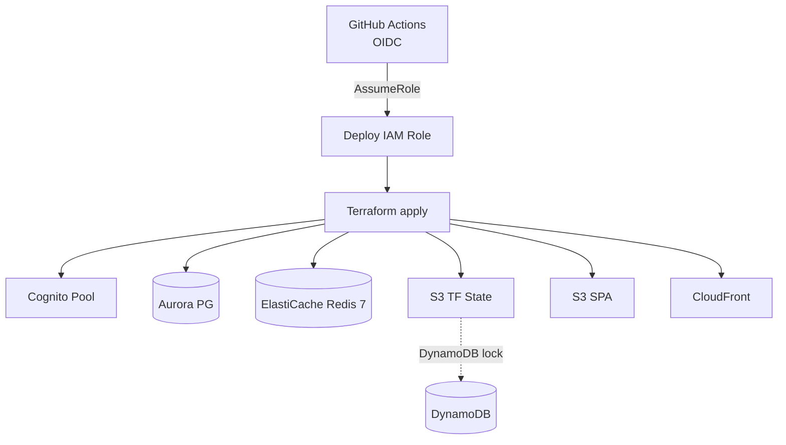

# Task: TASK-001 — Monorepo scaffold, IaC, CI/CD pipeline

**Spec:** [weave-platform.md](../../../weave-platform.md) · **Contracts:** [contracts.md](../../../../contracts.md)

## Story

**Epic:** EPIC-000 Foundation & Boilerplate
**Priority:** Must Have

**As a** platform engineer
**I want** a versioned monorepo with IaC modules and an automated quality-gate pipeline
**So that** every subsequent task has a consistent, reproducible environment to build into from day one.

## Acceptance Criteria

| ID | EARS Criterion | Test Mapping |
|----|----------------|--------------|
| AC-1 | WHEN a developer runs `make scaffold`, THE SYSTEM SHALL create the directory tree (`packages/backend`, `packages/frontend`, `packages/shared`, `infra/terraform`) and a root-level lint check exits 0 with zero errors. | unit: `test_scaffold_dirs_exist` |
| AC-2 | WHEN `terraform apply` runs against the dev workspace, THE SYSTEM SHALL provision the Cognito user pool, Aurora PostgreSQL Serverless v2 cluster, ElastiCache Redis 7, S3 buckets, and CloudFront distribution with remote state stored in S3 and locked via DynamoDB. | integration: `test_terraform_plan_dev_completes` |
| AC-3 | WHEN a PR is opened, THE SYSTEM SHALL execute type-check, lint, unit tests, and mutation score check (≥70%), and report all results to the GitHub PR check surface within 10 minutes. | integration: `test_ci_pr_gates_pass` |
| AC-4 | WHEN any CI lint gate finds an error, THE SYSTEM SHALL exit non-zero and surface the offending file and line in the GitHub check annotation, blocking merge. | integration: `test_ci_lint_failure_blocks_merge` |
| AC-5 | WHEN a commit is pushed to `main` and all quality gates pass, THE SYSTEM SHALL trigger a staging deploy workflow using GitHub OIDC to assume the deploy IAM role (no stored AWS credentials). | integration: `test_oidc_deploy_to_staging` |
| AC-6 | WHEN any secret scanning hook detects a credential pattern in a committed file, THE SYSTEM SHALL reject the push and emit the file path and detected pattern without exposing the secret value. | unit: `test_secret_scan_rejects_credential_pattern` |

## Implementation

### Pseudocode

Infrastructure configuration shape (not prescriptive code — IaC defines the target state):

```text
# infra/terraform/environments/dev/main.tf (structural shape)
module "cognito"      { pool_name="weave-dev", mfa="OPTIONAL", token_validity_seconds=60 }
module "aurora_pg"    { engine="aurora-postgresql", min_acus=0.5, max_acus=4, db_name="weave" }
module "elasticache"  { engine="redis", engine_version="7", node_type="cache.t4g.micro" }
module "s3_state"     { bucket_name="weave-tf-state-dev", versioning=true, server_side_encryption=true }
module "s3_assets"    { bucket_name="weave-assets-dev" }
module "s3_spa"       { bucket_name="weave-spa-dev", public_read=false, website=true }
module "cloudfront"   { origin=module.s3_spa.bucket_regional_domain }
module "dynamo_lock"  { table_name="weave-tf-lock-dev", billing_mode="PAY_PER_REQUEST" }

# DynamoDB locking wired in terraform backend block
terraform {
  backend "s3" {
    bucket         = "weave-tf-state-dev"
    key            = "platform/terraform.tfstate"
    region         = "ap-southeast-2"
    dynamodb_table = "weave-tf-lock-dev"
    encrypt        = true
  }
}
```

CI pipeline shape:

```text
# .github/workflows/ci.yml (structural shape)
on: [pull_request, push(branches=[main])]
jobs:
  quality:
    steps:
      - typecheck:  "uv run mypy packages/backend" AND "npx tsc --noEmit"
      - lint:       "uv run ruff check" AND "npx eslint . --max-warnings 0"
      - unit:       "uv run pytest --cov=packages/backend --cov-fail-under=80"
                    AND "npx vitest run --coverage"
      - mutation:   "npx stryker run"  # threshold: 70%
      - secrets:    "git secrets --scan" OR "gitleaks detect --source ."
  deploy-staging:
    needs: [quality]
    if: github.ref == 'refs/heads/main'
    permissions: { id-token: write, contents: read }
    steps:
      - configure-aws-credentials:  role-to-assume=${{ vars.DEPLOY_ROLE_ARN }}
      - deploy: (terraform apply + SPA sync)
```

### API Contracts

Not applicable — this task produces IaC modules and CI pipeline configuration, not HTTP endpoints.

### Diagram References

| Diagram | Notes |
|---------|-------|
| Infra topology | Inline Mermaid below — no tech-spec file exists yet |



### Design Decisions

| Decision | Source | Impact on This Task |
|----------|--------|---------------------|
| Python 3.12+, FastAPI, uv; TS strict, Next.js 15, Tailwind | CLAUDE.md stack | Defines toolchain in CI steps: `uv run`, `npx`; no bare `pip` |
| AWS Cognito (default) or Auth0 | CLAUDE.md stack | Terraform module provisions Cognito user pool; `token_validity_seconds=60` enforces JWT TTL ≤60s (PLAT-IDENTITY-1) |
| GitHub Actions OIDC to AWS (no stored credentials) | CLAUDE.md CI/CD | `id-token: write` permission; `role-to-assume` from repo variable, not secret |
| Secrets in AWS Secrets Manager only — never in `.env` | CLAUDE.md + spec security | Secret scanning gate in CI; no `.env` committed; Secrets Manager used from TASK-002 onward |
| Terraform remote state: S3 + DynamoDB lock | Spec Key Decisions | Prevents concurrent apply corruption; mandatory for multi-engineer workflow |

## Test Requirements

### Unit Tests (minimum 3)

- `test_scaffold_dirs_exist` — assert each expected directory is created by `make scaffold`
- `test_secret_scan_rejects_credential_pattern` — feed a file containing an AWS key pattern; assert scanner exits non-zero
- `test_terraform_modules_valid` — `terraform validate` exits 0 for each environment module

### Integration Tests (minimum 2)

- `test_terraform_plan_dev_completes` — `terraform plan -detailed-exitcode` returns exit 0 or 2 (change planned), never 1 (error)
- `test_ci_pr_gates_pass` — trigger a stub PR via GitHub API; assert all check runs reach `completed/success` within 10 minutes

### E2E Tests (minimum 1)

- `test_oidc_deploy_to_staging` — push to `main`; assert CloudFront distribution returns HTTP 200 for the SPA root URL within 5 minutes of workflow completion

### AC-to-Test Mapping

| AC | Test Type | Test Name |
|----|-----------|-----------|
| AC-1 | Unit | `test_scaffold_dirs_exist` |
| AC-2 | Integration | `test_terraform_plan_dev_completes` |
| AC-3 | Integration | `test_ci_pr_gates_pass` |
| AC-4 | Integration | `test_ci_lint_failure_blocks_merge` |
| AC-5 | E2E | `test_oidc_deploy_to_staging` |
| AC-6 | Unit | `test_secret_scan_rejects_credential_pattern` |

## Dependencies

- **blocked_by:** none
- **unlocks:** TASK-002 (app shell needs the scaffold), TASK-003 (tenancy data model needs the scaffold — does not need the shell)

## Cost Estimate

- **Complexity:** L
- **Estimated tokens:** ~40K input, ~20K output
- **Estimated cost:** ~$2

## Definition of Ready Checklist

- [ ] User story clear
- [ ] All ACs have mapped tests
- [ ] IaC module structure described
- [ ] CI pipeline shape defined
- [ ] Design decisions noted
- [ ] Test scenarios specified with types and counts
- [ ] Dependencies defined

## Definition of Done Checklist

- [ ] All ACs met
- [ ] `terraform validate` passes for dev, staging, prod modules
- [ ] CI pipeline runs end-to-end on a stub PR and passes all gates
- [ ] Secret scanning gate rejects a test credential pattern
- [ ] OIDC deploy role assumed — no AWS keys in repository or CI env
- [ ] `uv.lock` and `package-lock.json` committed
- [ ] Conventional commit created (`chore: scaffold monorepo and IaC`)
- [ ] No implementation beyond this task's ACs (YAGNI)

## Implementation Hints

- Start with `uv init packages/backend` and `npx create-next-app@latest packages/frontend --ts --tailwind --app` to get correct lockfiles from day one; hand-crafting them causes drift.
- Terraform workspaces (dev/staging/prod) should share module code and vary only via `terraform.tfvars`; avoids three divergent codebases.
- `gitleaks` is easier to configure than `git-secrets` for custom patterns; add a `.gitleaks.toml` that allows test fixture strings (prefix `WEAVE_TEST_`) so the secret scan doesn't fire on test data.
- The GitHub OIDC trust policy must include `token.actions.githubusercontent.com` as a federated principal with a condition on `sub` scoped to `repo:<org>/<repo>:ref:refs/heads/main` — overly broad trust is a security flaw.
- Mutation testing on the IaC Python helpers (not on Terraform itself); scope Stryker/mutmut to `packages/backend` only to keep the 70% threshold meaningful.

---

*Generated by Weave Architect skill (arch-task-brief). Self-contained — engineer reads only this file.*
