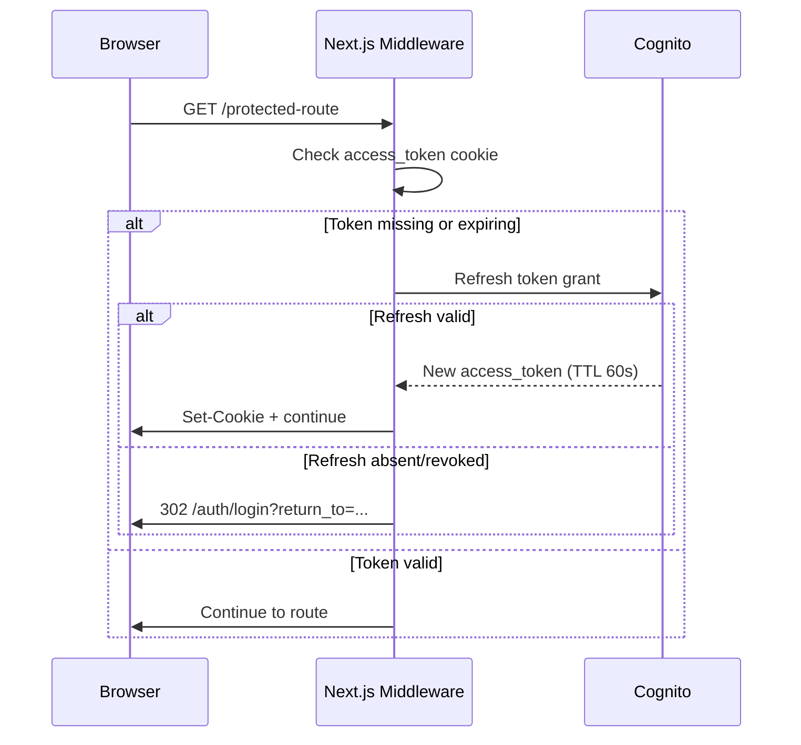

# Task: TASK-002 — App shell, design system, auth bootstrap, model routing, local dev

**Spec:** [weave-platform.md](../../../weave-platform.md) · **Contracts:** [contracts.md](../../../../contracts.md)

## Story

**Epic:** EPIC-000 Foundation & Boilerplate
**Priority:** Must Have

**As a** developer building any engine feature
**I want** a runnable SPA shell with auth, a design system, an AI model-routing layer, and a one-command local dev stack
**So that** every subsequent task starts from a working, authenticated, observable surface rather than a blank screen.

## Acceptance Criteria

| ID | EARS Criterion | Test Mapping |
|----|----------------|--------------|
| AC-1 | WHEN a developer runs `make dev`, THE SYSTEM SHALL start the Next.js frontend (port 3000), FastAPI backend (port 8000), Oxigraph SPARQL endpoint (port 7878), Aurora PG (via Docker), and Redis, all healthy within 60 seconds. | integration: `test_dev_stack_healthy` |
| AC-2 | WHEN an unauthenticated user visits any protected route, THE SYSTEM SHALL redirect to the Cognito hosted UI and return the user to the original path after successful sign-in. | E2E: `test_auth_redirect_and_return` |
| AC-3 | WHEN a signed-in user's JWT has expired (TTL ≤60 s), THE SYSTEM SHALL silently refresh the token via Cognito refresh token grant, or redirect to sign-in if the refresh token is absent or revoked. | unit: `test_jwt_auto_refresh`, integration: `test_expired_jwt_triggers_refresh` |
| AC-4 | WHEN a component calls the model-routing client with a model tier (`opus`, `sonnet`, `haiku`), THE SYSTEM SHALL route the request to the corresponding Claude model ID (`claude-opus-4-8`, `claude-sonnet-4-6`, `claude-haiku-4-5-20251001`) via the configured provider (Bedrock or Anthropic direct), with no model ID hard-coded outside the routing table. | unit: `test_model_routing_tier_mapping` |
| AC-5 | WHEN any backend request completes, THE SYSTEM SHALL emit an OpenTelemetry trace span (with `tenant_id`, `engine`, and `principal_iri` attributes) to the ADOT Collector; a missing `tenant_id` attribute is a test failure. | integration: `test_otel_span_has_required_attrs` |
| AC-6 | WHEN a developer runs `npx storybook`, THE SYSTEM SHALL serve the Storybook catalogue with at least the Button, Input, Badge, and Card shadcn components documented and visually verified at WCAG 2.1 AA contrast. | unit: `test_storybook_components_render` |
| AC-7 | WHEN `make test` is run locally, THE SYSTEM SHALL execute the full unit + integration suite and report results within 5 minutes without requiring any cloud credentials. | integration: `test_local_test_suite_offline` |

## Implementation

### Pseudocode

```text
# Frontend auth flow (Next.js App Router middleware)
middleware(request):
  token = cookies(request).get("weave_access_token")
  if not token OR token.exp <= now() + 30s:
    refresh_token = cookies(request).get("weave_refresh_token")
    if refresh_token:
      token = cognito.refresh(refresh_token)  # silent; store new token in cookie
    else:
      redirect("/auth/login?return_to=" + request.url)
  continue_with_enriched_request(request, token)

# Backend model-routing client (packages/backend/ai/router.py)
MODEL_ROUTING_TABLE = {
  "opus":   "claude-opus-4-8",
  "sonnet": "claude-sonnet-4-6",
  "haiku":  "claude-haiku-4-5-20251001",
}

def route(tier: str, prompt: str, **kwargs) -> Response:
  model_id = MODEL_ROUTING_TABLE.get(tier)
  if not model_id:
    raise ValueError(f"Unknown tier: {tier}")
  # provider resolved from env: BEDROCK or ANTHROPIC_DIRECT
  return active_provider().invoke(model_id=model_id, prompt=prompt, **kwargs)

# OTel span wrapper (packages/backend/observability/tracing.py)
def traced_request(handler):
  with tracer.start_as_current_span(handler.__name__) as span:
    span.set_attribute("tenant_id", current_tenant())    # MUST be non-null
    span.set_attribute("engine", current_engine())
    span.set_attribute("principal_iri", current_principal_iri())
    return handler()
```

### API Contracts

**Endpoint:** `GET /api/health`

**Response (200):**

```json
{
  "status": "ok",
  "services": {
    "postgres": "ok",
    "redis": "ok",
    "oxigraph": "ok"
  },
  "timestamp": "2026-06-30T12:00:00Z"
}
```

**Endpoint:** `POST /api/auth/refresh`

**Request:**

```json
{ "refresh_token": "<cognito_refresh_token>" }
```

**Response (200):**

```json
{ "access_token": "<jwt>", "expires_in": 60 }
```

**Response (401):**

```json
{ "error": "invalid_refresh_token" }
```

### Diagram References

| Diagram | Notes |
|---------|-------|
| Auth flow | Inline Mermaid below |



### Design Decisions

| Decision | Source | Impact on This Task |
|----------|--------|---------------------|
| Next.js 15 App Router, Tailwind CSS, shadcn/ui | CLAUDE.md stack | App Router middleware handles auth; shadcn is the component baseline for Storybook |
| JWT TTL ≤60 s (PLAT-IDENTITY-1) | contracts.md PLAT-IDENTITY-1 | Cognito pool configured with `AccessTokenValidity=1minute`; refresh logic mandatory |
| Claude models: opus-4-8 / sonnet-4-6 / haiku-4-5 | CLAUDE.md AI/Agents | Routing table maps tier strings — no hard-coded IDs elsewhere in the codebase |
| AWS Bedrock AgentCore + Anthropic Agent SDK | CLAUDE.md AI/Agents | Provider abstraction must accept both; env var selects active provider |
| OpenTelemetry + CloudWatch via ADOT Collector | CLAUDE.md Observability | Spans emitted to ADOT via OTLP gRPC (localhost:4317 in dev, ECS sidecar in prod) |
| Oxigraph for dev/test RDF store | CLAUDE.md Data | Docker image `ghcr.io/oxigraph/oxigraph`; replaced by Neptune in prod (TASK-003 config) |

## Test Requirements

### Unit Tests (minimum 4)

- `test_jwt_auto_refresh` — mock Cognito; assert middleware requests a new token when exp - now < 30s
- `test_expired_jwt_no_refresh_redirects` — mock absent refresh token; assert redirect to `/auth/login`
- `test_model_routing_tier_mapping` — for each tier string assert the correct model ID is passed to the provider mock
- `test_storybook_components_render` — Vitest component tests for Button, Input, Badge, Card pass with no a11y violations (axe)
- `test_otel_span_missing_tenant_fails` — assert span without `tenant_id` attribute raises in test mode

### Integration Tests (minimum 2)

- `test_dev_stack_healthy` — `make dev` + `GET /api/health` returns `{"status":"ok"}` for all services
- `test_otel_span_has_required_attrs` — real FastAPI request; assert OTLP exporter receives span with `tenant_id`, `engine`, `principal_iri`

### E2E Tests (minimum 1)

- `test_auth_redirect_and_return` — Playwright: visit `/dashboard` unauthenticated; assert redirect to Cognito hosted UI; sign in; assert return to `/dashboard` with session cookie set

### AC-to-Test Mapping

| AC | Test Type | Test Name |
|----|-----------|-----------|
| AC-1 | Integration | `test_dev_stack_healthy` |
| AC-2 | E2E | `test_auth_redirect_and_return` |
| AC-3 | Unit + Integration | `test_jwt_auto_refresh`, `test_expired_jwt_triggers_refresh` |
| AC-4 | Unit | `test_model_routing_tier_mapping` |
| AC-5 | Integration | `test_otel_span_has_required_attrs` |
| AC-6 | Unit | `test_storybook_components_render` |
| AC-7 | Integration | `test_local_test_suite_offline` |

## Dependencies

- **blocked_by:** TASK-001 (repository scaffold and Terraform modules must exist)
- **unlocks:** TASK-004 (RBAC enforcement requires Cognito JWT auth from this task), TASK-005 (nav and dashboard need the running shell)

## Cost Estimate

- **Complexity:** XL
- **Estimated tokens:** ~60K input, ~30K output
- **Estimated cost:** ~$4

## Definition of Ready Checklist

- [ ] User story clear
- [ ] All ACs have mapped tests
- [ ] Pseudocode provided
- [ ] API contracts defined
- [ ] Design decisions noted
- [ ] Test scenarios specified with types and counts
- [ ] TASK-001 complete (repository and IaC exist)

## Definition of Done Checklist

- [ ] All ACs met
- [ ] `make dev` reaches healthy state in <60 s on a clean checkout
- [ ] All unit and integration tests passing; coverage ≥80%
- [ ] Storybook serves with 0 axe a11y violations on covered components
- [ ] No model ID hard-coded outside the routing table
- [ ] ADOT Collector receives spans with required attributes in dev
- [ ] Conventional commit created (`feat: add app shell, design system, auth, and model routing`)
- [ ] No AWS credentials in repository, no `.env` file committed

## Implementation Hints

- Use `next-auth` v5 with Cognito as the OIDC provider — it handles the refresh-token rotation and `Set-Cookie` hygiene; avoid hand-rolling OAuth.
- The model-routing table belongs in a single config file (`packages/backend/ai/config.py`) imported everywhere; a grep for hard-coded model IDs is a valid DoD check.
- Oxigraph's Docker healthcheck is `GET /` — use `depends_on: { oxigraph: { condition: service_healthy } }` in `docker-compose.dev.yml` to prevent race conditions.
- OTel `tenant_id` must be set from context (not passed as a parameter) — use a context variable (`contextvars.ContextVar`) populated by the auth middleware, so it propagates automatically to all spans within a request.
- Run `axe-core` via `@axe-core/playwright` in the E2E suite and `vitest-axe` in unit tests — two different surfaces, both mandatory for WCAG 2.1 AA.

---

*Generated by Weave Architect skill (arch-task-brief). Self-contained — engineer reads only this file.*
