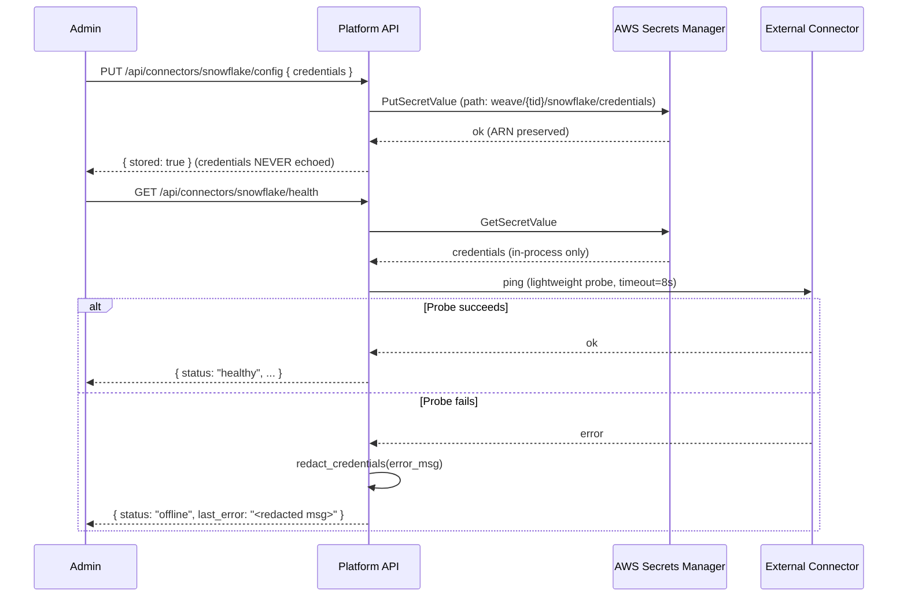

# Task: TASK-006 — Managed connector config and health monitoring (PLAT-CONNECTOR-1, M1)

**Spec:** [weave-platform.md](../../../weave-platform.md) · **Contracts:** [contracts.md](../../../../contracts.md)

## Story

**Epic:** EPIC-007 Connector Config & Health (E7-S1 + E7-S2 only — E7-S3 ingestion requires CE-WRITE-1, post-M1)
**Priority:** Must Have

**As a** workspace admin
**I want** to configure credentials for any of the seven managed connectors and see their live health status
**So that** the platform knows which data sources are available before the build and events engines attempt to use them.

## Acceptance Criteria

| ID | EARS Criterion | Test Mapping |
|----|----------------|--------------|
| AC-1 | WHEN an admin submits connector credentials via `PUT /api/connectors/{type}/config`, THE SYSTEM SHALL store the credentials exclusively in AWS Secrets Manager (path: `weave/{tenant_id}/{connector_type}/credentials`), return 200 with `{"stored": true}` but NEVER return the credential values in any API response. | unit: `test_connector_credentials_stored_in_secrets_manager` |
| AC-2 | WHEN credentials are submitted for an unsupported connector type, THE SYSTEM SHALL return 400 with `{"error":"unsupported_connector","supported":["snowflake","databricks","s3","azure_data_lake","atlassian","servicenow","slack"]}`. | unit: `test_unsupported_connector_returns_400` |
| AC-3 | WHEN `GET /api/connectors/{type}/health` is called, THE SYSTEM SHALL retrieve credentials from Secrets Manager, attempt a lightweight connection probe, and return `{"status":"healthy"|"degraded"|"offline","last_sync":null,"last_error":null,"error_count":0}` within 10 seconds. | integration: `test_connector_health_probe` |
| AC-4 | WHEN a connector probe fails, THE SYSTEM SHALL return status `"offline"` with `last_error` populated (never the raw credential or connection string) and increment `error_count`; the error message MUST NOT contain credential values. | unit: `test_connector_health_error_redacts_credentials` |
| AC-5 | WHEN `GET /api/connectors` is called, THE SYSTEM SHALL return a list of all seven connector types, each with configuration status (`configured` or `unconfigured`) and health status, scoped to the caller's tenant. | integration: `test_connector_list_scoped_to_tenant` |
| AC-6 | WHEN the Atlassian connector is configured, THE SYSTEM SHALL treat Jira and Confluence as a single OAuth family (one credential set, one health probe) — not as two separate connectors. | unit: `test_atlassian_single_oauth_family` |
| AC-7 | WHEN connector credentials are rotated (PUT called again), THE SYSTEM SHALL update the Secrets Manager value without deleting and re-creating the secret (to preserve IAM resource policies), and emit a PLAT-AUDIT-1 event. | integration: `test_connector_credential_rotation` |

## Implementation

### Pseudocode

```text
# Connector config handler (packages/backend/connectors/config.py)
SUPPORTED_TYPES = ["snowflake", "databricks", "s3", "azure_data_lake",
                   "atlassian", "servicenow", "slack"]

def store_connector_config(tenant_id: str, connector_type: str,
                           credentials: dict, actor_iri: str):
  if connector_type not in SUPPORTED_TYPES:
    raise BadRequest("unsupported_connector", supported=SUPPORTED_TYPES)
  secret_path = f"weave/{tenant_id}/{connector_type}/credentials"
  existing = secrets_manager.get(secret_path, raise_if_missing=False)
  if existing:
    secrets_manager.update_value(secret_path, credentials)  # preserve ARN + policies
  else:
    secrets_manager.create(secret_path, credentials, kms_key_id=WEAVE_KMS_KEY)
  audit.emit(PLAT-AUDIT-1, actor=actor_iri, event="connector.configured",
             target=f"urn:weave:connector:{tenant_id}:{connector_type}")
  return {"stored": True}  # NEVER return credential values

# Health probe (packages/backend/connectors/health.py)
def probe_connector(tenant_id: str, connector_type: str) -> HealthStatus:
  secret_path = f"weave/{tenant_id}/{connector_type}/credentials"
  try:
    creds = secrets_manager.get(secret_path)
  except SecretNotFound:
    return HealthStatus(status="offline", last_error="not_configured", error_count=0)
  try:
    driver = connector_driver(connector_type)
    driver.ping(creds, timeout=8.0)           # lightweight: list schemas / check auth
    db.upsert_health(tenant_id, connector_type, status="healthy", last_sync=now())
    return HealthStatus(status="healthy", last_sync=now(), last_error=None, error_count=0)
  except ConnectorError as e:
    count = db.increment_error_count(tenant_id, connector_type)
    error_msg = redact_credentials(str(e), creds)  # strip any cred values from message
    db.upsert_health(tenant_id, connector_type, status="offline", last_error=error_msg)
    return HealthStatus(status="offline", last_error=error_msg, error_count=count)
```

### API Contracts

**Endpoint:** `PUT /api/connectors/{type}/config`

**Request:**

```json
{
  "credentials": {
    "account": "myorg.snowflakecomputing.com",
    "username": "weave_svc",
    "private_key_pem": "<key>"
  }
}
```

**Response (200):** `{ "stored": true }`

**Response (400):**

```json
{
  "error": "unsupported_connector",
  "supported": ["snowflake", "databricks", "s3", "azure_data_lake", "atlassian", "servicenow", "slack"]
}
```

---

**Endpoint:** `GET /api/connectors/{type}/health`

**Response (200):**

```json
{
  "connector": "snowflake",
  "status": "healthy",
  "last_sync": "2026-06-30T11:55:00Z",
  "last_error": null,
  "error_count": 0
}
```

---

**Endpoint:** `GET /api/connectors`

**Response (200):**

```json
{
  "connectors": [
    { "type": "snowflake",       "configured": true,  "status": "healthy" },
    { "type": "databricks",      "configured": true,  "status": "offline" },
    { "type": "s3",              "configured": false, "status": null },
    { "type": "azure_data_lake", "configured": false, "status": null },
    { "type": "atlassian",       "configured": true,  "status": "degraded" },
    { "type": "servicenow",      "configured": false, "status": null },
    { "type": "slack",           "configured": true,  "status": "healthy" }
  ]
}
```

### Diagram References

| Diagram | Notes |
|---------|-------|
| Credential flow | Inline Mermaid below |



### Design Decisions

| Decision | Source | Impact on This Task |
|----------|--------|---------------------|
| PLAT-CONNECTOR-1: exactly 7 connectors; Atlassian = one OAuth family | contracts.md | `SUPPORTED_TYPES` has 7 entries; Atlassian health probe tests both Jira + Confluence via one OAuth token |
| All connector credentials in AWS Secrets Manager only | spec security constraint | No `.env`, no Aurora, no config files — Secrets Manager path is canonical |
| Credential values never in API responses | spec security constraint | `stored: true` response; `redact_credentials()` on error messages |
| Health shape: `status, last_sync, last_error, error_count` | contracts.md PLAT-CONNECTOR-1 | Fixed shape — all four fields always present (null when not applicable) |
| Ingestion (E7-S3) deferred to v1.0 — requires CE-WRITE-1 | spec EPIC-007 | This task covers config + health only; no data pipeline, no ingest trigger |

## Test Requirements

### Unit Tests (minimum 4)

- `test_connector_credentials_stored_in_secrets_manager` — mock Secrets Manager; call config endpoint; assert `PutSecretValue` called with correct path; assert response contains no credential fields
- `test_unsupported_connector_returns_400` — call with `type="oracle"`; assert 400 with `supported` list of exactly 7 types
- `test_connector_health_error_redacts_credentials` — mock probe to fail with error containing credential value; assert `last_error` does not contain the credential value
- `test_atlassian_single_oauth_family` — configure Atlassian; assert one Secrets Manager path created (`atlassian`), not two (`jira`, `confluence`)

### Integration Tests (minimum 2)

- `test_connector_health_probe` — configure Snowflake with mock credentials; call health endpoint; assert driver.ping called; assert health shape returned
- `test_connector_list_scoped_to_tenant` — configure connectors in tenant A; call `GET /api/connectors` from tenant B; assert tenant B sees all unconfigured (tenant A's configured state not visible)
- `test_connector_credential_rotation` — configure; configure again; assert single Secrets Manager path updated (not re-created); assert PLAT-AUDIT-1 event emitted twice

### E2E Tests (minimum 1)

- `test_connector_config_ui_stores_and_shows_health` — Playwright: navigate to connector settings; enter Snowflake credentials; save; assert "Configured" status shown; health indicator appears within 15 s

### AC-to-Test Mapping

| AC | Test Type | Test Name |
|----|-----------|-----------|
| AC-1 | Unit | `test_connector_credentials_stored_in_secrets_manager` |
| AC-2 | Unit | `test_unsupported_connector_returns_400` |
| AC-3 | Integration | `test_connector_health_probe` |
| AC-4 | Unit | `test_connector_health_error_redacts_credentials` |
| AC-5 | Integration | `test_connector_list_scoped_to_tenant` |
| AC-6 | Unit | `test_atlassian_single_oauth_family` |
| AC-7 | Integration | `test_connector_credential_rotation` |

## Dependencies

- **blocked_by:** TASK-004 (RBAC and tenant context required for per-tenant Secrets Manager paths)
- **unlocks:** TASK-007 (Notifications uses Slack connector for delivery)

## Cost Estimate

- **Complexity:** M
- **Estimated tokens:** ~35K input, ~18K output
- **Estimated cost:** ~$2

## Definition of Ready Checklist

- [ ] User story clear
- [ ] All ACs have mapped tests
- [ ] Pseudocode provided
- [ ] Secrets Manager path convention documented
- [ ] 7 connector types listed (Atlassian = one family)
- [ ] Ingestion (E7-S3) explicitly out of scope
- [ ] TASK-004 complete

## Definition of Done Checklist

- [ ] All ACs met
- [ ] Credential values never appear in any API response or log
- [ ] `redact_credentials()` tested against all 7 connector error message formats
- [ ] Atlassian health probe validates both Jira and Confluence via one OAuth token
- [ ] PLAT-AUDIT-1 emitted on every configure and rotate action
- [ ] Coverage ≥80% for connectors module
- [ ] Conventional commit: `feat: add connector config and health monitoring`

## Implementation Hints

- Use `boto3`'s `secretsmanager.put_secret_value` (not `create_secret`) for updates — this preserves the secret's ARN, which IAM policies bind to; `delete + create` breaks those policies.
- Each connector driver should implement a minimal `ping()` method that does the cheapest possible operation (e.g. Snowflake: `SELECT 1`; Atlassian: `GET /rest/api/3/myself`; S3: `list_buckets` filtered to one bucket); full data enumeration is ingestion, not health.
- `redact_credentials()` should use a regex that matches the actual credential values fetched from Secrets Manager (not just pattern matching on `password`, `key`, etc.) — iterate over all values in the secrets dict and replace them with `[REDACTED]` in the error string.
- Health probe results should be cached in Redis with a 30 s TTL (`weave:health:{tid}:{type}`) so the UI can poll quickly without hammering external services.
- The KMS key used for Secrets Manager encryption (`WEAVE_KMS_KEY`) should be a customer-managed key per tenant — this supports key revocation on offboarding.

---

*Generated by Weave Architect skill (arch-task-brief). Self-contained — engineer reads only this file.*
