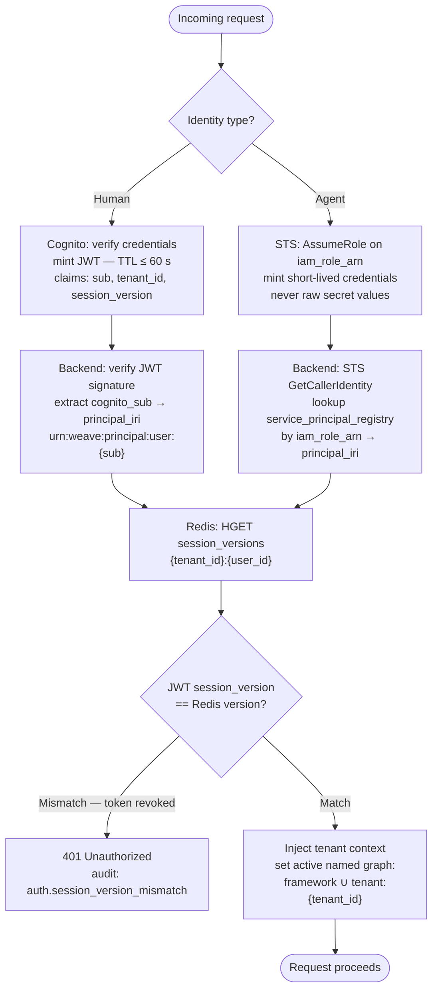
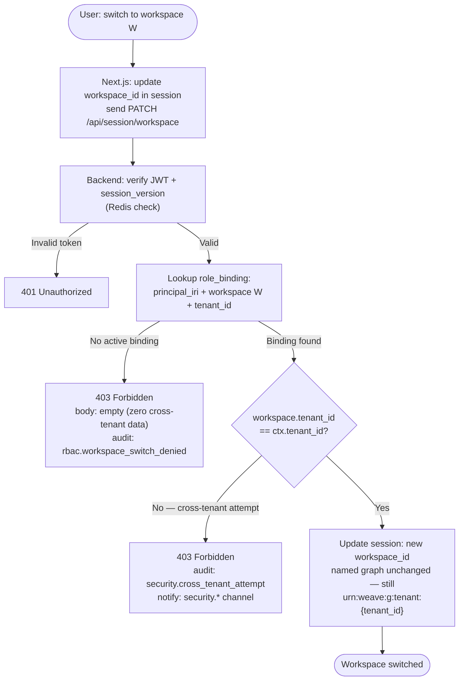
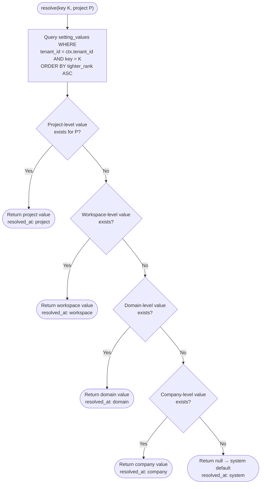
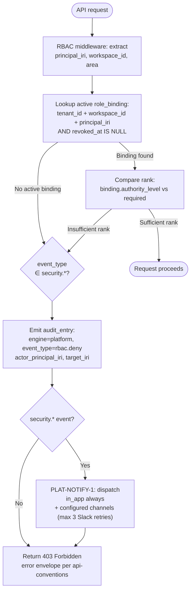
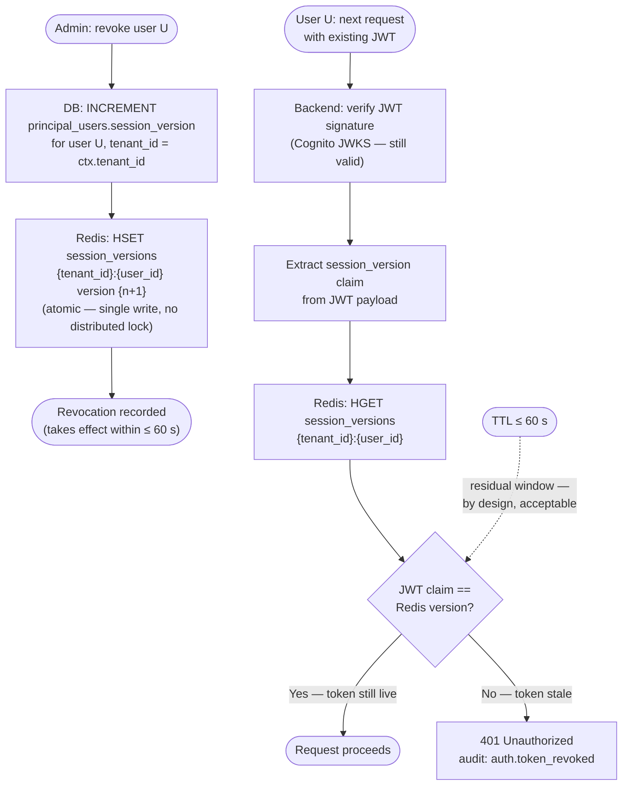
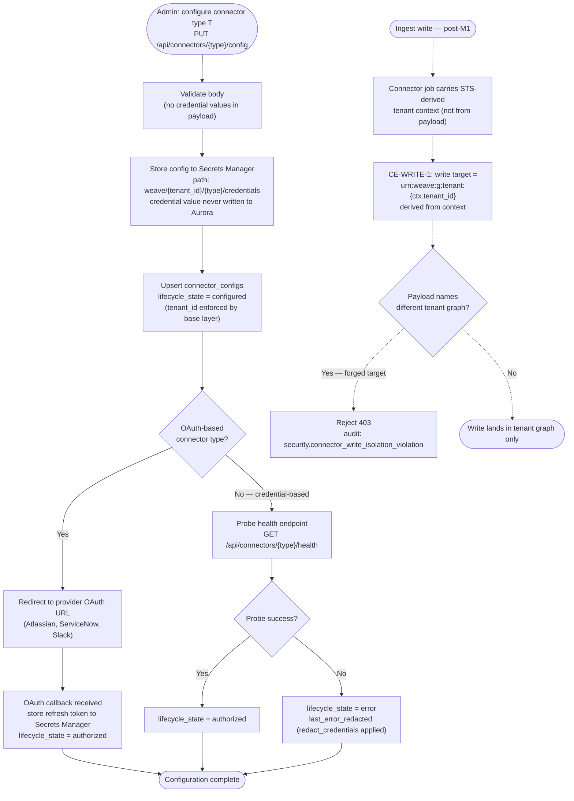
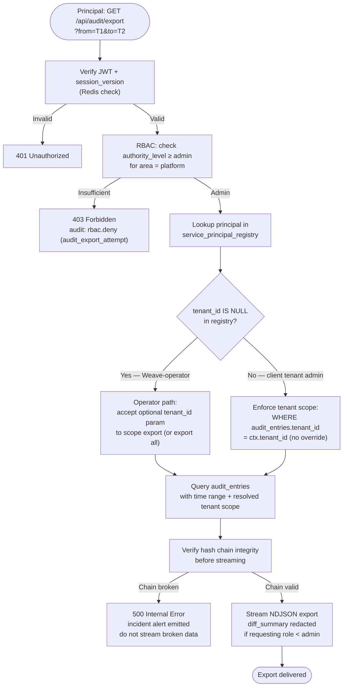
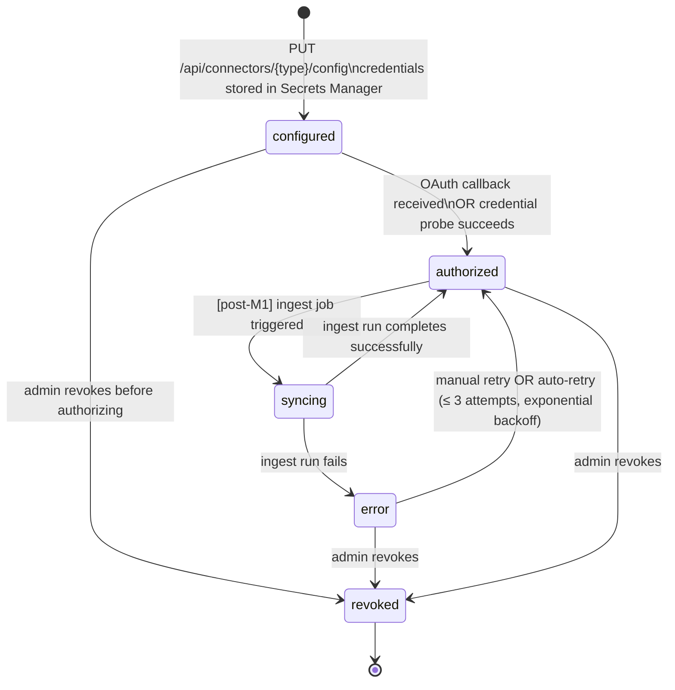
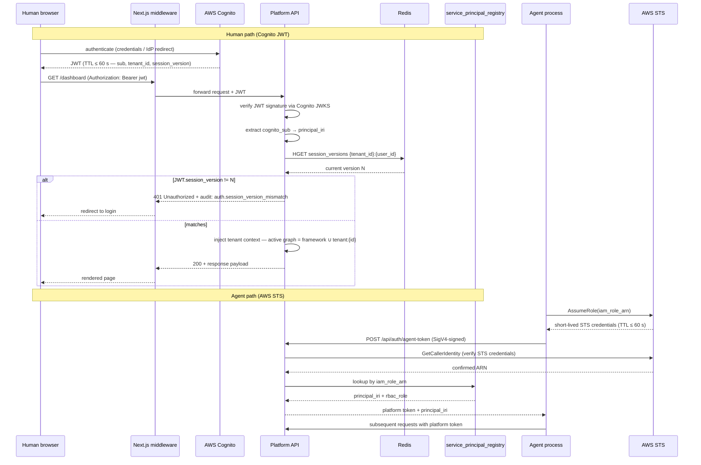
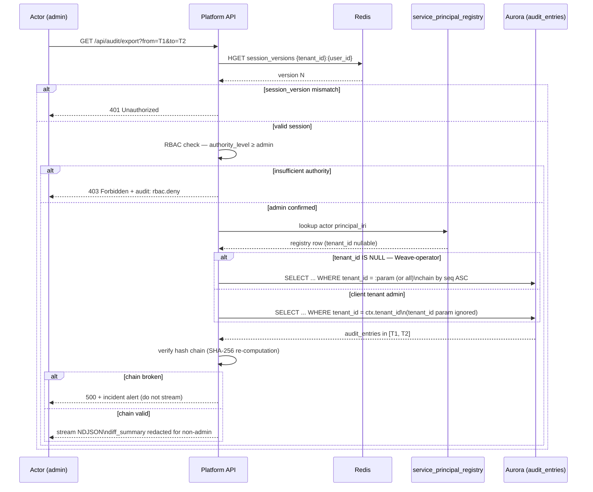

# Weave Platform — Business Process (M1)

**Graph edges:**
[Engine spec](../../../weave-platform.md) ·
[contracts.md](../../../../contracts.md) ·
[ADR-001 Tenant Isolation](../../../../decisions/ADR-001-tenant-isolation.md) ·
[ADR-002 Authority Extension](../../../../decisions/ADR-002-authority-extension.md)

**Standards consumed (linked, not redefined):**
[rbac-multi-tenancy](../../../../../../standards/rbac-multi-tenancy.md) ·
[audit-immutability](../../../../../../standards/audit-immutability.md) ·
[api-conventions](../../../../../../standards/api-conventions.md) ·
[observability](../../../../../../standards/observability.md)

**Data model:** [data-model.md](data-model.md)

This document covers the M1 Platform flows. Every security-relevant path emits an
audit entry via [PLAT-AUDIT-1](../../../../contracts.md) and records a span per
[observability](../../../../../../standards/observability.md) (required attributes:
`weave.tenant_id`, `weave.engine = platform`, `weave.request_id`). Error envelopes and
status codes (403, 422, 429) follow
[api-conventions](../../../../../../standards/api-conventions.md) — not restated here.

## Flow 1: Cognito JWT Login

Two identity paths: **Human** authenticates via Cognito (JWT, TTL ≤ 60 s, enforced by
`token_validity_seconds = 60` in the Cognito Terraform module). **Agent** authenticates
via AWS STS (AssumeRole, short-lived credentials, never raw secret values). Both paths
converge on principal IRI minting and session-version validation before the request
proceeds. See [Sequence: Login](#sequence-login) for the full call sequence.

**Invariants:**

- Token TTL ≤ 60 s (Cognito); agents use STS TTL ≤ 60 s — no long-lived secrets.
- `principal_iri` is immutable once minted; derived from Cognito `sub` (human) or
  `sha256(iam_role_arn)[:12]` (agent).
- The named-graph scope is set from the verified JWT `tenant_id` claim — never from the
  request payload.
- OTel span attributes must not include `email` or any PII.

## Flow 2: Workspace Switch

A workspace switch updates the RBAC context, not the isolation boundary. The tenant
named graph stays constant across workspaces for the same tenant. A switch to a workspace
in a different tenant is rejected with 403 and zero cross-tenant data in the response body.

**Invariant:** the named-graph isolation boundary is the **tenant**, not the workspace.
A workspace switch never changes the active `FROM` clause graph scope. Zero cross-tenant
data is returned on any rejection path — the response body is empty, not filtered.

## Flow 3: Settings-Cascade Resolution

The four cascade levels (Company → Domain → Workspace → Project) are resolved by
walking from the tightest scope outward; the first non-null value wins. This implements
[PLAT-SETTINGS-1](../../../../contracts.md). Billing caps use the same cascade logic via
[PLAT-BILLING-1](../../../../contracts.md).

**Invariants:**

- All four levels are queried in one Aurora call (single `WHERE tenant_id = ctx.tenant_id`
  with `ORDER BY tighter_rank ASC` and `LIMIT 1`).
- `tighter_rank`: 0 = project (tightest) … 3 = company; `LIMIT 1` returns the winner.
- Budget-cap cascade: same logic with `cap_type` and `period` as additional dimensions.
- An 80% consumed threshold emits a warning notification (PLAT-BILLING-1); 100% rejects
  the triggering call synchronously before the metering record is written.

## Flow 4: RBAC Deny → 403 → Audit

The RBAC middleware runs on every authenticated API request. It resolves the effective
authority level for the requesting principal against the required level for the target
endpoint. A deny always emits an audit entry; `security.*` events also trigger a
notification. See [rbac-multi-tenancy](../../../../../../standards/rbac-multi-tenancy.md)
for the `require(level, area)` contract and the authority-level rank table.

**Invariants:**

- RBAC check runs **after** JWT/session-version validation (Flow 1) — a revoked token
  never reaches the RBAC layer.
- `diff_summary` is redacted in any 403 response body — the audit entry stores the full
  value but it is not exposed to the denied actor.
- `security.*` notifications are always delivered regardless of user channel preferences.

## Flow 5: Revocation

**ONE mechanism** (per
[rbac-multi-tenancy §Revocation](../../../../../../standards/rbac-multi-tenancy.md)):
short access-token TTL (≤ 60 s) plus a per-request session-version check against Redis.
There is no token blacklist and no separate logout endpoint that must reach all replicas.
At worst, a revoked user retains access for the remainder of the current token's TTL.

**Invariants:**

- `session_version` is stored in both Aurora (`principal_users.session_version`) and
  Redis (`HSET session_versions …`). Redis is the hot path; Aurora is the durable source
  for cache warm-up on Redis miss or restart.
- There is no second revocation mechanism — do not add a token blacklist or a separate
  revoke-and-drain endpoint. Two mechanisms diverge.
- Role binding soft-revoke (`role_bindings.revoked_at`) is enforced by the RBAC lookup
  (Flow 4) — it is a separate control from session revocation.

## Flow 6: Connector OAuth and Ingest Write-Path

M1 scope is **configuration and health** only. Connector ingestion (the `syncing` state)
activates post-M1 when CE-WRITE-1 is available. The isolation invariant — that all writes
land in the requesting tenant's graph only — is defined here for M1 so that the release
gate test can be written now. See the [Connector Lifecycle](#state-machine-connector-lifecycle)
state machine for lifecycle transitions.

**Invariants:**

- `secret_arn` is stored in `connector_configs`; the credential value is never written
  to Aurora and never returned in any API response.
- `redact_credentials()` is applied before any error message is written to
  `connector_health.last_error_redacted` or returned in a response body.
- Atlassian (Jira + Confluence) = one OAuth family = one `connector_configs` row per tenant.
- The write-target derivation rule (context, not payload) is an M1 release gate —
  `test_connector_write_isolated` validates it (see
  [data-model.md §Isolation Invariants](data-model.md#isolation-invariants)).

## Flow 7: Audit-Export with Tenant-Scope Gate [SEC-5]

**SEC-5 (council backlog):** A workspace-admin exporting audit data sees only their own
tenant's entries. Cross-tenant export (for compliance/forensics at the platform level)
requires a Weave-operator IAM identity — registered in `service_principal_registry` with
`tenant_id IS NULL` and **never assignable** to a client tenant role binding.

**Invariants:**

- Client tenant admins cannot supply a `tenant_id` parameter to override scope —
  the value is always forced to `ctx.tenant_id` from the verified JWT.
- The Weave-operator IAM path (platform-internal identity) is the **only** mechanism
  for cross-tenant audit access. It is unreachable via client tenant OAuth flows.
- Hash-chain verification runs before streaming — broken chain halts the export
  and triggers an incident; partial exports of unverified data are never sent.
- `diff_summary` is redacted at export time for non-admin roles; full content is stored
  in Aurora (see [data-model.md §Audit Entry](data-model.md#audit-entry)).

## State Machine: Connector Lifecycle

**State notes:**

| State | Meaning | M1? |
|---|---|---|
| `configured` | Config stored in Secrets Manager; credentials not yet verified | yes |
| `authorized` | Credentials verified; connector ready | yes |
| `syncing` | Active ingest job running in tenant graph | **post-M1** |
| `error` | Last operation failed; `connector_health.last_error_redacted` populated | yes (health probe) |
| `revoked` | Admin-revoked; credentials deleted from Secrets Manager | yes |

## Sequence: Login

Two paths in one diagram — Human (Cognito JWT) and Agent (AWS STS). Both converge on the
Platform API's session-version gate and tenant-context injection.

## Sequence: Audit-Export with Tenant-Scope Gate [SEC-5]

Full call sequence for the SEC-5 scoped export. Shows both the client-admin path
(own-tenant scope enforced) and the Weave-operator path (cross-tenant access).

## Deferred (M2+)

The following flows and interactions are post-M1 and must not be built into M1 Platform:

| Item | Reason |
|---|---|
| Connector ingest flow (syncing state) | Depends on CE-WRITE-1; post-M1 |
| Full ODRL Permission evaluation in RBAC middleware | ADR-002 M2 authority module |
| Multi-user CRDT conflict resolution (Graph Explorer collab) | Explorer Phase 2 |
| Per-user dashboard pin flows (drag/drop, persist) | FR-008 is M2 |
| Workspace widget library management | FR-011 is M2 |
| AI agent authority escalation (HITL Duty + automatable flag) | ADR-002 M2 |
