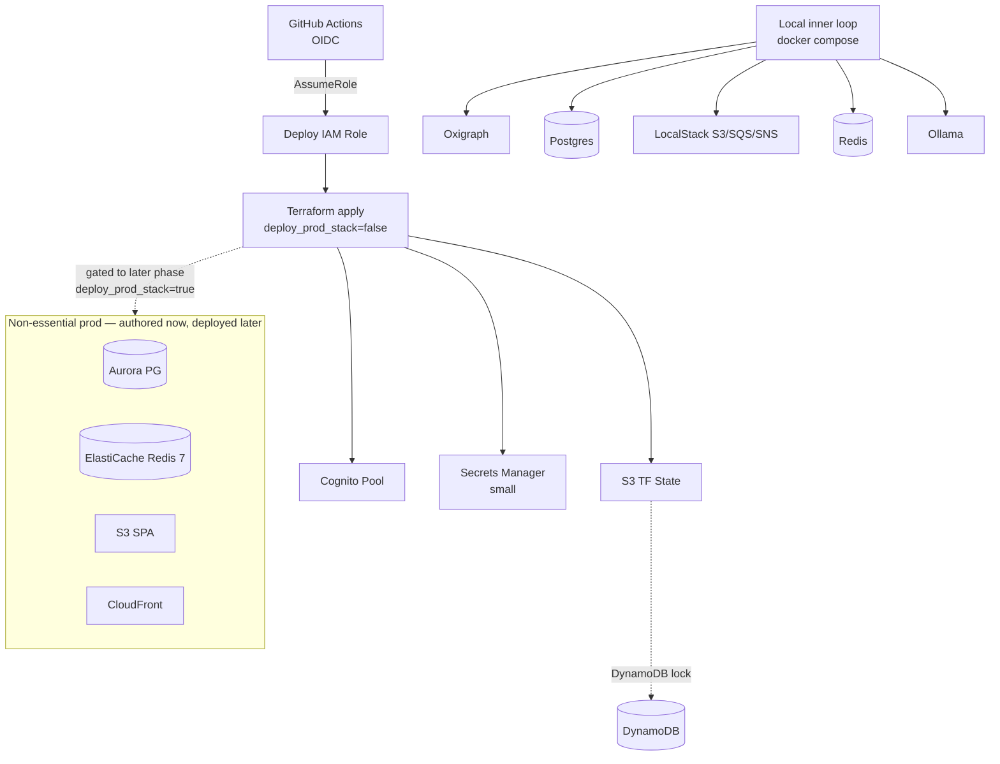

# Task: TASK-001 — Monorepo scaffold, IaC, CI/CD pipeline

**Spec:** [weave-platform.md](../../../weave-platform.md) · **Contracts:** [contracts.md](../../../../contracts.md)

## Story

**Epic:** EPIC-000 Foundation & Boilerplate
**Priority:** Must Have

**As a** platform engineer
**I want** a versioned monorepo, a **local-first** dev stack, the **full** local + remote IaC authored, and an automated quality-gate pipeline — with only the essential cloud pieces actually deployed now
**So that** every subsequent task has a consistent, reproducible environment to build into from day one, while AWS (and Bedrock) is touched as little as possible until M1/MVP is proven locally.

> **Local-first (see [`dev-environment.md`](../../../../dev-environment.md)).** The inner loop runs
> against a Docker-substituted stack (Oxigraph, PostgreSQL, LocalStack S3/SQS/SNS, Redis, Ollama) with
> **near-zero AWS**. This task **authors the full local + remote Terraform stack now**, but only the
> **essential shared-dev-account elements** (Cognito, a small Secrets Manager, and the S3+DynamoDB
> Terraform state backend — DX1/DX3) are **deployed** in this phase. Deployment of the non-essential prod
> elements (Aurora, ElastiCache, CloudFront, SPA/assets buckets, the full prod VPC) is **authored but
> gated to a later phase** (the pre-prod-deploy boundary, DX4), after M1/MVP is proven on the local stack.

## Acceptance Criteria

| ID | EARS Criterion | Test Mapping |
|----|----------------|--------------|
| AC-1 | WHEN a developer runs `make scaffold`, THE SYSTEM SHALL create the directory tree (`packages/backend`, `packages/frontend`, `packages/shared`, `infra/terraform`) and a root-level lint check exits 0 with zero errors. | unit: `test_scaffold_dirs_exist` |
| AC-1b | WHEN a developer runs `docker compose up`, THE SYSTEM SHALL start the full local-first stack (Oxigraph, PostgreSQL, LocalStack S3/SQS/SNS, Redis, Ollama) with seed data and **zero live AWS** for the inner loop (per `dev-environment.md` DX1/DX4). | integration: `test_local_stack_boots` |
| AC-2 | WHEN `terraform validate` runs, THE SYSTEM SHALL validate the **full** local + remote module set (Cognito, Secrets Manager, Aurora PostgreSQL Serverless v2, ElastiCache Redis 7, S3 buckets, CloudFront, prod VPC, state backend); WHEN `terraform apply` runs against the shared dev account, THE SYSTEM SHALL provision **only the essential elements** — the Cognito user pool, a small Secrets Manager, and the S3+DynamoDB remote-state backend — while the non-essential prod modules (Aurora, ElastiCache, CloudFront, SPA/assets buckets, prod VPC) are gated behind a `deploy_prod_stack` flag defaulting **off** in this phase. | integration: `test_terraform_plan_dev_completes` |
| AC-3 | WHEN a PR is opened, THE SYSTEM SHALL execute type-check, lint, unit tests, and mutation score check (≥60%), and report all results to the GitHub PR check surface within 10 minutes. | integration: `test_ci_pr_gates_pass` |
| AC-4 | WHEN any CI lint gate finds an error, THE SYSTEM SHALL exit non-zero and surface the offending file and line in the GitHub check annotation, blocking merge. | integration: `test_ci_lint_failure_blocks_merge` |
| AC-5 | WHEN a commit is pushed to `main` and all quality gates pass, THE SYSTEM SHALL run `terraform plan` for the full stack and deploy **only the essential dev elements** via GitHub OIDC (assuming the deploy IAM role, no stored AWS credentials); deployment of the non-essential prod stack (`deploy_prod_stack`) is **gated to a later phase** and does not run in this phase. | integration: `test_oidc_deploy_essential_dev` |
| AC-6 | WHEN any secret scanning hook detects a credential pattern in a committed file, THE SYSTEM SHALL reject the push and emit the file path and detected pattern without exposing the secret value. | unit: `test_secret_scan_rejects_credential_pattern` |

## Implementation

### Pseudocode

Infrastructure configuration shape (not prescriptive code — IaC defines the target state):

```text
# infra/terraform/environments/dev/main.tf (structural shape)
# The FULL module set is authored now; non-essential prod modules are gated behind
# `var.deploy_prod_stack` (default false) so `apply` provisions only the essential dev elements
# this phase (local-first — dev-environment.md DX1/DX4). Aurora/Redis/S3-object/CloudFront run
# LOCALLY (Postgres, Redis, LocalStack) in the inner loop; their AWS deploy waits for a later phase.

# --- Essential (deployed this phase) ---
module "cognito"      { pool_name="weave-dev", mfa="OPTIONAL", token_validity_seconds=60 }
module "secrets"      { name_prefix="weave-dev", small=true }            # thin dev secrets (DX1)
module "s3_state"     { bucket_name="weave-tf-state-dev", versioning=true, server_side_encryption=true }
module "dynamo_lock"  { table_name="weave-tf-lock-dev", billing_mode="PAY_PER_REQUEST" }

# --- Non-essential prod (authored now; deploy gated to a later phase) ---
module "aurora_pg"    { count=var.deploy_prod_stack ? 1 : 0, engine="aurora-postgresql", min_acus=0.5, max_acus=4, db_name="weave" }
module "elasticache"  { count=var.deploy_prod_stack ? 1 : 0, engine="redis", engine_version="7", node_type="cache.t4g.micro" }
module "s3_assets"    { count=var.deploy_prod_stack ? 1 : 0, bucket_name="weave-assets-dev" }
module "s3_spa"       { count=var.deploy_prod_stack ? 1 : 0, bucket_name="weave-spa-dev", public_read=false, website=true }
module "cloudfront"   { count=var.deploy_prod_stack ? 1 : 0, origin=module.s3_spa[0].bucket_regional_domain }

# DynamoDB locking wired in terraform backend block
terraform {
  backend "s3" {
    bucket         = "weave-tf-state-dev"
    key            = "platform/terraform.tfstate"
    region         = "ap-southeast-2"
    dynamodb_table = "weave-tf-lock-dev"
    encrypt        = true
  }
}
```

CI pipeline shape:

```text
# .github/workflows/ci.yml (structural shape)
on: [pull_request, push(branches=[main])]
jobs:
  quality:
    steps:
      - typecheck:  "uv run mypy packages/backend" AND "npx tsc --noEmit"
      - lint:       "uv run ruff check" AND "npx eslint . --max-warnings 0"
      - unit:       "uv run pytest --cov=packages/backend --cov-fail-under=80"
                    AND "npx vitest run --coverage"
      - mutation:   "npx stryker run"  # threshold: 60%
      - secrets:    "git secrets --scan" OR "gitleaks detect --source ."
  deploy-essential-dev:
    needs: [quality]
    if: github.ref == 'refs/heads/main'
    permissions: { id-token: write, contents: read }
    steps:
      - configure-aws-credentials:  role-to-assume=${{ vars.DEPLOY_ROLE_ARN }}
      - plan:   "terraform plan"            # full stack planned (validates prod modules)
      - apply:  "terraform apply -var deploy_prod_stack=false"   # essential dev only (Cognito + Secrets + state)
      # NOTE: full prod stack (Aurora/CloudFront/SPA sync, deploy_prod_stack=true) is a LATER phase
      #       (pre-prod-deploy boundary, dev-environment.md DX4) — not run here.
```

### API Contracts

Not applicable — this task produces IaC modules and CI pipeline configuration, not HTTP endpoints.

### Diagram References

| Diagram | Notes |
|---------|-------|
| Infra topology | Inline Mermaid below |
| System context + containers | [`tech-spec/architecture.md`](../../tech-spec/architecture.md) — C4 L1/L2 (deployable units, AWS boundary) |
| CI test lanes | [`tech-spec/testing-strategy.md`](../../tech-spec/testing-strategy.md) §1 (pyramid + CI gates the pipeline must wire) |



### Design Decisions

| Decision | Source | Impact on This Task |
|----------|--------|---------------------|
| Python 3.12+, FastAPI, uv; TS strict, Next.js 15, Tailwind | CLAUDE.md stack | Defines toolchain in CI steps: `uv run`, `npx`; no bare `pip` |
| AWS Cognito (default) or Auth0 | CLAUDE.md stack | Terraform module provisions Cognito user pool; `token_validity_seconds=60` enforces JWT TTL ≤60s (PLAT-IDENTITY-1) |
| GitHub Actions OIDC to AWS (no stored credentials) | CLAUDE.md CI/CD | `id-token: write` permission; `role-to-assume` from repo variable, not secret |
| Secrets in AWS Secrets Manager only — never in `.env` | CLAUDE.md + spec security | Secret scanning gate in CI; no `.env` committed; Secrets Manager used from TASK-002 onward |
| Terraform remote state: S3 + DynamoDB lock | Spec Key Decisions | Prevents concurrent apply corruption; mandatory for multi-engineer workflow |
| **Local-first, minimal-AWS**; full IaC authored now, non-essential prod deploy gated later | `dev-environment.md` DX1/DX4 | Inner loop runs on docker-compose (Oxigraph/Postgres/LocalStack/Redis/Ollama); `terraform apply` deploys only Cognito + small Secrets Manager + state backend this phase; Aurora/Redis/S3-object/CloudFront authored behind `deploy_prod_stack` (default off), deployed in a later phase after M1/MVP is proven locally |

## Test Requirements

### Unit Tests (minimum 3)

- `test_scaffold_dirs_exist` — assert each expected directory is created by `make scaffold`
- `test_secret_scan_rejects_credential_pattern` — feed a file containing an AWS key pattern; assert scanner exits non-zero
- `test_terraform_modules_valid` — `terraform validate` exits 0 for each environment module

### Integration Tests (minimum 2)

- `test_terraform_plan_dev_completes` — `terraform plan -detailed-exitcode` on the full module set returns exit 0 or 2 (change planned), never 1 (error); asserts non-essential prod modules resolve to zero resources when `deploy_prod_stack=false`
- `test_local_stack_boots` — `docker compose up` brings up Oxigraph, Postgres, LocalStack (S3/SQS/SNS), Redis, and Ollama with seed data and zero live AWS for the inner loop
- `test_ci_pr_gates_pass` — trigger a stub PR via GitHub API; assert all check runs reach `completed/success` within 10 minutes

### E2E Tests (minimum 1)

- `test_oidc_deploy_essential_dev` — push to `main`; assert the deploy workflow assumes the OIDC role and applies only the essential dev elements (Cognito user pool + Secrets Manager + state backend exist), and that no non-essential prod resource (Aurora/CloudFront) is created this phase

### AC-to-Test Mapping

| AC | Test Type | Test Name |
|----|-----------|-----------|
| AC-1 | Unit | `test_scaffold_dirs_exist` |
| AC-1b | Integration | `test_local_stack_boots` |
| AC-2 | Integration | `test_terraform_plan_dev_completes` |
| AC-3 | Integration | `test_ci_pr_gates_pass` |
| AC-4 | Integration | `test_ci_lint_failure_blocks_merge` |
| AC-5 | E2E | `test_oidc_deploy_essential_dev` |
| AC-6 | Unit | `test_secret_scan_rejects_credential_pattern` |

## Dependencies

- **blocked_by:** none
- **unlocks:** TASK-002 (app shell needs the scaffold), TASK-003 (tenancy data model needs the scaffold — does not need the shell)

## Cost Estimate

- **Complexity:** L
- **Estimated tokens:** ~40K input, ~20K output
- **Estimated cost:** ~$2

## Definition of Ready Checklist

- [ ] User story clear
- [ ] All ACs have mapped tests
- [ ] IaC module structure described
- [ ] CI pipeline shape defined
- [ ] Design decisions noted
- [ ] Test scenarios specified with types and counts
- [ ] Dependencies defined

## Definition of Done Checklist

- [ ] All ACs met
- [ ] `terraform validate` passes for the full local + remote module set (dev, staging, prod)
- [ ] `docker compose up` brings up the local-first stack (Oxigraph/Postgres/LocalStack/Redis/Ollama) with zero live AWS for the inner loop
- [ ] `terraform apply` this phase provisions only the essential dev elements (Cognito + small Secrets Manager + S3/DynamoDB state backend); `deploy_prod_stack` defaults off and the non-essential prod modules resolve to zero resources
- [ ] CI pipeline runs end-to-end on a stub PR and passes all gates
- [ ] Secret scanning gate rejects a test credential pattern
- [ ] OIDC deploy role assumed — no AWS keys in repository or CI env
- [ ] `uv.lock` and `package-lock.json` committed
- [ ] Conventional commit created (`chore: scaffold monorepo and IaC`)
- [ ] No implementation beyond this task's ACs (YAGNI)

## Implementation Hints

- Start with `uv init packages/backend` and `npx create-next-app@latest packages/frontend --ts --tailwind --app` to get correct lockfiles from day one; hand-crafting them causes drift.
- Terraform workspaces (dev/staging/prod) should share module code and vary only via `terraform.tfvars`; avoids three divergent codebases. Gate the non-essential prod modules with a single `deploy_prod_stack` variable (default `false`) via `count`/`for_each` so `apply` is essential-only now and the full stack turns on with one flag at the later pre-prod-deploy phase (`dev-environment.md` DX4) — do not fork the module code to defer them.
- The local inner loop uses docker-compose substitutes (Oxigraph↔Neptune, Postgres↔Aurora, LocalStack↔S3/SQS/SNS, Redis↔ElastiCache, Ollama↔Bedrock small models); parity is preserved by standards (SPARQL 1.1, SQLAlchemy, OIDC, AWS SDK) per `dev-environment.md` §1.
- `gitleaks` is easier to configure than `git-secrets` for custom patterns; add a `.gitleaks.toml` that allows test fixture strings (prefix `WEAVE_TEST_`) so the secret scan doesn't fire on test data.
- The GitHub OIDC trust policy must include `token.actions.githubusercontent.com` as a federated principal with a condition on `sub` scoped to `repo:<org>/<repo>:ref:refs/heads/main` — overly broad trust is a security flaw.
- Mutation testing on the IaC Python helpers (not on Terraform itself); scope Stryker/mutmut to `packages/backend` only to keep the 60% threshold meaningful.

---

*Generated by Weave Architect skill (arch-task-brief). Self-contained — engineer reads only this file.*
