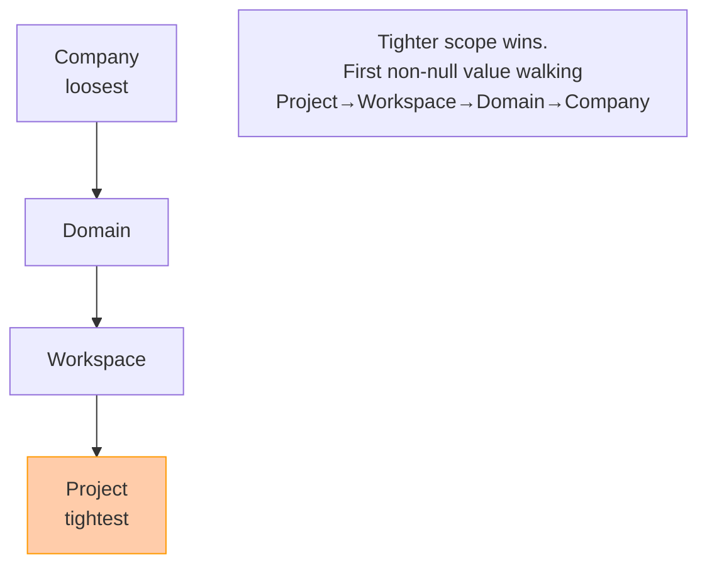
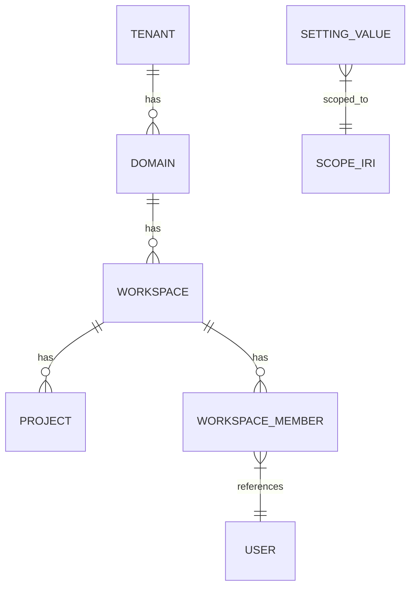

# Task: TASK-003 — Multi-tenant workspaces and 4-level settings cascade (PLAT-SETTINGS-1)

**Spec:** [weave-platform.md](../../../weave-platform.md) · **Contracts:** [contracts.md](../../../../contracts.md)

## Story

**Epic:** EPIC-003 Tenancy / Workspaces
**Priority:** Must Have

**As a** company administrator
**I want** to create workspaces within my tenant, invite members with role-scoped access, and configure settings that flow down to projects with tighter-level values winning
**So that** teams work in isolated contexts without manual per-project configuration of every setting.

## Acceptance Criteria

| ID | EARS Criterion | Test Mapping |
|----|----------------|--------------|
| AC-1 | WHEN an admin calls `POST /api/tenants/{tid}/workspaces`, THE SYSTEM SHALL create a new workspace, mint its named graph IRI (`urn:weave:tenant:{tid}:ws:{wid}`), return 201 with the workspace object, and reject a duplicate slug with 409. | unit: `test_workspace_create_and_reject_duplicate` |
| AC-2 | WHEN an admin calls `POST /api/workspaces/{wid}/members`, THE SYSTEM SHALL send an invitation email via Cognito, store the pending member record with role, and return 202; a subsequent call for an already-active member returns 409. | integration: `test_member_invite_and_duplicate_rejected` |
| AC-3 | WHEN a workspace admin revokes a member via `DELETE /api/workspaces/{wid}/members/{uid}`, THE SYSTEM SHALL remove the member's role binding, immediately invalidate any active sessions for that user in that workspace (session-version bump), and return 204. | integration: `test_member_revocation_invalidates_session` |
| AC-4 | WHEN a caller resolves a setting key via `GET /api/settings/{key}?context={iri}`, THE SYSTEM SHALL apply the cascade order Company→Domain→Workspace→Project, return the value from the tightest scope that has an explicit setting, and include the `resolved_at` scope in the response. | unit: `test_settings_cascade_tighter_wins` |
| AC-5 | WHEN a project-level setting is set, THE SYSTEM SHALL reject any caller attempting to set a looser override for the same key at workspace or domain level with 422 and error `"looser_override_rejected"`. | unit: `test_settings_looser_override_rejected` |
| AC-6 | WHEN a query is issued against any data store in tenant A's context, THE SYSTEM SHALL return zero rows from tenant B's data; an unscoped SPARQL query directed at the named-graph store SHALL be rejected with 400 `"unscoped_query_rejected"`, not silently broadened. | integration: `test_cross_tenant_read_isolation` **[mandatory]** |
| AC-7 | WHEN the authenticated user switches workspace via `POST /api/workspaces/{wid}/switch`, THE SYSTEM SHALL update the session's active workspace, rewrite the SPARQL query scope to the new workspace's named graph, and redirect to the workspace home within 1 s. | integration: `test_workspace_switch_scopes_query` |

## Implementation

### Pseudocode

```text
# Workspace creation (packages/backend/tenancy/workspaces.py)
def create_workspace(tid: str, slug: str, display_name: str, actor_iri: str) -> Workspace:
  if workspace_exists(tid, slug):
    raise Conflict("workspace_slug_taken")
  wid = new_uuid()
  named_graph_iri = f"urn:weave:tenant:{tid}:ws:{wid}"
  db.insert_workspace(tid, wid, slug, display_name, named_graph_iri)
  audit.emit(PLAT-AUDIT-1, actor=actor_iri, event="workspace.created", target=named_graph_iri)
  return Workspace(id=wid, named_graph_iri=named_graph_iri, ...)

# Settings cascade resolver (packages/backend/settings/resolver.py)
# Cascade order: Project (tightest) > Workspace > Domain > Company (loosest)
SCOPE_PRIORITY = ["project", "workspace", "domain", "company"]  # index 0 = tightest

def resolve_setting(key: str, context_iri: str) -> SettingValue:
  scope_chain = derive_scope_chain(context_iri)  # e.g. [project_iri, ws_iri, domain_iri, company_iri]
  for scope in scope_chain:  # tightest first
    val = db.get_setting(scope, key)
    if val is not None:
      return SettingValue(key=key, value=val, resolved_at=scope_label(scope))
  raise NotFound(f"no setting for key={key} in context={context_iri}")

def set_setting(key: str, scope_iri: str, value: Any, actor_iri: str):
  scope_level = scope_level_of(scope_iri)
  tighter_val = db.get_tighter_override(key, scope_iri)  # check child scopes
  if tighter_val is not None:
    raise UnprocessableEntity("looser_override_rejected")
  db.upsert_setting(scope_iri, key, value)
  audit.emit(PLAT-AUDIT-1, actor=actor_iri, event="setting.updated", target=scope_iri)

# SPARQL query rewriter (packages/backend/rdf/query_rewriter.py)
def rewrite_for_tenant(sparql: str, named_graph_iri: str) -> str:
  if not sparql.strip().upper().startswith("SELECT") and \
     not sparql.strip().upper().startswith("CONSTRUCT"):
    raise BadRequest("only SELECT/CONSTRUCT allowed via public API")
  if "FROM NAMED" in sparql.upper() or "GRAPH" not in sparql.upper():
    raise BadRequest("unscoped_query_rejected")
  # Rewrite GRAPH ?g to GRAPH <named_graph_iri> — reject SERVICE federation
  return rewrite_graph_clause(sparql, named_graph_iri)
```

### API Contracts

**Endpoint:** `POST /api/tenants/{tid}/workspaces`

**Request:**

```json
{ "slug": "eng-team", "display_name": "Engineering Team" }
```

**Response (201):**

```json
{
  "id": "<uuid>",
  "slug": "eng-team",
  "display_name": "Engineering Team",
  "named_graph_iri": "urn:weave:tenant:{tid}:ws:{wid}",
  "created_at": "2026-06-30T12:00:00Z"
}
```

**Response (409):** `{ "error": "workspace_slug_taken" }`

---

**Endpoint:** `GET /api/settings/{key}?context={iri}`

**Response (200):**

```json
{
  "key": "ai.budget.per_run_usd",
  "value": 5.00,
  "resolved_at": "workspace",
  "resolved_from_iri": "urn:weave:tenant:{tid}:ws:{wid}"
}
```

---

**Endpoint:** `PUT /api/settings/{key}`

**Request:**

```json
{
  "scope_iri": "urn:weave:tenant:{tid}:ws:{wid}",
  "value": 5.00
}
```

**Response (422):** `{ "error": "looser_override_rejected", "tighter_scope": "project" }`

### Diagram References

| Diagram | Notes |
|---------|-------|
| Settings cascade | Inline Mermaid below |
| Tenant data model | Inline Mermaid below |





### Design Decisions

| Decision | Source | Impact on This Task |
|----------|--------|---------------------|
| PLAT-SETTINGS-1: 4-level cascade, tighter-wins | contracts.md | Resolver walks Project→Workspace→Domain→Company; first non-null value wins |
| Named-graph-per-tenant with mandatory query rewriting | spec Key Decisions | `named_graph_iri` minted at workspace creation; unscoped SPARQL rejected (400), never broadened |
| PLAT-AUDIT-1 emitted for all mutations | contracts.md | Every workspace create, member invite/revoke, and setting change emits an audit event |
| Aurora PostgreSQL Serverless v2 for relational data | CLAUDE.md Data | Tenant/workspace/settings stored in Aurora; `tenant_id` column on every row, enforced by CHECK constraint |
| Session-version bump on member revocation | spec EPIC-004 | Revocation writes a new `session_version` to Aurora/Redis; per-request check in TASK-004 reads it |

## Test Requirements

### Unit Tests (minimum 4)

- `test_workspace_create_and_reject_duplicate` — create workspace; assert 201 and IRI shape; call again with same slug; assert 409
- `test_settings_cascade_tighter_wins` — seed Company and Workspace values for same key; resolve at workspace context; assert workspace value returned with `resolved_at="workspace"`
- `test_settings_looser_override_rejected` — seed Project value; attempt Workspace set; assert 422 `looser_override_rejected`
- `test_sparql_unscoped_query_rejected` — call rewriter without GRAPH clause; assert 400 `unscoped_query_rejected`

### Integration Tests (minimum 3)

- `test_cross_tenant_read_isolation` **(mandatory)** — seed rows in tenant A's Aurora table, named-graph, and S3 Vectors prefix; issue query from tenant B's authenticated context; assert zero rows returned from all three stores; assert unscoped SPARQL query is rejected, not broadened
- `test_member_invite_and_duplicate_rejected` — invite member; assert 202 and pending record; invite again; assert 409
- `test_member_revocation_invalidates_session` — invite + accept member; revoke; assert subsequent authenticated request from that user's session returns 401

### E2E Tests (minimum 1)

- `test_workspace_switch_scopes_query` — Playwright: sign in; switch to workspace B; assert page title reflects workspace B; assert SPARQL queries use workspace B's named graph IRI (inspect network request)

### AC-to-Test Mapping

| AC | Test Type | Test Name |
|----|-----------|-----------|
| AC-1 | Unit | `test_workspace_create_and_reject_duplicate` |
| AC-2 | Integration | `test_member_invite_and_duplicate_rejected` |
| AC-3 | Integration | `test_member_revocation_invalidates_session` |
| AC-4 | Unit | `test_settings_cascade_tighter_wins` |
| AC-5 | Unit | `test_settings_looser_override_rejected` |
| AC-6 | Integration | `test_cross_tenant_read_isolation` **(mandatory)** |
| AC-7 | E2E | `test_workspace_switch_scopes_query` |

## Dependencies

- **blocked_by:** TASK-001 (repository scaffold and IaC)
- **unlocks:** TASK-004 (RBAC binds to workspace membership), TASK-008 (billing cascade resolved per workspace)

## Cost Estimate

- **Complexity:** L
- **Estimated tokens:** ~50K input, ~25K output
- **Estimated cost:** ~$3

## Definition of Ready Checklist

- [ ] User story clear
- [ ] All ACs have mapped tests
- [ ] Pseudocode provided
- [ ] API contracts defined
- [ ] Cross-tenant isolation test specified
- [ ] Design decisions noted
- [ ] TASK-001 complete

## Definition of Done Checklist

- [ ] All ACs met
- [ ] `test_cross_tenant_read_isolation` passes against Aurora, Oxigraph, and S3 Vectors
- [ ] Unscoped SPARQL query returns 400, not 200 with broadened results
- [ ] `tenant_id` CHECK constraint in Aurora migrations
- [ ] All settings mutations emit PLAT-AUDIT-1 events
- [ ] Coverage ≥80% for tenancy and settings modules
- [ ] Conventional commit created (`feat: add workspace CRUD and settings cascade`)

## Implementation Hints

- The `named_graph_iri` format (`urn:weave:tenant:{tid}:ws:{wid}`) must be minted atomically with workspace creation — use a DB transaction so a failed IRI registration doesn't leave an orphan workspace record.
- For SPARQL query rewriting, use `rdflib`'s `prepareQuery` parser to detect the GRAPH clause reliably rather than string-matching; string matching on `GRAPH` will break on variable names and comments.
- The settings resolver should cache resolved values in Redis with a short TTL (30 s) keyed by `(context_iri, key)` — a settings change must invalidate the relevant cache prefix.
- Add a DB-level `tenant_id` column to every Aurora table and a `POLICY` row-security rule in PostgreSQL so cross-tenant reads fail at the DB layer, not just at the application layer.
- The `session_version` field for revocation (see AC-3) is an integer stored per `(tenant_id, user_id)` in Redis; the JWT carries the version at issue time; per-request middleware compares them.

---

*Generated by Weave Architect skill (arch-task-brief). Self-contained — engineer reads only this file.*
