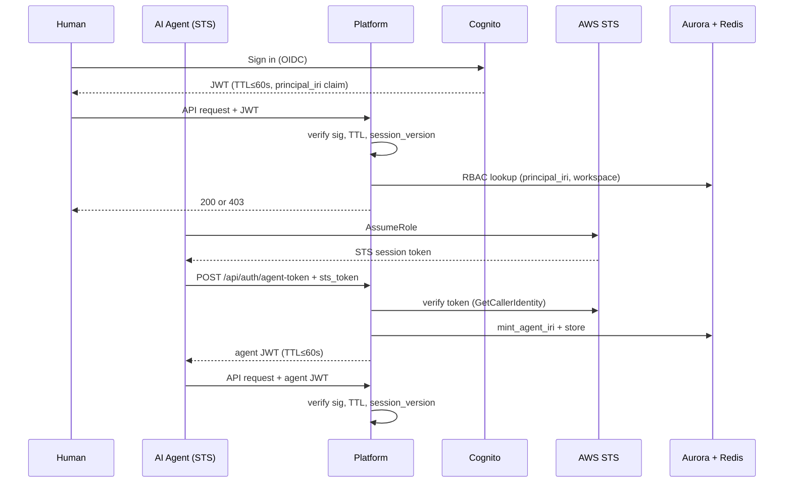

# Task: TASK-004 — RBAC enforcement and agent identity registry (PLAT-IDENTITY-1)

**Spec:** [weave-platform.md](../../../weave-platform.md) · **Contracts:** [contracts.md](../../../../contracts.md)

## Story

**Epic:** EPIC-004 Auth / RBAC
**Priority:** Must Have

**As a** platform security boundary
**I want** every request — whether from a human user or an AI agent — to carry a resolvable principal IRI and to be checked against RBAC rules before touching any resource
**So that** a misconfigured agent or a revoked user can never read or mutate data they are not currently permitted to access.

## Acceptance Criteria

| ID | EARS Criterion | Test Mapping |
|----|----------------|--------------|
| AC-1 | WHEN a human user authenticates via Cognito, THE SYSTEM SHALL mint a canonical principal IRI (`urn:weave:principal:user:{cognito_sub}`) on first login, store it in Aurora, and embed it in the JWT `principal_iri` claim; subsequent logins return the same IRI. | unit: `test_principal_iri_minted_idempotent` |
| AC-2 | WHEN an AI agent authenticates via STS (IAM role assumption), THE SYSTEM SHALL mint a canonical agent IRI (`urn:weave:principal:agent:{iam_role_arn_hash}`), store it in the agent registry, and return a short-lived agent token (TTL ≤60 s). | integration: `test_agent_sts_auth_mints_iri` |
| AC-3 | WHEN any API endpoint is called, THE SYSTEM SHALL verify the JWT signature, check the `principal_iri` claim against the RBAC table for the requested resource, and return 403 with `{"error":"forbidden","required_role":"<role>"}` if the role is insufficient. | unit: `test_rbac_insufficient_role_returns_403` |
| AC-4 | WHEN a member has been revoked (session-version bumped by TASK-003), THE SYSTEM SHALL detect the stale `session_version` claim in the JWT on the next request and return 401 `{"error":"session_revoked"}` — not 403. | integration: `test_revoked_session_returns_401` |
| AC-5 | WHEN a request arrives with a JWT whose TTL exceeds 60 seconds (e.g. a misconfigured token), THE SYSTEM SHALL reject it with 401 `{"error":"token_ttl_exceeded"}`. | unit: `test_jwt_ttl_over_60s_rejected` |
| AC-6 | WHEN `GET /api/principals/{iri}` is called by an admin, THE SYSTEM SHALL return the principal record (type: user or agent, name, workspace memberships, created_at) and 404 for an unknown IRI. | unit: `test_principal_lookup_by_iri` |
| AC-7 | WHEN `GET /api/agents` is called with workspace scope, THE SYSTEM SHALL return only agents registered within the caller's tenant's workspace — never agents from another tenant. | integration: `test_agent_registry_tenant_scoped` |

## Implementation

### Pseudocode

```text
# RBAC middleware (packages/backend/auth/rbac.py)
def require_role(minimum_role: str):
  def decorator(handler):
    def wrapper(request):
      jwt = verify_signature(request.headers["Authorization"])
      if jwt.exp - now() > 60:          # TTL guard (AC-5)
        raise Unauthorized("token_ttl_exceeded")
      principal = resolve_principal(jwt["principal_iri"])
      session_ver = redis.get(f"session_version:{principal.tenant}:{principal.id}")
      if session_ver and int(session_ver) > jwt["session_version"]:
        raise Unauthorized("session_revoked")  # AC-4
      workspace = derive_workspace(request)
      role = rbac_table.get(principal.id, workspace.id)
      if role_rank(role) < role_rank(minimum_role):
        raise Forbidden("forbidden", required_role=minimum_role)  # AC-3
      request.principal = principal
      return handler(request)
    return wrapper
  return decorator

# Principal IRI minting (packages/backend/auth/identity.py)
def mint_user_iri(cognito_sub: str) -> str:
  iri = f"urn:weave:principal:user:{cognito_sub}"
  if not db.principal_exists(iri):
    db.insert_principal(iri, type="user", created_at=now())
  return iri  # idempotent (AC-1)

def mint_agent_iri(iam_role_arn: str) -> str:
  arn_hash = sha256(iam_role_arn)[:16]
  iri = f"urn:weave:principal:agent:{arn_hash}"
  if not db.principal_exists(iri):
    db.insert_principal(iri, type="agent", source_arn=iam_role_arn, created_at=now())
    audit.emit(PLAT-AUDIT-1, actor=iri, event="agent.registered", target=iri)
  return iri  # idempotent

# RBAC levels ordered by capability (weakest → strongest) — SSOT: rbac-multi-tenancy.md + ADR-002
ROLE_RANK = { "read": 0, "author": 1, "publish": 2, "admin": 3 }
```

### API Contracts

**Endpoint:** `GET /api/principals/{iri}`

**Response (200):**

```json
{
  "iri": "urn:weave:principal:user:abc123",
  "type": "user",
  "display_name": "Alice",
  "workspace_memberships": [
    { "workspace_id": "<wid>", "role": "author" }
  ],
  "created_at": "2026-06-30T12:00:00Z"
}
```

**Response (404):** `{ "error": "principal_not_found" }`

---

**Endpoint:** `GET /api/agents?workspace_id={wid}`

**Response (200):**

```json
{
  "agents": [
    {
      "iri": "urn:weave:principal:agent:deadbeef12345678",
      "display_name": "Build Engine Worker",
      "last_auth_at": "2026-06-30T11:00:00Z"
    }
  ]
}
```

---

**Endpoint:** `POST /api/auth/agent-token`

**Request:**

```json
{ "sts_token": "<sts_session_token>", "workspace_id": "<wid>" }
```

**Response (200):**

```json
{
  "agent_token": "<jwt>",
  "principal_iri": "urn:weave:principal:agent:deadbeef12345678",
  "expires_in": 60
}
```

**Response (401):** `{ "error": "sts_validation_failed" }`

### Diagram References

| Diagram | Notes |
|---------|-------|
| Auth paths: human vs. agent | Inline Mermaid below |



### Design Decisions

| Decision | Source | Impact on This Task |
|----------|--------|---------------------|
| PLAT-IDENTITY-1: canonical principal IRI for all actors | contracts.md | Human IRI uses Cognito sub; agent IRI uses IAM role ARN hash; same RBAC path for both |
| JWT TTL ≤60 s; machine auth = STS (NOT Cognito) | spec Key Decisions | STS GetCallerIdentity validates agent tokens; human tokens auto-refresh (TASK-002) |
| Per-request session-version check for instant revocation | spec Key Decisions | Session version stored in Redis; stale JWT returns 401 immediately without waiting for TTL |
| RBAC levels: read / author / publish / admin | rbac-multi-tenancy.md + weave-platform.md role table + ADR-002 (SSOT) | Four ordered levels (read ≺ author ≺ publish ≺ admin); role_rank() determines sufficiency; no custom permissions in M1 |
| PLAT-AUDIT-1 emitted on agent registration | contracts.md | All identity mutations are auditable |

## Test Requirements

### Unit Tests (minimum 4)

- `test_principal_iri_minted_idempotent` — call `mint_user_iri` twice with same Cognito sub; assert same IRI returned and only one DB row
- `test_rbac_insufficient_role_returns_403` — call endpoint requiring `admin` with an `author` JWT; assert 403 with `required_role: "admin"`
- `test_jwt_ttl_over_60s_rejected` — forge JWT with `exp = now + 120s`; assert middleware returns 401 `token_ttl_exceeded`
- `test_principal_lookup_by_iri` — seed principal; call `GET /api/principals/{iri}`; assert name and memberships; call with unknown IRI; assert 404

### Integration Tests (minimum 3)

- `test_agent_sts_auth_mints_iri` — mock STS GetCallerIdentity; call agent-token endpoint; assert 200, `principal_iri` is `urn:weave:principal:agent:*`, TTL ≤60 s
- `test_revoked_session_returns_401` — sign in; bump session-version in Redis; make subsequent request with old JWT; assert 401 `session_revoked`
- `test_agent_registry_tenant_scoped` — register agent in tenant A; query `GET /api/agents` from tenant B context; assert empty list returned

### E2E Tests (minimum 1)

- `test_rbac_author_cannot_delete` — Playwright: sign in as an `author`-level user; attempt to delete a workspace resource (requires `admin`); assert 403 error shown in UI; assert no deletion occurred

### AC-to-Test Mapping

| AC | Test Type | Test Name |
|----|-----------|-----------|
| AC-1 | Unit | `test_principal_iri_minted_idempotent` |
| AC-2 | Integration | `test_agent_sts_auth_mints_iri` |
| AC-3 | Unit | `test_rbac_insufficient_role_returns_403` |
| AC-4 | Integration | `test_revoked_session_returns_401` |
| AC-5 | Unit | `test_jwt_ttl_over_60s_rejected` |
| AC-6 | Unit | `test_principal_lookup_by_iri` |
| AC-7 | Integration | `test_agent_registry_tenant_scoped` |

## Dependencies

- **blocked_by:** TASK-002 (Cognito JWT verification and refresh logic built there), TASK-003 (workspace/tenant model and session-version bump)
- **unlocks:** TASK-005 (nav/dashboard require RBAC), TASK-006 (connector config requires tenant-scoped RBAC), TASK-009 (audit requires principal IRIs)

## Cost Estimate

- **Complexity:** L
- **Estimated tokens:** ~45K input, ~22K output
- **Estimated cost:** ~$3

## Definition of Ready Checklist

- [ ] User story clear
- [ ] All ACs have mapped tests
- [ ] Pseudocode provided
- [ ] API contracts defined
- [ ] Design decisions noted
- [ ] TASK-002 complete (Cognito auth layer and JWT handling in place)
- [ ] TASK-003 complete (workspace/tenant data model and session-version bump in place)

## Definition of Done Checklist

- [ ] All ACs met
- [ ] No JWT with TTL >60 s ever returns 200
- [ ] Session revocation takes effect on the next request (no async delay)
- [ ] Agent registry returns 0 records from another tenant
- [ ] PLAT-AUDIT-1 event emitted on every agent registration
- [ ] Coverage ≥80% for auth, RBAC, and identity modules
- [ ] Conventional commit: `feat: add RBAC enforcement and agent identity registry`

## Implementation Hints

- Use `python-jose` or `pyjwt` for JWT verification — validate `iss`, `aud`, `exp`, `iat`, and the custom `session_version` claim in a single pass; never skip any field.
- The RBAC check must happen in middleware, not in handler functions — every new endpoint is protected by default; opting out requires an explicit `@public` decorator that is code-reviewed.
- Store `session_version` as a Redis hash: `HSET session_versions {tenant_id}:{user_id} version {n}` — a hash rather than separate keys scales better and is atomic to update on revocation.
- The STS `GetCallerIdentity` call has a small cost (~0.1 ms); cache the result keyed on the STS session token SHA-256 for the token's remaining TTL (max 60 s) to avoid repeated round-trips.
- ROLE_RANK must be in a single authoritative location; adding a new role later requires updating only that dict and re-running the test suite.

---

*Generated by Weave Architect skill (arch-task-brief). Self-contained — engineer reads only this file.*
