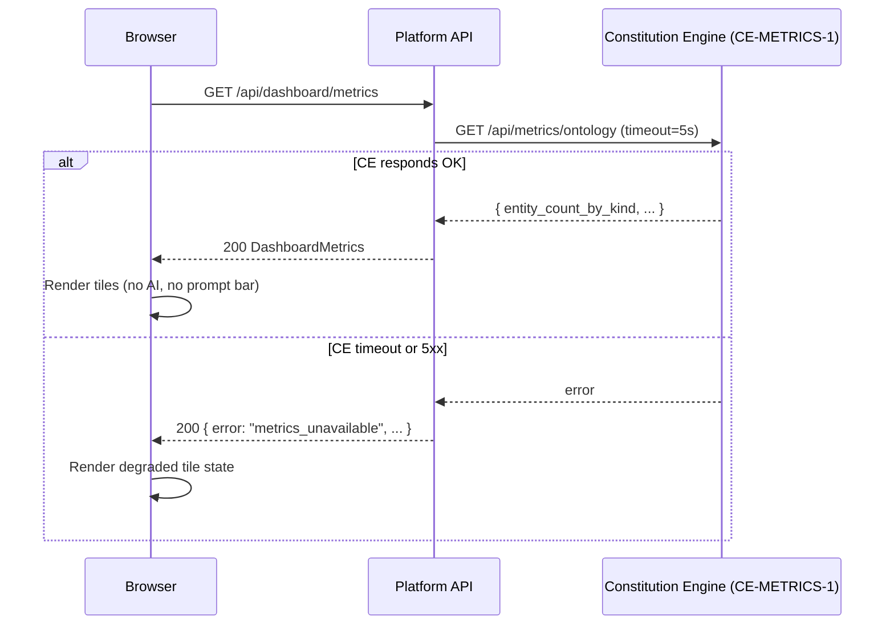

# Task: TASK-005 — Global navigation, search, and fixed CE-sourced dashboard (M1)

**Spec:** [weave-platform.md](../../../weave-platform.md) · **Contracts:** [contracts.md](../../../../contracts.md)

## Story

**Epic:** EPIC-005 Global Nav + Search; EPIC-001 Dashboard (E1-S0 M1 fixed surface only)
**Priority:** Must Have

**As a** signed-in user
**I want** a persistent navigation bar that shows me the seven product areas, a keyboard-accessible search that finds any entity across the graph, and a landing dashboard that surfaces ontology health metrics from the Constitution Engine
**So that** I can orient myself within Weave immediately and reach any part of the platform without context-switching.

## Acceptance Criteria

| ID | EARS Criterion | Test Mapping |
|----|----------------|--------------|
| AC-1 | WHEN a signed-in user views any page, THE SYSTEM SHALL render the top navigation bar with the seven area links (Platform, Constitution Engine, Build Engine, Events & Actions, Graph Explorer, Onboarding, Settings) and highlight the active area. | unit: `test_nav_renders_seven_areas` |
| AC-2 | WHEN the user presses Cmd+K (or Ctrl+K), THE SYSTEM SHALL open the global search palette with an input field, focus the field, and dismiss on Escape. | E2E: `test_cmd_k_opens_search_palette` |
| AC-3 | WHEN the user types 2+ characters in the global search palette, THE SYSTEM SHALL display matching entity results (label + kind + IRI) from the active tenant's named graph within 300 ms; results from another tenant SHALL NOT appear. | integration: `test_global_search_returns_tenant_scoped_results` |
| AC-4 | WHEN the user selects a search result, THE SYSTEM SHALL navigate to the entity's detail URL (`/ce/resource?iri={encoded_iri}`) without a full page reload. | E2E: `test_search_result_navigates_to_detail` |
| AC-5 | WHEN the dashboard page loads, THE SYSTEM SHALL call `GET /api/metrics/ontology` (CE-METRICS-1) and render tiles for `entity_count_by_kind`, `latest_version`, `draft_published_delta`, and `shacl_errors_by_severity`; no prompt bar or AI composition surface SHALL be present. | integration: `test_dashboard_renders_ce_metrics_tiles` |
| AC-6 | WHEN CE-METRICS-1 is unavailable (timeout or 5xx), THE SYSTEM SHALL render each affected tile in an error state showing "Metrics unavailable — Constitution Engine offline" and a last-updated timestamp, without crashing the page. | unit: `test_dashboard_tile_degraded_state` |
| AC-7 | WHEN the dashboard renders metrics tiles, THE SYSTEM SHALL display a footer label identifying the data source as "Constitution Engine" with a link to the CE status endpoint. | unit: `test_dashboard_data_source_footer` |
| AC-8 | WHEN the user opens the help launcher (? icon in nav), THE SYSTEM SHALL open a contextual help panel without navigating away from the current page. | E2E: `test_help_launcher_opens_panel` |

## Implementation

### Pseudocode

```text
# Dashboard data fetcher (packages/backend/dashboard/metrics.py)
def get_dashboard_metrics(tenant_id: str, actor_iri: str) -> DashboardMetrics:
  try:
    resp = ce_client.get("/api/metrics/ontology", timeout=5.0)
    resp.raise_for_status()
    data = resp.json()
    return DashboardMetrics(
      entity_count_by_kind=data["entity_count_by_kind"],
      latest_version=data["latest_version"],
      draft_published_delta=data["draft_published_delta"],
      shacl_errors_by_severity=data["shacl_errors_by_severity"],
      owl_inconsistencies=data["owl_inconsistencies"],
      fetched_at=now(),
      source="Constitution Engine",
    )
  except (Timeout, HTTPError) as e:
    return DashboardMetrics(error=str(e), fetched_at=now(), source="Constitution Engine")
  # No generative/AI composition at M1 — fixed tiles only

# Global search (packages/backend/search/sparql_search.py)
def search_entities(query: str, named_graph_iri: str, limit: int = 20) -> list[EntityResult]:
  if len(query) < 2:
    return []
  sparql = f"""
    SELECT ?iri ?label ?kind WHERE {{
      GRAPH <{named_graph_iri}> {{
        ?iri rdfs:label ?label ;
             a ?kind .
        FILTER(CONTAINS(LCASE(STR(?label)), LCASE("{sanitize(query)}")))
      }}
    }} LIMIT {limit}
  """
  # named_graph_iri is tenant-scoped — TASK-003 rewriter enforces this
  return oxigraph.select(sparql)
```

### API Contracts

**Endpoint:** `GET /api/dashboard/metrics`

**Response (200):**

```json
{
  "entity_count_by_kind": { "BusinessDomain": 5, "System": 12 },
  "latest_version": "v0.4.1",
  "draft_published_delta": 3,
  "shacl_errors_by_severity": { "violation": 0, "warning": 2 },
  "owl_inconsistencies": 0,
  "fetched_at": "2026-06-30T12:00:00Z",
  "source": "Constitution Engine",
  "source_url": "/api/ce/health"
}
```

**Response (200, CE unavailable):**

```json
{
  "error": "metrics_unavailable",
  "message": "Constitution Engine offline",
  "fetched_at": "2026-06-30T12:00:00Z",
  "source": "Constitution Engine"
}
```

---

**Endpoint:** `GET /api/search?q={query}&workspace_id={wid}`

**Response (200):**

```json
{
  "results": [
    {
      "iri": "urn:weave:tenant:t1:ws:w1:concept:PaymentProcessing",
      "label": "Payment Processing",
      "kind": "BusinessCapability"
    }
  ],
  "total": 1
}
```

### Diagram References

| Diagram | Notes |
|---------|-------|
| Dashboard data flow | Inline Mermaid below |



### Design Decisions

| Decision | Source | Impact on This Task |
|----------|--------|---------------------|
| CE-METRICS-1: `GET /api/metrics/ontology` | contracts.md CE-METRICS-1 | Platform proxies this call; no direct frontend→CE call (avoids CORS + auth duplication) |
| Fixed dashboard M1 — no prompt bar, no AI composition | spec EPIC-001 E1-S0 | The generative surface (E1-S1..S7) is M2; explicitly excluded from this task |
| Global search uses tenant-scoped SPARQL | spec EPIC-005 + TASK-003 | `named_graph_iri` passed from TASK-003 session context; queries reject unscoped form |
| PLAT-IDENTITY-1 principal_iri in search audit | contracts.md | Search calls logged to PLAT-AUDIT-1 so queries are attributable |
| shadcn/ui cmdk for global search palette | CLAUDE.md stack | `cmdk` is a dependency of shadcn; keyboard-accessible out of the box |

## Test Requirements

### Unit Tests (minimum 4)

- `test_nav_renders_seven_areas` — render nav component; assert all seven area labels present and the active area has `aria-current="page"`
- `test_dashboard_tile_degraded_state` — mock CE client to timeout; call `get_dashboard_metrics`; assert error field populated and page does not throw
- `test_dashboard_data_source_footer` — render dashboard; assert footer text contains "Constitution Engine" with link to CE status endpoint
- `test_search_sanitizes_query` — pass SPARQL injection string as query; assert sanitized before embedding in SPARQL template

### Integration Tests (minimum 2)

- `test_global_search_returns_tenant_scoped_results` — seed entity in tenant A's named graph and tenant B's named graph; search from tenant A context; assert only tenant A entity returned
- `test_dashboard_renders_ce_metrics_tiles` — mock CE-METRICS-1 response; call `GET /api/dashboard/metrics`; assert all five tile fields present in response

### E2E Tests (minimum 2)

- `test_cmd_k_opens_search_palette` — Playwright: press Cmd+K; assert search input focused; type "Payment"; assert results appear within 300 ms; press Escape; assert palette closed
- `test_search_result_navigates_to_detail` — select a result; assert URL changes to `/ce/resource?iri=...` without full page reload (assert no navigation event fired)
- `test_help_launcher_opens_panel` — click ? icon; assert help panel visible; assert no URL change

### AC-to-Test Mapping

| AC | Test Type | Test Name |
|----|-----------|-----------|
| AC-1 | Unit | `test_nav_renders_seven_areas` |
| AC-2 | E2E | `test_cmd_k_opens_search_palette` |
| AC-3 | Integration | `test_global_search_returns_tenant_scoped_results` |
| AC-4 | E2E | `test_search_result_navigates_to_detail` |
| AC-5 | Integration | `test_dashboard_renders_ce_metrics_tiles` |
| AC-6 | Unit | `test_dashboard_tile_degraded_state` |
| AC-7 | Unit | `test_dashboard_data_source_footer` |
| AC-8 | E2E | `test_help_launcher_opens_panel` |

## Dependencies

- **blocked_by:** TASK-002 (app shell and auth layer), TASK-004 (RBAC — search scoped to authenticated principal's tenant)
- **unlocks:** TASK-009 (audit trail views linked from nav)

## Cost Estimate

- **Complexity:** M
- **Estimated tokens:** ~35K input, ~18K output
- **Estimated cost:** ~$2

## Definition of Ready Checklist

- [ ] User story clear
- [ ] All ACs have mapped tests
- [ ] Pseudocode provided
- [ ] CE-METRICS-1 contract confirmed (contracts.md)
- [ ] Dashboard M1 scope confirmed: fixed tiles only, no prompt bar
- [ ] Design decisions noted
- [ ] TASK-002 and TASK-004 complete

## Definition of Done Checklist

- [ ] All ACs met
- [ ] Dashboard renders with zero AI surface in M1 (no prompt bar, no generate button)
- [ ] CE offline state shows degraded tile — page does not crash
- [ ] Search results scoped to caller's tenant only
- [ ] Nav keyboard-navigable (Tab, Enter) with `aria-current` on active area
- [ ] WCAG 2.1 AA verified (axe passes on nav and dashboard)
- [ ] Coverage ≥80% for dashboard and search modules
- [ ] Conventional commit: `feat: add global nav, search, and fixed CE dashboard`

## Implementation Hints

- Use `cmdk` (already a shadcn dependency) for the Cmd+K search palette — it handles keyboard traps, focus management, and screen reader announcements correctly.
- The CE-METRICS-1 call should have a circuit breaker (3 failures within 30 s → open for 60 s) so a slow CE doesn't cascade into slow dashboard loads.
- SPARQL injection prevention: use parameterised queries if Oxigraph supports them; otherwise use an allowlist sanitiser on the query string before interpolation (strip `<`, `>`, `"`, `{`, `}`, `;`).
- The `draft_published_delta` tile should show a coloured badge (green = 0, amber = 1–5, red = 6+) — this is a fixed display decision, not user-configurable in M1.
- Keep the dashboard route a Server Component that fetches CE-METRICS-1 on the server; avoid client-side fetch for this surface — it simplifies auth header passing and avoids CORS.

---

*Generated by Weave Architect skill (arch-task-brief). Self-contained — engineer reads only this file.*
