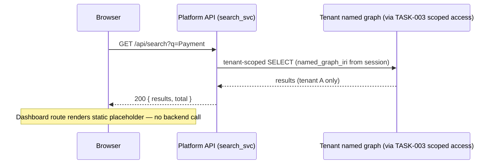

# Task: TASK-005 — Global navigation, search, and dashboard shell (M1)

**Spec:** [weave-platform.md](../../../weave-platform.md) · **Contracts:** [contracts.md](../../../../contracts.md)

> **M2 scope note (2026-07-02):** the fixed CE-sourced dashboard tiles (E1-S0) moved to **M2** — they
> consume `CE-METRICS-1`, which is a CE M2 contract, and Platform M1 must have no upstream engine
> dependency. M1 delivers the dashboard **route and layout with a defined placeholder/empty state** and
> zero CE calls. The tile implementation lands at M2 alongside the generative surface (EPIC-001).

## Story

**Epic:** EPIC-005 Global Nav + Search; EPIC-001 Dashboard (M1 shell only — E1-S0 tiles are M2)
**Priority:** Must Have

**As a** signed-in user
**I want** a persistent navigation bar that shows me the seven product areas, a keyboard-accessible search that finds any entity across the graph, and a dashboard landing route that clearly tells me what will appear there once the Constitution Engine is live
**So that** I can orient myself within Weave immediately and reach any part of the platform without context-switching.

## Acceptance Criteria

| ID | EARS Criterion | Test Mapping |
|----|----------------|--------------|
| AC-1 | WHEN a signed-in user views any page, THE SYSTEM SHALL render the top navigation bar with the seven area links (Platform, Constitution Engine, Build Engine, Events & Actions, Graph Explorer, Onboarding, Settings) and highlight the active area. | unit: `test_nav_renders_seven_areas` |
| AC-2 | WHEN the user presses Cmd+K (or Ctrl+K), THE SYSTEM SHALL open the global search palette with an input field, focus the field, and dismiss on Escape. | E2E: `test_cmd_k_opens_search_palette` |
| AC-3 | WHEN the user types 2+ characters in the global search palette, THE SYSTEM SHALL display matching entity results (label + kind + IRI) from the active tenant's named graph within 300 ms; results from another tenant SHALL NOT appear. | integration: `test_global_search_returns_tenant_scoped_results` |
| AC-4 | WHEN the user selects a search result, THE SYSTEM SHALL navigate to the entity's detail URL (`/ce/resource?iri={encoded_iri}`) without a full page reload. | E2E: `test_search_result_navigates_to_detail` |
| AC-5 | WHEN the dashboard route loads at M1, THE SYSTEM SHALL render the defined placeholder/empty state ("Your dashboard activates with the Constitution Engine") with the dashboard grid layout present, and SHALL NOT issue any CE contract call; no prompt bar or AI composition surface SHALL be present. | integration: `test_dashboard_renders_placeholder_no_ce_call` |
| AC-6 | WHEN the dashboard placeholder renders, THE SYSTEM SHALL show a footer label naming the future data source ("Constitution Engine — available at M2") so the empty state is legible, not broken-looking. | unit: `test_dashboard_placeholder_footer` |
| AC-7 | WHEN the user opens the help launcher (? icon in nav), THE SYSTEM SHALL open a contextual help panel without navigating away from the current page. | E2E: `test_help_launcher_opens_panel` |

## Implementation

### Pseudocode

```text
# Dashboard route (packages/web/app/(shell)/dashboard/page.tsx)
# M1: pure placeholder Server Component — NO data fetch, NO CE client import.
def DashboardPage():
  return DashboardGrid(
    empty_state=EmptyState(
      headline="Your dashboard activates with the Constitution Engine",
      body="Ontology health tiles appear here once your model is live (M2).",
      footer="Constitution Engine — available at M2",
    )
  )
  # Guard: importing the CE client in this module is a test failure at M1
  # (test_dashboard_renders_placeholder_no_ce_call asserts zero outbound CE requests)

# Global search (packages/backend/search/sparql_search.py)
def search_entities(query: str, named_graph_iri: str, limit: int = 20) -> list[EntityResult]:
  if len(query) < 2:
    return []
  sparql = f"""
    SELECT ?iri ?label ?kind WHERE {{
      GRAPH <{named_graph_iri}> {{
        ?iri rdfs:label ?label ;
             a ?kind .
        FILTER(CONTAINS(LCASE(STR(?label)), LCASE("{sanitize(query)}")))
      }}
    }} LIMIT {limit}
  """
  # named_graph_iri is tenant-scoped — TASK-003 rewriter enforces this (ADR-001)
  return oxigraph.select(sparql)
```

### API Contracts

**Endpoint:** `GET /api/search?q={query}&workspace_id={wid}`

**Response (200):**

```json
{
  "results": [
    {
      "iri": "urn:weave:tenant:t1:ws:w1:concept:PaymentProcessing",
      "label": "Payment Processing",
      "kind": "BusinessCapability"
    }
  ],
  "total": 1
}
```

No dashboard data endpoint ships in this task — `GET /api/dashboard/metrics` (CE-METRICS-1 proxy)
is specified in the M2 tile task and MUST NOT be scaffolded here.

### Diagram References

| Diagram | Notes |
|---------|-------|
| System context + containers | [`tech-spec/architecture.md`](../../tech-spec/architecture.md) — L1/L2 show the SPA shell boundary and the CE-contract egress this task must NOT use at M1 |
| Platform API components | [`tech-spec/architecture.md`](../../tech-spec/architecture.md) L3 — `search_svc` and `ce_client`; search goes through `search_svc`, never a direct SPARQL connection |
| Search flow | Inline Mermaid below |



### Design Decisions

| Decision | Source | Impact on This Task |
|----------|--------|---------------------|
| E1-S0 fixed tiles moved to M2 | roadmap M1 (2026-07-02 fix); `CE-METRICS-1` is a CE M2 contract | M1 dashboard is a placeholder route; zero CE dependency; tile work explicitly out of scope |
| Placeholder is a designed empty state, not a blank page | design system `docs/standards/design/` empty-state pattern | Empty state has headline, body, footer; axe-clean; no spinner |
| Global search uses tenant-scoped SPARQL | spec EPIC-005 + TASK-003 + ADR-001 | `named_graph_iri` passed from TASK-003 session context; queries reject unscoped form |
| PLAT-IDENTITY-1 principal_iri in search audit | contracts.md | Search calls logged to PLAT-AUDIT-1 so queries are attributable |
| shadcn/ui cmdk for global search palette | CLAUDE.md stack | `cmdk` is a dependency of shadcn; keyboard-accessible out of the box |

## Test Requirements

### Unit Tests (minimum 3)

- `test_nav_renders_seven_areas` — render nav component; assert all seven area labels present and the active area has `aria-current="page"`
- `test_dashboard_placeholder_footer` — render dashboard; assert footer text "Constitution Engine — available at M2" present
- `test_search_sanitizes_query` — pass SPARQL injection string as query; assert sanitized before embedding in SPARQL template

### Integration Tests (minimum 2)

- `test_global_search_returns_tenant_scoped_results` — seed entity in tenant A's named graph and tenant B's named graph; search from tenant A context; assert only tenant A entity returned
- `test_dashboard_renders_placeholder_no_ce_call` — load dashboard route with an HTTP recorder on all outbound requests; assert placeholder markup rendered AND zero requests to any CE endpoint

### E2E Tests (minimum 3)

- `test_cmd_k_opens_search_palette` — Playwright: press Cmd+K; assert search input focused; type "Payment"; assert results appear within 300 ms; press Escape; assert palette closed
- `test_search_result_navigates_to_detail` — select a result; assert URL changes to `/ce/resource?iri=...` without full page reload (assert no navigation event fired)
- `test_help_launcher_opens_panel` — click ? icon; assert help panel visible; assert no URL change

### AC-to-Test Mapping

| AC | Test Type | Test Name |
|----|-----------|-----------|
| AC-1 | Unit | `test_nav_renders_seven_areas` |
| AC-2 | E2E | `test_cmd_k_opens_search_palette` |
| AC-3 | Integration | `test_global_search_returns_tenant_scoped_results` |
| AC-4 | E2E | `test_search_result_navigates_to_detail` |
| AC-5 | Integration | `test_dashboard_renders_placeholder_no_ce_call` |
| AC-6 | Unit | `test_dashboard_placeholder_footer` |
| AC-7 | E2E | `test_help_launcher_opens_panel` |

## Dependencies

- **blocked_by:** TASK-002 (app shell and auth layer), TASK-004 (RBAC — search scoped to authenticated principal's tenant)
- **unlocks:** TASK-009 (audit trail views linked from nav)

## Cost Estimate

- **Complexity:** M
- **Estimated tokens:** ~30K input, ~15K output
- **Estimated cost:** ~$2

## Definition of Ready Checklist

- [ ] User story clear
- [ ] All ACs have mapped tests
- [ ] Pseudocode provided
- [ ] Dashboard M1 scope confirmed: placeholder route only, zero CE calls (E1-S0 tiles are M2)
- [ ] Empty-state pattern confirmed in `docs/standards/design/`
- [ ] Design decisions noted
- [ ] TASK-002 and TASK-004 complete

## Definition of Done Checklist

- [ ] All ACs met
- [ ] Dashboard renders with zero AI surface and zero CE calls in M1 (no prompt bar, no generate button, no metrics fetch)
- [ ] Search results scoped to caller's tenant only
- [ ] Nav keyboard-navigable (Tab, Enter) with `aria-current` on active area
- [ ] WCAG 2.1 AA verified (axe passes on nav and dashboard placeholder)
- [ ] Coverage ≥80% for search and shell modules
- [ ] Conventional commit: `feat: add global nav, search, and dashboard shell`

## Implementation Hints

- Use `cmdk` (already a shadcn dependency) for the Cmd+K search palette — it handles keyboard traps, focus management, and screen reader announcements correctly.
- Keep the dashboard route a Server Component rendering static content — no data fetch at M1. Lay out the grid container now so the M2 tile task drops tiles into an existing, tested layout.
- SPARQL injection prevention: use parameterised queries if Oxigraph supports them; otherwise use an allowlist sanitiser on the query string before interpolation (strip `<`, `>`, `"`, `{`, `}`, `;`).
- Testing patterns and fixtures for the tenant-scoped search integration test: see [`tech-spec/testing-strategy.md`](../../tech-spec/testing-strategy.md) §3 (two-tenant seed) — QA extends from the same fixtures.

---

*Generated by Weave Architect skill (arch-task-brief). Self-contained — engineer reads only this file.*
