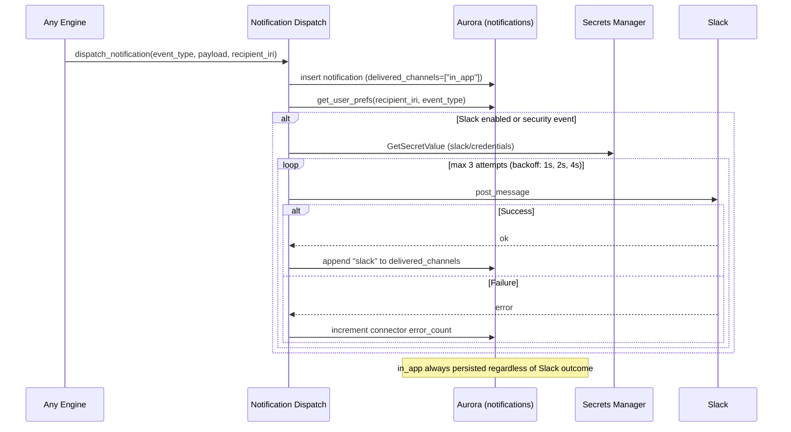

# Task: TASK-007 — Notifications (PLAT-NOTIFY-1)

**Spec:** [weave-platform.md](../../../weave-platform.md) · **Contracts:** [contracts.md](../../../../contracts.md)

## Story

**Epic:** EPIC-006 Notifications
**Priority:** Must Have

**As a** platform user
**I want** to receive notifications about important events (workspace changes, job completions, failures, security alerts) in-app and optionally in Slack
**So that** I stay informed without polling the platform manually and can configure which channels I care about.

## Acceptance Criteria

> **M1 scope note (2026-07-02):** managed connectors (TASK-006) moved to v1.0, so M1 delivery is
> **in-app only**. Implement the full preference schema and delivery pipeline now; the Slack legs
> of AC-3, AC-4, and AC-7 activate when PLAT-CONNECTOR-1 lands — until then a Slack-enabled
> preference short-circuits to `channel_unavailable` (logged, never an error) and delivery
> proceeds in-app. Tests for the Slack legs run against a stubbed connector interface.

| ID | EARS Criterion | Test Mapping |
|----|----------------|--------------|
| AC-1 | WHEN any engine emits a notification event, THE SYSTEM SHALL persist it to the notification store with `{ id, tenant_id, recipient_iri, event_type, payload, delivered_channels, created_at }` and mark it unread for the recipient. | unit: `test_notification_persisted_on_event` |
| AC-2 | WHEN a user loads the notification centre (`GET /api/notifications`), THE SYSTEM SHALL return their unread notifications scoped to their tenant and workspace (no cross-tenant leakage), paginated, most-recent first. | integration: `test_notifications_tenant_scoped` |
| AC-3 | WHEN a notification is created and the recipient has Slack enabled in their preferences, THE SYSTEM SHALL attempt delivery via the tenant's Slack connector (PLAT-CONNECTOR-1); success updates `delivered_channels` to include `"slack"`. | integration: `test_slack_delivery_on_preference_enabled` |
| AC-4 | WHEN Slack delivery fails (timeout or API error), THE SYSTEM SHALL still deliver the notification in-app (persisted and visible in notification centre), log the failure with `error_count` incremented in the connector health record, and NOT retry indefinitely (max 3 attempts with exponential backoff). | integration: `test_slack_failure_delivers_inapp` |
| AC-5 | WHEN a user updates their notification preferences (`PUT /api/notifications/preferences`), THE SYSTEM SHALL accept an open `event_type` taxonomy (string, not a fixed enum) and a `channels` list (`["in_app", "slack"]`), validate that `in_app` is always included, and store the preference. | unit: `test_notification_prefs_open_taxonomy` |
| AC-6 | WHEN a user marks a notification as read via `POST /api/notifications/{id}/read`, THE SYSTEM SHALL update its read state and return 200; a second call returns 200 idempotently. | unit: `test_notification_mark_read_idempotent` |
| AC-7 | WHEN the notification event_type is `"security.*"` (any security event), THE SYSTEM SHALL always deliver in-app regardless of user preference settings, and also attempt Slack delivery if configured. | unit: `test_security_events_always_delivered` |

## Implementation

### Pseudocode

```text
# Notification dispatch (packages/backend/notifications/dispatch.py)
def dispatch_notification(tenant_id: str, recipient_iri: str, event_type: str,
                          payload: dict, actor_iri: str):
  notif_id = new_uuid()
  db.insert_notification(notif_id, tenant_id, recipient_iri, event_type, payload,
                         delivered_channels=["in_app"], created_at=now())
  audit.emit(PLAT-AUDIT-1, actor=actor_iri, event="notification.dispatched",
             target=f"urn:weave:notification:{notif_id}")

  prefs = db.get_user_prefs(recipient_iri, event_type)
  want_slack = "slack" in prefs.get("channels", []) or event_type.startswith("security.")
  is_security = event_type.startswith("security.")

  if want_slack or is_security:
    deliver_slack_with_retry(tenant_id, recipient_iri, notif_id, payload, max_attempts=3)

def deliver_slack_with_retry(tenant_id, recipient_iri, notif_id, payload, max_attempts):
  slack_token = secrets_manager.get(f"weave/{tenant_id}/slack/credentials")
  for attempt in range(max_attempts):
    try:
      slack_client.post_message(token=slack_token, channel=recipient_slack_id(recipient_iri),
                                text=format_slack_message(payload))
      db.append_delivered_channel(notif_id, "slack")
      return
    except SlackError as e:
      backoff_seconds = 2 ** attempt
      connector_health.increment_error(tenant_id, "slack")
      if attempt == max_attempts - 1:
        log.warning("slack_delivery_failed", notif_id=notif_id, error=str(e))
        return  # in-app already persisted; give up gracefully
      sleep(backoff_seconds)
  # in_app is always in delivered_channels regardless of Slack outcome

# Preferences update (packages/backend/notifications/prefs.py)
def update_prefs(recipient_iri: str, event_type: str, channels: list[str]):
  if "in_app" not in channels:
    raise BadRequest("in_app_channel_mandatory")
  db.upsert_pref(recipient_iri, event_type, channels)  # event_type is open string
```

### API Contracts

**Endpoint:** `GET /api/notifications?workspace_id={wid}&unread=true&page=1&per_page=25`

**Response (200):**

```json
{
  "notifications": [
    {
      "id": "<uuid>",
      "event_type": "job.completed",
      "payload": { "job_id": "<uuid>", "result": "success" },
      "delivered_channels": ["in_app", "slack"],
      "read": false,
      "created_at": "2026-06-30T12:00:00Z"
    }
  ],
  "total": 42,
  "page": 1,
  "per_page": 25
}
```

---

**Endpoint:** `PUT /api/notifications/preferences`

**Request:**

```json
{
  "event_type": "job.failed",
  "channels": ["in_app", "slack"]
}
```

**Response (200):** `{ "saved": true }`

**Response (400):** `{ "error": "in_app_channel_mandatory" }`

---

**Endpoint:** `POST /api/notifications/{id}/read`

**Response (200):** `{ "id": "<uuid>", "read": true }`

### Diagram References

| Diagram | Notes |
|---------|-------|
| Dispatch flow with channel failure | Inline Mermaid below |
| Notification service placement | [`tech-spec/architecture.md`](../../tech-spec/architecture.md) — C4 L3 (`notify_svc`) + Invariants (delivery, short-circuit) |



### Design Decisions

| Decision | Source | Impact on This Task |
|----------|--------|---------------------|
| PLAT-NOTIFY-1: open/registerable event_type taxonomy (not a fixed enum) | contracts.md | `event_type` is a free string; engines register their own types; validation is structural only |
| in_app channel is always mandatory | spec EPIC-006 | Preferences that omit `in_app` are rejected 400; Slack is additive |
| Slack delivery via PLAT-CONNECTOR-1 | contracts.md | Slack token fetched from Secrets Manager path `weave/{tid}/slack/credentials`; TASK-006 must be complete |
| Channel failure must not block in-app delivery | spec EPIC-006 | `in_app` written to DB before Slack attempt; Slack failure is graceful degradation |
| Security events (`security.*`) always delivered | spec EPIC-006 | Overrides user preference; cannot be opted out of |

## Test Requirements

### Unit Tests (minimum 4)

- `test_notification_persisted_on_event` — call `dispatch_notification`; mock DB; assert `insert_notification` called with `delivered_channels=["in_app"]` before any Slack attempt
- `test_notification_prefs_open_taxonomy` — call preferences update with `event_type="my.custom.event"`; assert accepted without validation error
- `test_notification_prefs_in_app_mandatory` — call preferences update with `channels=["slack"]`; assert 400 `in_app_channel_mandatory`
- `test_security_events_always_delivered` — set prefs to `channels=["in_app"]` only; dispatch `security.permission.escalation` event; assert Slack delivery attempted
- `test_notification_mark_read_idempotent` — mark read; mark read again; assert both return 200 and notification remains read

### Integration Tests (minimum 2)

- `test_slack_delivery_on_preference_enabled` — mock Slack client; set prefs with slack; dispatch notification; assert Slack client called; assert `delivered_channels` includes `"slack"`
- `test_slack_failure_delivers_inapp` — mock Slack client to fail 3 times; dispatch notification; assert `delivered_channels=["in_app"]`, connector error_count incremented
- `test_notifications_tenant_scoped` — create notification in tenant A; list notifications from tenant B context; assert empty list returned

### E2E Tests (minimum 1)

- `test_notification_appears_in_centre` — Playwright: trigger a job completion event (mock engine call); assert notification badge increments in nav; open notification centre; assert notification text matches event; mark as read; assert badge decrements

### AC-to-Test Mapping

| AC | Test Type | Test Name |
|----|-----------|-----------|
| AC-1 | Unit | `test_notification_persisted_on_event` |
| AC-2 | Integration | `test_notifications_tenant_scoped` |
| AC-3 | Integration | `test_slack_delivery_on_preference_enabled` |
| AC-4 | Integration | `test_slack_failure_delivers_inapp` |
| AC-5 | Unit | `test_notification_prefs_open_taxonomy`, `test_notification_prefs_in_app_mandatory` |
| AC-6 | Unit | `test_notification_mark_read_idempotent` |
| AC-7 | Unit | `test_security_events_always_delivered` |

## Dependencies

- **blocked_by:** TASK-006 (Slack connector must be configurable before notifications can use it)
- **unlocks:** TASK-008 (billing events use notifications), TASK-009 (audit events use notifications for security alerts)

## Cost Estimate

- **Complexity:** M
- **Estimated tokens:** ~30K input, ~15K output
- **Estimated cost:** ~$2

## Definition of Ready Checklist

- [ ] User story clear
- [ ] All ACs have mapped tests
- [ ] Pseudocode provided
- [ ] PLAT-NOTIFY-1 contract confirmed (open taxonomy, mandatory in_app)
- [ ] Slack failure behaviour specified (max 3 attempts, backoff)
- [ ] Slack connector interface stub defined (TASK-006 lands v1.0; M1 short-circuits to `channel_unavailable` per scope note)

## Definition of Done Checklist

- [ ] All ACs met
- [ ] In-app delivery persisted before any Slack attempt in all code paths
- [ ] Security events (`security.*`) always trigger delivery regardless of preferences
- [ ] `event_type` is never validated against a fixed enum in the production code path
- [ ] Slack failure increments connector error_count (PLAT-CONNECTOR-1 health)
- [ ] Notification list returns zero results from another tenant
- [ ] Coverage ≥80% for notifications module
- [ ] Conventional commit: `feat: add notification dispatch and Slack delivery`

## Implementation Hints

- Use an async background task (FastAPI `BackgroundTasks` or a Celery worker) for Slack delivery so the dispatch endpoint returns immediately — the in-app notification is already persisted before the Slack attempt begins.
- The Slack `channel` target for a recipient should be their Slack member ID (stored in user preferences), not a channel name — member IDs are stable; channel names are not.
- The retry backoff (`2 ** attempt` seconds) should be capped at 10 s to prevent a stuck task from delaying the queue.
- Index the `notifications` table on `(tenant_id, recipient_iri, read, created_at DESC)` — this is the exact query pattern for the notification centre page.
- The notification badge count in the nav should be driven by a Server-Sent Events stream or WebSocket, not polling — use Next.js Route Handlers with `ReadableStream` for the SSE endpoint.

---

*Generated by Weave Architect skill (arch-task-brief). Self-contained — engineer reads only this file.*
