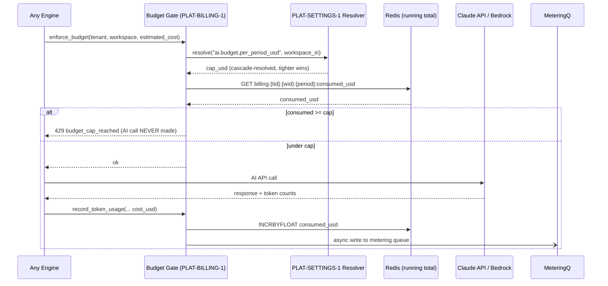

# Task: TASK-008 — Billing, metering, and pre-call budget enforcement (PLAT-BILLING-1)

**Spec:** [weave-platform.md](../../../weave-platform.md) · **Contracts:** [contracts.md](../../../../contracts.md)

## Story

**Epic:** EPIC-008 Billing / Metering
**Priority:** Must Have

**As a** company administrator
**I want** to set AI token and automation-run budget caps that cascade from company level down to individual workspaces, and have the platform hard-reject any AI call that would exceed the effective cap
**So that** no runaway agent or misconfigured pipeline can exceed the budget before I notice.

## Acceptance Criteria

| ID | EARS Criterion | Test Mapping |
|----|----------------|--------------|
| AC-1 | WHEN a budget cap is set via `PUT /api/billing/caps`, THE SYSTEM SHALL validate the cap level (company/domain/workspace/project), resolve the effective cap using the PLAT-SETTINGS-1 cascade (tighter-wins), and reject a cap that exceeds the parent scope's cap with 422 `{"error":"cap_exceeds_parent"}`. | unit: `test_cap_cascade_rejects_exceeding_parent` |
| AC-2 | WHEN any engine initiates an AI API call, THE SYSTEM SHALL check the current period's consumed tokens against the cascade-resolved cap BEFORE the API call; if consumption is at or above 100% of the effective cap, THE SYSTEM SHALL return 429 `{"error":"budget_cap_reached","effective_cap_usd":5.00,"consumed_usd":5.00}` without making the external AI call. | unit: `test_ai_call_rejected_at_100pct_cap` |
| AC-3 | WHEN an AI API call completes, THE SYSTEM SHALL record the token usage `{ tenant_id, workspace_id, principal_iri, model_tier, input_tokens, output_tokens, cost_usd, ts }` to the billing metering queue (separate from the hot path) within 100 ms. | integration: `test_token_usage_recorded_to_queue` |
| AC-4 | WHEN an automation run completes (or fails), THE SYSTEM SHALL record `{ tenant_id, workspace_id, run_id, status, run_cost_usd, ts }` to the billing metering queue; each run costs one unit regardless of duration. | integration: `test_run_metering_recorded` |
| AC-5 | WHEN `GET /api/billing/usage` is called by an admin, THE SYSTEM SHALL return the current billing period's summary: `{ period, total_tokens, total_runs, total_cost_usd, by_workspace: [...], cap_utilisation_pct }` scoped to the caller's tenant. | integration: `test_usage_summary_tenant_scoped` |
| AC-6 | WHEN usage exceeds 80% of the effective cap, THE SYSTEM SHALL dispatch a `billing.cap.warning` notification via PLAT-NOTIFY-1 to all workspace admins; when it reaches 100%, it dispatches `billing.cap.reached`. | integration: `test_billing_threshold_notifications` |
| AC-7 | WHEN `GET /api/billing/usage` is called from a workspace-admin context (not company admin), THE SYSTEM SHALL return only usage scoped to that workspace — never other workspaces' usage. | unit: `test_usage_workspace_scoped_for_workspace_admin` |

## Implementation

### Pseudocode

```text
# Budget enforcement gate (packages/backend/billing/gate.py)
# Called BEFORE any AI API call — this is a hard synchronous check
def enforce_budget(tenant_id: str, workspace_id: str, actor_iri: str,
                   estimated_cost_usd: float) -> None:
  cap = settings.resolve("ai.budget.per_period_usd",
                         context_iri=workspace_iri(tenant_id, workspace_id))
  # cap is cascade-resolved via PLAT-SETTINGS-1 (tighter-wins)
  consumed = billing_db.get_period_consumed(tenant_id, workspace_id, current_period())
  if consumed >= cap:
    raise BudgetCapReached(
      effective_cap_usd=cap,
      consumed_usd=consumed,
    )  # caller catches → 429; AI call is NEVER made
  # Threshold notifications (async, non-blocking)
  utilisation = consumed / cap
  if 0.8 <= utilisation < 1.0:
    background_task(dispatch_notification, tenant_id=tenant_id,
                    event_type="billing.cap.warning", payload={"utilisation": utilisation})

# Token usage recorder (packages/backend/billing/metering.py)
def record_token_usage(tenant_id: str, workspace_id: str, principal_iri: str,
                       model_tier: str, input_tokens: int, output_tokens: int,
                       cost_usd: float):
  # Non-blocking: write to metering queue (SQS or Aurora insert in background task)
  metering_queue.put({
    "tenant_id": tenant_id, "workspace_id": workspace_id,
    "principal_iri": principal_iri, "model_tier": model_tier,
    "input_tokens": input_tokens, "output_tokens": output_tokens,
    "cost_usd": cost_usd, "ts": now(),
  })
  # Update running total in Redis for fast gate checks (eventual consistency ≤1s)
  redis.incrbyfloat(f"billing:{tenant_id}:{workspace_id}:{current_period()}:consumed_usd",
                    cost_usd)

# Cap validation (packages/backend/billing/caps.py)
def set_cap(tenant_id: str, scope_iri: str, key: str, value_usd: float, actor_iri: str):
  parent_cap = settings.resolve(key, context_iri=parent_scope(scope_iri))
  if parent_cap is not None and value_usd > parent_cap:
    raise UnprocessableEntity("cap_exceeds_parent")
  settings.set(key, scope_iri, value_usd, actor_iri=actor_iri)  # PLAT-SETTINGS-1 cascade
```

### API Contracts

**Endpoint:** `PUT /api/billing/caps`

**Request:**

```json
{
  "scope_iri": "urn:weave:tenant:t1:ws:w1",
  "key": "ai.budget.per_period_usd",
  "value_usd": 50.00
}
```

**Response (200):** `{ "saved": true, "effective_cap_usd": 50.00, "resolved_at": "workspace" }`

**Response (422):** `{ "error": "cap_exceeds_parent", "parent_cap_usd": 25.00 }`

---

**Endpoint:** `GET /api/billing/usage?workspace_id={wid}`

**Response (200):**

```json
{
  "period": "2026-06",
  "total_tokens": 1500000,
  "total_runs": 42,
  "total_cost_usd": 38.50,
  "cap_usd": 50.00,
  "cap_utilisation_pct": 77.0,
  "by_workspace": [
    {
      "workspace_id": "<wid>",
      "display_name": "Engineering Team",
      "cost_usd": 38.50,
      "tokens": 1500000,
      "runs": 42
    }
  ]
}
```

---

**Error response on budget cap reached (429):**

```json
{
  "error": "budget_cap_reached",
  "effective_cap_usd": 50.00,
  "consumed_usd": 50.00,
  "period": "2026-06",
  "retry_after": "2026-07-01T00:00:00Z"
}
```

### Diagram References

| Diagram | Notes |
|---------|-------|
| Pre-call gate flow | Inline Mermaid below |



### Design Decisions

| Decision | Source | Impact on This Task |
|----------|--------|---------------------|
| PLAT-BILLING-1: two metering dimensions (per-run, per-token); separate queue | contracts.md | Metering is async and non-blocking; gate check is sync; Redis cache for speed |
| Hard reject at exactly 100% — BEFORE the AI call | spec EPIC-008, Key Decisions | `consumed >= cap` (not `>`); no overage; no soft limit in M1 |
| Budget caps resolved via PLAT-SETTINGS-1 cascade | contracts.md | `settings.resolve()` from TASK-003; cap at tighter scope cannot exceed parent cap |
| 80% threshold → warning notification; 100% → blocked notification | spec EPIC-008 | Dispatches PLAT-NOTIFY-1 events `billing.cap.warning` and `billing.cap.reached` |
| Redis for real-time consumed total; Aurora for durable metering records | spec Key Decisions | Redis may drift briefly on failure; Aurora is the source of truth for billing |

## Test Requirements

### Unit Tests (minimum 4)

- `test_ai_call_rejected_at_100pct_cap` — set cap=50, consumed=50; call `enforce_budget`; assert `BudgetCapReached` raised and AI client mock NOT called
- `test_ai_call_allowed_below_cap` — set cap=50, consumed=49.99; call `enforce_budget`; assert no exception raised
- `test_cap_cascade_rejects_exceeding_parent` — set company cap=25; attempt to set workspace cap=50; assert 422 `cap_exceeds_parent`
- `test_usage_workspace_scoped_for_workspace_admin` — seed usage for two workspaces; call usage endpoint as workspace-scoped admin; assert only own workspace usage returned

### Integration Tests (minimum 3)

- `test_token_usage_recorded_to_queue` — complete an AI call (mocked); assert metering queue receives record within 100 ms with all required fields
- `test_run_metering_recorded` — complete an automation run (mocked); assert run metering record written; assert `run_cost_usd=1` (one unit per run)
- `test_billing_threshold_notifications` — set cap=10; simulate usage=8 (80%); assert `billing.cap.warning` notification dispatched; simulate usage=10 (100%); assert `billing.cap.reached` notification dispatched
- `test_usage_summary_tenant_scoped` — seed usage in tenant A; call usage endpoint from tenant B; assert total_cost=0

### E2E Tests (minimum 1)

- `test_budget_cap_exceeded_shows_error` — Playwright: set workspace cap to $1; simulate AI calls that exhaust cap; trigger another AI call; assert UI shows "Budget cap reached" error message and the AI call result is not displayed

### AC-to-Test Mapping

| AC | Test Type | Test Name |
|----|-----------|-----------|
| AC-1 | Unit | `test_cap_cascade_rejects_exceeding_parent` |
| AC-2 | Unit | `test_ai_call_rejected_at_100pct_cap` |
| AC-3 | Integration | `test_token_usage_recorded_to_queue` |
| AC-4 | Integration | `test_run_metering_recorded` |
| AC-5 | Integration | `test_usage_summary_tenant_scoped` |
| AC-6 | Integration | `test_billing_threshold_notifications` |
| AC-7 | Unit | `test_usage_workspace_scoped_for_workspace_admin` |

## Dependencies

- **blocked_by:** TASK-003 (PLAT-SETTINGS-1 cascade required for cap resolution), TASK-007 (PLAT-NOTIFY-1 required for threshold notifications)
- **unlocks:** nothing (TASK-008 is a leaf in the M1 dependency graph)

## Cost Estimate

- **Complexity:** M
- **Estimated tokens:** ~35K input, ~18K output
- **Estimated cost:** ~$2

## Definition of Ready Checklist

- [ ] User story clear
- [ ] All ACs have mapped tests
- [ ] Pseudocode provided
- [ ] Budget enforcement is confirmed as synchronous pre-call (not post-call)
- [ ] Metering queue is confirmed as async (non-blocking)
- [ ] TASK-003 and TASK-007 complete

## Definition of Done Checklist

- [ ] All ACs met
- [ ] AI call is provably never made when `consumed >= cap` (test verifies AI client mock not called)
- [ ] Workspace admin cannot see other workspaces' usage
- [ ] Cap cannot exceed parent scope cap
- [ ] Threshold notifications dispatched at 80% and 100%
- [ ] Metering queue receives records within 100 ms of call completion
- [ ] Coverage ≥80% for billing module
- [ ] Conventional commit: `feat: add billing metering and pre-call budget enforcement`

## Implementation Hints

- The Redis key for consumed usage (`billing:{tid}:{wid}:{period}:consumed_usd`) must use the billing period (e.g. `2026-06`) not the current timestamp — this ensures all reads in the same period share the same counter key.
- `INCRBYFLOAT` on Redis is atomic but can drift if a process dies mid-write; the Aurora metering table is the source of truth for end-of-period billing; Redis is only for real-time gate checks.
- Do not use `consumed > cap` — use `consumed >= cap`; at exactly 100% the system must reject, not approve and then reject the next call.
- The metering queue should be SQS in production (decoupled, retryable); in dev, a simple background task writing directly to Aurora is acceptable — abstract behind a `MeteringQueue` interface so the implementation is swappable.
- `retry_after` in the 429 response should be the start of the next billing period (first second of next month UTC) — this tells callers exactly when their cap resets.

---

*Generated by Weave Architect skill (arch-task-brief). Self-contained — engineer reads only this file.*
