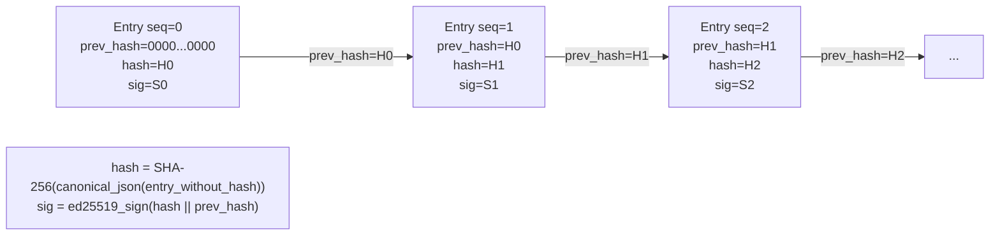

# Task: TASK-009 — Immutable hash-chained audit trail (PLAT-AUDIT-1)

**Spec:** [weave-platform.md](../../../weave-platform.md) · **Contracts:** [contracts.md](../../../../contracts.md)

## Story

**Epic:** EPIC-009 Immutable Audit (E9-S1 only — the self-improvement loop is post-v1 and MUST NOT be included)
**Priority:** Must Have

**As a** compliance officer or security auditor
**I want** a tamper-evident, append-only log of every significant action taken in the platform — by humans and AI agents alike — with each entry cryptographically linked to the previous one and signed with the platform's ed25519 key
**So that** any gap, reordering, or modification of the audit trail is mathematically detectable, and I can present an unbroken chain to an auditor without trusting the application layer.

## Acceptance Criteria

| ID | EARS Criterion | Test Mapping |
|----|----------------|--------------|
| AC-1 | WHEN `audit.emit(PLAT-AUDIT-1, ...)` is called, THE SYSTEM SHALL insert a row with `{ seq, ts, tenant_id, actor_principal_iri, engine, event_type, target_iri, diff_summary, prev_hash, hash, signature }` where `hash = SHA-256(canonical_json(entry_without_hash))` and `signature = ed25519_sign(hash \|\| prev_hash)`. | unit: `test_audit_entry_hash_and_signature` |
| AC-2 | WHEN an audit entry is inserted, THE SYSTEM SHALL compute `prev_hash` as the `hash` of the immediately preceding entry for the same `tenant_id`, or the zero-hash (`"0" * 64`) for the first entry. | unit: `test_audit_chain_prev_hash` |
| AC-3 | WHEN any code attempts an UPDATE or DELETE on the audit table, THE SYSTEM SHALL reject it at the database constraint level (trigger or rule) with an error that prevents the operation from completing. | integration: `test_audit_table_update_rejected_at_db` |
| AC-4 | WHEN the chain is verified via `POST /api/audit/verify`, THE SYSTEM SHALL re-compute each entry's hash and check `prev_hash` linkage across the full chain; return `{"valid": true, "entries_checked": N}` or `{"valid": false, "first_broken_seq": N, "error": "..."}`. | integration: `test_audit_chain_verification` |
| AC-5 | WHEN `GET /api/audit?tenant_id={tid}` is called by an admin, THE SYSTEM SHALL return paginated entries (most-recent first) filtered to the caller's tenant; an admin from tenant B SHALL receive zero entries for tenant A. | integration: `test_audit_entries_tenant_scoped` |
| AC-6 | WHEN a `security.*` event is emitted, THE SYSTEM SHALL dispatch a `security.*` notification via PLAT-NOTIFY-1 in addition to writing the audit entry. | integration: `test_security_event_triggers_notification` |
| AC-7 | WHEN `GET /api/audit/compliance` is called by a compliance-role user, THE SYSTEM SHALL return a compliance sub-view showing entry counts by event category, top actors, and the chain verification status (valid/invalid), without exposing raw `diff_summary` payloads to non-admin roles. | unit: `test_compliance_view_redacts_diff_for_non_admin` |

## Implementation

### Pseudocode

```text
# Audit entry emission (packages/backend/audit/emit.py)
# This is the canonical PLAT-AUDIT-1 interface — all other tasks call this function
def emit(actor_principal_iri: str, engine: str, event_type: str,
         target_iri: str, diff_summary: dict | None = None) -> AuditEntry:
  tenant_id = extract_tenant(actor_principal_iri)
  with db.serialisable_transaction():      # prevents seq gap + prev_hash race
    prev_entry = db.get_latest_audit_entry(tenant_id)
    prev_hash = prev_entry.hash if prev_entry else "0" * 64
    seq = (prev_entry.seq + 1) if prev_entry else 1
    entry_data = {
      "seq": seq, "ts": now_iso(), "tenant_id": tenant_id,
      "actor_principal_iri": actor_principal_iri, "engine": engine,
      "event_type": event_type, "target_iri": target_iri,
      "diff_summary": diff_summary,
    }
    canonical = json.dumps(entry_data, sort_keys=True, separators=(",", ":"))
    hash_val = sha256(canonical.encode()).hexdigest()
    sig = ed25519_private_key.sign(f"{hash_val}{prev_hash}".encode())
    entry = AuditEntry(**entry_data, prev_hash=prev_hash,
                       hash=hash_val, signature=sig.hex())
    db.insert_audit_entry(entry)           # append-only: UPDATE/DELETE blocked at DB
  if event_type.startswith("security."):
    background_task(dispatch_notification, tenant_id=tenant_id,
                    event_type=event_type, payload={"audit_seq": seq,
                    "actor": actor_principal_iri, "target": target_iri})
  return entry

# Chain verifier (packages/backend/audit/verify.py)
def verify_chain(tenant_id: str) -> VerifyResult:
  entries = db.get_all_audit_entries_ordered(tenant_id)  # seq ASC
  prev_hash = "0" * 64
  for entry in entries:
    expected_hash = sha256(canonical_json_without_hash(entry).encode()).hexdigest()
    if entry.hash != expected_hash:
      return VerifyResult(valid=False, first_broken_seq=entry.seq,
                          error="hash_mismatch")
    if entry.prev_hash != prev_hash:
      return VerifyResult(valid=False, first_broken_seq=entry.seq,
                          error="chain_broken")
    # verify signature over (hash || prev_hash)
    try:
      ed25519_public_key.verify(entry.signature_bytes(),
                                f"{entry.hash}{entry.prev_hash}".encode())
    except InvalidSignature:
      return VerifyResult(valid=False, first_broken_seq=entry.seq,
                          error="signature_invalid")
    prev_hash = entry.hash
  return VerifyResult(valid=True, entries_checked=len(entries))
```

### API Contracts

**Endpoint:** `GET /api/audit?tenant_id={tid}&page=1&per_page=50&event_type=workspace.created`

**Response (200):**

```json
{
  "entries": [
    {
      "seq": 42,
      "ts": "2026-06-30T12:00:00Z",
      "actor_principal_iri": "urn:weave:principal:user:abc123",
      "engine": "platform",
      "event_type": "workspace.created",
      "target_iri": "urn:weave:tenant:t1:ws:w1",
      "diff_summary": { "slug": "eng-team" },
      "hash": "<sha256>",
      "prev_hash": "<sha256>",
      "signature": "<hex>"
    }
  ],
  "total": 42,
  "page": 1,
  "per_page": 50
}
```

---

**Endpoint:** `POST /api/audit/verify`

**Response (200, valid):**

```json
{ "valid": true, "entries_checked": 1000 }
```

**Response (200, broken):**

```json
{
  "valid": false,
  "first_broken_seq": 87,
  "error": "chain_broken"
}
```

---

**Endpoint:** `GET /api/audit/compliance`

**Response (200):**

```json
{
  "chain_status": "valid",
  "entries_checked": 1000,
  "by_event_category": {
    "workspace": 12, "auth": 34, "connector": 5, "billing": 8, "security": 3
  },
  "top_actors": [
    { "principal_iri": "urn:weave:principal:user:abc123", "event_count": 45 }
  ],
  "period": "2026-06"
}
```

### Diagram References

| Diagram | Notes |
|---------|-------|
| Hash chain structure | Inline Mermaid below |
| Audit service placement | [`tech-spec/architecture.md`](../../tech-spec/architecture.md) — C4 L3 (`audit_svc`) + D2 (in-transaction chain) + audit invariants |



### Design Decisions

| Decision | Source | Impact on This Task |
|----------|--------|---------------------|
| PLAT-AUDIT-1 event shape: `seq, ts, actor_principal_iri, engine, event_type, target_iri, diff_summary, signature` | contracts.md | Canonical schema — all emitters use this exact shape; no deviation |
| Append-only enforced at DB constraint level (trigger or rule) | spec Key Decisions | PostgreSQL trigger on `audit_entries` blocks UPDATE and DELETE at the DB layer — application bugs cannot corrupt the trail |
| ed25519 signatures over `hash \|\| prev_hash` | spec Key Decisions | Signature covers both the entry content (via hash) and its chain position (via prev_hash) — tampering either value breaks the signature |
| Serialisable transaction for `seq` and `prev_hash` | spec Key Decisions | Prevents concurrent inserts from creating the same `seq` or sharing a `prev_hash` |
| Self-improvement loop is post-v1 — NOT included | spec EPIC-009 scoping | Only E9-S1 (the audit trail itself) is in M1; agent-observed audit patterns and feedback loop are excluded |
| Security events trigger PLAT-NOTIFY-1 | contracts.md | `event_type.startswith("security.")` dispatches a notification synchronously via background task |

## Test Requirements

### Unit Tests (minimum 5)

- `test_audit_entry_hash_and_signature` — emit one entry; assert `hash == SHA-256(canonical_json_without_hash(entry))`; assert `ed25519_public_key.verify(sig, hash + prev_hash)` passes
- `test_audit_chain_prev_hash` — emit two entries; assert second entry's `prev_hash` equals first entry's `hash`; assert first entry's `prev_hash` equals `"0" * 64`
- `test_audit_chain_verification_valid` — emit 10 entries; call `verify_chain`; assert `{"valid": true, "entries_checked": 10}`
- `test_audit_chain_verification_broken` — emit 5 entries; directly UPDATE `hash` in DB via raw SQL (bypassing trigger in test setup); call `verify_chain`; assert `{"valid": false, "first_broken_seq": N}`
- `test_compliance_view_redacts_diff_for_non_admin` — call compliance endpoint as `viewer` role; assert `diff_summary` absent from response

### Integration Tests (minimum 3)

- `test_audit_table_update_rejected_at_db` — emit one entry; attempt `UPDATE audit_entries SET hash='x' WHERE seq=1` directly via psycopg; assert PostgreSQL raises an error (trigger fires)
- `test_audit_entries_tenant_scoped` — emit entries in tenant A; query `/api/audit` from tenant B admin context; assert 0 entries returned
- `test_security_event_triggers_notification` — emit `security.permission.escalation` event; assert PLAT-NOTIFY-1 dispatch mock called with matching event_type
- `test_cross_tenant_audit_isolation` — seed audit entries for tenant A and B; verify tenant A admin sees only tenant A entries; verify chain verification for tenant A does not include tenant B entries

### E2E Tests (minimum 1)

- `test_audit_compliance_view_renders` — Playwright: sign in as admin; navigate to Compliance view; assert chain status "valid" shown; assert event category counts displayed; assert no raw diff payloads visible to non-admin role

### AC-to-Test Mapping

| AC | Test Type | Test Name |
|----|-----------|-----------|
| AC-1 | Unit | `test_audit_entry_hash_and_signature` |
| AC-2 | Unit | `test_audit_chain_prev_hash` |
| AC-3 | Integration | `test_audit_table_update_rejected_at_db` |
| AC-4 | Integration | `test_audit_chain_verification` |
| AC-5 | Integration | `test_audit_entries_tenant_scoped` |
| AC-6 | Integration | `test_security_event_triggers_notification` |
| AC-7 | Unit | `test_compliance_view_redacts_diff_for_non_admin` |

## Dependencies

- **blocked_by:** TASK-004 (principal IRIs must exist before audit entries reference them), TASK-007 (PLAT-NOTIFY-1 required for security event notifications)
- **unlocks:** TASK-005 (audit entries are navigable from the compliance sub-view linked in nav)

## Cost Estimate

- **Complexity:** L
- **Estimated tokens:** ~45K input, ~22K output
- **Estimated cost:** ~$3

## Definition of Ready Checklist

- [ ] User story clear
- [ ] All ACs have mapped tests
- [ ] PLAT-AUDIT-1 canonical event shape confirmed from contracts.md
- [ ] Self-improvement loop explicitly excluded (post-v1)
- [ ] DB-level append-only enforcement approach agreed (PostgreSQL trigger)
- [ ] Ed25519 key management approach defined (generated at boot, stored in Secrets Manager)
- [ ] TASK-004 and TASK-007 complete

## Definition of Done Checklist

- [ ] All ACs met
- [ ] `UPDATE audit_entries SET ...` returns an error from the DB trigger in all test environments
- [ ] `verify_chain` detects single-entry tampering in the middle of a 100-entry chain
- [ ] Compliance sub-view shows no `diff_summary` to viewer or editor roles
- [ ] Security events always dispatch PLAT-NOTIFY-1 notifications
- [ ] Audit entries never leak across tenant boundaries
- [ ] Ed25519 private key stored in AWS Secrets Manager, never in code or env vars
- [ ] Coverage ≥80% for audit module
- [ ] Conventional commit: `feat: add immutable hash-chained audit trail`

## Implementation Hints

- Generate the ed25519 key pair at first boot and store the private key in Secrets Manager (`weave/platform/audit-signing-key`); load it once at startup into memory — never write it to disk, never log it.
- The PostgreSQL trigger should be a `BEFORE UPDATE OR DELETE` trigger that raises `EXCEPTION` with message `'audit_entries is append-only'` — this fires before the write reaches disk.
- Use Python's `cryptography` library (`cryptography.hazmat.primitives.asymmetric.ed25519`) for ed25519 — it is the most widely audited option in the Python ecosystem.
- `canonical_json` must use `sort_keys=True, separators=(",", ":")` with no trailing whitespace — any variation in serialisation breaks the hash; add a unit test that asserts the canonical form of a known entry matches a hard-coded expected string.
- The `diff_summary` field should have a max size limit (8 KB) enforced by the `emit()` function — large diffs should be stored in S3 with only the S3 key in `diff_summary`.

---

*Generated by Weave Architect skill (arch-task-brief). Self-contained — engineer reads only this file.*
