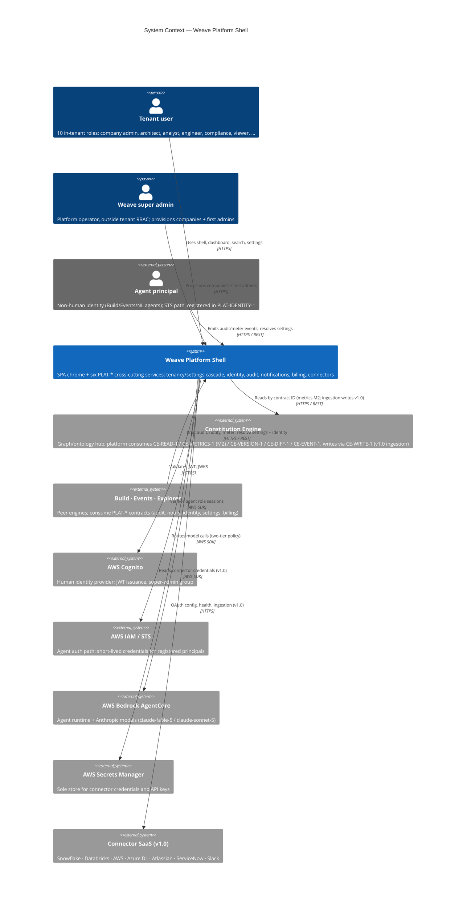
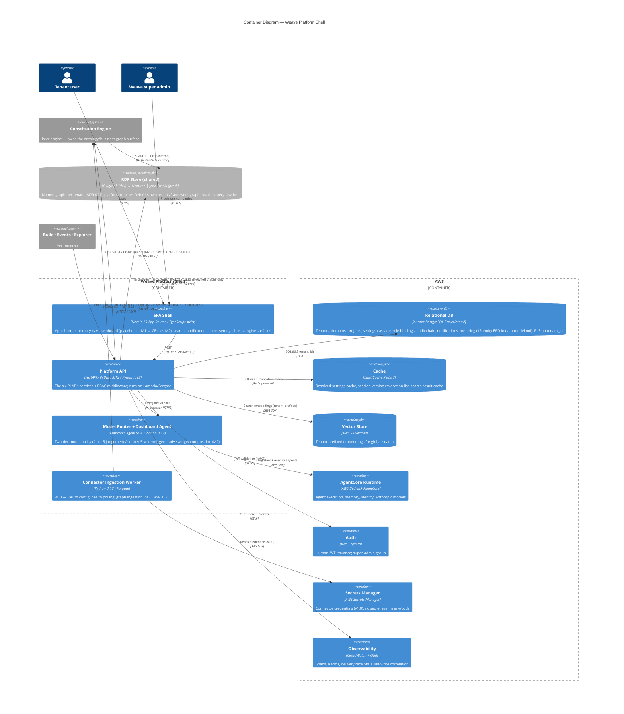
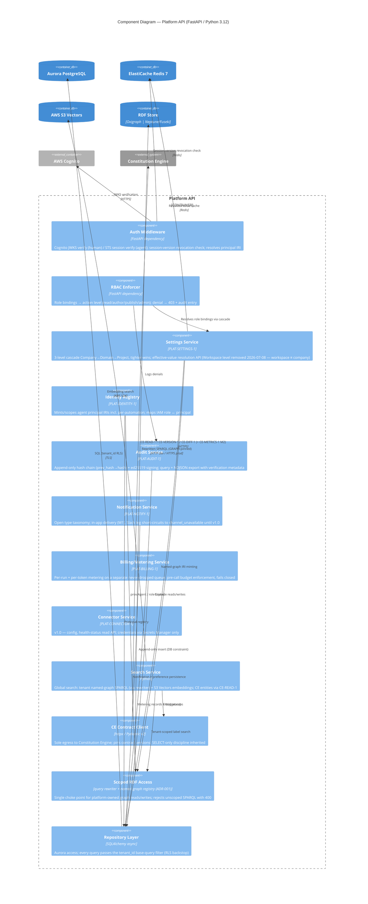

# Architecture: Weave Platform Shell

## Overview

The Weave Platform Shell is the cross-cutting foundation the four engines (Constitution, Build,
Events & Actions, Graph Explorer) plug into: it owns the single React SPA chrome (primary
navigation, dashboard, global search, notifications, settings) and the six platform contracts —
`PLAT-SETTINGS-1`, `PLAT-IDENTITY-1`, `PLAT-AUDIT-1`, `PLAT-NOTIFY-1`, `PLAT-BILLING-1`,
`PLAT-CONNECTOR-1` (contract owned from M1; live surface v1.0). This document covers C4 Levels 1–3;
Level 4 (code) is deferred to `arch-diagrams` and the implementation itself. Graph access splits two
ways (ADR-001): the platform reads and writes its **own** platform-owned triples (tenancy boundary,
principals, roles, PROV-O audit shadow, framework vocabulary) through a scoped SPARQL layer whose
single choke point is the tenant query rewriter; all **ontology/business** graph access goes
through Constitution Engine contracts (`CE-READ-1` etc.). The RDF store progression (Oxigraph dev →
Neptune | Jena Fuseki prod) therefore appears at L2 as the shared store reached only via the
rewriter. The AI layer boundary is
Anthropic Agent SDK → AWS Bedrock AgentCore: the platform owns model routing and (from M2) the
generative-dashboard agent. Per the 2026-07-02 milestone fix, the M1 dashboard is a placeholder
shell; CE-sourced tiles activate at M2 with `CE-METRICS-1`.

## C4 Model

### Level 1: System Context

The platform is the contract *hub for cross-cutting concerns* while being a contract *consumer*
of the Constitution Engine: engines call inward (emit audit, notifications, metering; resolve
settings and identity), the platform calls outward only to CE, the scoped RDF layer for its own
platform-owned graphs, and AWS managed services. The RDF store appears at L2, not here: at context
level the meaningful boundary is that ontology/business graph access is CE's contract surface,
while the platform's own graph writes pass through one tenant query rewriter (see Design
Decisions).

### Level 2: Container

Container notes:

- **SPA Shell** is the *single* Weave SPA — engine surfaces mount inside it; the platform owns the
  chrome and routing, engines own their secondary navigation. No micro-frontends (brief
  out-of-scope).
- **Platform API** is one deployable exposing the six `PLAT-*` service groups behind one RBAC
  middleware; splitting into per-service deployables is deferred until scale demands (Design
  Decision D6).
- **Model Router** carries the Anthropic Agent SDK → AgentCore boundary (C4 Law 7). At M1 it does
  model routing only; the generative-dashboard agent activates at M2.
- **RDF store progression** (Oxigraph dev → Neptune | Jena Fuseki prod) is one shared store with
  named-graph-per-tenant isolation (ADR-001). Two arrows reach it: CE's (ontology/business graphs)
  and the Platform API's — the latter restricted to platform-owned tenant/framework graphs and
  forced through the tenant query rewriter (unscoped queries rejected 400).
- **Connector Ingestion Worker** is drawn now (contract owned from M1) but has no live surface
  until v1.0.

### Level 3: Component — Platform API

The Platform API is the L3 target: it concentrates the architectural risk (RBAC enforcement,
tenant isolation, the hash-chained audit log, and the settings cascade all live here). The SPA
and Model Router are structurally conventional; drawing them at L3 would add pages, not insight.

Component notes: 12 components — at the ≤ 12 cap. Every request path runs
`auth_mw → rbac → service → repo_layer`; no service reaches Aurora except through the repository
layer, and no service reaches the RDF store except through `rdf_scoped` — two choke points, each
with one test surface (the RLS isolation test and the unscoped-query-rejection test).
`ce_client` is the only component allowed to know CE URLs — contract-version pinning lives in
exactly one place.

## Design Decisions

Adversarial critic pass run before writing this table; the five mandatory challenges appear as
D1–D5, entity-specific challenges as D6–D9. Program-level ADRs live in
[`../../decisions/`](../../../decisions/) (ADR-001 tenant isolation, ADR-002 authority levels).

| # | Decision | Rationale | Alternatives Rejected | Critic Challenge | Response |
|---|----------|-----------|----------------------|-----------------|---------|
| D1 | Split graph boundary: platform-owned graphs (tenancy, principals, framework vocab — ADR-001) reached only via the platform's tenant query rewriter; ALL ontology/business graph access via CE contracts | CE is the graph hub (weave-spec §1.2), but the tenant boundary itself is platform-owned — the named graph IS the RDF tenant boundary (data-model.md), so the platform must mint and scope those graphs | Zero platform SPARQL (breaks TASK-003/TASK-005: named-graph minting, scoped search); platform reading business graphs directly (duplicates CE's enforcement) | "Why is the RDF store boundary drawn here and not fully inside CE?" | One rewriter is the single platform-side choke point — unscoped queries rejected 400, GRAPH pinned to the session tenant; business-graph reads still go through CE so ontology enforcement lives in exactly one codebase. |
| D2 | Audit writes are synchronous inserts with a DB-level append-only constraint; hash chain computed in-transaction | Chain integrity must survive process death; a Lambda dying mid-request must not leave a half-linked chain | Async queue then batch-append (higher throughput, but a crash window between accept and append breaks "no event unlogged") | "What happens to in-flight writes if a Lambda cold-starts or dies mid-request?" | The audit insert commits in the same transaction as the business write where possible, else write-audit-first; a dropped request before commit leaves no partial row (transactional), and `seq` comes from the DB, not the app, so no gap/dup on retry. |
| D3 | Multi-tenancy enforced at BOTH the API layer (repo-layer base filter) and the store layer (Aurora RLS; named-graph + query-rewrite CE-side; S3 Vectors tenant prefix) | Defence in depth: the cross-tenant-read test (PRD §2.2) must pass even if one layer regresses | API-layer-only (simpler, but one missed filter = breach); store-layer-only (RLS bypass via superuser connections) | "Where does multi-tenancy enforcement happen — API, store, or both?" | Both, deliberately redundant. The repo layer is the single choke point in code; RLS is the backstop the M1 release-gate isolation test exercises (data-model.md §Isolation Invariants). |
| D4 | Model Router is its own container with pre-call budget enforcement via PLAT-BILLING-1 | An agent consuming unbounded tokens is a platform-wide cost incident; enforcement must sit in front of every model call, not inside each engine | Per-engine budget checks (N implementations, N bypass bugs) | "Does the agent container have a blast radius if it consumes unbounded tokens on AgentCore?" | Bounded: PLAT-BILLING-1 rejects before the AI call at 100% of the cascade-resolved cap (fails closed under metering lag, PRD §2.2 Reliability). Worst case is denial of AI service, never uncapped spend. |
| D5 | Dev/test runs Oxigraph + LocalStack; prod store (Neptune vs Fuseki) deferred to CE tech spec | Plugin Law F (no real cloud in tests) and the store choice is CE's to make — platform code is store-agnostic by construction (contract client only) | Pinning Neptune now (locks CE's decision from the wrong side) | "What is the fallback if Neptune is unavailable and only Oxigraph dev is running?" | Platform degrades gracefully by design: CE-METRICS-1/READ-1 errors render each widget's defined unavailable state (FR-000 behaviour), never a blank shell; no platform feature hard-depends on the prod store identity. |
| D6 | One Platform API deployable for all six PLAT-* services (M1) | Leanest thing that works; the services share the auth/RBAC/repo spine, and M1 load is one pilot tenant | Six microservices (premature; multiplies cold starts, IAM roles, and deploy surfaces) | "Won't audit + billing hot paths starve settings reads in one process?" | Lambda concurrency scales per-request, not per-process; if a hot path emerges, the service groups are router-level modules that can split into their own deployables without code rewrites (noted upgrade path). |
| D7 | Settings resolution cached in Redis with revocation via session-version check per request | Cascade resolution touches ≤ 3 rows but runs on every request; caching is mandatory for the ≤ 2 s company-switch NFR | No cache (simpler, misses NFR); long-TTL JWT claims (revocation latency breaches the ≤ 60 s bound) | "Stale cache: a tightened budget cap not yet visible while spend continues?" | Budget checks read through PLAT-BILLING-1 against the effective cap with cache TTL ≤ the enforcement granularity; cap changes bust the cache key on write (write-through invalidation). |
| D8 | Super admin is a Cognito group + PLAT-IDENTITY-1 principal, outside tenant RBAC, provisioning-only | Company creation needs an out-of-band identity, but it must not become a god-mode read path into tenant data | Tenant-RBAC "global admin" role (breaks hard isolation FR-047) | "Can a compromised super admin read tenant business data?" | No read grants exist to compromise: the principal's role scope covers company/user provisioning APIs only; every provisioning act writes PLAT-AUDIT-1; tenant-data endpoints reject the group outright. |
| D9 | SPA is one Next.js app owning chrome; engines mount surfaces inside it | Brief out-of-scope explicitly bans micro-frontends; a single app keeps the IA stable (disabled-not-hidden areas) | MFE-per-engine (independent deploys, but brief-banned and heavier ops) | "Does one SPA couple engine release cadence?" | Engine surfaces are route-group modules behind the stable primary nav; an engine shipping later renders its area disabled (PRD Navigation note) — release coupling is at the repo level Weave already accepts (monorepo, Law D stacked PRs). |

## Invariants

All invariants are EARS-notated and each maps to at least one release-gate test.

- **Tenancy (read):** WHEN any API request is processed THE SYSTEM SHALL scope every Aurora,
  S3 Vectors, and CE-contract read to the authenticated principal's tenant, and a query issued in
  tenant A's context SHALL return zero rows from tenant B's data (M1 release-gate isolation test,
  data-model.md §Isolation Invariants).
- **Tenancy (write):** WHEN a write reaches the repository layer without a tenant scope THE
  SYSTEM SHALL reject it before execution — no unscoped statement reaches a store.
- **Scoped SPARQL:** WHEN an unscoped SPARQL query (no pinned GRAPH, or FROM NAMED/SERVICE
  broadening) is submitted to the platform's RDF layer THE SYSTEM SHALL reject it with HTTP 400
  `unscoped_query_rejected` — never silently broaden (TASK-003 AC-6).
- **Audit append-only:** WHEN any historical `PLAT-AUDIT-1` entry is altered or deleted THE
  SYSTEM SHALL fail chain verification at the named row AND SHALL log the attempt (DB-constraint
  enforced; tamper test PRD §2.6).
- **Audit coverage:** WHEN any engine or platform component performs a state-changing operation
  THE SYSTEM SHALL append a signed `PLAT-AUDIT-1` entry attributing the acting principal IRI
  (human or agent) before the operation is reported successful.
- **Auth:** WHEN an unauthenticated request reaches any API endpoint THE SYSTEM SHALL return
  HTTP 401 and log the attempt to CloudWatch; WHEN an authenticated request lacks the required
  action level THE SYSTEM SHALL return HTTP 403 AND append an audit entry.
- **Revocation:** WHEN a principal's access is revoked THE SYSTEM SHALL reject the next request
  bearing the prior token within the bounded latency (access-token TTL ≤ 60 s + session-version
  check).
- **Budget:** WHEN AI-generation spend reaches 100% of the effective cascade-resolved cap THE
  SYSTEM SHALL reject the request before any model call with the readable cap message, AND WHILE
  metering lag exists THE SYSTEM SHALL fail closed.
- **Notification delivery:** WHEN a notification channel fails THE SYSTEM SHALL deliver in-app
  and log the channel failure — no notification is silently dropped; WHEN a Slack-enabled
  preference is evaluated before v1.0 THE SYSTEM SHALL short-circuit to `channel_unavailable`
  without error.
- **Secrets:** WHEN any component requires a credential THE SYSTEM SHALL resolve it from AWS
  Secrets Manager at runtime — never from env files, code, logs, or API responses.
- **Dev/prod parity:** WHEN running in the test environment THE SYSTEM SHALL use LocalStack for
  all AWS services and Oxigraph for any graph access exercised through CE — no real cloud calls
  in tests (Plugin Law F).

## Quality Attributes

Targets are the PRD §2.2 configurable defaults (provisional, not contractual SLAs).

| Attribute | Target | Measurement | Risk if missed |
|-----------|--------|-------------|----------------|
| Dashboard initial load (M1 shell; M2 CE tiles) | ≤ 2 s p95 | Playwright + Lighthouse in CI | First-screen credibility of the whole product |
| Global search | ≤ 300 ms after 150 ms debounce | Locust + browser trace in CI | Search abandoned; nav falls back to clicking |
| Company switch | ≤ 2 s p95 | Playwright timing assertion | Multi-company operators (super admin) blocked |
| In-app notification delivery | ≤ 30 s | Delivery-receipt CloudWatch events | Budget/HITL alerts arrive too late to act |
| Revocation latency | next request after revoke rejected; token TTL ≤ 60 s | Integration test with seeded revocation | Security posture claim (mid-market baseline) fails |
| Audit chain verification | full-chain verify passes on export; tamper detected at named row | Tamper test in CI (PRD §2.6) | Non-repudiation claim collapses |
| Cross-tenant isolation | zero rows cross-tenant across Aurora, S3 Vectors, CE reads | Seeded two-tenant test, M1 release gate | Worst-case breach; contract-ending |
| RDF store parity | dev = Oxigraph; prod = Neptune \| Jena Fuseki (CE-owned); platform store-agnostic | Contract-client tests run identically against either | Hidden store coupling blocks CE's OQ-01 decision |
| Cold start (Lambda API) | p99 < 3 s | CloudWatch Insights | Perceived shell slowness at low traffic |
| Availability | 99.9% monthly | CloudWatch alarms | Pilot-client SLA breach |
| Mutation coverage | ≥ 60% | Stryker / mutmut in CI | Silent regressions in isolation/audit logic |

---

*Generated by Weave arch-diagrams skill. Review and approve before task decomposition.*
