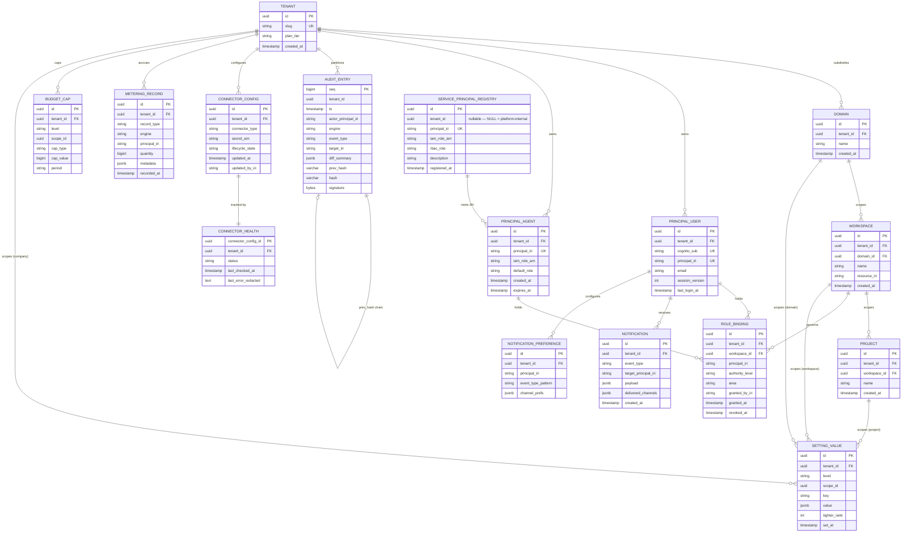

# Weave Platform — Data Model (M1)

**Graph edges:**
[Engine spec](../../../weave-platform.md) ·
[contracts.md](../../../../contracts.md) ·
[ADR-001 Tenant Isolation](../../../../decisions/ADR-001-tenant-isolation.md) ·
[ADR-002 Authority Extension](../../../../decisions/ADR-002-authority-extension.md)

**Standards consumed (linked, not redefined):**
[rbac-multi-tenancy](../../../../../../standards/rbac-multi-tenancy.md) ·
[audit-immutability](../../../../../../standards/audit-immutability.md) ·
[semantic-web](../../../../../../standards/semantic-web.md) ·
[api-conventions](../../../../../../standards/api-conventions.md) ·
[observability](../../../../../../standards/observability.md)

The Platform shell owns the six PLAT-\* contracts
([PLAT-IDENTITY-1](../../../../contracts.md),
[PLAT-AUDIT-1](../../../../contracts.md),
[PLAT-SETTINGS-1](../../../../contracts.md),
[PLAT-NOTIFY-1](../../../../contracts.md),
[PLAT-BILLING-1](../../../../contracts.md),
[PLAT-CONNECTOR-1](../../../../contracts.md))
and is the authoritative home of the tenant isolation boundary and the `urn:weave:g:*`
named-graph scheme.

Most Platform entities persist in **Aurora PostgreSQL** with `tenant_id` row-level scoping.
The RBAC/authority projection and provenance trail are the only Platform-owned concepts
that land in the RDF named graphs (see [§ RDF/OWL Mapping](#rdfowl-mapping)).

## Named-Graph Scheme

**Platform is the authoritative owner of this scheme.**
Every other engine uses these IRIs; none may define an alternative or bypass the scheme.
Decision rationale in [ADR-001](../../../../decisions/ADR-001-tenant-isolation.md).

| Graph | IRI pattern | Written by | Read by |
|---|---|---|---|
| Shared upper ontology (BPMO ~13 kinds, SHACL, SKOS) | `urn:weave:g:framework` | Weave release pipeline only | every tenant (read-only) |
| Tenant instance graph | `urn:weave:g:tenant:{tenant_id}` | CE-WRITE-1; connector ingest (post-M1) | that tenant only |
| Tenant provenance graph (PROV-O) | `urn:weave:g:tenant:{tenant_id}:prov` | audit / PROV-O stamping | that tenant only |

The **framework graph** is the SSOT for the BPMO upper ontology, the `weave:AuthorityLevel`
SKOS ordered scheme, the `weave:dataClassification` SKOS scheme, and all shared SHACL shapes.
Tenant graphs extend it — they never copy triples into it.

Every SPARQL query reads `framework ∪ tenant:{ctx.tenant_id}` and nothing else. The mandatory
query-rewriter is the **single enforcement point** — see
[ADR-001 §Enforcement rules](../../../../decisions/ADR-001-tenant-isolation.md).
Unscoped queries are rejected (`UnscopedQueryRejected`); SELECT-only + SERVICE-blocked per
[rbac-multi-tenancy §RDF layer](../../../../../../standards/rbac-multi-tenancy.md).

### Workspace IRI vs Named-Graph IRI

TASK-003 mints `urn:weave:tenant:{tid}:ws:{wid}` at workspace creation. This is the
**resource identifier** for the workspace node inside the tenant named graph — it is not a
graph IRI and must not be used as a `FROM` clause scope. The isolation boundary is the
per-tenant named graph. The workspace IRI locates a node; the tenant graph IRI is the scope.

## ER Diagram



## Entity Definitions

**Isolation rule:** every Aurora table (except `tenants` itself and platform-internal registry
rows with `tenant_id IS NULL`) carries a `tenant_id` column. A base-layer predicate
(`WHERE tenant_id = ctx.tenant_id`) is injected centrally by the connection pool before
any query reaches application logic. Application code must not add its own `tenant_id`
filters — the base layer is the single enforcement point. See
[rbac-multi-tenancy §Aurora base layer](../../../../../../standards/rbac-multi-tenancy.md).

### Tenant

Top isolation unit. Owns one named graph (`urn:weave:g:tenant:{id}`) and one provenance
graph (`urn:weave:g:tenant:{id}:prov`). `slug` is unique, URL-safe, and used for
subdomain routing. `plan_tier` gates billing caps and feature flags.

| Column | Type | Constraints | Notes |
|---|---|---|---|
| `id` | UUID | PK | used as `{tenant_id}` in all IRI and graph patterns |
| `slug` | varchar(63) | UK, NOT NULL | URL-safe; subdomain routing |
| `plan_tier` | varchar | NOT NULL | `starter \| growth \| enterprise` |
| `created_at` | timestamptz | NOT NULL | immutable after insert |
| `updated_at` | timestamptz | NOT NULL | last plan/slug change |

**No `tenant_id` FK** — this is the root isolation anchor; all other tables reference it.

### Domain

Organizational subdivision of a Tenant (e.g., a business unit). Provides the second
cascade level for settings and budget caps.

| Column | Type | Constraints | Notes |
|---|---|---|---|
| `id` | UUID | PK | — |
| `tenant_id` | UUID | FK → tenants, NOT NULL | RLS anchor |
| `name` | varchar | NOT NULL | unique within tenant |
| `description` | text | — | optional |
| `created_at` | timestamptz | NOT NULL | — |

### Workspace

Team context; the primary RBAC boundary for role bindings. Creation mints the workspace
resource IRI `urn:weave:tenant:{tid}:ws:{wid}` and stores it as `resource_iri` (see
[§ Named-Graph Scheme](#named-graph-scheme) — this is a node identifier, not a graph IRI).

| Column | Type | Constraints | Notes |
|---|---|---|---|
| `id` | UUID | PK | — |
| `tenant_id` | UUID | FK → tenants, NOT NULL | RLS anchor |
| `domain_id` | UUID | FK → domains, NOT NULL | — |
| `name` | varchar | NOT NULL | unique within domain |
| `resource_iri` | varchar | UK, NOT NULL | `urn:weave:tenant:{tid}:ws:{wid}`; immutable after create |
| `created_at` | timestamptz | NOT NULL | — |

### Project

Scoped work unit within a workspace. The fourth (innermost) cascade level for settings.

| Column | Type | Constraints | Notes |
|---|---|---|---|
| `id` | UUID | PK | — |
| `tenant_id` | UUID | FK → tenants, NOT NULL | RLS anchor |
| `workspace_id` | UUID | FK → workspaces, NOT NULL | — |
| `name` | varchar | NOT NULL | unique within workspace |
| `created_at` | timestamptz | NOT NULL | — |

### Principal (User)

Human identity, minted from Cognito sub. `session_version` is the revocation counter —
it is incremented to invalidate all active JWTs for this user immediately. Every request
checks the JWT's `session_version` claim against the Redis store.

| Column | Type | Constraints | Notes |
|---|---|---|---|
| `id` | UUID | PK | — |
| `tenant_id` | UUID | FK → tenants, NOT NULL | RLS anchor |
| `cognito_sub` | varchar | UK, NOT NULL | from Cognito JWT `sub` claim |
| `principal_iri` | varchar | UK, NOT NULL | `urn:weave:principal:user:{cognito_sub}`; immutable |
| `email` | varchar | NOT NULL | from Cognito; must NOT appear as OTel span attributes |
| `session_version` | int4 | NOT NULL, DEFAULT 1 | revocation counter; mirrored to Redis |
| `last_login_at` | timestamptz | — | updated on each successful JWT exchange |

Redis key: `HSET session_versions {tenant_id}:{user_id} version {n}` — used for
per-request revocation check (see [business-process §Flow 5](business-process.md#flow-5-revocation)).

### Principal (Agent) and Service-Principal Registry

Machine identity, derived from IAM role ARN hash. Two tables serve distinct purposes.
See [PLAT-IDENTITY-1](../../../../contracts.md) and
[rbac-multi-tenancy §Service-principal conventions](../../../../../../standards/rbac-multi-tenancy.md).

**`principal_agents`** — per-tenant registered service agents:

| Column | Type | Constraints | Notes |
|---|---|---|---|
| `id` | UUID | PK | — |
| `tenant_id` | UUID | FK → tenants, NOT NULL | RLS anchor |
| `iam_role_arn` | varchar | NOT NULL | IAM role the STS token assumes |
| `principal_iri` | varchar | UK, NOT NULL | `urn:weave:principal:agent:{sha256(iam_role_arn)[:12]}` |
| `default_role` | varchar | NOT NULL | authority level at registration |
| `created_at` | timestamptz | NOT NULL | — |
| `expires_at` | timestamptz | — | nullable; max lifetime for non-permanent agents |

**`service_principal_registry`** — canonical cross-reference (IRI ↔ IAM role ↔ RBAC role).

Platform-internal Weave-operator principals are registered here with `tenant_id = NULL`.
They are **never assignable** to a client tenant role binding. This is the mechanism
behind SEC-5 (see [§ Audit Entry](#audit-entry)).

| Column | Type | Constraints | Notes |
|---|---|---|---|
| `id` | UUID | PK | — |
| `tenant_id` | UUID | nullable | NULL = platform-internal (Weave-operator); no RLS on these rows |
| `principal_iri` | varchar | UK, NOT NULL | canonical IRI |
| `iam_role_arn` | varchar | NOT NULL | AWS IAM role ARN |
| `rbac_role` | varchar | NOT NULL | authority level granted to this principal |
| `description` | text | NOT NULL | human-readable purpose statement |
| `registered_at` | timestamptz | NOT NULL | — |

### Role Binding

Assignment of an authority level to a principal within a workspace and functional area.

`authority_level` ∈ `{ read, author, publish, admin }` — the SKOS ordered scheme defined once
in the framework graph per [ADR-002](../../../../decisions/ADR-002-authority-extension.md)
and [rbac-multi-tenancy](../../../../../../standards/rbac-multi-tenancy.md).
**Platform holds no second role-definition table.** The four levels are SSOT in the ontology.

| Column | Type | Constraints | Notes |
|---|---|---|---|
| `id` | UUID | PK | — |
| `tenant_id` | UUID | FK → tenants, NOT NULL | RLS anchor |
| `workspace_id` | UUID | FK → workspaces, NOT NULL | — |
| `principal_iri` | varchar | NOT NULL | FK-by-IRI to user or agent principal |
| `authority_level` | varchar | CHECK IN ('read','author','publish','admin') | read ≺ author ≺ publish ≺ admin |
| `area` | varchar | NOT NULL | functional area or `*` for all areas |
| `granted_by_iri` | varchar | NOT NULL | auditable: who granted this binding |
| `granted_at` | timestamptz | NOT NULL | — |
| `revoked_at` | timestamptz | — | nullable; soft-revoke; NULL = active |

**Note on TASK-004 divergence:** TASK-004 references `viewer/editor/admin/owner` level names.
ADR-002 is authoritative — levels are `read ≺ author ≺ publish ≺ admin`. TASK-004 must be
reconciled to ADR-002 terminology during implementation (flagged in §Conflicts).

### Setting Value

A cascade-level key/value pair. `level` ∈ `{ company, domain, workspace, project }`.
`tighter_rank` drives resolution: 0 = project (tightest, wins) … 3 = company (broadest).
The resolver walks Project→Workspace→Domain→Company and returns the first non-null value.
See [PLAT-SETTINGS-1](../../../../contracts.md) for the full resolver contract.

| Column | Type | Constraints | Notes |
|---|---|---|---|
| `id` | UUID | PK | — |
| `tenant_id` | UUID | FK → tenants, NOT NULL | RLS anchor |
| `level` | varchar | CHECK IN ('company','domain','workspace','project') | cascade level |
| `scope_id` | UUID | NOT NULL | references the relevant tenant/domain/workspace/project id |
| `key` | varchar | NOT NULL | namespaced key e.g. `billing.token_cap` |
| `value` | jsonb | NOT NULL | typed JSON value |
| `tighter_rank` | int4 | NOT NULL | 0 = tightest (project) … 3 = broadest (company) |
| `set_at` | timestamptz | NOT NULL | — |
| `set_by_iri` | varchar | NOT NULL | audit trail: who set this value |

**Unique constraint:** `(tenant_id, level, scope_id, key)` — one value per key per scope level.

### Audit Entry

Append-only, hash-chained, ed25519-signed audit log. Append-only enforced by PostgreSQL
trigger + REVOKE UPDATE/DELETE at the DB level. Chain mechanism, signing scheme, and
export format are defined in
[audit-immutability](../../../../../../standards/audit-immutability.md) — do not redefine here.

**SEC-5 — Audit export scoping (council backlog):** `tenant_id` partitions the chain.
A workspace-admin (`authority_level = admin`) may export audit entries **only for their own
tenant** (`WHERE tenant_id = ctx.tenant_id`). Cross-tenant export requires a Weave-operator
IAM path (principal registered in `service_principal_registry` with `tenant_id IS NULL`).
The Weave-operator identity is platform-internal and is **never assignable** to any client
tenant role binding. Export flow is in
[business-process §Flow 7](business-process.md#flow-7-audit-export-with-tenant-scope-gate-sec-5).

| Column | Type | Constraints | Notes |
|---|---|---|---|
| `seq` | bigint | PK | monotonically increasing per tenant partition |
| `tenant_id` | UUID | NOT NULL | partition key; no FK (append-only, no cascade delete) |
| `ts` | timestamptz | NOT NULL | event timestamp |
| `actor_principal_iri` | varchar | NOT NULL | who performed the action |
| `engine` | varchar | NOT NULL | source engine: `platform \| constitution \| build \| events` |
| `event_type` | varchar | NOT NULL | e.g. `auth.login`, `rbac.deny`, `settings.updated` |
| `target_iri` | varchar | — | resource acted upon (nullable for system events) |
| `diff_summary` | jsonb | — | stored in full; **redacted at export-time** for non-admin roles |
| `prev_hash` | varchar(64) | NOT NULL | SHA-256 of previous entry; `"0" × 64` for genesis |
| `hash` | varchar(64) | NOT NULL | SHA-256(canonical_json(entry) \|\| prev_hash) |
| `signature` | bytea | NOT NULL | ed25519_sign(hash \|\| prev_hash) |

**Indexes:** `(tenant_id, seq)`, `(tenant_id, ts DESC)`, `(tenant_id, actor_principal_iri, ts)`.

### Connector Config

Handle to a managed connector. Credentials are stored exclusively in AWS Secrets Manager.
`secret_arn` is the reference — **the credential value is never stored in this table and
is never returned in API responses** (PLAT-CONNECTOR-1). `redact_credentials()` must be
applied before writing any error messages (see `connector_health.last_error_redacted`).

Seven supported connector types (**managed connectors are deferred from MVP to v1.0** — config + health
probe and ingestion all activate at v1.0):
`snowflake`, `databricks`, `aws`, `azure-datalake`, `atlassian`, `servicenow`, `slack`.

Atlassian covers Jira + Confluence as one OAuth family (one config row per tenant).

| Column | Type | Constraints | Notes |
|---|---|---|---|
| `id` | UUID | PK | — |
| `tenant_id` | UUID | FK → tenants, NOT NULL | RLS anchor |
| `connector_type` | varchar | NOT NULL | one of the seven types above |
| `secret_arn` | varchar | NOT NULL | `weave/{tenant_id}/{connector_type}/credentials` |
| `lifecycle_state` | varchar | NOT NULL | `configured \| authorized \| syncing \| error \| revoked` |
| `created_at` | timestamptz | NOT NULL | — |
| `updated_at` | timestamptz | NOT NULL | — |
| `updated_by_iri` | varchar | NOT NULL | last actor principal IRI |

**Unique constraint:** `(tenant_id, connector_type)` — one active config per type per tenant.

### Connector Health

Cached health status for a connector. Populated by the health-probe endpoint.

| Column | Type | Constraints | Notes |
|---|---|---|---|
| `connector_config_id` | UUID | PK, FK → connector_configs | 1:1 with connector_config |
| `tenant_id` | UUID | NOT NULL | RLS anchor |
| `status` | varchar | NOT NULL | `ok \| degraded \| unreachable` |
| `last_checked_at` | timestamptz | NOT NULL | — |
| `last_error_redacted` | text | — | credential-scrubbed error message |

### Notification

Persisted notification event. `in_app` delivery is always mandatory.
`delivered_channels` records which channels delivered successfully.
See [PLAT-NOTIFY-1](../../../../contracts.md).

| Column | Type | Constraints | Notes |
|---|---|---|---|
| `id` | UUID | PK | — |
| `tenant_id` | UUID | FK → tenants, NOT NULL | RLS anchor |
| `event_type` | varchar | NOT NULL | from the open event_type taxonomy (TASK-007) |
| `target_principal_iri` | varchar | NOT NULL | recipient |
| `payload` | jsonb | NOT NULL | message content |
| `delivered_channels` | jsonb | NOT NULL, DEFAULT '["in_app"]' | channels that delivered |
| `created_at` | timestamptz | NOT NULL | — |
| `delivered_at` | timestamptz | — | nullable; time of first delivery |

### Notification Preference

Per-user, per-event-type channel preferences. `security.*` events are always delivered
regardless of preference (see TASK-007 §Invariants).

| Column | Type | Constraints | Notes |
|---|---|---|---|
| `id` | UUID | PK | — |
| `tenant_id` | UUID | FK → tenants, NOT NULL | RLS anchor |
| `principal_iri` | varchar | NOT NULL | user principal |
| `event_type_pattern` | varchar | NOT NULL | exact or glob; e.g. `security.*` |
| `channel_prefs` | jsonb | NOT NULL | e.g. `{ "slack": true, "email": false }` |

### Metering Record

Per-token AI usage or per-run automation billing record. Gate check (`enforce_budget`)
is synchronous pre-call; recording (`record_token_usage`, `record_run_metering`) is async
queue write. Redis holds real-time consumed total; Aurora holds the durable record.
See [PLAT-BILLING-1](../../../../contracts.md).

80% cap → warning notification emitted. 100% cap → request rejected synchronously.

| Column | Type | Constraints | Notes |
|---|---|---|---|
| `id` | UUID | PK | — |
| `tenant_id` | UUID | FK → tenants, NOT NULL | RLS anchor |
| `record_type` | varchar | NOT NULL | `token_usage \| run_metering` |
| `engine` | varchar | NOT NULL | source engine |
| `principal_iri` | varchar | NOT NULL | who incurred the cost |
| `quantity` | bigint | NOT NULL | token count or run count |
| `metadata` | jsonb | — | model id, run id, etc. |
| `recorded_at` | timestamptz | NOT NULL | — |

### Budget Cap

Cascade-resolved spending limit. Resolution follows the same Project→Workspace→Domain→
Company order as settings (tighter scope wins, `tighter_rank` ascending).

| Column | Type | Constraints | Notes |
|---|---|---|---|
| `id` | UUID | PK | — |
| `tenant_id` | UUID | FK → tenants, NOT NULL | RLS anchor |
| `level` | varchar | CHECK IN ('company','domain','workspace','project') | cascade level |
| `scope_id` | UUID | NOT NULL | id of the scoping entity |
| `cap_type` | varchar | NOT NULL | `token \| run` |
| `cap_value` | bigint | NOT NULL | — |
| `period` | varchar | NOT NULL | `daily \| monthly` |

## RDF/OWL Mapping

Platform-owned concepts that land in the RDF named graphs. All other Platform entities
are Aurora-only. See [semantic-web](../../../../../../standards/semantic-web.md) for
IRI naming patterns, Turtle serialisation, SHACL conventions, and SKOS/PROV-O usage.

| Domain concept | OWL/SKOS/ODRL/PROV-O class | Key predicates | Graph | Source |
|---|---|---|---|---|
| Tenant boundary | — (Aurora only; the named graph IS the RDF tenant boundary) | — | `urn:weave:g:tenant:{id}` | [ADR-001](../../../../decisions/ADR-001-tenant-isolation.md) |
| Any principal | `prov:Agent` | `weave:principalIRI`; `prov:wasAssociatedWith` | tenant graph | PROV-O; [PLAT-IDENTITY-1](../../../../contracts.md) |
| Role | `weave:Role` (OWL Class) | `weave:holdsRole` (bpmo:Actor → weave:Role) | tenant graph | [ADR-002](../../../../decisions/ADR-002-authority-extension.md) |
| Authority level scheme | `skos:OrderedCollection` (`weave:AuthorityLevel`) | `skos:memberList` [read author publish admin] | framework graph | [ADR-002](../../../../decisions/ADR-002-authority-extension.md) |
| Permission (M2) | `odrl:Permission` | `odrl:assignee` (Role); `odrl:action`; `odrl:target`; `odrl:constraint` | tenant graph | [ADR-002](../../../../decisions/ADR-002-authority-extension.md) |
| Data classification | `skos:ConceptScheme` (`weave:dataClassification`) | `skos:exactMatch` → DPV term | framework graph | [ADR-002](../../../../decisions/ADR-002-authority-extension.md) |
| Audit event (provenance) | `prov:Activity` | `prov:wasAssociatedWith`; `prov:startedAtTime`; `prov:endedAtTime` | `urn:weave:g:tenant:{id}:prov` | PROV-O; [PLAT-AUDIT-1](../../../../contracts.md) |

**Role and authority vocabulary — illustrative Turtle (not prescriptive; Platform delivers
these triples to the framework graph via the Weave release pipeline):**

```turtle
# In urn:weave:g:framework — read-only; Weave release process only
weave:Role a owl:Class .

weave:holdsRole a owl:ObjectProperty ;
    rdfs:domain bpmo:Actor ;
    rdfs:range  weave:Role .

weave:AuthorityLevel a skos:OrderedCollection ;
    skos:memberList ( weave:read weave:author weave:publish weave:admin ) .

weave:dataClassification a skos:ConceptScheme .
weave:confidential a skos:Concept ;
    skos:inScheme weave:dataClassification ;
    skos:exactMatch <https://w3id.org/dpv#Confidential> .
```

**M1 degrade:** the RBAC boundary reads the ontology-derived authority level from the
`weave:AuthorityLevel` SKOS collection in the framework graph. Full ODRL
`Permission`/`Prohibition` instances are M2 (ADR-002 §Status). The base framework
degrades honestly — authority() returns `coverage_gap` + deny when no Permission graph
is present.

## Isolation Invariants

### Named-Graph Enforcement

- Every SPARQL query passes through the rewriter — fail-closed; no bypass path.
- Active graph set is always `framework ∪ tenant:{ctx.tenant_id}` and no more.
- A query naming a different tenant graph, or unscoped where scope is required, raises
  `UnscopedQueryRejected`. Queries are never silently broadened.
- LLM-generated SPARQL from `POST /api/query/nl` ([CE-READ-1](../../../../contracts.md))
  passes through the **same** rewriter — there is no special bypass for NL-generated queries.
- Writes never issue raw triples — they go through CE-WRITE-1, which derives the target
  graph from request context, not from the payload. A payload naming another tenant's graph
  is a 403 + audit entry.

### Aurora Row-Level Security

- All tenant-scoped tables carry `tenant_id`; base-layer predicate injected by the
  connection pool before any query reaches application logic.
- Application code must not add its own `tenant_id` filters — the base layer is the
  single enforcement point. Redundant filters create inconsistency risk.
- `service_principal_registry` rows with `tenant_id IS NULL` (Weave-operator) are exempt
  from the tenant predicate and are accessible only to the platform-internal identity path.

### S3 Vectors Tenant Prefix

All S3 Vectors keys carry a `{tenant_id}/` prefix. Cross-tenant prefix access is blocked
by IAM condition key `s3:prefix`. Tenant context is injected by the Platform — no client
code specifies its own prefix.

### Cross-Tenant + Connector-Write Isolation Test (M1 Release Gate)

Mandatory before M1 ships per [ADR-001 §Release gate](../../../../decisions/ADR-001-tenant-isolation.md):

1. `test_cross_tenant_read_returns_zero_rows` — seed data in tenant A; assert tenant B
   query returns empty.
2. `test_unscoped_query_is_rejected` — assert `UnscopedQueryRejected` is raised.
3. `test_connector_write_isolated` — seed a connector write targeting tenant A context;
   assert the write is invisible in tenant B's named graph; assert a write with a forged
   tenant B graph IRI from tenant A's context is rejected (403 + audit entry emitted).

## Indexes

| Table | Index columns | Purpose |
|---|---|---|
| `domains` | `(tenant_id, name)` | tenant domain listing |
| `workspaces` | `(tenant_id, domain_id)` | domain workspace listing |
| `role_bindings` | `(tenant_id, workspace_id, principal_iri)` | RBAC lookup |
| `role_bindings` | `(tenant_id, principal_iri, revoked_at)` | active binding check |
| `setting_values` | `(tenant_id, level, scope_id, key)` | cascade resolver |
| `audit_entries` | `(tenant_id, seq)` UNIQUE | chain traversal; PK covers this |
| `audit_entries` | `(tenant_id, ts DESC)` | time-range export |
| `audit_entries` | `(tenant_id, actor_principal_iri, ts)` | actor audit view |
| `connector_configs` | `(tenant_id, connector_type)` UNIQUE | one config per type per tenant |
| `metering_records` | `(tenant_id, record_type, recorded_at)` | billing aggregation |
| `budget_caps` | `(tenant_id, level, scope_id, cap_type, period)` | cascade resolver |
| `notifications` | `(tenant_id, target_principal_iri, created_at DESC)` | inbox query |

## Deferred (M2+)

The following entities are post-M1 and must not appear in the M1 schema:

| Entity | Owner | Reason deferred |
|---|---|---|
| `dashboard_widgets` (per-user pin table) | Platform | FR-008 is M2; M1 dashboard is fixed CE-sourced view |
| `dashboard_library` (workspace-shared widgets) | Platform | FR-011 is M2 |
| `connector_ingest_jobs` | Platform / CE | Connector ingestion (E7-S3) needs CE-WRITE-1; connectors deferred to v1.0 |
| Full ODRL `Permission` / `Prohibition` instances | Platform / CE | ADR-002 M2 authority module |
| `weave:Activity` HITL duty triples | Platform / CE | ADR-002 M2 |
| `weave:AutomationRun` provenance triples | Events / CE | Events engine post-M1 |

## Conflicts and Assumptions

| Item | Conflict | Resolution |
|---|---|---|
| RBAC level names | TASK-004 previously used `viewer/editor/admin/owner`; ADR-002 + rbac-multi-tenancy + the weave-platform.md role table use `read/author/publish/admin` | **Resolved (2026-07-01):** TASK-004 reconciled to the SSOT `read/author/publish/admin` (positional-by-rank: viewer→read, editor→author, admin→publish, owner→admin). |
| Workspace IRI vs named-graph IRI | TASK-003 mints `urn:weave:tenant:{tid}:ws:{wid}` (no `g:` segment); ADR-001 scheme uses `urn:weave:g:tenant:{id}` for graph IRIs | ADR-001 is authoritative for graph IRIs. Workspace IRI is a resource identifier within the tenant graph, not a graph IRI. Clarified in §Named-Graph Scheme. |
| `syncing` connector state in M1 | Connector ingest is post-M1, yet lifecycle model includes `syncing` | State is defined in the schema now (schema migration cheaper than data migration later); the `syncing` state only activates when ingest ships post-M1. |
