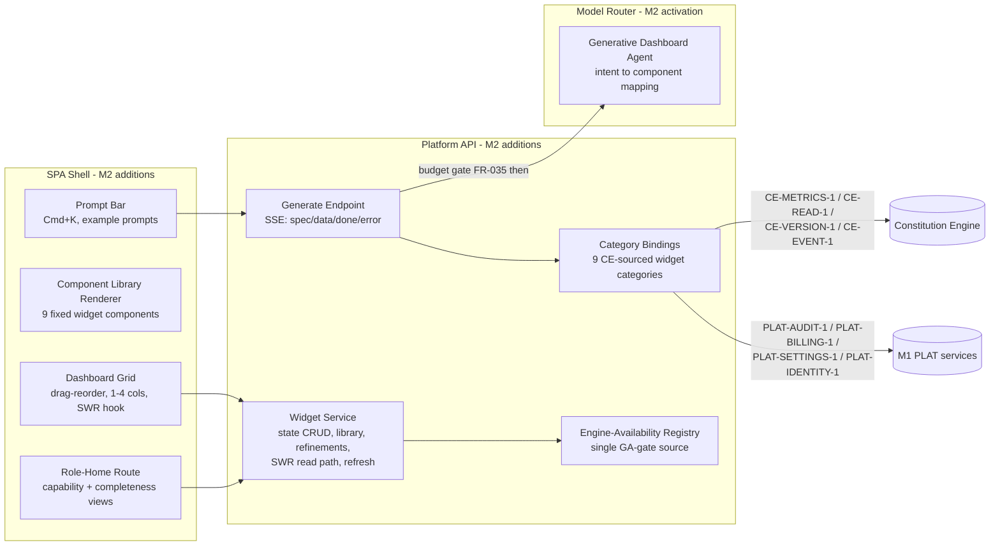
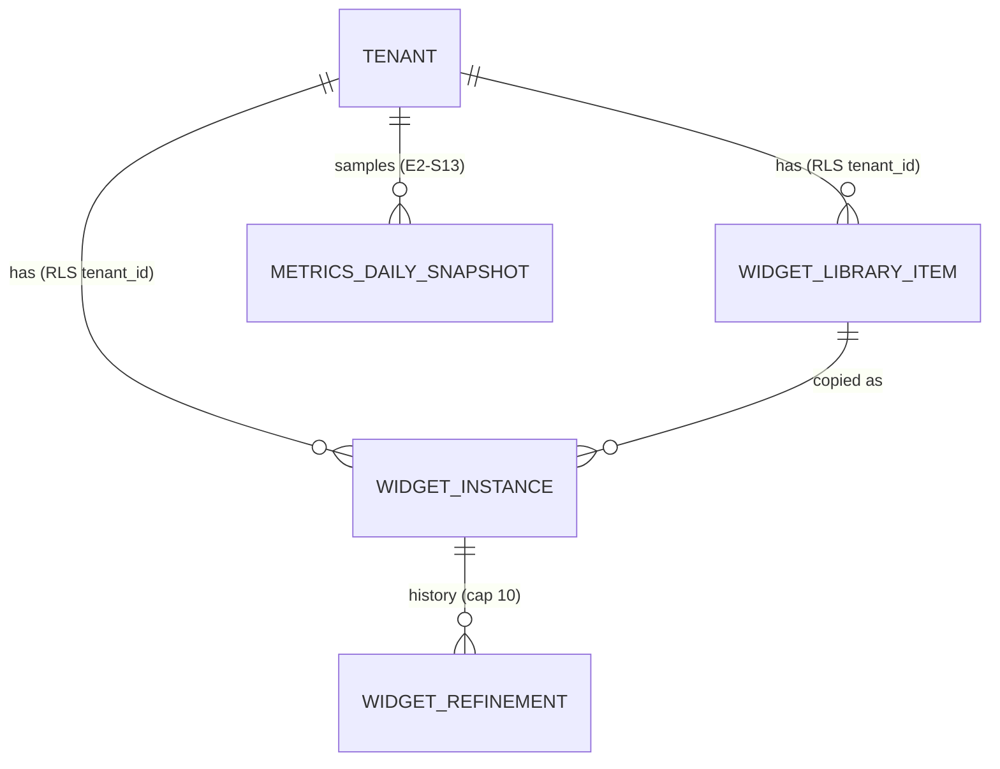

# Weave Platform — M2 Tech-Spec Delta

**Scope rule:** this document contains ONLY what changes from M1. `architecture.md`,
`data-model.md`, `business-process.md`, and `testing-strategy.md` remain authoritative for
everything not restated here. Contract shapes are canonical in
[`contracts.md`](../../../contracts.md) — cited, never redefined. Decisions:
[ADR-012](../decisions/ADR-012.md) (SSE streaming), [ADR-013](../decisions/ADR-013.md)
(SWR last-result), [ADR-014](../decisions/ADR-014.md) (Aurora widget state).
M2 scope: EPIC-001 (E1-S0..S7), EPIC-002 CE-sourced stories (S1, S2, S5, S7-CE, S10, S11,
S13, S14, S15), EPIC-010 (role-home).

## 1. Component delta (Arch Law 5)

New M2 components inside existing containers — everything else in `architecture.md` C4 is
unchanged. The Model Router's dashboard agent, dormant at M1, activates.

- **Widget Service** owns all widget state (ADR-014 tables) and the SWR read path (ADR-013).
- **Generate Endpoint** is the only LLM-touching route; it calls the Model Router *after* the
  FR-035 budget gate and meters tokens on the existing PLAT-BILLING-1 queue (ADR-012).
- **Engine-Availability Registry** is the single source for "is this source engine GA" —
  consumed by category gating (FR-015), example-prompt scoping (E1-S7), starter selection
  (E1-S6), and role-home "coming soon" (E10). One source, so the epic AC's single
  consistency test can cover all surfaces. At M2 it is a static config map
  (`ce: ga, build: pending, events: pending, explorer: pending`) — a service endpoint is
  YAGNI until an engine flips at runtime. **Pinned signatures (one module, two views):**
  `availability.is_ga(source_engine: str) -> bool` and
  `availability.source_available(contract_ids: list[str]) -> bool` (maps contract IDs →
  owning engine → `is_ga`; used where callers hold contracts, e.g. library-item tags).
  No other call shapes.

## 2. Component library + declarative intent mapping (FR-005, E1-S2)

Finite library — **9 components**, closed set; adding one is a spec amendment:
`kpi_card` · `line_area_chart` · `bar_chart` · `ranked_list` · `activity_feed` ·
`pie_donut` · `heatmap` · `alert_banner` · `table`.

Mapping is a **declarative rule table** the dashboard agent must select from (never free-form
code; output is a `WidgetSpec`, JSON-schema-validated before the `spec` event emits):

| Data shape / intent | Component |
|---|---|
| single count / status | `kpi_card` |
| time trend | `line_area_chart` |
| category comparison | `bar_chart` |
| ranked items | `ranked_list` |
| event log | `activity_feed` |
| part-of-whole ratio | `pie_donut` |
| two-dimensional matrix | `heatmap` |
| threshold breach / alert | `alert_banner` |
| general rows | `table` |

- Named-type override: a component named in the prompt wins if data-shape-compatible;
  incompatible types are disabled with a reason (FR-006).
- **Two distinct decline states — never conflated (FR-004 vs FR-015):**
  `source_not_ga` = the resolver classified the prompt to a real category whose owning
  engine is not GA per the availability registry (deterministic registry check AFTER the
  resolver classifies — never a keyword guess); `unsatisfiable` = no library component
  matches the resolved data shape OR no data source exists for the intent at all. The
  registry decides GA-ness; the resolver decides satisfiability.
- "Change visualisation" re-renders the held data client-side — no re-prompt, no re-fetch.

## 3. SSE generation surface (ADR-012)

`POST /api/dashboard/widgets/generate` and `POST /api/dashboard/widgets/{id}/refine` return
`text/event-stream`. Event grammar (Pydantic models are the contract; JSON payloads):

| Event | Payload | Notes |
|---|---|---|
| `spec` | `WidgetSpec { component_type, title, data_source_contracts[], bindings, column_span }` | first event; skeleton renders from it; the ≤ 1 s p95 target is measured to this event |
| `data` | `{ rows | points | cells, partial: bool }` | chunked; ≤ 1,000 points per FR SLA |
| `done` | `{ token_count, widget_id? }` | terminal; token receipt for metering reconciliation |
| `error` | `{ state, reason }` — `state ∈ budget_cap · unsatisfiable · provider_503 · unavailable · source_not_ga` (canonical tokens, underscore form — identical to the §6 matrix names where they map; no hyphen variants anywhere) | terminal; maps 1:1 to the honest-state matrix (§6) |

- Order invariant: exactly one `spec`, then zero-or-more `data`, then exactly one terminal
  (`done` | `error`).
- Budget: FR-035 gate **before** the Model Router call; cap reached mid-stream ⟹ `error
  budget_cap`, partial widget rolled back (no partial save) — E1-S1 AC.
- Gate order: budget gate → resolver (model classifies intent) → **availability-registry
  check on the resolved category** (`source_not_ga` if the owning engine is not GA) →
  data fetch. The keyword table is a latency-contingency spec source only (below) — it is
  never the authority for GA-gating or satisfiability.
- Refine: request carries the current `WidgetSpec` + delta prompt; response uses the same
  grammar; history append is server-side (§4), capped at 10 (tunable); refine failure
  preserves prior state (FR-007).
- **Latency contingency (carried from ADR-012 confidence flag, binds TASK-011 ACs):** if the
  ≤ 1 s-to-`spec` p95 misses with the mid-tier call in the path, the endpoint emits a
  provisional `spec` from rule-based keyword mapping (§2 table keyed on prompt keywords) and
  the agent-resolved spec follows as a spec-replacing `refine` — grammar unchanged, so this
  is a fallback implementation detail, not a contract change.
- Deploy constraint (ADR-012 §Decision 5): this route streams end to end — Fargate/ALB or
  Lambda response streaming; no buffering proxy.

## 4. Data-model delta (ADR-014) — extends data-model.md ERD

Four new Aurora tables. **Isolation is TENANT-scoped** (workspace ≡ company/tenant; the
Workspace level was removed 2026-07-08 — no `workspace_id` column on any M2 table, per
data-model.md §Workspace). Every table carries `tenant_id NOT NULL` with the **DB-enforced
Postgres ROW LEVEL SECURITY policy family** (ADR-002/003:
`CREATE POLICY … USING (tenant_id = current_setting('app.tenant_id')::uuid)` +
`weave_app` grants) as the backstop **in addition to** the app-layer base predicate —
tenant isolation must hold even if application code regresses. The M1 cross-tenant-read
test extends to all four.

### `widget_instances`

| Column | Type | Constraints | Notes |
|---|---|---|---|
| `id` | UUID | PK | — |
| `tenant_id` | UUID | FK → tenants, NOT NULL | RLS anchor (DB-enforced policy — §4 intro) |
| `scope` | varchar | CHECK IN ('user','tenant_default','role_home') | E1-S0 fixed tiles = `tenant_default` (one default set per company; was `workspace_default` pre workspace-drop), `owner_principal_iri` NULL |
| `owner_principal_iri` | varchar | NULL only when scope ≠ 'user' | (tenant,user) pin scoping (FR-008) |
| `spec` | JSONB | NOT NULL | `WidgetSpec` (§3) — validated against the same schema as the SSE `spec` event |
| `position` | int4 | NOT NULL | grid order (drag-reorder, FR-010) |
| `refresh_interval_s` | int4 | NOT NULL DEFAULT 300 | tunable (FR-009) |
| `last_result` | JSONB | — | SWR payload (ADR-013); NULL until first successful fetch |
| `fetched_at` | timestamptz | — | staleness anchor |
| `status` | varchar | CHECK IN ('fresh','stale','pending','unavailable','source_not_ga') | §6 matrix |
| `library_item_id` | UUID | FK → widget_library_items, NULL | provenance when added from library (E1-S5 independent copy) |
| `suggested` | boolean | NOT NULL DEFAULT false | E1-S6 starter flag; cleared on first pin/remove |
| `created_at` / `updated_at` | timestamptz | NOT NULL | — |

Index: `(tenant_id, scope, owner_principal_iri)`.

### `widget_library_items`

Tenant-scoped (the "workspace library" = the company library; workspace ≡ tenant).

| Column | Type | Constraints |
|---|---|---|
| `id` | UUID | PK |
| `tenant_id` | UUID | FK → tenants, NOT NULL (RLS, DB-enforced) |
| `name` / `description` | varchar / text | NOT NULL / — |
| `spec` | JSONB | NOT NULL (`WidgetSpec`) |
| `author_principal_iri` | varchar | NOT NULL (FR-011: author + date displayed) |
| `published_at` | timestamptz | NOT NULL |

Index: `(tenant_id)`. Publish requires `author` authority (403 otherwise,
audited via PLAT-AUDIT-1).

### `widget_refinements`

| Column | Type | Constraints |
|---|---|---|
| `id` | UUID | PK |
| `tenant_id` | UUID | FK → tenants, NOT NULL (RLS) |
| `widget_instance_id` | UUID | FK → widget_instances, NOT NULL, ON DELETE CASCADE |
| `seq` | int4 | NOT NULL; UK `(widget_instance_id, seq)` |
| `prompt` | text | NOT NULL |
| `resulting_spec` | JSONB | NOT NULL |
| `created_at` | timestamptz | NOT NULL |

App-enforced cap: 10 rows per widget (tunable via PLAT-SETTINGS-1); oldest deleted on insert.

### `metrics_daily_snapshots` *(added with TASK-016 — E2-S13 growth history)*

`CE-METRICS-1` is point-in-time; the growth-trend widget needs a series. The platform samples
it: on each successful metrics fetch, upsert one row per (tenant, day). No scheduler at M2 —
a tenant nobody opens needs no history; the stagnation advisory is suppressed until ≥ 14
samples exist (TASK-016 AC-8).

| Column | Type | Constraints |
|---|---|---|
| `id` | UUID | PK |
| `tenant_id` | UUID | FK → tenants, NOT NULL (RLS, same policy family) |
| `day` | date | NOT NULL; UK `(tenant_id, day)` |
| `entity_count` | int4 | NOT NULL (sum of `entity_count_by_kind`) |
| `counts_by_kind` | JSONB | NOT NULL |

Entity counts only at M2 — `CE-METRICS-1` exposes no relationship count (flagged as a
potential CE contract field; not invented platform-side).

**RDF/OWL mapping: none.** Widget state is application/UI state, not graph-model content — it
is deliberately NOT projected into the tenant graph (the semantic-web-native rule applies to
graph-model entities; a pinned chart is not one). Pin/publish/delete actions ARE audit events
(PLAT-AUDIT-1), which is where their provenance lives.

## 5. Endpoint delta + p95 targets (Arch Law 2)

All routes: Cognito JWT + RBAC middleware (M1), tenant-scoped, OTel span attributes per PRD
§2.2 observability (`prompt_hash`, `component_type`, `data_source_contract`, `token_count`,
`latency_ms`, `tenant_id`). Targets measured at dev-AWS smoke conditions, CE seeded per its
100k-triple fixture.

| Endpoint | p95 target | Notes |
|---|---|---|
| `POST /api/dashboard/widgets/generate` (SSE) | `spec` event ≤ 1 s; terminal ≤ 5 s (≤ 1,000 points) | FR-003; §3 contingency applies |
| `POST /api/dashboard/widgets/{id}/refine` (SSE) | same as generate | FR-007 |
| `GET /api/dashboard/widgets?scope=…` | ≤ 200 ms | SWR read: state + `last_result`; dashboard ≤ 2 s SLA is met from this |
| `POST /api/dashboard/widgets` (pin) | ≤ 300 ms | writes audit entry in-txn |
| `PATCH /api/dashboard/widgets/{id}` (spec / column_span) | ≤ 300 ms | single-widget update (change-viz persistence, span) |
| `PATCH /api/dashboard/widgets/order` (batch reorder) | ≤ 300 ms | `{ ids_in_order }`; one txn, one audit entry (TASK-014) |
| `DELETE /api/dashboard/widgets/{id}` (unpin / starter removal) | ≤ 300 ms | remove is DELETE, never PATCH |
| `POST /api/dashboard/widgets/{id}/refresh` | ≤ 500 ms + upstream contract latency | revalidation; failure ⟹ `stale`, never blank |
| `GET /api/dashboard/library` · `POST /api/dashboard/library` · `POST /api/dashboard/library/{id}/add` | ≤ 300 ms | add creates an independent per-user `widget_instances` copy |
| `GET /api/role-home` | ≤ 500 ms cold / ≤ 200 ms warm | aggregates CE-METRICS-1 (CE caches 60 s) + availability registry |

Error responses follow the M1 API convention set (400/401/403/404/422/500); SSE terminal
`error` events are the in-stream equivalent (§3).

## 6. Honest-state matrix (normative — every widget resolves to exactly one)

| State | Trigger | Render |
|---|---|---|
| `fresh` | successful fetch within refresh interval | data + data-source footer (FR-014) |
| `stale` | refresh failed (E1-S4) OR `fetched_at` older than 2× refresh interval (ADR-013) | last payload + stale badge + timestamp |
| `pending` | CE-METRICS-1 sub-field returns `{ "pending": true }` (canonical note, contracts.md CE-METRICS-1) — currently `shacl_errors_by_severity` | "counts pending" chip on the affected metric; other fields render normally; **never zeros** |
| `unavailable` | provider/contract error with no prior successful payload | defined unavailable state + named reason + retry (FR-002); never blank/hallucinated |
| `source_not_ga` | category's source engine not GA per availability registry (FR-015) | "source engine not yet available" state; also governs starters, example prompts, role-home coming-soon |

`pending` is per-field, the others per-widget: a tile can be `fresh` with one pending chip.
One parametrised degradation sweep test covers all five (epic AC).

## 7. Role-home delta (EPIC-010)

- Separate route in primary nav (not a modal), M1 shell chrome unchanged.
- Data: `CE-METRICS-1` (`entity_count_by_kind`, `shacl_errors_by_severity`,
  `draft_published_delta`) + `CE-READ-1` `coverage_gap(kind, required_links[])` rows
  (exact contract signature; row shape `{ entity_iri, missing_link }` — the platform
  passes the kind/links pairs it needs and never derives per-kind link requirements
  itself) for the completeness map;
  role resolution via the M1 RBAC middleware (PLAT-SETTINGS-1); capability visibility
  filtered by the user's authority level (epic AC role-matrix test) and the availability
  registry (§1) for coming-soon items.
- Rendering reuses §2 library components + the §6 state matrix (role-home tiles are
  `scope='role_home'` widget instances with SWR semantics — no parallel rendering path).
- Role→view content table (which capabilities/copy per canonical role) is task-brief-level
  detail (TASK-017), sourced from PRD §Personas.

## 8. Page targets (Arch Law 3)

M2 pages — **Dashboard** (generative grid) and **Role-Home** — inherit the platform's own
E0-S5 release gate, which is stricter than any per-page floor: **Lighthouse = 100 across all
four categories, axe-core = 0 violations (WCAG 2.1 AA)** on the built app. Specific M2
obligations: prompt bar, grid actions (pin, refine, publish, reorder) keyboard-achievable;
streaming skeletons carry `aria-busy`; state badges (§6) are text + colour, never colour-only.

## 9. Testing-strategy delta

Extends `testing-strategy.md`; pyramid proportions, frameworks (Pytest / Vitest / Playwright),
coverage ≥ 80% and mutation ≥ 60% gates unchanged. New required families:

| Family | Layer | What it proves |
|---|---|---|
| SSE event-grammar contract tests | integration (Pytest, no browser) | §3 order invariant; every terminal state reachable; schemas validate |
| Intent-mapping audit | unit, parametrised | every prompt fixture resolves to exactly one §2 component or declines — no free-form path (epic AC) |
| Degradation sweep | integration, parametrised | all five §6 states incl. per-field `pending` — one sweep (epic AC) |
| Budget-cap mid-stream | integration | halt + rollback, no partial `widget_instances` row |
| Cross-tenant/cross-user widget state | integration (extends M1 cross-tenant-read test) | tenant A sees zero of B's widget rows **with the app-layer predicate disabled** (proves the DB RLS backstop alone); user X sees none of Y's pins; library visible tenant-wide |
| Pin persistence | E2E (Playwright, two contexts) | same user, second device/session sees pins with live data (FR-008) |
| Publish/add independent copy | E2E | copy refreshes same contract, independently refinable (E1-S5) |
| Role-home role matrix | integration + one E2E | Viewer/Analyst/Engineer see only role-appropriate capabilities; coming-soon consistency with FR-015 uses the SAME availability registry fixture (epic AC single test) |
| Prompt→stream→pin→publish happy path | E2E | Plugin Law B: browser E2E asserting backend state changed (widget row exists post-pin) |

LLM in tests: the Model Router is faked at its provider abstraction (M1 pattern) — no live
Bedrock/Anthropic calls (Plugin Law F); the intent-mapping audit runs against recorded
fixtures plus the rule table, not a live model.

## 10. Invariants delta (Arch Law 10)

Appended to the M1 invariant set; QA verifies each. (Paths assume the monorepo layout
`packages/backend` / `packages/frontend` from TASK-001.)

- LLM calls for widget generation happen only in the Model Router behind the budget gate —
  verify-by: `packages/frontend` + `grep -ri "anthropic\|bedrock" packages/frontend/src` → no hits.
- Widget state is never written to localStorage — verify-by: `packages/frontend/src` +
  `grep -rn "localStorage" packages/frontend/src` → no widget-state usage (theme/collapse prefs exempt).
- SSE grammar: exactly one `spec`, then `data`*, then one terminal — verify-by:
  `packages/backend` + `grep -rn "event: spec" packages/backend` co-located with the order test.
- All four M2 tables (3 widget + metrics_daily_snapshots) carry `tenant_id` + RLS policy —
  verify-by: migrations dir + `grep -n "ROW LEVEL SECURITY" <M2 migrations>` (4 tables).
- `shacl_errors_by_severity` pending shape never renders zeros — verify-by: degradation sweep +
  `grep -rn "pending" packages/frontend/src/**/widgets` (pending branch exists).
- Component set is closed at 9 — verify-by: component registry file +
  `grep -c "component_type" <registry>` matches §2 list exactly.
- Availability gating has one source — verify-by:
  `grep -rn "availability" packages/backend` → single registry module imported by category
  bindings, starters, prompts, role-home.
- Dashboard SSE route deploys on a streaming-capable runtime (no buffering proxy) —
  verify-by: Terraform/deploy config + `grep -n "generate" <alb/lambda config>` reviewed at
  arch-delivery (constraint logged in coordinator ledger).
