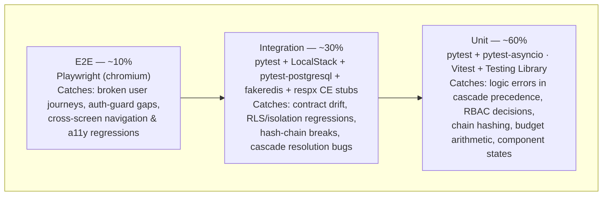

# Testing Strategy: Weave Platform Shell

## 1. Testing Pyramid Overview



| Layer | Tools | Coverage target | Mutation gate | Run in CI |
|-------|-------|-----------------|---------------|-----------|
| Unit | pytest + pytest-asyncio · Vitest + @testing-library/react | ≥ 80% (shared line target) | ≥ 70% (mutmut / Stryker) | Every push |
| Integration | pytest + LocalStack + pytest-postgresql + fakeredis + respx | contributes to shared ≥ 80% | N/A (fake-infra non-determinism) | Every push |
| E2E | Playwright (chromium) | Critical paths + 4 release-gate journeys | N/A | PR merge gate |

The four **M1 release-gate tests** (cross-tenant isolation, audit-tamper, revocation latency,
budget fail-closed — PRD §2.2/§2.6, architecture.md §Invariants) each exist at BOTH the
integration layer (fast, per-push) and the E2E layer (assembled-app proof, merge gate).

## 2. Unit Test Strategy

### Python (Platform API)

```text
packages/backend/tests/unit/
├── test_settings_cascade.py     # tighter-wins precedence, 3-level resolution (Company→Domain→Project)
├── test_rbac_enforcer.py        # action-level decisions, deny → audit
├── test_audit_chain.py          # prev_hash→hash linking, ed25519 sign/verify
├── test_billing_budget.py       # cap arithmetic, fail-closed under lag
├── test_notify_taxonomy.py      # open taxonomy, channel_unavailable short-circuit
├── test_identity_registry.py    # principal IRI minting, IAM-role mapping
└── conftest.py                  # shared fixtures (factories, fake clock)
```

- Framework: `pytest` + `pytest-asyncio` (async FastAPI handlers); `anyio` backend
- Coverage: `pytest-cov` with `--cov-fail-under=80`
- Mutation: `mutmut run` — CI fails below 60%
- Naming: `test_<function>_<scenario>_<expected_outcome>`
- Mocks: `pytest-mock` at I/O boundaries only (repo layer, CE client, Cognito JWKS) —
  never mock business logic (cascade resolution, chain hashing, budget checks are the
  point of the tests)

```python
@pytest.mark.asyncio
async def test_resolve_setting_returns_tighter_project_value(client: AsyncClient):
    # company cap 100, project cap 50 → effective 50, source level "project"
    response = await client.get("/api/settings/budget_cap?scope=project:p1")
    body = response.json()
    assert response.status_code == 200
    assert body == {"value": 50, "set_at_level": "project"}
```

### TypeScript (SPA Shell)

```text
packages/frontend/src/
└── <feature>/
    └── __tests__/
        ├── CompanySwitcher.test.tsx     # tenant list scoping, super-admin add button
        ├── NotificationCentre.test.tsx  # unread badge, channel_unavailable rendering
        ├── DashboardShell.test.tsx      # M1 placeholder empty state (no CE dependency)
        └── settingsCascade.test.ts      # pure resolution display logic
```

- Framework: `Vitest` (`jsdom`) + `@testing-library/react`
- Coverage: `@vitest/coverage-v8` — `--coverage.thresholds.lines=80`
- Mutation: Stryker with `@stryker-mutator/vitest-runner` — threshold ≥ 60%
- Naming: `should <expected behaviour> when <condition>`
- Mocks: `vi.mock()` at module boundaries; `msw` for HTTP; never mock rendering or
  pure functions

```typescript
it('should render the defined empty state when the dashboard has no widgets (M1)', async () => {
  render(<DashboardShell />);
  expect(await screen.findByText(/your dashboard activates with the constitution engine/i))
    .toBeInTheDocument();
  expect(screen.queryByRole('progressbar')).not.toBeInTheDocument();
});
```

### AC-to-test mapping (PRD §2.2/§2.6 + M1 exit criteria)

| AC ID | EARS scenario | Test file | Test name |
|-------|---------------|-----------|-----------|
| FR-047 / iso | WHEN a query runs in tenant A's context THEN THE SYSTEM SHALL return zero rows from tenant B's data | `test_repo_isolation.py` | `test_query_scoped_to_tenant_returns_zero_foreign_rows` |
| FR-036/037 | WHEN a historical audit entry is altered THEN THE SYSTEM SHALL fail chain verification at the named row | `test_audit_chain.py` | `test_verify_chain_fails_at_named_row_when_entry_mutated` |
| FR-035 | WHEN spend reaches 100% of the effective cap THEN THE SYSTEM SHALL reject the request before any AI call | `test_billing_budget.py` | `test_request_rejected_before_model_call_when_cap_reached` |
| §2.2 revocation | WHEN a principal is revoked THEN THE SYSTEM SHALL reject the next request with the prior token within the bounded latency | `test_rbac_enforcer.py` | `test_revoked_session_version_rejected_on_next_request` |
| PLAT-NOTIFY-1 | WHEN a Slack-enabled preference is evaluated before v1.0 THEN THE SYSTEM SHALL short-circuit to channel_unavailable without error | `test_notify_taxonomy.py` | `test_slack_leg_short_circuits_channel_unavailable` |
| §2.2 security | WHEN a JWT lacks a required permission THEN THE SYSTEM SHALL return 403 AND append an audit entry | `test_rbac_enforcer.py` | `test_missing_permission_returns_403_and_audits_denial` |

Remaining task-level ACs are mapped in each task brief's AC-to-Test Mapping table
(the briefs are the per-task source of truth; this table carries the cross-cutting gates).

## 3. Integration Test Strategy

Integration tests verify contracts between components against faked infrastructure —
never real cloud accounts (Law F).

### Infrastructure fakes

| Service | Dev/test fake | How to start |
|---------|---------------|--------------|
| Cognito / S3 / S3 Vectors / Secrets Manager / Lambda / SQS | LocalStack via Docker Compose | `docker compose -f tests/integration/docker-compose.test.yml up localstack` |
| Aurora PostgreSQL | `pytest-postgresql` fixture (RLS policies applied in migration fixtures) | auto-provisioned per session |
| ElastiCache Redis | `fakeredis` | `fakeredis.FakeAsyncRedis()` fixture |
| Constitution Engine (CE-READ-1 / CE-VERSION-1 / CE-DIFF-1 / CE-METRICS-1) | `respx` HTTP stubs with recorded contract-shaped responses pinned to `contracts.md` schemas | fixture per contract |
| Oxigraph (platform-owned graphs: tenancy, principals, framework vocab — ADR-001) | `pyoxigraph` `Store()` in-memory; Testcontainers Oxigraph image for full SPARQL-compliance runs | `rdf_store` fixture |
| Bedrock / AgentCore | stubbed Agent SDK transport (no real model calls in the pyramid; agent quality evals live in `docs/standards/testing-agents.md` CI lane) | fixture |

The graph boundary is split (architecture.md D1): the platform's own scoped SPARQL layer (query
rewriter, named-graph registry) tests against in-memory Oxigraph; ontology/business graph access
tests against CE contract stubs. Contract-shape drift is caught by validating stub payloads
against the Pydantic models generated from `contracts.md` definitions.

```python
@pytest.fixture
def rdf_store():
    from pyoxigraph import Store
    return Store()  # ephemeral; destroyed after test
```

### Directory layout

```text
packages/backend/tests/integration/
├── conftest.py                  # LocalStack, pytest-postgresql (with RLS), fakeredis, respx fixtures
├── docker-compose.test.yml
├── test_settings_resolution.py  # cascade against real Postgres rows + Redis cache
├── test_rbac_boundary.py        # 401/403 + audit-on-deny through the real middleware stack
├── test_audit_append_only.py    # DB constraint rejects UPDATE/DELETE; chain survives restart
├── test_isolation_rls.py        # two seeded tenants; cross-read returns zero rows (release gate)
├── test_billing_metering.py     # meter queue separate from run outcome; fail-closed under lag
├── test_notify_delivery.py      # in-app persistence before channel attempt
├── test_query_rewriter.py       # unscoped SPARQL → 400 unscoped_query_rejected; GRAPH pinned to session tenant
└── test_ce_client_contracts.py  # version pinning, unavailable-state propagation
```

### Fixture patterns

```python
@pytest.fixture(scope="session")
def localstack_endpoint():
    return os.getenv("LOCALSTACK_ENDPOINT", "http://localhost:4566")

@pytest.fixture
def secrets_client(localstack_endpoint):
    return boto3.client("secretsmanager", endpoint_url=localstack_endpoint,
                        aws_access_key_id="test", aws_secret_access_key="test",
                        region_name="us-east-1")

@pytest.fixture
def ce_read_stub(respx_mock):
    respx_mock.get(url__regex=r".*/api/ontology/types").respond(
        json=CE_READ_1_TYPES_FIXTURE)  # shape-validated against contracts.md models
    return respx_mock
```

### Must cover

- Every REST endpoint that touches Postgres, Redis, S3 Vectors, or Secrets Manager
- The full auth chain (JWKS verify → session-version check → RBAC → audit-on-deny)
- Aurora RLS + repo-layer tenant filter together (defence-in-depth, both asserted)
- Audit hash chain across process restart (chain head reloaded, next entry links)
- Settings cascade write-through cache invalidation
- Scoped RDF layer: unscoped-query rejection, tenant-scoped search returns zero foreign rows
- CE contract client: version pinning, error → defined unavailable state

### Must NOT

- Call real AWS endpoints (no real credentials or region endpoints anywhere)
- Share state between tests (ephemeral fixtures per test)
- Test UI rendering (unit or E2E territory)

## 4. E2E Test Strategy

Framework: Playwright (TypeScript), against the locally started assembled app
(`TEST_BASE_URL`, default `http://localhost:3000`), LocalStack-backed API.

```text
tests/e2e/
├── playwright.config.ts          # baseURL from env; workers: CI ? 1 : 4; artifacts on failure
├── fixtures/
│   ├── auth.fixture.ts           # authenticated page per role (admin, viewer, super-admin)
│   └── seed.fixture.ts           # two-tenant seed for isolation journeys
├── shell-navigation.spec.ts      # primary nav, disabled-not-hidden engine areas, sidebar collapse
├── company-switch.spec.ts        # switcher + ≤2s timing assertion; super-admin add-company
├── auth-guard.spec.ts            # unauthenticated redirect; revoked-session rejection
├── isolation.spec.ts             # tenant A UI never renders tenant B data (release gate)
├── notifications.spec.ts         # in-app delivery; security.* always delivered
├── settings-cascade.spec.ts      # set at company, observe at project; tighter wins
└── dashboard-shell.spec.ts       # M1 placeholder empty state renders; no CE call issued
```

| AC ID | EARS scenario | Spec file | Status |
|-------|---------------|-----------|--------|
| FR-047 | WHEN a tenant-A user browses any screen THEN THE SYSTEM SHALL render zero tenant-B artefacts | `isolation.spec.ts` | Planned |
| §2.2 revocation | WHEN an admin revokes a signed-in member THEN THE SYSTEM SHALL reject that member's next navigation within the bounded latency | `auth-guard.spec.ts` | Planned |
| M1 exit | WHEN the M1 shell loads THEN THE SYSTEM SHALL render the placeholder dashboard empty state without querying CE | `dashboard-shell.spec.ts` | Planned |
| §2.2 perf | WHEN a user switches company THEN THE SYSTEM SHALL complete the switch within 2 s (p95, default) | `company-switch.spec.ts` | Planned |
| PRD Nav | WHEN an engine is not yet GA THEN THE SYSTEM SHALL render its nav area disabled, not hidden | `shell-navigation.spec.ts` | Planned |

Minimum scenarios (always required): happy path (sign in → shell → switch company →
settings), auth guard (unauthenticated → login redirect), error state (API 500 → graceful
error, no blank shell). Accessibility: axe-core assertions run inside the E2E suite on the
WCAG-gated screens (prompt bar M2, notification centre, settings, Compliance/Audit) —
zero violations is a release gate (PRD §2.2).

CI gate: E2E runs on the PR merge gate only; unit + integration run every push.
`ui_verify.sh --full` (cross-screen reachability + a11y) runs at epic close per the
implement loop and consumes this same Playwright install.

## 5. Test Data Management

| Layer | Strategy | Rationale |
|-------|----------|-----------|
| Unit | Inline factories (`make_tenant`, `make_principal`, `makeUser`) | Fast, deterministic, no I/O |
| Integration | pytest fixtures + per-session ephemeral Postgres/Redis; two-tenant seed helper | Isolation is itself under test — seeds must be per-test |
| E2E | Playwright `seed.fixture.ts` calling a test-only seed endpoint (disabled outside test env) | Reproducible starting state |

```python
def make_audit_entry(seq=None, actor="urn:weave:principal:test", engine="platform",
                     event_type="settings.write", prev_hash=b"", **overrides):
    return AuditEntry(seq=seq, ts=FIXED_CLOCK.now(), actor_principal_iri=actor,
                      engine=engine, event_type=event_type, prev_hash=prev_hash, **overrides)
```

```typescript
export const makePrincipal = (overrides: Partial<Principal> = {}): Principal => ({
  iri: `urn:weave:principal:${crypto.randomUUID()}`,
  kind: "human",
  roles: ["viewer"],
  ...overrides,
});
```

Prohibited: shared mutable test databases; hardcoded UUIDs/IDs; production data snapshots
(synthetic only — Law F); secrets or PII in fixtures (fake values via `faker`); asserting
on wall-clock time (inject `FIXED_CLOCK` — the audit chain and revocation tests depend on
deterministic timestamps).

## 6. Performance and Load Testing

The platform exposes public API endpoints and serves the shell UI — this section applies.

| Endpoint pattern | Method | P50 target | P95 target | P99 target |
|-----------------|--------|-----------|-----------|-----------|
| `/api/settings/{key}` (resolved read) | GET | < 50ms | < 150ms | < 300ms |
| `/api/audit` (emit) | POST | < 100ms | < 300ms | < 500ms |
| `/api/audit/export` (NDJSON) | GET | < 500ms | < 1500ms | < 3000ms |
| `/api/search` | GET | < 150ms | < 300ms (after 150ms debounce, PRD) | < 500ms |
| `/api/notifications` | GET | < 100ms | < 300ms | < 500ms |

Load tool: `locust`, in the `performance` CI workflow (weekly schedule + any PR touching a
hot-path endpoint — audit emit and settings resolution are the hot paths: every request in
the platform crosses both).

```python
class PlatformUser(HttpUser):
    wait_time = between(1, 3)

    @task(3)
    def resolve_setting(self):
        self.client.get("/api/settings/budget_cap?scope=company:c1")

    @task(1)
    def emit_audit(self):
        self.client.post("/api/audit", json=AUDIT_EVENT_FIXTURE)
```

| Lighthouse metric (shell UI) | Target |
|--------|--------|
| Performance score | ≥ 90 |
| Accessibility score | ≥ 95 |
| Best practices score | ≥ 90 |
| Initial JS bundle (gzipped) | ≤ 200KB |

Lighthouse runs on every PR modifying a page component or layout; the ≤ 2 s dashboard
initial load and ≤ 2 s company switch (PRD §2.2) are asserted as Playwright timing
checks in the E2E lane, with locust guarding the API-side latency budget.

---

*Generated by Weave arch-quality skill. Review and approve before task decomposition.*
