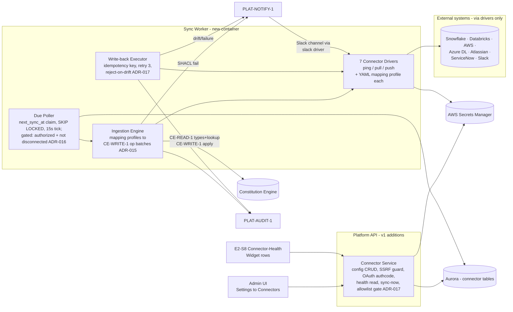
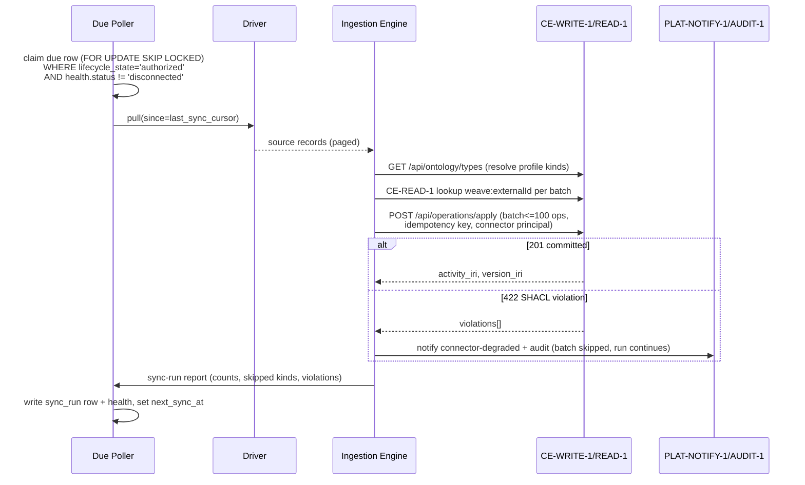

# Weave Platform — v1.0 Tech-Spec Delta

**Scope rule:** this document contains ONLY what changes from M1 + M2. `architecture.md`,
`data-model.md`, `business-process.md`, `testing-strategy.md`, and `m2-delta.md` remain
authoritative for everything not restated here. Contract shapes are canonical in
[`contracts.md`](../../../contracts.md) — cited, never redefined. Decisions:
[ADR-015](../decisions/ADR-015.md) (ingestion mapping profiles),
[ADR-016](../decisions/ADR-016.md) (sync scheduling), [ADR-017](../decisions/ADR-017.md)
(write-back allowlist + conflict policy, resolves OQ-07).

v1.0 scope: EPIC-007 S1–S3 (`PLAT-CONNECTOR-1` — config, health, ingestion + write-back),
EPIC-006 Slack delivery channel, EPIC-002 E2-S8 connector-health widget rows.
Precondition: CE GA with `CE-WRITE-1` published + pinned.

## 1. Component delta (Arch Law 5)

Two new components: the **Connector Service** (inside the existing Platform API container)
and the **Sync Worker** (new container, same codebase, separate entrypoint). Everything
else in `architecture.md` C4 is unchanged.

Boundary reminder (contract seam): CE v1 owns document-corpus ingest (uploaded files);
**Platform v1 owns live managed connectors**. Both write via `CE-WRITE-1`; neither touches
the graph store directly.

## 2. Ingestion pipeline (ADR-015) — normative sequence

Normative rules (each maps to a named test in §7):

- **Poller lifecycle/health gate:** the poller claims only rows with
  `lifecycle_state = 'authorized'` AND `connector_health.status != 'disconnected'`.
  `configured` (not yet authorized), `error`, `revoked`, and `disconnected` connectors
  never sync. `degraded` connectors DO sync — sustained-skip recovery (ADR-015 §2)
  requires it. OAuth types reach `authorized` via the auth-code flow (TASK-025);
  credential types via the config-time fail-closed probe (TASK-006).
- **Ingestion idempotency key is content-stable (no run id):**
  `sha256(tenant_id, handle, batch_content_hash)` where `batch_content_hash` is the hash
  of the batch's canonicalised source records (connector instance + source ids + record
  change markers). A post-crash re-pull reproduces the same batches ⟹ same keys ⟹
  CE-WRITE-1 replays the original `201` (pinned semantics: per-tenant key, 24 h window,
  same-key-different-payload → `409`, treated as a batch failure and audited — it means
  the source changed inside the window and the run re-pulls next tick).
- Every op batch is attributed to the **connector-scoped agent principal**
  (`PLAT-IDENTITY-1`); no batch ever uses a user principal.
- **Draft-vs-published dedup scope:** ingestion commits land in the tenant **draft**
  graph (CE-WRITE-1 draft commits; CE-EVENT-1 rows carry `version_iri: null`).
  Connector ingestion **never publishes a version** — publishing stays with a human
  `publish`-authority principal. Re-sync dedup therefore must see pre-publish state:
  external-id resolution checks `connector_external_refs` first, and its CE-READ-1
  fallback queries the **current draft graph** (not `version=latest` published) — so a
  re-sync between ingest and publish updates the draft node instead of re-minting it.
- Unknown profile kind (absent from `GET /api/ontology/types`) → records skipped +
  counted in the sync-run report; the run does **not** fail (open grammar, ADR-015 §3.2).
  Skipped counts surface through the health read API; the same kind skipped over N
  consecutive runs (default 3, tunable) reads as `degraded`; resync recovers once the kind
  is added (`PLAT-CONNECTOR-1` amendment).
- A `422` fails that batch only; run continues; violations recorded + notified.
- Sync cursor (`last_sync_cursor`) advances only after the run's final batch resolves —
  a crashed run re-pulls from the old cursor and idempotency keys suppress double-apply.
- Write-back (Atlassian/ServiceNow only): re-read target, compare stored change marker,
  drift → reject + notify + audit (ADR-017); 4xx/5xx → bounded retry (default 3, tunable).
  Write-back idempotency key includes the **base change marker**
  (`sha256(tenant_id, handle, external_id, operation_hash, base_change_marker)`) and only
  an `applied` outcome suppresses re-execution — so the legitimate
  reject-on-drift → re-sync → re-issue path is never blocked (ADR-017 §3 as amended).

### 2a. SSRF guard (tenant-supplied endpoints) — normative

Tenant admins supply connector hosts/accounts/instance URLs. Unvalidated, these can point
drivers at `169.254.169.254` (IMDS), VPC-internal services, or the platform's own APIs.
One shared `ssrf_guard` module (Connector Service + all drivers) enforces:

1. **Config-time validation** (TASK-006): HTTPS only; hostname must match the connector
   type's allowed-domain suffix list (Snowflake `*.snowflakecomputing.com` · Atlassian
   `*.atlassian.net` · ServiceNow `*.service-now.com` · Databricks
   `*.azuredatabricks.net` / `*.cloud.databricks.com` · Azure DL
   `*.dfs.core.windows.net` · Slack `slack.com` · AWS = SDK endpoints only, no free-form
   URL); resolved A/AAAA records must not fall in loopback, link-local
   (incl. `169.254.169.254`), RFC-1918, CGNAT `100.64/10`, or IPv6 ULA/link-local ranges.
   **Before the denylist check, the resolved address MUST be canonicalised:** IPv4-mapped
   IPv6 literals (e.g. `::ffff:169.254.169.254`) unwrap to their IPv4 form, and
   non-canonical IP encodings (decimal, e.g. `2852039166`; octal, e.g. `0251.0376.169.254`;
   hex) are rejected outright rather than parsed — the denylist only ever compares
   canonical dotted-quad/colon-hex forms. Violations → 422
   `{"error": "endpoint_not_allowed"}`, connector `disconnected`.
2. **Connect-time re-validation, DNS-rebind aware** (TASK-018): re-resolve at connection,
   pin the validated IP for the socket (or re-check per connection), block-listed IP at
   connect ⟹ abort + audit `security.connector_ssrf_blocked`; HTTP redirects are not
   followed cross-host without re-validation. The same canonicalisation rule (item 1)
   applies here — it lives once in the shared `ssrf_guard` module, not duplicated per call
   site.
3. **Test/dev escape:** the compose-stack fixture servers live on private IPs; they are
   reachable only when the `connectors.allow_private_endpoints` settings flag is on
   (default **off**; the deploy config never sets it in production — invariant §8).

## 3. Slack notification channel (EPIC-006, v1 activation)

The M1 notification service's channel registry gains one entry: `slack`, backed by the
Slack connector driver (`chat.postMessage`, token from Secrets Manager path
`weave/{tenant_id}/slack/credentials`). Channel selection honours per-user preferences
(M1 `TASK-007` machinery — unchanged). Failure semantics per E6-S1: channel failure never
blocks in-app delivery; the channel failure itself is recorded (`PLAT-AUDIT-1`) and the
connector's health `error_count` increments. No Slack connector configured → channel
reports "unavailable", silently skipped for that tenant (in-app still delivers).

## 4. Data-model delta — extends `data-model.md` ERD

All tables in the existing Aurora database under the M1 RLS family (tenant-scoped,
`weave_app` role, ADR-002/003 machinery — nothing new to prove).

### `connector_configs` + `connector_health` — canonical in `data-model.md` (unified 2026-07-08)

The connector table is defined **once**, in
[`data-model.md` §Connector Config / §Connector Health](data-model.md): the M1 base
(`secret_arn`, `lifecycle_state`, separate 1:1 `connector_health` row) extended
**additively** at v1 with `handle`, `sync_direction`, `sync_frequency`, `next_sync_at`,
`last_sync_cursor` (config) and `last_sync`, `error_count`, `kinds_skipped` (health).
ONE status enum: `connected | degraded | disconnected`. This delta previously folded
health columns into the config row with a `healthy|degraded|offline` enum and a
`secret_path` column — that variant is **superseded**; v1 migrations ALTER the M1 tables,
they do not create a parallel schema.

### `connector_sync_runs`

| Column | Type | Notes |
|---|---|---|
| `id` | uuid PK · `tenant_id` uuid · `connector_config_id` uuid FK | RLS key on tenant |
| `started_at` / `finished_at` | timestamptz | |
| `outcome` | text | `ok` \| `partial` \| `failed` |
| `records_pulled` / `ops_applied` / `batches_rejected` / `kinds_skipped` | int | sync-run report |
| `violations` | jsonb | CE-WRITE-1 422 payloads (bounded, latest N) |

### `connector_external_refs`

| Column | Type | Notes |
|---|---|---|
| `tenant_id` uuid · `connector_config_id` uuid FK · `external_id` text | PK (composite) | `external_id` = `"<handle>:<source_id>"`, parse first-colon-only |
| `node_iri` | text NOT NULL | graph node minted/updated for this source record |
| `change_marker` | text | source `updated` marker — ADR-017 conflict check |

*(local cache of the `weave:externalId` mapping — the graph property is authoritative;
this table exists so write-back conflict checks and re-sync lookups don't need a SPARQL
round-trip per record)*

### `writeback_attempts`

| Column | Type | Notes |
|---|---|---|
| `id` uuid PK · `tenant_id` · `connector_config_id` | | RLS key |
| `idempotency_key` | text UNIQUE | `sha256(tenant_id, handle, external_id, operation_hash, base_change_marker)` — marker-scoped so reject-on-drift → re-sync → re-issue mints a NEW key (ADR-017 §3 as amended); only `applied` outcomes suppress re-execution |
| `external_id` / `operation_hash` / `base_change_marker` | text | marker captured at ingest, part of the key |
| `attempts` | int | bounded retry counter (default max 3) |
| `outcome` | text | `applied` \| `rejected_drift` \| `failed` |

## 5. Endpoint delta + p95 targets (Arch Law 2)

| Endpoint | p95 | Notes |
|---|---|---|
| `GET /api/connectors` | 150 ms | list + config/health status (TASK-006) |
| `GET /api/connectors/{type}/health` | 150 ms | cached health row read (probe is async/worker-side); includes latest-run `kinds_skipped` dimension — sustained skips (default 3 runs) read as `degraded` |
| `PUT /api/connectors/{type}/config` | 800 ms | SSRF guard (§2a) + Secrets Manager write + fail-closed credential probe; captures `sync_direction` (ADR-017 allowlist), `sync_frequency`, `handle` |
| `GET /api/connectors/{type}/oauth/authorize` | 150 ms | 302 to provider consent (OAuth types; TASK-025); state = signed nonce |
| `GET /api/connectors/oauth/callback` | 800 ms | code→token exchange, refresh token to Secrets Manager, `lifecycle_state=configured→authorized`, sets `next_sync_at` |
| `POST /api/connectors/{type}/sync` | 100 ms | sets `next_sync_at=now()`, returns 202 (run is async); 409 unless `lifecycle_state='authorized'` |
| `GET /api/connectors/{type}/runs` | 200 ms | paged sync-run history (feeds E2-S8 drill-in) |
| Sync run end-to-end (1k records) | ≤ 60 s | worker-side budget, not an HTTP target; per-run timeout 10 min |

Health probes run worker-side on the sync cadence (+ config-time fail-closed probe);
the HTTP health read never calls an external system inline — it reads the stored row
(30 s Redis TTL per TASK-006 hint is superseded by the row read; Redis optional, not
required).

## 6. E2-S8 connector-health widget rows (page targets — Arch Law 3)

Widget rows render from `GET /api/connectors` (same honest-state matrix as m2-delta §6):
connectors live → per-connector status rows; `PLAT-CONNECTOR-1` unreachable → "health
unknown" + last successful poll time (never a false "connected", per E7-S2 failure AC).
Settings → Connectors page: Lighthouse performance ≥ 90, accessibility ≥ 95 (matches the
M1/M2 page gates; no new page family). Widget rows inherit the dashboard page gates from
`m2-delta.md` §8.

## 7. Testing-strategy delta (Law F — connector test-double matrix)

No test ever contacts a real external service or cloud account. Doubles per connector:

| Connector | Double | Notes |
|---|---|---|
| AWS | **LocalStack** (S3/STS) | real SDK, emulated endpoint |
| Azure Data Lake | **Azurite** | blob/DFS surface |
| Snowflake / Databricks | **recorded-fixture mock HTTP server** (respx/httpx-mock at unit level; a fixture-serving container for integration/E2E) | no emulator exists; fixtures recorded from documented API shapes, checked in |
| Atlassian / ServiceNow / Slack | same recorded-fixture mock server pattern | write-back tests mutate fixture state to drive drift-reject paths |
| Secrets Manager / KMS | **LocalStack** (M1 pattern, unchanged) | |
| CE-WRITE-1 / CE-READ-1 | real CE service in the compose stack (CE is GA — a v1 precondition), Oxigraph-backed | SHACL-reject paths driven with a deliberately-violating profile fixture |

Named must-exist test families (extend `testing-strategy.md` pyramid; ≥ 80 % coverage,
mutation ≥ 60 % hold):

- `test_ingest_commits_only_on_shacl_pass` / `test_ingest_422_skips_batch_notifies_audits`
- `test_ingest_uses_connector_principal_never_user`
- `test_resync_updates_not_duplicates` (external-id identity, ADR-015) /
  `test_presync_draft_not_reminted` (draft-graph dedup, §2)
- `test_unknown_kind_skipped_counted_not_failed`
- `test_crashed_run_repull_idempotent` (cursor + content-stable idempotency key, §2)
- `test_poller_skips_unauthorized_and_disconnected` / `test_degraded_still_syncs` (§2 gate)
- `test_ssrf_config_rejects_private_and_metadata_ranges` /
  `test_ssrf_connect_rebind_blocked` (§2a; parametrised over 169.254.169.254, RFC-1918,
  loopback, ULA; fixture-server escape flag covered)
- `test_ssrf_rejects_non_canonical_ip_encodings` (§2a; asserts both `::ffff:169.254.169.254`
  and a decimal-encoded metadata IP, e.g. `2852039166`, are refused — canonicalisation
  runs before the denylist check, not a string-match bypass)
- `test_writeback_reissue_after_drift_not_suppressed` (marker-scoped key, §2)
- `test_writeback_drift_rejected_notified_audited` / `test_writeback_retry_bounded_3`
- `test_writeback_direction_rejected_for_nonallowlisted_connector` (ADR-017)
- `test_slack_channel_failure_still_delivers_inapp` (E6-S1)
- `test_health_read_unreachable_shows_unknown_never_connected` (E7-S2)
- Secret-handling audit sweep across config/health/ingest/write-back paths (epic AC:
  no credential stored outside Secrets Manager, redisplayed, or logged)

## 8. Invariants delta (Arch Law 10 — appended to `tech-spec/invariants.md` at phase end)

- Graph writes go through CE-WRITE-1 only; no SPARQL UPDATE from platform code —
  verify-by: `grep -r "operations/apply" packages/backend/src/**/connectors` present AND
  `grep -rE "sparql.*(INSERT|DELETE)" packages/backend/src/**/connectors` empty
- Credentials only in Secrets Manager; connector tables store `secret_path`, never values —
  verify-by: `grep -n "secret_path" migrations` + no `credential`-valued column in connector DDL
- Write-back allowlist is atlassian+servicenow — verify-by:
  `grep -n "WRITEBACK_ALLOWLIST" packages/backend/src/**/connectors/*.py`
- Sync scheduling is the SKIP LOCKED due-poller, no EventBridge — verify-by:
  `grep -rn "SKIP LOCKED" packages/backend` present AND `grep -rn "events.amazonaws\|EventBridge" packages/backend/src/**/connectors` empty
- Ingested nodes carry `weave:externalId` — verify-by:
  `grep -rn "externalId" packages/backend/src/**/connectors`
- Connector tests use LocalStack/Azurite/fixture servers, never live endpoints —
  verify-by: `grep -rn "snowflakecomputing.com\|atlassian.net\|service-now.com" packages/backend/tests` empty outside fixtures/
- One shared SSRF guard, applied at config save and at driver connect —
  verify-by: `grep -rn "ssrf_guard" packages/backend/src/**/connectors` (config handler +
  driver transport both import it)
- SSRF denylist check runs only after IP canonicalisation (no raw string match against
  decimal/octal/hex forms or unwrapped IPv4-mapped IPv6) — verify-by:
  `grep -n "canonicalis" packages/backend/src/**/connectors/ssrf_guard*` present, and the
  denylist comparison function's only caller is the canonicalised-address return value
- `connectors.allow_private_endpoints` never set in production deploy config —
  verify-by: `grep -rn "allow_private_endpoints" infra/ .github/workflows` → test/compose only
- Ingestion idempotency key contains no `sync_run_id` — verify-by:
  `grep -rn "sync_run" packages/backend/src/**/connectors/ingest*` absent from key derivation
- Poller claim query contains the lifecycle+health gate — verify-by:
  `grep -n "authorized" packages/backend/src/**/connectors/poller*`
