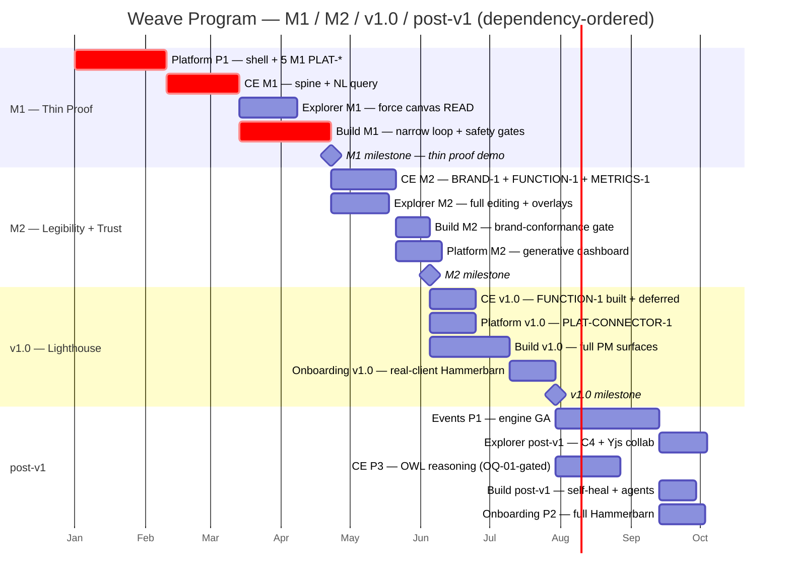

# Weave — Unified Spec

A monorepo platform for describing, visualising, and automating how a company operates — through
ontologies, knowledge graphs, and data models. Weave maps the full enterprise (people, processes,
systems, data, rules, relationships) as a navigable graph, and uses that model to generate
applications, data products, and automations — regardless of whether the underlying data lives in
Snowflake, AWS, Azure, Databricks, or on-prem.

**Positioning:** the operating system for the AI-native company — a living digital twin of the
organization (DTO). Model the business → generate code/agents/pipelines → automate. The moat is
closing that loop on open W3C standards, at mid-market reach, with whole-business NL+forms
authoring — not the triple store, which is commoditising fast (Ardoq's 2026 GraphLake acquisition
brought RDF/OWL/SHACL to an EA incumbent). This is a time-limited window: differentiate on
generation/automation closure before the substrate advantage erodes.

**Where the durable moat actually is** (name it — the substrate is commoditised). Three things
competitors cannot easily copy: (1) **generation/automation closure** — Weave emits **forkable,
client-owned Next.js + FastAPI code**, not a locked hosted runtime (Palantir Workshop / Ardoq lock
clients in; this is a decisive mid-market anti-lock-in argument); (2) the **cross-notation
reconciliation query** — one plain-language question answered across architecture + process + data
+ governance, which no EA tool, process miner, or KG platform delivers (Weave's M1 "wow"); (3) the
**self-improvement flywheel** — an evidence-backed, agent-dispatched loop that compounds value over
time (built post-v1, but the *endgame* moat — name it in the story now, don't bury it).
**Existential hedge:** Microsoft Fabric could acquire this segment at near-zero CAC if it
generalises beyond industrial and adds NL authoring — the one structural mitigation is to **land a
named reference client with a published case study before that happens.**

> **How this document is organised.** §1 is the program plan (cross-engine sequence, milestones
> M1 → M2 → v1.0 → post-v1, gates, risks). §2 is the shared foundations every engine inherits
> (stack, architecture decisions, conventions, security posture). §3 indexes the six per-engine
> specs. Canonical inter-engine contracts live in [`contracts.md`](contracts.md); the local dev
> model lives in [`dev-environment.md`](dev-environment.md); the program persona map (per-persona
> feed/consume, tagged against the specs) lives in [`personas.md`](personas.md). Engine specs cite contracts by ID —
> they never restate them.

---

## 1. Program plan

> All numeric thresholds in this document are **default X, tunable** — they resolve through the
> `PLAT-SETTINGS-1` four-level cascade (Company → Domain → Workspace → Project, tighter-wins).
> Cross-engine dependencies cite contract IDs from [`contracts.md`](contracts.md).

**Program north star:** client models their company → asks it a plain-language cross-cutting
question (the wow) → sees it as a graph → requests one app → Weave generates a working app →
writes it back to the graph.

### 1.1 Build order and rationale

**Locked order:** Platform shell (#1) → Constitution Engine (#2) → Graph Explorer (#3) →
Build Engine (#4) → Events & Actions (#5) → Onboarding (#6).

The order is **dependency-derived**. Each engine's internal phases map to milestones
(M1 → M2 → v1.0 → post-v1).

| # | Engine | Why it sits here | Milestone mapping |
|---|--------|------------------|--------------------|
| 1 | **Platform shell** | No upstream engine dep. Owns the six `PLAT-*` contracts. Nothing else stands up without auth, tenancy, identity, audit, notify, and billing (the five M1-live `PLAT-*`); managed connectors (`PLAT-CONNECTOR-1`) are deferred to **v1.0** — the MVP delivers its value without external integrations, and nothing in M1 depends on a live connector. | P1 → **M1** (connectors v1.0) |
| 2 | **Constitution Engine** | Contract hub. Provides `CE-READ-1 / CE-WRITE-1 / CE-DIFF-1 / CE-VERSION-1 / CE-BRAND-1 / CE-METRICS-1 / CE-EVENT-1 / CE-FUNCTION-1`. Depends only on `PLAT-IDENTITY-1 / PLAT-AUDIT-1 / PLAT-SETTINGS-1`. | M1 (spine + NL query) · M2 (BRAND-1, FUNCTION-1, METRICS-1) · post-v1 (OWL reasoning) |
| 3 | **Graph Explorer** | Visualise half of the thin loop. Consumes CE read/write/diff/version spine; provides `GE-CANVAS-1`. | M1 (force canvas READ) · M2 (full editing + overlays) · post-v1 (C4 + Yjs collab) |
| 4 | **Build Engine** | Generate half. **M1 narrow slice consumes the CE M1 spine only — `CE-BRAND-1` is a M2 gate, not M1.** Provides `BE-ARTEFACT-1` write-back. | M1 (loop epics + safety gates) · M2 (brand-conformance gate) · v1.0 (PM surfaces) · post-v1 (self-heal, agents) |
| 5 | **Events & Actions** | Automates against the live graph. Depends on #1–#4 contracts. **Whole engine is post-v1.** | post-v1 |
| 6 | **Onboarding** | Terminal consumer; owns no graph data, exposes no inter-engine contract. Integrates the Hammerbarn seed across all engines — built last. | v1.0 (real-client ingestion + demo) · post-v1 (full seed) |

### 1.2 Contract-gated parallelism (M1 waves)

Parallelism is gated by which CE milestone publishes the contract a consumer needs.

| Wave | Milestone | Runs | Unblocked by |
|------|-----------|------|--------------|
| **W0** | M1 | Platform P1 (shell + 5 M1-live `PLAT-*`; `PLAT-CONNECTOR-1` → v1.0) | nothing — solo foundation |
| **W1** | M1 | CE M1 (spine + NL query: `CE-READ-1 / CE-WRITE-1 / CE-DIFF-1 / CE-VERSION-1`) | Platform P1 `PLAT-IDENTITY-1 / PLAT-AUDIT-1 / PLAT-SETTINGS-1` |
| **W2** | M1 | **Explorer M1** (force canvas READ) ∥ **Build M1** (narrow loop, safety gates only) | CE M1 spine — both consumers unblock together |
| **W3** | M2 | **CE M2** (`CE-BRAND-1` + `CE-FUNCTION-1` + `CE-METRICS-1` + `CE-EVENT-1` beta) ∥ **Explorer M2** (full editing) | M1 milestone sign-off |
| **W4** | M2 | **Build M2** (brand-conformance gate) ∥ **Platform M2** (generative dashboard) | `CE-BRAND-1` (Build M2) · `CE-METRICS-1` (Platform M2) |
| **W5** | v1.0 | Build v1.0 (PM surfaces) · CE v1.0 (function registry built) · Onboarding v1.0 (Hammerbarn real client) · Platform v1.0 (`PLAT-CONNECTOR-1` config/health/ingestion) | M2 milestone |
| **W-post** | post-v1 | Events P1 · Explorer C4+Yjs · CE P3 (OWL) · Build self-heal | contract-gated per item |

> **Key corrections:** Build M1 unblocks at **CE M1** spine, **not** CE Phase 2 — `CE-BRAND-1`
> is M2. Build M1 safety gates = SAST / type-check / secret-scan / mutation (no brand conformance).
> NL query (`POST /api/query/nl`) is in **CE M1** ([contracts](contracts.md) `CE-READ-1`). `CE-FUNCTION-1`
> (ontology-bound function registry) is **M2/v1.0** — decision locked now, build not M1.
> **M1 critical path:** Platform P1 → CE M1 → Build M1 (Explorer M1 parallel with Build M1).
> **Parallel ≠ integrated:** Explorer & Build *develop* in parallel with CE against **pinned CE
> contract stubs / contract tests**; they *integration-test* only after CE M1 lands — **including
> the CE performance spike** (CE `TASK-008`), which runs mid-stream (not last) to de-risk early.
> That spike's degrade plan must **preserve the M1 generate step** (cap graph scale / optimise
> queries) — it must never "defer Build grounding to M2", which would delete the point of M1.

### 1.3 M1 — Thin proof

**The M1 demo:**

> A client models their company in CE (NL + forms, SHACL-validated) → asks it a plain-language
> cross-cutting question (**the wow**: NL→SELECT across process + data + system + governance) →
> sees the answer and the model as a force-directed graph in Explorer → requests one application
> → Weave's dark factory **creates a NEW external repo for the project (GitHub/GitLab) as its first
> step**, generates a working app (M1 demo-default Next.js UI + FastAPI API — the engine is
> stack-agnostic, driven by client standards from M2) **into that repo** → writes the new
> services/APIs/data-assets back into the graph via `CE-WRITE-1` + `BE-ARTEFACT-1`.

Demo runs on the **Hammerbarn pre-seed** (synthetic company model). Real-client ingestion is
**v1.0**, not M1.

> **M1 proves the *mechanism*, not yet the north star.** The program north star — a *real client*
> models *their* company and *uses* a generated artefact — is proven at **v1.0** (real-client
> ingestion). M1 de-risks the loop end-to-end on a credible synthetic model; **do not conflate M1
> sign-off with north-star proof.** (A live M1 demo prospect *will* ask "how does my Visio/
> Confluence/ArchiMate data get in?" — the honest bridge answer until v1.0 is manual CE forms /
> CSV import; name it, don't dodge it.)

**Explicitly NOT in M1** (override per-engine self-tagging; these are confirmed M2 or later):

| Cut | Destination |
|-----|-------------|
| Brand-conformance gate (`CE-BRAND-1` ≥ 90%) | **M2** |
| Model-completeness map (authors see missing links) | **M2** |
| "What can Weave do for you" role-home | **M2** |
| Trust-UI surfacing (confidence/coverage signals) | **M2** |
| Explorer visual editing + C4 mode + Yjs collab | **M2 / post-v1** |
| Generative dashboard | **M2** |
| Weave self-improvement loop | post-v1 |
| Events & Actions (whole engine) | post-v1 |
| Full Onboarding + real-client ingestion | **v1.0** |

#### M1 exit criteria (EARS, measurable, human-signed)

- [ ] WHEN a user authors a company model in CE (NL + forms) THE SYSTEM SHALL store it via
      `CE-WRITE-1` (clone→SHACL→commit), write PROV-O attribution, and return `201` with no
      `sh:Violation` — proving the validated-mutation entry point.
- [ ] WHEN a user asks a plain-language cross-cutting question THE SYSTEM SHALL return rows +
      the generated SPARQL + grounded IRIs via `POST /api/query/nl`, spanning at least two CE
      node-kinds — proving the cross-notation-reconciliation wow.
- [ ] WHEN the modelled company is opened in Explorer THE SYSTEM SHALL render it as a
      force-directed canvas via `CE-READ-1`, coloured by node-kind, with drill-in and spotlight
      — proving the visualise half of the loop on the same model the artefact was generated from.
- [ ] WHEN a PO requests one application THE SYSTEM SHALL, as its first step, **create a NEW external
      repo for the project (GitHub/GitLab, configured) and write the project boilerplate**, ground the
      build via `CE-READ-1`, generate one working application **into that repo** (M1 demo-default
      Next.js UI + FastAPI API; the engine is stack-agnostic per client standards from M2), pass the
      **M1 safety gates** (SAST, type-check, delta-scoped mutation ≥ 70% default tunable,
      package-existence / secret-scan), and write its new services/APIs/data-assets back via
      `CE-WRITE-1` with PROV-O attribution — closing the model→generate loop end-to-end.
- [ ] WHEN any tenant-A principal reads across CE, Explorer, or Build THE SYSTEM SHALL return
      zero tenant-B data — verified by each engine's mandatory cross-tenant-read isolation test.
- [ ] Coverage ≥ 80% (default, tunable) · mutation ≥ 70% (default, tunable) · 0 blocking bugs
      across the four M1 components.
- [ ] **Measurable artefact:** one deployed, demonstrable application (UI + API) with a shareable
      demo URL (Build preview deploy; 72-hour time-limited URL per Build TASK-009), generated from
      the Hammerbarn pre-seed and written back into that graph.
- [ ] **Human sign-off recorded** (always the final exit criterion).

#### M1 entry criteria (Definition of Ready)

- [ ] Platform P1, CE M1, Explorer M1, and Build M1 each have **PRD + phase tech spec approved**
      and **tasks decomposed + DoR-passing**.
- [ ] **Architect tech-spec shards exist** (C4, data-model, business-process, OpenAPI) per MVP-path
      engine — the M1 task briefs' DoR references `../tech-spec/*.md`, so the `/architect` pass is a
      hard prerequisite to M1 implementation kick-off.
- [ ] **Tenant-isolation mechanism DECIDED** — named-graph-per-tenant + query-rewriting **vs**
      store-per-tenant (CE/Platform `OQ-01`). **Not deferrable past M1 DoR**: the two have very
      different blast radii on a bug. The cross-tenant-read *test* is fixed; the *mechanism* must be
      too. The mandatory isolation test must include a **connector-scoped write path** (a connector
      principal writing under tenant-A must produce zero data in tenant-B's namespace).
- [ ] The thin shared dev AWS account ([`dev-environment.md`](dev-environment.md) §1) is
      provisioned and the local-first stack stands up via `docker compose up`.
- [ ] M1-path contracts pinnable: the five M1-live `PLAT-*` (`PLAT-AUDIT-1 / PLAT-NOTIFY-1 /
      PLAT-IDENTITY-1 / PLAT-SETTINGS-1 / PLAT-BILLING-1`; `PLAT-CONNECTOR-1` lands v1.0) + CE spine
      (`CE-READ-1 / WRITE-1 / DIFF-1 / VERSION-1`) + `GE-CANVAS-1` (force-READ) + `BE-ARTEFACT-1`.

### 1.4 M2 / v1.0 / post-v1

#### M2 — Legibility + trust

| Area | M2 deliverables |
|------|-----------------|
| **CE M2** | `CE-BRAND-1` (conformance score defined; see [contracts](contracts.md)); `CE-METRICS-1`; `CE-EVENT-1` (beta); `CE-FUNCTION-1` registry API surface live; full agent-grounding authority contract |
| **Explorer M2** | Visual editing (`CE-WRITE-1`); overlays (heatmap/diff/impact); async share + comments; saved views; version diff |
| **Build M2** | Brand-conformance gate: `CE-BRAND-1` ≥ 90% score **and** zero critical-fails; Build E8 anatomy/wiki; **E12 full QA suite** (cumulative spec-coverage audit + phase-gate ceremony) — quality-gate maturation lands with the brand gate |
| **Platform M2** | Generative dashboard (`CE-METRICS-1` sourced tiles, composable) |
| **Legibility + trust** | Model-completeness map · "What can Weave do for you" role-home · confidence/coverage signals · provenance always visible · AI-proposes → human-approves across author/generate |

#### v1.0 — Lighthouse

1. **Cold-start ingestion:** conversational doc ingest · AI diagram→data (Visio/Lucid/ArchiMate)
   · reconciliation-at-scale strategy.
2. **Build v1.0 PM surfaces:** E2 Project Registry · E3 Dashboard · E4 Kanban · E5 Task
   Brief/Detail UI · E7 Decision-Log UI. *(E12 full QA suite is M2, not here — see above.)*
3. **CE-FUNCTION-1 built:** registry live (definition + versioning + `GET /api/functions`);
   Build generates `BE-SDK-1` typed bindings; Events references functions by `fn_iri`.
4. **Onboarding v1.0:** real-client Hammerbarn ingestion + demo — the first real-client proof.

#### post-v1

*Sequenced by contract availability and value:*

Events & Actions P1 (whole engine GA) → Explorer C4 + realtime collab (Yjs, `CE-EVENT-1`-gated)
→ Onboarding P2 (full Hammerbarn Build + Events seed) → CE P3 (OWL reasoning, OQ-01-gated)
→ Weave self-improvement loop (Platform) → Build self-healing E10 → Build agents/pipelines.

Also post-v1 (Platform-owned, roadmap-level — see [`engines/weave-platform.md`](engines/weave-platform.md) §4 post-v1):

- **Product usage analytics** — privacy-aware event instrumentation of who uses Weave, how much,
  which features, and what they do, feeding an internal usage/adoption view. Scoped and metered
  under the existing platform primitives; a metering/analytics contract ID is defined when it is built.
- **MCP server** — expose the ontology and system metrics over a Model Context Protocol server so
  users, agents, and external AI clients can query the ontology, generate reports, and reason over
  data over time. Access is scoped to the caller's access token (workspace + project-level
  permissions via `PLAT-IDENTITY-1` + `PLAT-SETTINGS-1`; a caller sees only their workspace and the
  projects they can access) and reads via `CE-READ-1` / `CE-METRICS-1`. Inspiration:
  <https://github.com/fabio-rovai/open-ontologies>. A contract ID is defined when the server is built.

### 1.5 Program-level HITL gate summary

**Only spec-approval is globally mandatory; every other gate is project/workspace-configurable.**

| Gate | Scope | Mandatory? | Typical approver |
|------|-------|------------|------------------|
| **Spec-approval** | Before every phase of every engine | **Globally mandatory** | PO + exec/eng/EA/compliance sponsor (per engine) |
| **Phase-boundary ceremony** (security-review + mutation + doc-gen) | All security-/audit-load-bearing phases | Per-phase configurable | Architect / Eng lead + security reviewer |
| **Pre-AWS-deploy** | Every phase that deploys a surface ([`dev-environment.md`](dev-environment.md) §4) | Per-phase configurable | Workspace admin / release approver |
| **Publish/generate** | CE publish · Explorer `GE-CANVAS-1` · Build artefact write-back · Events automation activation | Per-phase configurable | PO / Ontology lead / content admin |

**Program-M1 gate sequence** (human gates the thin loop must pass, in order):

1. Platform P1 phase-gate (isolation + revocation + audit-tamper + budget + notify).
2. CE M1 phase-gate (validated mutation + PROV-O + version lifecycle + NL query + CE-READ/WRITE).
3. Explorer M1 phase-gate + `GE-CANVAS-1` force-READ publish gate.
4. Build M1 phase-gate + artefact publish gate (generate-one-app proven, write-back validated).
5. **Program-M1 sign-off** — M1 demo run + exit criteria (§1.3) + human sign-off.

### 1.6 Dependency matrix (engine × contract)

`P` = provides (owner) · `C` = consumes. Milestone annotations: **(M1)** / **(M2)** / **(v1.0)** / **(post-v1)**.

| Contract | Owner | Platform | CE | Explorer | Build | Events | Onboarding |
|----------|-------|:--------:|:--:|:--------:|:-----:|:------:|:----------:|
| `PLAT-AUDIT-1` **(M1)** | Platform | **P** | C | C | C | C | C |
| `PLAT-NOTIFY-1` **(M1)** | Platform | **P** | C | C | C | C | C |
| `PLAT-IDENTITY-1` **(M1)** | Platform | **P** | C | C | C | C | C |
| `PLAT-CONNECTOR-1` **(v1.0)** | Platform | **P** | C | – | C | C | C (v1.0) |
| `PLAT-SETTINGS-1` **(M1)** | Platform | **P** | C | C | C | C | C |
| `PLAT-BILLING-1` **(M1)** | Platform | **P** | C | – | C | C | – |
| `CE-READ-1` incl. NL query **(M1)** | CE | C | **P** | C | C | C | C |
| `CE-WRITE-1` **(M1)** | CE | C (ingest) | **P** | C | C | C (post-v1) | C |
| `CE-DIFF-1` **(M1)** | CE | C | **P** | C | C | C | – |
| `CE-VERSION-1` **(M1)** | CE | C | **P** | C | C | C | C |
| `CE-BRAND-1` **(M2)** | CE | – | **P** | – | C | – | – |
| `CE-METRICS-1` **(M2)** | CE | C | **P** | – | – | – | C |
| `CE-EVENT-1` **(M2, beta)** | CE | C | **P** | C (M2) | – | C (post-v1) | C (poll-degrade) |
| `CE-FUNCTION-1` **(M2/v1.0)** | CE | – | **P** | – | C (BE-SDK-1) | C (action ref) | – |
| `GE-CANVAS-1` **(M1 force-READ)** | Explorer | – | – | **P** | C (v1.0 embed) | – | C |
| `BE-ARTEFACT-1` **(M1)** | Build | – | – (via CE-WRITE-1) | – | **P** | – | C (v1.0) |
| `BE-SELFIMPROVE-1` **(post-v1)** | Build | C (post-v1) | – | – | **P** | C | – |
| `BE-SDK-1` **(v1.0)** | Build | – | – | – | **P** | – | – |
| `EA-AUTOMATION-1` **(post-v1)** | Events | C (dashboard) | – | – | – | **P** | C (post-v1) |

> **M1 contracts:** the five M1-live `PLAT-*` (`PLAT-AUDIT-1 / PLAT-NOTIFY-1 / PLAT-IDENTITY-1 /
> PLAT-SETTINGS-1 / PLAT-BILLING-1`) + `CE-READ-1` (NL query included) + `CE-WRITE-1` +
> `CE-DIFF-1` + `CE-VERSION-1` + `GE-CANVAS-1` (force-READ only) + `BE-ARTEFACT-1`.
> `PLAT-CONNECTOR-1` is platform-owned but its config/health/ingestion surface lands at **v1.0**.
>
> `BE-SELFIMPROVE-1`: owned by Build; both the Weave-internal self-improvement instance
> (Platform) and client-app self-healing (Build E10) are post-v1.

### 1.7 Program timeline (cross-engine gantt)

Dependency-ordered with relative `after` references. Durations are **default, tunable**
sequencing placeholders — not committed estimates.

> **M1 critical path (crit):** Platform P1 → CE M1 → Build M1. Explorer M1 runs parallel with
> Build M1 (both unblock at CE M1). CE M2 and the generative dashboard run after M1 sign-off.

### 1.8 Program risks

Ordered M1-relevant first.

| # | Risk | Impact | Mitigation |
|---|------|--------|------------|
| R1 | **`CE-BRAND-1` is now a M2 gate, not M1.** Build M1 ships without it. M1 critical path: Platform P1 → CE M1 → Build M1. Risk: CE M2 slips, delaying M2. | Medium (M2) | Stub `CE-BRAND-1` behind a contract test so Build M2 develops against it; do not allow the brand gate to migrate back into M1. |
| R2 | **CE M1 is the sole gate on both Explorer M1 and Build M1.** A CE M1 slip slips the whole M1 milestone. | High | Treat CE M1 as program-critical; no new scope added to CE M1 without explicit milestone-gate decision. |
| R3 | **Platform P1 gates everything** — no engine stands up without the five M1-live `PLAT-*` (`PLAT-CONNECTOR-1` is deferred to v1.0 and gates nothing in M1). | High | Start first; resource fully; phase-boundary security review is mandatory and real. |
| R4 | **Cytoscape 10k-node perf** — Explorer M1 force canvas at 10k nodes: viewport-culling is net-new; WebGL hatch pattern unowned; unverified. Real technical risk to Explorer M1 exit. | High | Mandatory early benchmark spike before Explorer M1 starts: synthesise 10k BPMO nodes, profile viewport-culling, go/no-go gate on the spike result. |
| R5 | **M1 scope discipline** — M1 tends to inflate. Brand gate, completeness map, trust-UI, generative dashboard are confirmed M2+; any pull-forward requires an explicit milestone-gate decision with sponsor sign-off. | Medium | OQ-review at each sprint entry; per-engine DoR includes milestone tag check. |
| R6 | **`CE-EVENT-1` transport not ready** (graph-change stream). | Medium | All consumers degrade to `CE-READ-1` since-version polling. `CE-EVENT-1` is beta in CE M2; live-stream upgrade post-v1. No M1-path dependency. |
| R7 | **Cross-tenant isolation regressions** across CE/Explorer/Build. | High | Mandatory cross-tenant-read isolation test in every M1 engine's phase exit; M1 sign-off re-asserts zero tenant-B reads. |
| R8 | **Local↔AWS parity gaps** (Oxigraph↔Neptune, Postgres↔Aurora, Ollama↔Bedrock). | Medium | Pre-AWS-deploy gate ([`dev-environment.md`](dev-environment.md) §4) runs dev-AWS smoke suite after the local pyramid. |

---

## 2. Shared foundations

Everything in this section is inherited by **all** engines. Engine specs reference it; they do
not restate it.

### 2.1 The Laws

1. **Don't assume. Don't hide confusion. Surface trade-offs.** If a requirement or intent is
   ambiguous, do not guess — stop and ask, and state the technical trade-offs of a chosen path.
2. **Minimum code that solves the problem.** No speculative features or unrequested boilerplate.
3. **Touch only what you must.** Isolate changes; clean up only your own mess unless instructed.
4. **Define success criteria. Loop until verified.** Define "success" before executing; test and
   loop until those criteria are objectively met.

### 2.2 Architecture decisions (confirmed)

- Single React SPA, modular internally (not micro-frontends).
- Multi-tenant cloud SaaS.
- Full W3C semantic web: RDF/OWL/SHACL/SPARQL/PROV.
- Weave ships a **process-centric BPMO** (Business Process Management Ontology) as the universal
  *upper framework* (~13 kinds; Processes at the centre, linked to data, systems, capabilities,
  governance, goals and actors). Clients extend with their own domain kinds/instances — a
  **framework, not a populated taxonomy** (ArchiMate-3 aligned; REA + UFO inform the design).
  Canonical kind/relationship set: `CE-READ-1` in [`contracts.md`](contracts.md).
- NL + forms editing for business users (no code required) — both ship in v1; forms are
  SHACL-shape-driven.
- AI-native throughout every layer.
- Managed connectors (7 integrations): Snowflake, Databricks, AWS, Azure Data Lake, Atlassian
  (Jira + Confluence, one OAuth family), ServiceNow, Slack. Contract: `PLAT-CONNECTOR-1`.
  **Deferred to v1.0** (post-MVP): the MVP delivers its value without external integrations;
  connectors are the extended value.
- Tenancy/settings: four-level cascade Company → Domain → Workspace → Project (tighter-wins).
  Contract: `PLAT-SETTINGS-1`.

**Commercial model:** fully commercial SaaS + consulting/workshop engagement arm (no open source).

### 2.3 Stack (confirmed)

Decisions are final unless overridden by explicit PRD justification.

- **Backend:** Python 3.12+, FastAPI, Pydantic v2, uv. **Frontend:** TypeScript strict, Next.js
  15 App Router, Tailwind, shadcn/ui. **API:** REST (OpenAPI 3.1) + SPARQL 1.1. **Auth:** AWS
  Cognito (default) or Auth0 (multi-IdP).
- **AI/Agents:** Anthropic (Claude) Agent SDK — Python primary, TS secondary; AWS Bedrock
  AgentCore (GA components: Runtime, Memory, Identity, Gateway). Models: `claude-fable-5`
  (elicitation/architecture), `claude-sonnet-5` (generation/implementation),
  validation/formatting also on `claude-sonnet-5` (two-tier policy, haiku dropped 2026-07-02). Guardrails: AWS Bedrock Guardrails.
- **Data:** RDF store Oxigraph (dev/test) → Neptune or Jena Fuseki (prod, deferred to CE tech
  spec); Vector AWS S3 Vectors; Relational AWS Aurora PostgreSQL Serverless v2 + SQLAlchemy
  async; Cache AWS ElastiCache (Redis 7).
- **Infra:** Terraform; AWS Lambda (primary) + ECS Fargate (long-running agents); CloudFront +
  S3 (SPA); AWS Secrets Manager only; GitHub Actions (OIDC to AWS); CloudWatch + OpenTelemetry
  (ADOT).
- **Semantic web:** OWL 2 DL (Turtle); SHACL validation; PROV-O provenance; SKOS vocabulary;
  SPARQL 1.1 + Update; ArchiMate 3 notation.

### 2.4 Conventions

- Python tooling: `uv` only (hook-enforced). Secrets: AWS Secrets Manager only — never
  hardcoded, never in `.env`. Testing: TDD-first; unit → integration → E2E; Playwright;
  mutation ≥ 70%. Commits: conventional commits; stacked PRs per phase.
- Local-first dev model, model routing, and the local→deploy boundary: see
  [`dev-environment.md`](dev-environment.md).

### 2.5 Security posture

| Tier | When | What |
|------|------|------|
| **Mid-market baseline** | M1 / M2 / v1.0 | RBAC (role-scope per principal via `PLAT-IDENTITY-1`) + immutable hash-chained audit (`PLAT-AUDIT-1`, DB-constraint-enforced) + tenant isolation at DB level + secrets in AWS Secrets Manager only |
| **SOC2-readiness path** | v1.0 (designed-for, not retrofit) | Retention policies · access reviews · data-residency controls · audit-export with signature verification — incremented onto the M1/M2 baseline in the CE/Build/Platform v1.0 specs |
| **Full enterprise** | post-v1 | SSO/SCIM federation · customer-managed keys (CMK) · region residency enforcement · ODRL policy engine |

**Data-residency commitment (SEC-6, concrete).** The SOC2-readiness tier ships a **single-region
deployment option with an EU (eu-west-1) region choice at v1.0** — all tenant data (Aurora, the
RDF store, S3 Vectors, audit) pinned to the selected region, no cross-region replication of
tenant data by default. This is the commitment made to EU prospects *before* signing; full
per-tenant region residency enforcement (multi-region, data-sovereignty guarantees) is the
post-v1 "full enterprise" tier. The ODRL policy engine named in that tier is the productionised
form of the [Authority Extension](decisions/ADR-002-authority-extension.md) (ODRL is already the
authority vocabulary from M2 — the enterprise tier hardens it into an enforced policy engine, not
a new dependency).

---

## 3. Engines (index)

Each engine's full spec is a consolidated document under [`engines/`](engines/), in build order.

| # | Engine | Role in the loop | Spec | Owns contracts |
|---|--------|------------------|------|----------------|
| 1 | **Weave Platform** (shell) | foundation: app/nav/auth/tenancy/audit/notify/billing/connectors | [`engines/weave-platform.md`](engines/weave-platform.md) | six `PLAT-*` |
| 2 | **Constitution Engine** | *model* — ontology/graph hub | [`engines/constitution-engine.md`](engines/constitution-engine.md) | `CE-READ-1` · `CE-WRITE-1` · `CE-DIFF-1` · `CE-VERSION-1` · `CE-BRAND-1` · `CE-METRICS-1` · `CE-EVENT-1` · `CE-FUNCTION-1` |
| 3 | **Graph Explorer** | *visualise* | [`engines/graph-explorer.md`](engines/graph-explorer.md) | `GE-CANVAS-1` |
| 4 | **Build Engine** | *generate* (dark factory) | [`engines/build-engine.md`](engines/build-engine.md) | `BE-ARTEFACT-1` · `BE-SELFIMPROVE-1` · `BE-SDK-1` |
| 5 | **Events & Actions** | *automate* (post-v1) | [`engines/events-actions-engine.md`](engines/events-actions-engine.md) | `EA-AUTOMATION-1` |
| 6 | **Onboarding** | terminal consumer / Hammerbarn seed | [`engines/onboarding.md`](engines/onboarding.md) | none |

**Reference documents:** [`contracts.md`](contracts.md) (canonical inter-engine contracts — cite
by ID) · [`dev-environment.md`](dev-environment.md) (local dev model, model routing, deploy
boundary).

---

*This unified spec supersedes the former split layout (`docs/specs/<engine>/<phase>/…`) and the
three glue files (`_program-roadmap.md`, `_inter-engine-contracts.md`, `_dev-environment.md`).
The pre-merge originals are archived locally under `.history/specs-pre-merge/`.*
